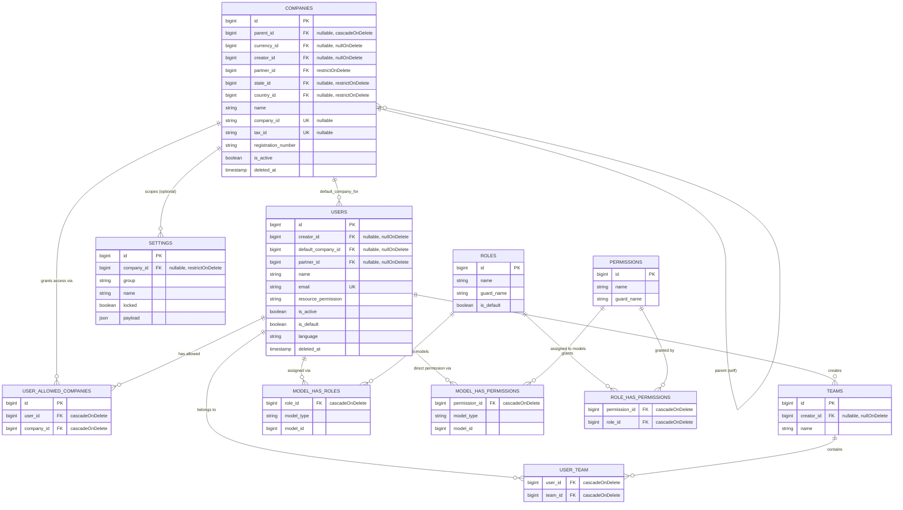
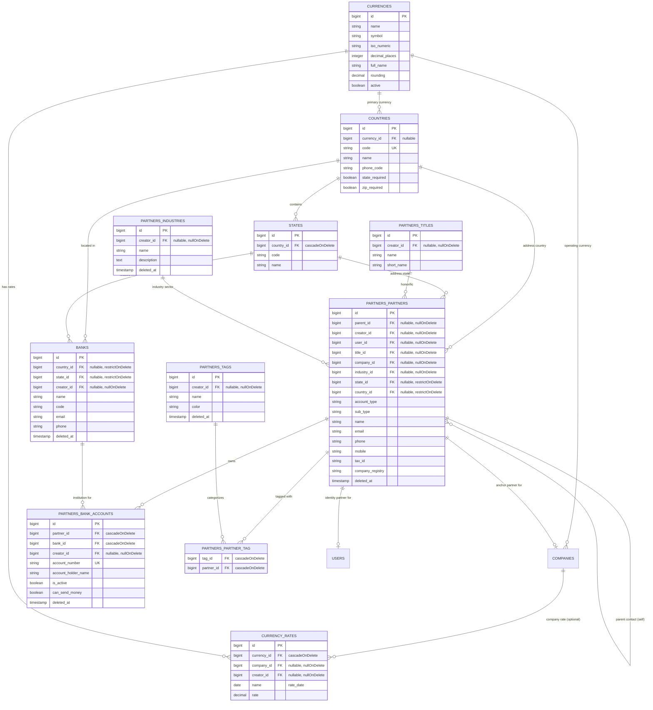
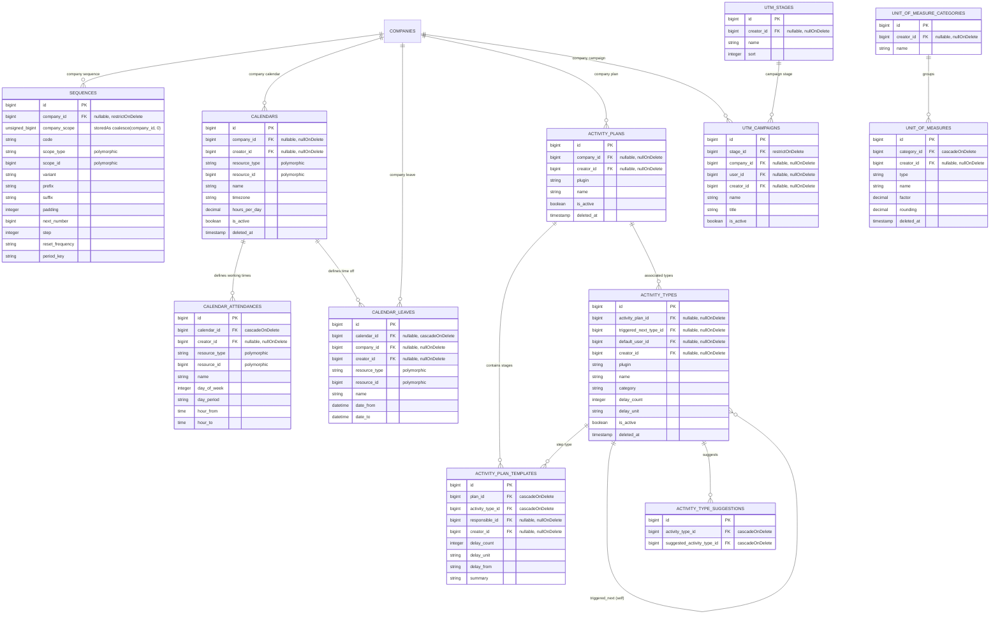
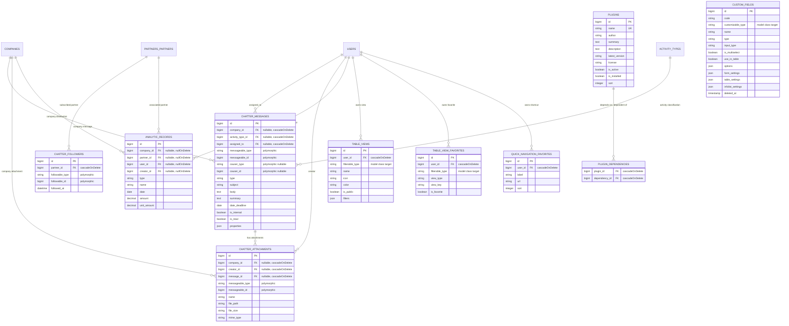

# Core Database ERD

[VERIFIED] This document provides the source-code-verified architectural Entity Relationship Diagram (ERD) and referential data model for the Core database area of Aureus ERP. It documents physical database tables, column structures, referential integrity constraints, Eloquent model mappings, company isolation boundaries, polymorphic interfaces, and dynamic runtime relationships established in the foundational Core plugins and root application migrations.

The ERD serves as an architectural map and source of truth for engineering analysis; it does not replace underlying Laravel migrations or Eloquent model implementations.

---

## Verification Metadata

- **Status**: [VERIFIED]
- **Last Verified**: 2026-08-27
- **Confidence**: High (all physical tables, foreign keys, model relationships, and traits verified against source code)
- **Scope**: Core Database Area (Root Migrations, `support`, `security`, `partners`, `chatter`, `fields`, `analytics`, `plugin-manager`, `table-views`, `full-calendar`)

---

## Scope

### Included Core Plugins

The Core database model encompasses root framework migrations and 9 verified Core plugins defined in `bootstrap/providers.php` and configured via `Package::isCore()`:

1. **`support` (`Webkul\Support`)**: Foundational multi-tenant primitives, multi-company tree (`companies`), currency management (`currencies`, `currency_rates`), geographical data (`countries`, `states`, `banks`), document numbering engines (`sequences`), work calendars (`calendars`, `calendar_attendances`, `calendar_leaves`), activity planning framework (`activity_plans`, `activity_plan_templates`, `activity_types`, `activity_type_suggestions`), units of measure (`unit_of_measures`, `unit_of_measure_categories`), campaign tracking (`utm_campaigns`, `utm_stages`, `utm_mediums`, `utm_sources`), and UI navigation (`quick_navigation_favorites`).
2. **`security` (`Webkul\Security`)**: Identity and access management, user security extensions (`users`), organizational teams (`teams`, `user_team`), user invitations (`user_invitations`), and role-based access control (`roles`, `permissions`, `model_has_roles`, `model_has_permissions`, `role_has_permissions`).
3. **`partners` (`Webkul\Partner`)**: Central master data hub for business parties, individuals, contacts, addresses (`partners_partners`), bank accounts (`partners_bank_accounts`), organizational classifications (`partners_industries`, `partners_titles`), and tagging (`partners_tags`, `partners_partner_tag`).
4. **`chatter` (`Webkul\Chatter`)**: Unified cross-cutting communication engine providing record-level audit logging, internal messaging, task assignments (`chatter_messages`), binary file attachments (`chatter_attachments`), and record subscriber tracking (`chatter_followers`).
5. **`fields` (`Webkul\Field`)**: Runtime customizable metadata system defining dynamic custom attributes per model (`custom_fields`).
6. **`analytics` (`Webkul\Analytic`)**: Shared foundational ledger for financial and operational analytic distribution records (`analytic_records`).
7. **`plugin-manager` (`Webkul\PluginManager`)**: Internal system module catalog (`plugins`) and runtime plugin dependency tracking (`plugin_dependencies`).
8. **`table-views` (`Webkul\TableViews`)**: Filament table personalization, saved filter definitions (`table_views`), and user favorites (`table_view_favorites`).
9. **`full-calendar` (`Webkul\FullCalendar`)**: Core UI/Livewire plugin verified to contain zero database tables or migrations (see [Tables / Models Intentionally Excluded](#tables--models-intentionally-excluded)).

### Excluded Plugins

All 19 optional domain plugins are excluded from the Core ERD: `accounting`, `accounts`, `barcode`, `blogs`, `contacts`, `employees`, `inventories`, `invoices`, `maintenance`, `manufacturing`, `payments`, `products`, `projects`, `purchases`, `recruitments`, `sales`, `time-off`, `timesheets`, and `website`.

*Rationale*:
- Optional plugins represent transactional domain workflows (e.g. Sales Orders, Invoices, Manufacturing BOMs) and will be documented in their dedicated domain ERDs.
- Dynamic extensions (such as `accounts` adding financial relations to `Partner` via `resolveRelationUsing()`) are analyzed under [Dynamic Relationships](#dynamic-relationships) and [Cross-Plugin Relationships](#cross-plugin-relationships), but optional domain tables are not incorporated into Core foundation diagrams.

---

## Database Strategy

[VERIFIED] Architectural characteristics verified from migrations and model definitions:

- **Single Database Multi-Company Architecture**:
  The application utilizes a shared-table multi-tenant data architecture where tenant isolation is achieved via `company_id` foreign keys and application-level global query scopes.
  - Evidence: `plugins/webkul/support/src/Models/Scopes/CompanyScope.php`, `plugins/webkul/support/src/Traits/BelongsToCompany.php`
- **Primary Keys**:
  - Auto-incrementing 64-bit unsigned integers (`BIGINT` via Laravel `$table->id()`) are standard for all primary domain entities, master records, and transaction logs.
  - UUID primary keys are restricted to framework notification storage (`notifications.id`).
  - String primary keys are restricted to framework sessions (`sessions.id`) and cache (`cache.key`).
  - Compound primary keys are utilized on Spatie permission pivot tables (`model_has_roles`, `model_has_permissions`, `role_has_permissions`).
  - Evidence: `plugins/webkul/support/database/migrations/2024_12_10_092657_create_companies_table.php`, `database/migrations/2026_01_14_151113_create_notifications_table.php`
- **Foreign Key Conventions & Referential Integrity**:
  Physical database constraints enforce relational integrity across MySQL/PostgreSQL databases using standard naming (`constrained('<table>')` or `references('id')->on('<table>')`). Deletion behaviors are strictly differentiated:
  - `nullOnDelete()` (59.7% of repository FKs): Used when parent entity deletion preserves historical or decoupled audit records (e.g. `creator_id`, `company_id` on master data, `industry_id`).
  - `restrictOnDelete()` (17.8% of repository FKs): Used on foundational configuration data to block deletion if children depend on it (e.g. `companies.partner_id`, `companies.state_id`, `sequences.company_id`, `settings.company_id`).
  - `cascadeOnDelete()` (22.2% of repository FKs): Used on tightly coupled child records and pure junction pivots (e.g. `user_allowed_companies`, `user_team`, `chatter_followers`, `partners_partner_tag`, `plugin_dependencies`).
  - Evidence: `plugins/webkul/support/database/migrations/`, `plugins/webkul/partners/database/migrations/`
- **Timestamps and Soft Deletes**:
  - `created_at` and `updated_at` timestamps are present on all primary entities.
  - `SoftDeletes` (`deleted_at` timestamp) is implemented on critical business entities to prevent accidental data destruction: `companies`, `partners_partners`, `partners_bank_accounts`, `partners_industries`, `partners_tags`, `users`, `banks`, `calendars`, `activity_plans`, `activity_types`, `unit_of_measures`, and `custom_fields`.
  - Evidence: Model class declarations and migration blueprints.
- **Polymorphic Columns**:
  Laravel standard polymorphic pairs (`*_type` string + `*_id` unsigned big integer) represent multi-target relationships across core services (`chatter_messages.messageable`, `chatter_attachments.messageable`, `chatter_followers.followable`, `sequences.scope`, `calendar_attendances.resource`, `calendar_leaves.resource`, `personal_access_tokens.tokenable`, `notifications.notifiable`).
  - Evidence: `plugins/webkul/chatter/database/migrations/`, `plugins/webkul/support/database/migrations/`
- **Flexible JSON Payload Storage**:
  Structured JSON columns store dynamic configurations and properties: `settings.payload`, `chatter_messages.properties`, `custom_fields.options`, `custom_fields.form_settings`, `custom_fields.table_settings`, `custom_fields.infolist_settings`, `table_views.filters`.
  - Evidence: `database/migrations/2022_12_14_083707_create_settings_table.php`, `plugins/webkul/fields/database/migrations/2024_11_13_052541_create_custom_fields_table.php`

---

## Core Entity Inventory

The following table catalogs the 32 verified database tables and models constituting the Core architecture:

| Entity | Plugin | Table | Model | Company Scoped | Key Relationships / Physical Constraints | Status |
|---|---|---|---|---|---|---|
| **Company** | `support` | `companies` | `Webkul\Support\Models\Company` | `AllowedCompanyScope` (`RestrictToAllowedCompanies`) | Self (parent_id), Creator (User), Currency, Partner, State, Country | [VERIFIED] |
| **UserAllowedCompany** | `support` | `user_allowed_companies` | Pivot (`User::allowedCompanies()`) | Junction Table | User (cascade), Company (cascade) | [VERIFIED] |
| **User** | `security` / Root | `users` | `Webkul\Security\Models\User` / `App\Models\User` | No (Multi-tenant Actor) | Default Company, Partner, Creator, Teams (pivot), Roles (pivot) | [VERIFIED] |
| **Team** | `security` | `teams` | `Webkul\Security\Models\Team` | No (Global Ownership) | Creator (User), Users (pivot `user_team`) | [VERIFIED] |
| **UserTeam** | `security` | `user_team` | Pivot (`User::teams()`) | Junction Table | User (cascade), Team (cascade) | [VERIFIED] |
| **UserInvitation** | `security` | `user_invitations` | `Webkul\Security\Models\Invitation` | No | System entity | [VERIFIED] |
| **Role** | `security` | `roles` | `Webkul\Security\Models\Role` | No (Global RBAC) | Permissions (pivot `role_has_permissions`), Users (pivot `model_has_roles`) | [VERIFIED] |
| **Permission** | `security` | `permissions` | `Webkul\Security\Models\Permission` | No (Global RBAC) | Roles (pivot), Models (pivot `model_has_permissions`) | [VERIFIED] |
| **Partner** | `partners` | `partners_partners` | `Webkul\Partner\Models\Partner` | Yes (`BelongsToCompany`, manual assignment) | Self (parent_id), User, Company, Title, Industry, State, Country, Bank Accounts, Tags | [VERIFIED] |
| **BankAccount** | `partners` | `partners_bank_accounts` | `Webkul\Partner\Models\BankAccount` | Via Partner | Partner (cascade), Bank (cascade), Creator (User) | [VERIFIED] |
| **Bank** | `support` | `banks` | `Webkul\Support\Models\Bank` | No (Global Master) | State, Country, Creator (User) | [VERIFIED] |
| **Industry** | `partners` | `partners_industries` | `Webkul\Partner\Models\Industry` | No (Global Master) | Creator (User) | [VERIFIED] |
| **Title** | `partners` | `partners_titles` | `Webkul\Partner\Models\Title` | No (Global Master) | Creator (User) | [VERIFIED] |
| **Tag** | `partners` | `partners_tags` | `Webkul\Partner\Models\Tag` | No (Global Master) | Partners (pivot `partners_partner_tag`), Creator (User) | [VERIFIED] |
| **PartnerTag** | `partners` | `partners_partner_tag` | Pivot (`Partner::tags()`) | Junction Table | Partner (cascade), Tag (cascade) | [VERIFIED] |
| **Currency** | `support` | `currencies` | `Webkul\Support\Models\Currency` | No (Global Reference) | Rates (hasMany), Companies (hasMany) | [VERIFIED] |
| **CurrencyRate** | `support` | `currency_rates` | `Webkul\Support\Models\CurrencyRate` | Explicit column (nullable) | Currency (cascade), Company (nullable FK), Creator (User) | [VERIFIED] |
| **Country** | `support` | `countries` | `Webkul\Support\Models\Country` | No (Global Reference) | Currency, States (hasMany) | [VERIFIED] |
| **State** | `support` | `states` | `Webkul\Support\Models\State` | No (Global Reference) | Country | [VERIFIED] |
| **Sequence** | `support` | `sequences` | `Webkul\Support\Models\Sequence` | Yes (`BelongsToCompany`, manual assignment) | Company (restrict), Polymorphic Scope (`scope_type`, `scope_id`) | [VERIFIED] |
| **Calendar** | `support` | `calendars` | `Webkul\Support\Models\Calendar` | Yes (`BelongsToCompany`, manual assignment) | Company, Creator (User), Attendances (hasMany), Polymorphic Resource | [VERIFIED] |
| **CalendarAttendance** | `support` | `calendar_attendances` | `Webkul\Support\Models\CalendarAttendance` | Via Calendar | Calendar (cascade), Creator (User), Polymorphic Resource | [VERIFIED] |
| **CalendarLeave** | `support` | `calendar_leaves` | `Webkul\Support\Models\CalendarLeave` | Yes (`BelongsToCompany`) | Calendar (cascade), Company, Creator (User), Polymorphic Resource | [VERIFIED] |
| **ActivityPlan** | `support` | `activity_plans` | `Webkul\Support\Models\ActivityPlan` | Yes (`BelongsToCompany`) | Company, Creator (User), Activity Types (hasMany), Plan Templates (hasMany) | [VERIFIED] |
| **ActivityPlanTemplate** | `support` | `activity_plan_templates` | `Webkul\Support\Models\ActivityPlanTemplate` | Via Activity Plan | Plan (cascade), Activity Type (cascade), Responsible (User), Creator (User) | [VERIFIED] |
| **ActivityType** | `support` | `activity_types` | `Webkul\Support\Models\ActivityType` | No (Global Setup) | Activity Plan, Next Activity Type (self), Suggested (pivot), Creator (User) | [VERIFIED] |
| **ActivityTypeSuggestion** | `support` | `activity_type_suggestions` | Pivot (`ActivityType::suggestedActivityTypes()`) | Junction Table | Activity Type (cascade), Suggested Activity Type (cascade) | [VERIFIED] |
| **UOMCategory** | `support` | `unit_of_measure_categories` | `Webkul\Support\Models\UOMCategory` | No (Global Master) | Creator (User), UOMs (hasMany) | [VERIFIED] |
| **UOM** | `support` | `unit_of_measures` | `Webkul\Support\Models\UOM` | No (Global Master) | Category (cascade), Creator (User) | [VERIFIED] |
| **UTMStage** | `support` | `utm_stages` | `Webkul\Support\Models\UtmStage` | No (Global Master) | Creator (User) | [VERIFIED] |
| **UTMMedium** | `support` | `utm_mediums` | `Webkul\Support\Models\UTMMedium` | No (Global Master) | Creator (User) | [VERIFIED] |
| **UTMSource** | `support` | `utm_sources` | `Webkul\Support\Models\UTMSource` | No (Global Master) | Creator (User) | [VERIFIED] |
| **UTMCampaign** | `support` | `utm_campaigns` | `Webkul\Support\Models\UtmCampaign` | Yes (`BelongsToCompany`, manual assignment) | Company (nullOnDelete), Stage (restrict), User (nullOnDelete), Creator (User) | [VERIFIED] |
| **EmailLog** | `support` | `email_logs` | `Webkul\Support\Models\EmailLog` | No (System Audit) | None | [VERIFIED] |
| **QuickNavFavorite** | `support` | `quick_navigation_favorites` | `Webkul\Support\Models\QuickNavigationFavorite` | Via User | User (cascade) | [VERIFIED] |
| **Message** | `chatter` | `chatter_messages` | `Webkul\Chatter\Models\Message` | Yes (`BelongsToCompany`) | Company (cascade), Activity Type (cascade), Assigned User (cascade), Morph Messageable, Morph Causer | [VERIFIED] |
| **Attachment** | `chatter` | `chatter_attachments` | `Webkul\Chatter\Models\Attachment` | Yes (`BelongsToCompany`) | Company (cascade), Creator (User, cascade), Message (cascade), Morph Messageable | [VERIFIED] |
| **Follower** | `chatter` | `chatter_followers` | `Webkul\Chatter\Models\Follower` | Via Target Entity | Partner (cascade), Morph Followable | [VERIFIED] |
| **CustomField** | `fields` | `custom_fields` | `Webkul\Field\Models\Field` | No (Global Schema Definition) | Polymorphic Target (`customizable_type`) | [VERIFIED] |
| **AnalyticRecord** | `analytics` | `analytic_records` | `Webkul\Analytic\Models\Record` | Yes (`BelongsToCompany`) | Company (nullOnDelete), Partner (nullOnDelete), User (nullOnDelete), Creator (User) | [VERIFIED] |
| **Plugin** | `plugin-manager` | `plugins` | `Webkul\PluginManager\Models\Plugin` | No (System Metadata) | Dependencies (pivot `plugin_dependencies`) | [VERIFIED] |
| **PluginDependency** | `plugin-manager` | `plugin_dependencies` | Pivot (`Plugin::dependencies()`) | Junction Table | Plugin (cascade), Dependency Plugin (cascade) | [VERIFIED] |
| **TableView** | `table-views` | `table_views` | `Webkul\TableViews\Models\TableView` | Via User | User (cascade), Target Model (`filterable_type`) | [VERIFIED] |
| **TableViewFavorite** | `table-views` | `table_view_favorites` | `Webkul\TableViews\Models\TableViewFavorite` | Via User | User (cascade), Target Model (`filterable_type`) | [VERIFIED] |
| **Setting** | Root | `settings` | System Table | Explicit column (nullable) | Company (restrict, nullable) | [VERIFIED] |

---

## Core Database ERD

To ensure architectural clarity, the Core database model is structured into four cohesive, verified ERD sub-graphs.

```
                    ┌──────────────────────────────────────────┐
                    │      Aureus ERP Core Architecture        │
                    └─────────────────────┬────────────────────┘
                                          │
        ┌───────────────────┬─────────────┴───────┬───────────────────┐
        ▼                   ▼                     ▼                   ▼
┌───────────────┐   ┌───────────────┐     ┌───────────────┐   ┌───────────────┐
│ Multi-Company │   │ Master Data & │     │  Operations,  │   │ Collaboration │
│ & Identity    │   │ Partners Hub  │     │  Calendars &  │   │  & Platform   │
│   (Graph 1)   │   │   (Graph 2)   │     │   Sequences   │   │   Services    │
│               │   │               │     │   (Graph 3)   │   │   (Graph 4)   │
└───────────────┘   └───────────────┘     └───────────────┘   └───────────────┘
```

### Graph 1: Multi-Company, Identity & Security Foundation

This sub-graph captures company multi-tenancy, user authentication, allowed company access pivots, organizational teams, system settings, and RBAC roles/permissions.



---

### Graph 2: Master Data & Partners Hub

This sub-graph maps business partner master records, hierarchical contacts, addresses, partner bank accounts, organizational titles/industries, tags, banks, currencies, currency exchange rates, countries, and states.



---

### Graph 3: Core Operations, Calendars, Sequences & Activities

This sub-graph maps numbering sequences, working calendars, schedule attendance/leaves, activity planning templates, units of measure, and UTM campaign attribution.



---

### Graph 4: Collaboration, Custom Fields, Analytics & Platform Services

This sub-graph maps Chatter messages, attachments, followers, custom field definitions, analytic ledger records, table view state, and plugin registry metadata.



---

## Relationship Evidence

For every relationship depicted in the Core ERD, verified source evidence is documented below:

### 1. Multi-Company & Identity Relationships
- [VERIFIED] **companies.parent_id → companies.id** (Self-referencing tree)
  - Evidence: `plugins/webkul/support/src/Models/Company.php`
  - Symbol: `Company::parent()`, `Company::branches()`
  - Migration: `plugins/webkul/support/database/migrations/2024_12_10_092657_create_companies_table.php` (`cascadeOnDelete()`)
- [VERIFIED] **companies.currency_id → currencies.id**
  - Evidence: `plugins/webkul/support/src/Models/Company.php`
  - Symbol: `Company::currency()`
  - Migration: `plugins/webkul/support/database/migrations/2024_12_10_092657_create_companies_table.php` (`nullOnDelete()`)
- [VERIFIED] **companies.partner_id → partners_partners.id**
  - Evidence: `plugins/webkul/support/src/Models/Company.php`
  - Symbol: `Company::partner()` (queried with `withoutGlobalScope(CompanyScope::class)`)
  - Migration: `plugins/webkul/support/database/migrations/2025_01_07_125015_add_partner_id_to_companies_table.php` (`restrictOnDelete()`)
- [VERIFIED] **companies.state_id / country_id → states.id / countries.id**
  - Evidence: `plugins/webkul/support/src/Models/Company.php`
  - Symbol: `Company::state()`, `Company::country()`
  - Migration: `plugins/webkul/support/database/migrations/2025_04_04_061507_add_address_columns_in_companies_table.php` (`restrictOnDelete()`)
- [VERIFIED] **user_allowed_companies.user_id / company_id → users.id / companies.id**
  - Evidence: `plugins/webkul/security/src/Models/User.php`
  - Symbol: `User::allowedCompanies()`
  - Migration: `plugins/webkul/support/database/migrations/2024_12_10_100944_create_user_allowed_companies_table.php` (`cascadeOnDelete()`)
- [VERIFIED] **users.default_company_id → companies.id**
  - Evidence: `plugins/webkul/security/src/Models/User.php`
  - Symbol: `User::defaultCompany()`
  - Migration: `plugins/webkul/security/database/migrations/2024_12_10_101127_add_default_company_id_column_to_users_table.php` (`nullOnDelete()`)
- [VERIFIED] **users.partner_id → partners_partners.id**
  - Evidence: `plugins/webkul/security/src/Models/User.php`
  - Symbol: `User::partner()` (queried with `withoutGlobalScope(CompanyScope::class)`)
  - Migration: `plugins/webkul/security/database/migrations/2024_12_13_130906_add_partner_id_to_users_table.php` (`nullOnDelete()`)
- [VERIFIED] **user_team.user_id / team_id → users.id / teams.id**
  - Evidence: `plugins/webkul/security/src/Models/User.php`, `plugins/webkul/security/src/Models/Team.php`
  - Symbol: `User::teams()`, `Team::users()`
  - Migration: `plugins/webkul/security/database/migrations/2024_11_12_130019_create_user_team_table.php` (`cascadeOnDelete()`)
- [VERIFIED] **settings.company_id → companies.id**
  - Evidence: `database/migrations/2026_07_21_100000_add_company_id_to_settings_table.php`
  - Symbol: `Schema::table('settings', ...)` (`restrictOnDelete()`)

### 2. Master Data & Partner Relationships
- [VERIFIED] **partners_partners.parent_id → partners_partners.id**
  - Evidence: `plugins/webkul/partners/src/Models/Partner.php`
  - Symbol: `Partner::parent()`, `Partner::addresses()`, `Partner::contacts()`
  - Migration: `plugins/webkul/partners/database/migrations/2024_12_11_101220_create_partners_partners_table.php` (`nullOnDelete()`)
- [VERIFIED] **partners_partners.company_id → companies.id**
  - Evidence: `plugins/webkul/partners/src/Models/Partner.php`
  - Symbol: `Partner::company()`
  - Migration: `plugins/webkul/partners/database/migrations/2024_12_11_101220_create_partners_partners_table.php` (`nullOnDelete()`)
- [VERIFIED] **partners_partners.user_id / creator_id → users.id**
  - Evidence: `plugins/webkul/partners/src/Models/Partner.php`
  - Symbol: `Partner::user()`, `Partner::creator()`
  - Migration: `plugins/webkul/partners/database/migrations/2024_12_11_101220_create_partners_partners_table.php` (`nullOnDelete()`)
- [VERIFIED] **partners_partners.title_id → partners_titles.id**
  - Evidence: `plugins/webkul/partners/src/Models/Partner.php`
  - Symbol: `Partner::title()`
  - Migration: `plugins/webkul/partners/database/migrations/2024_12_11_101220_create_partners_partners_table.php` (`nullOnDelete()`)
- [VERIFIED] **partners_partners.industry_id → partners_industries.id**
  - Evidence: `plugins/webkul/partners/src/Models/Partner.php`
  - Symbol: `Partner::industry()`
  - Migration: `plugins/webkul/partners/database/migrations/2024_12_11_101220_create_partners_partners_table.php` (`nullOnDelete()`)
- [VERIFIED] **partners_partners.state_id / country_id → states.id / countries.id**
  - Evidence: `plugins/webkul/partners/src/Models/Partner.php`
  - Symbol: `Partner::state()`, `Partner::country()`
  - Migration: `plugins/webkul/partners/database/migrations/2025_03_28_115218_add_address_columns_in_partners_partners_table.php` (`restrictOnDelete()`)
- [VERIFIED] **partners_bank_accounts.partner_id / bank_id → partners_partners.id / banks.id**
  - Evidence: `plugins/webkul/partners/src/Models/BankAccount.php`
  - Symbol: `BankAccount::partner()`, `BankAccount::bank()`
  - Migration: `plugins/webkul/partners/database/migrations/2024_12_11_101420_create_partners_bank_accounts_table.php` (`cascadeOnDelete()`)
- [VERIFIED] **partners_partner_tag.tag_id / partner_id → partners_tags.id / partners_partners.id**
  - Evidence: `plugins/webkul/partners/src/Models/Partner.php`
  - Symbol: `Partner::tags()`
  - Migration: `plugins/webkul/partners/database/migrations/2024_12_11_111929_create_partners_partner_tag_table.php` (`cascadeOnDelete()`)
- [VERIFIED] **currency_rates.currency_id / company_id → currencies.id / companies.id**
  - Evidence: `plugins/webkul/support/src/Models/CurrencyRate.php`, `plugins/webkul/support/src/Models/Currency.php`
  - Symbol: `CurrencyRate::currency()`, `CurrencyRate::company()`, `Currency::rates()`
  - Migration: `plugins/webkul/support/database/migrations/2025_10_10_080114_create_currency_rates_table.php` (`currency_id` cascade, `company_id` nullOnDelete)
- [VERIFIED] **states.country_id → countries.id**
  - Evidence: `plugins/webkul/support/src/Models/State.php`, `plugins/webkul/support/src/Models/Country.php`
  - Symbol: `State::country()`, `Country::states()`
  - Migration: `plugins/webkul/support/database/migrations/2024_12_10_092657_create_states_table.php` (`cascadeOnDelete()`)

### 3. Operations, Calendars, Sequences & Activities
- [VERIFIED] **sequences.company_id → companies.id**
  - Evidence: `plugins/webkul/support/src/Models/Sequence.php`
  - Symbol: `Sequence::company()`
  - Migration: `plugins/webkul/support/database/migrations/2026_08_03_120000_create_sequences_table.php` (`restrictOnDelete()`)
- [VERIFIED] **calendars.company_id → companies.id**
  - Evidence: `plugins/webkul/support/src/Models/Calendar.php`
  - Symbol: `Calendar::company()`
  - Migration: `plugins/webkul/support/database/migrations/2026_04_02_000001_create_calendars_table.php` (`nullOnDelete()`)
- [VERIFIED] **calendar_attendances.calendar_id → calendars.id**
  - Evidence: `plugins/webkul/support/src/Models/CalendarAttendance.php`, `plugins/webkul/support/src/Models/Calendar.php`
  - Symbol: `CalendarAttendance::calendar()`, `Calendar::attendance()`
  - Migration: `plugins/webkul/support/database/migrations/2026_04_02_000001_create_calendars_table.php` (`cascadeOnDelete()`)
- [VERIFIED] **calendar_leaves.calendar_id / company_id → calendars.id / companies.id**
  - Evidence: `plugins/webkul/support/src/Models/CalendarLeave.php`
  - Symbol: `CalendarLeave::calendar()`, `CalendarLeave::company()`
  - Migration: `plugins/webkul/support/database/migrations/2026_04_02_000001_create_calendars_table.php` (`calendar_id` cascade, `company_id` nullOnDelete)
- [VERIFIED] **activity_plan_templates.plan_id / activity_type_id → activity_plans.id / activity_types.id**
  - Evidence: `plugins/webkul/support/src/Models/ActivityPlanTemplate.php`, `plugins/webkul/support/src/Models/ActivityPlan.php`
  - Symbol: `ActivityPlanTemplate::activityPlan()`, `ActivityPlanTemplate::activityType()`, `ActivityPlan::activityPlanTemplates()`
  - Migration: `plugins/webkul/support/database/migrations/2024_12_12_115728_create_activity_plan_templates_table.php` (`cascadeOnDelete()`)
- [VERIFIED] **activity_type_suggestions.activity_type_id / suggested_activity_type_id → activity_types.id**
  - Evidence: `plugins/webkul/support/src/Models/ActivityType.php`
  - Symbol: `ActivityType::suggestedActivityTypes()`
  - Migration: `plugins/webkul/support/database/migrations/2024_12_17_082318_create_activity_type_suggestions_table.php` (`cascadeOnDelete()`)
- [VERIFIED] **unit_of_measures.category_id → unit_of_measure_categories.id**
  - Evidence: `plugins/webkul/support/src/Models/UOM.php`
  - Symbol: `UOM::category()`
  - Migration: `plugins/webkul/support/database/migrations/2025_01_03_105627_create_unit_of_measures_table.php` (`cascadeOnDelete()`)
- [VERIFIED] **utm_campaigns.stage_id / company_id → utm_stages.id / companies.id**
  - Evidence: `plugins/webkul/support/src/Models/UtmCampaign.php`
  - Symbol: `UtmCampaign::stage()`, `UtmCampaign::company()`
  - Migration: `plugins/webkul/support/database/migrations/2025_01_10_094325_create_utm_campaigns_table.php` (`stage_id` restrict, `company_id` nullOnDelete)

### 4. Collaboration, Analytics & System Relationships
- [VERIFIED] **chatter_messages.company_id / activity_type_id / assigned_to → companies.id / activity_types.id / users.id**
  - Evidence: `plugins/webkul/chatter/src/Models/Message.php`
  - Symbol: `Message::company()`, `Message::activityType()`, `Message::assignedTo()`
  - Migration: `plugins/webkul/chatter/database/migrations/2024_12_23_062355_create_chatter_messages_table.php` (`cascadeOnDelete()`)
- [VERIFIED] **chatter_attachments.message_id / company_id / creator_id → chatter_messages.id / companies.id / users.id**
  - Evidence: `plugins/webkul/chatter/src/Models/Attachment.php`
  - Symbol: `Attachment::message()`, `Attachment::company()`, `Attachment::creator()`
  - Migration: `plugins/webkul/chatter/database/migrations/2024_12_23_080148_create_chatter_attachments_table.php` (`cascadeOnDelete()`)
- [VERIFIED] **chatter_followers.partner_id → partners_partners.id**
  - Evidence: `plugins/webkul/chatter/src/Models/Follower.php`
  - Symbol: `Follower::partner()`
  - Migration: `plugins/webkul/chatter/database/migrations/2024_12_11_101222_create_chatter_followers_table.php` (`cascadeOnDelete()`)
- [VERIFIED] **analytic_records.company_id / partner_id / user_id → companies.id / partners_partners.id / users.id**
  - Evidence: `plugins/webkul/analytics/src/Models/Record.php`
  - Symbol: `Record::company()`, `Record::partner()`, `Record::user()`
  - Migration: `plugins/webkul/analytics/database/migrations/2024_12_18_131844_create_analytic_records_table.php` (`nullOnDelete()`)
- [VERIFIED] **plugin_dependencies.plugin_id / dependency_id → plugins.id**
  - Evidence: `plugins/webkul/plugin-manager/src/Models/Plugin.php`
  - Symbol: `Plugin::dependencies()`, `Plugin::dependents()`
  - Migration: `plugins/webkul/support/database/migrations/2024_11_05_105112_create_plugin_dependencies_table.php` (`cascadeOnDelete()`)
- [VERIFIED] **table_views.user_id → users.id** / **table_view_favorites.user_id → users.id**
  - Evidence: `plugins/webkul/table-views/src/Models/TableView.php`, `plugins/webkul/table-views/src/Models/TableViewFavorite.php`
  - Symbol: `TableView::user()`, `TableViewFavorite::user()`
  - Migration: `plugins/webkul/table-views/database/migrations/2024_11_19_142134_create_table_views_table.php` (`cascadeOnDelete()`)

---

## Company Isolation

Company isolation in Aureus ERP separates database-level foreign key facts from application-level Eloquent query scopes.

```
                      ┌────────────────────────┐
                      │     CompanyContext     │
                      └───────────┬────────────┘
                                  │ activeIds()
                 ┌────────────────┴────────────────┐
                 ▼                                 ▼
       ┌──────────────────┐               ┌──────────────────┐
       │   CompanyScope   │               │  CompaniesScope  │
       └─────────┬────────┘               └────────┬─────────┘
                 │ whereIn(company_id)             │ whereHas(companies)
                 ▼                                 ▼
       ┌──────────────────┐               ┌──────────────────┐
       │ BelongsToCompany │               │BelongsToCompanies│
       │(Single-Company)  │               │ (Multi-Company)  │
       └──────────────────┘               └──────────────────┘
```

### 1. Mechanisms and Scopes

- **`CompanyContext` (`Webkul\Support\Services\CompanyContext`)**:
  [VERIFIED] Resolves the active company / companies selected in the session, checks whether the active user is an internal user, and provides `activeIds()`, `currentId()`, and bypass controls.
- **`CompanyScope` (`Webkul\Support\Models\Scopes\CompanyScope`)**:
  [VERIFIED] Global scope applied by `BelongsToCompany`. Filters queries to `WHERE company_id IN (activeIds) OR company_id IS NULL`. When executed in console (outside unit tests) or when bypassed, filtering is omitted.
- **`AllowedCompanyScope` (`Webkul\Support\Models\Scopes\AllowedCompanyScope`)**:
  [VERIFIED] Applied exclusively to `Company` model via `RestrictToAllowedCompanies`. Filters companies to those present in `user_allowed_companies` for the authenticated internal user.
- **`CompaniesScope` (`Webkul\Support\Models\Scopes\CompaniesScope`)**:
  [VERIFIED] Global scope for multi-company pivot models (e.g. `Account`). Filters records where related companies match active IDs or where no company relation is attached.

### 2. Categorization of Core Entities

| Scoping Strategy | Core Entities | Behavior & Rules |
|---|---|---|
| **Single-Company with Auto-Assignment** (`BelongsToCompany`) | `ActivityPlan`, `CalendarLeave`, `Message`, `Attachment`, `AnalyticRecord` | Automatically injects `company_id = CompanyContext::currentId()` on record creation; filtered by `CompanyScope`. |
| **Single-Company with Manual Assignment** (`BelongsToCompany` with `autoAssignsCompany(): false`) | `Partner`, `Sequence`, `Calendar`, `UtmCampaign` | Model adopts `CompanyScope` filtering but overrides `autoAssignsCompany()` to `false`. Explicitly allows records to remain global (`company_id = NULL`) unless assigned to a company. |
| **User-Allowed Company Scope** (`RestrictToAllowedCompanies`) | `Company` | Adopts `AllowedCompanyScope`. Filtered based on `user_allowed_companies` junction entries. |
| **Direct Schema Column (No Scope Trait)** | `CurrencyRate`, `Setting` | Column `company_id` exists in schema for company-specific overrides, but the model has no automatic company global scope. Queries explicitly match specific `company_id` or fall back to `NULL`. |
| **Global Shared Master / Setup Records** (No `company_id`) | `User`, `Team`, `Role`, `Permission`, `Currency`, `Country`, `State`, `Bank`, `Industry`, `Title`, `Tag`, `ActivityType`, `ActivityPlanTemplate`, `UOMCategory`, `UOM`, `UTMStage`, `UTMMedium`, `UTMSource`, `CustomField`, `Plugin` | Global system entities shared across all companies in the tenant database. |
| **Child Records Inheriting Isolation via Parent** | `BankAccount` (via Partner), `CalendarAttendance` (via Calendar), `Follower` (via Polymorphic target) | Child tables without `company_id` that inherit isolation through cascade foreign keys to their company-scoped parent entity. |

### 3. Cross-Company Boundaries

[VERIFIED]
- **Partner Sharing**: `partners_partners.company_id` is nullable. Non-user business contacts can be shared globally (`company_id IS NULL`), while company-specific partners (e.g. company anchor partners) are restricted to that company.
  - Evidence: `plugins/webkul/partners/database/migrations/2026_07_30_100000_null_company_on_non_user_partners.php`
- **Global / Company Sequence Numbering**: `sequences.company_scope` is a virtual/stored generated column evaluated as `coalesce(company_id, 0)`. This allows global sequences (`company_id = null`, `company_scope = 0`) and company-specific sequences (`company_id = X`, `company_scope = X`) to coexist under compound unique indexes (`code, company_scope`).
  - Evidence: `plugins/webkul/support/database/migrations/2026_08_03_120000_create_sequences_table.php`
- **User Company Portability**: Users exist globally (`users.id`) and are granted multi-company access via `user_allowed_companies` with a preferred default in `users.default_company_id`.
  - Evidence: `plugins/webkul/security/src/Models/User.php`

---

## Polymorphic Relationships

[VERIFIED] The following physical polymorphic interfaces are implemented within the Core database area:

| Morph Name | Owning Table | Morph Columns | Eloquent Relation | Verified Related Target Models | Migration Evidence |
|---|---|---|---|---|---|
| `messageable` | `chatter_messages` | `messageable_type`, `messageable_id` | `Message::messageable()` (`morphTo`) | `Partner`, `Company`, and any model adopting `HasChatter` (e.g. `Order`, `Invoice`) | `plugins/webkul/chatter/database/migrations/2024_12_23_062355_create_chatter_messages_table.php` |
| `causer` | `chatter_messages` | `causer_type`, `causer_id` (nullable) | `Message::causer()` (`morphTo`) | `User`, `Partner`, System actors | `plugins/webkul/chatter/database/migrations/2024_12_23_062355_create_chatter_messages_table.php` |
| `messageable` | `chatter_attachments` | `messageable_type`, `messageable_id` | `Attachment::messageable()` (`morphTo`) | Any model adopting `HasChatter` | `plugins/webkul/chatter/database/migrations/2024_12_23_080148_create_chatter_attachments_table.php` |
| `followable` | `chatter_followers` | `followable_type`, `followable_id` | `Follower::followable()` (`morphTo`) | Any model adopting `HasChatter` | `plugins/webkul/chatter/database/migrations/2024_12_11_101222_create_chatter_followers_table.php` |
| `scope` | `sequences` | `scope_type`, `scope_id` (nullable) | `Sequence::scope()` (`morphTo`) | `Company`, `Journal`, `Team`, or domain entities isolating sequence series | `plugins/webkul/support/database/migrations/2026_08_03_120000_create_sequences_table.php` |
| `resource` | `calendars` | `resource_type`, `resource_id` (nullable) | Polymorphic resource binding | `Employee`, `WorkCenter`, or domain resources | `plugins/webkul/support/database/migrations/2026_04_02_000001_create_calendars_table.php` |
| `resource` | `calendar_attendances` | `resource_type`, `resource_id` (nullable) | `CalendarAttendance::resource()` (`morphTo`) | `Employee`, `WorkCenter` | `plugins/webkul/support/database/migrations/2026_05_01_065935_add_resource_columns_in_calendar_attendances_table.php` |
| `resource` | `calendar_leaves` | `resource_type`, `resource_id` (nullable) | `CalendarLeave::resource()` (`morphTo`) | `Employee`, `WorkCenter` | `plugins/webkul/support/database/migrations/2026_04_29_065935_add_resource_columns_in_calendar_leaves_table.php` |
| `customizable` | `custom_fields` | `customizable_type` (type discriminator) | `Field::forCustomizable()` | Class name of any model adopting `HasCustomFields` (e.g. `Partner`, `Company`, `Product`) | `plugins/webkul/fields/database/migrations/2024_11_13_052541_create_custom_fields_table.php` |
| `filterable` | `table_views`, `table_view_favorites` | `filterable_type` (type discriminator) | Filter target binding | Model class names targeted by Filament table views | `plugins/webkul/table-views/database/migrations/2024_11_19_142134_create_table_views_table.php` |
| `model` | `model_has_roles`, `model_has_permissions` | `model_type`, `model_id` | Spatie Permission contracts | `User` (and any authenticatable security model) | `database/migrations/2024_11_04_132945_create_permission_tables.php` |
| `tokenable` | `personal_access_tokens` | `tokenable_type`, `tokenable_id` | Sanctum `HasApiTokens` | `User` | `database/migrations/2026_01_28_134402_create_personal_access_tokens_table.php` |
| `notifiable` | `notifications` | `notifiable_type`, `notifiable_id` | Laravel `Notifiable` | `User` | `database/migrations/2026_01_14_151113_create_notifications_table.php` |

---

## Dynamic Relationships

[VERIFIED] The repository leverages Laravel's `Model::resolveRelationUsing()` mechanism within plugin service providers to dynamically inject relationships into Core models at runtime without modifying the base class files.

### 1. Dynamic Relationships Registered on Core Models

The `Partner` core model (`Webkul\Partner\Models\Partner`) is dynamically extended by the optional `accounts` plugin (`Webkul\Account\AccountServiceProvider`):

```
┌──────────────────────────────────────┐
│  Webkul\Partner\Models\Partner (Core) │
└──────────────────┬───────────────────┘
                   │
                   │ resolveRelationUsing() via AccountServiceProvider
                   ▼
  ├── propertyAccountPayable ──────────► Webkul\Account\Models\Account
  ├── propertyAccountReceivable ───────► Webkul\Account\Models\Account
  ├── propertyAccountPosition ─────────► Webkul\Account\Models\FiscalPosition
  ├── propertyPaymentTerm ─────────────► Webkul\Account\Models\PaymentTerm
  ├── propertySupplierPaymentTerm ─────► Webkul\Account\Models\PaymentTerm
  ├── propertyOutboundPaymentMethodLine ► Webkul\Account\Models\PaymentMethodLine
  ├── propertyInboundPaymentMethodLine ─► Webkul\Account\Models\PaymentMethodLine
  └── partnerCompanyProperties ────────► Webkul\Account\Models\PartnerCompanyProperty
```

- **Evidence**: `plugins/webkul/accounts/src/AccountServiceProvider.php`
- **Symbols**:
  - `Partner::resolveRelationUsing('propertyAccountPayable', fn (Partner $partner) => $partner->belongsTo(Account::class, 'property_account_payable_id'))`
  - `Partner::resolveRelationUsing('propertyAccountReceivable', fn (Partner $partner) => $partner->belongsTo(Account::class, 'property_account_receivable_id'))`
  - `Partner::resolveRelationUsing('propertyAccountPosition', fn (Partner $partner) => $partner->belongsTo(FiscalPosition::class, 'property_account_position_id'))`
  - `Partner::resolveRelationUsing('propertyPaymentTerm', fn (Partner $partner) => $partner->belongsTo(PaymentTerm::class, 'property_payment_term_id'))`
  - `Partner::resolveRelationUsing('propertySupplierPaymentTerm', fn (Partner $partner) => $partner->belongsTo(PaymentTerm::class, 'property_supplier_payment_term_id'))`
  - `Partner::resolveRelationUsing('propertyOutboundPaymentMethodLine', fn (Partner $partner) => $partner->belongsTo(PaymentMethodLine::class, 'property_outbound_payment_method_line_id'))`
  - `Partner::resolveRelationUsing('propertyInboundPaymentMethodLine', fn (Partner $partner) => $partner->belongsTo(PaymentMethodLine::class, 'property_inbound_payment_method_line_id'))`
  - `Partner::resolveRelationUsing(CompanyProperty::RELATION, fn (Partner $partner) => $partner->hasMany(PartnerCompanyProperty::class))`

### 2. Architectural Impact & Integrity
- [VERIFIED] These relationships exist in the Eloquent ORM runtime only when the contributing plugin provider executes.
- [VERIFIED] The underlying database columns (`property_account_payable_id`, etc.) are created in `partners_partners` by the Accounts plugin migration `plugins/webkul/accounts/database/migrations/2026_02_16_063000_alter_partners_partners_table.php`.
- Static model inspection of `Webkul\Partner\Models\Partner` will not reveal these methods; developers and agents must inspect `AccountServiceProvider::packageBooted()` when working with partner financial properties.

---

## Cross-Plugin Relationships

[VERIFIED] Core entities serve as foundational relationship hubs for the entire ERP ecosystem. The primary cross-plugin relationship boundaries include:

1. **Foundational Hubs (`companies`, `users`, `currencies`)**:
   - `companies`: Referenced by ~102 downstream tables across all 19 domain plugins (e.g. `sales_orders.company_id`, `purchases_orders.company_id`, `accounts_accounts.company_id`, `inventories_operations.company_id`, `manufacturing_orders.company_id`).
   - `users`: Universal actor foreign key (`creator_id`, `user_id`, `assigned_to`, `manager_id`) across 180+ tables repository-wide.
   - `currencies`: Operating and transaction currency reference for `accounts_journals`, `sales_orders`, `purchases_orders`, `products_products`.
2. **Master Data Hub (`partners_partners`)**:
   - `sales` → `partners_partners`: `sales_orders.partner_id`, `sales_orders.partner_invoice_id`, `sales_orders.partner_shipping_id`.
   - `purchases` → `partners_partners`: `purchases_orders.partner_id`.
   - `accounts` → `partners_partners`: `accounts_account_moves.partner_id`, `accounts_payment_terms.partner_id`.
   - `payments` → `partners_partners`: `payments_payment_tokens.partner_id`.
3. **Measurement Hub (`unit_of_measures`, `unit_of_measure_categories`)**:
   - `products` → `unit_of_measures`: `products_products.uom_id`, `products_products.uom_po_id`.
   - `sales` / `purchases` / `manufacturing` → `unit_of_measures`: Order lines and BOM line conversion.
4. **Security Extensions (`User` → Domain Models)**:
   - `User::employee()` (`hasOne(Webkul\Employee\Models\Employee::class, 'user_id')`) connects the Core security user to human resource profiles.
   - `User::departments()` (`hasMany(Webkul\Employee\Models\Department::class, 'manager_id')`) connects user managers to departments.
5. **Cross-Plugin Coupling Distinction**:
   - **Database FK Coupling**: Physical columns and constraints (e.g. `sales_orders.partner_id`).
   - **Dynamic Eloquent Coupling**: Injected via `resolveRelationUsing()` in downstream service providers.
   - **Trait/Application Coupling**: `HasChatter` (morphing to `chatter_messages`), `HasCustomFields` (reading `custom_fields`), `HasOwnershipScope` (filtering via `creator_id`/`user_id`).

---

## Important Constraints and Indexes

[VERIFIED] Key database constraints, compound uniqueness rules, and indexes governing Core architecture:

- **Compound Unique Constraints**:
  - `sequences`: `UNIQUE (code, company_scope)` — Guarantees distinct sequence codes per company scope while supporting global sequences.
  - `sequences`: `UNIQUE (scope_type, scope_id, variant, company_scope)` — Guarantees unique variant sequence generators per polymorphic entity.
  - `settings`: `UNIQUE (group, name, company_id)` — Allows company-specific settings overrides while preserving global group keys.
  - `custom_fields`: `UNIQUE (code, customizable_type)` — Prevents duplicate custom field codes on the same target model.
  - `chatter_followers`: `UNIQUE (followable_type, followable_id, partner_id)` — Prevents duplicate subscriber entries on a record.
  - `table_view_favorites`: `UNIQUE (view_type, view_key, filterable_type, user_id)` — Prevents duplicate favorite states.
  - `user_team`: `UNIQUE / Primary (user_id, team_id)` — Junction uniqueness.
  - `plugin_dependencies`: `UNIQUE (plugin_id, dependency_id)` — Prevents duplicate plugin dependencies.
  - `partners_partner_tag`: `UNIQUE / Primary (tag_id, partner_id)` — Junction uniqueness.
  - `activity_type_suggestions`: Junction uniqueness between trigger and suggestion.
- **Physical Foreign Key Delete Actions**:
  - `cascadeOnDelete`: `user_allowed_companies`, `user_team`, `partners_bank_accounts`, `partners_partner_tag`, `chatter_messages` (assigned/activity/company), `chatter_attachments`, `chatter_followers`, `plugin_dependencies`, `table_views`, `table_view_favorites`, `activity_plan_templates`, `calendar_attendances`, `unit_of_measures`.
  - `restrictOnDelete`: `companies.partner_id`, `companies.state_id`, `companies.country_id`, `partners_partners.state_id`, `partners_partners.country_id`, `sequences.company_id`, `settings.company_id`, `utm_campaigns.stage_id`.
  - `nullOnDelete`: `companies.parent_id`, `companies.currency_id`, `companies.creator_id`, `users.creator_id`, `users.default_company_id`, `users.partner_id`, `partners_partners.company_id`, `partners_partners.creator_id`, `partners_partners.user_id`, `partners_partners.title_id`, `partners_partners.industry_id`, `analytic_records.company_id`, `calendars.company_id`, `utm_campaigns.company_id`.

---

## Tables / Models Intentionally Excluded

[VERIFIED] The following entities and tables were investigated and intentionally excluded from the Core ERD diagram:

| Entity / Table | Plugin / Location | Reason Excluded | Evidence |
|---|---|---|---|
| `EmailTemplate` (`email_templates`) | `support` (`Webkul\Support\Models\EmailTemplate`) | **Migration File Missing**: Model `EmailTemplate` exists and is registered in `SupportServiceProvider::hasMigrations()`, but the migration file `2025_01_03_061444_create_email_templates_table.php` is missing from disk. The table is not physically created during migration execution. | `plugins/webkul/support/src/Models/EmailTemplate.php`, `plugins/webkul/support/database/migrations/` |
| `FullCalendar` | `full-calendar` (`Webkul\FullCalendar`) | **Zero Database Entities**: The plugin is verified as Core (`isCore()`), but it provides purely frontend Livewire/Filament widgets and assets; it defines no migrations, tables, or Eloquent models. | `plugins/webkul/full-calendar/` directory contents |
| Optional Domain Tables (`products_*`, `sales_*`, `accounts_*`, `inventories_*`, etc.) | Optional Plugins (`products`, `sales`, `accounts`, etc.) | **Domain ERD Boundary**: These tables belong to domain-specific business modules. Including them would collapse the entire 262-table repository into Core. | `docs/architecture/plugin-registry.md` |
| Framework Infrastructure (`jobs`, `job_batches`, `failed_jobs`, `cache`, `cache_locks`, `sessions`, `password_reset_tokens`) | Root (`database/migrations/`) | **Ephemeral Framework Storage**: Laravel framework operational queues and caches; not application domain architecture. | `database/migrations/0001_01_01_000001_create_cache_table.php`, `0001_01_01_000002_create_jobs_table.php` |
| Filament Import/Export Storage (`imports`, `exports`, `failed_import_rows`) | Root (`database/migrations/`) | **Internal Tooling Infrastructure**: Filament table bulk import/export batch jobs; auxiliary utility storage. | `database/migrations/2026_01_14_150817_create_imports_table.php` |

---

## Unknowns and Limitations

- [PARTIALLY VERIFIED] **Runtime Dynamic Relationship Visibility**: Dynamic relationships registered via `resolveRelationUsing()` (such as `Partner` relations in `AccountServiceProvider`) are not visible through static reflection of the model class. Static ERD diagrams cannot guarantee discovery of relations registered by undeclared third-party plugins.
- [VERIFIED] **Polymorphic Target Schema Integrity**: Polymorphic relationships (`messageable`, `scope`, `resource`, `followable`) cannot be enforced by relational database foreign keys in MySQL/PostgreSQL. Hard-deleting target records without triggering Eloquent model deleting events/observers can leave orphaned records in `chatter_messages`, `chatter_attachments`, or `chatter_followers`.
- [VERIFIED] **Soft Delete Cascading**: Database-level `cascadeOnDelete` only executes upon physical `DELETE` queries. Soft deleting a parent entity (e.g. `Partner`) will not cascade to children (e.g. `BankAccount`) unless explicitly handled by Eloquent model event listeners.
- [VERIFIED] **Missing Migration Anomaly**: `EmailTemplate` model exists in `support`, but its declared migration file `2025_01_03_061444_create_email_templates_table.php` is absent from disk.
- [UNKNOWN] **Production Deployment Topology**: The repository source code demonstrates a single shared-table multi-tenant schema. Specific physical deployment topologies (e.g. database-per-tenant replication or read-replicas) depend on production server configuration and are not established by code alone.

---

## Architectural Observations

1. [VERIFIED] **Decoupled Multi-Tenancy**: The application does not rely on physical database schemas or connection switching for multi-tenancy. Multi-company boundaries are established through `CompanyScope`, `AllowedCompanyScope`, `CompanyContext`, and nullable `company_id` columns.
2. [VERIFIED] **Master Data Sharing by Default**: `partners_partners` allows records without a `company_id` (`company_id IS NULL`), permitting supplier and customer records to be shared across corporate legal entities while retaining company-specific anchor entities for legal companies.
3. [VERIFIED] **Virtual Generated Column Indexing**: The `sequences` table utilizes MySQL/PostgreSQL generated columns (`company_scope = coalesce(company_id, 0)`) to enforce compound uniqueness across nullable tenant identifiers.
4. [VERIFIED] **Dynamic Cross-Plugin Extensibility**: Core models remain decoupled from optional financial and logistics plugins by delegating relationship declarations to `resolveRelationUsing()` inside downstream plugin service providers.

---

## Change Impact

Review and updates to this ERD are required whenever changes occur in:
- Root migrations (`database/migrations/`) or Core plugin migrations (`plugins/webkul/{support,security,partners,chatter,fields,analytics,plugin-manager,table-views}/database/migrations/`).
- Eloquent relationships, traits, or global scopes on Core models (`Webkul\Support\Models\*`, `Webkul\Security\Models\*`, `Webkul\Partner\Models\*`, `Webkul\Chatter\Models\*`, `Webkul\Field\Models\*`, `Webkul\Analytic\Models\*`).
- Company isolation traits (`BelongsToCompany`, `BelongsToCompanies`, `RestrictToAllowedCompanies`) or scopes (`CompanyScope`, `CompaniesScope`, `AllowedCompanyScope`).
- Downstream service providers invoking `resolveRelationUsing()` on Core models (`Partner`, `User`, `Company`).
- Core plugin registration or lifecycle changes in `bootstrap/providers.php` or `PackageServiceProvider`.

---

## Evidence Index

| Evidence ID | Source File | Symbol / Method | Purpose / Claim Verified |
|---|---|---|---|
| **E-001** | `plugins/webkul/support/src/Models/Company.php` | `Company::parent()`, `Company::currency()`, `Company::partner()` | Multi-company hierarchical tree and foreign key bindings |
| **E-002** | `plugins/webkul/support/src/Traits/BelongsToCompany.php` | `BelongsToCompany::bootBelongsToCompany()` | Single-company trait and `CompanyScope` global filter wiring |
| **E-003** | `plugins/webkul/support/src/Models/Scopes/CompanyScope.php` | `CompanyScope::apply()` | Application query filtering by active company IDs or NULL |
| **E-004** | `plugins/webkul/support/src/Models/Scopes/AllowedCompanyScope.php` | `AllowedCompanyScope::apply()` | Internal user access restriction to `user_allowed_companies` |
| **E-005** | `plugins/webkul/security/src/Models/User.php` | `User::allowedCompanies()`, `User::defaultCompany()`, `User::partner()` | User company access, default company FK, partner linkage |
| **E-006** | `plugins/webkul/partners/src/Models/Partner.php` | `Partner::company()`, `Partner::autoAssignsCompany()` | Partner master entity, company relationship, manual scoping |
| **E-007** | `plugins/webkul/partners/database/migrations/2026_07_30_100000_null_company_on_non_user_partners.php` | `Migration::up()` | Data migration nulling `company_id` for shared business contacts |
| **E-008** | `plugins/webkul/support/database/migrations/2026_08_03_120000_create_sequences_table.php` | `Schema::create('sequences', ...)` | Generated `company_scope` and compound unique constraints |
| **E-009** | `plugins/webkul/chatter/database/migrations/2024_12_23_062355_create_chatter_messages_table.php` | `Schema::create('chatter_messages', ...)` | Polymorphic `messageable` and `causer` column definitions |
| **E-010** | `plugins/webkul/fields/database/migrations/2024_11_13_052541_create_custom_fields_table.php` | `Schema::create('custom_fields', ...)` | Custom field definitions and compound unique `[code, customizable_type]` |
| **E-011** | `plugins/webkul/analytics/database/migrations/2024_12_18_131844_create_analytic_records_table.php` | `Schema::create('analytic_records', ...)` | Analytic records schema, company scoping, partner/user FKs |
| **E-012** | `plugins/webkul/accounts/src/AccountServiceProvider.php` | `Partner::resolveRelationUsing()` | Dynamic runtime Eloquent relationships on `Partner` |
| **E-013** | `database/migrations/2026_07_21_100000_add_company_id_to_settings_table.php` | `Schema::table('settings', ...)` | `settings.company_id` column and compound unique index |
| **E-014** | `plugins/webkul/plugin-manager/database/migrations/2024_11_05_105102_create_plugins_table.php` | `Schema::create('plugins', ...)` | System plugin catalog schema |
| **E-015** | `plugins/webkul/support/database/migrations/2024_11_05_105112_create_plugin_dependencies_table.php` | `Schema::create('plugin_dependencies', ...)` | Plugin dependency graph junction table with cascade FKs |
| **E-016** | `plugins/webkul/table-views/database/migrations/2024_11_19_142134_create_table_views_table.php` | `Schema::create('table_views', ...)` | Table view saved filter definitions and user cascade FK |
