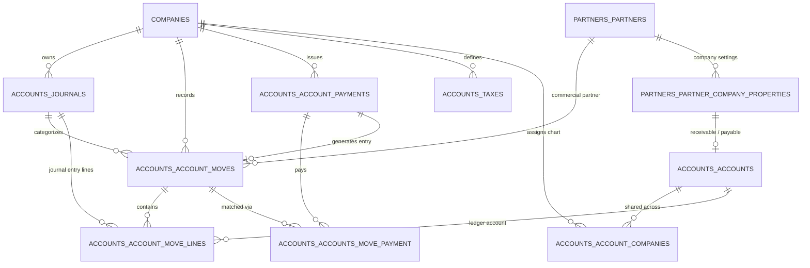
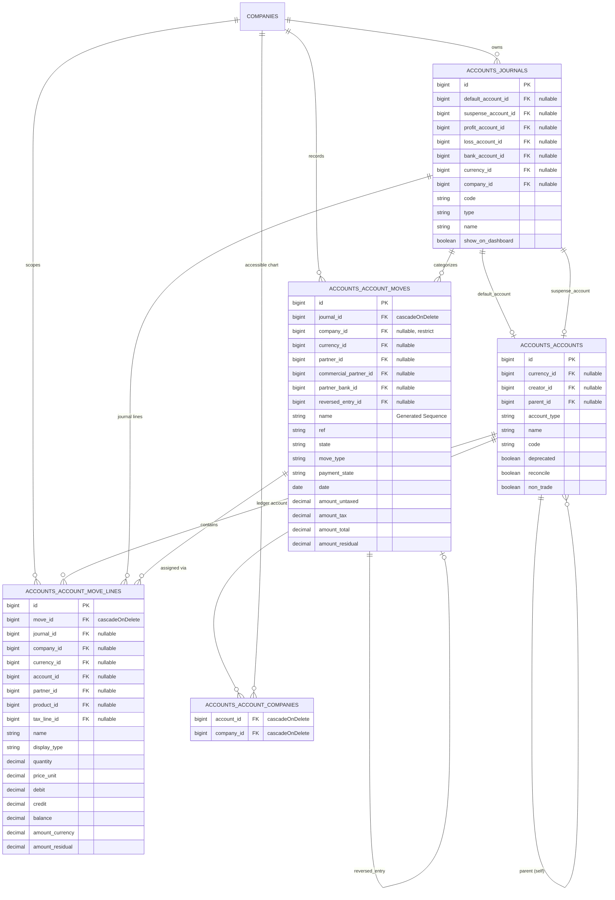
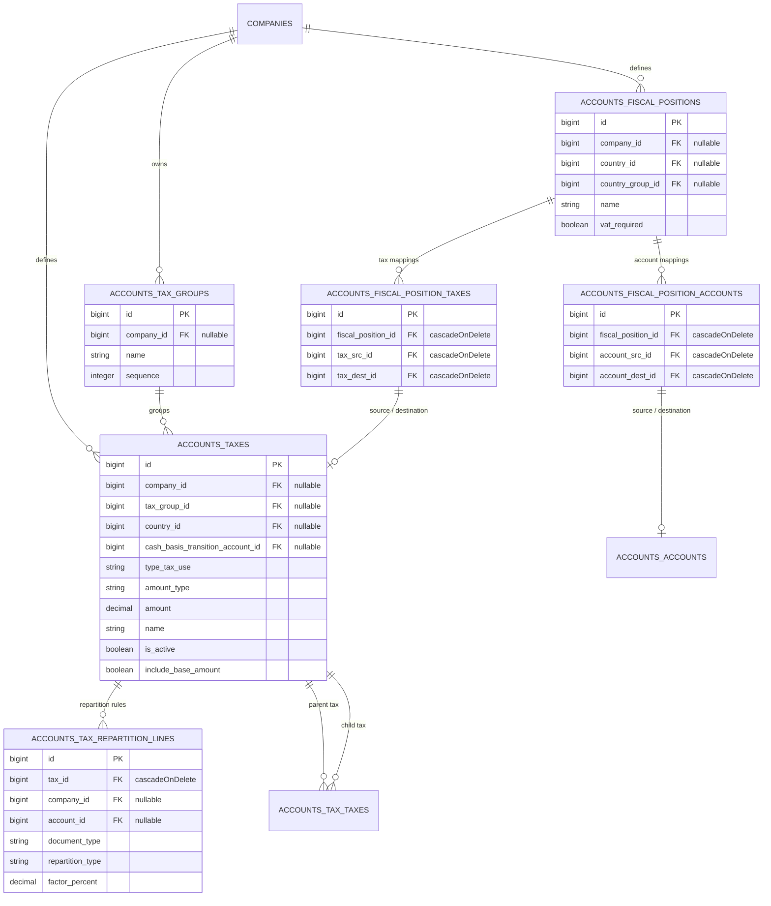
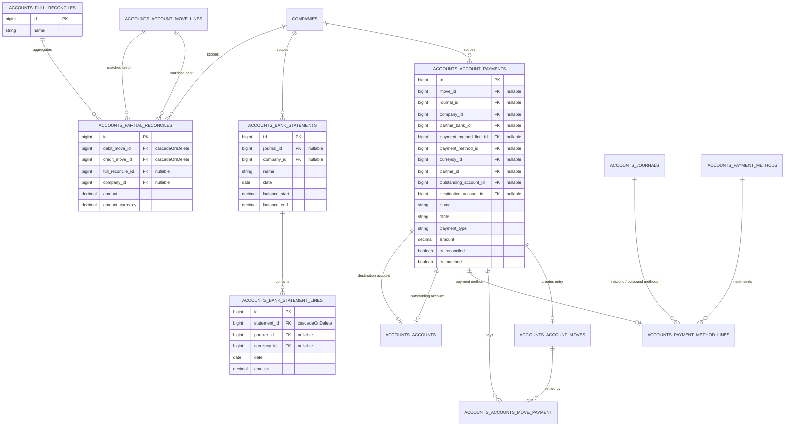
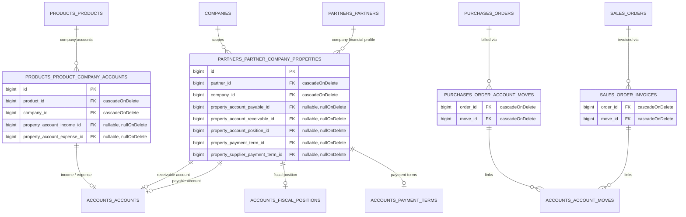

# Finance Database ERD

[VERIFIED] This document provides the source-code-verified architectural Entity Relationship Diagram (ERD) and referential data model for the Finance database area of Aureus ERP. It documents physical database tables, column structures, referential integrity constraints, Eloquent model mappings, company isolation boundaries, polymorphic interfaces, and dynamic runtime relationships established in the Finance domain plugins (`accounts`, `accounting`, `invoices`, `payments`).

The ERD serves as an architectural map and source of truth for engineering analysis; it does not replace underlying Laravel migrations or Eloquent model implementations.

---

## Verification Metadata

- **Status**: [VERIFIED]
- **Last Verified**: 2026-08-28
- **Confidence**: High (all physical tables, foreign keys, model relationships, cast behaviors, and traits verified against source code and database migrations)
- **Scope**: Finance Database Area (`accounts`, `accounting`, `invoices`, `payments` plugins, plus verified integration points in `partners`, `sales`, `purchases`, `products`, `support`)

---

## Finance Scope

### Included Plugins

The Finance database model encompasses 4 verified domain plugins:

1. **`accounts` (`Webkul\Account`)**: The foundational accounting and finance engine. Defines the unified double-entry ledger (`accounts_account_moves`, `accounts_account_move_lines`), chart of accounts (`accounts_accounts`), multi-company account mappings (`accounts_account_companies`), journals (`accounts_journals`), taxes and tax groups (`accounts_taxes`, `accounts_tax_groups`, `accounts_tax_repartition_lines`), fiscal positions (`accounts_fiscal_positions`, `accounts_fiscal_position_taxes`, `accounts_fiscal_position_accounts`), payment terms (`accounts_payment_terms`, `accounts_payment_term_lines`), payments (`accounts_account_payments`, `accounts_payment_methods`, `accounts_payment_method_lines`), reconciliation (`accounts_partial_reconciles`, `accounts_full_reconciles`), and bank statements (`accounts_bank_statements`, `accounts_bank_statement_lines`).
2. **`accounting` (`Webkul\Accounting`)**: Extends `accounts` for reporting, analytics, and accounting dashboard interfaces. Inherits directly from `Webkul\Account\Models\*` (e.g. `Invoice`, `Bill`, `Journal`) without adding distinct physical database tables.
3. **`invoices` (`Webkul\Invoice`)**: Provides operational invoicing and vendor bill workflows. Subclasses `Webkul\Account\Models\Move` (`Invoice`, `Bill`, `Refund`, `CreditNote`) without introducing independent database schemas.
4. **`payments` (`Webkul\Payment`)**: External transaction gateway integration, tokenization (`payments_payment_tokens`, `payments_payment_transactions`, `payments_payment_methods`), extending core `accounts_account_payments` with gateway attributes.

### Core Entities Referenced by Finance

Finance entities maintain verified physical or Eloquent relationships with foundational Core entities (documented in `docs/database/erds/core.md`):
- **`companies` (`Webkul\Support\Models\Company`)**: Tenant boundary for journals, moves, lines, accounts, taxes, fiscal positions, and payments.
- **`currencies` & `currency_rates` (`Webkul\Support\Models\Currency`, `CurrencyRate`)**: Master transaction and company currency definitions.
- **`users` (`Webkul\Security\Models\User`)**: Record creator, audit causer, and responsible party tracking.
- **`partners_partners` (`Webkul\Partner\Models\Partner`)**: Customers, suppliers, and counterparties on moves, lines, and payments.
- **`partners_bank_accounts` (`Webkul\Partner\Models\BankAccount`)**: Bank accounts linked to journals and payments.
- **`sequences` (`Webkul\Support\Models\Sequence`)**: Polymorphic document numbering sequences scoped to journals and companies.
- **`countries` & `states` (`Webkul\Support\Models\Country`, `State`)**: Tax localization and fiscal position region matching.
- **`chatter_messages` & `chatter_attachments` (`Webkul\Chatter\Models\Message`, `Attachment`)**: Polymorphic audit trail and attachment logs on `Move` and `Payment`.

### Optional/Domain Plugins Referenced by Finance

- **`sales` (`Webkul\Sale`)**: Linked to customer invoices via the junction table `sales_order_invoices` (`order_id` ↔ `move_id`).
- **`purchases` (`Webkul\Purchase`)**: Linked to vendor bills via the junction table `purchases_order_account_moves` (`order_id` ↔ `move_id`).
- **`products` (`Webkul\Product`)**: Line items reference `products_products` (`product_id`). Products and product categories link to accounts and taxes via dynamic relations and intermediary property tables.
- **`inventories` (`Webkul\Inventory`)**: Inventory receipts and stock moves link operationally to purchase order bills and journal entry lines.

### Excluded Plugins

All non-finance domain plugins (`blogs`, `contacts`, `employees`, `maintenance`, `manufacturing`, `recruitments`, `time-off`, `timesheets`, `website`, `barcode`, `fields`, `table-views`, `full-calendar`, `analytics`) are excluded from this ERD as they do not own primary financial ledger tables.

---

## Finance Database Strategy

[VERIFIED] Architectural characteristics verified from migrations and model definitions:

- **Single Database Multi-Company Architecture**:
  The Finance domain strictly enforces shared-table multi-tenancy. All primary transactional entities (`Move`, `MoveLine`, `Journal`, `Payment`, `Tax`, `FiscalPosition`, `BankStatement`) contain a physical `company_id` column and apply `Webkul\Support\Traits\BelongsToCompany` (which registers `CompanyScope`).
- **Multi-Company Shared Accounts**:
  Unlike transactional documents, `Account` (`accounts_accounts`) uses `Webkul\Support\Traits\BelongsToCompanies` and links to companies via the junction table `accounts_account_companies`, permitting a chart of accounts to be shared across multiple subsidiary companies or restricted to specific legal entities.
- **Unified Document & Ledger Structure**:
  Aureus ERP does not maintain separate tables for Invoices, Vendor Bills, Credit Notes, and Journal Entries. Instead, all accounting documents share `accounts_account_moves`, distinguished by the `move_type` enum (`ENTRY`, `OUT_INVOICE`, `OUT_REFUND`, `IN_INVOICE`, `IN_REFUND`, `OUT_RECEIPT`, `IN_RECEIPT`). Every move contains two or more balanced debits/credits in `accounts_account_move_lines`.
- **Company Property EAV Mapping**:
  To avoid mutating Core tables with company-specific financial foreign keys, partner and product accounting configurations are stored in dedicated intermediary tables: `partners_partner_company_properties`, `products_product_company_accounts`, and `products_category_company_accounts`. The custom cast `Webkul\Account\Casts\CompanyProperty` resolves these per active tenant.
- **Sequential Document Numbering**:
  `Move` names (e.g. `INV/2026/00001`, `BILL/2026/00001`) are computed and locked upon posting or creation via `Webkul\Support\Services\SequenceService`, which manages counters in the `sequences` table linked polymorphically to `Journal` (`scope_type = Webkul\Account\Models\Journal`).
- **Referential Integrity & Deletion Strategy**:
  - `cascadeOnDelete()`: Enforced on strictly dependent child lines (`accounts_account_move_lines.move_id`, `accounts_tax_repartition_lines.tax_id`, `accounts_fiscal_position_taxes.fiscal_position_id`, `accounts_payment_term_lines.payment_term_id`).
  - `restrictOnDelete()` / `nullOnDelete()`: Enforced on master references (`move_lines.account_id`, `move_lines.partner_id`, `moves.journal_id`) to preserve ledger consistency and immutable financial history.
- **Immutability & Soft Deletes**:
  Ledger records (`Move`, `MoveLine`, `PartialReconcile`) do not use soft deletes. Financial adjustments are handled via debit/credit reversals (`MoveReversal` creating reversing moves).

---

## Finance Entity Inventory

| Entity | Plugin | Table | Model | Company Scoped | Primary Role | Important Relationships | Status |
|---|---|---|---|---|---|---|---|
| **Account** | `accounts` | `accounts_accounts` | `Webkul\Account\Models\Account` | Multi (`BelongsToCompanies`) | Chart of accounts ledger account | Parent Account, Currency, Creator, Taxes (pivot), Tags (pivot), Companies (pivot `accounts_account_companies`) | [VERIFIED] |
| **Journal** | `accounts` | `accounts_journals` | `Webkul\Account\Models\Journal` | Yes (`BelongsToCompany`) | Accounting journal (Bank, Cash, Sale, Purchase, General) | Default Account, Suspense Account, Profit/Loss Accounts, Bank Account, Currency, Company, Sequences (morph) | [VERIFIED] |
| **Move** | `accounts` | `accounts_account_moves` | `Webkul\Account\Models\Move` | Yes (`BelongsToCompany`) | Unified document header (Invoice, Bill, Entry) | Journal, Company, Currency, Partner, Commercial Partner, Partner Bank, Lines, Payments (pivot), Reversal Entry | [VERIFIED] |
| **MoveLine** | `accounts` | `accounts_account_move_lines` | `Webkul\Account\Models\MoveLine` | Yes (`BelongsToCompany`) | Journal item / double-entry ledger line | Move (cascade), Journal, Account, Partner, Product, UOM, Currency, Tax, Full Reconcile, Partial Reconciles | [VERIFIED] |
| **Payment** | `accounts` | `accounts_account_payments` | `Webkul\Account\Models\Payment` | Yes (`BelongsToCompany`) | Cash/Bank payment record | Move, Journal, Company, Partner Bank, Payment Method Line, Payment Method, Currency, Partner, Outstanding Account | [VERIFIED] |
| **PaymentMethod** | `accounts` | `accounts_payment_methods` | `Webkul\Account\Models\PaymentMethod` | No (Global System) | Payment mechanism definition (Manual, Checks, Electronic) | Payment Method Lines, Creator | [VERIFIED] |
| **PaymentMethodLine** | `accounts` | `accounts_payment_method_lines` | `Webkul\Account\Models\PaymentMethodLine` | Via Journal | Journal-specific payment method configuration | Payment Method, Payment Account, Journal, Creator | [VERIFIED] |
| **Tax** | `accounts` | `accounts_taxes` | `Webkul\Account\Models\Tax` | Yes (`BelongsToCompany`) | Tax rate and calculation engine | Tax Group, Company, Country, Cash Basis Account, Children Taxes (pivot), Repartition Lines | [VERIFIED] |
| **TaxGroup** | `accounts` | `accounts_tax_groups` | `Webkul\Account\Models\TaxGroup` | Yes (`BelongsToCompany`) | Grouping classification for tax reporting | Company, Taxes, Creator | [VERIFIED] |
| **TaxPartition** | `accounts` | `accounts_tax_repartition_lines` | `Webkul\Account\Models\TaxPartition` | Yes (`BelongsToCompany`) | Distribution factor for invoice/refund tax lines | Tax (cascade), Company, Account, Creator | [VERIFIED] |
| **FiscalPosition** | `accounts` | `accounts_fiscal_positions` | `Webkul\Account\Models\FiscalPosition` | Yes (`BelongsToCompany`) | Tax and account mapping rules for regions | Country, Country Group, Company, Tax Mappings, Account Mappings | [VERIFIED] |
| **FiscalPositionTax** | `accounts` | `accounts_fiscal_position_taxes` | `Webkul\Account\Models\FiscalPositionTax` | Via Position | Rule mapping source tax to destination tax | Fiscal Position (cascade), Tax Source, Tax Destination | [VERIFIED] |
| **FiscalPositionAccount** | `accounts` | `accounts_fiscal_position_accounts` | `Webkul\Account\Models\FiscalPositionAccount` | Via Position | Rule mapping source account to destination account | Fiscal Position (cascade), Account Source, Account Destination | [VERIFIED] |
| **PaymentTerm** | `accounts` | `accounts_payment_terms` | `Webkul\Account\Models\PaymentTerm` | Yes (`BelongsToCompany`) | Due date and installment schedule definitions | Company, Due Terms / Lines, Creator | [VERIFIED] |
| **PaymentDueTerm** | `accounts` | `accounts_payment_due_terms` | `Webkul\Account\Models\PaymentDueTerm` | Via Payment Term | Installment calculation rules (days, end of month, percent) | Payment Term (cascade), Creator | [VERIFIED] |
| **BankStatement** | `accounts` | `accounts_bank_statements` | `Webkul\Account\Models\BankStatement` | Yes (`BelongsToCompany`) | Bank reconciliation statement document | Journal, Company, Lines, Creator | [VERIFIED] |
| **BankStatementLine** | `accounts` | `accounts_bank_statement_lines` | `Webkul\Account\Models\BankStatementLine` | Via Statement | Individual bank transaction line | Statement (cascade), Partner, Currency, Move Line | [VERIFIED] |
| **PartialReconcile** | `accounts` | `accounts_partial_reconciles` | `Webkul\Account\Models\PartialReconcile` | Yes (`BelongsToCompany`) | Matching record between debit and credit move lines | Debit Move Line, Credit Move Line, Full Reconcile, Company | [VERIFIED] |
| **FullReconcile** | `accounts` | `accounts_full_reconciles` | `Webkul\Account\Models\FullReconcile` | No | Full balance reconciliation group | Partial Reconciles, Reconciled Move Lines | [VERIFIED] |
| **PartnerCompanyProperty** | `accounts` | `partners_partner_company_properties` | `Webkul\Account\Models\PartnerCompanyProperty` | Yes (`BelongsToCompany`) | Multi-tenant financial account mapping for Partners | Partner (cascade), Company (cascade), Payable Account, Receivable Account, Position, Terms | [VERIFIED] |
| **PaymentTransaction** | `payments` | `payments_payment_transactions` | `Webkul\Payment\Models\PaymentTransaction` | Yes (`BelongsToCompany`) | Online payment gateway transaction record | Company, Partner, Currency, Payment Token, Account Payment | [VERIFIED] |
| **PaymentToken** | `payments` | `payments_payment_tokens` | `Webkul\Payment\Models\PaymentToken` | Yes (`BelongsToCompany`) | Stored payment token/card reference | Partner, Company, Payment Method | [VERIFIED] |

---

## High-Level Finance ERD

---

## Accounting Structure

[VERIFIED] In Aureus ERP:
- There is no separate `JournalEntry` table. Every accounting transaction is a record in `accounts_account_moves`.
- When a document is posted (`state = 'posted'`), balanced debit and credit entries are written to `accounts_account_move_lines`.
- Reversals do not delete records; they create an opposing `Move` referenced by `reversed_entry_id`.
- Accounts are categorized by `Webkul\Account\Enums\AccountType` (Asset Receivable, Liability Payable, Income, Expense, etc.).

---

## Invoice Structure

[VERIFIED] Invoices and Vendor Bills:
- Customer invoices (`OUT_INVOICE`), vendor bills (`IN_INVOICE`), customer credit notes (`OUT_REFUND`), and vendor refunds (`IN_REFUND`) are stored in `accounts_account_moves`.
- `Webkul\Invoice\Models\Invoice` and `Webkul\Accounting\Models\Invoice` are Eloquent proxy models extending `Webkul\Account\Models\Move`.
- Line items are stored in `accounts_account_move_lines` where `display_type` distinguishes product lines from section headers (`line_section`) or descriptive notes (`line_note`).
- Invoicing numbering is generated sequentially via `SequenceService` and locked in `accounts_account_moves.name`.

---

## Payment Structure

[VERIFIED] Payments in Aureus ERP:
- Payments are stored in `accounts_account_payments` and categorize cash flow direction via `Webkul\Account\Enums\PaymentType` (`RECEIVE`, `SEND`).
- When a payment is posted, it automatically generates an accounting journal entry in `accounts_account_moves` linked via `accounts_account_payments.move_id`.
- Invoices are linked to payments via the pivot table `accounts_accounts_move_payment` (`invoice_id` ↔ `payment_id`).
- Outstanding liquidity balances are tracked through `outstanding_account_id` and cleared during bank reconciliation.

---

## Accounts and Ledger Structure

[VERIFIED] Chart of Accounts architecture:
- Table: `accounts_accounts`.
- Supports hierarchical parent-child structures via `parent_id` (self-referential FK).
- Account types are strictly governed by `Webkul\Account\Enums\AccountType`.
- Company assignment is many-to-many via `accounts_account_companies`. An account can belong to all companies or be restricted to specific company IDs.
- Flags: `reconcile` (allows line-by-line reconciliation), `deprecated` (decommissioned from future postings), `non_trade` (excludes from trade receivables/payables).

---

## Taxes and Fiscal Positions

[VERIFIED] Tax computation and localization:
- **Taxes (`accounts_taxes`)**: Supports percentage, fixed, code formula, and group taxes via `amount_type` (`PERCENT`, `FIXED`, `CODE`, `GROUP`). Group taxes link parent-to-child via `accounts_tax_taxes`.
- **Repartition Lines (`accounts_tax_repartition_lines`)**: Determines how base and tax amounts split across accounts for invoices (`document_type = 'invoice'`) versus refunds (`document_type = 'refund'`).
- **Fiscal Positions (`accounts_fiscal_positions`)**: Automatically substitutes taxes (`FiscalPositionTax`) and ledger accounts (`FiscalPositionAccount`) based on the partner's country, state, or VAT registration.

---

## Currency and Exchange Rate Structures

[VERIFIED] Multi-currency accounting:
- Transactions specify `currency_id` on `accounts_account_moves`.
- Line amounts store both the document currency amount (`amount_currency`) and the company's converted base currency values (`debit`, `credit`, `balance`).
- Historical conversions rely on `currency_rates` in the Core `support` plugin matching transaction dates.

---

## CompanyProperty

[VERIFIED] Architectural investigation of `Webkul\Account\Casts\CompanyProperty`:

1. **Implementing Class**: `Webkul\Account\Casts\CompanyProperty`.
2. **Models Utilizing the Cast**:
   - `Webkul\Partner\Models\Partner` (`property_account_payable_id`, `property_account_receivable_id`, `property_account_position_id`, `property_payment_term_id`, `property_supplier_payment_term_id`, `property_inbound_payment_method_line_id`, `property_outbound_payment_method_line_id`).
   - `Webkul\Product\Models\Product` (`property_account_income_id`, `property_account_expense_id`).
   - `Webkul\Product\Models\Category` (`property_account_income_id`, `property_account_expense_id`, `property_account_downpayment_id`).
3. **Storage Mechanism**:
   It does NOT store JSON on the host model. It is an EAV-style proxy that reads and writes to physical multi-tenant relational tables:
   - `partners_partner_company_properties` (indexed by `[partner_id, company_id]`).
   - `products_product_company_accounts` (indexed by `[product_id, company_id]`).
   - `products_category_company_accounts` (indexed by `[category_id, company_id]`).
4. **Resolution Logic**: Resolves attributes dynamically based on `current_company_id()` or the entity's explicit `company_id`.
5. **Database Constraint Reality**: The underlying intermediary tables enforce physical foreign keys constrained to `accounts_accounts`, `accounts_fiscal_positions`, and `accounts_payment_terms`.

---

## SequenceService

[VERIFIED] Database architecture of `SequenceService`:
- **Implementation**: `Webkul\Support\Services\SequenceService`.
- **Physical Table**: `sequences` (`Webkul\Support\Models\Sequence`).
- **Finance Integration**:
  - `Journal` acts as the polymorphic scope: `scope_type = 'Webkul\Account\Models\Journal'`, `scope_id = accounts_journals.id`.
  - Numbering variants handle standard invoices, refund sequences (`refund`), and payment sequences (`payment`).
  - Generates format templates such as `%(prefix)s/%(year)s/%(month)s/%(counter)s`.
  - Thread safety is guaranteed via pessimistic database row locks (`lockForUpdate()`) within isolated database transactions.

---

## Cross-Domain Finance Relationships

### Sales Integration
- **Relationship**: Sales Order ↔ Customer Invoices
- **Source**: `Webkul\Sale\Models\Order`
- **Target**: `Webkul\Account\Models\Move` (`Webkul\Invoice\Models\Invoice`)
- **Type**: Many-to-Many via pivot table `sales_order_invoices` (`order_id`, `move_id`)
- **Evidence**: `plugins/webkul/sales/src/Models/Invoice.php`, `plugins/webkul/sales/src/Models/Order.php::invoices()`
- **Status**: [VERIFIED]

### Purchases Integration
- **Relationship**: Purchase Order ↔ Vendor Bills
- **Source**: `Webkul\Purchase\Models\Order`
- **Target**: `Webkul\Account\Models\Move` (`Webkul\Invoice\Models\Bill`)
- **Type**: Many-to-Many via pivot table `purchases_order_account_moves` (`order_id`, `move_id`)
- **Evidence**: `plugins/webkul/purchases/src/Models/Order.php::accountMoves()`, `plugins/webkul/purchases/src/Models/Order.php::bills()`
- **Status**: [VERIFIED]

### Products Integration
- **Relationship**: Product ↔ Default Taxes & Accounts
- **Source**: `Webkul\Product\Models\Product`
- **Target**: `Webkul\Account\Models\Tax`, `Webkul\Account\Models\Account`
- **Type**: Many-to-Many via `accounts_product_taxes`, `accounts_product_supplier_taxes`, and One-to-One per company via `products_product_company_accounts`
- **Evidence**: `plugins/webkul/accounts/src/AccountServiceProvider.php::boot()`
- **Status**: [VERIFIED]

---

## Polymorphic Relationships

| Morph Name | Owning Table | Type Column | ID Column | Verified Target Models | Evidence |
|---|---|---|---|---|---|
| **`scope`** | `sequences` | `scope_type` | `scope_id` | `Webkul\Account\Models\Journal` | `Webkul\Support\Services\SequenceService`, `Journal::sequenceDefaults()` |
| **`messageable`** | `chatter_messages` | `messageable_type` | `messageable_id` | `Webkul\Account\Models\Move`, `Webkul\Account\Models\Payment`, `Webkul\Account\Models\Journal` | `HasChatter` trait usage on models |
| **`messageable`** | `chatter_attachments` | `messageable_type` | `messageable_id` | `Webkul\Account\Models\Move`, `Webkul\Account\Models\Payment` | `Webkul\Chatter\Models\Attachment` |
| **`customizable`** | `custom_fields` | `customizable_type` | N/A (Schema) | `Webkul\Account\Models\Move`, `MoveLine`, `Journal`, `Payment`, `Account`, `Tax`, `FiscalPosition` | `HasCustomFields` trait usage on models |

---

## Dynamic Relationships

[VERIFIED] The Finance domain registers dynamic Eloquent relationships on external Core/Domain models in `AccountServiceProvider::boot()` via `resolveRelationUsing()`:

| Host Model | Dynamic Relation Name | Target Model | Relationship Type & Schema Pivot |
|---|---|---|---|
| `Webkul\Partner\Models\Partner` | `companyProperties` | `PartnerCompanyProperty` | `hasMany(PartnerCompanyProperty::class, 'partner_id')` |
| `Webkul\Partner\Models\Partner` | `propertyAccountPayable` | `Account` | Dynamic lookup via `CompanyProperty` |
| `Webkul\Partner\Models\Partner` | `propertyAccountReceivable` | `Account` | Dynamic lookup via `CompanyProperty` |
| `Webkul\Partner\Models\Partner` | `propertyAccountPosition` | `FiscalPosition` | Dynamic lookup via `CompanyProperty` |
| `Webkul\Partner\Models\Partner` | `propertyPaymentTerm` | `PaymentTerm` | Dynamic lookup via `CompanyProperty` |
| `Webkul\Partner\Models\Partner` | `propertySupplierPaymentTerm` | `PaymentTerm` | Dynamic lookup via `CompanyProperty` |
| `Webkul\Product\Models\Product` | `productTaxes` | `Tax` | `belongsToMany(Tax::class, 'accounts_product_taxes', 'product_id', 'tax_id')` |
| `Webkul\Product\Models\Product` | `supplierTaxes` | `Tax` | `belongsToMany(Tax::class, 'accounts_product_supplier_taxes', 'product_id', 'tax_id')` |
| `Webkul\Product\Models\Product` | `companyAccounts` | `ProductCompanyAccount` | `hasMany(ProductCompanyAccount::class, 'product_id')` |
| `Webkul\Product\Models\Category` | `companyAccounts` | `CategoryCompanyAccount` | `hasMany(CategoryCompanyAccount::class, 'category_id')` |

---

## Company Isolation Matrix

| Entity | `company_id` | `CompanyScope` | `BelongsToCompany` | `BelongsToCompanies` | Other Isolation / Consistency | Status |
|---|---|---|---|---|---|---|
| **Account** | No | No | No | **Yes** | Multi-company shared via `accounts_account_companies` | [VERIFIED] |
| **Journal** | **Yes** | **Yes** | **Yes** | No | `ChecksCompanyConsistency` trait on default/suspense accounts | [VERIFIED] |
| **Move** | **Yes** | **Yes** | **Yes** | No | Company-scoped validation on partner and journal | [VERIFIED] |
| **MoveLine** | **Yes** | **Yes** | **Yes** | No | Inherits company boundary from parent move | [VERIFIED] |
| **Payment** | **Yes** | **Yes** | **Yes** | No | Scoped to journal company and partner consistency | [VERIFIED] |
| **Tax** | **Yes** | **Yes** | **Yes** | No | Multi-company isolation on tax calculation | [VERIFIED] |
| **TaxGroup** | **Yes** | **Yes** | **Yes** | No | Standard company tenant scope | [VERIFIED] |
| **TaxPartition** | **Yes** | **Yes** | **Yes** | No | Scoped to parent tax company | [VERIFIED] |
| **FiscalPosition** | **Yes** | **Yes** | **Yes** | No | Localized company mapping rules | [VERIFIED] |
| **PaymentTerm** | **Yes** | **Yes** | **Yes** | No | Scoped payment installment rules | [VERIFIED] |
| **BankStatement** | **Yes** | **Yes** | **Yes** | No | Scoped to journal and company | [VERIFIED] |
| **PartialReconcile** | **Yes** | **Yes** | **Yes** | No | Validates debit and credit line company consistency | [VERIFIED] |
| **FullReconcile** | No | No | No | No | Global grouping entity across partial reconciliations | [VERIFIED] |
| **PaymentMethod** | No | No | No | No | Global system-wide payment method configuration | [VERIFIED] |
| **PaymentMethodLine**| No | No | No | No | Scoped through `journal_id` FK | [VERIFIED] |

---

## Important Constraints and Indexes

- **Unified Move Uniqueness**: `accounts_account_moves` enforces unique document names per company: `UNIQUE INDEX (name, company_id)`.
- **Journal Code Uniqueness**: `accounts_journals` enforces unique journal codes per company: `UNIQUE INDEX (code, company_id)`.
- **Company Property Uniqueness**:
  - `partners_partner_company_properties`: `UNIQUE (partner_id, company_id)`.
  - `products_product_company_accounts`: `UNIQUE (product_id, company_id)`.
  - `products_category_company_accounts`: `UNIQUE (category_id, company_id)`.
- **Account Code Uniqueness**: `accounts_accounts` indexes `code` and enforces code consistency per company through application validation and query builders.
- **Reconciliation Matching**: `accounts_partial_reconciles` indexes `[debit_move_id, credit_move_id]` for matching queries.

---

## Main Finance ERD

To ensure comprehensive structural analysis without visual overload, the detailed Finance ERD is divided into four sub-graphs.

### Sub-Graph 1: Ledger & Document Structure

---

### Sub-Graph 2: Tax Calculation & Fiscal Rules

---

### Sub-Graph 3: Payments, Reconciliations & Banking

---

### Sub-Graph 4: Master Data Finance Extensions & Cross-Plugin Links

---

## Relationship Evidence

- [VERIFIED] **accounts_account_moves.journal_id → accounts_journals.id**
  - Evidence: `plugins/webkul/accounts/src/Models/Move.php`
  - Symbol: `Move::journal()`
  - Migration: `plugins/webkul/accounts/database/migrations/2025_01_30_104445_create_accounts_account_moves_table.php` (`cascadeOnDelete()`)

- [VERIFIED] **accounts_account_move_lines.move_id → accounts_account_moves.id**
  - Evidence: `plugins/webkul/accounts/src/Models/MoveLine.php`, `plugins/webkul/accounts/src/Models/Move.php`
  - Symbol: `MoveLine::move()`, `Move::lines()`
  - Migration: `plugins/webkul/accounts/database/migrations/2025_01_30_104446_create_accounts_account_move_lines_table.php` (`cascadeOnDelete()`)

- [VERIFIED] **accounts_account_move_lines.account_id → accounts_accounts.id**
  - Evidence: `plugins/webkul/accounts/src/Models/MoveLine.php`
  - Symbol: `MoveLine::account()`
  - Migration: `plugins/webkul/accounts/database/migrations/2025_01_30_104446_create_accounts_account_move_lines_table.php` (`nullOnDelete()`)

- [VERIFIED] **accounts_account_payments.move_id → accounts_account_moves.id**
  - Evidence: `plugins/webkul/accounts/src/Models/Payment.php`
  - Symbol: `Payment::move()`, `Payment::generateJournalEntry()`
  - Migration: `plugins/webkul/accounts/database/migrations/2025_01_30_110000_create_accounts_account_payments_table.php` (`nullOnDelete()`)

- [VERIFIED] **accounts_accounts_move_payment.payment_id / invoice_id → accounts_account_payments.id / accounts_account_moves.id**
  - Evidence: `plugins/webkul/accounts/src/Models/Payment.php`, `plugins/webkul/accounts/src/Models/Move.php`
  - Symbol: `Payment::invoices()`, `Move::matchedPayments()`
  - Migration: `plugins/webkul/accounts/database/migrations/2025_01_30_110005_create_accounts_accounts_move_payment_table.php` (`cascadeOnDelete()`)

- [VERIFIED] **accounts_taxes.tax_group_id → accounts_tax_groups.id**
  - Evidence: `plugins/webkul/accounts/src/Models/Tax.php`
  - Symbol: `Tax::taxGroup()`
  - Migration: `plugins/webkul/accounts/database/migrations/2025_01_30_083208_create_accounts_taxes_table.php` (`nullOnDelete()`)

- [VERIFIED] **accounts_tax_repartition_lines.tax_id → accounts_taxes.id**
  - Evidence: `plugins/webkul/accounts/src/Models/TaxPartition.php`, `plugins/webkul/accounts/src/Models/Tax.php`
  - Symbol: `Tax::invoiceRepartitionLines()`, `Tax::refundRepartitionLines()`, `TaxPartition::tax()`
  - Migration: `plugins/webkul/accounts/database/migrations/2025_01_30_083210_create_accounts_tax_repartition_lines_table.php` (`cascadeOnDelete()`)

- [VERIFIED] **accounts_fiscal_position_taxes.fiscal_position_id → accounts_fiscal_positions.id**
  - Evidence: `plugins/webkul/accounts/src/Models/FiscalPositionTax.php`, `plugins/webkul/accounts/src/Models/FiscalPosition.php`
  - Symbol: `FiscalPosition::taxes()`
  - Migration: `plugins/webkul/accounts/database/migrations/2025_01_30_090000_create_accounts_fiscal_position_taxes_table.php` (`cascadeOnDelete()`)

- [VERIFIED] **accounts_partial_reconciles.debit_move_id / credit_move_id → accounts_account_move_lines.id**
  - Evidence: `plugins/webkul/accounts/src/Models/PartialReconcile.php`
  - Symbol: `PartialReconcile::debitMoveLine()`, `PartialReconcile::creditMoveLine()`
  - Migration: `plugins/webkul/accounts/database/migrations/2025_01_30_120000_create_accounts_partial_reconciles_table.php` (`cascadeOnDelete()`)

- [VERIFIED] **partners_partner_company_properties.partner_id / company_id → partners_partners.id / companies.id**
  - Evidence: `plugins/webkul/accounts/src/Models/PartnerCompanyProperty.php`
  - Symbol: `PartnerCompanyProperty::partner()`, `PartnerCompanyProperty::company()`
  - Migration: `plugins/webkul/accounts/database/migrations/2026_07_30_120001_create_partners_partner_company_properties_table.php` (`cascadeOnDelete()`)

- [VERIFIED] **sales_order_invoices.order_id / move_id → sales_orders.id / accounts_account_moves.id**
  - Evidence: `plugins/webkul/sales/src/Models/Invoice.php`, `plugins/webkul/sales/src/Models/Order.php`
  - Symbol: `Invoice::salesOrders()`, `Order::invoices()`
  - Migration: `plugins/webkul/sales/database/migrations/2025_01_31_100000_create_sales_order_invoices_table.php` (`cascadeOnDelete()`)

- [VERIFIED] **purchases_order_account_moves.order_id / move_id → purchases_orders.id / accounts_account_moves.id**
  - Evidence: `plugins/webkul/purchases/src/Models/Order.php`
  - Symbol: `Order::accountMoves()`, `Order::bills()`
  - Migration: `plugins/webkul/purchases/database/migrations/2025_01_31_110000_create_purchases_order_account_moves_table.php` (`cascadeOnDelete()`)

---

## Business Semantics vs Database Structure

[VERIFIED] Crucial architectural distinctions between runtime semantics and physical schema:

1. **Invoices vs Moves**:
   - *Business Concept*: An "Invoice" is a commercial billing document; a "Journal Entry" is an internal ledger record.
   - *Database Fact*: Both reside in `accounts_account_moves`. An invoice is simply a move with `move_type = 'OUT_INVOICE'` and auto-computed line taxes.
2. **Invoice Payment Allocation**:
   - *Business Concept*: An invoice is marked as "Paid".
   - *Database Fact*: `payment_state` is an aggregated status computed from `accounts_partial_reconciles` matching debit move lines to credit move lines, or via `accounts_accounts_move_payment` junction records. There is no single `payment_id` column on `accounts_account_moves`.
3. **Partner Payable/Receivable Accounts**:
   - *Business Concept*: A Partner has an account payable and account receivable.
   - *Database Fact*: `partners_partners` does NOT have `property_account_payable_id` or `property_account_receivable_id` columns. They are resolved per company via `partners_partner_company_properties` through the `CompanyProperty` cast.

---

## Tables / Models Investigated but Excluded

- **`Webkul\Invoice\Models\Invoice` / `Bill`**: Excluded from independent table inventory because they are proxy models subclassing `Webkul\Account\Models\Move` and mapping to `accounts_account_moves`.
- **`Webkul\Accounting\Models\Invoice` / `Journal`**: Excluded from independent table inventory because they subclass `Webkul\Account\Models\*` without dedicated tables.
- **`Webkul\Account\Models\Customer` / `Vendor`**: Excluded because they are proxy Eloquent models extending `Webkul\Partner\Models\Partner`.
- **`Webkul\Account\Services\TaxFormulaEvaluator`**: Excluded from ERD because it is pure application math evaluating `accounts_taxes.formula` strings.

---

## Unknowns and Limitations

- **[PARTIALLY VERIFIED] Dynamic Relationships via `resolveRelationUsing()`**:
  Dynamic relationship definitions injected into `Partner`, `Product`, and `Category` by `AccountServiceProvider` are active at runtime but cannot be inspected via standard static database reflection or IDE schema inspectors without booting Laravel providers.
- **[VERIFIED] Sequence Mutability**:
  While sequences enforce yearly/monthly reset patterns, manual changes to sequence formats or journal codes in running environments will alter future generated numbers without modifying historical `accounts_account_moves.name` strings.

---

## Architectural Observations

- [VERIFIED] **Complete Ledger Unification**: Aureus ERP adopts the unified move architecture where all financial actions (sales invoices, vendor bills, point-of-sale sessions, manual journals, cash entries) produce rows in `accounts_account_moves` and `accounts_account_move_lines`.
- [VERIFIED] **Strict Multi-Company Boundaries**: Every financial transaction explicitly tracks `company_id`. Company isolation is enforced at both the database level (foreign keys and unique compound indexes) and the application level (`BelongsToCompany` global scopes).

---

## Change Impact

Modifications to the following areas require immediate review and updating of this ERD:
- Any new migration in `plugins/webkul/accounts/database/migrations/` or `plugins/webkul/payments/database/migrations/`.
- Changes to `Webkul\Account\Casts\CompanyProperty` or its underlying property mapping tables.
- Changes to `SequenceService` or `sequences` table schema.
- Changes to cross-plugin pivots (`sales_order_invoices`, `purchases_order_account_moves`).

---

## Evidence Index

| ID | Evidence File | Symbol | Supports |
|---|---|---|---|
| E-FIN-001 | `plugins/webkul/accounts/src/Models/Move.php` | `Move::lines()` | Move ↔ MoveLine relationship |
| E-FIN-002 | `plugins/webkul/accounts/src/Models/Move.php` | `Move::journal()` | Move ↔ Journal relationship |
| E-FIN-003 | `plugins/webkul/accounts/src/Models/MoveLine.php` | `MoveLine::account()` | MoveLine ↔ Account relationship |
| E-FIN-004 | `plugins/webkul/accounts/src/Models/Payment.php` | `Payment::move()` | Payment ↔ Move journal generation |
| E-FIN-005 | `plugins/webkul/accounts/src/Models/Payment.php` | `Payment::invoices()` | Payment ↔ Invoice matching pivot |
| E-FIN-006 | `plugins/webkul/accounts/src/Casts/CompanyProperty.php` | `CompanyProperty::valueFor()` | Dynamic multi-tenant property resolution |
| E-FIN-007 | `plugins/webkul/accounts/src/Models/Tax.php` | `Tax::invoiceRepartitionLines()` | Tax ↔ TaxPartition distribution |
| E-FIN-008 | `plugins/webkul/accounts/src/Models/FiscalPosition.php` | `FiscalPosition::taxes()` | FiscalPosition ↔ FiscalPositionTax mapping |
| E-FIN-009 | `plugins/webkul/accounts/src/Models/FiscalPosition.php` | `FiscalPosition::accounts()` | FiscalPosition ↔ FiscalPositionAccount mapping |
| E-FIN-010 | `plugins/webkul/accounts/src/Models/PartialReconcile.php` | `PartialReconcile::debitMoveLine()` | Line reconciliation linking |
| E-FIN-011 | `plugins/webkul/sales/src/Models/Invoice.php` | `Invoice::salesOrders()` | Sales Order ↔ Invoice cross-domain link |
| E-FIN-012 | `plugins/webkul/purchases/src/Models/Order.php` | `Order::bills()` | Purchase Order ↔ Bill cross-domain link |
| E-FIN-013 | `plugins/webkul/accounts/src/AccountServiceProvider.php` | `resolveRelationUsing()` | Runtime dynamic relation registration |
