# Operations Database ERD

[VERIFIED] This document provides the source-code-verified architectural Entity Relationship Diagram (ERD) and referential data model for the Operations database area of Aureus ERP. It documents physical database tables, column structures, referential integrity constraints, Eloquent model mappings, company isolation boundaries, polymorphic interfaces, and dynamic runtime relationships established across the complete operational spectrum of 15 plugins:
- **Core Supply Chain & Manufacturing (6 plugins)**: `products`, `inventories`, `manufacturing`, `sales`, `purchases`, `barcode`.
- **Human Resources, Collaboration & Extended Operations (9 plugins)**: `employees`, `recruitments`, `time-off`, `projects`, `timesheets`, `maintenance`, `blogs`, `website`, `contacts`.

The ERD serves as an authoritative architectural map and source of truth for engineering analysis; it does not replace underlying Laravel migrations or Eloquent model implementations.

---

## Verification Metadata

- **Status**: [VERIFIED]
- **Last Verified**: 2026-08-29
- **Confidence**: High (all physical tables, foreign keys, model relationships, cast behaviors, migration mutations, and traits verified against source code and database migrations)
- **Scope**: Operations Database Area (`products`, `inventories`, `manufacturing`, `sales`, `purchases`, `barcode`, `employees`, `recruitments`, `time-off`, `projects`, `timesheets`, `maintenance`, `blogs`, `website`, `contacts` plugins, plus verified integration points in `support`, `security`, `partners`, `accounts`, `invoices`, `payments`, `chatter`, `analytics`)

---

## Operations Domain Boundary

### Included Operational Plugins

The Operations database domain encompasses the unified supply chain, manufacturing, inventory movement, sales distribution, procurement management, human resources, project collaboration, equipment maintenance, and content portal architecture across 15 plugins:

#### Core Supply Chain & Manufacturing Execution (6 Plugins)
1. **`products` (`Webkul\Product`)**: Master product catalog, self-referencing configurable product variants (`products_products`), hierarchical categories (`products_categories`), attributes and options (`products_attributes`, `products_attribute_options`, `products_product_attributes`, `products_product_attribute_values`, `products_product_combinations`), packaging specifications (`products_packagings`), pricing lists and rules (`products_product_price_lists`, `products_price_rule_items`), supplier vendor pricelists (`products_product_suppliers`), and product categorization tags (`products_tags`, `products_product_tag`).
2. **`inventories` (`Webkul\Inventory`)**: Multi-warehouse storage hierarchy (`inventories_warehouses`, `inventories_locations`, `inventories_storage_categories`), physical stock quant ledger at rest (`inventories_product_quantities`, `inventories_product_quantity_relocations`), stock movement engine (`inventories_operations`, `inventories_moves`, `inventories_move_lines`, `inventories_move_destinations`), operation types (`inventories_operation_types`), replenishment routes and rules (`inventories_routes`, `inventories_rules`, `inventories_category_routes`, `inventories_product_routes`, `inventories_route_warehouses`), putaway automation (`inventories_putaway_rules`), reordering points (`inventories_order_points`), lot and serial number tracking (`inventories_lots`), package containers and levels (`inventories_packages`, `inventories_package_types`, `inventories_package_levels`, `inventories_package_destinations`), waste management (`inventories_scraps`, `inventories_scrap_tags`), and demand orchestration (`inventories_procurement_groups`).
3. **`manufacturing` (`Webkul\Manufacturing`)**: Production engineering and Bill of Materials master data (`manufacturing_bills_of_materials`, `manufacturing_bill_of_material_lines`, `manufacturing_bill_of_material_byproducts`), work center topology and capacity scheduling (`manufacturing_work_centers`, `manufacturing_work_center_capacities`, `manufacturing_work_center_productivity_logs`, `manufacturing_work_center_productivity_losses`), manufacturing operations routing (`manufacturing_operations`), manufacturing order execution (`manufacturing_orders`), work order shop-floor tracking (`manufacturing_work_orders`), disassembly orders (`manufacturing_unbuild_orders`), and direct physical FK integration into `inventories_moves`, `inventories_move_lines`, and `inventories_warehouses`.
4. **`sales` (`Webkul\Sale`)**: Customer quotations and sales order management (`sales_orders`), line item fulfillment and pricing (`sales_order_lines`), quotation templates and configured options (`sales_order_templates`, `sales_order_template_products`, `sales_order_options`), sales teams (`sales_teams`, `sales_team_members`), advance payment invoice wizards (`sales_advance_payment_invoices`, `sales_advance_payment_invoice_order_sales`), and order-to-invoice junction links (`sales_order_invoices`, `sales_order_line_invoices`, `sales_order_line_taxes`, `sales_order_tags`).
5. **`purchases` (`Webkul\Purchase`)**: Vendor procurement management, purchase requisitions (`purchases_requisitions`, `purchases_requisition_lines`), request for quotations and purchase orders (`purchases_orders`), purchase order lines (`purchases_order_lines`), requisition groups (`purchases_order_groups`), and purchase-to-bill/inventory junction links (`purchases_order_account_moves`, `purchases_order_line_taxes`, `purchases_order_operations`, `purchases_order_line_moves`).
6. **`barcode` (`Webkul\Barcode`)**: Verified UI/Livewire workflow layer over inventory transfers, adjustments, and operations. Verified to contain **0 database tables and 0 migrations** (see [Barcode Architecture](#barcode-architecture) and [Tables / Models Investigated but Excluded](#tables--models-investigated-but-excluded)).

#### Human Resources, Collaboration & Extended Operations (9 Plugins)
7. **`employees` (`Webkul\Employee`)**: Human capital management, organizational hierarchy (`employees_departments`), physical work facilities (`employees_work_locations`), job positions (`employees_job_positions`), employee skills and taxonomy (`employees_skills`, `employees_skill_types`, `employees_skill_levels`, `employees_employee_skills`, `job_position_skills`), resume history and attachments (`employees_employee_resumes`, `employees_employee_resume_line_types`, `employees_employee_resume_attachments`), employee tagging (`employees_categories`, `employees_employee_categories`), departure reasons (`employees_departure_reasons`), employee master profiles (`employees_employees`), and HR working schedule calendars (`employees_calendars`, `employees_calendar_attendances`, `employees_calendar_leaves`).
8. **`recruitments` (`Webkul\Recruitment`)**: Applicant tracking pipeline, recruitment stages (`recruitments_stages`, `recruitments_stages_jobs`), educational degrees (`recruitments_degrees`), refusal reasons (`recruitments_refuse_reasons`), applicant tagging (`recruitments_applicant_categories`, `recruitments_candidate_applicant_categories`, `recruitments_applicant_applicant_categories`), candidate master records (`recruitments_candidates`), candidate skill evaluations (`recruitments_candidate_skills`), job applications (`recruitments_applicants`), interviewer assignments (`recruitments_applicant_interviewers`, `recruitments_job_position_interviewers`), and schema mutations adding recruiter/manager/address/industry foreign keys to `employees_job_positions`.
9. **`time-off` (`Webkul\TimeOff`)**: Leave and absence management, leave types (`time_off_leave_types`), user leave assignments (`time_off_user_leave_types`), mandatory company non-working days (`time_off_leave_mandatory_days`), accrual balance plans and levels (`time_off_leave_accrual_plans`, `time_off_leave_accrual_levels`), leave allocation ledgers (`time_off_leave_allocations`), and leave requests (`time_off_leaves`) linking to employee supervisors and Core working calendars.
10. **`projects` (`Webkul\Project`)**: Project planning and execution, multi-stage project workflows (`projects_project_stages`), project master headers (`projects_projects`), milestone tracking (`projects_milestones`), favorite projects (`projects_user_project_favorites`), project tagging (`projects_tags`, `projects_project_tag`, `projects_task_tag`), stage pipelines (`projects_task_stages`), task execution tickets (`projects_tasks`), multi-assignee task distribution (`projects_task_users`), and schema mutations integrating tasks and projects into `analytic_records`.
11. **`timesheets` (`Webkul\Timesheet`)**: Timesheet recording and task duration progress engine. Extends `projects` timesheet model on the Core `analytic_records` table (`Webkul\Timesheet\Models\Timesheet` extending `Webkul\Project\Models\Timesheet` extending `Webkul\Analytic\Models\Record`). Contains **0 dedicated physical tables and 0 migrations**.
12. **`maintenance` (`Webkul\Maintenance`)**: Equipment asset maintenance, equipment categories (`maintenance_equipment_categories`), maintenance request workflow stages (`maintenance_stages`), maintenance engineering teams (`maintenance_teams`, `maintenance_team_users`), equipment assets (`maintenance_equipments`), and maintenance service requests (`maintenance_requests`) tracking breakdown duration, repair priorities, and technician assignments.
13. **`blogs` (`Webkul\Blog`)**: Content management and publishing, translatable blog categories (`blogs_categories`), blog posts (`blogs_posts`), blog tags (`blogs_tags`), and post tagging junctions (`blogs_post_tags`).
14. **`website` (`Webkul\Website`)**: Web portal and content platform, translatable CMS pages (`website_pages`), customer portal authentication extensions and login tracking columns on `partners_partners` (`password`, `remember_token`, `last_login_at`).
15. **`contacts` (`Webkul\Contact`)**: CRM and directory management UI/domain layer. Inherits and provides proxy model extensions directly over the Core `partners_*` schema (`partners_partners`, `partners_banks`, `partners_bank_accounts`, `partners_industries`, `partners_tags`, `partners_titles`). Contains **0 dedicated physical tables and 0 migrations**.

### External Core References

Operations entities maintain verified physical foreign keys and Eloquent relationships with foundational Core entities (documented in `docs/database/erds/core.md`):
- **`companies` (`Webkul\Support\Models\Company`) [CORE]**: Multi-tenant isolation boundary for warehouses, locations, operations, stock moves, manufacturing orders, sales orders, purchase orders, product pricelists, employee profiles, departments, job positions, time-off plans, projects, tasks, maintenance teams, and equipments.
- **`users` (`Webkul\Security\Models\User`) [CORE]**: Salespersons, buyers, operators, warehouse assignees, project task assignees, maintenance technicians, recruiters, interviewers, blog authors, leave managers, and audit `creator_id` tracking.
- **`partners_partners` (`Webkul\Partner\Models\Partner`) [CORE]**: Customers on sales orders and projects, suppliers/vendors on purchase orders, product supplier pricelists, and maintenance equipment, employee private contact cards, candidate profiles, and customer portal user authentications.
- **`currencies` (`Webkul\Support\Models\Currency`) [CORE]**: Pricing currency on sales orders, purchase orders, price lists, and product supplier pricelists.
- **`unit_of_measures` (`Webkul\Support\Models\UOM`) [CORE]**: Foundational measurement units on products (`uom_id`, `uom_po_id`), stock moves, BOM lines, manufacturing orders, sales lines, and purchase lines.
- **`calendars` & `calendar_leaves` (`Webkul\Support\Models\Calendar`, `CalendarLeave`) [CORE]**: Working hours and capacity scheduling on `manufacturing_work_centers`, planned time slots on `manufacturing_work_orders`, employee working hours on `employees_employees.calendar_id`, and leave schedules on `time_off_leaves.calendar_id`.
- **`countries` & `states` (`Webkul\Support\Models\Country`, `State`) [CORE]**: Geographical residency, birth country, and state references on `employees_employees` and employment contracts on `employees_employment_types`.
- **`partners_bank_accounts` (`Webkul\Partner\Models\BankAccount`) [CORE]**: Employee payroll bank account on `employees_employees.bank_account_id`.
- **`partners_industries` (`Webkul\Partner\Models\Industry`) [CORE]**: Sector specialization on `employees_job_positions.industry_id`.
- **`sequences` (`Webkul\Support\Models\Sequence`) [CORE]**: Document sequence generator for sales orders (`SO/`), purchase orders (`PO/`), manufacturing orders (`MO/`), and inventory operations (`WH/IN/`, `WH/OUT/`, etc.).
- **`utm_campaigns`, `utm_sources`, `utm_mediums` (`Webkul\Support\Models\UtmCampaign`, `UTMSource`, `UTMMedium`) [CORE]**: Lead and marketing attribution tracking on `sales_orders` and recruitment candidate sourcing on `recruitments_applicants`.
- **`chatter_messages` & `chatter_attachments` (`Webkul\Chatter\Models\Message`, `Attachment`) [CORE]**: Polymorphic audit trail and communication records on `Product`, `Warehouse`, `Operation`, `ManufacturingOrder`, `SalesOrder`, `PurchaseOrder`, `Requisition`, `Department`, `Employee`, `Applicant`, `Candidate`, `Leave`, `LeaveAllocation`, `Project`, `Task`, and `MaintenanceRequest`.

### External Finance References

Operations entities maintain verified physical foreign keys, junction tables, and dynamic relationships with Finance entities (documented in `docs/database/erds/finance.md`):
- **`accounts_account_moves` (`Webkul\Account\Models\Move`) [FINANCE]**:
  - Linked to `sales_orders` via junction table `sales_order_invoices` (`order_id` ↔ `move_id`).
  - Linked to `purchases_orders` via junction table `purchases_order_account_moves` (`order_id` ↔ `move_id`).
- **`accounts_account_move_lines` (`Webkul\Account\Models\MoveLine`) [FINANCE]**:
  - Linked to `sales_order_lines` via junction table `sales_order_line_invoices` (`order_line_id` ↔ `invoice_line_id`).
  - Linked to `purchases_order_lines` via direct foreign key `accounts_account_move_lines.purchase_order_line_id`.
- **`accounts_taxes` (`Webkul\Account\Models\Tax`) [FINANCE]**:
  - Linked to `sales_order_lines` via junction table `sales_order_line_taxes` (`order_line_id` ↔ `tax_id`).
  - Linked to `purchases_order_lines` via junction table `purchases_order_line_taxes` (`order_line_id` ↔ `tax_id`).
- **`accounts_journals` (`Webkul\Account\Models\Journal`) [FINANCE]**: Default sales journal FK on `sales_orders.journal_id`.
- **`accounts_payment_terms` (`Webkul\Account\Models\PaymentTerm`) [FINANCE]**: Payment schedules on `sales_orders.payment_term_id` and `purchases_orders.payment_term_id`.
- **`accounts_fiscal_positions` (`Webkul\Account\Models\FiscalPosition`) [FINANCE]**: Tax mapping positions on `sales_orders.fiscal_position_id` and `purchases_orders.fiscal_position_id`.
- **`analytic_records` (`Webkul\Analytic\Models\Record`) [FINANCE/ANALYTICS]**:
  - Direct foreign keys added by `projects`: `analytic_records.project_id` and `analytic_records.task_id`.
  - Base storage table for project timesheets (`Webkul\Project\Models\Timesheet` and `Webkul\Timesheet\Models\Timesheet`).

---

## Operations Database Strategy

[VERIFIED] Architectural characteristics verified from migrations and model definitions:

- **Single Database Multi-Company Architecture**:
  Shared-table multi-tenant data architecture is strictly enforced across operational records. Tenant isolation is achieved via `company_id` foreign keys and `CompanyScope` (registered via `Webkul\Support\Traits\BelongsToCompany`).
  - Master data with optional company assignment (e.g. `products_products.company_id`, `products_product_price_lists.company_id`, `inventories_locations.company_id`, `employees_employees.company_id`, `projects_projects.company_id`, `maintenance_equipments.company_id`) allows records to be globally shared across all companies when `company_id = null` or restricted to a single tenant when populated.
  - Transactional operational documents (`inventories_operations`, `inventories_moves`, `manufacturing_orders`, `sales_orders`, `purchases_orders`, `maintenance_requests`, `time_off_leaves`) enforce strict required `company_id` constraints with `restrictOnDelete()`.
- **Self-Referencing Product Variant Hierarchy**:
  Aureus ERP does not use separate tables for Product Templates versus Product Variants. Both template products and their physical variants are stored in `products_products`. Configurable parent products have `is_configurable = 1` and `parent_id = null`, while physical variants have `parent_id = <parent_product_id>` and link to variant attribute combinations via `products_product_combinations`.
- **Double-Entry Stock Movement Ledger**:
  Stock quantities are never updated arbitrarily in place. Every change in inventory is driven by balanced stock movements in `inventories_moves` and `inventories_move_lines` transferring quantities from a `source_location_id` to a `destination_location_id`.
  - The static stock balance at rest is maintained in `inventories_product_quantities` keyed by `(product_id, location_id, company_id, lot_id, package_id)`.
- **Decoupled Cross-Domain Junction Architecture**:
  Sales Orders and Purchase Orders do not contain hard direct foreign keys to Invoices or Vendor Bills. Instead, transactional integration between Operations and Finance is maintained through junction tables:
  - `sales_orders` ↔ `accounts_account_moves` via `sales_order_invoices`.
  - `purchases_orders` ↔ `accounts_account_moves` via `purchases_order_account_moves`.
  - `sales_order_lines` ↔ `accounts_account_move_lines` via `sales_order_line_invoices`.
- **Workforce 1:1 Identity Mapping**:
  `employees_employees.user_id` enforces a unique constraint (`add_unique_user_id_to_employees_employees_table.php`), establishing a clean 1-to-1 operational projection between security authentication identities (`users`) and human capital records (`employees`).
- **Analytic Ledger Foundation for Timesheets**:
  The `timesheets` and `projects` modules avoid duplicate time-logging tables by directly extending the unified financial analytic ledger (`analytic_records` from `analytics` plugin), mutating the table to include `project_id` and `task_id`.
- **Sequential Document Numbering**:
  Human-readable identifiers (`SO/00001`, `PO/00001`, `MO/00001`, `WH/IN/00001`) are generated via `SequenceService` referencing `sequences` scoped to company and operation types.
- **Referential Integrity & Deletion Strategy**:
  - `cascadeOnDelete()`: Enforced on strictly dependent child line items and pure junction tables (`sales_order_lines.order_id`, `purchases_order_lines.order_id`, `manufacturing_bill_of_material_lines.bill_of_material_id`, `sales_order_invoices`, `purchases_order_account_moves`, `products_product_combinations`, `employees_employee_skills.employee_id`, `projects_milestones.project_id`, `maintenance_team_users.team_id`, `blogs_post_tags.post_id`).
  - `restrictOnDelete()`: Enforced on master references and transactional companies (`sales_orders.company_id`, `purchases_orders.company_id`, `manufacturing_orders.company_id`, `inventories_warehouses.company_id`, `inventories_moves.company_id`, `maintenance_requests.equipment_id`).
  - `nullOnDelete()`: Enforced on optional master links and lookup properties (`products_products.category_id`, `products_products.company_id`, `inventories_locations.storage_category_id`, `sales_orders.user_id`, `employees_employees.department_id`, `projects_projects.partner_id`, `maintenance_equipments.technician_user_id`).
- **Soft Deletes**:
  Soft deletes (`deleted_at` timestamp) are implemented on primary master and configuration records: `products_products`, `products_attributes`, `inventories_warehouses`, `inventories_locations`, `manufacturing_bills_of_materials`, `manufacturing_work_centers`, `sales_orders`, `purchases_requisitions`, `employees_employees`, `employees_departments`, `projects_projects`, `projects_tasks`, `maintenance_equipments`, `maintenance_requests`.

---

## Operations Entity Inventory

The following table catalogs the 87 verified database tables and models constituting the complete Operations architecture across all 15 plugins:

| Entity | Plugin | Table | Model | Domain Area | Company Scoped | Primary Role | Status |
|---|---|---|---|---|---|---|---|
| **Product** | `products` | `products_products` | `Webkul\Product\Models\Product` | Products | Optional (`BelongsToCompany`) | Master product and physical variant catalog | [VERIFIED] |
| **Category** | `products` | `products_categories` | `Webkul\Product\Models\Category` | Products | No (Global Master) | Hierarchical product taxonomy | [VERIFIED] |
| **Attribute** | `products` | `products_attributes` | `Webkul\Product\Models\Attribute` | Products | No (Global Master) | Variant attribute definition (Color, Size) | [VERIFIED] |
| **AttributeOption** | `products` | `products_attribute_options` | `Webkul\Product\Models\AttributeOption` | Products | No (Global Master) | Allowed values for attributes (Red, Blue) | [VERIFIED] |
| **ProductAttribute** | `products` | `products_product_attributes` | `Webkul\Product\Models\ProductAttribute` | Products | Via Product | Association between product template and attribute | [VERIFIED] |
| **ProductAttributeValue** | `products` | `products_product_attribute_values` | `Webkul\Product\Models\ProductAttributeValue` | Products | Via Product | Selected attribute option and price surcharge | [VERIFIED] |
| **ProductCombination** | `products` | `products_product_combinations` | `Webkul\Product\Models\ProductCombination` | Products | Via Variant | Junction mapping variant to attribute values | [VERIFIED] |
| **Packaging** | `products` | `products_packagings` | `Webkul\Product\Models\Packaging` | Products | Optional (`BelongsToCompany`) | Package quantity specifications for products | [VERIFIED] |
| **PriceList** | `products` | `products_product_price_lists` | `Webkul\Product\Models\PriceList` | Products | Optional (`BelongsToCompany`) | Customer/Currency price list configuration | [VERIFIED] |
| **PriceRuleItem** | `products` | `products_price_rule_items` | `Webkul\Product\Models\PriceRuleItem` | Products | Optional (`BelongsToCompany`) | Price computation line (min qty, discount, markup) | [VERIFIED] |
| **ProductSupplier** | `products` | `products_product_suppliers` | `Webkul\Product\Models\ProductSupplier` | Products | Optional (`BelongsToCompany`) | Supplier vendor pricing, lead time, min qty | [VERIFIED] |
| **ProductTag** | `products` | `products_tags` | `Webkul\Product\Models\Tag` | Products | No (Global Master) | Classification tags for products | [VERIFIED] |
| **Warehouse** | `inventories` | `inventories_warehouses` | `Webkul\Inventory\Models\Warehouse` | Inventory | Yes (`BelongsToCompany`) | Physical fulfillment warehouse and route config | [VERIFIED] |
| **Location** | `inventories` | `inventories_locations` | `Webkul\Inventory\Models\Location` | Inventory | Optional (`BelongsToCompany`) | Hierarchical internal, customer, vendor, transit locations | [VERIFIED] |
| **ProductQuantity** | `inventories` | `inventories_product_quantities` | `Webkul\Inventory\Models\ProductQuantity` | Inventory | Yes (`BelongsToCompany`) | On-hand, reserved, and counted stock balance at rest | [VERIFIED] |
| **OperationType** | `inventories` | `inventories_operation_types` | `Webkul\Inventory\Models\OperationType` | Inventory | Optional (`BelongsToCompany`) | Operation classification (Receipt, Delivery, Internal) | [VERIFIED] |
| **Operation** | `inventories` | `inventories_operations` | `Webkul\Inventory\Models\Operation` | Inventory | Yes (`BelongsToCompany`) | Warehouse transfer/picking document header | [VERIFIED] |
| **Move** | `inventories` | `inventories_moves` | `Webkul\Inventory\Models\Move` | Inventory | Yes (`BelongsToCompany`) | Stock movement record from source to destination | [VERIFIED] |
| **MoveLine** | `inventories` | `inventories_move_lines` | `Webkul\Inventory\Models\MoveLine` | Inventory | Yes (`BelongsToCompany`) | Detailed stock transfer item with lot/package detail | [VERIFIED] |
| **MoveDestination** | `inventories` | `inventories_move_destinations` | Pivot (`Move::moveDestinations()`) | Inventory | Via Moves | Junction linking chained multi-step stock moves | [VERIFIED] |
| **Lot** | `inventories` | `inventories_lots` | `Webkul\Inventory\Models\Lot` | Inventory | Optional (`BelongsToCompany`) | Lot and serial number tracking | [VERIFIED] |
| **Package** | `inventories` | `inventories_packages` | `Webkul\Inventory\Models\Package` | Inventory | Optional (`BelongsToCompany`) | Physical container / box containing stock | [VERIFIED] |
| **PackageType** | `inventories` | `inventories_package_types` | `Webkul\Inventory\Models\PackageType` | Inventory | Optional (`BelongsToCompany`) | Package dimensions, max weight, container type | [VERIFIED] |
| **PackageLevel** | `inventories` | `inventories_package_levels` | `Webkul\Inventory\Models\PackageLevel` | Inventory | Yes (`BelongsToCompany`) | Package tracking state within an operation | [VERIFIED] |
| **Route** | `inventories` | `inventories_routes` | `Webkul\Inventory\Models\Route` | Inventory | Optional (`BelongsToCompany`) | Supply chain replenishment path definition | [VERIFIED] |
| **Rule** | `inventories` | `inventories_rules` | `Webkul\Inventory\Models\Rule` | Inventory | Optional (`BelongsToCompany`) | Push/Pull procurement action rule | [VERIFIED] |
| **OrderPoint** | `inventories` | `inventories_order_points` | `Webkul\Inventory\Models\OrderPoint` | Inventory | Yes (`BelongsToCompany`) | Automated reordering min/max replenishment rule | [VERIFIED] |
| **PutawayRule** | `inventories` | `inventories_putaway_rules` | `Webkul\Inventory\Models\PutawayRule` | Inventory | Yes (`BelongsToCompany`) | Automated destination location assignment rule | [VERIFIED] |
| **Scrap** | `inventories` | `inventories_scraps` | `Webkul\Inventory\Models\Scrap` | Inventory | Yes (`BelongsToCompany`) | Damaged / waste inventory write-off document | [VERIFIED] |
| **StorageCategory** | `inventories` | `inventories_storage_categories` | `Webkul\Inventory\Models\StorageCategory` | Inventory | Optional (`BelongsToCompany`) | Location capacity category definition | [VERIFIED] |
| **ProcurementGroup** | `inventories` | `inventories_procurement_groups` | `Webkul\Inventory\Models\ProcurementGroup` | Inventory | Via Order | Grouping token linking orders to inventory moves | [VERIFIED] |
| **BillOfMaterial** | `manufacturing` | `manufacturing_bills_of_materials` | `Webkul\Manufacturing\Models\BillOfMaterial` | Manufacturing | Optional (`BelongsToCompany`) | Product Bill of Materials header | [VERIFIED] |
| **BillOfMaterialLine** | `manufacturing` | `manufacturing_bill_of_material_lines` | `Webkul\Manufacturing\Models\BillOfMaterialLine` | Manufacturing | Optional (`BelongsToCompany`) | Component requirement line in a BOM | [VERIFIED] |
| **BillOfMaterialByproduct** | `manufacturing` | `manufacturing_bill_of_material_byproducts` | `Webkul\Manufacturing\Models\BillOfMaterialByproduct` | Manufacturing | Optional (`BelongsToCompany`) | Secondary byproduct produced during manufacturing | [VERIFIED] |
| **WorkCenter** | `manufacturing` | `manufacturing_work_centers` | `Webkul\Manufacturing\Models\WorkCenter` | Manufacturing | Yes (`BelongsToCompany`) | Production work center station and cost definition | [VERIFIED] |
| **WorkCenterProductivityLog** | `manufacturing` | `manufacturing_work_center_productivity_logs` | `Webkul\Manufacturing\Models\WorkCenterProductivityLog` | Manufacturing | Yes (`BelongsToCompany`) | Work order duration and downtime tracking log | [VERIFIED] |
| **ManufacturingOperation** | `manufacturing` | `manufacturing_operations` | `Webkul\Manufacturing\Models\Operation` | Manufacturing | Optional (`BelongsToCompany`) | Routing operation step on a BOM | [VERIFIED] |
| **ManufacturingOrder** | `manufacturing` | `manufacturing_orders` | `Webkul\Manufacturing\Models\Order` | Manufacturing | Yes (`BelongsToCompany`) | Production manufacturing order document header | [VERIFIED] |
| **WorkOrder** | `manufacturing` | `manufacturing_work_orders` | `Webkul\Manufacturing\Models\WorkOrder` | Manufacturing | Via Manufacturing Order | Shop-floor execution operation work order | [VERIFIED] |
| **UnbuildOrder** | `manufacturing` | `manufacturing_unbuild_orders` | `Webkul\Manufacturing\Models\UnbuildOrder` | Manufacturing | Yes (`BelongsToCompany`) | Disassembly order reversing manufacturing | [VERIFIED] |
| **SalesOrder** | `sales` | `sales_orders` | `Webkul\Sale\Models\Order` | Sales | Yes (`BelongsToCompany`) | Customer quotation and sales order header | [VERIFIED] |
| **SalesOrderLine** | `sales` | `sales_order_lines` | `Webkul\Sale\Models\OrderLine` | Sales | Yes (`BelongsToCompany`) | Ordered product item line with pricing & delivery | [VERIFIED] |
| **SalesTeam** | `sales` | `sales_teams` | `Webkul\Sale\Models\Team` | Sales | Optional (`BelongsToCompany`) | Sales organizational department / pipeline team | [VERIFIED] |
| **SalesOrderTemplate** | `sales` | `sales_order_templates` | `Webkul\Sale\Models\OrderTemplate` | Sales | Optional (`BelongsToCompany`) | Reusable quotation template configuration | [VERIFIED] |
| **PurchaseOrder** | `purchases` | `purchases_orders` | `Webkul\Purchase\Models\Order` | Purchases | Yes (`BelongsToCompany`) | Request for Quotation and Purchase Order header | [VERIFIED] |
| **PurchaseOrderLine** | `purchases` | `purchases_order_lines` | `Webkul\Purchase\Models\OrderLine` | Purchases | Yes (`BelongsToCompany`) | Vendor purchased item line with pricing & receipt | [VERIFIED] |
| **PurchaseRequisition** | `purchases` | `purchases_requisitions` | `Webkul\Purchase\Models\Requisition` | Purchases | Yes (`BelongsToCompany`) | Blanket purchase agreement and requisition tender | [VERIFIED] |
| **WorkLocation** | `employees` | `employees_work_locations` | `Webkul\Employee\Models\WorkLocation` | HR | Yes (`BelongsToCompany`) | Physical office and site work facilities | [VERIFIED] |
| **Department** | `employees` | `employees_departments` | `Webkul\Employee\Models\Department` | HR | Optional (`BelongsToCompany`) | Hierarchical organizational business unit | [VERIFIED] |
| **EmployeeCategory** | `employees` | `employees_categories` | `Webkul\Employee\Models\EmployeeCategory` | HR | No (Global Master) | Employee classification and group tags | [VERIFIED] |
| **EmploymentType** | `employees` | `employees_employment_types` | `Webkul\Employee\Models\EmploymentType` | HR | No (Global Master) | Employment contract type (Full-time, Part-time) | [VERIFIED] |
| **SkillType** | `employees` | `employees_skill_types` | `Webkul\Employee\Models\SkillType` | HR | No (Global Master) | Skill category (Languages, Frameworks) | [VERIFIED] |
| **SkillLevel** | `employees` | `employees_skill_levels` | `Webkul\Employee\Models\SkillLevel` | HR | No (Global Master) | Skill grading level with progress percentage | [VERIFIED] |
| **Skill** | `employees` | `employees_skills` | `Webkul\Employee\Models\Skill` | HR | No (Global Master) | Individual skill catalog definition | [VERIFIED] |
| **EmployeeJobPosition** | `employees` | `employees_job_positions` | `Webkul\Employee\Models\EmployeeJobPosition` | HR | Optional (`BelongsToCompany`) | Job role, recruitment spec, and target headcount | [VERIFIED] |
| **DepartureReason** | `employees` | `employees_departure_reasons` | `Webkul\Employee\Models\DepartureReason` | HR | No (Global Master) | Employee offboarding reason classification | [VERIFIED] |
| **Employee** | `employees` | `employees_employees` | `Webkul\Employee\Models\Employee` | HR | Optional (`BelongsToCompany`) | Core employee master profile linked 1:1 with User | [VERIFIED] |
| **EmployeeSkill** | `employees` | `employees_employee_skills` | `Webkul\Employee\Models\EmployeeSkill` | HR | Via Employee | Concrete skill assignment and rating on employee | [VERIFIED] |
| **EmployeeResumeLineType** | `employees` | `employees_employee_resume_line_types` | `Webkul\Employee\Models\EmployeeResumeLineType` | HR | No (Global Master) | Resume entry type (Experience, Education) | [VERIFIED] |
| **EmployeeResume** | `employees` | `employees_employee_resumes` | `Webkul\Employee\Models\EmployeeResume` | HR | Via Employee | Chronological career/education timeline record | [VERIFIED] |
| **EmployeeResumeAttachment** | `employees` | `employees_employee_resume_attachments` | `Webkul\Employee\Models\EmployeeResumeAttachment` | HR | Via Resume | Uploaded documentation/certificate on resume line | [VERIFIED] |
| **EmployeeCalendar** | `employees` | `employees_calendars` | `Webkul\Employee\Models\Calendar` | HR | Optional (`BelongsToCompany`) | HR working schedule calendar header | [VERIFIED] |
| **EmployeeCalendarAttendance** | `employees` | `employees_calendar_attendances` | `Webkul\Employee\Models\CalendarAttendance` | HR | Via Calendar | Scheduled working shifts and hour periods | [VERIFIED] |
| **EmployeeCalendarLeave** | `employees` | `employees_calendar_leaves` | `Webkul\Employee\Models\CalendarLeave` | HR | Optional (`BelongsToCompany`) | Calendar holidays and planned closing days | [VERIFIED] |
| **RecruitmentStage** | `recruitments` | `recruitments_stages` | `Webkul\Recruitment\Models\Stage` | Recruitment | No (Global Master) | Hiring pipeline stage (Screening, Interview, Offer) | [VERIFIED] |
| **Degree** | `recruitments` | `recruitments_degrees` | `Webkul\Recruitment\Models\Degree` | Recruitment | No (Global Master) | Academic qualification certification level | [VERIFIED] |
| **RefuseReason** | `recruitments` | `recruitments_refuse_reasons` | `Webkul\Recruitment\Models\RefuseReason` | Recruitment | No (Global Master) | Candidate rejection rationale classification | [VERIFIED] |
| **ApplicantCategory** | `recruitments` | `recruitments_applicant_categories` | `Webkul\Recruitment\Models\ApplicantCategory` | Recruitment | No (Global Master) | Candidate and applicant categorization tags | [VERIFIED] |
| **Candidate** | `recruitments` | `recruitments_candidates` | `Webkul\Recruitment\Models\Candidate` | Recruitment | Optional (`BelongsToCompany`) | Candidate talent profile linking to partner/employee | [VERIFIED] |
| **CandidateSkill** | `recruitments` | `recruitments_candidate_skills` | `Webkul\Recruitment\Models\CandidateSkill` | Recruitment | Via Candidate | Evaluated skill level on job candidate | [VERIFIED] |
| **Applicant** | `recruitments` | `recruitments_applicants` | `Webkul\Recruitment\Models\Applicant` | Recruitment | Optional (`BelongsToCompany`) | Application submission for a specific job position | [VERIFIED] |
| **LeaveType** | `time-off` | `time_off_leave_types` | `Webkul\TimeOff\Models\LeaveType` | Time Off | Optional (`BelongsToCompany`) | Time-off classification policy and parameters | [VERIFIED] |
| **Leave** | `time-off` | `time_off_leaves` | `Webkul\TimeOff\Models\Leave` | Time Off | Optional (`BelongsToCompany`) | Time-off request document with two-stage approval | [VERIFIED] |
| **LeaveMandatoryDay** | `time-off` | `time_off_leave_mandatory_days` | `Webkul\TimeOff\Models\LeaveMandatoryDay` | Time Off | Optional (`BelongsToCompany`) | Mandatory working/non-working company dates | [VERIFIED] |
| **LeaveAccrualPlan** | `time-off` | `time_off_leave_accrual_plans` | `Webkul\TimeOff\Models\LeaveAccrualPlan` | Time Off | Optional (`BelongsToCompany`) | Automated balance accrual calculation plan | [VERIFIED] |
| **LeaveAccrualLevel** | `time-off` | `time_off_leave_accrual_levels` | `Webkul\TimeOff\Models\LeaveAccrualLevel` | Time Off | Via Plan | Milestone accrual rate based on employee tenure | [VERIFIED] |
| **LeaveAllocation** | `time-off` | `time_off_leave_allocations` | `Webkul\TimeOff\Models\LeaveAllocation` | Time Off | Optional (`BelongsToCompany`) | Granted leave credit allocation ledger | [VERIFIED] |
| **ProjectStage** | `projects` | `projects_project_stages` | `Webkul\Project\Models\ProjectStage` | Projects | Optional (`BelongsToCompany`) | Project lifecycle milestone phase | [VERIFIED] |
| **Project** | `projects` | `projects_projects` | `Webkul\Project\Models\Project` | Projects | Optional (`BelongsToCompany`) | Project workspace header with customer & privacy | [VERIFIED] |
| **Milestone** | `projects` | `projects_milestones` | `Webkul\Project\Models\Milestone` | Projects | Via Project | Target delivery milestone checkpoint | [VERIFIED] |
| **ProjectTag** | `projects` | `projects_tags` | `Webkul\Project\Models\Tag` | Projects | No (Global Master) | Classification tags for projects and tasks | [VERIFIED] |
| **TaskStage** | `projects` | `projects_task_stages` | `Webkul\Project\Models\TaskStage` | Projects | Optional (`BelongsToCompany`) | Kanban workflow stage column per project | [VERIFIED] |
| **Task** | `projects` | `projects_tasks` | `Webkul\Project\Models\Task` | Projects | Optional (`BelongsToCompany`) | Actionable ticket with parent-child subtasks | [VERIFIED] |
| **Timesheet** | `timesheets` / `projects` | `analytic_records` | `Webkul\Timesheet\Models\Timesheet` | Projects / Timesheets | Optional (`BelongsToCompany`) | Duration and progress record on project tasks | [VERIFIED] |
| **EquipmentCategory** | `maintenance` | `maintenance_equipment_categories` | `Webkul\Maintenance\Models\EquipmentCategory` | Maintenance | Optional (`BelongsToCompany`) | Asset and machinery classification taxonomy | [VERIFIED] |
| **MaintenanceStage** | `maintenance` | `maintenance_stages` | `Webkul\Maintenance\Models\Stage` | Maintenance | No (Global Master) | Repair request workflow status stage | [VERIFIED] |
| **MaintenanceTeam** | `maintenance` | `maintenance_teams` | `Webkul\Maintenance\Models\Team` | Maintenance | Optional (`BelongsToCompany`) | Maintenance engineering team and technicians | [VERIFIED] |
| **Equipment** | `maintenance` | `maintenance_equipments` | `Webkul\Maintenance\Models\Equipment` | Maintenance | Optional (`BelongsToCompany`) | Machinery asset record with serial and vendor | [VERIFIED] |
| **MaintenanceRequest** | `maintenance` | `maintenance_requests` | `Webkul\Maintenance\Models\MaintenanceRequest` | Maintenance | Yes (`BelongsToCompany`) | Breakdown repair / preventive service work order | [VERIFIED] |
| **BlogCategory** | `blogs` | `blogs_categories` | `Webkul\Blog\Models\Category` | Blogs | No (Global Master) | Translatable blog topic category | [VERIFIED] |
| **BlogPost** | `blogs` | `blogs_posts` | `Webkul\Blog\Models\Post` | Blogs | No (Global Master) | Translatable published blog article | [VERIFIED] |
| **BlogTag** | `blogs` | `blogs_tags` | `Webkul\Blog\Models\Tag` | Blogs | No (Global Master) | Article classification tags | [VERIFIED] |
| **WebsitePage** | `website` | `website_pages` | `Webkul\Website\Models\Page` | Website | No (Global Master) | Translatable CMS web page layout and slug | [VERIFIED] |
| **WebsitePartner** | `website` | `partners_partners` | `Webkul\Website\Models\Partner` | Website | Optional (`BelongsToCompany`) | Portal authentication extension on partners | [VERIFIED] |
| **Contact** | `contacts` | `partners_partners` | `Webkul\Contact\Models\Partner` | Contacts | Optional (`BelongsToCompany`) | CRM proxy model layer over Core partners | [VERIFIED] |

---

## High-Level Operations ERD

```mermaid
erDiagram
    COMPANIES ||--o{ PRODUCTS_PRODUCTS : "scopes (optional)"
    COMPANIES ||--o{ INVENTORIES_WAREHOUSES : "owns"
    COMPANIES ||--o{ INVENTORIES_OPERATIONS : "manages"
    COMPANIES ||--o{ INVENTORIES_MOVES : "records"
    COMPANIES ||--o{ INVENTORIES_PRODUCT_QUANTITIES : "tracks balance"
    COMPANIES ||--o{ MANUFACTURING_ORDERS : "issues"
    COMPANIES ||--o{ MANUFACTURING_WORK_CENTERS : "operates"
    COMPANIES ||--o{ SALES_ORDERS : "executes"
    COMPANIES ||--o{ PURCHASES_ORDERS : "issues"
    COMPANIES ||--o{ EMPLOYEES_EMPLOYEES : "employs"
    COMPANIES ||--o{ PROJECTS_PROJECTS : "executes"
    COMPANIES ||--o{ MAINTENANCE_EQUIPMENTS : "owns asset"
    
    PARTNERS_PARTNERS ||--o{ SALES_ORDERS : "customer"
    PARTNERS_PARTNERS ||--o{ PURCHASES_ORDERS : "vendor"
    PARTNERS_PARTNERS ||--o{ PRODUCTS_PRODUCT_SUPPLIERS : "supplier"
    PARTNERS_PARTNERS ||--o{ INVENTORIES_PRODUCT_QUANTITIES : "owner"
    PARTNERS_PARTNERS ||--o{ PROJECTS_PROJECTS : "client"
    PARTNERS_PARTNERS ||--o{ MAINTENANCE_EQUIPMENTS : "vendor/mfg"
    PARTNERS_PARTNERS ||--o{ EMPLOYEES_EMPLOYEES : "private contact"
    
    USERS ||--|| EMPLOYEES_EMPLOYEES : "user_id (1:1)"
    USERS ||--o{ SALES_ORDERS : "salesperson"
    USERS ||--o{ PURCHASES_ORDERS : "buyer"
    USERS ||--o{ MANUFACTURING_WORK_ORDERS : "operator"
    USERS ||--o{ PROJECTS_TASKS : "assignee"
    USERS ||--o{ MAINTENANCE_REQUESTS : "technician"
    
    PRODUCTS_PRODUCTS ||--o{ PRODUCTS_PRODUCTS : "variants (parent_id)"
    PRODUCTS_PRODUCTS ||--o{ INVENTORIES_PRODUCT_QUANTITIES : "stock balance"
    PRODUCTS_PRODUCTS ||--o{ INVENTORIES_MOVES : "transfers"
    PRODUCTS_PRODUCTS ||--o{ MANUFACTURING_BILLS_OF_MATERIALS : "manufactures"
    PRODUCTS_PRODUCTS ||--o{ MANUFACTURING_ORDERS : "produces"
    PRODUCTS_PRODUCTS ||--o{ SALES_ORDER_LINES : "sells"
    PRODUCTS_PRODUCTS ||--o{ PURCHASES_ORDER_LINES : "purchases"
    
    INVENTORIES_WAREHOUSES ||--o{ INVENTORIES_LOCATIONS : "contains"
    INVENTORIES_LOCATIONS ||--o{ INVENTORIES_PRODUCT_QUANTITIES : "holds stock"
    INVENTORIES_LOCATIONS ||--o{ INVENTORIES_MOVES : "source / destination"
    
    INVENTORIES_OPERATIONS ||--o{ INVENTORIES_MOVES : "contains"
    INVENTORIES_MOVES ||--o{ INVENTORIES_MOVE_LINES : "executes"
    INVENTORIES_MOVES ||--o{ INVENTORIES_MOVE_DESTINATIONS : "chained via"
    
    MANUFACTURING_BILLS_OF_MATERIALS ||--o{ MANUFACTURING_BILL_OF_MATERIAL_LINES : "requires"
    MANUFACTURING_BILLS_OF_MATERIALS ||--o{ MANUFACTURING_ORDERS : "specifies"
    MANUFACTURING_ORDERS ||--o{ MANUFACTURING_WORK_ORDERS : "dispatches"
    MANUFACTURING_ORDERS ||--o{ INVENTORIES_MOVES : "raw materials & finished goods"
    
    SALES_ORDERS ||--o{ SALES_ORDER_LINES : "contains"
    SALES_ORDER_LINES ||--o{ INVENTORIES_MOVES : "triggers delivery"
    SALES_ORDERS ||--o{ SALES_ORDER_INVOICES : "invoiced via"
    
    PURCHASES_ORDERS ||--o{ PURCHASES_ORDER_LINES : "contains"
    PURCHASES_ORDER_LINES ||--o{ INVENTORIES_MOVES : "triggers receipt"
    PURCHASES_ORDERS ||--o{ PURCHASES_ORDER_ACCOUNT_MOVES : "billed via"
    
    EMPLOYEES_DEPARTMENTS ||--o{ EMPLOYEES_EMPLOYEES : "department"
    EMPLOYEES_JOB_POSITIONS ||--o{ EMPLOYEES_EMPLOYEES : "job role"
    EMPLOYEES_EMPLOYEES ||--o{ TIME_OFF_LEAVES : "takes leave"
    EMPLOYEES_EMPLOYEES ||--o{ RECRUITMENTS_CANDIDATES : "hired as"
    
    PROJECTS_PROJECTS ||--o{ PROJECTS_TASKS : "contains"
    PROJECTS_TASKS ||--o{ ANALYTIC_RECORDS : "logs timesheet"
    
    MAINTENANCE_EQUIPMENTS ||--o{ MAINTENANCE_REQUESTS : "service request"
```

---

## Products Architecture

[VERIFIED] The product catalog architecture combines a self-referencing template-variant hierarchy with configurable EAV attributes, packaging units, multi-tier pricing, and vendor supplier catalogs.

### Product Hierarchy & Variant Generation

- Configurable products act as parent templates (`is_configurable = 1`, `parent_id = null`).
- Concrete product variants are stored in `products_products` with `parent_id` referencing the template `products_products.id`.
- Variant attribute assignments are stored across:
  - `products_product_attributes` (`product_id`, `attribute_id`): Links product templates to allowed attributes.
  - `products_product_attribute_values` (`product_id`, `product_attribute_id`, `attribute_option_id`, `extra_price`): Allowed attribute option choices on the template.
  - `products_product_combinations` (`product_id`, `product_attribute_value_id`): Physical variant to attribute value mapping junction table.

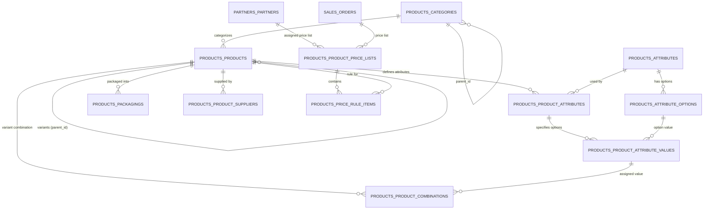

---

## Inventory Architecture

[VERIFIED] The Inventory data model represents warehouse topology, double-entry stock movement tracking, stock balance ledgers, packaging, automated replenishment, and multi-step routing.

### Double-Entry Stock Movement Engine

- **Stock Balance at Rest (`inventories_product_quantities`)**:
  Represents physical inventory quantities partitioned by `product_id`, `location_id`, `company_id`, `lot_id`, `package_id`, and `partner_id`. Holds `quantity`, `reserved_quantity`, and physical inventory adjustment audit fields (`counted_quantity`, `difference_quantity`).
- **Transfer Header (`inventories_operations`)**:
  Represents warehouse documents (e.g. Picking Slip, Delivery Order, Receipt Note) categorized by `operation_type_id`.
- **Stock Movement Ledger (`inventories_moves`)**:
  Double-entry movement record debiting `destination_location_id` and crediting `source_location_id`.
- **Stock Execution Lines (`inventories_move_lines`)**:
  Physical movement lines tracking precise serial numbers (`lot_id`), source containers (`package_id`), and destination containers (`result_package_id`).
- **Chained Moves (`inventories_move_destinations`)**:
  Junction table (`origin_move_id` ↔ `destination_move_id`) chaining multi-step logistics moves (e.g. Input → Quality Check → Stock).

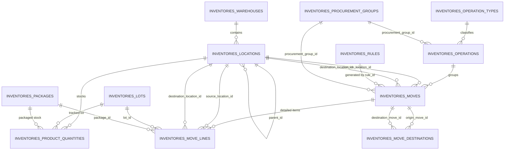

---

## Manufacturing Architecture

[VERIFIED] The Manufacturing database architecture links engineering Bill of Materials (BOMs), shop-floor work centers, production routing operations, manufacturing orders (MOs), work orders (WOs), and disassembly unbuild orders.

### Manufacturing & Inventory Stock Integration

- Manufacturing orders (`manufacturing_orders`) execute production by consuming raw materials and outputting finished goods.
- Physical stock movements are linked directly via foreign keys on `inventories_moves`:
  - `inventories_moves.raw_material_order_id`: Consumed component stock moves.
  - `inventories_moves.order_id`: Produced finished good stock moves.
  - `inventories_moves.created_order_id`: MTO replenishment move destination.
  - `inventories_moves.bom_line_id`: Specific BOM component line linkage.
  - `inventories_moves.work_order_id`: Work order step consumption linkage.
  - `inventories_moves.unbuild_order_id` & `consume_unbuild_order_id`: Disassembly stock moves.

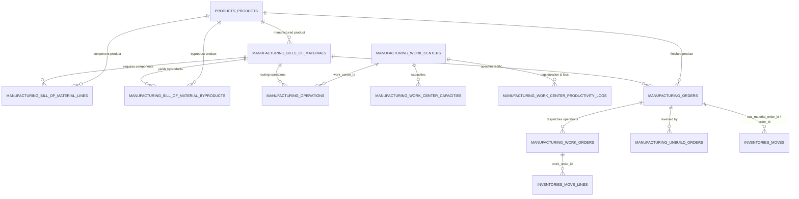

---

## Sales Architecture

[VERIFIED] The Sales domain manages customer quotations, sales orders, order lines, pricing, delivery tracking, quotation templates, and sales teams.

### Sales to Inventory and Finance Linkages

- **Demand Generation (`sales_orders.procurement_group_id` / `sales_order_lines`)**:
  When a sales order is confirmed (`state = 'sale'`), delivery stock moves are generated in `inventories_moves` with `sale_order_line_id = sales_order_lines.id` and `procurement_group_id = sales_orders.procurement_group_id`.
- **Invoicing Junction (`sales_order_invoices` & `sales_order_line_invoices`)**:
  Customer invoices are created in `accounts_account_moves` and matched via `sales_order_invoices` (`order_id` ↔ `move_id`). Individual invoice lines are matched via `sales_order_line_invoices` (`order_line_id` ↔ `invoice_line_id`).

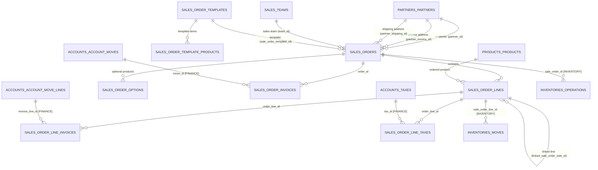

---

## Purchasing Architecture

[VERIFIED] The Purchasing domain manages vendor procurement, purchase requisitions, RFQs, purchase orders, purchase lines, and vendor receipt tracking.

### Purchasing to Inventory and Finance Linkages

- **Receipt Generation (`purchases_orders` / `purchases_order_lines`)**:
  When a purchase order is confirmed (`state = 'purchase'`), incoming stock moves are generated in `inventories_moves` with `purchase_order_line_id = purchases_order_lines.id` and linked via junction table `purchases_order_line_moves` (`purchase_order_line_id` ↔ `inventory_move_id`). Warehouse receipt operations are linked via `purchases_order_operations` (`purchase_order_id` ↔ `inventory_operation_id`).
- **Vendor Billing (`purchases_order_account_moves` & `accounts_account_move_lines.purchase_order_line_id`)**:
  Vendor bills created in `accounts_account_moves` link to purchase orders via `purchases_order_account_moves` (`order_id` ↔ `move_id`), while individual bill lines link via the direct foreign key `accounts_account_move_lines.purchase_order_line_id`.

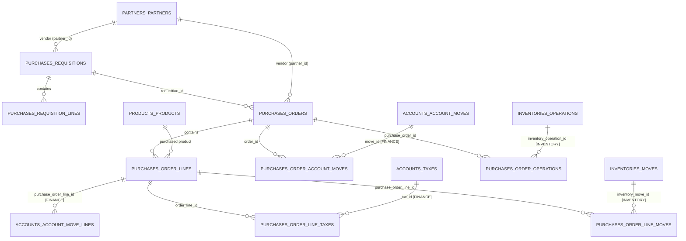

---

## Barcode Architecture

[VERIFIED] Analysis of `plugins/webkul/barcode/`:
- The `barcode` plugin contains **0 database tables and 0 migrations**.
- It provides a Livewire and Filament asset frontend layer (`html5-qrcode.min.js`, `barcode.js`, `barcode.css`) executing camera/scanner interactions against inventory API endpoints and Livewire components (`Barcode\Livewire\Operation`, `Barcode\Livewire\Transfers`, `Barcode\Livewire\Adjustments`, `Barcode\Livewire\Dashboard`).
- Scanner inputs look up existing barcodes in physical columns owned by other plugins:
  - `products_products.barcode`
  - `products_packagings.barcode`
  - `inventories_locations.barcode`
  - `inventories_lots.name`
  - `inventories_packages.name`
  - `manufacturing_work_orders.barcode`
- Conclusion: `barcode` is an application-level UI workflow plugin, not an independent database domain.

---

## Human Resources & Collaboration Architecture

[VERIFIED] The extended operational scope incorporates 9 integrated plugins managing organizational human capital, recruitment pipelines, leave management, project task execution, time logging, machinery maintenance, web publishing, customer portal access, and contact directories.

### 1. Human Resources Domain (`employees`)

The `employees` module provides organizational hierarchy, employee profiles, skill grading matrices, and chronological career resumes:
- **Employee Master (`employees_employees`)**:
  - Main identity record linked 1-to-1 to `users.id` via unique index (`employees_employees_user_id_unique`).
  - Linked to `employees_departments.id`, `employees_job_positions.id`, `employees_work_locations.id`, `employees_departure_reasons.id`, `employees_employment_types.id`.
  - Self-referencing management hierarchy: `parent_id` (Manager) and `coach_id` (Coach/Mentor).
  - Geographical attributes referencing Core `countries` and `states` (`country_id`, `state_id`, `private_country_id`, `private_state_id`, `country_of_birth`).
  - Payroll bank account reference on `partners_bank_accounts.id`.
  - Supervisor references: `leave_manager_id` (`users.id`), `attendance_manager_id` (`users.id`).
- **Departments & Job Positions (`employees_departments`, `employees_job_positions`)**:
  - `employees_departments`: Hierarchical parent-child tree (`parent_id`, `master_department_id`), scoped by `company_id`, with manager FK `manager_id` → `employees_employees.id`.
  - `employees_job_positions`: Position requirements, department link, employment type link, and recruitment enhancements (`address_id` → `partners_partners`, `manager_id` → `employees_employees`, `industry_id` → `partners_industries`, `recruiter_id` → `users`).
- **Skill Matrices (`employees_skills`, `employees_skill_types`, `employees_skill_levels`, `employees_employee_skills`, `job_position_skills`)**:
  - Two-level skill taxonomy (`employees_skill_types` → `employees_skills` & `employees_skill_levels`).
  - Concrete employee skill assignments stored in `employees_employee_skills` with `(employee_id, skill_id, skill_level_id, skill_type_id)`.
  - Position requirements mapped via `job_position_skills` (`job_position_id`, `skill_id`).
- **Employee Resume & Attachments (`employees_employee_resumes`, `employees_employee_resume_line_types`, `employees_employee_resume_attachments`)**:
  - Chronological timeline entries categorized by `employee_resume_line_type_id`.
  - File attachments stored in `employees_employee_resume_attachments` (`employee_resume_id`).
- **Internal Working Schedules (`employees_calendars`, `employees_calendar_attendances`, `employees_calendar_leaves`)**:
  - Dedicated HR shift calendar models providing standard hours per day, two-week rotas, and flexible hours schedules.

### 2. Recruitment & Applicant Tracking (`recruitments`)

The `recruitments` module manages the talent acquisition pipeline and transitions candidates into active employees:
- **Candidate Master (`recruitments_candidates`)**:
  - Core applicant person record with optional links to `partners_partners.id` and `companies.id`.
  - Educational attainment link: `degree_id` → `recruitments_degrees.id`.
  - Employee conversion link: `employee_id` → `employees_employees.id` (populated when a candidate is hired).
  - Evaluated candidate skills: `recruitments_candidate_skills` referencing `employees_skills`, `employees_skill_levels`, `employees_skill_types`.
- **Job Applications (`recruitments_applicants`)**:
  - Application ticket linking `candidate_id` → `recruitments_candidates.id` to `job_id` → `employees_job_positions.id` and `department_id` → `employees_departments.id`.
  - Pipeline progression: `stage_id` & `last_stage_id` → `recruitments_stages.id`.
  - Marketing attribution: `source_id` → `utm_sources.id`, `medium_id` → `utm_mediums.id`.
  - Outcome tracking: `refuse_reason_id` → `recruitments_refuse_reasons.id`.
  - Interviewer panels: Junction table `recruitments_applicant_interviewers` (`applicant_id` ↔ `interviewer_id` → `users.id`).
- **Pipeline Configuration (`recruitments_stages`, `recruitments_stages_jobs`)**:
  - Hiring stages mapped across specific job positions via `recruitments_stages_jobs`.

### 3. Leave & Absence Management (`time-off`)

The `time-off` module handles leave entitlements, accrual rules, mandatory company holidays, and time-off request approvals:
- **Leave Request Ledger (`time_off_leaves`)**:
  - Request record linking `employee_id` → `employees_employees.id`, `user_id` → `users.id`, `department_id` → `employees_departments.id`.
  - Policy classification: `holiday_status_id` → `time_off_leave_types.id`.
  - Working schedule: `calendar_id` → Core `calendars.id`.
  - Multi-tier approval workflow: `manager_id`, `first_approver_id`, `second_approver_id` → `employees_employees.id`.
- **Accrual Plans & Levels (`time_off_leave_accrual_plans`, `time_off_leave_accrual_levels`)**:
  - Automated leave credit rules bound to `time_off_leave_types.id` and company.
  - Granular milestone rates defined by employee service tenure in `time_off_leave_accrual_levels`.
- **Leave Allocations (`time_off_leave_allocations`)**:
  - Balance allocations granted to employees (`employee_id`, `holiday_status_id`, `accrual_plan_id`, `approver_id`, `second_approver_id`).
- **Mandatory Days (`time_off_leave_mandatory_days`)**:
  - Company-mandated working/non-working exception dates.

### 4. Project Management & Task Collaboration (`projects`)

The `projects` module provides collaborative work management, milestone delivery tracking, and multi-assignee task dispatching:
- **Project Master (`projects_projects`)**:
  - Workspace container linked to `company_id`, `stage_id` → `projects_project_stages.id`, project lead `user_id` → `users.id`, and client `partner_id` → `partners_partners.id`.
  - User favorites mapped via `projects_user_project_favorites` (`project_id` ↔ `user_id`).
  - Project tagging via `projects_project_tag` (`project_id` ↔ `tag_id` → `projects_tags.id`).
- **Milestones (`projects_milestones`)**:
  - Target deliverable checkpoints scoped to `project_id` with target dates.
- **Task Execution (`projects_tasks`)**:
  - Work ticket belonging to `project_id`, `milestone_id`, `stage_id` → `projects_task_stages.id`, and client `partner_id`.
  - Self-referencing subtask hierarchy via `parent_id` → `projects_tasks.id`.
  - Multi-assignee team dispatching via `projects_task_users` (`task_id` ↔ `user_id` → `users.id`, tracking assignee stage).
  - Task tagging via `projects_task_tag` (`task_id` ↔ `tag_id` → `projects_tags.id`).

### 5. Timesheet Execution Engine (`timesheets`)

- The `timesheets` module contains **0 database tables and 0 migrations**.
- It extends the Project timesheet implementation (`Webkul\Timesheet\Models\Timesheet` extends `Webkul\Project\Models\Timesheet` extends `Webkul\Analytic\Models\Record`).
- Stored physically in the Core/Finance `analytic_records` table, mutated by `projects` migration `2024_12_18_145142_add_columns_to_analytic_records_table.php`:
  - `analytic_records.project_id` → `projects_projects.id`.
  - `analytic_records.task_id` → `projects_tasks.id`.
  - `analytic_records.user_id` → `users.id` (recording employee identity).
  - `analytic_records.unit_amount` (logged hours).
- Model boot events (`Timesheet::created`, `updated`, `deleted`) automatically compute and update task progress fields on `projects_tasks` (`total_hours_spent`, `effective_hours`, `remaining_hours`, `overtime`, `progress`).

### 6. Equipment & Maintenance Management (`maintenance`)

The `maintenance` module coordinates machinery asset health, preventive servicing, and corrective repair tickets:
- **Equipment Registry (`maintenance_equipments`)**:
  - Physical machinery asset record classified by `category_id` → `maintenance_equipment_categories.id`.
  - Assigned maintenance team: `maintenance_team_id` → `maintenance_teams.id`.
  - Responsible engineer: `technician_user_id` → `users.id`, asset custodian: `owner_user_id` → `users.id`.
  - Equipment supplier/vendor: `partner_id` → `partners_partners.id`.
  - Warranty, serial number, model, cost, and MTBF / MTTF tracking attributes.
- **Maintenance Requests (`maintenance_requests`)**:
  - Work order ticket linked to `equipment_id` → `maintenance_equipments.id`, `category_id`, `maintenance_team_id`, and `company_id`.
  - Workflow status: `stage_id` → `maintenance_stages.id`.
  - Requestor identity: `user_id` → `users.id`.
  - Breakdown duration, priority, scheduled date, and repair duration metrics.
- **Maintenance Teams (`maintenance_teams`, `maintenance_team_users`)**:
  - Service teams linking assigned technicians via `maintenance_team_users` (`team_id` ↔ `user_id` → `users.id`).

### 7. Content Management & Web Publishing (`blogs`)

The `blogs` module provides translatable content authoring and publishing:
- **Posts (`blogs_posts`)**:
  - Translatable article content (title, summary, body, slug, SEO tags) linked to `category_id` → `blogs_categories.id`.
  - Author and editor tracking: `author_id`, `creator_id`, `last_editor_id` → `users.id`.
- **Categories & Tags (`blogs_categories`, `blogs_tags`, `blogs_post_tags`)**:
  - Translatable category hierarchy and keyword tagging junction `blogs_post_tags` (`post_id` ↔ `tag_id`).

### 8. Web Portal & Customer Authentication (`website`)

The `website` module powers the public portal and authenticated customer self-service area:
- **CMS Pages (`website_pages`)**:
  - Translatable portal pages with custom layouts, meta descriptions, and slugs.
- **Customer Portal Authentication (`partners_partners` Alterations)**:
  - Migrations `2025_03_10_064655_alter_partners_partners_table.php` and `2026_08_03_100000_add_last_login_at_to_partners_partners_table.php` mutate `partners_partners` to add `password`, `remember_token`, and `last_login_at`.
  - `Webkul\Website\Models\Partner` extends `Webkul\Partner\Models\Partner` as an authenticatable model under the `customer` guard.

### 9. Contacts & Directory Layer (`contacts`)

- The `contacts` module contains **0 database tables and 0 migrations**.
- It provides proxy model extensions and Filament UI management directly over the Core `partners_*` schema:
  - `Webkul\Contact\Models\Partner` extends `Webkul\Partner\Models\Partner` (`partners_partners`).
  - `Webkul\Contact\Models\Address` extends `Partner` (`partners_partners` child records).
  - `Webkul\Contact\Models\Bank` extends `Webkul\Partner\Models\Bank` (`partners_banks`).
  - `Webkul\Contact\Models\BankAccount` extends `Webkul\Partner\Models\BankAccount` (`partners_bank_accounts`).
  - `Webkul\Contact\Models\Industry` extends `Webkul\Partner\Models\Industry` (`partners_industries`).
  - `Webkul\Contact\Models\Tag` extends `Webkul\Partner\Models\Tag` (`partners_tags`).
  - `Webkul\Contact\Models\Title` extends `Webkul\Partner\Models\Title` (`partners_titles`).

---

## Supply-Chain Cluster Integration Analysis

[VERIFIED] Re-evaluation of the 9 extended operational plugins against the Core Supply-Chain & Manufacturing table cluster (`products_products`, `inventories_*`, `manufacturing_*`, `sales_*`, `purchases_*`):

1. **Direct Physical Foreign Key Absence (Verified)**:
   Static database migration inspection confirms that none of the 9 plugins define physical foreign key columns directly targeting `products_products`, `inventories_warehouses`, `inventories_moves`, `manufacturing_orders`, `sales_orders`, or `purchases_orders`. The original exclusion rationale is physically verified.
2. **Shared Bridge Entities Across Clusters**:
   While physical foreign keys between these clusters are decoupled, operations flow seamlessly across domains via shared foundational Core and Finance models:
   - **`partners_partners` (Cross-Cluster Entity)**: Acts as Customers on `sales_orders` and `projects_projects`, Vendors on `purchases_orders` and `maintenance_equipments`, Private Contacts on `employees_employees`, Candidates on `recruitments_candidates`, and Authenticated Portal Accounts in `website`.
   - **`users` (Unified Workforce Identity)**: Unifies Salespersons (`sales_orders`), Buyers (`purchases_orders`), Shop-Floor Operators (`manufacturing_work_orders`), Warehouse Transfer Creators (`inventories_operations`), Project Assignees (`projects_tasks`), Maintenance Technicians (`maintenance_equipments`, `maintenance_requests`), Recruiters (`recruitments_applicants`), and Employees (`employees_employees.user_id` 1:1).
   - **`calendars` (Unified Schedule Model)**: `manufacturing_work_centers.calendar_id` and `employees_employees.calendar_id` both draw from Core `calendars`, synchronizing enterprise capacity and labor schedules.
   - **`analytic_records` (Unified Cost & Time Ledger)**: Bridges project timesheets (`projects_tasks`, `projects_projects`) with financial cost accounting without duplicating ledger tables.
   - **Customer Portal Visibility**: `website` provides customer-facing portal views into `sales_orders` and `purchases_orders` through `CustomerPurchaseOrderPolicy` and customer cluster navigation without adding foreign keys to the sales or purchase schemas.

---

## Complete Operations Sub-Graphs

The complete verified Operations domain is presented across six cohesive sub-graphs.

### 1. Products & Inventory ERD

```mermaid
erDiagram
    PRODUCTS_CATEGORIES ||--o{ PRODUCTS_CATEGORIES : "parent_id"
    PRODUCTS_CATEGORIES ||--o{ PRODUCTS_PRODUCTS : "category_id"
    
    PRODUCTS_PRODUCTS ||--o{ PRODUCTS_PRODUCTS : "parent_id (variants)"
    PRODUCTS_PRODUCTS ||--o{ PRODUCTS_PACKAGINGS : "packagings"
    PRODUCTS_PRODUCTS ||--o{ PRODUCTS_PRODUCT_SUPPLIERS : "suppliers"
    
    PRODUCTS_ATTRIBUTES ||--o{ PRODUCTS_ATTRIBUTE_OPTIONS : "options"
    PRODUCTS_PRODUCTS ||--o{ PRODUCTS_PRODUCT_ATTRIBUTES : "attributes"
    PRODUCTS_ATTRIBUTES ||--o{ PRODUCTS_PRODUCT_ATTRIBUTES : "attribute_id"
    PRODUCTS_PRODUCT_ATTRIBUTES ||--o{ PRODUCTS_PRODUCT_ATTRIBUTE_VALUES : "values"
    PRODUCTS_ATTRIBUTE_OPTIONS ||--o{ PRODUCTS_PRODUCT_ATTRIBUTE_VALUES : "attribute_option_id"
    PRODUCTS_PRODUCTS ||--o{ PRODUCTS_PRODUCT_COMBINATIONS : "product_id"
    PRODUCTS_PRODUCT_ATTRIBUTE_VALUES ||--o{ PRODUCTS_PRODUCT_COMBINATIONS : "product_attribute_value_id"
    
    INVENTORIES_WAREHOUSES ||--o{ INVENTORIES_LOCATIONS : "warehouse_id"
    INVENTORIES_LOCATIONS ||--o{ INVENTORIES_LOCATIONS : "parent_id"
    INVENTORIES_STORAGE_CATEGORIES ||--o{ INVENTORIES_LOCATIONS : "storage_category_id"
    
    PRODUCTS_PRODUCTS ||--o{ INVENTORIES_PRODUCT_QUANTITIES : "product_id"
    INVENTORIES_LOCATIONS ||--o{ INVENTORIES_PRODUCT_QUANTITIES : "location_id"
    INVENTORIES_LOTS ||--o{ INVENTORIES_PRODUCT_QUANTITIES : "lot_id"
    INVENTORIES_PACKAGES ||--o{ INVENTORIES_PRODUCT_QUANTITIES : "package_id"
    
    INVENTORIES_OPERATION_TYPES ||--o{ INVENTORIES_OPERATIONS : "operation_type_id"
    INVENTORIES_OPERATIONS ||--o{ INVENTORIES_MOVES : "operation_id"
    INVENTORIES_MOVES ||--o{ INVENTORIES_MOVE_LINES : "move_id"
    
    PRODUCTS_PRODUCTS ||--o{ INVENTORIES_MOVES : "product_id"
    INVENTORIES_LOCATIONS ||--o{ INVENTORIES_MOVES : "source_location_id"
    INVENTORIES_LOCATIONS ||--o{ INVENTORIES_MOVES : "destination_location_id"
    
    INVENTORIES_MOVES ||--o{ INVENTORIES_MOVE_DESTINATIONS : "origin_move_id"
    INVENTORIES_MOVES ||--o{ INVENTORIES_MOVE_DESTINATIONS : "destination_move_id"
    
    INVENTORIES_LOTS ||--o{ INVENTORIES_MOVE_LINES : "lot_id"
    INVENTORIES_PACKAGES ||--o{ INVENTORIES_MOVE_LINES : "package_id / result_package_id"
```

### 2. Manufacturing ERD

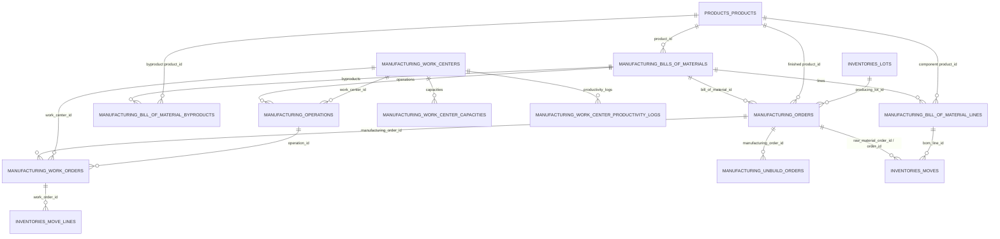

### 3. Sales & Purchasing ERD

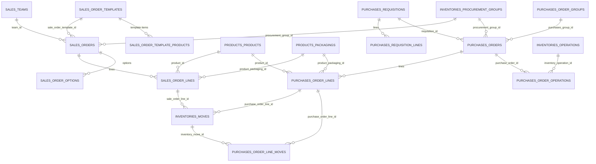

### 4. Cross-Domain References ERD (Core & Finance)

```mermaid
erDiagram
    COMPANIES ||--o{ PRODUCTS_PRODUCTS : "company_id [CORE]"
    COMPANIES ||--o{ INVENTORIES_WAREHOUSES : "company_id [CORE]"
    COMPANIES ||--o{ INVENTORIES_OPERATIONS : "company_id [CORE]"
    COMPANIES ||--o{ MANUFACTURING_ORDERS : "company_id [CORE]"
    COMPANIES ||--o{ SALES_ORDERS : "company_id [CORE]"
    COMPANIES ||--o{ PURCHASES_ORDERS : "company_id [CORE]"
    
    PARTNERS_PARTNERS ||--o{ SALES_ORDERS : "partner_id [CORE]"
    PARTNERS_PARTNERS ||--o{ PURCHASES_ORDERS : "partner_id [CORE]"
    PARTNERS_PARTNERS ||--o{ PRODUCTS_PRODUCT_SUPPLIERS : "partner_id [CORE]"
    
    UNIT_OF_MEASURES ||--o{ PRODUCTS_PRODUCTS : "uom_id / uom_po_id [CORE]"
    UNIT_OF_MEASURES ||--o{ INVENTORIES_MOVES : "uom_id [CORE]"
    UNIT_OF_MEASURES ||--o{ MANUFACTURING_BILLS_OF_MATERIALS : "uom_id [CORE]"
    
    CALENDARS ||--o{ MANUFACTURING_WORK_CENTERS : "calendar_id [CORE]"
    CALENDAR_LEAVES ||--o{ MANUFACTURING_WORK_ORDERS : "calendar_leave_id [CORE]"
    
    SALES_ORDERS ||--o{ SALES_ORDER_INVOICES : "order_id"
    ACCOUNTS_ACCOUNT_MOVES ||--o{ SALES_ORDER_INVOICES : "move_id [FINANCE]"
    
    SALES_ORDER_LINES ||--o{ SALES_ORDER_LINE_INVOICES : "order_line_id"
    ACCOUNTS_ACCOUNT_MOVE_LINES ||--o{ SALES_ORDER_LINE_INVOICES : "invoice_line_id [FINANCE]"
    
    PURCHASES_ORDERS ||--o{ PURCHASES_ORDER_ACCOUNT_MOVES : "order_id"
    ACCOUNTS_ACCOUNT_MOVES ||--o{ PURCHASES_ORDER_ACCOUNT_MOVES : "move_id [FINANCE]"
    
    PURCHASES_ORDER_LINES ||--o{ ACCOUNTS_ACCOUNT_MOVE_LINES : "purchase_order_line_id [FINANCE]"
```

### 5. Human Resources, Recruitment & Time-Off ERD

```mermaid
erDiagram
    COMPANIES ||--o{ EMPLOYEES_WORK_LOCATIONS : "company_id [CORE]"
    COMPANIES ||--o{ EMPLOYEES_DEPARTMENTS : "company_id [CORE]"
    COMPANIES ||--o{ EMPLOYEES_JOB_POSITIONS : "company_id [CORE]"
    COMPANIES ||--o{ EMPLOYEES_EMPLOYEES : "company_id [CORE]"
    COMPANIES ||--o{ RECRUITMENTS_CANDIDATES : "company_id [CORE]"
    COMPANIES ||--o{ RECRUITMENTS_APPLICANTS : "company_id [CORE]"
    COMPANIES ||--o{ TIME_OFF_LEAVE_TYPES : "company_id [CORE]"
    COMPANIES ||--o{ TIME_OFF_LEAVES : "company_id [CORE]"
    COMPANIES ||--o{ TIME_OFF_LEAVE_ALLOCATIONS : "company_id [CORE]"
    
    USERS ||--|| EMPLOYEES_EMPLOYEES : "user_id (1:1) [CORE]"
    USERS ||--o{ EMPLOYEES_EMPLOYEES : "leave_manager_id / attendance_manager_id [CORE]"
    PARTNERS_PARTNERS ||--o{ EMPLOYEES_EMPLOYEES : "partner_id [CORE]"
    PARTNERS_PARTNERS ||--o{ RECRUITMENTS_CANDIDATES : "partner_id [CORE]"
    CALENDARS ||--o{ EMPLOYEES_EMPLOYEES : "calendar_id [CORE]"
    CALENDARS ||--o{ TIME_OFF_LEAVES : "calendar_id [CORE]"
    
    EMPLOYEES_DEPARTMENTS ||--o{ EMPLOYEES_DEPARTMENTS : "parent_id"
    EMPLOYEES_DEPARTMENTS ||--o{ EMPLOYEES_JOB_POSITIONS : "department_id"
    EMPLOYEES_DEPARTMENTS ||--o{ EMPLOYEES_EMPLOYEES : "department_id"
    EMPLOYEES_EMPLOYEES ||--o{ EMPLOYEES_DEPARTMENTS : "manager_id"
    
    EMPLOYEES_JOB_POSITIONS ||--o{ EMPLOYEES_EMPLOYEES : "job_id"
    EMPLOYEES_EMPLOYEES ||--o{ EMPLOYEES_EMPLOYEES : "parent_id / coach_id"
    EMPLOYEES_WORK_LOCATIONS ||--o{ EMPLOYEES_EMPLOYEES : "work_location_id"
    EMPLOYEES_DEPARTURE_REASONS ||--o{ EMPLOYEES_EMPLOYEES : "departure_reason_id"
    EMPLOYEES_EMPLOYMENT_TYPES ||--o{ EMPLOYEES_EMPLOYEES : "employment_type_id"
    
    EMPLOYEES_SKILL_TYPES ||--o{ EMPLOYEES_SKILL_LEVELS : "skill_type_id"
    EMPLOYEES_SKILL_TYPES ||--o{ EMPLOYEES_SKILLS : "skill_type_id"
    EMPLOYEES_SKILLS ||--o{ EMPLOYEES_EMPLOYEE_SKILLS : "skill_id"
    EMPLOYEES_SKILL_LEVELS ||--o{ EMPLOYEES_EMPLOYEE_SKILLS : "skill_level_id"
    EMPLOYEES_EMPLOYEES ||--o{ EMPLOYEES_EMPLOYEE_SKILLS : "employee_id"
    
    EMPLOYEES_EMPLOYEES ||--o{ EMPLOYEES_EMPLOYEE_RESUMES : "employee_id"
    EMPLOYEES_EMPLOYEE_RESUME_LINE_TYPES ||--o{ EMPLOYEES_EMPLOYEE_RESUMES : "employee_resume_line_type_id"
    EMPLOYEES_EMPLOYEE_RESUMES ||--o{ EMPLOYEES_EMPLOYEE_RESUME_ATTACHMENTS : "employee_resume_id"
    
    EMPLOYEES_CATEGORIES ||--o{ EMPLOYEES_EMPLOYEE_CATEGORIES : "category_id"
    EMPLOYEES_EMPLOYEES ||--o{ EMPLOYEES_EMPLOYEE_CATEGORIES : "employee_id"
    
    RECRUITMENTS_STAGES ||--o{ RECRUITMENTS_STAGES_JOBS : "stage_id"
    EMPLOYEES_JOB_POSITIONS ||--o{ RECRUITMENTS_STAGES_JOBS : "job_id"
    
    RECRUITMENTS_DEGREES ||--o{ RECRUITMENTS_CANDIDATES : "degree_id"
    EMPLOYEES_EMPLOYEES ||--o{ RECRUITMENTS_CANDIDATES : "employee_id"
    RECRUITMENTS_CANDIDATES ||--o{ RECRUITMENTS_APPLICANTS : "candidate_id"
    RECRUITMENTS_STAGES ||--o{ RECRUITMENTS_APPLICANTS : "stage_id"
    EMPLOYEES_JOB_POSITIONS ||--o{ RECRUITMENTS_APPLICANTS : "job_id"
    EMPLOYEES_DEPARTMENTS ||--o{ RECRUITMENTS_APPLICANTS : "department_id"
    RECRUITMENTS_REFUSE_REASONS ||--o{ RECRUITMENTS_APPLICANTS : "refuse_reason_id"
    
    RECRUITMENTS_APPLICANT_CATEGORIES ||--o{ RECRUITMENTS_CANDIDATE_APPLICANT_CATEGORIES : "category_id"
    RECRUITMENTS_CANDIDATES ||--o{ RECRUITMENTS_CANDIDATE_APPLICANT_CATEGORIES : "candidate_id"
    
    RECRUITMENTS_APPLICANTS ||--o{ RECRUITMENTS_APPLICANT_INTERVIEWERS : "applicant_id"
    USERS ||--o{ RECRUITMENTS_APPLICANT_INTERVIEWERS : "interviewer_id [CORE]"
    
    TIME_OFF_LEAVE_TYPES ||--o{ TIME_OFF_LEAVES : "holiday_status_id"
    TIME_OFF_LEAVE_TYPES ||--o{ TIME_OFF_LEAVE_ALLOCATIONS : "holiday_status_id"
    TIME_OFF_LEAVE_TYPES ||--o{ TIME_OFF_LEAVE_ACCRUAL_PLANS : "time_off_type_id"
    TIME_OFF_LEAVE_ACCRUAL_PLANS ||--o{ TIME_OFF_LEAVE_ACCRUAL_LEVELS : "accrual_plan_id"
    TIME_OFF_LEAVE_ACCRUAL_PLANS ||--o{ TIME_OFF_LEAVE_ALLOCATIONS : "accrual_plan_id"
    
    EMPLOYEES_EMPLOYEES ||--o{ TIME_OFF_LEAVES : "employee_id / manager_id"
    EMPLOYEES_EMPLOYEES ||--o{ TIME_OFF_LEAVE_ALLOCATIONS : "employee_id / manager_id"
```

### 6. Projects, Maintenance & Extended Operations ERD

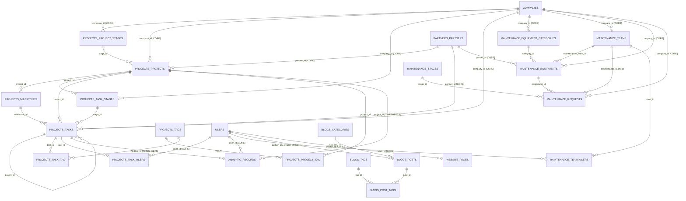

---

## Relationship Evidence

[VERIFIED]

Relationship: `products_products.parent_id` → `products_products.id`
Evidence: `plugins/webkul/products/src/Models/Product.php`
Symbol: `Product::parent()`, `Product::variants()`
Migration: `plugins/webkul/products/database/migrations/2025_01_05_100751_create_products_products_table.php`

[VERIFIED]

Relationship: `products_product_combinations.product_id` → `products_products.id`
Evidence: `plugins/webkul/products/src/Models/ProductCombination.php`
Symbol: `ProductCombination::product()`
Migration: `plugins/webkul/products/database/migrations/2025_02_21_053249 _create_products_product_combinations_table.php`

[VERIFIED]

Relationship: `inventories_locations.warehouse_id` → `inventories_warehouses.id`
Evidence: `plugins/webkul/inventories/src/Models/Location.php`
Symbol: `Location::warehouse()`
Migration: `plugins/webkul/inventories/database/migrations/2025_01_06_072224_create_inventories_locations_table.php`

[VERIFIED]

Relationship: `inventories_moves.operation_id` → `inventories_operations.id`
Evidence: `plugins/webkul/inventories/src/Models/Move.php`
Symbol: `Move::operation()`
Migration: `plugins/webkul/inventories/database/migrations/2025_01_14_133260_create_inventories_moves_table.php`

[VERIFIED]

Relationship: `inventories_move_lines.move_id` → `inventories_moves.id`
Evidence: `plugins/webkul/inventories/src/Models/MoveLine.php`
Symbol: `MoveLine::move()`
Migration: `plugins/webkul/inventories/database/migrations/2025_01_15_095753_create_inventories_move_lines_table.php`

[VERIFIED]

Relationship: `inventories_move_destinations.origin_move_id` ↔ `inventories_move_destinations.destination_move_id`
Evidence: `plugins/webkul/inventories/src/Models/Move.php`
Symbol: `Move::moveOrigins()`, `Move::moveDestinations()`
Migration: `plugins/webkul/inventories/database/migrations/2025_01_14_133266_create_inventories_move_destinations_table.php`

[VERIFIED]

Relationship: `manufacturing_bill_of_material_lines.bill_of_material_id` → `manufacturing_bills_of_materials.id`
Evidence: `plugins/webkul/manufacturing/src/Models/BillOfMaterialLine.php`
Symbol: `BillOfMaterialLine::billOfMaterial()`
Migration: `plugins/webkul/manufacturing/database/migrations/2026_03_31_064245_create_manufacturing_bill_of_material_lines_table.php`

[VERIFIED]

Relationship: `manufacturing_orders.bill_of_material_id` → `manufacturing_bills_of_materials.id`
Evidence: `plugins/webkul/manufacturing/src/Models/Order.php`
Symbol: `Order::billOfMaterial()`
Migration: `plugins/webkul/manufacturing/database/migrations/2026_03_31_064247_create_manufacturing_orders_table.php`

[VERIFIED]

Relationship: `manufacturing_work_orders.manufacturing_order_id` → `manufacturing_orders.id`
Evidence: `plugins/webkul/manufacturing/src/Models/WorkOrder.php`
Symbol: `WorkOrder::manufacturingOrder()`
Migration: `plugins/webkul/manufacturing/database/migrations/2026_03_31_064248_create_manufacturing_work_orders_table.php`

[VERIFIED]

Relationship: `inventories_moves.order_id` / `raw_material_order_id` → `manufacturing_orders.id`
Evidence: `plugins/webkul/manufacturing/src/Models/Order.php`
Symbol: `Order::rawMaterialMoves()`, `Order::finishedMoves()`
Migration: `plugins/webkul/manufacturing/database/migrations/2026_04_02_000003_alter_inventories_moves_table.php`

[VERIFIED]

Relationship: `sales_order_lines.order_id` → `sales_orders.id`
Evidence: `plugins/webkul/sales/src/Models/OrderLine.php`
Symbol: `OrderLine::order()`
Migration: `plugins/webkul/sales/database/migrations/2025_02_05_102851_create_sales_order_lines_table.php`

[VERIFIED]

Relationship: `sales_order_invoices.order_id` ↔ `sales_order_invoices.move_id`
Evidence: `plugins/webkul/sales/src/Models/Order.php`
Symbol: `Order::accountMoves()`, `Order::invoices()`
Migration: `plugins/webkul/sales/database/migrations/2025_03_05_124400_create_sales_order_invoices_table.php`

[VERIFIED]

Relationship: `sales_order_line_invoices.order_line_id` ↔ `sales_order_line_invoices.invoice_line_id`
Evidence: `plugins/webkul/sales/src/Models/OrderLine.php`
Symbol: `OrderLine::accountMoveLines()`
Migration: `plugins/webkul/sales/database/migrations/2025_03_05_124400_create_sales_order_line_invoices_table.php`

[VERIFIED]

Relationship: `purchases_order_lines.order_id` → `purchases_orders.id`
Evidence: `plugins/webkul/purchases/src/Models/OrderLine.php`
Symbol: `OrderLine::order()`
Migration: `plugins/webkul/purchases/database/migrations/2025_02_11_101118_create_purchases_order_lines_table.php`

[VERIFIED]

Relationship: `purchases_order_account_moves.order_id` ↔ `purchases_order_account_moves.move_id`
Evidence: `plugins/webkul/purchases/src/Models/Order.php`
Symbol: `Order::accountMoves()`, `Order::bills()`
Migration: `plugins/webkul/purchases/database/migrations/2025_02_11_142937_create_purchases_order_account_moves_table.php`

[VERIFIED]

Relationship: `accounts_account_move_lines.purchase_order_line_id` → `purchases_order_lines.id`
Evidence: `plugins/webkul/purchases/src/Models/OrderLine.php`
Symbol: `OrderLine::accountMoveLines()`
Migration: `plugins/webkul/purchases/database/migrations/2025_02_11_143351_alter_accounts_account_move_lines_table.php`

[VERIFIED]

Relationship: `purchases_order_operations.purchase_order_id` ↔ `purchases_order_operations.inventory_operation_id`
Evidence: `plugins/webkul/purchases/src/Models/Order.php`
Symbol: `Order::operations()`
Migration: `plugins/webkul/purchases/database/migrations/2025_03_17_115707_create_purchases_order_operations_table_from_purchases.php`

[VERIFIED]

Relationship: `employees_employees.user_id` → `users.id`
Evidence: `plugins/webkul/employees/src/Models/Employee.php`
Symbol: `Employee::user()`
Migration: `plugins/webkul/employees/database/migrations/2024_12_12_063353_create_employees_employees_table.php`

[VERIFIED]

Relationship: `employees_departments.manager_id` → `employees_employees.id`
Evidence: `plugins/webkul/employees/src/Models/Department.php`
Symbol: `Department::manager()`
Migration: `plugins/webkul/employees/database/migrations/2025_01_08_104443_add_manager_id_to_employees_departments_table.php`

[VERIFIED]

Relationship: `recruitments_candidates.employee_id` → `employees_employees.id`
Evidence: `plugins/webkul/recruitments/src/Models/Candidate.php`
Symbol: `Candidate::employee()`
Migration: `plugins/webkul/recruitments/database/migrations/2025_01_09_125852_create_recruitments_candidates_table.php`

[VERIFIED]

Relationship: `recruitments_applicants.job_id` → `employees_job_positions.id`
Evidence: `plugins/webkul/recruitments/src/Models/Applicant.php`
Symbol: `Applicant::job()`
Migration: `plugins/webkul/recruitments/database/migrations/2025_01_10_115422_create_recruitments_applicants_table.php`

[VERIFIED]

Relationship: `time_off_leaves.employee_id` → `employees_employees.id`
Evidence: `plugins/webkul/time-off/src/Models/Leave.php`
Symbol: `Leave::employee()`
Migration: `plugins/webkul/time-off/database/migrations/2025_01_17_080712_create_time_off_leaves_table.php`

[VERIFIED]

Relationship: `analytic_records.project_id` / `task_id` → `projects_projects.id` / `projects_tasks.id`
Evidence: `plugins/webkul/projects/src/Models/Timesheet.php`
Symbol: `Timesheet::project()`, `Timesheet::task()`
Migration: `plugins/webkul/projects/database/migrations/2024_12_18_145142_add_columns_to_analytic_records_table.php`

[VERIFIED]

Relationship: `maintenance_requests.equipment_id` → `maintenance_equipments.id`
Evidence: `plugins/webkul/maintenance/src/Models/MaintenanceRequest.php`
Symbol: `MaintenanceRequest::equipment()`
Migration: `plugins/webkul/maintenance/database/migrations/2026_05_18_000005_create_maintenance_requests_table.php`

---

## Tables / Models Investigated but Excluded

[VERIFIED]

| Entity | Plugin / Table | Status in ERD | Reason / Structure | Evidence File |
|---|---|---|---|---|
| `Barcode` | `plugins/webkul/barcode` | Included (UI Layer) | Contains 0 database tables and 0 migrations. Pure Livewire/JS scanner frontend over existing inventory tables. | `plugins/webkul/barcode/src/BarcodeServiceProvider.php` |
| `Timesheets` | `plugins/webkul/timesheets` | Included (Proxy Layer) | Contains 0 dedicated tables and 0 migrations. Operates directly on the `analytic_records` table mutated by `projects`. | `plugins/webkul/timesheets/src/TimesheetServiceProvider.php` |
| `Contacts` | `plugins/webkul/contacts` | Included (Proxy Layer) | Contains 0 dedicated tables and 0 migrations. Acts as a Filament CRM/UI wrapper directly over Core `partners_*` tables. | `plugins/webkul/contacts/src/ContactServiceProvider.php` |

---

## Unknowns and Limitations

[UNKNOWN]
- **Warehouse 2-Step / 3-Step Routing Triggers**:
  The database schema defines `reception_steps`, `delivery_steps`, and `manufacture_steps` enums on `inventories_warehouses` and links them to rule pulls (`mto_pull_id`, `buy_pull_id`, `manufacture_pull_id`). The precise runtime determination of whether a move chain is 1-step, 2-step, or 3-step relies on dynamic service execution (`WarehouseSettings`, `RuleService`) rather than static database triggers.

[PARTIALLY VERIFIED]
- **Product Usage Cross-Plugin Registry**:
  `Webkul\Product\Support\ProductUsageRegistry::isProductInUse()` dynamically inspects registered models across installed plugins (e.g. `sales_order_lines`, `purchases_order_lines`, `manufacturing_bill_of_material_lines`) before allowing variant mutations or deletions. Because registration occurs dynamically during service provider boot, static analysis confirms the registry structure but actual protected models depend on the runtime set of installed plugins.

[PARTIALLY VERIFIED]
- **Virtual Location Provisioning**:
  Company virtual locations (Customer, Supplier, Production, Inventory Loss, Transit) are dynamically provisioned per company via database seeders and `Location::getVirtualLocation()`. While their parent paths and types (`LocationType::CUSTOMER`, `SUPPLIER`, `PRODUCTION`, `TRANSIT`) are verified, individual ID assignments vary by deployment database state.

---

## Architectural Observations

1. **Pure Single-Table Variant Pattern**:
   Aureus ERP avoids the complexity of dual `ProductTemplate` and `ProductVariant` database tables. Storing both in `products_products` with a self-referencing `parent_id` simplifies ORM queries while using `is_configurable` to distinguish templates.
2. **Decoupled Cross-Plugin Migrations**:
   The application exhibits advanced cross-plugin schema migration practices:
   - When `inventories` is installed, it alters `sales_orders` and `purchases_orders` to add `procurement_group_id` and `warehouse_id`.
   - When `manufacturing` is installed, it alters `inventories_moves` to add `order_id`, `raw_material_order_id`, `work_order_id`, and `bom_line_id`.
   - When `projects` is installed, it alters `analytic_records` to add `project_id` and `task_id`.
   - When `recruitments` is installed, it alters `employees_job_positions` to add `address_id`, `manager_id`, `industry_id`, and `recruiter_id`.
   - When `website` is installed, it alters `partners_partners` to add customer portal authentication and login tracking fields.
3. **Decoupled Financial Invoicing via Junctions**:
   Sales and Purchasing do not lock their schemas to `accounts_account_moves` via direct foreign key columns. By using `sales_order_invoices` and `purchases_order_account_moves`, an order can be partially invoiced across multiple accounting documents without requiring foreign key schema mutations.
4. **Unified Workforce Entity Model**:
   By strictly linking `employees_employees.user_id` uniquely to `users.id`, the architecture separates system authentication/authorization (`users`) from operational personnel profile data (`employees`), while enabling users to serve as actors across sales, purchasing, shop-floor manufacturing, project management, and equipment maintenance.

---

## Change Impact

For guidelines on how schema and relationship changes in the Operations domain affect upstream Core services and downstream Finance ledgers, refer to `docs/architecture/overview.md`.

---

## Evidence Index

| ID | Evidence File | Symbol | Supports |
|---|---|---|---|
| E-OPS-001 | `plugins/webkul/products/src/Models/Product.php` | `Product::$table = 'products_products'` | Product master & variant model definition |
| E-OPS-002 | `plugins/webkul/products/database/migrations/2025_01_05_100751_create_products_products_table.php` | `Schema::create('products_products', ...)` | Product physical schema, parent_id, uom_id |
| E-OPS-003 | `plugins/webkul/products/database/migrations/2025_02_21_053249 _create_products_product_combinations_table.php` | `Schema::create('products_product_combinations', ...)` | Variant attribute combination junction schema |
| E-OPS-004 | `plugins/webkul/products/src/Models/Category.php` | `Category::$table = 'products_categories'` | Product hierarchical category model |
| E-OPS-005 | `plugins/webkul/products/src/Models/ProductSupplier.php` | `ProductSupplier::$table = 'products_product_suppliers'` | Vendor supplier pricing model |
| E-OPS-006 | `plugins/webkul/inventories/src/Models/Warehouse.php` | `Warehouse::$table = 'inventories_warehouses'` | Warehouse master model and configuration |
| E-OPS-007 | `plugins/webkul/inventories/src/Models/Location.php` | `Location::$table = 'inventories_locations'` | Hierarchical location storage model |
| E-OPS-008 | `plugins/webkul/inventories/src/Models/ProductQuantity.php` | `ProductQuantity::$table = 'inventories_product_quantities'` | Physical stock balance quant model |
| E-OPS-009 | `plugins/webkul/inventories/src/Models/Operation.php` | `Operation::$table = 'inventories_operations'` | Warehouse operation transfer header model |
| E-OPS-010 | `plugins/webkul/inventories/src/Models/Move.php` | `Move::$table = 'inventories_moves'` | Double-entry stock movement ledger model |
| E-OPS-011 | `plugins/webkul/inventories/src/Models/MoveLine.php` | `MoveLine::$table = 'inventories_move_lines'` | Physical stock execution line item model |
| E-OPS-012 | `plugins/webkul/inventories/database/migrations/2025_01_14_133266_create_inventories_move_destinations_table.php` | `Schema::create('inventories_move_destinations', ...)` | Chained multi-step stock move junction schema |
| E-OPS-013 | `plugins/webkul/inventories/src/Models/Lot.php` | `Lot::$table = 'inventories_lots'` | Lot and serial number tracking model |
| E-OPS-014 | `plugins/webkul/inventories/src/Models/Package.php` | `Package::$table = 'inventories_packages'` | Container package storage model |
| E-OPS-015 | `plugins/webkul/inventories/src/Models/Route.php` | `Route::$table = 'inventories_routes'` | Supply chain routing model |
| E-OPS-016 | `plugins/webkul/inventories/src/Models/Rule.php` | `Rule::$table = 'inventories_rules'` | Push/Pull procurement action rule model |
| E-OPS-017 | `plugins/webkul/inventories/src/Models/OrderPoint.php` | `OrderPoint::$table = 'inventories_order_points'` | Automated replenishment order point model |
| E-OPS-018 | `plugins/webkul/inventories/src/Models/ProcurementGroup.php` | `ProcurementGroup::$table = 'inventories_procurement_groups'` | Demand orchestration procurement group model |
| E-OPS-019 | `plugins/webkul/manufacturing/src/Models/BillOfMaterial.php` | `BillOfMaterial::$table = 'manufacturing_bills_of_materials'` | Bill of Materials master header model |
| E-OPS-020 | `plugins/webkul/manufacturing/src/Models/BillOfMaterialLine.php` | `BillOfMaterialLine::$table = 'manufacturing_bill_of_material_lines'` | Bill of Materials component line model |
| E-OPS-021 | `plugins/webkul/manufacturing/src/Models/WorkCenter.php` | `WorkCenter::$table = 'manufacturing_work_centers'` | Production work center station model |
| E-OPS-022 | `plugins/webkul/manufacturing/src/Models/Order.php` | `Order::$table = 'manufacturing_orders'` | Manufacturing production order header model |
| E-OPS-023 | `plugins/webkul/manufacturing/src/Models/WorkOrder.php` | `WorkOrder::$table = 'manufacturing_work_orders'` | Shop-floor work order execution model |
| E-OPS-024 | `plugins/webkul/manufacturing/src/Models/UnbuildOrder.php` | `UnbuildOrder::$table = 'manufacturing_unbuild_orders'` | Production disassembly order model |
| E-OPS-025 | `plugins/webkul/manufacturing/database/migrations/2026_04_02_000003_alter_inventories_moves_table.php` | `Schema::table('inventories_moves', ...)` | Manufacturing order FKs on inventories_moves |
| E-OPS-026 | `plugins/webkul/manufacturing/database/migrations/2026_04_02_000004_alter_inventories_move_lines_table.php` | `Schema::table('inventories_move_lines', ...)` | Work order FKs on inventories_move_lines |
| E-OPS-027 | `plugins/webkul/manufacturing/database/migrations/2026_04_02_000002_alter_inventories_warehouses_table.php` | `Schema::table('inventories_warehouses', ...)` | Manufacturing routing columns on warehouses |
| E-OPS-028 | `plugins/webkul/sales/src/Models/Order.php` | `Order::$table = 'sales_orders'` | Customer quotation and sales order model |
| E-OPS-029 | `plugins/webkul/sales/src/Models/OrderLine.php` | `OrderLine::$table = 'sales_order_lines'` | Sales line item and pricing model |
| E-OPS-030 | `plugins/webkul/sales/database/migrations/2025_03_05_124400_create_sales_order_invoices_table.php` | `Schema::create('sales_order_invoices', ...)` | Sales order to invoice junction schema |
| E-OPS-031 | `plugins/webkul/sales/database/migrations/2025_03_05_124400_create_sales_order_line_invoices_table.php` | `Schema::create('sales_order_line_invoices', ...)` | Sales line to invoice line junction schema |
| E-OPS-032 | `plugins/webkul/sales/database/migrations/2025_03_05_124300_create_sales_order_line_taxes_table.php` | `Schema::create('sales_order_line_taxes', ...)` | Sales line to tax junction schema |
| E-OPS-033 | `plugins/webkul/purchases/src/Models/Order.php` | `Order::$table = 'purchases_orders'` | RFQ and purchase order header model |
| E-OPS-034 | `plugins/webkul/purchases/src/Models/OrderLine.php` | `OrderLine::$table = 'purchases_order_lines'` | Purchase line item and pricing model |
| E-OPS-035 | `plugins/webkul/purchases/src/Models/Requisition.php` | `Requisition::$table = 'purchases_requisitions'` | Purchase agreement and requisition model |
| E-OPS-036 | `plugins/webkul/purchases/database/migrations/2025_02_11_142937_create_purchases_order_account_moves_table.php` | `Schema::create('purchases_order_account_moves', ...)` | Purchase order to vendor bill junction schema |
| E-OPS-037 | `plugins/webkul/purchases/database/migrations/2025_02_11_143351_alter_accounts_account_move_lines_table.php` | `Schema::table('accounts_account_move_lines', ...)` | Purchase line FK on accounts_account_move_lines |
| E-OPS-038 | `plugins/webkul/purchases/database/migrations/2025_03_17_115707_create_purchases_order_operations_table_from_purchases.php` | `Schema::create('purchases_order_operations', ...)` | Purchase order to inventory operation junction |
| E-OPS-039 | `plugins/webkul/purchases/database/migrations/2026_04_22_115707_create_purchases_order_line_moves_table_from_purchases.php` | `Schema::create('purchases_order_line_moves', ...)` | Purchase line to inventory move junction |
| E-OPS-040 | `plugins/webkul/barcode/src/BarcodeServiceProvider.php` | `BarcodeServiceProvider::$name = 'barcode'` | Verification of barcode UI-only architecture (0 tables) |
| E-OPS-041 | `plugins/webkul/purchases/src/PurchaseServiceProvider.php` | `Product::resolveRelationUsing('sellers', ...)` | Dynamic sellers relation on Product |
| E-OPS-042 | `plugins/webkul/manufacturing/src/ManufacturingServiceProvider.php` | `Product::resolveRelationUsing('billsOfMaterials', ...)` | Dynamic BOM relations on Product |
| E-OPS-043 | `plugins/webkul/inventories/src/InventoryServiceProvider.php` | `Product::resolveRelationUsing('routes', ...)` | Dynamic inventory relations on Product |
| E-OPS-044 | `plugins/webkul/employees/src/Models/Employee.php` | `Employee::$table = 'employees_employees'` | Employee master model with 1:1 user linkage |
| E-OPS-045 | `plugins/webkul/employees/database/migrations/2024_12_12_063353_create_employees_employees_table.php` | `Schema::create('employees_employees', ...)` | Employee physical schema & foreign keys |
| E-OPS-046 | `plugins/webkul/employees/src/Models/Department.php` | `Department::$table = 'employees_departments'` | Hierarchical department structure model |
| E-OPS-047 | `plugins/webkul/employees/src/Models/EmployeeJobPosition.php` | `EmployeeJobPosition::$table = 'employees_job_positions'` | Job position and role specification model |
| E-OPS-048 | `plugins/webkul/employees/src/Models/EmployeeSkill.php` | `EmployeeSkill::$table = 'employees_employee_skills'` | Employee skill grading assignment model |
| E-OPS-049 | `plugins/webkul/employees/src/Models/EmployeeResume.php` | `EmployeeResume::$table = 'employees_employee_resumes'` | Employee career resume history timeline model |
| E-OPS-050 | `plugins/webkul/recruitments/src/Models/Candidate.php` | `Candidate::$table = 'recruitments_candidates'` | Recruitment candidate talent profile model |
| E-OPS-051 | `plugins/webkul/recruitments/src/Models/Applicant.php` | `Applicant::$table = 'recruitments_applicants'` | Job application and candidate stage tracking model |
| E-OPS-052 | `plugins/webkul/recruitments/database/migrations/2025_01_10_115422_create_recruitments_applicants_table.php` | `Schema::create('recruitments_applicants', ...)` | Job application schema and UTM / stage foreign keys |
| E-OPS-053 | `plugins/webkul/time-off/src/Models/Leave.php` | `Leave::$table = 'time_off_leaves'` | Time-off leave request model with approval workflow |
| E-OPS-054 | `plugins/webkul/time-off/src/Models/LeaveType.php` | `LeaveType::$table = 'time_off_leave_types'` | Leave policy classification model |
| E-OPS-055 | `plugins/webkul/time-off/src/Models/LeaveAllocation.php` | `LeaveAllocation::$table = 'time_off_leave_allocations'` | Leave entitlement allocation balance model |
| E-OPS-056 | `plugins/webkul/time-off/src/Models/LeaveAccrualPlan.php` | `LeaveAccrualPlan::$table = 'time_off_leave_accrual_plans'` | Automated leave accrual rate calculation plan |
| E-OPS-057 | `plugins/webkul/projects/src/Models/Project.php` | `Project::$table = 'projects_projects'` | Project workspace master model |
| E-OPS-058 | `plugins/webkul/projects/src/Models/Task.php` | `Task::$table = 'projects_tasks'` | Project actionable task ticket model |
| E-OPS-059 | `plugins/webkul/projects/database/migrations/2024_12_18_145142_add_columns_to_analytic_records_table.php` | `Schema::table('analytic_records', ...)` | Project & task integration on analytic records |
| E-OPS-060 | `plugins/webkul/timesheets/src/Models/Timesheet.php` | `Timesheet extends BaseTimesheet` | Custom field timesheet extension model |
| E-OPS-061 | `plugins/webkul/maintenance/src/Models/Equipment.php` | `Equipment::$table = 'maintenance_equipments'` | Machinery equipment asset registry model |
| E-OPS-062 | `plugins/webkul/maintenance/src/Models/MaintenanceRequest.php` | `MaintenanceRequest::$table = 'maintenance_requests'` | Maintenance service & breakdown work order model |
| E-OPS-063 | `plugins/webkul/maintenance/src/Models/Team.php` | `Team::$table = 'maintenance_teams'` | Maintenance engineering team and technician roster |
| E-OPS-064 | `plugins/webkul/blogs/src/Models/Post.php` | `Post::$table = 'blogs_posts'` | Published translatable blog article model |
| E-OPS-065 | `plugins/webkul/website/src/Models/Page.php` | `Page::$table = 'website_pages'` | Translatable web portal CMS page model |
| E-OPS-066 | `plugins/webkul/website/database/migrations/2025_03_10_064655_alter_partners_partners_table.php` | `Schema::table('partners_partners', ...)` | Customer portal auth columns on partners |
| E-OPS-067 | `plugins/webkul/contacts/src/ContactServiceProvider.php` | `ContactServiceProvider::$name = 'contacts'` | Verification of contacts CRM proxy architecture (0 tables) |
