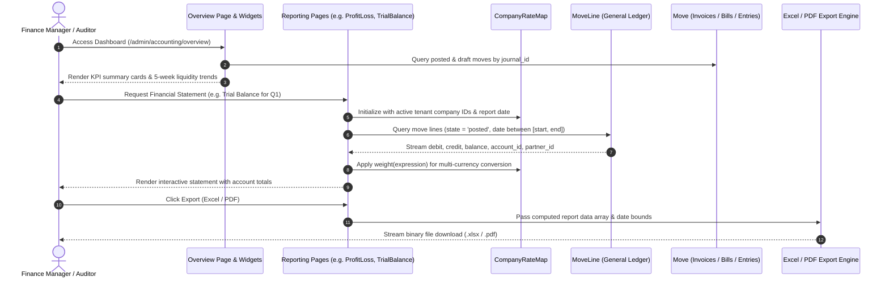

# Plugin: Accounting (`accounting`)

## Status
[VERIFIED]
Active Optional Module. Registered explicitly in `bootstrap/providers.php:39` as `Webkul\Accounting\AccountingServiceProvider::class`.

## Core/Optional
[VERIFIED]
**Optional Plugin**. Configured as a modular business domain presentation and reporting plugin without calling `$package->isCore()` (`plugins/webkul/accounting/src/AccountingServiceProvider.php:22-35`). Execution, Filament resource auto-discovery, cluster mounting, and page registration are gated by runtime installation verification via `Package::isPluginInstalled('accounting')` (`plugins/webkul/accounting/src/AccountingPlugin.php:23`).

## Enabled/Disabled
[VERIFIED]
**Conditionally Enabled (Database-Gated)**. `AccountingPlugin` registers conditionally on the `admin` Filament panel only when the plugin record in the database is marked `is_installed = true` (`plugins/webkul/accounting/src/AccountingPlugin.php:23-25`). When uninstalled, the entire accounting navigation cluster, reporting suite, journal chart dashboard widgets, and settings screens remain dormant without registering UI components.

## Purpose
[VERIFIED]
The `accounting` module serves as the primary visual user interface, financial reporting engine, real-time journal analytics dashboard, and Filament navigation orchestration layer for the Aureus ERP finance domain. While the underlying `accounts` plugin provides the foundational double-entry general ledger, calculation services, and headless resource definitions, `accounting` mounts the administrative experience on top of that foundation:

1. **Comprehensive Financial Statement & Reporting Engine (`Reporting` Cluster)**:
   - Delivers 7 full financial reports (`BalanceSheet`, `ProfitLoss`, `TrialBalance`, `GeneralLedger`, `PartnerLedger`, `AgedReceivable`, `AgedPayable`) under the `Reporting` cluster (`accounting/reporting`).
   - Implements interactive parameter filtering including customizable date ranges, single/multi-journal slicing, partner filtering, and ageing interval adjustments.
   - Provides dual export engines for every report: spreadsheet export (`.xlsx` via `Maatwebsite\Excel\Facades\Excel`) and print-ready PDF export (`.pdf` via `Barryvdh\DomPDF\Facade\Pdf`).

2. **Real-Time Financial Analytics & Journal Dashboard (`Overview` Page & Widgets)**:
   - Provides the main financial dashboard overview page (`accounting/overview`) with `JournalChartsWidget` and `JournalChartWidget`.
   - Visualizes live cashflow and liquidity trends over time (rolling 5-week weekly running balance line charts for Bank, Cash, and Credit Card journals).
   - Generates actionable operational KPI cards for Sale and Purchase journals (tracking counts and monetary sums for *To Validate*, *Unpaid*, *Late / Overdue*, and *To Pay* document queues).

3. **Filament Navigation & Cluster Architecture (`NavigationGroup::Accounting`)**:
   - Organizes all finance resources and pages into 5 distinct navigation clusters under the unified `Accounting` navigation group:
     - `Customers` (`accounting/customers`): Invoices, Credit Notes, Customer Payments, Customers, and Products.
     - `Vendors` (`accounting/vendors`): Vendor Bills, Refunds, Vendor Payments, Vendors, and Products.
     - `Accounting` (`accounting/accounting`): Manual Journal Entries (`JournalEntryResource`) and Double-Entry Journal Items Ledger (`JournalItemResource`).
     - `Reporting` (`accounting/reporting`): Financial Statements and Sub-Ledger Reports.
     - `Configuration` (`accounting/configurations`): Chart of Accounts, Journals, Taxes, Tax Groups, Fiscal Positions, Payment Terms, Cash Roundings, Incoterms, Currencies, Product Categories, and Attributes.
     - `PluginSettings` (`accounting/settings`): Default Accounts, Taxes, Invoicing, and Product accounting settings.
   - Activates navigation (`$shouldRegisterNavigation = true`) for all base resources inherited from the headless `accounts` engine.

4. **General Ledger & Double-Entry Journal Adjustment Tools**:
   - Exposes `JournalEntryResource` for creating, posting, viewing, and reversing balanced multi-line manual journal entries (`accounts_account_moves`).
   - Exposes `JournalItemResource` as a high-performance, read-only ledger line browser across all posted debit and credit lines (`accounts_account_move_lines`).

5. **Multi-Company & Multi-Currency Reporting Consolidation (`CompanyRateMap`)**:
   - Implements `CompanyRateMap` (`plugins/webkul/accounting/src/Support/CompanyRateMap.php:11-138`) to convert and weight multi-tenant currency transactions into the presentation company's base currency using conditional SQL `CASE` statements (`SUM(...)`) across aggregated move lines.

6. **Tenant Accounting Setup Gating (`GatesAccountingSetup` Concern)**:
   - Protects financial settings and configuration pages via `GatesAccountingSetup` (`plugins/webkul/accounting/src/Filament/Concerns/GatesAccountingSetup.php:12-65`), prompting administrators with a callout wizard to clone standard chart of accounts, tax templates, and fiscal journals via `AccountingSetupService` before operational use.

---

## Service Provider
[VERIFIED]
- **Class**: `Webkul\Accounting\AccountingServiceProvider` (`plugins/webkul/accounting/src/AccountingServiceProvider.php:16`)
- **Inheritance**: Extends `Webkul\PluginManager\PackageServiceProvider`
- **Registration & Configuration**:
  - `configureCustomPackage(Package $package)`:
    - Sets package name to `accounting` (`AccountingServiceProvider::$name = 'accounting'`).
    - Sets view namespace to `accounting` (`$viewNamespace = 'accounting'`).
    - Registers view namespace (`hasViews()`).
    - Registers translation namespace (`hasTranslations()`).
    - Declares runtime plugin dependency on `accounts` (`hasDependencies(['accounts'])`).
    - Configures plugin icon: `accounting`.
    - Configures install command: runs dependency installation (`$command->installDependencies()`).
    - Configures uninstall command: empty closure.
  - `packageRegistered()`:
    - Registers `AccountingPlugin::make()` with the Filament panel builder (`plugins/webkul/accounting/src/AccountingServiceProvider.php:46-48`).
  - `packageBooted()`:
    - Registers custom stylesheet: `Css::make('accounting', resources/dist/accounting.css)` (`plugins/webkul/accounting/src/AccountingServiceProvider.php:58-63`).
    - Registers Livewire components:
      - `accounting-journal-chart` (`Webkul\Accounting\Filament\Widgets\JournalChartWidget::class`).
      - `accounting-invoice-summary` (`Webkul\Accounting\Livewire\InvoiceSummary::class`).

---

## Filament Plugin Class
[VERIFIED]
- **Class**: `Webkul\Accounting\AccountingPlugin` (`plugins/webkul/accounting/src/AccountingPlugin.php:9`)
- **Plugin Identifier**: `'accounting'` (`getId(): string`)
- **Panel Registration**: Registers on the **`admin`** panel only (`plugins/webkul/accounting/src/AccountingPlugin.php:28`).
- **Auto-Discovery Configuration**:
  - Resources: `plugins/webkul/accounting/src/Filament/Resources` (`Webkul\Accounting\Filament\Resources`)
  - Pages: `plugins/webkul/accounting/src/Filament/Pages` (`Webkul\Accounting\Filament\Pages`)
  - Clusters: `plugins/webkul/accounting/src/Filament/Clusters` (`Webkul\Accounting\Filament\Clusters`)
  - Widgets: `plugins/webkul/accounting/src/Filament/Widgets` (`Webkul\Accounting\Filament\Widgets`)

---

## Composer Dependencies
[VERIFIED]
- **Declared in `plugins/webkul/accounting/composer.json`**:
  - `webkul/accounting` declares zero package-level Composer `require` entries.
  - Autoloads PSR-4 namespaces:
    - `Webkul\Accounting\`: `src/`
    - `Webkul\Accounting\Database\Factories\`: `database/factories/`
    - `Webkul\Accounting\Database\Seeders\`: `database/seeders/`
  - Autoloads dev PSR-4 namespace:
    - `Webkul\Accounting\Tests\`: `tests/`

---

## Runtime Plugin Dependencies
[VERIFIED]
- **`accounts`**: Declared in `AccountingServiceProvider::configureCustomPackage()` via `->hasDependencies(['accounts'])` (`plugins/webkul/accounting/src/AccountingServiceProvider.php:27-29`). The `accounting` plugin cannot function without `accounts`, as it owns no physical tables and derives its entire data model, calculations, transactions, and settings from `accounts`.

---

## Directory Structure
[VERIFIED]
```text
plugins/webkul/accounting/
├── .gitignore
├── composer.json
├── package.json
├── package-lock.json
├── postcss.config.js
├── tailwind.config.js
├── config/
│   └── filament-shield.php
├── database/
│   └── factories/
│       └── CategoryFactory.php
├── resources/
│   ├── css/
│   │   └── accounting.css
│   ├── dist/
│   │   └── accounting.css
│   ├── lang/
│   │   └── en/
│   │       ├── app.php
│   │       ├── setup.php
│   │       └── filament/
│   │           ├── clusters/
│   │           │   ├── accounting.php
│   │           │   ├── configurations.php
│   │           │   ├── customers.php
│   │           │   ├── reporting.php
│   │           │   ├── vendors.php
│   │           │   ├── accounting/ (resource translation files)
│   │           │   ├── configurations/ (resource translation files)
│   │           │   ├── customers/ (resource translation files)
│   │           │   ├── settings/ (page translation files)
│   │           │   └── vendors/ (resource translation files)
│   │           ├── exports/ (exporter translations)
│   │           ├── pages/ (overview page translations)
│   │           └── widgets/ (journal chart widget translations)
│   └── views/
│       └── filament/
│           ├── clusters/
│           │   └── reporting/
│           │       └── pages/
│           │           ├── aged-payable.blade.php
│           │           ├── aged-receivable.blade.php
│           │           ├── balance-sheet.blade.php
│           │           ├── general-ledger.blade.php
│           │           ├── partner-ledger.blade.php
│           │           ├── profit-loss.blade.php
│           │           ├── trial-balance.blade.php
│           │           ├── partials/ (report table partials)
│           │           └── pdfs/ (PDF layout templates for all 7 reports)
│           ├── pages/
│           │   └── overview.blade.php
│           └── widgets/
│               ├── journal-chart-widget.blade.php
│               └── journal-charts-widget.blade.php
├── src/
│   ├── AccountingPlugin.php
│   ├── AccountingServiceProvider.php
│   ├── Filament/
│   │   ├── Clusters/
│   │   │   ├── Accounting.php
│   │   │   ├── Configuration.php
│   │   │   ├── Customers.php
│   │   │   ├── PluginSettings.php
│   │   │   ├── Reporting.php
│   │   │   ├── Vendors.php
│   │   │   ├── Accounting/
│   │   │   │   └── Resources/
│   │   │   │       ├── JournalEntryResource.php
│   │   │   │       ├── JournalEntryResource/ (Pages, Schemas, Tables)
│   │   │   │       ├── JournalItemResource.php
│   │   │   │       └── JournalItemResource/ (Pages, Tables)
│   │   │   ├── Configuration/
│   │   │   │   └── Resources/
│   │   │   │       ├── AccountResource.php
│   │   │   │       ├── CashRoundingResource.php
│   │   │   │       ├── CurrencyResource.php
│   │   │   │       ├── FiscalPositionResource.php
│   │   │   │       ├── IncotermResource.php
│   │   │   │       ├── JournalResource.php
│   │   │   │       ├── PaymentTermResource.php
│   │   │   │       ├── ProductAttributeResource.php
│   │   │   │       ├── ProductCategoryResource.php
│   │   │   │       ├── TaxGroupResource.php
│   │   │   │       └── TaxResource.php
│   │   │   ├── Customers/
│   │   │   │   └── Resources/
│   │   │   │       ├── CreditNoteResource.php
│   │   │   │       ├── CustomerResource.php
│   │   │   │       ├── InvoiceResource.php
│   │   │   │       ├── PaymentResource.php
│   │   │   │       └── ProductResource.php
│   │   │   ├── Reporting/
│   │   │   │   └── Pages/
│   │   │   │       ├── AgedPayable.php
│   │   │   │       ├── AgedReceivable.php
│   │   │   │       ├── BalanceSheet.php
│   │   │   │       ├── GeneralLedger.php
│   │   │   │       ├── PartnerLedger.php
│   │   │   │       ├── ProfitLoss.php
│   │   │   │       ├── TrialBalance.php
│   │   │   │       ├── Concerns/
│   │   │   │       │   ├── NormalizeDateFilter.php
│   │   │   │       │   └── ShowsCurrencyNotice.php
│   │   │   │       └── Exports/
│   │   │   │           ├── AgedPayableExport.php
│   │   │   │           ├── AgedReceivableExport.php
│   │   │   │           ├── BalanceSheetExport.php
│   │   │   │           ├── GeneralLedgerExport.php
│   │   │   │           ├── PartnerLedgerExport.php
│   │   │   │           ├── ProfitAndLossExport.php
│   │   │   │           └── TrialBalanceExport.php
│   │   │   ├── Settings/
│   │   │   │   └── Pages/
│   │   │   │       ├── ManageCustomerInvoice.php
│   │   │   │       ├── ManageDefaultAccounts.php
│   │   │   │       ├── ManageProducts.php
│   │   │   │       └── ManageTaxes.php
│   │   │   └── Vendors/
│   │   │       └── Resources/
│   │   │           ├── BillResource.php
│   │   │           ├── PaymentResource.php
│   │   │           ├── ProductResource.php
│   │   │           ├── RefundResource.php
│   │   │           └── VendorResource.php
│   │   ├── Concerns/
│   │   │   └── GatesAccountingSetup.php
│   │   ├── Exports/
│   │   │   ├── JournalEntryExporter.php
│   │   │   └── JournalItemExporter.php
│   │   ├── Pages/
│   │   │   ├── Overview.php
│   │   │   └── Settings/
│   │   │       ├── ManageCustomerInvoice.php
│   │   │       ├── ManageDefaultAccounts.php
│   │   │       ├── ManageProducts.php
│   │   │       └── ManageTaxes.php
│   │   └── Widgets/
│   │       ├── JournalChartWidget.php
│   │       └── JournalChartsWidget.php
│   ├── Livewire/
│   │   └── InvoiceSummary.php
│   ├── Models/ (24 extension and proxy models)
│   ├── Policies/ (22 authorization policy classes)
│   └── Support/
│       └── CompanyRateMap.php
└── tests/
    ├── Helpers/
    │   └── ReportHelper.php
    └── Feature/
        └── Filament/ (8 Filament Feature test files)
```

---

## Models
[VERIFIED] [NOT APPLICABLE]
The `accounting` plugin **owns zero distinct physical database tables**. It defines 24 Eloquent proxy and subclass model classes (`plugins/webkul/accounting/src/Models/`) that extend the models defined in `Webkul\Account\Models\*`, `Webkul\Support\Models\*`, and `Webkul\Product\Models\*` to provide plugin-local namespacing for Filament Shield permissions, activity planning, and relation hooks:

1. **`Account` (`Webkul\Accounting\Models\Account`)**: Subclasses `Webkul\Account\Models\Account`.
2. **`Attribute` (`Webkul\Accounting\Models\Attribute`)**: Subclasses `Webkul\Product\Models\Attribute`.
3. **`BankAccount` (`Webkul\Accounting\Models\BankAccount`)**: Subclasses `Webkul\Partner\Models\BankAccount`.
4. **`Bill` (`Webkul\Accounting\Models\Bill`)**: Subclasses `Webkul\Account\Models\Move` (`MoveType::IN_INVOICE`).
5. **`CashRounding` (`Webkul\Accounting\Models\CashRounding`)**: Subclasses `Webkul\Account\Models\CashRounding`.
6. **`Category` (`Webkul\Accounting\Models\Category`)**: Subclasses `Webkul\Account\Models\Category` (uses `HasChatter`, sets `ACTIVITY_PLAN_PLUGIN = 'accounting'`, fillable `product_properties_definition`, relation `products()`).
7. **`CreditNote` (`Webkul\Accounting\Models\CreditNote`)**: Subclasses `Webkul\Account\Models\Move` (`MoveType::OUT_REFUND`).
8. **`Currency` (`Webkul\Accounting\Models\Currency`)**: Subclasses `Webkul\Support\Models\Currency`.
9. **`Customer` (`Webkul\Accounting\Models\Customer`)**: Subclasses `Webkul\Account\Models\Customer` (`Partner` filtered by `customer_rank > 0`).
10. **`FiscalPosition` (`Webkul\Accounting\Models\FiscalPosition`)**: Subclasses `Webkul\Account\Models\FiscalPosition`.
11. **`Incoterm` (`Webkul\Accounting\Models\Incoterm`)**: Subclasses `Webkul\Account\Models\Incoterm`.
12. **`Invoice` (`Webkul\Accounting\Models\Invoice`)**: Subclasses `Webkul\Account\Models\Move` (`MoveType::OUT_INVOICE`).
13. **`Journal` (`Webkul\Accounting\Models\Journal`)**: Subclasses `Webkul\Account\Models\Journal` (defines `moveLines()` relation).
14. **`JournalEntry` (`Webkul\Accounting\Models\JournalEntry`)**: Subclasses `Webkul\Account\Models\Move` (maps general journal entry operations).
15. **`JournalItem` (`Webkul\Accounting\Models\JournalItem`)**: Subclasses `Webkul\Account\Models\MoveLine` (maps double-entry ledger items).
16. **`MoveLine` (`Webkul\Accounting\Models\MoveLine`)**: Subclasses `Webkul\Account\Models\MoveLine` (defines `move()` relation targeting `Invoice`).
17. **`Partner` (`Webkul\Accounting\Models\Partner`)**: Subclasses `Webkul\Partner\Models\Partner`.
18. **`Payment` (`Webkul\Accounting\Models\Payment`)**: Subclasses `Webkul\Account\Models\Payment`.
19. **`PaymentTerm` (`Webkul\Accounting\Models\PaymentTerm`)**: Subclasses `Webkul\Account\Models\PaymentTerm`.
20. **`Product` (`Webkul\Accounting\Models\Product`)**: Subclasses `Webkul\Account\Models\Product`.
21. **`Refund` (`Webkul\Accounting\Models\Refund`)**: Subclasses `Webkul\Account\Models\Refund` (`MoveType::IN_REFUND`).
22. **`Tax` (`Webkul\Accounting\Models\Tax`)**: Subclasses `Webkul\Account\Models\Tax`.
23. **`TaxGroup` (`Webkul\Accounting\Models\TaxGroup`)**: Subclasses `Webkul\Account\Models\TaxGroup`.
24. **`Vendor` (`Webkul\Accounting\Models\Vendor`)**: Subclasses `Webkul\Account\Models\Vendor` (`Partner` filtered by `supplier_rank > 0`).

---

## Database
[VERIFIED] [NOT APPLICABLE]
The `accounting` plugin **owns zero physical database tables** and registers **zero database migrations** (`plugins/webkul/accounting/database/migrations` does not exist).

All database entities, table schemas (`accounts_account_moves`, `accounts_account_move_lines`, `accounts_accounts`, `accounts_journals`, `accounts_taxes`, `accounts_fiscal_positions`, `accounts_payment_terms`, `accounts_bank_statements`, `accounts_partial_reconciles`, `accounts_full_reconciles`), referential constraints, and multi-company isolation scopes used by this plugin are physically defined and owned by `accounts`.

For comprehensive database schema diagrams, column definitions, foreign keys, indexes, and company scoping rules, refer to the verified Phase 4 ERD document: [`docs/database/erds/finance.md`](../database/erds/finance.md) and the plugin documentation: [`docs/plugins/accounts.md`](accounts.md).

---

## Filament Resources, Pages, Widgets & Clusters
[VERIFIED]
The `accounting` plugin defines 5 clusters, 1 overview dashboard page, 2 dashboard widgets, 7 financial report pages with 7 Excel exporters and 7 PDF templates, 20+ cluster-routed resources, and 4 settings pages:

### 1. Overview Dashboard & Widgets
- **`Overview` Page** (`plugins/webkul/accounting/src/Filament/Pages/Overview.php:10`):
  - Route: `/admin/accounting/overview`
  - Navigation Group: `NavigationGroup::Accounting`
  - Permission: `page_accounting_overview`
  - Header Widgets: `JournalChartsWidget::class`
- **`JournalChartsWidget`** (`plugins/webkul/accounting/src/Filament/Widgets/JournalChartsWidget.php:8`):
  - Renders a multi-tab card container filtering visible journals (`show_on_dashboard = true`) by active tab (`all`, `sale`, `purchase`, `cash`, `bank`, `general`).
  - Iterates through filtered journals and mounts individual `JournalChartWidget` instances.
- **`JournalChartWidget`** (`plugins/webkul/accounting/src/Filament/Widgets/JournalChartWidget.php:16`):
  - Dynamic Livewire component generating KPI cards and chart visualizations per journal:
    - **Sale Journals (`JournalType::SALE`)**: Cards for *To Validate* (Draft moves count & total), *Unpaid* (Posted moves with residual balance), *Late* (Past due unpaid moves), and *To Pay* (Unpaid/Partial moves). Chart: 5-week weekly invoice distribution bar/line chart.
    - **Purchase Journals (`JournalType::PURCHASE`)**: Cards for *To Validate*, *Late*, and *To Pay* vendor bill queues. Chart: 5-week weekly vendor bill distribution chart.
    - **Liquidity Journals (`BANK`, `CASH`, `CREDIT_CARD`)**: Cards for total posted payments sum. Chart: Rolling 5-week line chart calculating weekly running balances (`#3b82f6` line, `tension: 0.3`).
    - **General Journals (`GENERAL`)**: Total journal entries count card and quick action button (`New Entry`).

### 2. Navigation Clusters
All clusters register under `NavigationGroup::Accounting`:
1. **`Customers` Cluster** (`Webkul\Accounting\Filament\Clusters\Customers`): Slug `accounting/customers` (Sort: 2).
2. **`Vendors` Cluster** (`Webkul\Accounting\Filament\Clusters\Vendors`): Slug `accounting/vendors` (Sort: 3).
3. **`Accounting` Cluster** (`Webkul\Accounting\Filament\Clusters\Accounting`): Slug `accounting/accounting` (Sort: 4).
4. **`Reporting` Cluster** (`Webkul\Accounting\Filament\Clusters\Reporting`): Slug `accounting/reporting` (Sort: 5).
5. **`Configuration` Cluster** (`Webkul\Accounting\Filament\Clusters\Configuration`): Slug `accounting/configurations` (Sort: 6).
6. **`PluginSettings` Cluster** (`Webkul\Accounting\Filament\Clusters\PluginSettings`): Slug `accounting/settings` (Sort: 7).

### 3. Financial Reporting Suite (`Reporting` Cluster)
Every report implements `HasPageShield`, `InteractsWithForms`, `NormalizeDateFilter`, `ShowsCurrencyNotice`, and header action exports for Excel (`Maatwebsite\Excel`) and PDF (`Barryvdh\DomPDF`):
1. **`BalanceSheet`** (`plugins/webkul/accounting/src/Filament/Clusters/Reporting/Pages/BalanceSheet.php:28`):
   - Computes Assets, Liabilities, and Equity sections, calculating current period balances, comparative period balances, and net variance.
   - Excel Export: `BalanceSheetExport`. PDF View: `accounting::filament.clusters.reporting.pages.pdfs.balance-sheet`.
2. **`ProfitLoss`** (`plugins/webkul/accounting/src/Filament/Clusters/Reporting/Pages/ProfitLoss.php:28`):
   - Computes Operating Income (Revenue), Cost of Goods Sold (COGS), Gross Profit, Operating Expenses, and Net Profit/Loss.
   - Filterable by date range picker and specific journals.
   - Excel Export: `ProfitAndLossExport`. PDF View: `accounting::filament.clusters.reporting.pages.pdfs.profit-loss`.
3. **`TrialBalance`** (`plugins/webkul/accounting/src/Filament/Clusters/Reporting/Pages/TrialBalance.php:28`):
   - Lists all accounts in the chart with Opening Balance (Debit/Credit), Period Movement (Debit/Credit), and Ending Balance (Debit/Credit).
   - Validates that overall ledger debits equal credits across active date bounds.
   - Excel Export: `TrialBalanceExport`. PDF View: `accounting::filament.clusters.reporting.pages.pdfs.trial-balance`.
4. **`GeneralLedger`** (`plugins/webkul/accounting/src/Filament/Clusters/Reporting/Pages/GeneralLedger.php:28`):
   - Comprehensive audit subledger grouping all posted move lines by account code.
   - Displays entry dates, document names, counterpart partners, journal references, debits, credits, and progressive running balance.
   - Excel Export: `GeneralLedgerExport`. PDF View: `accounting::filament.clusters.reporting.pages.pdfs.general-ledger`.
5. **`PartnerLedger`** (`plugins/webkul/accounting/src/Filament/Clusters/Reporting/Pages/PartnerLedger.php:28`):
   - Customer and vendor subledger grouping transactions by commercial partner.
   - Tracks individual invoices, credit notes, payments, due dates, residual amounts, and net partner balance.
   - Excel Export: `PartnerLedgerExport`. PDF View: `accounting::filament.clusters.reporting.pages.pdfs.partner-ledger`.
6. **`AgedReceivable`** (`plugins/webkul/accounting/src/Filament/Clusters/Reporting/Pages/AgedReceivable.php:28`):
   - Customer outstanding debt aging analysis categorizing unpaid customer invoice residuals into aging buckets: *Current / At Date*, *1–30 Days*, *31–60 Days*, *61–90 Days*, *91–120 Days*, and *Older*.
   - Excel Export: `AgedReceivableExport`. PDF View: `accounting::filament.clusters.reporting.pages.pdfs.aged-receivable`.
7. **`AgedPayable`** (`plugins/webkul/accounting/src/Filament/Clusters/Reporting/Pages/AgedPayable.php:28`):
   - Vendor outstanding debt aging analysis categorizing unpaid vendor bill residuals into aging buckets with customizable aging intervals (e.g. 30-day steps).
   - Excel Export: `AgedPayableExport`. PDF View: `accounting::filament.clusters.reporting.pages.pdfs.aged-payable`.

### 4. Operational Cluster Resources
- **Accounting Cluster (`Accounting`)**:
  - `JournalEntryResource`: Manual journal entry management (`ListJournalEntries`, `CreateJournalEntry`, `ViewJournalEntry`, `EditJournalEntry`). Custom form fields, custom table columns/filters, sub-navigation linking to payment records, and `JournalEntryExporter`.
  - `JournalItemResource`: Read-only general ledger line browser (`ListJournalItems`) with `JournalItemExporter`. Creation, direct editing, and manual line deletion are disabled (`canCreate(): false`, `canEdit(): false`, `canDelete(): false`) to maintain ledger integrity.
- **Customers Cluster (`Customers`)**:
  - `InvoiceResource`: Customer invoices (`ListInvoices`, `CreateInvoice`, `ViewInvoice`, `EditInvoice`, `ManagePayments`). Extended product repeater with deep-linking (`openProduct` action).
  - `CreditNoteResource`: Customer credit notes / refunds.
  - `PaymentResource`: Customer inbound receipt payments.
  - `CustomerResource`: Customer master profiles (filtered `customer_rank > 0`).
  - `ProductResource`: Sales products and services.
- **Vendors Cluster (`Vendors`)**:
  - `BillResource`: Vendor bills (`ListBills`, `CreateBill`, `ViewBill`, `EditBill`, `ManagePayments`).
  - `RefundResource`: Vendor debit notes / refunds.
  - `PaymentResource`: Outbound vendor payments.
  - `VendorResource`: Supplier profiles (filtered `supplier_rank > 0`).
  - `ProductResource`: Purchase products and raw materials.
- **Configuration Cluster (`Configuration`)**:
  - `AccountResource`: Chart of accounts management.
  - `JournalResource`: Sales, Purchase, Bank, Cash, and General journals.
  - `TaxResource`: Tax definitions, calculation formulas, and distribution repartition lines.
  - `TaxGroupResource`: Tax reporting categories.
  - `FiscalPositionResource`: Regional tax and account mapping rules.
  - `PaymentTermResource`: Payment term schedules and installment due terms.
  - `CashRoundingResource`: Cash rounding rules.
  - `IncotermResource`: International commercial terms.
  - `CurrencyResource`: Currency list and live exchange rates.
  - `ProductCategoryResource`: Category account mapping configuration.
  - `ProductAttributeResource`: Product variant attributes.

### 5. Settings Pages (`PluginSettings` Cluster)
Gated by `GatesAccountingSetup` to ensure initial chart of accounts setup:
- `ManageDefaultAccounts`: Configures default income, expense, exchange difference gain/loss, and discount accounts.
- `ManageTaxes`: Configures default customer/vendor taxes and global tax rounding method.
- `ManageCustomerInvoice`: Configures default payment terms and invoice delivery options.
- `ManageProducts`: Configures product property definitions and automatic category accounting.

---

## Panels
[VERIFIED]
Registers on the **`admin`** panel only (`plugins/webkul/accounting/src/AccountingPlugin.php:28`). Does not register on the `customer` portal panel.

---

## Services
[VERIFIED]
The `accounting` module defines 1 support service class:

1. **`CompanyRateMap` (`Webkul\Accounting\Support\CompanyRateMap`)** (`plugins/webkul/accounting/src/Support/CompanyRateMap.php:11`):
   - Multi-company and multi-currency exchange rate resolver for financial reporting queries.
   - Computes conversion rates between subsidiary company currencies and the active presentation company currency for a given valuation date (`resolveRate()`).
   - Identifies whether the active dataset is mono-currency (`isMonoCurrency(): bool`) or contains missing exchange rates (`hasMissingRates(): bool`, `missingRateCompanyIds()`).
   - Builds dynamic SQL weighting expressions (`weight()`, `sum()`) injecting `CASE accounts_account_moves.company_id WHEN {id} THEN {rate} ... ELSE 1 END` into Eloquent raw aggregation expressions (`DB::raw('SUM(...) as ...')`).

---

## Events
[VERIFIED]
The `accounting` plugin defines **zero custom event classes**. All financial events (`MoveConfirmed`, `MoveCancelled`, `MoveDrafted`, `MoveReversed`, `MovePaid`, `MoveCreated`, `MoveUpdated`) are dispatched by the foundational `accounts` services (`Webkul\Account\Services\MoveWorkflow`, `PaymentRegistrar`).

---

## Listeners
[VERIFIED]
The `accounting` plugin defines **zero event listeners**.

---

## Observers
[VERIFIED]
The `accounting` plugin defines **zero model observers**.

---

## Policies
[VERIFIED]
The `accounting` module registers 22 authorization policies under `plugins/webkul/accounting/src/Policies/`. Each policy enforces granular Filament Shield permissions prefixed with `..._accounting_...`:

| Policy Class | Model | Verified Permissions Enforced |
|:---|:---|:---|
| `AccountPolicy` | `Webkul\Accounting\Models\Account` | `view_any_accounting_account`, `view_accounting_account`, `create_accounting_account`, `update_accounting_account`, `delete_accounting_account`, `delete_any_accounting_account`, `force_delete_accounting_account`, `restore_accounting_account` |
| `JournalEntryPolicy` | `Webkul\Accounting\Models\JournalEntry` | `view_any_accounting_journal_entry`, `view_accounting_journal_entry`, `create_accounting_journal_entry`, `update_accounting_journal_entry`, `delete_accounting_journal_entry`, `delete_any_accounting_journal_entry` |
| `JournalItemPolicy` | `Webkul\Accounting\Models\JournalItem` | `view_any_accounting_journal_item`, `view_accounting_journal_item`, `create_accounting_journal_item`, `update_accounting_journal_item`, `delete_accounting_journal_item` |
| `JournalPolicy` | `Webkul\Accounting\Models\Journal` | `view_any_accounting_journal`, `view_accounting_journal`, `create_accounting_journal`, `update_accounting_journal`, `delete_accounting_journal` |
| `InvoicePolicy` | `Webkul\Accounting\Models\Invoice` | `view_any_accounting_invoice`, `view_accounting_invoice`, `create_accounting_invoice`, `update_accounting_invoice`, `delete_accounting_invoice` |
| `BillPolicy` | `Webkul\Accounting\Models\Bill` | `view_any_accounting_bill`, `view_accounting_bill`, `create_accounting_bill`, `update_accounting_bill`, `delete_accounting_bill` |
| `CreditNotePolicy` | `Webkul\Accounting\Models\CreditNote` | `view_any_accounting_credit_note`, `view_accounting_credit_note`, `create_accounting_credit_note`, `update_accounting_credit_note`, `delete_accounting_credit_note` |
| `RefundPolicy` | `Webkul\Accounting\Models\Refund` | `view_any_accounting_refund`, `view_accounting_refund`, `create_accounting_refund`, `update_accounting_refund`, `delete_accounting_refund` |
| `PaymentPolicy` | `Webkul\Accounting\Models\Payment` | `view_any_accounting_payment`, `view_accounting_payment`, `create_accounting_payment`, `update_accounting_payment`, `delete_accounting_payment` |
| `CustomerPolicy` | `Webkul\Accounting\Models\Customer` | `view_any_accounting_customer`, `view_accounting_customer`, `create_accounting_customer`, `update_accounting_customer`, `delete_accounting_customer`, `restore_accounting_customer` |
| `VendorPolicy` | `Webkul\Accounting\Models\Vendor` | `view_any_accounting_vendor`, `view_accounting_vendor`, `create_accounting_vendor`, `update_accounting_vendor`, `delete_accounting_vendor`, `restore_accounting_vendor` |
| `ProductPolicy` | `Webkul\Accounting\Models\Product` | `view_any_accounting_product`, `view_accounting_product`, `create_accounting_product`, `update_accounting_product`, `delete_accounting_product` |
| `CategoryPolicy` | `Webkul\Accounting\Models\Category` | `view_any_accounting_category`, `view_accounting_category`, `create_accounting_category`, `update_accounting_category`, `delete_accounting_category` |
| `AttributePolicy` | `Webkul\Accounting\Models\Attribute` | `view_any_accounting_attribute`, `view_accounting_attribute`, `create_accounting_attribute`, `update_accounting_attribute`, `delete_accounting_attribute` |
| `TaxPolicy` | `Webkul\Accounting\Models\Tax` | `view_any_accounting_tax`, `view_accounting_tax`, `create_accounting_tax`, `update_accounting_tax`, `delete_accounting_tax` |
| `TaxGroupPolicy` | `Webkul\Accounting\Models\TaxGroup` | `view_any_accounting_tax_group`, `view_accounting_tax_group`, `create_accounting_tax_group`, `update_accounting_tax_group`, `delete_accounting_tax_group` |
| `FiscalPositionPolicy` | `Webkul\Accounting\Models\FiscalPosition` | `view_any_accounting_fiscal_position`, `view_accounting_fiscal_position`, `create_accounting_fiscal_position`, `update_accounting_fiscal_position`, `delete_accounting_fiscal_position` |
| `PaymentTermPolicy` | `Webkul\Accounting\Models\PaymentTerm` | `view_any_accounting_payment_term`, `view_accounting_payment_term`, `create_accounting_payment_term`, `update_accounting_payment_term`, `delete_accounting_payment_term` |
| `CashRoundingPolicy` | `Webkul\Accounting\Models\CashRounding` | `view_any_accounting_cash_rounding`, `view_accounting_cash_rounding`, `create_accounting_cash_rounding`, `update_accounting_cash_rounding`, `delete_accounting_cash_rounding` |
| `IncotermPolicy` | `Webkul\Accounting\Models\Incoterm` | `view_any_accounting_incoterm`, `view_accounting_incoterm`, `create_accounting_incoterm`, `update_accounting_incoterm`, `delete_accounting_incoterm` |
| `CurrencyPolicy` | `Webkul\Accounting\Models\Currency` | `view_any_accounting_currency`, `view_accounting_currency`, `create_accounting_currency`, `update_accounting_currency`, `delete_accounting_currency` |
| `BankAccountPolicy` | `Webkul\Accounting\Models\BankAccount` | `view_any_accounting_bank_account`, `view_accounting_bank_account`, `create_accounting_bank_account`, `update_accounting_bank_account`, `delete_accounting_bank_account` |

---

## Routes
[VERIFIED]
The `accounting` plugin defines **zero custom HTTP/API routes** and contains no `routes/` folder. All accounting REST API endpoints (`admin/api/v1/accounts/...`) are registered and handled exclusively by `accounts`.

---

## Settings
[VERIFIED]
The `accounting` plugin exposes 4 settings pages under `plugins/webkul/accounting/src/Filament/Clusters/Settings/Pages/` and `plugins/webkul/accounting/src/Filament/Pages/Settings/` which interface with the Spatie settings classes declared in `accounts`:
- **`ManageDefaultAccounts`**: Edits `Webkul\Account\Settings\DefaultAccountsSettings` (default income, expense, cash discount, exchange difference accounts).
- **`ManageTaxes`**: Edits `Webkul\Account\Settings\TaxesSettings` (default sales tax, purchase tax, calculation rounding).
- **`ManageCustomerInvoice`**: Edits `Webkul\Account\Settings\CustomerInvoiceSettings` (due term defaults, invoice delivery terms).
- **`ManageProducts`**: Manages dynamic product property definitions and automatic category accounting assignments.

---

## Translations
[VERIFIED]
The `accounting` module registers the translation namespace `accounting` (`resources/lang/en/`):
- `app.php`: Navigation settings and cluster labels.
- `setup.php`: Accounting setup wizard notices, action labels, and confirmation notifications.
- `filament/clusters/accounting.php`, `configurations.php`, `customers.php`, `reporting.php`, `vendors.php`: Cluster titles and navigation breadcrumbs.
- `filament/clusters/reporting.php`: Extensive translation strings for all 7 financial reports, filters, column headers, and PDF/Excel export actions.
- `filament/pages/overview.php`: Overview dashboard titles and navigation labels.
- `filament/widgets/journal-charts-widget.php`: Metric card titles and chart action tooltips.

---

## Tests
[VERIFIED]
- **Test Presence**: The `accounting` plugin **has dedicated feature test files** residing in `plugins/webkul/accounting/tests/`.
- **Test Framework**: Pest 4 / PHPUnit 12 with Livewire test utilities (`Livewire::test(...)`).
- **Feature Tests** (`plugins/webkul/accounting/tests/Feature/Filament/`):
  1. `AgedPayableTest.php` (8 tests): Verifies aged payable page rendering, bucket placement for not-yet-due bills (`at_date`), overdue bills (<1 period in `period_1`, >1 period in `period_2`), partner total consistency, draft bill exclusions, and single-partner filtering.
  2. `AgedReceivableTest.php` (8 tests): Verifies aged receivable page rendering, bucket calculations for current vs overdue customer invoices, customer partner filtering, and draft exclusions.
  3. `BalanceSheetTest.php` (6 tests): Verifies balance sheet rendering, asset/liability/equity summation, opening balance roll-forward, and period boundary filtering.
  4. `GeneralLedgerTest.php` (8 tests): Verifies general ledger rendering, line-by-line item presentation, running debit/credit balance accumulation, date range filtering, and journal scoping.
  5. `PartnerLedgerTest.php` (8 tests): Verifies partner subledger grouping, invoice and payment allocations, partner balance calculations, and multi-partner filtering.
  6. `ProfitLossTest.php` (8 tests): Verifies profit and loss rendering, revenue vs expense netting, net profit / net loss boolean determination, date range boundary exclusions, draft exclusions, and journal filter isolation.
  7. `TrialBalanceTest.php` (8 tests): Verifies trial balance rendering, initial balance carryover, period credit/debit movements, end balance calculations, total debit = total credit balance equality, and draft revenue exclusions.
  8. `ResourceGlobalSearchSmokeTest.php` (3 tests): Tests that all registered accounting resources build non-crashing global search details and titles when optional relations are empty.
- **Test Helpers** (`plugins/webkul/accounting/tests/Helpers/`):
  - `ReportHelper.php`: Provides test fixture helpers (`postedSale`, `postedBill`, `postedSaleDueOn`, `postedBillDueOn`, `draftSale`, `draftBill`, `productAccountId`, `receivableAccountId`) to simulate posted financial ledgers across test dates.

---

## Runtime Dependencies
[VERIFIED]
- **`accounts`**: Required runtime dependency. Provides all database tables, Eloquent models, calculation managers (`TaxManager`, `AccountManager`), workflow engines (`MoveWorkflow`), and base Filament schemas.

---

## Cross-Plugin Relationships
[VERIFIED]
1. **`accounts`**: Direct host relationship. `accounting` subclasses `accounts` models, mounts its resources into clusters, and reads from `accounts_account_moves` and `accounts_account_move_lines`.
2. **`products`**: References products and product categories for invoice line item deep-linking (`openProduct` action) and category accounting configuration (`ProductCategoryResource`, `Category::ACTIVITY_PLAN_PLUGIN`).
3. **`partners`**: References partners, bank accounts, and addresses for customer/vendor subledgers, aged debt reports, and partner navigation items.
4. **`support`**: Uses `CompanyContext` for multi-company active tenant resolution, `Company` and `Currency` models for currency conversions in `CompanyRateMap`, and `NavigationGroup::Accounting` for menu grouping.
5. **`security`**: Uses `User` model and integrates with `Webkul\Security\Bouncer` via Filament Shield policies (`plugins/webkul/accounting/config/filament-shield.php`).
6. **`chatter`**: Uses `HasChatter` trait on `Category` model for activity tracking and audit logs.

---

## Data Flow
[VERIFIED]



---

## Business Rules
[VERIFIED]
1. **Reporting Date Inclusivity & Time Normalization**:
   - `NormalizeDateFilter` ensures that date range filters normalize start dates to `00:00:00` and end dates to `23:59:59` to guarantee that all moves posted on boundary dates are accurately included in trial balances and profit/loss calculations.
2. **Draft Transaction Exclusion from Ledgers**:
   - Financial reports (`BalanceSheet`, `ProfitLoss`, `TrialBalance`, `GeneralLedger`, `PartnerLedger`, `AgedReceivable`, `AgedPayable`) strictly filter `state = 'posted'`. Draft moves (`state = 'draft'`) and cancelled moves (`state = 'cancel'`) are excluded from general ledger figures.
3. **Double-Entry Balance Enforcement in Trial Balance**:
   - In `TrialBalance`, total debits must equal total credits across all accounts (`end_debit === end_credit`). Initial balances roll forward all previous periods prior to `date_from`.
4. **Ageing Interval Segmentation**:
   - `AgedReceivable` and `AgedPayable` segment unpaid residual balances (`amount_residual > 0`) into past-due buckets based on `invoice_date_due` relative to `as_of_date`. Invoices not yet due appear under `at_date`.
5. **Multi-Currency Report Consolidation**:
   - When active tenants operate across multiple currencies, `CompanyRateMap` applies conversion rates against the active presentation company's currency using historical conversion tables from `support`. If currency conversion rates are missing, a warning notice is displayed via `ShowsCurrencyNotice`.
6. **Journal Item Immutability in UI**:
   - In `JournalItemResource`, direct creation, manual row editing, and single-item deletion are disabled (`canCreate(): false`, `canEdit(): false`, `canDelete(): false`) to prevent unauthorized corruption of balanced ledger rows. Adjustments must be performed through complete reversing entries or manual journal entries in `JournalEntryResource`.

---

## Extension Points
[VERIFIED]
1. **Custom Financial Reports**:
   - Additional financial statement pages can be added to `plugins/webkul/accounting/src/Filament/Clusters/Reporting/Pages/` by extending `Filament\Pages\Page`, setting `protected static ?string $cluster = Reporting::class`, and utilizing `CompanyRateMap` and `NormalizeDateFilter`.
2. **Custom Journal Chart Visualizations**:
   - `JournalChartWidget` can be customized or extended to support specialized graph formats or custom KPI metrics for unique journal types.
3. **Cluster Navigation Injections**:
   - Sibling plugins (e.g. `invoices`, `sales`, `purchases`, `payments`) can contribute pages and resources into `Accounting`, `Customers`, `Vendors`, or `Configuration` clusters by setting `protected static ?string $cluster = Webkul\Accounting\Filament\Clusters\...::class`.

---

## Dangerous Areas
[VERIFIED]
- **Test Presence**: The `accounting` plugin **has 8 feature test files** in `plugins/webkul/accounting/tests/Feature/Filament/` verifying report calculations and global searches.
- **Large Ledger Aggregation Performance**: Financial reporting queries (`GeneralLedger`, `PartnerLedger`, `TrialBalance`) execute heavy `SUM()` and `groupBy()` operations directly against `accounts_account_move_lines`. In large enterprise databases with hundreds of thousands of journal items, unindexed date or account queries can cause timeouts without database query caching.
- **Multi-Currency Missing Rate Warnings**: If `CompanyRateMap` detects that a subsidiary company operates in a currency without a recorded conversion rate to the presentation currency, it falls back to a 1:1 rate and flags `hasMissingRates(): true`. Financial reports must be monitored for the `ShowsCurrencyNotice` warning banner.
- **Accounting Setup Gating Bypass**: If `GatesAccountingSetup` is removed from configuration pages, administrators could attempt to post moves before default accounts and tax repartitions are initialized, leading to `MissingJournalException` or unallocated ledger items.

---

## Change Impact
[VERIFIED]
- **Modifying `CompanyRateMap`**: Impacts the numerical accuracy of all 7 financial reports in multi-company environments.
- **Modifying `Reporting` Pages**: Alters financial statement presentation, balance aggregation logic, and PDF/Excel export layouts.
- **Modifying `AccountingPlugin` / Clusters**: Reorganizes or suppresses navigation tabs across the entire administrative finance interface.

---

## Evidence
[VERIFIED]
- `plugins/webkul/accounting/src/AccountingServiceProvider.php:16-64`
- `plugins/webkul/accounting/src/AccountingPlugin.php:9-52`
- `plugins/webkul/accounting/src/Support/CompanyRateMap.php:11-138`
- `plugins/webkul/accounting/src/Filament/Pages/Overview.php:10-40`
- `plugins/webkul/accounting/src/Filament/Widgets/JournalChartsWidget.php:8-26`
- `plugins/webkul/accounting/src/Filament/Widgets/JournalChartWidget.php:16-312`
- `plugins/webkul/accounting/src/Filament/Clusters/Reporting/Pages/ProfitLoss.php:28-264`
- `plugins/webkul/accounting/src/Filament/Clusters/Reporting/Pages/TrialBalance.php:28-250`
- `plugins/webkul/accounting/src/Filament/Clusters/Reporting/Pages/BalanceSheet.php:28-250`
- `plugins/webkul/accounting/src/Filament/Clusters/Reporting/Pages/GeneralLedger.php:28-240`
- `plugins/webkul/accounting/src/Filament/Clusters/Reporting/Pages/PartnerLedger.php:28-240`
- `plugins/webkul/accounting/src/Filament/Clusters/Reporting/Pages/AgedReceivable.php:28-250`
- `plugins/webkul/accounting/src/Filament/Clusters/Reporting/Pages/AgedPayable.php:28-250`
- `plugins/webkul/accounting/src/Filament/Clusters/Accounting/Resources/JournalEntryResource.php:24-105`
- `plugins/webkul/accounting/src/Filament/Clusters/Accounting/Resources/JournalItemResource.php:14-78`
- `plugins/webkul/accounting/src/Filament/Concerns/GatesAccountingSetup.php:12-65`
- `plugins/webkul/accounting/config/filament-shield.php:1-84`
- `plugins/webkul/accounting/tests/Feature/Filament/AgedPayableTest.php:1-120`
- `plugins/webkul/accounting/tests/Feature/Filament/TrialBalanceTest.php:1-138`
- `plugins/webkul/accounting/tests/Feature/Filament/ProfitLossTest.php:1-108`
- `plugins/webkul/accounting/tests/Helpers/ReportHelper.php:1-116`
