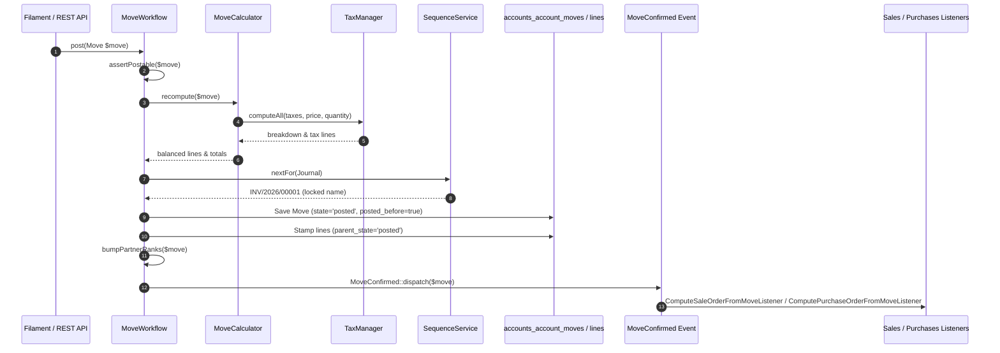

# Plugin: Accounts (`accounts`)

## Status
[VERIFIED]
Active Optional Module. Registered explicitly in `bootstrap/providers.php:48` as `Webkul\Account\AccountServiceProvider::class`.

## Core/Optional
[VERIFIED]
**Optional Plugin**. Configured as a modular business domain plugin without calling `$package->isCore()` (`plugins/webkul/accounts/src/AccountServiceProvider.php:50-152`). Execution and asset loading are gated by runtime installation verification via `Package::isPluginInstalled('accounts')` (`plugins/webkul/accounts/src/AccountServiceProvider.php:172,181,199,270` and `plugins/webkul/accounts/src/AccountPlugin.php:23`).

## Enabled/Disabled
[VERIFIED]
**Conditionally Enabled (Database-Gated)**. `AccountServiceProvider` boots conditionally based on whether the plugin record in the database is marked `installed = true`. If uninstalled, event listeners, dynamic relationship injections, schema contributions, Filament resource registrations, and API routes are suppressed.

## Purpose
[VERIFIED]
The `accounts` module serves as the foundational double-entry financial accounting, general ledger, fiscal journal, invoicing, vendor billing, payment processing, tax calculation, multi-currency accounting, and bank reconciliation engine for Aureus ERP:

1. **Unified Double-Entry Transaction Ledger (`Move` & `MoveLine`)**:
   - Manages all accounting documents (customer invoices, vendor bills, credit notes, refunds, customer/vendor receipts, and general journal entries) inside a single unified transactional table (`accounts_account_moves`), distinguished by enum `MoveType` (`ENTRY`, `OUT_INVOICE`, `OUT_REFUND`, `IN_INVOICE`, `IN_REFUND`, `OUT_RECEIPT`, `IN_RECEIPT`).
   - Balances debits, credits, and multi-currency exchange amounts across ledger entries (`accounts_account_move_lines`).
   - Tracks document lifecycle states (`MoveState`: `DRAFT`, `POSTED`, `CANCEL`) and payment settlement progress (`PaymentState`: `NOT_PAID`, `IN_PAYMENT`, `PAID`, `PARTIAL`, `REVERSED`, `INVOICING_LEGACY`).

2. **Hierarchical Multi-Company Chart of Accounts (`Account`)**:
   - Implements multi-company shared ledger accounts (`accounts_accounts`) supporting parent-child trees (`parent_id`) and account types (`AccountType`: `ASSET_RECEIVABLE`, `LIABILITY_PAYABLE`, `INCOME`, `EXPENSE`, `ASSET_CASH`, etc.).
   - Employs `BelongsToCompanies` and the pivot table `accounts_account_companies` to allow legal entities to share or restrict chart of accounts partitions.

3. **Categorized Accounting Journals (`Journal`)**:
   - Segregates financial operations into dedicated journals (`accounts_journals`) by `JournalType` (`SALE`, `PURCHASE`, `CASH`, `BANK`, `GENERAL`).
   - Configures default debit/credit accounts, suspense accounts, profit/loss accounts, and links polymorphically to `SequenceService` for automated document numbering.

4. **Tax Calculation Engine & Fiscal Localization (`Tax`, `TaxGroup`, `TaxPartition`, `FiscalPosition`)**:
   - Supports percentage, fixed, formula-based, and group taxes (`accounts_taxes`) with price-inclusive and price-exclusive rules.
   - Evaluates custom mathematical PHP expressions in tax formulas via `TaxFormulaEvaluator`.
   - Maps taxes to general ledger accounts and document types (`invoice` vs `refund`) via repartition lines (`accounts_tax_repartition_lines`).
   - Automatically maps taxes and ledger accounts according to customer/vendor geographic jurisdictions via fiscal positions (`accounts_fiscal_positions`, `accounts_fiscal_position_taxes`, `accounts_fiscal_position_accounts`).

5. **Cash & Bank Payment Processing (`Payment`, `PaymentMethod`, `PaymentMethodLine`, `PaymentRegister`)**:
   - Manages inbound and outbound payments (`accounts_account_payments`) categorized by `PaymentType` (`RECEIVE`, `SEND`).
   - Automatically generates balancing journal entries (`move_id`) upon payment posting.
   - Provides batch payment wizard orchestration (`PaymentRegister` / `PaymentRegistrar`) to reconcile multiple invoices/bills against single or grouped payments.

6. **Full & Partial Reconciliation Architecture (`PartialReconcile`, `FullReconcile`, `Reconciler`)**:
   - Matches debit move lines with credit move lines across multi-currency transactions (`accounts_partial_reconciles`).
   - Groups fully settled matching lines into full reconciliation records (`accounts_full_reconciles`).
   - Automatically detects currency rate differentials and posts exchange difference journal entries via `ExchangeDifferenceRecorder`.

7. **Bank Statements & Reconciliation (`BankStatement`, `BankStatementLine`)**:
   - Tracks bank statement transaction headers and line items (`accounts_bank_statements`, `accounts_bank_statement_lines`) to clear suspense and outstanding bank accounts.

8. **Multi-Tenant Master Data Finance Extensions (`CompanyProperty` Cast)**:
   - Extends Core `Partner` and `Product`/`Category` models with company-specific financial foreign keys (receivable/payable accounts, fiscal positions, payment terms, income/expense accounts) stored in dedicated EAV tables (`partners_partner_company_properties`, `products_product_company_accounts`, `products_category_company_accounts`) without altering host core tables.

9. **Comprehensive REST API Suite**:
   - Exposes full REST API v1 endpoints under `admin/api/v1/accounts` for invoices, bills, credit notes, refunds, accounts, journals, taxes, tax groups, fiscal positions, payment terms, cash roundings, incoterms, customers, and vendors.

---

## Service Provider
[VERIFIED]
- **Class**: `Webkul\Account\AccountServiceProvider` (`plugins/webkul/accounts/src/AccountServiceProvider.php:44`)
- **Inheritance**: Extends `Webkul\PluginManager\PackageServiceProvider`
- **Registration & Configuration**:
  - `configureCustomPackage(Package $package)`:
    - Sets package name to `accounts` (`AccountServiceProvider::$name = 'accounts'`).
    - Sets view namespace to `accounts` (`$viewNamespace = 'accounts'`).
    - Registers view namespace (`hasViews()`).
    - Registers translation namespace (`hasTranslations()`).
    - Registers API routes (`hasRoutes(['api'])`).
    - Registers 55 database migrations (`hasMigrations([...])`) and executes them (`runsMigrations()`):
      1. `2025_01_29_044430_create_accounts_payment_terms_table`
      2. `2025_01_29_064646_create_accounts_payment_due_terms_table`
      3. `2025_01_29_134156_create_accounts_incoterms_table`
      4. `2025_01_29_134157_create_accounts_tax_groups_table`
      5. `2025_01_30_054952_create_accounts_accounts_table`
      6. `2025_01_30_054955_create_accounts_account_companies_table`
      7. `2025_01_30_061945_create_accounts_account_tags_table`
      8. `2025_01_30_083208_create_accounts_taxes_table`
      9. `2025_01_30_123324_create_accounts_tax_partition_lines_table`
      10. `2025_01_31_073645_create_accounts_journals_table`
      11. `2025_01_31_095921_create_accounts_journal_accounts_table`
      12. `2025_01_31_125419_create_accounts_tax_tax_relations_table`
      13. `2025_02_03_054613_create_accounts_account_taxes_table`
      14. `2025_02_03_055117_create_accounts_account_account_tags_table`
      15. `2025_02_03_055709_create_accounts_account_journals_table`
      16. `2025_02_03_121847_create_accounts_fiscal_positions_table`
      17. `2025_02_03_131858_create_accounts_fiscal_position_taxes_table`
      18. `2025_02_03_131860_create_accounts_fiscal_position_accounts_table`
      19. `2025_02_03_144139_create_accounts_cash_roundings_table`
      20. `2025_02_04_082243_alter_products_products_table`
      21. `2025_02_04_104958_create_accounts_product_taxes_table`
      22. `2025_02_04_111337_create_accounts_product_supplier_taxes_table`
      23. `2025_02_10_073440_create_accounts_reconciles_table`
      24. `2025_02_10_075022_create_accounts_payment_methods_table`
      25. `2025_02_10_075607_create_accounts_payment_method_lines_table`
      26. `2025_02_11_041318_create_accounts_bank_statements_table`
      27. `2025_02_11_055302_create_accounts_bank_statement_lines_table`
      28. `2025_02_11_055302_create_accounts_account_payments_table`
      29. `2025_02_11_055303_create_accounts_account_moves_table`
      30. `2025_02_11_071210_create_accounts_account_move_lines_table`
      31. `2025_02_11_100912_add_move_id_column_to_accounts_bank_statement_lines_table`
      32. `2025_02_11_115401_create_accounts_full_reconciles_table`
      33. `2025_02_11_120712_create_accounts_partial_reconciles_table`
      34. `2025_02_11_121630_add_columns_to_accounts_moves_table`
      35. `2025_02_11_121635_add_columns_to_accounts_account_payments_table`
      36. `2025_02_11_121635_add_columns_to_accounts_moves_lines_table`
      37. `2025_02_17_064828_create_accounts_payment_registers_table`
      38: `2025_02_17_070121_create_accounts_account_payment_register_move_lines_table`
      39. `2025_02_24_123300_add_additional_columns_to_partners_partners_table`
      40. `2025_02_24_124300_create_accounts_accounts_move_line_taxes_table`
      41. `2025_02_27_112520_create_accounts_accounts_move_reversals_table`
      42. `2025_02_27_132520_create_accounts_accounts_move_reversal_move_table`
      43. `2025_02_27_142520_create_accounts_accounts_move_reversal_new_move_table`
      44. `2025_02_28_142520_create_accounts_accounts_move_payment_table`
      45. `2025_04_10_053345_alter_accounts_account_moves_table`
      46. `2025_04_10_053349_alter_accounts_account_move_lines_table`
      47. `2025_08_11_043945_alter_accounts_reconciles_table`
      48. `2025_08_11_044151_alter_accounts_payments_methods_table`
      49. `2025_08_11_044258_alter_accounts_bank_statements_table`
      50. `2025_08_11_044445_alter_accounts_account_payments_table`
      51. `2025_08_11_044603_alter_accounts_bank_statement_lines_table`
      52. `2025_08_11_044842_alter_accounts_account_move_lines_table`
      53. `2025_08_11_044931_alter_accounts_partial_reconciles_table`
      54. `2025_08_04_062050_alter_accounts_taxes_table`
      55. `2025_08_01_091957_alter_accounts_payment_terms_table`
      56. `2025_10_23_082243_alter_products_categories_table`
      57. `2025_11_19_081920_alter_accounts_account_move_lines_table`
      58. `2025_12_09_103848_alter_accounts_payment_method_lines_table`
      59. `2025_12_16_074557_add_journal_id_in_accounts_accounts_move_reversals_table`
      60. `2026_01_15_060822_backfill_customer_and_supplier_rank_in_partners_table`
      61. `2026_02_16_063000_alter_partners_partners_table`
      62. `2026_02_25_044931_alter_accounts_full_reconciles_table`
      63. `2026_03_03_120000_alter_accounts_journals_bank_account_foreign_key`
      64. `2026_04_17_000001_add_parent_id_to_accounts_accounts_table`
      65. `2026_07_21_110000_fix_bank_cash_journal_default_accounts`
      66. `2026_07_21_120000_null_company_on_payment_terms`
      67. `2026_07_30_090000_create_products_product_company_accounts_table`
      68. `2026_07_30_120000_create_products_category_company_accounts_table`
      69. `2026_07_30_120001_create_partners_partner_company_properties_table`
      70. `2026_08_03_130000_seed_accounts_sequences`
    - Registers 3 settings migrations (`hasSettings([...])`, `runsSettings()`):
      - `2025_12_02_094021_create_accounts_default_accounts_settings`
      - `2025_12_02_094021_create_accounts_taxes_settings`
      - `2025_12_02_094021_create_customer_invoice_settings`
    - Registers runtime plugin dependency on `products` (`hasDependencies(['products'])`).
    - Registers database seeder: `Webkul\Account\Database\Seeders\DatabaseSeeder`.
    - Configures install command: runs dependency installation, migrations, and seeders.
    - Configures uninstall command: purges chatter messages for `[Move::class, Payment::class]` and purges document sequences for `[Journal::class]`.
  - `packageRegistered()`:
    - Registers `AccountPlugin::make()` with Filament panel builder.
    - Registers Facades and Singletons: `TaxFacade` / `'tax'` (`TaxManager::class`), `AccountFacade` / `'account'` (`AccountManager::class`).
  - `packageBooted()`:
    - Registers Livewire component `'invoice-summary'` (`InvoiceSummary::class`).
    - Registers custom stylesheet `'accounts'` (`resources/dist/accounts.css`).
    - Listens to `eloquent.saved: *` to flush `CompanyProperty` cache on `Partner`, `Product`, `Category`.
    - Contributes dynamic UI form/infolist tabs, fillables, casts, and relations to `Partner` (`PartnerSchemaRegistry`, `Partner::contributeFillable()`, `Partner::contributeCasts()`, `Partner::resolveRelationUsing()`).
    - Contributes pricing fields, tax relations, fillables, and casts to `Product` and `Category` (`ProductSchemaRegistry`, `Product::contributeFillable()`, `Product::contributeCasts()`, `Category::contributeCasts()`, `Product::resolveRelationUsing()`, `Category::resolveRelationUsing()`).
    - Registers `MoveLine::class` with `ProductUsageRegistry::register(MoveLine::class)` to guard products in active ledger lines from deletion.

---

## Filament Plugin Class
[VERIFIED]
- **Class**: `Webkul\Account\AccountPlugin` (`plugins/webkul/accounts/src/AccountPlugin.php:9`)
- **Plugin Identifier**: `'accounts'` (`getId(): string`)
- **Panel Registration**: Configured conditionally on the `admin` panel (`$panel->when($panel->getId() == 'admin', ...)`).
- **Auto-Discovery Configuration**:
  - Resources: `plugins/webkul/accounts/src/Filament/Resources` (`Webkul\Account\Filament\Resources`)
  - Pages: `plugins/webkul/accounts/src/Filament/Pages` (`Webkul\Account\Filament\Pages`)
  - Clusters: `plugins/webkul/accounts/src/Filament/Clusters` (`Webkul\Account\Filament\Clusters`)
  - Widgets: `plugins/webkul/accounts/src/Filament/Widgets` (`Webkul\Account\Filament\Widgets`)

---

## Composer Dependencies
[VERIFIED]
- **Declared in `plugins/webkul/accounts/composer.json`**:
  - `webkul/accounts` declares zero package-level Composer `require` entries.
  - Autoloads PSR-4 namespaces:
    - `Webkul\Account\`: `src/`
    - `Webkul\Account\Database\Factories\`: `database/factories/`
    - `Webkul\Account\Database\Seeders\`: `database/seeders/`
    - `Webkul\Account\Tests\`: `tests/`

---

## Runtime Plugin Dependencies
[VERIFIED]
- **`products`**: Declared in `AccountServiceProvider::configureCustomPackage()` via `->hasDependencies(['products'])`. The `accounts` module requires `products` for product tax configurations (`accounts_product_taxes`, `accounts_product_supplier_taxes`), product income/expense accounts (`ProductCompanyAccount`, `CategoryCompanyAccount`), invoice/bill line item referencing (`MoveLine.product_id`), and `ProductUsageRegistry` registration.

---

## Directory Structure
[VERIFIED]
```text
plugins/webkul/accounts/
├── .gitignore
├── composer.json
├── package.json
├── package-lock.json
├── postcss.config.js
├── config/
│   └── filament-shield.php
├── database/
│   ├── factories/
│   │   ├── AccountFactory.php
│   │   ├── AccountTagFactory.php
│   │   ├── BankAccountFactory.php
│   │   ├── BankStatementFactory.php
│   │   ├── BankStatementLineFactory.php
│   │   ├── CashRoundingFactory.php
│   │   ├── CategoryCompanyAccountFactory.php
│   │   ├── FiscalPositionAccountFactory.php
│   │   ├── FiscalPositionFactory.php
│   │   ├── FiscalPositionTaxFactory.php
│   │   ├── FullReconcileFactory.php
│   │   ├── IncotermFactory.php
│   │   ├── JournalFactory.php
│   │   ├── MoveFactory.php
│   │   ├── MoveLineFactory.php
│   │   ├── MoveReversalFactory.php
│   │   ├── PartialReconcileFactory.php
│   │   ├── PartnerCompanyPropertyFactory.php
│   │   ├── PaymentDueTermFactory.php
│   │   ├── PaymentFactory.php
│   │   ├── PaymentMethodFactory.php
│   │   ├── PaymentMethodLineFactory.php
│   │   ├── PaymentRegisterFactory.php
│   │   ├── PaymentTermFactory.php
│   │   ├── ProductCompanyAccountFactory.php
│   │   ├── TaxFactory.php
│   │   ├── TaxGroupFactory.php
│   │   └── TaxPartitionFactory.php
│   ├── migrations/ (55 migration files)
│   ├── seeders/ (26 seeder files)
│   └── settings/ (3 settings migration files)
├── resources/
│   ├── css/
│   │   └── accounts.css
│   ├── dist/
│   │   └── accounts.css
│   ├── lang/
│   │   └── en/
│   │       ├── account-manager.php
│   │       ├── system.php
│   │       ├── enums/ (30 enum translation files)
│   │       ├── filament/ (resource and page translation files)
│   │       ├── models/
│   │       └── traits/
│   └── views/
│       ├── livewire/
│       │   └── invoice-summary.blade.php
│       └── mail/
│           └── invoice/
│               └── actions/
│                   └── invoice.blade.php
├── routes/
│   └── api.php
├── src/
│   ├── AccountManager.php
│   ├── AccountPlugin.php
│   ├── AccountServiceProvider.php
│   ├── TaxManager.php
│   ├── Casts/
│   │   └── CompanyProperty.php
│   ├── Enums/ (30 backed enum definitions)
│   ├── Events/
│   │   ├── MoveCancelled.php
│   │   ├── MoveConfirmed.php
│   │   ├── MoveCreated.php
│   │   ├── MoveDrafted.php
│   │   ├── MovePaid.php
│   │   ├── MoveReversed.php
│   │   └── MoveUpdated.php
│   ├── Exceptions/
│   │   ├── InvalidTaxFormulaException.php
│   │   └── MissingJournalException.php
│   ├── Facades/
│   │   ├── Account.php
│   │   └── Tax.php
│   ├── Filament/
│   │   ├── Exports/
│   │   │   ├── BillExporter.php
│   │   │   ├── InvoiceExporter.php
│   │   │   └── PaymentExporter.php
│   │   └── Resources/ (20 Filament resources with Pages, Schemas, Tables, Infolists)
│   ├── Http/
│   │   ├── Controllers/
│   │   │   └── API/
│   │   │       └── V1/ (19 API controllers)
│   │   ├── Requests/ (API validation FormRequests)
│   │   └── Resources/ (API JsonResource transformers)
│   ├── Livewire/
│   │   └── InvoiceSummary.php
│   ├── Mail/
│   │   └── Invoice/
│   │       └── Actions/
│   │           └── InvoiceEmail.php
│   ├── Models/ (45 Eloquent models and proxy classes)
│   ├── Policies/ (18 authorization policy classes)
│   ├── Services/ (12 domain services)
│   ├── Settings/ (3 Spatie settings classes)
│   └── Traits/
│       ├── FiscalPositionTax.php
│       ├── PaymentDueTerm.php
│       └── TaxPartition.php
└── tests/
    ├── Helpers/
    │   └── AccountHelper.php
    └── Feature/
        ├── API/V1/ (18 API feature test files)
        ├── Filament/ (6 Filament UI test files)
        └── Workflows/ (17 business logic workflow test files)
```

---

## Models
[VERIFIED]
The `accounts` module defines 45 model classes (`plugins/webkul/accounts/src/Models/`):

### Primary Ledger & Document Models
1. **`Move` (`Webkul\Account\Models\Move`)**:
   - Table: `accounts_account_moves`.
   - The unified financial document header for all invoices, vendor bills, credit notes, refunds, receipts, and manual journal entries.
   - Traits: `BelongsToCompany`, `ChecksCompanyConsistency`, `HasChatter`, `HasCustomFields`, `HasFactory`, `HasLogActivity`, `HasOwnershipScope`.
   - Casts: `move_type` (`MoveType`), `state` (`MoveState`), `payment_state` (`PaymentState`), `invoice_date` (`date`), `invoice_date_due` (`date`), `date` (`date`), `amount_untaxed` (`decimal:4`), `amount_tax` (`decimal:4`), `amount_total` (`decimal:4`), `amount_residual` (`decimal:4`).
   - Relationships: `belongsTo(Journal::class)`, `belongsTo(Company::class)`, `belongsTo(Currency::class)`, `belongsTo(Partner::class, 'partner_id')`, `belongsTo(Partner::class, 'commercial_partner_id')`, `belongsTo(BankAccount::class, 'partner_bank_id')`, `belongsTo(PaymentTerm::class)`, `belongsTo(FiscalPosition::class)`, `belongsTo(Incoterm::class)`, `belongsTo(Move::class, 'reversed_entry_id')`, `hasMany(MoveLine::class, 'move_id')`, `belongsToMany(Payment::class, 'accounts_accounts_move_payment', 'invoice_id', 'payment_id')`.

2. **`MoveLine` (`Webkul\Account\Models\MoveLine`)**:
   - Table: `accounts_account_move_lines`.
   - Represents an individual debit or credit line item in the double-entry general ledger.
   - Traits: `BelongsToCompany`, `ChecksCompanyConsistency`, `HasCustomFields`, `HasFactory`, `HasLogActivity`.
   - Casts: `display_type` (`DisplayType`), `parent_state` (`MoveState`), `price_unit` (`decimal:4`), `quantity` (`decimal:4`), `discount` (`decimal:4`), `debit` (`decimal:4`), `credit` (`decimal:4`), `balance` (`decimal:4`), `amount_currency` (`decimal:4`), `amount_residual` (`decimal:4`), `amount_residual_currency` (`decimal:4`).
   - Relationships: `belongsTo(Move::class, 'move_id')`, `belongsTo(Journal::class)`, `belongsTo(Company::class)`, `belongsTo(Account::class)`, `belongsTo(Partner::class)`, `belongsTo(Product::class)`, `belongsTo(UOM::class)`, `belongsTo(Currency::class)`, `belongsTo(Tax::class, 'tax_line_id')`, `belongsTo(FullReconcile::class)`, `hasMany(PartialReconcile::class, 'debit_move_id')`, `hasMany(PartialReconcile::class, 'credit_move_id')`, `belongsToMany(Tax::class, 'accounts_accounts_move_line_taxes', 'move_line_id', 'tax_id')`.

3. **`Account` (`Webkul\Account\Models\Account`)**:
   - Table: `accounts_accounts`.
   - Ledger account in the chart of accounts.
   - Traits: `BelongsToCompanies`, `HasCustomFields`, `HasFactory`, `HasLogActivity`.
   - Relationships: `belongsTo(Account::class, 'parent_id')`, `hasMany(Account::class, 'parent_id')`, `belongsTo(Currency::class)`, `belongsTo(User::class, 'creator_id')`, `belongsToMany(Company::class, 'accounts_account_companies')`, `belongsToMany(Tax::class, 'accounts_account_taxes')`, `belongsToMany(Tag::class, 'accounts_account_account_tags')`.

4. **`Journal` (`Webkul\Account\Models\Journal`)**:
   - Table: `accounts_journals`.
   - Accounting journal categorization entity.
   - Traits: `BelongsToCompany`, `ChecksCompanyConsistency`, `HasChatter`, `HasCustomFields`, `HasFactory`, `HasLogActivity`.
   - Casts: `type` (`JournalType`), `show_on_dashboard` (`boolean`).
   - Relationships: `belongsTo(Account::class, 'default_account_id')`, `belongsTo(Account::class, 'suspense_account_id')`, `belongsTo(Account::class, 'profit_account_id')`, `belongsTo(Account::class, 'loss_account_id')`, `belongsTo(BankAccount::class, 'bank_account_id')`, `belongsTo(Currency::class)`, `hasMany(Move::class)`, `hasMany(PaymentMethodLine::class, 'journal_id')`, `morphMany(Sequence::class, 'scope')`.

### Tax & Fiscal Models
5. **`Tax` (`Webkul\Account\Models\Tax`)**:
   - Table: `accounts_taxes`.
   - Traits: `BelongsToCompany`, `HasCustomFields`, `HasFactory`, `HasLogActivity`.
   - Casts: `type_tax_use` (`TypeTaxUse`), `amount_type` (`AmountType`), `tax_scope` (`TaxScope`), `price_include_override` (`PriceIncludeOverride`), `tax_exigibility` (`TaxExigibility`).
   - Relationships: `belongsTo(TaxGroup::class)`, `belongsTo(Account::class, 'cash_basis_transition_account_id')`, `belongsTo(Country::class)`, `hasMany(TaxPartition::class, 'tax_id')`, `belongsToMany(Tax::class, 'accounts_tax_tax_relations', 'tax_id', 'child_tax_id')`.

6. **`TaxGroup` (`Webkul\Account\Models\TaxGroup`)**:
   - Table: `accounts_tax_groups`.
   - Groups taxes for invoice summaries and tax reporting.

7. **`TaxPartition` (`Webkul\Account\Models\TaxPartition`)**:
   - Table: `accounts_tax_repartition_lines`.
   - Repartition distribution factor mapping tax amounts to specific accounts for invoices (`document_type = 'invoice'`) and refunds (`document_type = 'refund'`).

8. **`FiscalPosition` (`Webkul\Account\Models\FiscalPosition`)**:
   - Table: `accounts_fiscal_positions`.
   - Regional tax/account mapping rule engine.
   - Relationships: `belongsTo(Country::class)`, `belongsTo(CountryGroup::class)`, `hasMany(FiscalPositionTax::class)`, `hasMany(FiscalPositionAccount::class)`.

9. **`FiscalPositionTax` (`Webkul\Account\Models\FiscalPositionTax`)**:
   - Table: `accounts_fiscal_position_taxes`.
   - Maps source tax (`tax_src_id`) to replacement destination tax (`tax_dest_id`).

10. **`FiscalPositionAccount` (`Webkul\Account\Models\FiscalPositionAccount`)**:
    - Table: `accounts_fiscal_position_accounts`.
    - Maps source ledger account (`account_src_id`) to replacement destination account (`account_dest_id`).

### Payment & Banking Models
11. **`Payment` (`Webkul\Account\Models\Payment`)**:
    - Table: `accounts_account_payments`.
    - Traits: `BelongsToCompany`, `ChecksCompanyConsistency`, `HasChatter`, `HasCustomFields`, `HasFactory`, `HasLogActivity`.
    - Casts: `payment_type` (`PaymentType`), `state` (`PaymentStatus`).
    - Relationships: `belongsTo(Move::class, 'move_id')`, `belongsTo(Journal::class)`, `belongsTo(Partner::class)`, `belongsTo(BankAccount::class, 'partner_bank_id')`, `belongsTo(PaymentMethodLine::class)`, `belongsTo(PaymentMethod::class)`, `belongsTo(Currency::class)`, `belongsTo(Account::class, 'outstanding_account_id')`, `belongsTo(Account::class, 'destination_account_id')`, `belongsToMany(Move::class, 'accounts_accounts_move_payment', 'payment_id', 'invoice_id')`.

12. **`PaymentMethod` (`Webkul\Account\Models\PaymentMethod`)**:
    - Table: `accounts_payment_methods`.
    - System-level payment mechanisms (Manual, Check, Electronic).

13. **`PaymentMethodLine` (`Webkul\Account\Models\PaymentMethodLine`)**:
    - Table: `accounts_payment_method_lines`.
    - Journal-specific payment method instances with designated payment accounts.

14. **`PaymentTerm` & `PaymentDueTerm` (`Webkul\Account\Models\PaymentTerm`, `PaymentDueTerm`)**:
    - Tables: `accounts_payment_terms`, `accounts_payment_due_terms`.
    - Due date schedules and multi-installment calculations (fixed days, end of month, percentage splits, early pay discounts).

15. **`BankStatement` & `BankStatementLine` (`Webkul\Account\Models\BankStatement`, `BankStatementLine`)**:
    - Tables: `accounts_bank_statements`, `accounts_bank_statement_lines`.
    - Bank reconciliation statements linked to journals and statement lines.

16. **`PartialReconcile` & `FullReconcile` (`Webkul\Account\Models\PartialReconcile`, `FullReconcile`)**:
    - Tables: `accounts_partial_reconciles`, `accounts_full_reconciles`.
    - Links debit lines (`debit_move_id`) to credit lines (`credit_move_id`) and tracks residual amounts.

### Master Data Extension / Intermediary Models
17. **`PartnerCompanyProperty` (`Webkul\Account\Models\PartnerCompanyProperty`)**:
    - Table: `partners_partner_company_properties`.
    - Stores multi-tenant financial configuration per partner and company (`property_account_payable_id`, `property_account_receivable_id`, `property_account_position_id`, `property_payment_term_id`, `property_supplier_payment_term_id`, `property_inbound_payment_method_line_id`, `property_outbound_payment_method_line_id`).

18. **`ProductCompanyAccount` (`Webkul\Account\Models\ProductCompanyAccount`)**:
    - Table: `products_product_company_accounts`.
    - Stores income and expense ledger accounts per product and company.

19. **`CategoryCompanyAccount` (`Webkul\Account\Models\CategoryCompanyAccount`)**:
    - Table: `products_category_company_accounts`.
    - Stores income, expense, and down payment accounts per product category and company.

20. **`PaymentRegister` & `AccountPaymentRegisterMoveLine` (`Webkul\Account\Models\PaymentRegister`, `AccountPaymentRegisterMoveLine`)**:
    - Wizard models storing in-memory/transient payment registration parameters and batch line allocations.

21. **`MoveReversal` (`Webkul\Account\Models\MoveReversal`)**:
    - Table: `accounts_accounts_move_reversals`.
    - Reversal wizard tracking reversal date, reason, journal, and created reversal entries.

22. **`CashRounding` (`Webkul\Account\Models\CashRounding`)**:
    - Table: `accounts_cash_roundings`.
    - Cash rounding precision rules and rounding accounts.

23. **`Incoterm` (`Webkul\Account\Models\Incoterm`)**:
    - Table: `accounts_incoterms`.
    - International commercial terms (FOB, CIF, EXW, etc.).

### Subclass / Proxy & Extension Models
24. **`Invoice` (`Webkul\Account\Models\Invoice`)**: Proxy model extending `Move` scoped to `OUT_INVOICE`.
25. **`Bill` (`Webkul\Account\Models\Bill`)**: Proxy model extending `Move` scoped to `IN_INVOICE`.
26. **`CreditNote` (`Webkul\Account\Models\CreditNote`)**: Proxy model extending `Move` scoped to `OUT_REFUND`.
27. **`Refund` (`Webkul\Account\Models\Refund`)**: Proxy model extending `Move` scoped to `IN_REFUND`.
28. **`Customer` (`Webkul\Account\Models\Customer`)**: Proxy model extending `Webkul\Partner\Models\Partner` filtered by `customer_rank > 0`.
29. **`Vendor` (`Webkul\Account\Models\Vendor`)**: Proxy model extending `Webkul\Partner\Models\Partner` filtered by `supplier_rank > 0`.
30. **`Partner` (`Webkul\Account\Models\Partner`)**: Extension proxy model for `partners_partners` integration.
31. **`Product` (`Webkul\Account\Models\Product`)**: Extension proxy model for product catalog tax and account resolution.
32. **`Category` (`Webkul\Account\Models\Category`)**: Extension proxy model for product categories.
33. **`Tag` (`Webkul\Account\Models\Tag`)**: Account tags (`accounts_account_tags`).
34. **`Reconcile` (`Webkul\Account\Models\Reconcile`)**: Model representing `accounts_reconciles`.

### Intermediate & Pivot Models
35. **`JournalAccount` (`Webkul\Account\Models\JournalAccount`)**: Pivot model for `accounts_journal_accounts` (`account_id`, `journal_id`).
36. **`AccountAccountTag` (`Webkul\Account\Models\AccountAccountTag`)**: Pivot model for `accounts_account_account_tags` (`account_id`, `tag_id`).
37. **`AccountJournal` (`Webkul\Account\Models\AccountJournal`)**: Pivot model for `accounts_account_journals` (`account_id`, `journal_id`).
38. **`AccountTax` (`Webkul\Account\Models\AccountTax`)**: Pivot model for `accounts_account_taxes` (`account_id`, `tax_id`).
39. **`TaxTaxes` (`Webkul\Account\Models\TaxTaxes`)**: Pivot model for compound tax groupings (`accounts_tax_taxes`).
40. **`ProductSupplierTaxes` (`Webkul\Account\Models\ProductSupplierTaxes`)**: Pivot model for `accounts_product_supplier_taxes` (`product_id`, `tax_id`).
41. **`ProductTaxes` (`Webkul\Account\Models\ProductTaxes`)**: Pivot model for `accounts_product_taxes` (`product_id`, `tax_id`).

---

## Database
[VERIFIED]
For comprehensive database schema diagrams, physical column definitions, foreign keys, indexes, and company scoping rules, refer to the verified Phase 4 ERD document: [`docs/database/erds/finance.md`](../database/erds/finance.md).

### Key Database Tables Owned by `accounts`
| Physical Table Name | Primary Model Class | Company Scoped | Primary Responsibility |
|:---|:---|:---|:---|
| `accounts_account_moves` | `Move` | Yes (`BelongsToCompany`) | Unified document header (invoices, bills, credit notes, entries) |
| `accounts_account_move_lines` | `MoveLine` | Yes (`BelongsToCompany`) | Double-entry journal items and line balances |
| `accounts_accounts` | `Account` | Multi (`BelongsToCompanies`) | Master chart of accounts |
| `accounts_account_companies` | Pivot Table | N/A (Pivot) | Chart of accounts company assignment mapping |
| `accounts_journals` | `Journal` | Yes (`BelongsToCompany`) | Financial journals (Sales, Purchase, Bank, Cash, General) |
| `accounts_account_payments` | `Payment` | Yes (`BelongsToCompany`) | Inbound and outbound payment transactions |
| `accounts_payment_methods` | `PaymentMethod` | No (Global System) | Master payment mechanisms |
| `accounts_payment_method_lines` | `PaymentMethodLine` | Via Journal | Journal payment method allocations |
| `accounts_taxes` | `Tax` | Yes (`BelongsToCompany`) | Tax rates, formulas, and calculation rules |
| `accounts_tax_groups` | `TaxGroup` | Yes (`BelongsToCompany`) | Tax summary reporting categories |
| `accounts_tax_repartition_lines` | `TaxPartition` | Yes (`BelongsToCompany`) | Distribution factor mapping tax lines to accounts |
| `accounts_fiscal_positions` | `FiscalPosition` | Yes (`BelongsToCompany`) | Regional tax/account mapping rule engine |
| `accounts_fiscal_position_taxes` | `FiscalPositionTax` | Via Position | Source to destination tax mapping table |
| `accounts_fiscal_position_accounts` | `FiscalPositionAccount` | Via Position | Source to destination account mapping table |
| `accounts_payment_terms` | `PaymentTerm` | Yes (`BelongsToCompany`) | Due date terms and payment plans |
| `accounts_payment_due_terms` | `PaymentDueTerm` | Via Payment Term | Payment installment calculation line rules |
| `accounts_partial_reconciles` | `PartialReconcile` | Yes (`BelongsToCompany`) | Debit-credit move line matching pairs |
| `accounts_full_reconciles` | `FullReconcile` | No (Global) | Group identifier for fully reconciled lines |
| `accounts_bank_statements` | `BankStatement` | Yes (`BelongsToCompany`) | Bank reconciliation statement document headers |
| `accounts_bank_statement_lines` | `BankStatementLine` | Via Statement | Bank reconciliation line entries |
| `partners_partner_company_properties` | `PartnerCompanyProperty` | Yes (`BelongsToCompany`) | Multi-tenant financial settings for Partners |
| `products_product_company_accounts` | `ProductCompanyAccount` | Yes (`BelongsToCompany`) | Multi-tenant income/expense accounts for Products |
| `products_category_company_accounts` | `CategoryCompanyAccount` | Yes (`BelongsToCompany`) | Multi-tenant income/expense accounts for Categories |
| `accounts_accounts_move_payment` | Pivot Table | N/A (Pivot) | Invoice to payment junction matching table |
| `accounts_incoterms` | `Incoterm` | No (Global) | International commercial terms |
| `accounts_cash_roundings` | `CashRounding` | Yes (`BelongsToCompany`) | Cash rounding configuration and accounts |

---

## Filament Resources, Pages, Widgets & Clusters
[VERIFIED]
The `accounts` module defines 20 Filament resources under `plugins/webkul/accounts/src/Filament/Resources/`. All base resources configure `protected static bool $shouldRegisterNavigation = false;` because primary navigation is registered and organized via the downstream `invoices` and `accounting` plugins:

### 1. `InvoiceResource` (`InvoiceResource.php`)
- **Model**: `Webkul\Account\Models\Invoice` (`MoveType::OUT_INVOICE`)
- **Navigation Icon**: `heroicon-o-receipt-percent`
- **Pages**:
  - `ListInvoices` (`index` => `/`)
  - `CreateInvoice` (`create` => `/create`)
  - `ViewInvoice` (`view` => `/{record}`)
  - `EditInvoice` (`edit` => `/{record}/edit`)
  - `ManagePayments` (`payments` => `/{record}/payments`)
- **Components**: `InvoiceForm`, `InvoicesTable`, `InvoiceInfolist`, `InvoiceSummary` (Livewire summary), `InvoiceExporter`.

### 2. `BillResource` (`BillResource.php`)
- **Model**: `Webkul\Account\Models\Bill` (`MoveType::IN_INVOICE`)
- **Navigation Icon**: `heroicon-o-rectangle-stack`
- **Pages**: `ListBills`, `CreateBill`, `ViewBill`, `EditBill`, `ManagePayments`.
- **Components**: `BillForm`, `BillsTable`, `BillInfolist`, `InvoiceSummary`, `BillExporter`.

### 3. `CreditNoteResource` (`CreditNoteResource.php`)
- **Model**: `Webkul\Account\Models\CreditNote` (`MoveType::OUT_REFUND`)
- **Navigation Icon**: `heroicon-o-credit-card`
- **Pages**: `ListCreditNotes`, `CreateCreditNote`, `ViewCreditNote`, `EditCreditNote`, `ManagePayments`.

### 4. `RefundResource` (`RefundResource.php`)
- **Model**: `Webkul\Account\Models\Refund` (`MoveType::IN_REFUND`)
- **Navigation Icon**: `heroicon-o-credit-card`
- **Pages**: `ListRefunds`, `CreateRefund`, `ViewRefund`, `EditRefund`, `ManagePayments`.

### 5. `AccountResource` (`AccountResource.php`)
- **Model**: `Webkul\Account\Models\Account`
- **Navigation Icon**: `heroicon-o-user-circle`
- **Pages**: `ManageAccounts` (`index` => `/`).
- **Components**: `AccountForm`, `AccountsTable`, `AccountInfolist`.

### 6. `JournalResource` (`JournalResource.php`)
- **Model**: `Webkul\Account\Models\Journal`
- **Navigation Icon**: `heroicon-o-book-open`
- **Pages**: `ListJournals`, `CreateJournal`, `ViewJournal`, `EditJournal`.
- **Components**: `JournalForm`, `JournalsTable`, `JournalInfolist`.

### 7. `PaymentResource` (`PaymentResource.php`)
- **Model**: `Webkul\Account\Models\Payment`
- **Navigation Icon**: `heroicon-o-banknotes`
- **Pages**: `ListPayments`, `CreatePayment`, `ViewPayment`, `EditPayment`.
- **Components**: `PaymentForm`, `PaymentsTable`, `PaymentInfolist`, `PaymentExporter`.

### 8. `TaxResource` (`TaxResource.php`)
- **Model**: `Webkul\Account\Models\Tax`
- **Navigation Icon**: `heroicon-o-receipt-percent`
- **Pages**: `ListTaxes`, `CreateTax`, `ViewTax`, `EditTax`, `ManageDistributionForInvoice`, `ManageDistributionForRefund`.
- **Components**: `TaxForm`, `TaxesTable`, `TaxInfolist`.

### 9. `TaxGroupResource` (`TaxGroupResource.php`)
- **Model**: `Webkul\Account\Models\TaxGroup`
- **Navigation Icon**: `heroicon-o-rectangle-group`
- **Pages**: `ManageTaxGroups` (`index` => `/`).

### 10. `FiscalPositionResource` (`FiscalPositionResource.php`)
- **Model**: `Webkul\Account\Models\FiscalPosition`
- **Navigation Icon**: `heroicon-o-arrow-uturn-left`
- **Pages**: `ListFiscalPositions`, `CreateFiscalPosition`, `ViewFiscalPosition`, `EditFiscalPosition`, `ManageFiscalPositionTax`.

### 11. `PaymentTermResource` (`PaymentTermResource.php`)
- **Model**: `Webkul\Account\Models\PaymentTerm`
- **Navigation Icon**: `heroicon-o-currency-dollar`
- **Pages**: `ListPaymentTerms`, `CreatePaymentTerm`, `ViewPaymentTerm`, `EditPaymentTerm`, `ManagePaymentDueTerm`.

### 12. `PartnerResource` (`PartnerResource.php`)
- **Model**: `Webkul\Account\Models\Partner`
- **Navigation Icon**: `heroicon-o-users`
- **Pages**: `ListPartners`, `CreatePartner`, `ViewPartner`, `EditPartner`, `ManageAddresses`, `ManageBankAccounts`, `ManageContacts`.

### 13. `CustomerResource` (`CustomerResource.php`)
- **Model**: `Webkul\Account\Models\Customer`
- **Inheritance**: Extends `PartnerResource` (filtered by `customer_rank > 0`).
- **Pages**: `ListCustomers`, `CreateCustomer`, `EditCustomer`, `ViewCustomer`, `ManageContacts`, `ManageAddresses`, `ManageBankAccounts`.

### 14. `VendorResource` (`VendorResource.php`)
- **Model**: `Webkul\Account\Models\Vendor`
- **Inheritance**: Extends `PartnerResource` (filtered by `supplier_rank > 0`).
- **Pages**: `ListVendors`, `CreateVendor`, `EditVendor`, `ViewVendor`, `ManageContacts`, `ManageAddresses`, `ManageBankAccounts`.

### 15. `ProductResource` (`ProductResource.php`)
- **Model**: `Webkul\Account\Models\Product`
- **Pages**: `ListProducts`, `CreateProduct`, `EditProduct`, `ViewProduct`.

### 16. `ProductCategoryResource` (`ProductCategoryResource.php`)
- **Model**: `Webkul\Account\Models\Category`
- **Pages**: `ListProductCategories`, `CreateProductCategory`, `EditProductCategory`, `ViewProductCategory`.

### 17. `CashRoundingResource` (`CashRoundingResource.php`)
- **Model**: `Webkul\Account\Models\CashRounding`
- **Navigation Icon**: `heroicon-o-adjustments-horizontal`
- **Pages**: `ManageCashRoundings`.

### 18. `IncotermResource` (`IncotermResource.php`)
- **Model**: `Webkul\Account\Models\Incoterm`
- **Navigation Icon**: `heroicon-o-globe-alt`
- **Pages**: `ManageIncoterms`.

### 19. `BankAccountResource` (`BankAccountResource.php`)
- **Model**: `Webkul\Partner\Models\BankAccount`
- **Pages**: `ManageBankAccounts`.

### 20. `AccountTagResource` (`AccountTagResource.php`)
- **Model**: `Webkul\Account\Models\Tag`
- **Navigation Icon**: `heroicon-o-tag`
- **Pages**: `ManageAccountTags`.

### Widgets and Clusters
[VERIFIED]
- **Clusters**: None defined in `accounts` (`plugins/webkul/accounts/src/Filament/Clusters` is empty).
- **Widgets**: None defined in `accounts` (`plugins/webkul/accounts/src/Filament/Widgets` is empty; dashboard and reporting widgets are provided by downstream plugin `accounting`).

---

## Panels
[VERIFIED]
Registers on the **`admin`** panel only (`plugins/webkul/accounts/src/AccountPlugin.php:28`). Does not register on the `customer` portal panel.

---

## Services
[VERIFIED]
The `accounts` module defines 12 domain service classes in `plugins/webkul/accounts/src/Services/` plus 2 manager orchestrators:

1. **`AccountManager` (`Webkul\Account\AccountManager`)**:
   - Registered as singleton `'account'` and accessible via Facade `Webkul\Account\Facades\Account`.
   - Central facade aggregating `MoveWorkflow`, `MoveCalculator`, `DynamicLineSynchronizer`, `Reconciler`, `PaymentRegistrar`, and `ExchangeDifferenceRecorder`.

2. **`TaxManager` (`Webkul\Account\TaxManager`)**:
   - Registered as singleton `'tax'` and accessible via Facade `Webkul\Account\Facades\Tax`.
   - Central facade for tax baseline generation, tax breakdown computation (`computeAll`), price without included taxes, and tax line generation.

3. **`MoveWorkflow` (`Webkul\Account\Services\MoveWorkflow`)**:
   - Orchestrates `Move` lifecycle state transitions: `post()`, `cancel()`, `resetToDraft()`, `reverse()`, `markChecked()`, `sendByEmail()`.
   - Validates postability (`assertPostable()`), computes partner ranks (`bumpPartnerRanks()`), stamps line states, and triggers reconciliation against reversed entries.
   - Dispatches lifecycle events: `MoveConfirmed`, `MoveCancelled`, `MoveDrafted`, `MoveReversed`.

4. **`PaymentRegistrar` (`Webkul\Account\Services\PaymentRegistrar`)**:
   - Orchestrates payment batch creation (`register()`), journal entry generation, posting, and partial reconciliation against unpaid invoice/bill lines.
   - Dispatches `MovePaid` event upon successful payment registration.

5. **`MoveCalculator` (`Webkul\Account\Services\MoveCalculator`)**:
   - Recomputes document totals (`recomputeTotals()`), line debit/credit amounts, base amounts, currency conversions, and tax summaries.

6. **`DynamicLineSynchronizer` (`Webkul\Account\Services\DynamicLineSynchronizer`)**:
   - Automatically synchronizes generated tax lines, cash rounding lines, term lines, and counterpart balancing lines on moves.

7. **`Reconciler` (`Webkul\Account\Services\Reconciler`)**:
   - Matches debit move lines with credit move lines, calculates exchange differences, creates `PartialReconcile` and `FullReconcile` records, assigns matching numbers (`I...`), and un-reconciles matched pairs.

8. **`ExchangeDifferenceRecorder` (`Webkul\Account\Services\ExchangeDifferenceRecorder`)**:
   - Automatically generates and posts currency exchange gain/loss journal entries when transactions in foreign currencies are settled at differing conversion rates.

9. **`TaxComputer` (`Webkul\Account\Services\TaxComputer`)**:
   - Core tax calculation logic handling percentage, fixed, formula, and group taxes, price-inclusive vs price-exclusive adjustments, and rounding precision.

10. **`TaxAccountingMapper` (`Webkul\Account\Services\TaxAccountingMapper`)**:
    - Maps computed tax figures to tax repartition lines and designated ledger accounts.

11. **`TaxDetailRounder` (`Webkul\Account\Services\TaxDetailRounder`)**:
    - Executes tax rounding strategies (`round_per_line` vs `round_globally`).

12. **`TaxFormulaEvaluator` (`Webkul\Account\Services\TaxFormulaEvaluator`)**:
    - Safely parses and evaluates mathematical formulas defined on `accounts_taxes.formula` using tokenized variables (`price_unit`, `quantity`, `product`).

13. **`TaxLineFactory` (`Webkul\Account\Services\TaxLineFactory`)**:
    - Generates standardized base line and tax line array structures for the tax calculation engine.

14. **`AccountingSetupService` (`Webkul\Account\Services\AccountingSetupService`)**:
    - Clones template company Chart of Accounts, Tax Groups, Taxes, Journals, and Settings when configuring a new tenant company (`setUp(Company $company)`).

---

## Events
[VERIFIED]
The `accounts` module defines 7 event classes under `plugins/webkul/accounts/src/Events/`:

| Event Class | Dispatch Trigger | Parameters | Downstream Listeners |
|:---|:---|:---|:---|
| **`MoveConfirmed`** | Dispatched by `MoveWorkflow::post()` when a Move is posted (`state = 'posted'`) | `public Move $move` | `Webkul\Purchase\Listeners\ComputePurchaseOrderFromMoveListener` (`purchases`), `Webkul\Sale\Listeners\ComputeSaleOrderFromMoveListener` (`sales`) |
| **`MoveCancelled`** | Dispatched by `MoveWorkflow::cancel()` when a Move is cancelled (`state = 'cancel'`) | `public Move $move` | `Webkul\Purchase\Listeners\ComputePurchaseOrderFromMoveListener`, `Webkul\Sale\Listeners\ComputeSaleOrderFromMoveListener` |
| **`MoveDrafted`** | Dispatched by `MoveWorkflow::resetToDraft()` when a Move is reset to draft (`state = 'draft'`) | `public Move $move` | `Webkul\Purchase\Listeners\ComputePurchaseOrderFromMoveListener`, `Webkul\Sale\Listeners\ComputeSaleOrderFromMoveListener` |
| **`MoveReversed`** | Dispatched by `MoveWorkflow::reverse()` when a Move is reversed | `public Move $move` | `Webkul\Purchase\Listeners\ComputePurchaseOrderFromMoveListener`, `Webkul\Sale\Listeners\ComputeSaleOrderFromMoveListener` |
| **`MovePaid`** | Dispatched by `PaymentRegistrar::register()` when a Move is settled | `public Move $move` | `Webkul\Sale\Listeners\SendSMSNotificationListener` (`sales`) |
| **`MoveCreated`** | Event class defined for document creation hooks | `public Move $move` | None registered by default |
| **`MoveUpdated`** | Event class defined for document update hooks | `public Move $move` | None registered by default |

---

## Listeners
[VERIFIED]
1. **`eloquent.saved: *` Listener** (`plugins/webkul/accounts/src/AccountServiceProvider.php:185-195`):
   - Listens to all Eloquent `saved` events in Laravel.
   - When the saved model is an instance of `Partner`, `Product`, or `Category`, it invokes `CompanyProperty::flush($model, ...)` to write pending in-memory company property attributes to `partners_partner_company_properties`, `products_product_company_accounts`, or `products_category_company_accounts`.

---

## Observers
[NOT APPLICABLE]
The `accounts` module does not define or register any Eloquent Observer classes (`plugins/webkul/accounts/src/AccountServiceProvider.php`).

---

## Policies
[VERIFIED]
The `accounts` module defines 18 authorization policy classes in `plugins/webkul/accounts/src/Policies/`. Each policy evaluates Spatie Shield user permissions via `$user->can(...)`:

1. `AccountPolicy` (`view_any_account_account`, `view_account_account`, `create_account_account`, `update_account_account`, `delete_account_account`, `delete_any_account_account`, `force_delete_account_account`, `force_delete_any_account_account`, `restore_account_account`, `restore_any_account_account`)
2. `BillPolicy` (`view_any_account_bill`, `view_account_bill`, `create_account_bill`, `update_account_bill`, `delete_account_bill`, `delete_any_account_bill`, `force_delete_account_bill`, `force_delete_any_account_bill`, `restore_account_bill`, `restore_any_account_bill`)
3. `CashRoundingPolicy` (`*_account_cash_rounding`)
4. `CategoryPolicy` (`*_account_category`)
5. `CreditNotePolicy` (`*_account_credit_note`)
6. `CustomerPolicy` (`*_account_customer`)
7. `FiscalPositionPolicy` (`*_account_fiscal_position`)
8. `IncotermPolicy` (`*_account_incoterm`)
9. `InvoicePolicy` (`*_account_invoice`)
10. `JournalPolicy` (`*_account_journal`)
11. `PartnerPolicy` (`*_account_partner`)
12. `PaymentPolicy` (`*_account_payment`)
13. `PaymentTermPolicy` (`*_account_payment_term`)
14. `ProductPolicy` (`*_account_product`)
15. `RefundPolicy` (`*_account_refund`)
16. `TaxGroupPolicy` (`*_account_tax_group`)
17. `TaxPolicy` (`*_account_tax`)
18. `VendorPolicy` (`*_account_vendor`)

---

## Routes
[VERIFIED]
Defined in `plugins/webkul/accounts/routes/api.php` under middleware group `['auth:sanctum']`, route name prefix `admin.api.v1.accounts.`, and URL prefix `admin/api/v1/accounts`:

- `payment-terms` (`PaymentTermController`, soft-deletable API resource)
- `payment-terms.due-terms` (`PaymentDueTermController`, standard API resource)
- `incoterms` (`IncotermController`, soft-deletable API resource)
- `accounts` (`AccountController`, standard API resource)
- `journals` (`JournalController`, standard API resource)
- `fiscal-positions` (`FiscalPositionController`, standard API resource)
- `cash-roundings` (`CashRoundingController`, standard API resource)
- `tax-groups` (`TaxGroupController`, standard API resource)
- `taxes` (`TaxController`, standard API resource)
- `categories` (`CategoryController`, standard API resource)
- `products` (`ProductController`, soft-deletable API resource)
- `products.variants` (`ProductVariantController`, soft-deletable API resource)
- `customers` (`CustomerController`, soft-deletable API resource)
- `vendors` (`VendorController`, soft-deletable API resource)
- `invoices` (`InvoiceController`, standard API resource) + custom workflow endpoints:
  - `POST invoices/{id}/confirm` (`confirm`)
  - `POST invoices/{id}/cancel` (`cancel`)
  - `POST invoices/{id}/pay` (`pay`)
  - `POST invoices/{id}/reverse` (`reverse`)
  - `POST invoices/{id}/reset-to-draft` (`reset-to-draft`)
  - `POST invoices/{id}/set-as-checked` (`set-as-checked`)
- `credit-notes` (`CreditNoteController`, standard API resource) + workflow endpoints (`confirm`, `cancel`, `pay`, `reset-to-draft`, `set-as-checked`)
- `bills` (`BillController`, standard API resource) + workflow endpoints (`confirm`, `cancel`, `pay`, `reverse`, `reset-to-draft`, `set-as-checked`)
- `refunds` (`RefundController`, standard API resource) + workflow endpoints (`confirm`, `cancel`, `pay`, `reset-to-draft`, `set-as-checked`)

*Web Routes: None defined (`plugins/webkul/accounts/routes/web.php` does not exist).*

---

## Settings
[VERIFIED]
The `accounts` module registers 3 settings schema classes in `plugins/webkul/accounts/src/Settings/`:

1. **`DefaultAccountSettings` (`Webkul\Account\Settings\DefaultAccountSettings`)**:
   - Group: `'accounts_accounts'`
   - Properties: `income_currency_exchange_account_id`, `expense_currency_exchange_account_id`, `currency_exchange_journal_id`, `account_discount_expense_allocation_id`, `account_discount_income_allocation_id`, `account_journal_suspense_account_id`, `transfer_account_id`, `account_journal_payment_debit_account_id`, `account_journal_payment_credit_account_id`, `income_account_id`, `expense_account_id`.

2. **`TaxesSettings` (`Webkul\Account\Settings\TaxesSettings`)**:
   - Group: `'accounts_taxes'`
   - Properties: `account_sale_tax_id`, `account_purchase_tax_id`, `account_tax_periodicity`, `account_tax_periodicity_reminder`, `account_tax_periodicity_journal_id`, `account_tax_fiscal_country_2019`.

3. **`CustomerInvoiceSettings` (`Webkul\Account\Settings\CustomerInvoiceSettings`)**:
   - Group: `'accounts_customer_invoices'`
   - Properties: `default_customer_invoice_delivery_address`.

---

## Translations
[VERIFIED]
Located in `plugins/webkul/accounts/resources/lang/en/`:
- `account-manager.php`: Error messages, post validation guards, and workflow exception strings.
- `system.php`: Global module title and system labels.
- `enums/`: 30 enum translation files for account types, move types, states, tax uses, installment modes, etc.
- `filament/`: UI translations for all 20 resources, pages, actions, tables, forms, and infolists.
- `models/`: Entity attribute labels.
- `traits/`: Trait validation messages.

---

## Tests
[VERIFIED]
The `accounts` plugin has a comprehensive suite of **41 test files** (18 API feature tests, 6 Filament feature tests, 17 Workflow feature tests) plus 1 test helper located in `plugins/webkul/accounts/tests/`:

- **API Feature Tests (`tests/Feature/API/V1/`)**:
  - `AccountTest.php`, `BillTest.php`, `CashRoundingTest.php`, `CategoryTest.php`, `CreditNoteTest.php`, `CustomerTest.php`, `FiscalPositionTest.php`, `IncotermTest.php`, `InvoiceTest.php`, `JournalTest.php`, `PaymentDueTermTest.php`, `PaymentTermTest.php`, `ProductTest.php`, `ProductVariantTest.php`, `RefundTest.php`, `TaxGroupTest.php`, `TaxTest.php`, `VendorTest.php`.
- **Filament Feature Tests (`tests/Feature/Filament/`)**:
  - `BillResourceTest.php`, `CreditNoteResourceTest.php`, `InvoiceResourceTest.php`, `RefundResourceTest.php`, `ResourceGlobalSearchSmokeTest.php`, `TaxFormTest.php`.
- **Workflow & Business Logic Tests (`tests/Feature/Workflows/`)**:
  - `CashRoundingTest.php`, `CompanyDependentAccountsTest.php`, `CompanyIsolationTest.php`, `CompanyScopingInvariantsTest.php`, `CreditNoteTest.php`, `CurrencyTest.php`, `DocumentCompanyResolutionTest.php`, `FiscalPositionTest.php`, `InvoiceTest.php`, `JournalEntryTest.php`, `MoveLifecycleTest.php`, `PaymentTermTest.php`, `RefundTest.php`, `TaxBatchingTest.php`, `TaxFormulaEvaluatorTest.php`, `TaxGroupTest.php`, `VendorBillTest.php`.
- **Test Helpers (`tests/Helpers/`)**:
  - `AccountHelper.php`: Reusable dataset builders for chart of accounts, journals, taxes, invoices, payments, and multi-currency exchange rates.

---

## Runtime Dependencies
[VERIFIED]
1. **`products`**: Declared via `->hasDependencies(['products'])`. Supplies product master data, attributes, categories, and `ProductUsageRegistry`.
2. **`support`**: Supplies `CompanyContext`, `SequenceService`, `Currency`, `CurrencyRate`, `UOM`, `BelongsToCompany`, and `BelongsToCompanies`.
3. **`partners`**: Supplies `Partner`, `BankAccount`, and `PartnerSchemaRegistry`.
4. **`chatter`**: Supplies polymorphic audit logging (`HasChatter`, `Message`, `Attachment`) and `ChatterCleanupService`.
5. **`fields`**: Supplies dynamic custom field schema injection (`HasCustomFields`).

---

## Cross-Plugin Relationships
[VERIFIED]

### 1. `Partner` Financial Profile Injection
- `AccountServiceProvider::boot()` injects financial fields and EAV relations into `Webkul\Partner\Models\Partner` via `Partner::contributeFillable()`, `Partner::contributeCasts()`, and `Partner::resolveRelationUsing()`:
  - Payable/Receivable accounts (`property_account_payable_id`, `property_account_receivable_id`).
  - Fiscal position (`property_account_position_id`).
  - Customer & Vendor payment terms (`property_payment_term_id`, `property_supplier_payment_term_id`).
  - Payment method lines (`property_inbound_payment_method_line_id`, `property_outbound_payment_method_line_id`).
- Form tabs (`invoicingTab`, `internalNotesTab`) and infolists injected via `PartnerSchemaRegistry`.

### 2. `Product` & `Category` Financial Profile Injection
- `AccountServiceProvider::boot()` injects pricing tax fields and company-scoped income/expense accounts into `Webkul\Product\Models\Product` and `Category`:
  - `productTaxes` / `supplierTaxes` (`accounts_product_taxes`, `accounts_product_supplier_taxes`).
  - `property_account_income_id` / `property_account_expense_id` / `property_account_down_payment_id` backed by `ProductCompanyAccount` and `CategoryCompanyAccount` through `CompanyProperty` cast.
  - Registers `MoveLine::class` with `ProductUsageRegistry` to prevent in-use product deletions.

### 3. Downstream Plugin Extensions
- **`invoices`**: Subclasses `Webkul\Account\Models\Move` (`Invoice`, `Bill`, `CreditNote`, `Refund`) and registers navigation items.
- **`accounting`**: Subclasses `Webkul\Account\Models\*` to provide financial balance sheets, profit/loss reporting, journal dashboards, and ledger reconciliation widgets.
- **`payments`**: Extends `Webkul\Account\Models\Payment` with gateway transaction tracking (`PaymentTransaction`, `PaymentToken`).
- **`sales`**: Connects sales orders to invoices via `sales_order_invoices`, listens to `MoveConfirmed`, `MoveCancelled`, `MoveDrafted`, `MoveReversed` (`ComputeSaleOrderFromMoveListener`) and `MovePaid` (`SendSMSNotificationListener`).
- **`purchases`**: Connects purchase orders to vendor bills via `purchases_order_account_moves`, listens to `MoveConfirmed`, `MoveCancelled`, `MoveDrafted`, `MoveReversed` (`ComputePurchaseOrderFromMoveListener`).

---

## Data Flow
[VERIFIED]



---

## Business Rules
[VERIFIED]
1. **Double-Entry Ledger Invariant**: Every posted `Move` must have total debits exactly equal to total credits (`balance = 0`) across all `accounts_account_move_lines`.
2. **Immutable Sequential Numbering**: Document numbers (`accounts_account_moves.name`) generated via `SequenceService` cannot be overwritten or altered once posted.
3. **No Hard Deletes on Posted Ledgers**: Posted moves cannot be deleted; they must be reversed via `MoveWorkflow::reverse()`, creating an opposing reversing move linked via `reversed_entry_id`.
4. **Multi-Company Chart Sharing**: Accounts (`accounts_accounts`) link to companies via many-to-many `accounts_account_companies`. A single chart of accounts can be shared by multiple sister companies or segregated per tenant.
5. **Multi-Tenant Property EAV Isolation**: Partner and Product financial accounts are stored in `partners_partner_company_properties`, `products_product_company_accounts`, and `products_category_company_accounts`. The `CompanyProperty` cast transparently routes reads/writes according to the active company context.
6. **Strict Tax Repartition Parity**: Invoices and refunds must have identical repartition line counts, exactly one BASE line, at least one TAX line, and total tax percentages summing to exactly 100% (and -100% for negative taxes).
7. **Cash Rounding Balance Adjustments**: When cash rounding is enabled, difference lines are posted to the designated rounding account with `display_type = 'rounding'`.

---

## Extension Points
[VERIFIED]
1. **`PartnerSchemaRegistry` & `ProductSchemaRegistry`**: External plugins can contribute custom fields, infolist entries, and form sections to Partner and Product schemas.
2. **`ProductUsageRegistry`**: Downstream plugins register foreign keys to prevent deletion of products active in transactions.
3. **`TaxFormulaEvaluator`**: Allows custom tax calculation formulas using mathematical expressions.
4. **`HasContributedAttributes` (`contributeFillable`, `contributeCasts`)**: Allows plugins to inject dynamic attributes into Core models.
5. **`resolveRelationUsing()`**: Dynamically registers Eloquent relationships on third-party models at runtime.

---

## Dangerous Areas
[VERIFIED]
1. **Has Test Files**: Yes (**41 test files** present in `plugins/webkul/accounts/tests/`).
2. **Sequence Gap Burning**: Calling `SequenceService::next()` inside an aborted or failed database transaction burns the sequence counter, leaving permanent numerical gaps in ledger audits.
3. **Exchange Difference Cascades**: Un-reconciling transactions with currency fluctuations must cleanly purge associated `PartialReconcile` and `FullReconcile` records to prevent phantom exchange difference entries.
4. **Multi-Company EAV Desynchronization**: If `CompanyProperty::flush()` fails during model saving, in-memory pending attributes will be dropped, causing partner/product accounts to revert to null or fall back incorrectly.
5. **Circular Hierarchy Traversal**: Modifying parent accounts (`Account.parent_id`) without cycle validation can result in infinite recursion during ledger rollups.

---

## Change Impact
[VERIFIED]
- **Core Ledger Impact**: Any modification to `Move`, `MoveLine`, `Account`, `Journal`, `Tax`, or `Reconciler` directly affects financial reporting, tax filings, invoicing, and balance sheets across the entire ERP platform.
- **Cross-Domain Coupling**: Invoicing and billing workflows in `sales`, `purchases`, `inventories`, `manufacturing`, `payments`, and `accounting` strictly depend on `accounts` models, events, and services.

---

## Evidence
[VERIFIED]
| Requirement / Claim | Verified File Reference | Symbol / Line Citation |
|:---|:---|:---|
| Service Provider & Dependencies | `plugins/webkul/accounts/src/AccountServiceProvider.php` | Lines 44–152 (`configureCustomPackage`, `hasDependencies(['products'])`) |
| Plugin Class & Panel Discovery | `plugins/webkul/accounts/src/AccountPlugin.php` | Lines 9–47 (`register`, `admin` panel) |
| CompanyProperty Cast & Storage | `plugins/webkul/accounts/src/Casts/CompanyProperty.php` | Lines 9–144 (`get`, `set`, `valueFor`, `flush`, `WeakMap`) |
| Partner Financial Extension | `plugins/webkul/accounts/src/AccountServiceProvider.php` | Lines 213–265 (`Partner::contributeFillable`, `contributeCasts`, `resolveRelationUsing`) |
| Product & Category Financial Extension | `plugins/webkul/accounts/src/AccountServiceProvider.php` | Lines 278–368 (`Product::contributeCasts`, `Category::contributeCasts`) |
| Move Workflow & Posting Events | `plugins/webkul/accounts/src/Services/MoveWorkflow.php` | Lines 27–370 (`post`, `cancel`, `resetToDraft`, `reverse`, `MoveConfirmed::dispatch`) |
| Payment Registrar & Move Settlement | `plugins/webkul/accounts/src/Services/PaymentRegistrar.php` | Lines 17–40 (`register`, `MovePaid::dispatch`) |
| Reconciler Engine | `plugins/webkul/accounts/src/Services/Reconciler.php` | Lines 1–400 (`reconcile`, `unReconcile`, `reconcileReversals`) |
| Tax Calculation Engine | `plugins/webkul/accounts/src/Services/TaxComputer.php`, `TaxManager.php` | `TaxComputer::computeTaxes`, `TaxManager::computeAll` |
| Accounting Setup & Multi-Company Clone | `plugins/webkul/accounts/src/Services/AccountingSetupService.php` | Lines 10–222 (`setUp`, `copyAccounts`, `copyTaxes`, `copyJournals`) |
| REST API Routes | `plugins/webkul/accounts/routes/api.php` | Lines 24–90 (API endpoints under `admin/api/v1/accounts`) |
| Verified Test Suite | `plugins/webkul/accounts/tests/` | 41 test files across `Feature/API/V1/`, `Feature/Filament/`, `Feature/Workflows/` |
