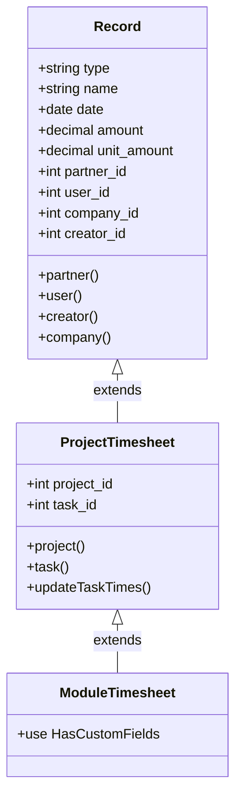
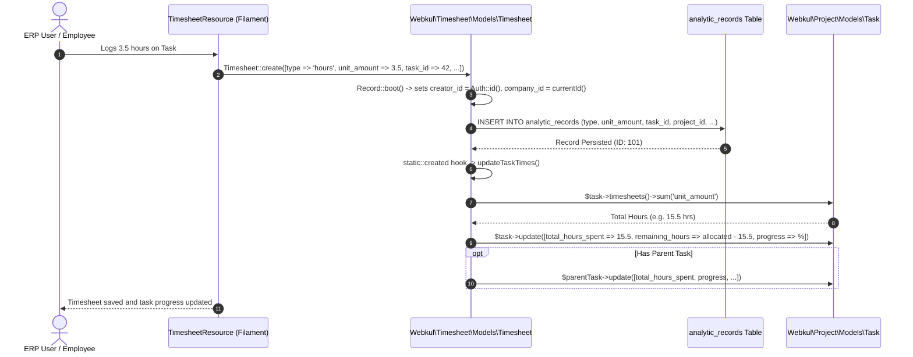

# Plugin: Analytics (`analytics`)

## Status
[VERIFIED]
Active Core Module. Registered explicitly in `bootstrap/providers.php:41` as `Webkul\Analytic\AnalyticServiceProvider::class`.

## Core/Optional
[VERIFIED]
**Core Plugin**. Configured via `$package->isCore()` within `AnalyticServiceProvider::configureCustomPackage()` (`plugins/webkul/analytics/src/AnalyticServiceProvider.php:15`).

## Enabled/Disabled
[VERIFIED]
**Always Enabled (Core Infrastructure)**. Core plugin status causes `PackageServiceProvider::boot()` to bypass database installation checks (`Package::isInstalled()`) when registering migrations (`plugins/webkul/plugin-manager/src/PackageServiceProvider.php:131-135, 202`). The unified analytic records schema and base model execute unconditionally at boot time once registered in `bootstrap/providers.php`.

## Purpose
[VERIFIED]
The `analytics` plugin serves as the foundational analytic ledger and metric distribution repository across Aureus ERP. It delivers:
1. **Unified Analytic Ledger Schema**: Owns and migrates the physical `analytic_records` database table, providing a centralized ledger for financial distributions (revenues, expenses) and operational unit tracking (hours, quantities).
2. **Foundational Analytic Model Primitive**: Defines `Webkul\Analytic\Models\Record`, an Eloquent model with built-in multi-company isolation (`BelongsToCompany`), creator tracking, date casting, and standard relationship bindings to `Company`, `User`, and `Partner`.
3. **Cross-Module Inheritance Base for Operational Tracking**: Serves as the direct model inheritance base and physical storage table for operational time tracking in `projects` (`Webkul\Project\Models\Timesheet`) and `timesheets` (`Webkul\Timesheet\Models\Timesheet`), eliminating the need for duplicate timesheet tables.
4. **Standard REST API Resource Serialization**: Provides `Webkul\Analytic\Http\Resources\V1\RecordResource` for JSON API serialization of analytic entries with eager-loaded relational representations.

## Service Provider
[VERIFIED]
- **Class**: `Webkul\Analytic\AnalyticServiceProvider` (`plugins/webkul/analytics/src/AnalyticServiceProvider.php:8`)
- **Inheritance**: Extends `Webkul\PluginManager\PackageServiceProvider`
- **Registration & Configuration**:
  - `configureCustomPackage(Package $package)`:
    - Sets package name to `'analytics'` (`$package->name(static::$name)`)
    - Declares package as core (`$package->isCore()`)
    - Enables translations (`$package->hasTranslations()`) [VERIFIED: declared in provider, though no `resources/lang/` directory exists]
    - Registers migration `'2024_12_18_131844_create_analytic_records_table'`
    - Enables automatic migration execution (`$package->runsMigrations()`)
  - `packageBooted()`: Defined as an empty method stub (`//`).

## Filament Plugin class
[NOT APPLICABLE]
The `analytics` plugin defines **zero Filament plugin classes** (no `AnalyticPlugin.php` exists; confirmed architectural exception in `docs/architecture/overview.md:90` and `docs/architecture/plugin-registry.md:89`). It contributes zero direct Filament resources, pages, clusters, or widgets, and registers no UI components on either the `admin` or `customer` panel. All user interfaces interacting with `analytic_records` are provided by consuming downstream plugins (such as `timesheets` and `projects`).

## Composer dependencies
[VERIFIED]
- **Local Package Definition**: `plugins/webkul/analytics/composer.json`
  - Name: `webkul/analytics`
  - Autoload PSR-4:
    - `Webkul\Analytic\` -> `src/`
    - `Webkul\Analytic\Database\Factories\` -> `database/factories/`
    - `Webkul\Analytic\Database\Seeders\` -> `database/seeders/`
  - Autoload-dev PSR-4: `Webkul\Analytic\Tests\` -> `tests/`
  - Extra Laravel Providers: `Webkul\Analytic\AnalyticServiceProvider`
- **External & Framework Dependencies Consumed via Root Composer** (`composer.lock`):
  - `illuminate/database` (`v13.31.0`): Eloquent ORM, schema builder, migration definitions.
  - `illuminate/support` (`v13.31.0`): Laravel collections, JSON resources, and helper utilities.
- **Local Plugin Package Dependencies**:
  - `Webkul\Support`: Consumes `BelongsToCompany` trait, `Company` model, `CompanyResource`, and `HasCompanyDefault` factory concern.
  - `Webkul\Partner`: Consumes `Partner` model and `PartnerResource`.
  - `Webkul\Security`: Consumes `User` model and `UserResource`.

## Runtime plugin dependencies
[VERIFIED]
None (`—`). `AnalyticServiceProvider::configureCustomPackage()` does not declare any runtime plugin dependencies via `hasDependencies()`.

## Directory structure
[VERIFIED]
Full verified tree of `plugins/webkul/analytics/`:

```text
plugins/webkul/analytics/
├── composer.json
├── database/
│   ├── factories/
│   │   └── RecordFactory.php
│   └── migrations/
│       └── 2024_12_18_131844_create_analytic_records_table.php
└── src/
    ├── AnalyticServiceProvider.php
    ├── Http/
    │   └── Resources/
    │       └── V1/
    │           └── RecordResource.php
    └── Models/
        └── Record.php
```

## Models
[VERIFIED]
- **`Webkul\Analytic\Models\Record`** (`plugins/webkul/analytics/src/Models/Record.php:13`):
  - **Table**: `analytic_records`
  - **Primary Key**: `id` (bigint, auto-increment)
  - **Traits**: `Webkul\Support\Traits\BelongsToCompany`
  - **Fillable Attributes**: `['type', 'name', 'date', 'amount', 'unit_amount', 'partner_id', 'company_id', 'user_id', 'creator_id']`
  - **Casts**:
    - `'date'` => `'date'`
  - **Company Scoping Status**: **Company-Scoped (`BelongsToCompany`)**. Automatically injects `company_id = CompanyContext::currentId()` on record creation and filters all select queries through `CompanyScope` (`plugins/webkul/support/src/Traits/BelongsToCompany.php`).
  - **Lifecycle Boot Hooks**:
    - `boot()`: In `static::creating()`, sets `$record->creator_id ??= Auth::id()`.
  - **Relationships**:
    - `partner()`: `BelongsTo` -> `Webkul\Partner\Models\Partner` (`foreignKey: partner_id`)
    - `user()`: `BelongsTo` -> `Webkul\Security\Models\User` (`foreignKey: user_id`)
    - `creator()`: `BelongsTo` -> `Webkul\Security\Models\User` (`foreignKey: creator_id`)
    - `company()`: `BelongsTo` -> `Webkul\Support\Models\Company` (`foreignKey: company_id`)

## Database
[VERIFIED]

### Owned Migrations
- `plugins/webkul/analytics/database/migrations/2024_12_18_131844_create_analytic_records_table.php`:
  - Creates table `analytic_records`:
    - `id`: `bigIncrements` (primary key)
    - `type`: `string` (entry categorization: e.g. `'revenue'`, `'expense'`, `'hours'`)
    - `name`: `string`, `nullable` (entry description / title)
    - `date`: `date` (transaction or entry date)
    - `amount`: `decimal(12, 4)`, default `0` (financial amount)
    - `unit_amount`: `decimal(12, 4)`, default `0` (quantity or duration units, e.g. hours logged)
    - `user_id`: `foreignId`, `nullable`, constrained to `users.id`, `nullOnDelete()`
    - `partner_id`: `foreignId`, `nullable`, constrained to `partners_partners.id`, `nullOnDelete()`
    - `company_id`: `foreignId`, `nullable`, constrained to `companies.id`, `nullOnDelete()`
    - `creator_id`: `foreignId`, `nullable`, constrained to `users.id`, `nullOnDelete()`
    - `timestamps`: `created_at`, `updated_at`

### Schema Mutation by Downstream Plugins
[VERIFIED]
- `plugins/webkul/projects/database/migrations/2024_12_18_145142_add_columns_to_analytic_records_table.php`:
  - When the optional `projects` plugin is installed, it alters `analytic_records` to add:
    - `project_id`: `foreignId`, `nullable`, constrained to `projects_projects.id`, `nullOnDelete()`
    - `task_id`: `foreignId`, `nullable`, constrained to `projects_tasks.id`, `nullOnDelete()`

### Factory Implementation
[VERIFIED]
- **`Webkul\Analytic\Database\Factories\RecordFactory`** (`plugins/webkul/analytics/database/factories/RecordFactory.php:14`):
  - Uses `Webkul\Support\Database\Factories\Concerns\HasCompanyDefault`.
  - Default definition:
    - `type` => `fake()->randomElement(['revenue', 'expense', 'hours'])`
    - `name` => `fake()->words(3, true)`
    - `date` => `now()`
    - `amount` => `0`
    - `unit_amount` => `0`
    - `partner_id` => `null`
    - `user_id` => `null`
    - `creator_id` => `User::query()->value('id') ?? User::factory()`
  - Factory States:
    - `revenue()`: Sets `type => 'revenue'`, `amount => fake()->randomFloat(2, 100, 10000)`.
    - `expense()`: Sets `type => 'expense'`, `amount => fake()->randomFloat(2, 50, 5000)`.
    - `hours()`: Sets `type => 'hours'`, `unit_amount => fake()->randomFloat(2, 1, 10)`.
    - `withPartner()`: Assigns `partner_id => Partner::query()->value('id') ?? Partner::factory()`.
    - `withUser()`: Assigns `user_id => User::query()->value('id') ?? User::factory()`.

### Resolution of Prior Documentation Discrepancy: Table Ownership (1 vs 3 Tables)
[VERIFIED]
- **Discrepancy**: An earlier planning note (recorded in `docs/database/schema-conventions.md:63`) claimed that `analytics` owned three tables: `analytic_records`, `analytic_plans`, and `analytic_accounts`. Conversely, the verified Core Entity Inventory in `docs/database/erds/core.md:129` listed only `analytic_records`.
- **Definitive Verification**:
  1. Direct inspection of `plugins/webkul/analytics/database/migrations/` confirms that **only one migration exists** (`2024_12_18_131844_create_analytic_records_table.php`), creating exclusively `analytic_records`.
  2. A comprehensive search across all 28 plugins in the repository confirms that **neither `analytic_plans` nor `analytic_accounts` exists anywhere in migrations, models, or database schemas**.
  3. No other plugin (including `accounting` or `accounts`) owns `analytic_plans` or `analytic_accounts`.
  4. The prior claim in `docs/database/schema-conventions.md` was an unverified planning artifact (originating from standard Odoo schema conventions during initial codebase audit). In Aureus ERP, analytic accounts/plans were never implemented as physical relational tables. Instead:
     - `analytic_records` serves as the sole flat unified analytic ledger.
     - Flexible financial distribution is handled via JSONB / string payload columns (e.g. `accounts_account_move_lines.analytic_distribution` and `sales_order_lines.analytic_distribution`).

## Filament resources/pages/widgets/clusters
[NOT APPLICABLE]
No Filament resources, pages, clusters, or widgets are defined in `plugins/webkul/analytics`.

## Panels
[NOT APPLICABLE]
No direct Filament panel registration is performed by this plugin.

## Services
[VERIFIED]
- **`Webkul\Analytic\Http\Resources\V1\RecordResource`** (`plugins/webkul/analytics/src/Http/Resources/V1/RecordResource.php:10`):
  - Transforms `Record` model instances into JSON API structures:
    - Primitive fields: `id`, `type`, `name`, `date`, `amount` (float), `unit_amount` (float), `partner_id`, `company_id`, `user_id`, `creator_id`, `created_at`, `updated_at`.
    - Conditionally loaded relationships:
      - `partner` => `PartnerResource($this->whenLoaded('partner'))`
      - `company` => `CompanyResource($this->whenLoaded('company'))`
      - `user` => `UserResource($this->whenLoaded('user'))`
      - `creator` => `UserResource($this->whenLoaded('creator'))`

## Events
[NOT APPLICABLE]
No Laravel domain events are dispatched or subscribed to by `analytics`.

## Listeners
[NOT APPLICABLE]
No Laravel event listeners are defined in `analytics`.

## Observers
[NOT APPLICABLE]
No standalone Eloquent observer classes are defined in `analytics`. Model boot events (`creating`) are registered inline within `Record::boot()`.

## Policies
[NOT APPLICABLE]
- No dedicated policy class exists in `analytics`.
- Authorization for operations on `analytic_records` is governed by downstream consuming policies (such as `Webkul\Timesheet\Policies\TimesheetPolicy`).

## Routes
[NOT APPLICABLE]
No HTTP web or API route files are defined or registered by `analytics` (no `routes/` directory exists).

## Settings
[NOT APPLICABLE]
No plugin-specific settings schema exists under `database/settings/`.

## Translations
[VERIFIED]
- **Declared in Provider**: `AnalyticServiceProvider::configureCustomPackage()` calls `$package->hasTranslations()`.
- **Physical State**: The `plugins/webkul/analytics/resources/lang/` directory **does not exist** on disk. No translation strings are registered.

## Tests
[VERIFIED]
- **Explicit Test Coverage Status**: The `analytics` plugin contains **zero test files** (0 unit tests, 0 feature tests under `plugins/webkul/analytics/tests/`). Although `composer.json` declares an `autoload-dev` mapping for `Webkul\Analytic\Tests\` to `tests/`, no `tests/` directory exists on disk.
- **Root Test Coverage**: Zero tests in `tests/Feature/` or `tests/Unit/` directly test `Webkul\Analytic\Models\Record` or `RecordResource`.
- **Indirect Operational Coverage**: Records in `analytic_records` are created and queried indirectly during integration tests for downstream modules (`projects` and `timesheets`).

## Runtime dependencies
[VERIFIED]
None (`—`).

## Cross-plugin relationships
[VERIFIED]
The `analytics` plugin relies on 3 upstream core infrastructure plugins and is consumed by downstream domain modules across code, schema, and UI layers:

```
                      ┌───────────────────────────────────────────────┐
                      │             Upstream Dependencies             │
                      │  (support: Company, security: User, partners) │
                      └───────────────────────┬───────────────────────┘
                                              │ provides traits & FKs
                                              ▼
                      ┌───────────────────────────────────────────────┐
                      │                   analytics                   │
                      │         (Table: analytic_records)             │
                      │         (Model: Webkul\Analytic\Record)       │
                      └───────────────────────┬───────────────────────┘
                                              │
         ┌────────────────────────────────────┼────────────────────────────────────┐
         │                                    │                                    │
         ▼ (Code & Schema Consumer)           ▼ (Schema/Concept Field Consumer)   ▼ (Schema/Concept Field Consumer)
┌──────────────────────────────────┐┌──────────────────────────────────┐┌──────────────────────────────────┐
│             projects             ││             accounts             ││              sales               │
├──────────────────────────────────┤├──────────────────────────────────┤├──────────────────────────────────┤
│ • Mutates DB: project_id,        ││ • MoveLine: analytic_            ││ • OrderLine: analytic_           │
│   task_id added to table         ││   distribution (JSONB)           ││   distribution (string)          │
│ • Timesheet extends Record       ││ • Tax: analytic (boolean)        ││                                  │
│ • Dashboard widgets query table  ││ • TaxAccountingMapper / Factory  ││                                  │
└────────────────┬─────────────────┘└──────────────────────────────────┘└──────────────────────────────────┘
                 │
                 ▼ (Code & UI Consumer)
┌──────────────────────────────────┐
│            timesheets            │
├──────────────────────────────────┤
│ • 0 physical tables              │
│ • Timesheet extends              │
│   Project\Timesheet (Record)     │
│ • TimesheetResource manages      │
│   rows in analytic_records       │
└──────────────────────────────────┘
```

### Upstream Infrastructure Dependencies (Consumed by `analytics`)

1. **`support` Plugin (Core)**:
   - `Record` uses `Webkul\Support\Traits\BelongsToCompany` for automatic multi-company scoping.
   - `Record` defines `company()` relation targeting `Webkul\Support\Models\Company`.
   - Foreign key constraint: `analytic_records.company_id` -> `companies.id` (`nullOnDelete()`).
   - `RecordResource` embeds `Webkul\Support\Http\Resources\V1\CompanyResource`.
2. **`security` Plugin (Core)**:
   - `Record` defines `user()` and `creator()` relations targeting `Webkul\Security\Models\User`.
   - Foreign key constraints: `analytic_records.user_id` -> `users.id` and `analytic_records.creator_id` -> `users.id` (`nullOnDelete()`).
   - `RecordResource` embeds `Webkul\Security\Http\Resources\V1\UserResource`.
3. **`partners` Plugin (Core)**:
   - `Record` defines `partner()` relation targeting `Webkul\Partner\Models\Partner`.
   - Foreign key constraint: `analytic_records.partner_id` -> `partners_partners.id` (`nullOnDelete()`).
   - `RecordResource` embeds `Webkul\Partner\Http\Resources\V1\PartnerResource`.

### Downstream Consumers (Consuming `analytics`)

1. **`projects` Plugin (Optional — Code-Level & Schema Consumer)**:
   - Mutates `analytic_records` by adding foreign keys `project_id` and `task_id` (`plugins/webkul/projects/database/migrations/2024_12_18_145142_add_columns_to_analytic_records_table.php`).
   - Defines `Webkul\Project\Models\Timesheet` (`plugins/webkul/projects/src/Models/Timesheet.php:8`) directly subclassing `Webkul\Analytic\Models\Record`.
   - Hooks model lifecycle events (`created`, `updated`, `deleted`) on `Timesheet` to invoke `updateTaskTimes()`, aggregating `unit_amount` into task `total_hours_spent`, `effective_hours`, `remaining_hours`, and `progress`.
   - Queries `analytic_records` in project dashboard widgets:
     - `TopAssigneesWidget` (`plugins/webkul/projects/src/Filament/Widgets/TopAssigneesWidget.php:51-70`): Joins `users` on `analytic_records.user_id` and filters by partner and date ranges.
     - `TopProjectsWidget` (`plugins/webkul/projects/src/Filament/Widgets/TopProjectsWidget.php:47-78`): Joins `projects_projects` on `analytic_records.project_id`, aggregating `SUM(analytic_records.unit_amount)` and `COUNT(DISTINCT analytic_records.task_id)`.
2. **`timesheets` Plugin (Optional — Code-Level & UI Consumer)**:
   - Owns **0 dedicated physical tables and 0 migrations** (`docs/database/erds/operations.md:47, 1125`).
   - Defines `Webkul\Timesheet\Models\Timesheet` (`plugins/webkul/timesheets/src/Models/Timesheet.php:8`) extending `Webkul\Project\Models\Timesheet` (which extends `Webkul\Analytic\Models\Record`), attaching `HasCustomFields`.
   - Provides administrative UI via `TimesheetResource` for managing time records stored in `analytic_records`.
3. **`accounts` Plugin (Optional — Schema/Concept Field Consumer)**:
   - `MoveLine` (`plugins/webkul/accounts/src/Models/MoveLine.php:68, 95`) stores `analytic_distribution` as a JSONB column (`array` cast).
   - `TaxAccountingMapper` (`plugins/webkul/accounts/src/Services/TaxAccountingMapper.php:147, 179-180, 272`) and `TaxLineFactory` (`plugins/webkul/accounts/src/Services/TaxLineFactory.php:32, 58, 80`) pass and compute `analytic_distribution` across move lines.
   - `Tax` model (`plugins/webkul/accounts/src/Models/Tax.php:56`) contains an `analytic` boolean flag (`Enable analytic accounting`).
4. **`sales` Plugin (Optional — Schema/Concept Field Consumer)**:
   - `OrderLine` (`plugins/webkul/sales/src/Models/OrderLine.php:61`) contains an `analytic_distribution` string column (`plugins/webkul/sales/database/migrations/2025_02_05_102851_create_sales_order_lines_table.php:33`).

## Data flow
[VERIFIED]

### 1. Model Inheritance & Physical Persistence Hierarchy


### 2. Operational Timesheet Logging & Progress Calculation Flow


## Business rules
[VERIFIED]
1. **Multi-Unit / Multi-Type Ledger Architecture**:
   - `analytic_records` supports both financial amounts (`amount` decimal) and physical units/duration (`unit_amount` decimal).
   - Standard ledger entry types include `'revenue'`, `'expense'`, and `'hours'`.
2. **Automatic Creator Attribution**:
   - When a `Record` is created without an explicit `creator_id`, `Record::boot()` automatically assigns the authenticated user's ID (`Auth::id()`).
3. **Strict Multi-Company Data Isolation**:
   - `Record` uses `BelongsToCompany`. All queries are scoped to `CompanyContext::currentId()` via `CompanyScope`, and new records automatically inherit the active company ID.
4. **Non-Destructive Relational Integrity (`nullOnDelete`)**:
   - Foreign key constraints on `company_id`, `partner_id`, `user_id`, `creator_id`, `project_id`, and `task_id` all use `nullOnDelete()`. Deleting a user, partner, project, or task preserves the underlying analytic audit record while nullifying the reference.
5. **Shared Physical Ledger Optimization**:
   - Rather than maintaining separate tables for timesheets and financial analytic lines, Aureus ERP consolidates operational time-tracking directly on `analytic_records` through class inheritance and schema mutation (`projects` migration).

## Extension points
[VERIFIED]
1. **Eloquent Subclassing**: Downstream packages can extend `Webkul\Analytic\Models\Record` to build specialized ledger entities without recreating base company-scoping or partner/user relationship infrastructure (e.g. `Webkul\Project\Models\Timesheet`).
2. **Database Schema Mutation**: Downstream modules can alter `analytic_records` via migrations to attach domain-specific foreign keys (as demonstrated by `projects` adding `project_id` and `task_id`).
3. **REST API Serialization**: `RecordResource` provides a standard transformation layer that downstream controllers can extend or embed.

## Dangerous areas
[VERIFIED]
1. **Zero Automated Test Coverage in Plugin**:
   - **Critical Fact**: `plugins/webkul/analytics/` contains **0 test files** (0 unit tests, 0 feature tests under `tests/`).
   - Although `composer.json` declares an `autoload-dev` mapping for `Webkul\Analytic\Tests\`, the directory does not exist on disk.
   - Any regressions in `Record` boot hooks, relationship definitions, or decimal precision casting cannot be detected by automated CI/CD runs.
2. **Cross-Plugin Migration & Schema Coupling**:
   - The `projects` plugin mutates `analytic_records` by adding `project_id` and `task_id`. If `projects` migrations are rolled back or omitted in a custom installation, queries in `Timesheet` models or `TopAssigneesWidget` will fail with missing column exceptions.
3. **Lack of Core Policy and Route Protections**:
   - Because `analytics` defines no dedicated policy class (`RecordPolicy`) or HTTP controller routes, authorization and input validation are entirely deferred to downstream consuming modules. Direct manipulation of `Record` without enforcing company context or authorization checks could bypass domain rules.
4. **Absence of Automated Analytic Line Posting Engine**:
   - [INFERRED] While `accounts_account_move_lines` and `sales_order_lines` contain `analytic_distribution` columns, there is no active event listener or observer in `analytics` or `accounts` that automatically synchronizes posted account move lines into individual `analytic_records` rows.

## Change impact
[VERIFIED]
- **Architectural Scope**: **Low Code Footprint / High Foundational Data Layer**.
- **Blast Radius**: Modifying `Record` or `analytic_records` directly impacts operational timesheets in `projects` and `timesheets`, as well as analytical dashboard widgets.
- **Database Schema Impact**: Alterations to `analytic_records` require coordinated updates with `plugins/webkul/projects/database/migrations/2024_12_18_145142_add_columns_to_analytic_records_table.php`.
- **Security Impact**: Governed by `BelongsToCompany` multi-company scoping.

---

## Evidence Index

| Evidence ID | Source File | Symbol / Method | Purpose / Claim Verified |
|---|---|---|---|
| **E-001** | `plugins/webkul/analytics/src/AnalyticServiceProvider.php` | `AnalyticServiceProvider::configureCustomPackage()` | Core flag, package name, migration registration, translation declaration |
| **E-002** | `plugins/webkul/analytics/src/Models/Record.php` | `Record` | Fillable fields, date cast, `BelongsToCompany` trait, relationships, `boot()` creator hook |
| **E-003** | `plugins/webkul/analytics/database/migrations/2024_12_18_131844_create_analytic_records_table.php` | `Schema::create('analytic_records', ...)` | Table schema, decimal columns, foreign keys with `nullOnDelete` |
| **E-004** | `plugins/webkul/analytics/database/factories/RecordFactory.php` | `RecordFactory::definition()`, `revenue()`, `expense()`, `hours()` | Factory states for revenues, expenses, hours, partners, users |
| **E-005** | `plugins/webkul/analytics/src/Http/Resources/V1/RecordResource.php` | `RecordResource::toArray()` | API serialization of analytic records with conditional relation loading |
| **E-006** | `plugins/webkul/analytics/composer.json` | `composer.json` | Package metadata, PSR-4 autoload and autoload-dev definitions |
| **E-007** | `bootstrap/providers.php` | Line 41 | Explicit registration of `AnalyticServiceProvider::class` |
| **E-008** | `plugins/webkul/projects/database/migrations/2024_12_18_145142_add_columns_to_analytic_records_table.php` | `Schema::table('analytic_records', ...)` | Schema mutation adding `project_id` and `task_id` to `analytic_records` |
| **E-009** | `plugins/webkul/projects/src/Models/Timesheet.php` | `Timesheet extends Record` | Operational model extending `Record` and hooking `updateTaskTimes()` |
| **E-010** | `plugins/webkul/timesheets/src/Models/Timesheet.php` | `Timesheet extends BaseTimesheet` | Timesheets proxy model extending `Webkul\Project\Models\Timesheet` with `HasCustomFields` |
| **E-011** | `plugins/webkul/projects/src/Filament/Widgets/TopAssigneesWidget.php` | `TopAssigneesWidget::getTableQuery()` | Query aggregating and filtering `analytic_records` by partner and user |
| **E-012** | `plugins/webkul/projects/src/Filament/Widgets/TopProjectsWidget.php` | `TopProjectsWidget::getTableQuery()` | Query aggregating `analytic_records.unit_amount` and tasks per project |
| **E-013** | `plugins/webkul/accounts/src/Models/MoveLine.php` | `MoveLine` | `analytic_distribution` JSONB column cast to `array` |
| **E-014** | `plugins/webkul/accounts/src/Services/TaxAccountingMapper.php` | `TaxAccountingMapper::map()` | Passing `analytic_distribution` during tax computation |
| **E-015** | `plugins/webkul/sales/database/migrations/2025_02_05_102851_create_sales_order_lines_table.php` | `Schema::create('sales_order_lines', ...)` | `analytic_distribution` column on sales order lines |
| **E-016** | `docs/database/erds/core.md` | Lines 37, 129, 844 | Core Entity Inventory verifying `Record` on `analytic_records` with single-table ownership |
| **E-017** | `docs/architecture/overview.md` | Line 90 | Verification that `analytics` has no local Filament plugin class |
