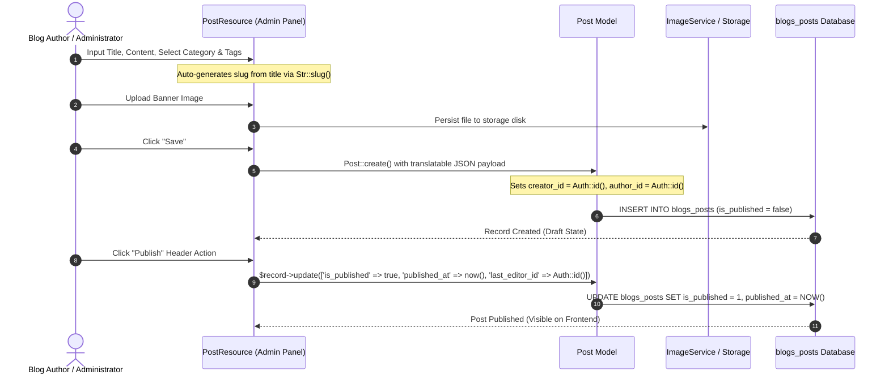
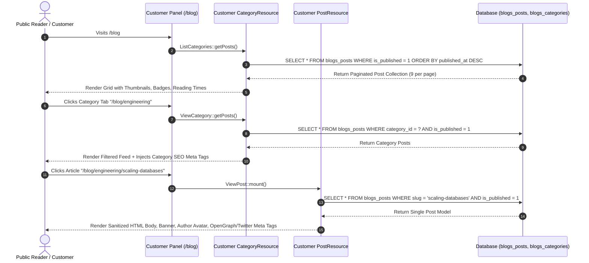

# Plugin: Blogs (`blogs`)

## Status
[VERIFIED]
Active Optional Module. Registered in `bootstrap/providers.php:43` as `Webkul\Blog\BlogServiceProvider::class`.

## Core/Optional
[VERIFIED]
**Optional Plugin**. Configured as an optional domain package without calling `$package->isCore()` (`plugins/webkul/blogs/src/BlogServiceProvider.php:19-47`). Runtime discovery and Filament panel component injection are gated by runtime installation verification via `Package::isPluginInstalled('blogs')` (`plugins/webkul/blogs/src/BlogPlugin.php:23-25`).

## Enabled/Disabled
[VERIFIED]
**Conditionally Enabled (Database-Gated)**. `BlogServiceProvider` registers package views, translations, migrations, and panel configuration hooks via `Panel::configureUsing()`, but Filament admin and customer panel resources, pages, and clusters are discovered and registered only when `Package::isPluginInstalled('blogs')` returns `true` (`plugins/webkul/blogs/src/BlogPlugin.php:23-65`).

## Purpose
[VERIFIED]
The `blogs` module provides a multi-lingual, multi-category publishing platform and content authoring engine for Aureus ERP:

1. **Article & Content Authoring (`Post`, `blogs_posts`)**:
   - Manages translatable blog articles with multi-locale JSON attributes (`title`, `sub_title`, `content`, `meta_title`, `meta_keywords`, `meta_description`).
   - Supports publication workflows (`is_published`, `published_at`) with dedicated administrative Publish and Draft actions.
   - Calculates estimated article reading time dynamically based on word count (`getReadingTimeAttribute()`).
   - Generates multi-size responsive image URLs (thumbnail `600x300` and banner `1200x400`) via `Webkul\Support\Services\ImageService`.
   - Tracks audit metadata: `author_id` (byline author), `creator_id` (record creator), and `last_editor_id` (last updating user).

2. **Categorization & Topic Taxonomies (`Category`, `blogs_categories`)**:
   - Manages translatable blog categories with multi-locale names, subtitles, and SEO attributes.
   - Enforces referential integrity on post categorization: `blogs_posts.category_id` uses `restrictOnDelete()`, preventing deletion of categories containing active posts.
   - Administrative UI gracefully catches SQL `QueryException` on restricted category deletions to provide user-facing error notifications.

3. **Tagging & Color Badging (`Tag`, `blogs_tags`, `blogs_post_tags`)**:
   - Classifies articles with customizable keywords and hex color codes.
   - Supports user-defined sort order via `Spatie\EloquentSortable\SortableTrait`.
   - Inlines on-the-fly tag creation inside administrative post authoring forms.

4. **Public Frontend Blog Portal (`Customer` Panel Integration)**:
   - Mounts the public blog interface on the customer panel at `/blog` (`Webkul\Blog\Filament\Customer\Resources\CategoryResource`).
   - Renders category filter tabs, search-filtered post cards, author avatars, reading times, publication dates, and tags.
   - Generates OpenGraph and Twitter card meta tags for category pages and individual article views.
   - Bypasses panel authentication requirements via `$shouldSkipAuthorization = true` for public readership.

5. **Administrative Management & Dashboard Integration**:
   - Injects `PostResource` under `NavigationGroup::Website` alongside `website`'s `PageResource` and `PartnerResource`.
   - Injects `CategoryResource` and `TagResource` directly into `website`'s `Webkul\Website\Filament\Admin\Clusters\Configurations` cluster.
   - Powers 6 analytical chart/table widgets embedded inside `website`'s `WebsiteDashboard`.

---

## Division of Responsibility: `blogs` vs. `website`
[VERIFIED]

Both `blogs` and `website` operate in the content and web presentation domain, but they maintain a strict separation of architectural concerns:

| Dimension | `website` Plugin | `blogs` Plugin |
| :--- | :--- | :--- |
| **Primary Architectural Role** | Portal foundation, authentication infrastructure, and static CMS pages. | Dynamic article authoring, content taxonomy, and blog publishing engine. |
| **Runtime Dependency Direction** | **Standalone** (declares 0 runtime dependencies). | **Downstream Consumer** (declares `hasDependencies(['website'])`). |
| **Panel Ownership** | Configures customer authentication guard (`customer`), user provider (`customers` / `Partner`), login/register/reset flows, and layout render hooks (`PanelsRenderHook::TOPBAR_END`, `PanelsRenderHook::FOOTER`). | Extends the customer panel by mounting the `/blog` route sub-tree (`CategoryResource`, `PostResource`). |
| **Data Models Owned** | `Page` (`website_pages`), `Partner` (`partners_partners` auth columns), `ContactSettings` (`settings`). | `Post` (`blogs_posts`), `Category` (`blogs_categories`), `Tag` (`blogs_tags`), `blogs_post_tags`. |
| **Content Nature** | Static/evergreen CMS web pages (`home`, `about-us`, `terms-and-conditions`) with header/footer visibility toggles. | Time-stamped, categorized, tagged blog articles with author bylines, reading time, visit counters, and draft/published states. |
| **Administrative Clusters** | Owns `Webkul\Website\Filament\Admin\Clusters\Configurations` and `PluginSettings`. | Hooks its `CategoryResource` and `TagResource` directly into `website`'s `Configurations` cluster (`$cluster = Configurations::class`). |
| **Dashboard Ownership** | Owns `WebsiteDashboard` page and defines 6 blog widget classes (`BlogChart`, `BlogAuthorsChart`, `CategoriesPieChart`, `BlogStatusPieChart`, `TopCategoriesTable`, `RecentBlogsTable`). | Owns the underlying data (`blogs_posts`, `blogs_categories`) that the dashboard widgets query when `blogs` is installed. |
| **Frontend Routing** | `/{slug}` for static CMS pages; root `/` renders `Page::where('slug', 'home')`. | `/blog` (Index), `/blog/{category}` (Category Feed), `/blog/{category}/{post}` (Article Detail). |
| **Customer Authorization** | Handles customer login and portal account access gating. | Public read-only; explicitly disables authorization checks (`$shouldSkipAuthorization = true`). |

---

## Service Provider
[VERIFIED]
- **Class**: `Webkul\Blog\BlogServiceProvider` (`plugins/webkul/blogs/src/BlogServiceProvider.php:13`)
- **Inheritance**: Extends `Webkul\PluginManager\PackageServiceProvider`
- **Registration & Configuration**:
  - `configureCustomPackage(Package $package)`:
    - Sets package name to `blogs` (`BlogServiceProvider::$name = 'blogs'`).
    - Sets view namespace `blogs` (`BlogServiceProvider::$viewNamespace = 'blogs'`).
    - Registers translation namespace via `hasTranslations()`.
    - Registers 7 migrations in `$package->hasMigrations([...])` and runs them (`runsMigrations()`):
      1. `2025_03_06_093011_create_blogs_categories_table`
      2. `2025_03_06_094011_create_blogs_posts_table`
      3. `2025_03_07_065635_create_blogs_tags_table`
      4. `2025_03_07_065715_create_blogs_post_tags_table`
      5. `2025_09_03_070414_alter_blogs_posts_table`
      6. `2026_08_13_000002_make_blogs_posts_translatable`
      7. `2026_08_19_000001_make_blogs_categories_translatable`
    - Registers empty settings array via `hasSettings([])` and `runsSettings()`.
    - Declares runtime plugin dependency on `website` (`hasDependencies(['website'])`).
    - Configures install command: installs dependencies and runs migrations (`hasInstallCommand(...)`).
    - Configures uninstall command stub (`hasUninstallCommand(...)`).
    - Sets package icon to `blog` (`icon('blog')`).
  - `packageBooted()`:
    - Registers custom stylesheet: `resources/dist/blogs.css` via `FilamentAsset::register()`.
  - `packageRegistered()`:
    - Registers `BlogPlugin::make()` with the Filament Panel builder via `Panel::configureUsing()`.

## Filament Plugin Class
[VERIFIED]
- **Class**: `Webkul\Blog\BlogPlugin` (`plugins/webkul/blogs/src/BlogPlugin.php:9`)
- **Implements**: `Filament\Contracts\Plugin`
- **Plugin ID**: `blogs` (`getId(): string`)
- **Singleton Factory**: `BlogPlugin::make()` resolves `app(static::class)`.
- **Registration Flow (`register(Panel $panel)`)**:
  - Checks if plugin is installed via `Package::isPluginInstalled('blogs')`; returns early if `false`.
  - **When Panel ID is `'customer'`**:
    - Discovers Customer Resources: `plugins/webkul/blogs/src/Filament/Customer/Resources` (`Webkul\Blog\Filament\Customer\Resources`)
    - Discovers Customer Pages: `plugins/webkul/blogs/src/Filament/Customer/Pages` (`Webkul\Blog\Filament\Customer\Pages`)
    - Discovers Customer Clusters: `plugins/webkul/blogs/src/Filament/Customer/Clusters` (`Webkul\Blog\Filament\Customer\Clusters`)
    - Discovers Customer Widgets: `plugins/webkul/blogs/src/Filament/Customer/Widgets` (`Webkul\Blog\Filament\Customer\Widgets`)
  - **When Panel ID is `'admin'`**:
    - Discovers Admin Resources: `plugins/webkul/blogs/src/Filament/Admin/Resources` (`Webkul\Blog\Filament\Admin\Resources`)
    - Discovers Admin Pages: `plugins/webkul/blogs/src/Filament/Admin/Pages` (`Webkul\Blog\Filament\Admin\Pages`)
    - Discovers Admin Clusters: `plugins/webkul/blogs/src/Filament/Admin/Clusters` (`Webkul\Blog\Filament\Admin\Clusters`)
    - Discovers Admin Widgets: `plugins/webkul/blogs/src/Filament/Admin/Widgets` (`Webkul\Blog\Filament\Admin\Widgets`)
- **Boot**: Empty method stub (`boot(Panel $panel)`).

## Composer Dependencies
[VERIFIED]
From `plugins/webkul/blogs/composer.json`:
- **Package Name**: `webkul/blogs`
- **Description**: Manage blogs
- **Autoload**:
  - PSR-4: `Webkul\Blog\` → `src/`
  - PSR-4: `Webkul\Blog\Database\Factories\` → `database/factories/`
  - PSR-4: `Webkul\Blog\Database\Seeders\` → `database/seeders/`
- **Autoload-Dev**:
  - PSR-4: `Webkul\Blog\Tests\` → `tests/`
- **Dependencies**: No external third-party Composer packages declared locally (inherits application root dependencies: Filament, Spatie Translatable, Spatie Eloquent Sortable, Tailwind CSS).

## Runtime Plugin Dependencies
[VERIFIED]
- **Declared in Service Provider**: `website` (`hasDependencies(['website'])` in `BlogServiceProvider.php:37-39`).
- **Core Dependencies (Inherent)**:
  - `security`: Authenticated `User` model (`author_id`, `creator_id`, `last_editor_id`), policy evaluation.
  - `support`: `NavigationGroup::Website`, `ImageService` for responsive thumbnails/banners, Spatie Translatable concerns.
  - `fields`: Custom field traits (`HasCustomFields`) on `Post`, `Category`, and `Tag`.
  - `table-views`: Preset tab views (`HasTableViews`, `PresetView`) on `PostResource\Pages\ListPosts`.
  - `plugin-manager`: Base `PackageServiceProvider` and `Package::isPluginInstalled()` runtime gates.

## Directory Structure
[VERIFIED]
```text
plugins/webkul/blogs/
├── composer.json
├── package.json
├── postcss.config.js
├── tailwind.config.js
├── config/
│   └── filament-shield.php
├── database/
│   ├── factories/
│   │   ├── CategoryFactory.php
│   │   ├── PostFactory.php
│   │   └── TagFactory.php
│   └── migrations/
│       ├── 2025_03_06_093011_create_blogs_categories_table.php
│       ├── 2025_03_06_094011_create_blogs_posts_table.php
│       ├── 2025_03_07_065635_create_blogs_tags_table.php
│       ├── 2025_03_07_065715_create_blogs_post_tags_table.php
│       ├── 2025_09_03_070414_alter_blogs_posts_table.php
│       ├── 2026_08_13_000002_make_blogs_posts_translatable.php
│       └── 2026_08_19_000001_make_blogs_categories_translatable.php
├── resources/
│   ├── css/
│   │   └── index.css
│   ├── dist/
│   │   └── blogs.css
│   ├── lang/
│   │   ├── ar/
│   │   ├── en/
│   │   ├── es/
│   │   ├── fr/
│   │   └── pt_BR/
│   └── views/
│       └── filament/
│           └── customer/
│               └── resources/
│                   ├── category/
│                   │   └── pages/
│                   │       ├── list-records.blade.php
│                   │       └── view-record.blade.php
│                   └── post/
│                       └── pages/
│                           ├── list-records.blade.php
│                           └── view-record.blade.php
└── src/
    ├── BlogPlugin.php
    ├── BlogServiceProvider.php
    ├── Filament/
    │   ├── Admin/
    │   │   ├── Clusters/
    │   │   │   └── Configurations/
    │   │   │       └── Resources/
    │   │   │           ├── CategoryResource/
    │   │   │           │   ├── Pages/
    │   │   │           │   │   └── ManageCategories.php
    │   │   │           │   ├── Schemas/
    │   │   │           │   │   └── CategoryForm.php
    │   │   │           │   └── Tables/
    │   │   │           │       └── CategoriesTable.php
    │   │   │           ├── CategoryResource.php
    │   │   │           ├── TagResource/
    │   │   │           │   ├── Pages/
    │   │   │           │   │   └── ManageTags.php
    │   │   │           │   ├── Schemas/
    │   │   │           │   │   └── TagForm.php
    │   │   │           │   └── Tables/
    │   │   │           │       └── TagsTable.php
    │   │   │           └── TagResource.php
    │   │   └── Resources/
    │   │       ├── PostResource/
    │   │       │   ├── Pages/
    │   │       │   │   ├── CreatePost.php
    │   │       │   │   ├── EditPost.php
    │   │       │   │   ├── ListPosts.php
    │   │       │   │   └── ViewPost.php
    │   │       │   ├── Schemas/
    │   │       │   │   ├── PostForm.php
    │   │       │   │   └── PostInfolist.php
    │   │       │   └── Tables/
    │   │       │       └── PostsTable.php
    │   │       └── PostResource.php
    │   └── Customer/
    │       └── Resources/
    │           ├── CategoryResource/
    │           │   └── Pages/
    │           │       ├── ListCategories.php
    │           │       └── ViewCategory.php
    │           ├── CategoryResource.php
    │           ├── PostResource/
    │           │   └── Pages/
    │           │       └── ViewPost.php
    │           └── PostResource.php
    ├── Http/
    │   └── Resources/
    │       └── V1/
    │           ├── CategoryResource.php
    │           ├── PostResource.php
    │           └── TagResource.php
    ├── Models/
    │   ├── Category.php
    │   ├── Post.php
    │   └── Tag.php
    └── Policies/
        ├── CategoryPolicy.php
        ├── PostPolicy.php
        └── TagPolicy.php
```

*Note: The `blogs` module contains **no `routes/` directory**, **no `tests/` directory**, **no `database/seeders/` directory**, and **no `src/Settings/` directory**.*

---

## Models
[VERIFIED]

The `blogs` plugin defines 3 Eloquent models:

| Model Class | Base Class / Table | Traits | Company Isolation | Description |
| :--- | :--- | :--- | :--- | :--- |
| `Category` | `Illuminate\Database\Eloquent\Model` / `blogs_categories` | `HasCustomFields`, `HasFactory`, `HasTranslations`, `SoftDeletes` | No (Global Master) | Translatable blog topic category with subtitle, SEO metadata, and post collection. |
| `Post` | `Illuminate\Database\Eloquent\Model` / `blogs_posts` | `HasCustomFields`, `HasFactory`, `HasTranslations`, `SoftDeletes` | No (Global Master) | Translatable published blog article with reading time, author byline, image URLs, and tag associations. |
| `Tag` | `Illuminate\Database\Eloquent\Model` / `blogs_tags` | `HasCustomFields`, `HasFactory`, `SoftDeletes`, `SortableTrait` (`Sortable`) | No (Global Master) | Keyword taxonomy item with hex color badge and integer sequence ordering. |

### Model Details

#### `Webkul\Blog\Models\Category`
- **Table**: `blogs_categories`
- **Translatable Columns (`$translatable`)**: `name`, `sub_title`, `meta_title`, `meta_keywords`, `meta_description`
- **Fillable**: `name`, `sub_title`, `slug`, `image`, `meta_title`, `meta_keywords`, `meta_description`, `creator_id`
- **Relationships**:
  - `posts(): HasMany` -> `Webkul\Blog\Models\Post`
  - `creator(): BelongsTo` -> `Webkul\Security\Models\User`
- **Accessors**:
  - `image_url`: Resolves `Storage::url($this->image)` or returns `null`.
- **Boot Lifecycle**:
  - `creating`: Automatically sets `$category->creator_id ??= Auth::id()`.
- **Factory**: `Webkul\Blog\Database\Factories\CategoryFactory`.

#### `Webkul\Blog\Models\Post`
- **Table**: `blogs_posts`
- **Translatable Columns (`$translatable`)**: `title`, `sub_title`, `content`, `meta_title`, `meta_keywords`, `meta_description`
- **Fillable**: `title`, `sub_title`, `content`, `slug`, `image`, `author_name`, `is_published`, `published_at`, `visits`, `meta_title`, `meta_keywords`, `meta_description`, `category_id`, `author_id`, `creator_id`, `last_editor_id`
- **Casts**:
  - `is_published` => `boolean`
  - `published_at` => `datetime`
- **Relationships**:
  - `category(): BelongsTo` -> `Webkul\Blog\Models\Category` (FK `category_id`)
  - `tags(): BelongsToMany` -> `Webkul\Blog\Models\Tag` (Junction `blogs_post_tags`, keys `post_id`, `tag_id`)
  - `author(): BelongsTo` -> `Webkul\Security\Models\User` (FK `author_id`)
  - `creator(): BelongsTo` -> `Webkul\Security\Models\User` (FK `creator_id`)
  - `lastEditor(): BelongsTo` -> `Webkul\Security\Models\User` (FK `last_editor_id`)
- **Accessors**:
  - `image_url`: Resolves `Storage::url($this->image)`.
  - `image_thumb_url`: Resolves `ImageService::url($this->image, ['w' => 600, 'h' => 300, 'fit' => 'crop'])`.
  - `image_banner_url`: Resolves `ImageService::url($this->image, ['w' => 1200, 'h' => 400, 'fit' => 'crop'])`.
  - `reading_time`: Computes `ceil(str_word_count(strip_tags($this->content)) / 200) . ' min read'`.
- **Boot Lifecycle**:
  - `creating`: Automatically defaults `$post->author_id ??= Auth::id()` and `$post->creator_id ??= Auth::id()`.
- **Factory**: `Webkul\Blog\Database\Factories\PostFactory` (includes `published()` state).

#### `Webkul\Blog\Models\Tag`
- **Table**: `blogs_tags`
- **Implements**: `Spatie\EloquentSortable\Sortable`
- **Fillable**: `name`, `color`, `sort`, `creator_id`
- **Sortable Configuration (`$sortable`)**:
  - `order_column_name` => `'sort'`
  - `sort_when_creating` => `true`
- **Relationships**:
  - `creator(): BelongsTo` -> `Webkul\Security\Models\User`
- **Boot Lifecycle**:
  - `creating`: Automatically sets `$tag->creator_id ??= Auth::id()`.
- **Factory**: `Webkul\Blog\Database\Factories\TagFactory`.

---

## Database
[VERIFIED]

### Physical Schema & Tables

#### 1. `blogs_categories`
- `id`: `bigint unsigned PK`
- `name`: `json not null` (Translatable name, altered to JSON in `2026_08_19_000001`)
- `sub_title`: `json nullable` (Translatable subtitle, altered to JSON in `2026_08_19_000001`)
- `slug`: `varchar(255) not null unique`
- `image`: `varchar(255) nullable`
- `meta_title`: `json nullable` (Translatable SEO title, altered to JSON in `2026_08_19_000001`)
- `meta_keywords`: `json nullable` (Translatable SEO keywords, altered to JSON in `2026_08_19_000001`)
- `meta_description`: `json nullable` (Translatable SEO description, altered to JSON in `2026_08_19_000001`)
- `creator_id`: `bigint unsigned nullable FK -> users.id (nullOnDelete)`
- `deleted_at`: `timestamp nullable`
- `created_at`, `updated_at`: `timestamps`

#### 2. `blogs_posts`
- `id`: `bigint unsigned PK`
- `title`: `json not null` (Translatable title, altered to JSON in `2026_08_13_000002`)
- `sub_title`: `json nullable` (Translatable subtitle, altered to JSON in `2026_08_13_000002`)
- `content`: `json not null` (Translatable HTML body, altered to JSON in `2026_08_13_000002`)
- `slug`: `varchar(255) not null unique`
- `image`: `varchar(255) nullable`
- `author_name`: `varchar(255) nullable`
- `is_published`: `boolean default 0`
- `published_at`: `datetime nullable`
- `visits`: `integer default 0`
- `meta_title`: `json nullable` (Translatable SEO title, altered to JSON in `2026_08_13_000002`)
- `meta_keywords`: `json nullable` (Translatable SEO keywords, altered to JSON in `2026_08_13_000002`)
- `meta_description`: `json nullable` (Translatable SEO description, altered to JSON in `2026_08_13_000002`)
- `category_id`: `bigint unsigned not null FK -> blogs_categories.id (restrictOnDelete)` (altered from nullable/nullOnDelete in `2025_09_03_070414`)
- `author_id`: `bigint unsigned nullable FK -> users.id (nullOnDelete)`
- `creator_id`: `bigint unsigned nullable FK -> users.id (nullOnDelete)`
- `last_editor_id`: `bigint unsigned nullable FK -> users.id (nullOnDelete)`
- `deleted_at`: `timestamp nullable`
- `created_at`, `updated_at`: `timestamps`

#### 3. `blogs_tags`
- `id`: `bigint unsigned PK`
- `name`: `varchar(255) not null unique`
- `color`: `varchar(255) nullable`
- `sort`: `integer nullable`
- `creator_id`: `bigint unsigned nullable FK -> users.id (nullOnDelete)`
- `deleted_at`: `timestamp nullable`
- `created_at`, `updated_at`: `timestamps`

#### 4. `blogs_post_tags`
- `tag_id`: `bigint unsigned not null FK -> blogs_tags.id (cascadeOnDelete)`
- `post_id`: `bigint unsigned not null FK -> blogs_posts.id (cascadeOnDelete)`
- *Foreign index on both columns.*

### Seeders
[NOT APPLICABLE]
The `blogs` module does not contain any database seeder classes.

### Factories
[VERIFIED]
- `CategoryFactory` (`plugins/webkul/blogs/database/factories/CategoryFactory.php`): Generates category names, subtitles, unique slugs, and SEO metadata.
- `PostFactory` (`plugins/webkul/blogs/database/factories/PostFactory.php`): Generates posts with associated category, author, multi-paragraph content, SEO metadata, and `published()` state.
- `TagFactory` (`plugins/webkul/blogs/database/factories/TagFactory.php`): Generates tag records with random hex colors.

---

## Filament Resources, Pages, Widgets & Clusters
[VERIFIED]

### 1. Admin Panel Components (`src/Filament/Admin/`)

#### Resources

##### `PostResource` (`Webkul\Blog\Filament\Admin\Resources\PostResource`)
- **Model**: `Webkul\Blog\Models\Post`
- **Slug**: `website/posts`
- **Navigation Group**: `NavigationGroup::Website`
- **Sub-Navigation Position**: `SubNavigationPosition::Top`
- **Traits**: `HasCustomFields`, `LaraZeus\SpatieTranslatable\Resources\Concerns\Translatable`
- **Global Search**: Searchable on `['title', 'author.name']`; details show author name.
- **Record Sub-Navigation**: Generates navigation items for `ViewPost` and `EditPost`.
- **Pages**:
  - `ListPosts` (`/`):
    - Implements `HasTableViews`, `TranslatableListRecords`.
    - Preset Tabs: `my_posts` (`where('author_id', Auth::id())`) and `archived` (`onlyTrashed()`).
    - Header Actions: `LocaleSwitcher`, `CreateAction`.
  - `CreatePost` (`/create`): Implements `TranslatableCreateRecord` and `LocaleSwitcher`.
  - `ViewPost` (`/{record}`): Implements `TranslatableViewRecord`, `LocaleSwitcher`, and `DeleteAction`.
  - `EditPost` (`/{record}/edit`):
    - Implements `TranslatableEditRecord`, `LocaleSwitcher`.
    - Sets `$data['last_editor_id'] = Auth::id()` in `mutateFormDataBeforeSave()`.
    - Header Actions:
      - `publish`: Sets `is_published = true`, `published_at = now()`, `last_editor_id = Auth::id()` (visible when `!$record->is_published`).
      - `draft`: Sets `is_published = false` (visible when `$record->is_published`).
      - `DeleteAction`: Soft-deletes the article.
- **Schemas & Tables**:
  - `PostForm`: 3-column layout. General section (title with auto-slug generation on create, disabled dehydrated slug, subtitle, rich editor content, banner file upload), SEO section (meta title, meta keywords, meta description), dynamic custom fields section, and Settings sidebar (category select applying `hide_deleted_unless_selected($state)` with trash awareness and required validation, tags multi-select with inline `createOptionForm` for name and hex color picker).
  - `PostInfolist`: 3-column layout. General section (title, markdown content, banner image), SEO section (meta entries), Record Information sidebar (author, created by, published at, created at, updated at), and Settings sidebar (publication icon status, category badge, tag badges).
  - `PostsTable`: Reorderable columns (`title`, `slug`, `author.name`, `category.name`, `creator.name`, `is_published`, `updated_at`, `created_at`). Table grouping options by category, author, and creation date. Filters for `is_published`, `author_id`, `creator_id`, `category_id`, and `tags`. Record actions (View, Edit, Restore, Delete, ForceDelete) and bulk actions (RestoreBulkAction, DeleteBulkAction, ForceDeleteBulkAction).

##### `CategoryResource` (`Webkul\Blog\Filament\Admin\Clusters\Configurations\Resources\CategoryResource`)
- **Model**: `Webkul\Blog\Models\Category`
- **Cluster**: `Webkul\Website\Filament\Admin\Clusters\Configurations` (`$cluster = Configurations::class`)
- **Navigation Icon**: `heroicon-o-folder`
- **Traits**: `LaraZeus\SpatieTranslatable\Resources\Concerns\Translatable`
- **Pages**:
  - `ManageCategories` (`/`):
    - Subclasses `ManageRecords` and uses `TranslatableManageRecords`.
    - Header Actions: `LocaleSwitcher`, `CreateAction` (auto-redirects to refreshed table with created record).
    - Tabs: `all` (badge with total count), `archived` (badge with `onlyTrashed()->count()`).
- **Schemas & Tables**:
  - `CategoryForm`: Translatable name with live auto-slugging on create, disabled dehydrated slug, subtitle.
  - `CategoriesTable`: Name column, created at column. EditAction, RestoreAction, DeleteAction, ForceDeleteAction, and BulkActions.
  - **Foreign Key Trap**: `ForceDeleteAction` and `ForceDeleteBulkAction` explicitly wrap `$record->forceDelete()` inside a `try ... catch (QueryException)` block, displaying an error notification if the category cannot be deleted due to associated posts (`restrictOnDelete`).

##### `TagResource` (`Webkul\Blog\Filament\Admin\Clusters\Configurations\Resources\TagResource`)
- **Model**: `Webkul\Blog\Models\Tag`
- **Cluster**: `Webkul\Website\Filament\Admin\Clusters\Configurations` (`$cluster = Configurations::class`)
- **Navigation Icon**: `heroicon-o-tag`
- **Navigation Sort**: `4`
- **Pages**:
  - `ManageTags` (`/`):
    - Subclasses `ManageRecords`.
    - Header Actions: `CreateAction`.
    - Tabs: `all` (badge with total count), `archived` (badge with `onlyTrashed()->count()`).
- **Schemas & Tables**:
  - `TagForm`: Tag name (unique), hex color picker.
  - `TagsTable`: Name column, color column (`ColorColumn`). EditAction, RestoreAction, DeleteAction, ForceDeleteAction, and BulkActions.

---

### 2. Customer Panel Components (`src/Filament/Customer/`)

#### Resources

##### `CategoryResource` (`Webkul\Blog\Filament\Customer\Resources\CategoryResource`)
- **Model**: `Webkul\Blog\Models\Category`
- **Slug**: `blog` (`$slug = 'blog'`)
- **Record Route Key**: `slug` (`$recordRouteKeyName = 'slug'`)
- **Authorization Bypass**: `protected static bool $shouldSkipAuthorization = true;`
- **Navigation Label**: `__('blogs::filament/customer/resources/category.navigation.title')`
- **Pages**:
  - `ListCategories` (`/blog`):
    - View: `blogs::filament.customer.resources.category.pages.list-records`.
    - Concerns: Implements `ListsBlogPosts` (`Webkul\Blog\Filament\Customer\Concerns\ListsBlogPosts`) providing URL-bound `tags` and `search` query properties (`#[Url]`).
    - Tag Filtering: Supports multiple tag toggling (`getActiveTags()`, `isTagActive()`, `getTagFilterUrl()`) and renders tag filter badges.
    - Renders horizontal category tab bar ("All" + individual category links).
    - Fetches published posts (`is_published = true`) with eager-loaded `category`, `creator`, and `tags`.
    - Supports multi-locale search queries against `title->{locale}` and `content->{locale}` for current and fallback locales.
    - Paginates 9 posts per page ordered by `published_at DESC`.
  - `ViewCategory` (`/blog/{record}`):
    - View: `blogs::filament.customer.resources.category.pages.view-record`.
    - Concerns: Implements `ListsBlogPosts` concern trait for tag-based filtering (`tags`) and keyword search (`search`).
    - Resolves category by slug.
    - Injects category OpenGraph and Twitter card metadata.
    - Filters posts by `category_id = $record->id` and `is_published = true` with active tag scopes, search, and pagination (9 per page).
  - `posts.by-category` Route (`/blog/{category}/{record}`): Points to `Webkul\Blog\Filament\Customer\Resources\PostResource\Pages\ViewPost`.

##### `PostResource` (`Webkul\Blog\Filament\Customer\Resources\PostResource`)
- **Model**: `Webkul\Blog\Models\Post`
- **Parent Resource Link**: `public static ?string $parentResource = CategoryResource::class;`
- **Record Route Key**: `slug` (`$recordRouteKeyName = 'slug'`)
- **Navigation Registration**: `protected static bool $shouldRegisterNavigation = false;`
- **Authorization Bypass**: `protected static bool $shouldSkipAuthorization = true;`
- **Global Search**:
  - Searchable attributes: `['title', 'category.name']`.
  - Result details: Category name.
  - Search URL: `CategoryResource::getUrl('posts.view', ['parent' => $record->category->slug, 'record' => $record->slug])`.
  - Search Query: Eager loads `category` and scopes to `where('is_published', true)`.
- **Pages**:
  - `ViewPost` (`/{record}` / `/blog/{category}/{record}`):
    - View: `blogs::filament.customer.resources.post.pages.view-record`.
    - Title: `$record->title`.
    - Injects article OpenGraph and Twitter card metadata (meta description, keywords, banner image, title, sanitized content snippet).
    - Renders banner image (`$record->image_banner_url`), sanitized HTML content (`str($record->content)->sanitizeHtml()`), colored tag badges, author avatar, publication date, and reading time.

---

## Panels
[VERIFIED]
- **`admin` Panel**: Fully integrated. Registers `PostResource` (under `NavigationGroup::Website`), and embeds `CategoryResource` and `TagResource` inside `Webkul\Website\Filament\Admin\Clusters\Configurations`.
- **`customer` Panel**: Fully integrated. Mounts the public blog catalog and reader under `/blog` via Customer `CategoryResource` and `PostResource`, with public access enabled (`$shouldSkipAuthorization = true`).

## Services
[NOT APPLICABLE]
The module does not define standalone service container classes; image transformation is delegated to `Webkul\Support\Services\ImageService`, and word count / reading time computation is encapsulated directly within the `Post` model.

## Events
[NOT APPLICABLE]
No custom Laravel Event classes are dispatched by the module.

## Listeners
[NOT APPLICABLE]
No custom Laravel Event Listeners are registered by the module.

## Observers
[NOT APPLICABLE]
No dedicated Eloquent Observer classes exist. Default user assignments (`creator_id`, `author_id`) are populated via Eloquent `boot()` model event callbacks (`Category::boot()`, `Post::boot()`, `Tag::boot()`).

## Policies
[VERIFIED]
All policies reside under `plugins/webkul/blogs/src/Policies/` and integrate with Laravel authorization gates and `filament-shield`:

- **`PostPolicy` (`plugins/webkul/blogs/src/Policies/PostPolicy.php`)**:
  - Mapped to `Webkul\Blog\Models\Post`.
  - Methods: `viewAny`, `view`, `create`, `update`, `delete`, `deleteAny`, `forceDelete`, `forceDeleteAny`, `restore`, `restoreAny`.
  - Checks permissions: `view_any_blog_post`, `view_blog_post`, `create_blog_post`, `update_blog_post`, `delete_blog_post`, `delete_any_blog_post`, `force_delete_blog_post`, `force_delete_any_blog_post`, `restore_blog_post`, `restore_any_blog_post`.
- **`CategoryPolicy` (`plugins/webkul/blogs/src/Policies/CategoryPolicy.php`)**:
  - Mapped to `Webkul\Blog\Models\Category`.
  - Methods: `viewAny`, `create`, `update`, `delete`, `deleteAny`, `forceDelete`, `forceDeleteAny`, `restore`, `restoreAny`.
  - Checks permissions: `view_any_blog_category`, `create_blog_category`, `update_blog_category`, `delete_blog_category`, `delete_any_blog_category`, `force_delete_blog_category`, `force_delete_any_blog_category`, `restore_blog_category`, `restore_any_blog_category`.
- **`TagPolicy` (`plugins/webkul/blogs/src/Policies/TagPolicy.php`)**:
  - Mapped to `Webkul\Blog\Models\Tag`.
  - Methods: `viewAny`, `create`, `update`, `delete`, `deleteAny`, `forceDelete`, `forceDeleteAny`, `restore`, `restoreAny`.
  - Checks permissions: `view_any_blog_tag`, `create_blog_tag`, `update_blog_tag`, `delete_blog_tag`, `delete_any_blog_tag`, `force_delete_blog_tag`, `force_delete_any_blog_tag`, `restore_blog_tag`, `restore_any_blog_tag`.
- **Filament Shield Configuration (`plugins/webkul/blogs/config/filament-shield.php`)**:
  - Configures permission matrices for `CategoryResource`, `TagResource` (including `reorder`), `PostResource`, customer `BlogCategoryResource`, and customer `BlogPostResource`.

## Routes
[VERIFIED]
- **Web Routes (`routes/web.php`)**: `[NOT APPLICABLE]`. The plugin does not define a `routes/web.php` file. All frontend URLs (`/blog`, `/blog/{category}`, `/blog/{category}/{post}`) are registered dynamically through the customer Filament panel resource discovery.
- **API Routes (`routes/api.php`)**: `[NOT APPLICABLE]`. The plugin defines Eloquent API Resource transformers (`CategoryResource`, `PostResource`, `TagResource` in `src/Http/Resources/V1/`), but does not register API route endpoints in a `routes/api.php` file.

## Settings
[NOT APPLICABLE]
The module does not define Spatie Laravel Settings classes (`hasSettings([])` is empty in `BlogServiceProvider`).

## Translations
[VERIFIED]
Registered under namespace `blogs` across 5 supported locales (`ar`, `en`, `es`, `fr`, `pt_BR`):
- `filament/admin/resources/post.php`: Post form sections, fields, SEO labels, table columns, groups, filters, and global search details.
- `filament/admin/resources/post/pages/*`: Create, edit, list, and view post headers, notifications, and publish/draft/delete action labels.
- `filament/admin/clusters/configurations/resources/category.php`: Category form and table translations.
- `filament/admin/clusters/configurations/resources/category/pages/manage-categories.php`: Tabs, create actions, and notifications.
- `filament/admin/clusters/configurations/resources/tag.php`: Tag form and table translations.
- `filament/admin/clusters/configurations/resources/tag/pages/manage-tags.php`: Manage tags tabs and actions.
- `filament/customer/resources/category.php`: Customer category navigation title.
- `filament/customer/resources/category/pages/*`: Customer category list and view titles.
- `filament/customer/resources/post.php`: Customer post global search details.
- `filament/customer/resources/post/pages/list-records.php`: Customer post list titles and empty state text.

---

## Tests
[VERIFIED]
No dedicated backend automated test files were found for this Plugin.
- `plugins/webkul/blogs/composer.json` declares a development PSR-4 namespace `"Webkul\\Blog\\Tests\\": "tests/"`, but the `plugins/webkul/blogs/tests/` directory does not exist on disk.
- Root test directories (`tests/Feature/`, `tests/Unit/`) contain zero tests covering `blogs` models, resources, or policies.
- **End-to-End Browser Tests**: Playwright TypeScript E2E test specs exist at `tests/e2e-pw/tests/06_website/02_websiteBlogs.spec.ts` (verifying category CRUD, post creation, post updating, publishing, frontend visibility, and post drafting).

---

## Runtime Dependencies
[VERIFIED]
- **`website`**: Mandatory runtime plugin dependency. Provides the base customer panel shell, customer layouts, and administrative `Configurations` cluster (`Webkul\Website\Filament\Admin\Clusters\Configurations`).
- **`security`**: Provides `User` master and authorization gates.
- **`support`**: Provides `NavigationGroup::Website`, `ImageService`, and Spatie translatable traits.
- **`fields`**: Dynamic custom field support via `HasCustomFields`.
- **`table-views`**: Preset table tab views via `HasTableViews`.

---

## Cross-Plugin Relationships
[VERIFIED]

```mermaid
graph TD
    subgraph "Core Infrastructure"
        Security["security (User, Auth Policies)"]
        Support["support (NavigationGroup, ImageService, Translations)"]
        Fields["fields (Custom Fields)"]
        TableViews["table-views (Preset Table Tabs)"]
        PluginManager["plugin-manager (Package Discovery & Gating)"]
    end

    subgraph "Website Plugin (website)"
        CustomerPanel["Customer Panel (Path: /)"]
        ConfigurationsCluster["Configurations Cluster (website/configurations)"]
        WebsiteDashboard["WebsiteDashboard (Admin Dashboard)"]
        BlogWidgets["6 Blog Widgets (BlogChart, etc.)"]
    end

    subgraph "Blogs Plugin (blogs)"
        Category["Category (blogs_categories)"]
        Post["Post (blogs_posts)"]
        Tag["Tag (blogs_tags)"]
        PostTag["blogs_post_tags (Junction)"]
        AdminPostResource["Admin PostResource (website/posts)"]
        AdminCategoryResource["Admin CategoryResource"]
        AdminTagResource["Admin TagResource"]
        CustomerCategoryResource["Customer CategoryResource (/blog)"]
        CustomerPostResource["Customer PostResource (/blog/{cat}/{post})"]
    end

    Post -->|category_id (restrictOnDelete)| Category
    Post -->|many-to-many via blogs_post_tags| Tag
    Post -->|author_id, creator_id, last_editor_id| Security
    Category -->|creator_id| Security
    Tag -->|creator_id| Security

    Post -->|HasCustomFields| Fields
    Category -->|HasCustomFields| Fields
    Tag -->|HasCustomFields| Fields
    AdminPostResource -->|HasTableViews| TableViews
    Post -->|ImageService (Thumb & Banner URLs)| Support

    AdminCategoryResource -->|Embeds inside| ConfigurationsCluster
    AdminTagResource -->|Embeds inside| ConfigurationsCluster
    AdminPostResource -->|Grouped under NavigationGroup::Website| Support

    CustomerCategoryResource -->|Registered on| CustomerPanel
    CustomerPostResource -->|Registered on| CustomerPanel

    BlogWidgets -->|Queries data from| Post
    BlogWidgets -->|Queries data from| Category
    WebsiteDashboard -->|Renders when blogs installed| BlogWidgets
```

---

## Data Flow
[VERIFIED]

### 1. Administrative Blog Post Creation & Publishing Pipeline


### 2. Customer Frontend Article Browsing & Reading Pipeline


---

## Business Rules
[VERIFIED]

1. **Restricted Category Deletion (`restrictOnDelete`)**:
   - Deleting a category that currently has associated posts is strictly prohibited at the database level (`blogs_posts.category_id` foreign key with `restrictOnDelete()`).
   - If an administrator attempts to force-delete a category with active posts, `CategoriesTable` catches the `QueryException` and presents an error notification instead of crashing.
2. **Publication Lifecycle Control**:
   - Posts are created in draft state (`is_published = false`, `published_at = null`).
   - The "Publish" action explicitly stamps `published_at = now()`, `is_published = true`, and records `last_editor_id = Auth::id()`.
   - The "Draft" action sets `is_published = false`, immediately hiding the post from all customer-facing listings without modifying the original `published_at` creation record.
3. **Multi-Lingual Translatable Content**:
   - Post titles, subtitles, rich text content, and SEO metadata are stored as multi-locale JSON dictionaries (`spatie/laravel-translatable`).
   - Frontend category and post listings search simultaneously across current locale (`app()->getLocale()`) and fallback locale (`config('app.fallback_locale')`) using JSON path queries (`title->{locale}`, `content->{locale}`).
4. **Automatic Reading Time Computation**:
   - Reading time is calculated dynamically as `ceil(word_count / 200)` minutes, stripping HTML tags prior to counting words.
5. **Multi-Size Responsive Image Delivery**:
   - Uploaded banner images generate standard storage URLs (`image_url`), thumbnail URLs cropped to `600x300` (`image_thumb_url`), and hero banner URLs cropped to `1200x400` (`image_banner_url`) via `ImageService`.
6. **Public Frontend Reading Authorization Bypass**:
   - Customer panel resources (`Customer\CategoryResource`, `Customer\PostResource`) declare `protected static bool $shouldSkipAuthorization = true;`, permitting unauthenticated public site visitors to read articles without requiring a customer portal account.
7. **Tag Taxonomy & Sorting**:
   - Tags maintain unique names, optional hex color codes, and sequential sort indices managed by `Spatie\EloquentSortable\SortableTrait`.

---

## Extension Points
[VERIFIED]

1. **Dynamic Custom Fields**:
   - `Category`, `Post`, and `Tag` models implement `HasCustomFields`. Custom fields configured in the `fields` core plugin automatically render in `PostForm` and `PostInfolist`.
2. **Website Dashboard Extension**:
   - `blogs` provides the underlying data for 6 chart and table widgets declared in `Webkul\Website\Filament\Admin\Widgets` (`BlogChart`, `BlogAuthorsChart`, `CategoriesPieChart`, `BlogStatusPieChart`, `TopCategoriesTable`, `RecentBlogsTable`).
3. **Configurations Cluster Embedding**:
   - `CategoryResource` and `TagResource` extend the `website` plugin's `Webkul\Website\Filament\Admin\Clusters\Configurations` cluster seamlessly without creating redundant administrative navigation menus.

---

## Dangerous Areas
[VERIFIED]

1. **Absence of Dedicated Backend Automated Tests (Zero Test Files)**:
   - The plugin contains **zero unit, feature, or integration test files** under `plugins/webkul/blogs/tests/` or the root `tests/` directory.
   - Any refactoring of post publishing, translation JSON mutations, category deletion constraints, or customer panel routing carries regression risk that is only partially caught by high-level Playwright browser specs (`tests/e2e-pw/tests/06_website/02_websiteBlogs.spec.ts`).
2. **Hard Foreign Key Delete Restriction on Categories**:
   - Because `blogs_posts.category_id` enforces `restrictOnDelete()`, attempting to delete a category containing thousands of posts will fail. Applications requiring category merging or reassignment must implement re-parenting logic before category removal.
3. **Tight Architectural Coupling to `website` Plugin**:
   - `blogs` directly imports and references `Webkul\Website\Filament\Admin\Clusters\Configurations`. If `website` is uninstalled or its cluster class modified, `blogs` administrative navigation will throw runtime reflection errors unless properly guarded.
4. **Rich Text HTML Sanitization in Frontend Views**:
   - Frontend blade templates render blog post content using `str($record->content)->sanitizeHtml()`. Care must be taken if custom HTML/embed tags (such as iframes or script embeds) are required, as aggressive sanitization may strip them.
5. **Orphaned Eloquent API Resources**:
   - `Webkul\Blog\Http\Resources\V1` defines `CategoryResource`, `PostResource`, and `TagResource`, but the plugin provides no `routes/api.php` or controller endpoints to expose them via REST API.

---

## Change Impact
[VERIFIED]

- **Database Changes**: Modifying `blogs_posts`, `blogs_categories`, or `blogs_tags` schemas affects both the administrative authoring console and the customer-facing `/blog` portal.
- **Translatable Schema Alterations**: Altering the translatable column list in `Post` or `Category` models requires corresponding updates to the JSON migration helpers (`2026_08_13_000002` / `2026_08_19_000001`).
- **Dashboard Synchronization**: Changes to `blogs_posts.is_published` or `blogs_categories.id` directly affect metrics and queries in `Webkul\Website\Filament\Admin\Widgets` on the `WebsiteDashboard`.

---

## Evidence
[VERIFIED]

| Claim / Component | File Citation | Symbol / Line Citation |
| :--- | :--- | :--- |
| Service Provider Registration | `bootstrap/providers.php` | `Line 43: BlogServiceProvider::class` |
| Package & Dependency Configuration | `plugins/webkul/blogs/src/BlogServiceProvider.php` | `Lines 20-47: configureCustomPackage()` |
| Runtime Installation Gate | `plugins/webkul/blogs/src/BlogPlugin.php` | `Lines 23-25: Package::isPluginInstalled()` |
| Admin & Customer Discovery | `plugins/webkul/blogs/src/BlogPlugin.php` | `Lines 27-65: register()` |
| Category Model & Translatables | `plugins/webkul/blogs/src/Models/Category.php` | `Lines 17-74: Category class` |
| Post Model & Image URLs / Reading Time | `plugins/webkul/blogs/src/Models/Post.php` | `Lines 18-135: Post class` |
| Tag Model & Sortable Trait | `plugins/webkul/blogs/src/Models/Tag.php` | `Lines 16-52: Tag class` |
| Category Deletion Foreign Key Restriction | `plugins/webkul/blogs/database/migrations/2025_09_03_070414_alter_blogs_posts_table.php` | `Lines 19-23: foreign('category_id')->restrictOnDelete()` |
| Post Translatable Migration | `plugins/webkul/blogs/database/migrations/2026_08_13_000002_make_blogs_posts_translatable.php` | `Lines 10-64: up()` |
| Category Translatable Migration | `plugins/webkul/blogs/database/migrations/2026_08_19_000001_make_blogs_categories_translatable.php` | `Lines 10-63: up()` |
| Post Resource Navigation & Form | `plugins/webkul/blogs/src/Filament/Admin/Resources/PostResource.php` | `Lines 23-89: PostResource class` |
| Publish / Draft Actions | `plugins/webkul/blogs/src/Filament/Admin/Resources/PostResource/Pages/EditPost.php` | `Lines 40-70: getHeaderActions()` |
| Category Resource Cluster Attachment | `plugins/webkul/blogs/src/Filament/Admin/Clusters/Configurations/Resources/CategoryResource.php` | `Line 21: protected static ?string $cluster = Configurations::class` |
| Category Force Delete QueryException Trap | `plugins/webkul/blogs/src/Filament/Admin/Clusters/Configurations/Resources/CategoryResource/Tables/CategoriesTable.php` | `Lines 58-75, 93-110: catch (QueryException)` |
| Customer Category Resource Route & Bypass | `plugins/webkul/blogs/src/Filament/Customer/Resources/CategoryResource.php` | `Lines 11-34: CategoryResource class` |
| Customer Multi-Locale Search | `plugins/webkul/blogs/src/Filament/Customer/Resources/CategoryResource/Pages/ListCategories.php` | `Lines 35-54: getPosts()` |
| Customer Post View & OpenGraph Meta | `plugins/webkul/blogs/src/Filament/Customer/Resources/PostResource/Pages/ViewPost.php` | `Lines 9-24: ViewPost class` |
| Shield Permission Configuration | `plugins/webkul/blogs/config/filament-shield.php` | `Lines 16-25: return [...]` |
| Browser E2E Tests | `tests/e2e-pw/tests/06_website/02_websiteBlogs.spec.ts` | `Lines 7-215: Website Blogs test suite` |
