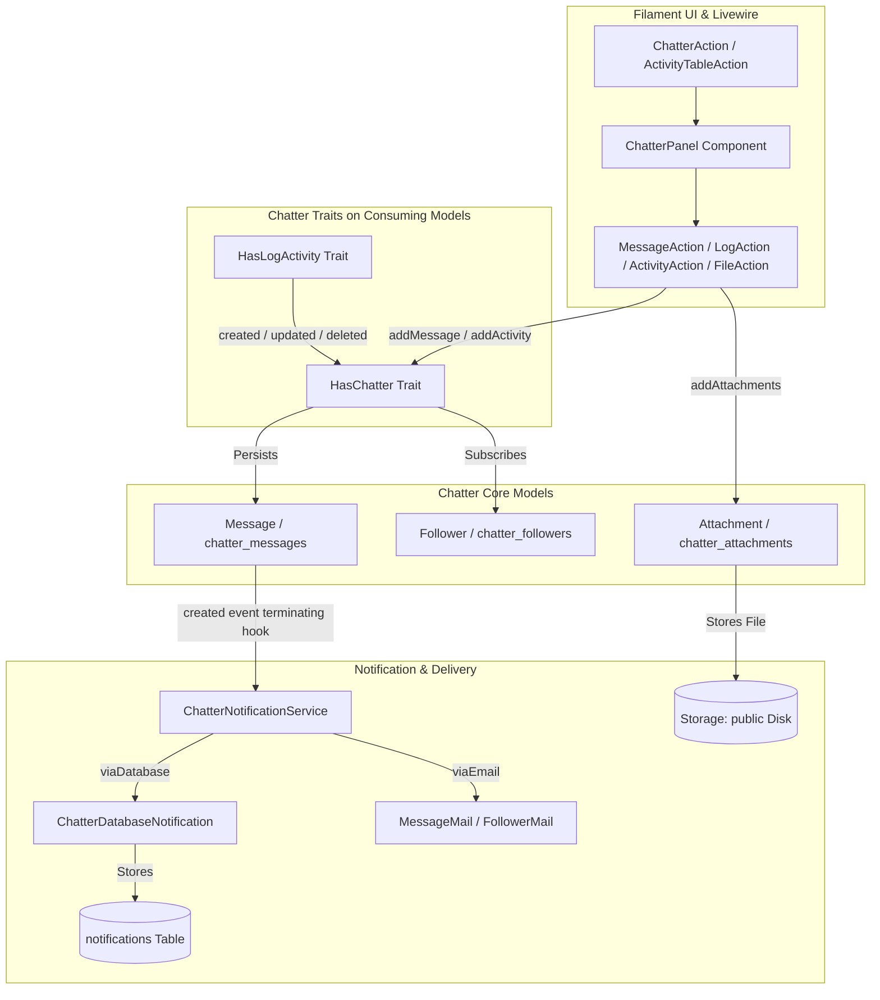

# Plugin: Chatter (`chatter`)

## Status
[VERIFIED]
Active Core Module. Registered explicitly in `bootstrap/providers.php:12` as `Webkul\Chatter\ChatterServiceProvider::class`.

## Core/Optional
[VERIFIED]
**Core Plugin**. Configured via `$package->isCore()` within `ChatterServiceProvider::configureCustomPackage()` (`plugins/webkul/chatter/src/ChatterServiceProvider.php:22`).

## Enabled/Disabled
[VERIFIED]
**Always Enabled (Core Infrastructure)**. Core plugin status causes `PackageServiceProvider::boot()` to bypass database installation checks (`Package::isInstalled()`) when loading migrations and routes (`plugins/webkul/plugin-manager/src/PackageServiceProvider.php:131-135, 202`). The `chatter` module executes unconditionally at boot time across the application.

## Purpose
[VERIFIED]
The `chatter` module provides the unified cross-cutting collaboration, audit logging, task activity management, document attachment, subscriber notification, and mention engine for Aureus ERP. At the time of verification, it powers social and operational workflows across 25 domain models in 14 plugins:

1. **Unified Audit Trail & Change Logging (`HasLogActivity`)**:
   - Automatically intercepts Eloquent lifecycle events (`created`, `updated`, `deleted`, `restored`) on consuming models.
   - Computes granular attribute differences, foreign key resolutions (e.g. relation names to titles), and enum translations.
   - Writes structured event entries with JSON property deltas to `chatter_messages` (`type = 'notification'`).

2. **Record-Level Communication & Internal Notes (`Message`, `MessageAction`, `LogAction`)**:
   - Enables internal notes (`type = 'note'`, `is_internal = true`) and team comments/messages (`type = 'comment'`).
   - Supports rich-text authoring via Filament `RichEditor`, `@` user mentions (`ChatterMentions`), and inline file uploads.
   - Supports message pinning (`pinned_at`), unread tracking (`is_read`), and filtering.

3. **Activity Planning & Task Scheduling (`ActivityAction`, `ActivityTableAction`, `ActivityPlan`)**:
   - Schedules operational follow-ups (e.g. calls, meetings, reminders, todo tasks) bound to `ActivityType` (from `support` module) with deadlines (`date_deadline`) and assignees (`assigned_to`).
   - Executes multi-step predefined template workflows via `ActivityPlan` (`plugins/webkul/support/src/Models/ActivityPlan.php`).
   - Provides completion workflows with feedback logging (`markAsDoneAction`) and direct scheduling from Filament table rows (`ActivityTableAction`).

4. **Document Attachment Management (`Attachment`, `FileAction`)**:
   - Manages physical binary files uploaded to `public` disk storage (`Storage::disk('public')`).
   - Tracks file size, MIME types, original filenames, creator user, and parent polymorphic model references in `chatter_attachments`.
   - Cleans up disk files automatically on attachment deletion (`Attachment::boot()` deleted hook).

5. **Subscriber Management & Follower Feeds (`Follower`, `FollowerAction`)**:
   - Tracks subscriber parties (`Partner`) following specific records in `chatter_followers` with unique constraint enforcement.
   - Automatically subscribes record creators, assigned responsible users (`syncResponsibleChatterFollower`), and mentioned users.

6. **Notification Delivery & Mention Dispatch (`ChatterNotificationService`, `ChatterDatabaseNotification`)**:
   - Houses the repository's sole custom database notification class (`ChatterDatabaseNotification`).
   - Automatically dispatches Filament database notifications and outbound transactional emails (`MessageMail`, `FollowerMail`) to subscribed followers upon message creation.

7. **Plugin Lifecycle Purge Orchestration (`ChatterCleanupService`)**:
   - Provides a centralized model-level purging utility (`purgeForModels()`) invoked during optional plugin uninstallations (`runsOnUninstall`) to eliminate orphaned polymorphic records across core chatter tables.

## Service Provider
[VERIFIED]
- **Class**: `Webkul\Chatter\ChatterServiceProvider` (`plugins/webkul/chatter/src/ChatterServiceProvider.php:13`)
- **Inheritance**: Extends `Webkul\PluginManager\PackageServiceProvider`
- **Registration & Configuration**:
  - `configureCustomPackage(Package $package)` (`plugins/webkul/chatter/src/ChatterServiceProvider.php:19-32`):
    - Sets package name to `chatter` (`ChatterServiceProvider::$name = 'chatter'`).
    - Sets view namespace to `chatter` (`ChatterServiceProvider::$viewNamespace = 'chatter'`).
    - Declares package as core (`$package->isCore()`).
    - Registers view namespace (`hasViews()`).
    - Registers translation namespace (`hasTranslations()`).
    - Registers 4 database migrations via `hasMigrations([...])` and enables execution via `runsMigrations()`:
      1. `2024_12_11_101222_create_chatter_followers_table`
      2. `2024_12_23_062355_create_chatter_messages_table`
      3. `2024_12_23_080148_create_chatter_attachments_table`
      4. `2025_03_12_072356_add_column_is_read_to_chatter_messages_table`
  - `packageRegistered()` (`plugins/webkul/chatter/src/ChatterServiceProvider.php:41-46`):
    - Hooks into panel configuration via `Panel::configureUsing()`, registering `ChatterPlugin::make()` across panels.
  - `packageBooted()` (`plugins/webkul/chatter/src/ChatterServiceProvider.php:34-39`):
    - Registers custom CSS asset `chatter` (`resources/dist/chatter.css`) via `FilamentAsset::register()`.
    - Registers Livewire component `'chatter-panel'` -> `Webkul\Chatter\Livewire\ChatterPanel::class`.

## Filament Plugin class
[VERIFIED]
- **Class**: `Webkul\Chatter\ChatterPlugin` (`plugins/webkul/chatter/src/ChatterPlugin.php:8`)
- **Interface**: Implements `Filament\Contracts\Plugin`
- **Identifier**: `getId()` returns `'chatter'` (`plugins/webkul/chatter/src/ChatterPlugin.php:10-13`)
- **Factory Method**: `ChatterPlugin::make()` resolves static singleton via `app(static::class)`
- **Panel Registration**:
  - `register(Panel $panel)` executes unconditionally across panels (`plugins/webkul/chatter/src/ChatterPlugin.php:20-39`):
    - Discovers resources in `src/Filament/Resources` under namespace `Webkul\Chatter\Filament\Resources` (none present directly under `Resources/`).
    - Discovers pages in `src/Filament/Pages` under namespace `Webkul\Chatter\Filament\Pages` (none present directly under `Pages/`).
    - Discovers clusters in `src/Filament/Clusters` under namespace `Webkul\Chatter\Filament\Clusters` (none present directly under `Clusters/`).
    - [VERIFIED Code Quirk] Calls `$panel->discoverClusters(in: __DIR__.'/Filament/Widgets', for: 'Webkul\\Chatter\\Filament\\Widgets')` (`plugins/webkul/chatter/src/ChatterPlugin.php:35-38`), discovering widgets directory via `discoverClusters()` rather than `discoverWidgets()`.
- **Boot**: `boot(Panel $panel)` contains empty method stub (`plugins/webkul/chatter/src/ChatterPlugin.php:41-44`).

## Composer dependencies
[VERIFIED]
- **Local Package Definition**: `plugins/webkul/chatter/composer.json`
  - Name: `webkul/chatter`
  - Autoload PSR-4: `Webkul\Chatter\` -> `src/`, `Webkul\Chatter\Database\Factories\` -> `database/factories/`, `Webkul\Chatter\Database\Seeders\` -> `database/seeders/`
  - Autoload-dev PSR-4: `Webkul\Chatter\Tests\` -> `tests/`
  - Extra Laravel Providers: `Webkul\Chatter\ChatterServiceProvider`
- **External Dependencies Consumed via Root Composer** (`composer.lock`):
  - `filament/filament` (`v5.8.1`): Filament panel actions, widgets, infolist components, rich editor mentions, notifications.
  - `livewire/livewire` (`v4.4.5`): `ChatterPanel` interactive component, file upload traits, action bindings.
  - `spatie/laravel-package-tools` (`v1.93.0`): Extends `BasePackage` and `BasePackageServiceProvider`.
  - `illuminate/support`, `illuminate/database`, `illuminate/mail`, `illuminate/notifications`: Laravel framework baseline.

## Runtime plugin dependencies
[VERIFIED]
None (`—`). `ChatterServiceProvider::configureCustomPackage()` does not declare runtime dependencies via `hasDependencies()`.

## Directory structure
[VERIFIED]
Full verified tree of `plugins/webkul/chatter/`:

```text
plugins/webkul/chatter/
├── .gitignore
├── composer.json
├── package-lock.json
├── package.json
├── postcss.config.js
├── tailwind.config.js
├── database/
│   ├── factories/
│   │   ├── AttachmentFactory.php
│   │   ├── FollowerFactory.php
│   │   └── MessageFactory.php
│   └── migrations/
│       ├── 2024_12_11_101222_create_chatter_followers_table.php
│       ├── 2024_12_23_062355_create_chatter_messages_table.php
│       ├── 2024_12_23_080148_create_chatter_attachments_table.php
│       └── 2025_03_12_072356_add_column_is_read_to_chatter_messages_table.php
├── resources/
│   ├── css/
│   │   └── index.css
│   ├── dist/
│   │   └── chatter.css
│   ├── lang/
│   │   ├── ar/
│   │   ├── en/
│   │   ├── es/
│   │   ├── fr/
│   │   └── pt_BR/
│   └── views/
│       ├── filament/
│       │   ├── actions/
│       │   │   └── follower-action.blade.php
│       │   ├── infolists/
│       │   │   └── components/
│       │   │       ├── activities/
│       │   │       │   ├── content-text-entry.blade.php
│       │   │       │   ├── repeatable-entry.blade.php
│       │   │       │   └── title-text-entry.blade.php
│       │   │       └── messages/
│       │   │           ├── content-text-entry.blade.php
│       │   │           ├── repeatable-entry.blade.php
│       │   │           └── title-text-entry.blade.php
│       │   └── widgets/
│       │       ├── chatter.blade.php
│       │       └── followers.blade.php
│       ├── livewire/
│       │   └── chatter-panel.blade.php
│       └── mail/
│           ├── follower-mail.blade.php
│           └── message-mail.blade.php
└── src/
    ├── ChatterPlugin.php
    ├── ChatterServiceProvider.php
    ├── Filament/
    │   ├── Actions/
    │   │   ├── ActivityTableAction.php
    │   │   ├── ChatterAction.php
    │   │   └── Chatter/
    │   │       ├── ActivityAction.php
    │   │       ├── ActivityActions/
    │   │       │   └── MarkAsDoneAction.php
    │   │       ├── FileAction.php
    │   │       ├── FiltersAction.php
    │   │       ├── FollowerAction.php
    │   │       ├── LogAction.php
    │   │       └── MessageAction.php
    │   ├── Infolists/
    │   │   └── Components/
    │   │       ├── Activities/
    │   │       │   ├── ActivitiesRepeatableEntry.php
    │   │       │   ├── ContentTextEntry.php
    │   │       │   └── TitleTextEntry.php
    │   │       └── Messages/
    │   │           ├── ContentTextEntry.php
    │   │           ├── MessageRepeatableEntry.php
    │   │           └── TitleTextEntry.php
    │   ├── Pages/
    │   │   └── Concerns/
    │   │       └── HasChatter.php
    │   └── Widgets/
    │       └── ChatterWidget.php
    ├── Http/
    │   └── Resources/
    │       └── V1/
    │           ├── AttachmentResource.php
    │           ├── FollowerResource.php
    │           └── MessageResource.php
    ├── Livewire/
    │   └── ChatterPanel.php
    ├── Mail/
    │   ├── FollowerMail.php
    │   └── MessageMail.php
    ├── Models/
    │   ├── Attachment.php
    │   ├── Follower.php
    │   └── Message.php
    ├── Notifications/
    │   └── ChatterDatabaseNotification.php
    ├── Relations/
    │   └── ChatterBelongsToMany.php
    ├── Services/
    │   ├── ChatterCleanupService.php
    │   └── ChatterNotificationService.php
    ├── Support/
    │   └── ChatterMentions.php
    └── Traits/
        ├── HasChatter.php
        ├── HasLogActivity.php
        └── HasModifyState.php
```

## Models
[VERIFIED]
All models live under namespace `Webkul\Chatter\Models` and are cataloged in `docs/database/erds/core.md`.

### 1. `Message` (`plugins/webkul/chatter/src/Models/Message.php:16`)
- **Table**: `chatter_messages`
- **Traits**: `Webkul\Support\Traits\BelongsToCompany`
- **Fillable**: `company_id`, `activity_type_id`, `messageable_type`, `messageable_id`, `type`, `name`, `subject`, `body`, `summary`, `is_internal`, `date_deadline`, `pinned_at`, `log_name`, `event`, `assigned_to`, `causer_type`, `causer_id`, `properties`
- **Casts**: `properties` => `'array'`, `date_deadline` => `'date'`
- **Relationships**:
  - `messageable()`: `MorphTo` (polymorphic parent entity adopting `HasChatter`)
  - `company()`: `BelongsTo` -> `Webkul\Support\Models\Company` (`company_id`)
  - `activityType()`: `BelongsTo` -> `Webkul\Support\Models\ActivityType` (`activity_type_id`)
  - `causer()`: `MorphTo` (`causer_type`, `causer_id` -> `User`, `Partner`, or system actor)
  - `assignedTo()`: `BelongsTo` -> `Webkul\Security\Models\User` (`assigned_to`)
  - `attachments()`: `HasMany` -> `Webkul\Chatter\Models\Attachment` (`message_id`)
- **Lifecycle Hooks** (`boot()`):
  - `creating` / `updating`: Sets `causer_type` and `causer_id` to current authenticated user (`Filament::auth()->user() ?? Auth::user()`).
  - `created`: Hooks into Laravel `app()->terminating(...)` to invoke `ChatterNotificationService::notifyFollowers($message)` after HTTP response completion.

### 2. `Attachment` (`plugins/webkul/chatter/src/Models/Attachment.php:13`)
- **Table**: `chatter_attachments`
- **Traits**: `Webkul\Support\Traits\BelongsToCompany`
- **Fillable**: `company_id`, `creator_id`, `message_id`, `file_size`, `name`, `messageable`, `file_path`, `original_file_name`, `mime_type`
- **Appends**: `['url']` -> `getUrlAttribute()` via `Storage::url($this->file_path)`
- **Relationships**:
  - `messageable()`: `MorphTo` (`messageable_type`, `messageable_id`)
  - `creator()`: `BelongsTo` -> `Webkul\Security\Models\User` (`creator_id`)
  - `company()`: `BelongsTo` -> `Webkul\Support\Models\Company` (`company_id`)
  - `message()`: `BelongsTo` -> `Webkul\Chatter\Models\Message` (`message_id`)
- **Lifecycle Hooks** (`boot()`):
  - `creating`: Populates `$attachment->creator_id ??= Auth::id()`.
  - `deleted`: Checks `Storage::disk('public')->exists($filePath)` and deletes physical file from storage.

### 3. `Follower` (`plugins/webkul/chatter/src/Models/Follower.php:10`)
- **Table**: `chatter_followers`
- **Traits**: None
- **Fillable**: `followable_id`, `followable_type`, `partner_id`
- **Casts**: `followed_at` => `'datetime'`
- **Relationships**:
  - `followable()`: `MorphTo` (`followable_type`, `followable_id`)
  - `partner()`: `BelongsTo` -> `Webkul\Partner\Models\Partner` (`partner_id`)

## Database
[VERIFIED]
Physical database schema details are cataloged in `docs/database/erds/core.md` (lines 125–127, 832–843, 921–924, 1015, 1022, 1045).

### Migrations Inventory
1. `2024_12_11_101222_create_chatter_followers_table.php`:
   - Table: `chatter_followers`
   - Columns: `id`, `followable_type` (string), `followable_id` (bigint), `partner_id` (bigint, nullable), `followed_at` (timestamp, nullable), `timestamps`
   - Constraints: `UNIQUE (followable_type, followable_id, partner_id)` named `chatter_followers_unique`
   - Foreign Keys: `partner_id` -> `partners_partners.id` (`cascadeOnDelete()`)
2. `2024_12_23_062355_create_chatter_messages_table.php`:
   - Table: `chatter_messages`
   - Columns: `id`, `company_id` (bigint, nullable), `activity_type_id` (bigint, nullable), `assigned_to` (bigint, nullable), `messageable_type` (string), `messageable_id` (bigint), `type` (string, nullable), `name` (string, nullable), `subject` (string, nullable), `body` (text, nullable), `summary` (text, nullable), `is_internal` (boolean, nullable), `date_deadline` (date, nullable), `pinned_at` (date, nullable), `log_name` (string, nullable), `causer_type` (string, nullable), `causer_id` (bigint, nullable), `event` (string, nullable), `properties` (json, nullable), `timestamps`
   - Foreign Keys: `company_id` -> `companies.id` (`cascadeOnDelete()`), `activity_type_id` -> `activity_types.id` (`cascadeOnDelete()`), `assigned_to` -> `users.id` (`cascadeOnDelete()`)
3. `2024_12_23_080148_create_chatter_attachments_table.php`:
   - Table: `chatter_attachments`
   - Columns: `id`, `company_id` (bigint, nullable), `creator_id` (bigint, nullable), `message_id` (bigint, nullable), `file_size` (string, nullable), `name` (string, nullable), `messageable_type` (string), `messageable_id` (bigint), `file_path` (string, nullable), `original_file_name` (string, nullable), `mime_type` (string, nullable), `timestamps`
   - Foreign Keys: `company_id` -> `companies.id` (`cascadeOnDelete()`), `creator_id` -> `users.id` (`cascadeOnDelete()`), `message_id` -> `chatter_messages.id` (`cascadeOnDelete()`)
4. `2025_03_12_072356_add_column_is_read_to_chatter_messages_table.php`:
   - Alters `chatter_messages`: Adds `is_read` (boolean, default 0, after `is_internal`).

## Filament resources/pages/widgets/clusters
[VERIFIED]

### Filament Resources
None (`—`). The `chatter` module does not expose dedicated standalone CRUD resources; its models are accessed through slide-over actions, embedded widgets, and livewire panels.

### Filament Pages
None (`—`).

### Filament Page Concerns
- `Webkul\Chatter\Filament\Pages\Concerns\HasChatter` (`plugins/webkul/chatter/src/Filament/Pages/Concerns/HasChatter.php:7`):
  - Provides `getFooterWidgets(): array { return [ChatterWidget::class]; }`.

### Filament Widgets
- `Webkul\Chatter\Filament\Widgets\ChatterWidget` (`plugins/webkul/chatter/src/Filament/Widgets/ChatterWidget.php:7`):
  - View: `chatter::filament.widgets.chatter`
  - Column Span: `full`
  - Mounts with target `$record`
  - Can be rendered in page footers or modal windows.

### Filament Actions
- `ChatterAction` (`plugins/webkul/chatter/src/Filament/Actions/ChatterAction.php:14`):
  - Name: `chatter.action`
  - Modal Slide-Over: `slideOver()` with `Width::TwoExtraLarge`, bubble icon (`Heroicon::ChatBubbleLeftRight`).
  - Badge: Unread messages count (`$record->unRead()->count()`).
  - Content: Renders `chatter::filament.widgets.chatter` passing configuration (`activityPlans`, `resourceClass`, action visibility toggles). Automatically executes `$record->markAsRead()`.
- `ActivityTableAction` (`plugins/webkul/chatter/src/Filament/Actions/ActivityTableAction.php:7`):
  - Name: `chatter.schedule-activity`
  - Clock icon button (`heroicon-o-clock`) embedded directly in table rows for rapid activity creation.
- Sub-Actions (`plugins/webkul/chatter/src/Filament/Actions/Chatter/`):
  - `MessageAction`: Public message/comment posting with subject toggle, RichEditor mentions, and multi-file uploads (`messages-attachments`).
  - `LogAction`: Internal audit note posting (`is_internal = true`, `type = 'note'`) with file attachments (`log-attachments`).
  - `ActivityAction`: Activity task scheduling with date picker, user assignment, and `ActivityPlan` multi-template execution.
  - `FileAction`: Document management popup displaying attachment counts, multi-file upload, file preview, and deletion with disk sync.
  - `FollowerAction`: Partner subscription manager with search, notify toggle, rich note input, and subscriber removal footer.
  - `FiltersAction`: Multi-criteria filtering dialog for chatter messages (search, type, date range, sort order, pinned only).
  - `MarkAsDoneAction`: Modal action for completing scheduled activities with feedback logging.

### Filament Infolist Components
- `ActivitiesRepeatableEntry` (`plugins/webkul/chatter/src/Filament/Infolists/Components/Activities/ActivitiesRepeatableEntry.php`)
- `Activities\TitleTextEntry` & `Activities\ContentTextEntry`
- `MessageRepeatableEntry` (`plugins/webkul/chatter/src/Filament/Infolists/Components/Messages/MessageRepeatableEntry.php`)
- `Messages\TitleTextEntry` & `Messages\ContentTextEntry`

### Livewire Components
- `ChatterPanel` (`plugins/webkul/chatter/src/Livewire/ChatterPanel.php:50`):
  - Registered as `'chatter-panel'` via `Livewire::component()`.
  - Implements `HasActions`, `HasForms`, `HasInfolists`, and uses `WithFileUploads`.
  - Features: Live tab switching (`messages` vs `activities`), real-time search, date filtering (`today`, `yesterday`, `week`, `month`, `quarter`, `year`), pinned message toggling (`pinMessage()`), priority sorting, activity editing (`editActivityAction`), activity completion (`markAsDoneAction`), activity cancellation (`cancelActivityAction`), message deletion (`deleteMessageAction`), follower removal (`removeFollower()`).

## Panels
[VERIFIED]
- **Admin Panel (`admin`)**: `ChatterPlugin` is registered via `Panel::configureUsing()`. `ChatterAction` and `ActivityTableAction` are consumed extensively across admin panel view/edit pages and resource tables.
- **Customer Panel (`customer`)**: `ChatterPlugin` is registered via `Panel::configureUsing()`. Customer-facing resources do not currently embed `ChatterAction` directly.

## Services
[VERIFIED]

### 1. `ChatterNotificationService` (`plugins/webkul/chatter/src/Services/ChatterNotificationService.php:16`)
- **Purpose**: Core notification dispatcher executing dual database and email distribution pipelines upon message creation.
- **Methods**:
  - `notifyFollowers(Message $message)`: Main entrypoint executing `viaDatabase($message)` and `viaEmail($message)`.
  - `viaDatabase(Message $message)`: Resolves record followers (`$record->followers()->with('partner.user')`), extracts `@` mentions via `ChatterMentions::extractUserIds()`, sends `ChatterDatabaseNotification` to assignees, mentioned users, and all subscribed follower user accounts.
  - `viaEmail(Message $message)`: Dispatches `MessageMail` via `Mail::to($partner->email)->send()` to all subscribed partners (excluding author).
  - `summarizeChanges(Message $message)`: Converts JSON audit properties into concise human-readable text diffs (e.g. `Stage: Draft → Confirmed`).

### 2. `ChatterCleanupService` (`plugins/webkul/chatter/src/Services/ChatterCleanupService.php:9`)
- **Purpose**: Module lifecycle cleanup utility ensuring zero orphan data across core chatter tables when domain plugins are uninstalled.
- **Methods**:
  - `purgeForModels(array $models)`: Resolves polymorphic morph classes for provided model array, deletes `chatter_attachments` via Eloquent (triggering disk file deletion), and deletes matching rows in `chatter_messages` and `chatter_followers` via `DB::table()`.

### 3. `ChatterMentions` (`plugins/webkul/chatter/src/Support/ChatterMentions.php:11`)
- **Purpose**: Mention provider and parser for Filament `RichEditor`.
- **Methods**:
  - `provider()`: Returns `MentionProvider::make('@')` querying active `User` models.
  - `render(?string $body)`: Converts mention tags into styled spans/links pointing to `UserResource`.
  - `extractUserIds(?string $body)`: Parses `<span/a data-type="mention" data-id="...">` tags to extract user IDs.

## Events
[VERIFIED]
- **Custom Event Classes**: None (`—`).
- **Eloquent Lifecycle Events**:
  - `Message`: Intercepts `creating`, `updating`, and `created` (registers `app()->terminating(...)` hook).
  - `Attachment`: Intercepts `creating` (populates `creator_id`) and `deleted` (deletes storage file).
  - `HasChatter`: Intercepts `created` (`addDefaultChatterFollowers`) and `updated` (`syncResponsibleChatterFollower`).
  - `HasLogActivity`: Intercepts `created`, `updated`, `deleted`, `restored`, `deleting` to generate audit entries.
- **Livewire Events**:
  - Dispatches `'chatter.refresh'` from action handlers to trigger UI re-renders across parent components.

## Listeners
[VERIFIED]
- `Livewire\ChatterPanel` listens to `'chatter.refresh' => 'refreshMessages'` (`plugins/webkul/chatter/src/Livewire/ChatterPanel.php:94-96`).

## Observers
[NOT APPLICABLE]
No dedicated `*Observer.php` classes are registered. All lifecycle logic is implemented directly via Eloquent model/trait `boot()` methods.

## Policies
[NOT APPLICABLE]
No standalone `*Policy.php` classes exist in `chatter`. Authorization is governed by parent model policies and permissions on the owning Filament resources.

## Routes
[NOT APPLICABLE]
The `chatter` plugin defines no routes in `routes/api.php` or `routes/web.php`. API Http Resources (`AttachmentResource`, `FollowerResource`, `MessageResource`) exist under `src/Http/Resources/V1/` for cross-plugin serialization.

## Settings
[NOT APPLICABLE]
The `chatter` plugin registers no custom settings schema or settings migrations.

## Translations
[VERIFIED]
Translation files live under `plugins/webkul/chatter/resources/lang/` across 5 locales (`ar`, `en`, `es`, `fr`, `pt_BR`):
- `filament/resources/actions/chatter-action.php`
- `filament/resources/actions/chatter/activity-action.php`
- `filament/resources/actions/chatter/file-action.php`
- `filament/resources/actions/chatter/filters-action.php`
- `filament/resources/actions/chatter/follower-action.php`
- `filament/resources/actions/chatter/log-action.php`
- `filament/resources/actions/chatter/message-action.php`
- `livewire/chatter-panel.php`
- `mail/new-follower.php`
- `mail/send-message.php`
- `notifications.php`
- `traits/has-chatter.php`
- `traits/has-log-activity.php`
- `views/filament/infolists/components/activities/*`
- `views/filament/infolists/components/messages/*`
- `views/mail/follower-mail.php`

## Tests
[VERIFIED]
**No Test Files Found**. The `plugins/webkul/chatter/` directory contains no `tests/` subdirectory, and no unit or feature tests exist for `chatter` models, services, traits, notifications, or Livewire components.

## Runtime dependencies
[VERIFIED]
None (`—`). `ChatterServiceProvider::configureCustomPackage()` declares no runtime dependencies.

## Cross-plugin relationships
[VERIFIED]

### 1. Foundation Plugins Consumed by Chatter
- **`support` (`Webkul\Support`)**:
  - `Company` (`Webkul\Support\Models\Company`): Multi-tenant company isolation on `Message` and `Attachment`.
  - `BelongsToCompany` trait: Scoping `Message` and `Attachment` queries.
  - `ActivityType` (`Webkul\Support\Models\ActivityType`): Foreign key on `chatter_messages.activity_type_id`.
  - `ActivityPlan` / `ActivityPlanTemplate`: Multi-activity plan definitions loaded in `ActivityAction`.
  - `EmailService` (`Webkul\Support\Services\EmailService`): Dispatches follower notification emails.
- **`security` (`Webkul\Security`)**:
  - `User` (`Webkul\Security\Models\User`): Foreign key on `chatter_messages.assigned_to` and `chatter_attachments.creator_id`; mention recipient and database notification recipient.
- **`partners` (`Webkul\Partner`)**:
  - `Partner` (`Webkul\Partner\Models\Partner`): Foreign key on `chatter_followers.partner_id`; recipient identity for follower subscriptions and email notifications.

### 2. Consumers of Chatter Across Aureus ERP
[VERIFIED — repository snapshot]
At the time of verification, 25 models across 14 plugins were found to consume `HasChatter` (and 22 of those also consume `HasLogActivity`):

| Consuming Plugin | Consuming Model | Uses `HasChatter` | Uses `HasLogActivity` | `ChatterCleanupService` on Uninstall |
|---|---|:---:|:---:|:---:|
| `accounting` | `Webkul\Accounting\Models\Category` | [VERIFIED] | — | — |
| `accounts` | `Webkul\Account\Models\Move` | [VERIFIED] | [VERIFIED] | [VERIFIED] (`Move`, `Payment`) |
| `accounts` | `Webkul\Account\Models\Payment` | [VERIFIED] | [VERIFIED] | [VERIFIED] |
| `accounts` | `Webkul\Account\Models\Product` | [VERIFIED] | [VERIFIED] | — |
| `employees` | `Webkul\Employee\Models\Department` | [VERIFIED] | [VERIFIED] | [VERIFIED] (`Department`, `Employee`) |
| `employees` | `Webkul\Employee\Models\Employee` | [VERIFIED] | [VERIFIED] | [VERIFIED] |
| `inventories` | `Webkul\Inventory\Models\Operation` | [VERIFIED] | [VERIFIED] | [VERIFIED] (`Operation`, `Scrap`) |
| `inventories` | `Webkul\Inventory\Models\Scrap` | [VERIFIED] | [VERIFIED] | [VERIFIED] |
| `invoices` | `Webkul\Invoice\Models\Category` | [VERIFIED] | — | — |
| `maintenance` | `Webkul\Maintenance\Models\MaintenanceRequest` | [VERIFIED] | [VERIFIED] | [VERIFIED] (`MaintenanceRequest`) |
| `manufacturing` | `Webkul\Manufacturing\Models\Order` | [VERIFIED] | [VERIFIED] | [VERIFIED] (`Order`) |
| `partners` | `Webkul\Partner\Models\Partner` | [VERIFIED] | [VERIFIED] | — (Core Plugin) |
| `products` | `Webkul\Product\Models\Category` | [VERIFIED] | [VERIFIED] | [VERIFIED] (`Category`, `Product`) |
| `products` | `Webkul\Product\Models\Product` | [VERIFIED] | [VERIFIED] | [VERIFIED] |
| `projects` | `Webkul\Project\Models\Project` | [VERIFIED] | [VERIFIED] | [VERIFIED] (`Project`, `Task`) |
| `projects` | `Webkul\Project\Models\Task` | [VERIFIED] | [VERIFIED] | [VERIFIED] |
| `purchases` | `Webkul\Purchase\Models\Order` | [VERIFIED] | [VERIFIED] | [VERIFIED] (`Order`, `Requisition`) |
| `purchases` | `Webkul\Purchase\Models\Requisition` | [VERIFIED] | [VERIFIED] | [VERIFIED] |
| `recruitments` | `Webkul\Recruitment\Models\Applicant` | [VERIFIED] | [VERIFIED] | [VERIFIED] (`Applicant`, `Candidate`) |
| `recruitments` | `Webkul\Recruitment\Models\Candidate` | [VERIFIED] | [VERIFIED] | [VERIFIED] |
| `sales` | `Webkul\Sale\Models\Order` | [VERIFIED] | [VERIFIED] | [VERIFIED] (`Order`, `Team`) |
| `sales` | `Webkul\Sale\Models\Team` | [VERIFIED] | [VERIFIED] | [VERIFIED] |
| `support` | `Webkul\Support\Models\Company` | [VERIFIED] | — | — (Core Plugin) |
| `time-off` | `Webkul\TimeOff\Models\Leave` | [VERIFIED] | [VERIFIED] | [VERIFIED] (`Leave`, `LeaveAllocation`) |
| `time-off` | `Webkul\TimeOff\Models\LeaveAllocation` | [VERIFIED] | [VERIFIED] | [VERIFIED] |

## Data flow
[VERIFIED]



### Key Execution Steps
1. **Change Interception**: When a model using `HasLogActivity` is modified, `bootHasLogActivity()` intercepts the event, calls `determineChanges()`, resolves relation labels/casts, and invokes `addMessage()` with structured property deltas.
2. **Message Persistence**: `Message::create()` sets `causer_type` / `causer_id` to current user.
3. **Asynchronous Notification Trigger**: `Message::boot()` registers an `app()->terminating(...)` hook calling `ChatterNotificationService::notifyFollowers($message)`.
4. **Recipient Resolution & Dispatch**: `ChatterNotificationService` parses `@` mentions via `ChatterMentions`, sends `ChatterDatabaseNotification` to assignees and followers (stored in Laravel `notifications` table), and dispatches `MessageMail` via `Mail::send()`.
5. **UI Refresh**: Livewire dispatches `'chatter.refresh'` to reload feed entries and badge counts in real time.

## Business rules
[VERIFIED]
1. **Multi-Tenant Isolation**: `chatter_messages` and `chatter_attachments` enforce company scoping via `BelongsToCompany` trait. Messages and files are automatically partitioned by `company_id`.
2. **Subscriber Deduping**: `chatter_followers` enforces a database-level composite unique constraint `(followable_type, followable_id, partner_id)` preventing duplicate subscriptions.
3. **Responsible Auto-Subscription**: Whenever a model's responsible user (e.g. `user_id`, `assigned_to`, or declared relations) is set or modified, `syncResponsibleChatterFollower()` automatically finds the associated `Partner` and subscribes them.
4. **Mention Auto-Subscription**: Mentioning a user (`@Username`) in rich text automatically adds the user's partner to the record's follower list.
5. **Physical File Removal on Delete**: Deleting an `Attachment` model invokes its `deleted` hook to purge the physical file from `Storage::disk('public')`.

## Extension points
[VERIFIED]
- **`HasChatter::chatterResponsibles()`**: Consuming models can override to return an array of responsible relationship/column names to monitor for auto-following.
- **`HasChatter::activityPlanPlugin()` / `ACTIVITY_PLAN_PLUGIN`**: Consuming models define constant `ACTIVITY_PLAN_PLUGIN` to automatically filter available `ActivityPlan` templates in activity scheduling.
- **`HasLogActivity::getLogAttributeLabels()`**: Consuming models define an associative array of attribute keys (including dot-notation relations like `'partner.name'`) and user-facing labels to track in audit logs.
- **`HasLogActivity::getModelTitle()`**: Abstract method requiring each model to declare its display name for audit event text generation.
- **`ChatterAction` Customization**: Consuming pages can override email views (`messageMailView()`, `followerMailView()`), activity plans (`activityPlans()`), and toggle action visibility (`showLogAction()`, `showActivityAction()`, `showFileAction()`, `showFollowerAction()`).

## Dangerous areas
[VERIFIED]

### 1. Polymorphic Orphan Data on Hard Deletes
- **Tables Affected**: `chatter_messages`, `chatter_attachments`, `chatter_followers`.
- **Mechanism**: Polymorphic relationships (`messageable_type`/`messageable_id` and `followable_type`/`followable_id`) cannot have physical foreign keys with `ON DELETE CASCADE` in relational databases.
- **Consequence**: If a record in any of the 25 consuming models is hard-deleted via bulk query (`Model::where(...)->delete()`) or raw SQL (`DB::table(...)`), Eloquent `deleting`/`deleted` events are bypassed. Orphaned messages, activities, attachments, and followers remain indefinitely in the database. If a new record is later created with the same recycled auto-increment primary key ID, it will inadvertently inherit the historical messages and attachments of the previous entity.
- **Mitigation**: Standard deletions must use Eloquent instance deletion (`$model->delete()`), and bulk deletions must manually invoke `ChatterCleanupService::purgeForModels([...])`.

### 2. Physical File Orphanage on Storage Disk
- If an attachment record is deleted via raw SQL query or bulk delete bypassing Eloquent, the `Attachment::deleted` hook never executes, leaving physical binary files permanently on disk (`storage/app/public/`).

### 3. Total Absence of Automated Test Coverage
- **Status**: The `plugins/webkul/chatter/` plugin contains **zero test files** (`tests/` directory is completely absent).
- **Risk**: Any refactoring to `ChatterNotificationService`, `HasChatter`, `HasLogActivity`, `ChatterPanel`, or `ChatterMentions` carries high regression risk across all 25 consuming domain models and requires manual verification.

### 4. Application Termination Notification Delivery
- Notification dispatch occurs within `app()->terminating(...)` callbacks. In environments where long-running queue workers, Octane, or atypical request lifecycles terminate abruptly, pending notifications may fail silently without raising user-visible exceptions.

## Change impact
[VERIFIED]
Modifications to `chatter` directly impact core infrastructure and 14 domain modules:
- Breaking changes in `HasChatter` or `HasLogActivity` trait signatures will break model boots across 25 domain models (`Order`, `Move`, `Partner`, `Task`, `Employee`, `Candidate`, etc.).
- Changes to `ChatterAction` affect header action menus in view/edit pages across all ERP modules.
- Changes to `ChatterCleanupService` affect uninstall routines across optional plugins.

## Evidence
[VERIFIED]
- `plugins/webkul/chatter/src/ChatterServiceProvider.php`: Service provider registration, core declaration, migration list, Livewire registration, CSS registration.
- `plugins/webkul/chatter/src/ChatterPlugin.php`: Filament plugin interface implementation and discovery calls.
- `plugins/webkul/chatter/composer.json`: Autoload mappings and package name.
- `plugins/webkul/chatter/database/migrations/`: Migration schema definitions and foreign key constraints.
- `plugins/webkul/chatter/src/Models/`: `Message`, `Attachment`, `Follower` implementations.
- `plugins/webkul/chatter/src/Traits/`: `HasChatter`, `HasLogActivity`, `HasModifyState`.
- `plugins/webkul/chatter/src/Services/`: `ChatterNotificationService`, `ChatterCleanupService`.
- `plugins/webkul/chatter/src/Notifications/ChatterDatabaseNotification.php`: Custom database notification class.
- `plugins/webkul/chatter/src/Livewire/ChatterPanel.php`: Livewire panel component.
- `plugins/webkul/chatter/src/Filament/Actions/`: Action implementations.
- Consuming models inventory across `plugins/webkul/*/src/Models/*.php`.
