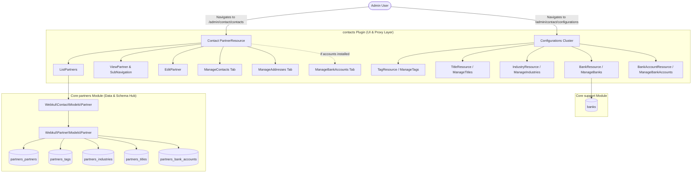

# Plugin: Contacts (`contacts`)

## Status
[VERIFIED]
Active Optional Module. Registered in `bootstrap/providers.php:45` as `Webkul\Contact\ContactServiceProvider::class`.

## Core/Optional
[VERIFIED]
**Optional Plugin**. Configured as an optional domain module without calling `$package->isCore()` (`plugins/webkul/contacts/src/ContactServiceProvider.php:15-22`). Execution and Filament UI contribution are gated by runtime installation verification via `Package::isPluginInstalled('contacts')` (`plugins/webkul/contacts/src/ContactPlugin.php:23`).

## Enabled/Disabled
[VERIFIED]
**Conditionally Enabled (Database-Gated)**. `ContactServiceProvider` registers the package and configures panel integration via `Panel::configureUsing()`, but Filament admin panel resources, pages, clusters, and widgets are discovered and registered only when `Package::isPluginInstalled('contacts')` returns `true` (`plugins/webkul/contacts/src/ContactPlugin.php:23-47`).

## Purpose
[VERIFIED]
The `contacts` module functions as the administrative CRM, Contact Book, and directory management UI layer for Aureus ERP. It acts as a specialized UI/proxy wrapper directly over the foundational Core `partners` master data hub:

1. **User-Facing Contact Directory UI (`PartnerResource`)**:
   - Whereas the Core `partners` plugin provides the underlying schema, base models, forms, tables, infolists, and REST APIs, it deliberately hides its own Filament resources from the main navigation (`$shouldRegisterNavigation = false`).
   - The `contacts` module enables and surfaces the primary Contact Book UI (`contact/contacts`) within the top-level navigation group `NavigationGroup::Contact`.
   - Provides a comprehensive record sub-navigation header layout (`SubNavigationPosition::Top`) linking View, Edit, Child Contacts, Addresses, and Bank Accounts pages.

2. **Dedicated Clustered Configuration Hub (`Configurations`)**:
   - Organizes all partner-related reference data under a unified Filament Cluster: `Webkul\Contact\Filament\Clusters\Configurations` (`contact/configurations`).
   - Houses dedicated configuration resources and management pages for Tags, Titles, Industries, Banks, and Bank Accounts with tabbed filtering (`All` and `Archived` where applicable).

3. **Sub-Entity Relationship Management**:
   - Integrates `ContactsRelationManager` and `AddressesRelationManager` directly into `PartnerResource` relation groups.
   - Provides dedicated record tab pages for managing individual contact people (`ManageContacts`) and physical/logistics delivery/invoice addresses (`ManageAddresses`).

4. **Dynamic Accounting Integration**:
   - Dynamically checks if the optional `accounts` plugin is installed (`Package::isPluginInstalled('accounts')`).
   - If active, automatically injects a `ManageBankAccounts` record sub-navigation item and route (`/{record}/bank-accounts`) into `PartnerResource`.

5. **Filament Shield Permission Registration**:
   - Provides granular role-based access control configurations via `config/filament-shield.php` for `PartnerResource`, `TagResource`, `TitleResource`, `IndustryResource`, `BankAccountResource`, `BankResource`, and `AddressResource`.

## Service Provider
[VERIFIED]
- **Class**: `Webkul\Contact\ContactServiceProvider` (`plugins/webkul/contacts/src/ContactServiceProvider.php:11`)
- **Inheritance**: Extends `Webkul\PluginManager\PackageServiceProvider`
- **Registration & Configuration**:
  - `configureCustomPackage(Package $package)`:
    - Sets package name to `contacts` (`ContactServiceProvider::$name = 'contacts'`).
    - Registers translation namespace via `hasTranslations()`.
    - Registers installation hook via `hasInstallCommand(function (InstallCommand $command) {})` (empty closure).
    - Registers uninstallation hook via `hasUninstallCommand(function (UninstallCommand $command) {})` (empty closure).
    - Sets package icon identifier to `contacts` (`icon('contacts')`).
    - Does **not** declare `$package->isCore()` (confirming optional plugin status).
    - Does **not** register database migrations, routes, or seeders.
  - `packageRegistered()`:
    - Registers `ContactPlugin::make()` with the Filament Panel builder via `Panel::configureUsing()`.
  - `packageBooted()`:
    - Empty implementation (`//`).

## Filament Plugin Class
[VERIFIED]
- **Class**: `Webkul\Contact\ContactPlugin` (`plugins/webkul/contacts/src/ContactPlugin.php:9`)
- **Implements**: `Filament\Contracts\Plugin`
- **Plugin ID**: `contacts` (`getId(): string`)
- **Singleton Factory**: `ContactPlugin::make()` resolves `app(static::class)`.
- **Panel Registration Logic**:
  - Checks if plugin is installed in database via `Package::isPluginInstalled($this->getId())`; returns early if false (`plugins/webkul/contacts/src/ContactPlugin.php:23-25`).
  - When panel ID is `'admin'` (`$panel->getId() == 'admin'`), discovers:
    - Resources: `plugins/webkul/contacts/src/Filament/Resources` (namespace `Webkul\Contact\Filament\Resources`)
    - Pages: `plugins/webkul/contacts/src/Filament/Pages` (namespace `Webkul\Contact\Filament\Pages`)
    - Clusters: `plugins/webkul/contacts/src/Filament/Clusters` (namespace `Webkul\Contact\Filament\Clusters`)
    - Widgets: `plugins/webkul/contacts/src/Filament/Widgets` (namespace `Webkul\Contact\Filament\Widgets`)
- **Boot**: Empty method stub (`boot(Panel $panel)`).

## Composer Dependencies
[VERIFIED]
Defined in `plugins/webkul/contacts/composer.json`:
- **Package Name**: `webkul/contacts`
- **Description**: `Contact management for customers and vendors`
- **Autoload PSR-4**:
  - `Webkul\Contact\`: `src/`
  - `Webkul\Contact\Database\Factories\`: `database/factories/`
  - `Webkul\Contact\Database\Seeders\`: `database/seeders/`
- **Autoload-dev PSR-4**:
  - `Webkul\Contact\Tests\`: `tests/`
- **Require Dependencies**: None declared in `composer.json` (relies on root application packages and Core plugins).

## Runtime Plugin Dependencies
[VERIFIED]
- **Declared Runtime Dependencies (`Package::hasDependencies([...])`)**: None (`—`). The plugin does not call `hasDependencies()` in `ContactServiceProvider`.
- **Implicit Core Plugin Dependencies**:
  - `partners`: Required base models (`Webkul\Partner\Models\*`), base schemas (`PartnerForm`, `PartnersTable`, `PartnerInfolist`), and base relation managers (`ContactsRelationManager`, `AddressesRelationManager`).
  - `support`: Required for `NavigationGroup::Contact` enum and base `Bank` entity.
  - `plugin-manager`: Required for package service provider infrastructure and `Package::isPluginInstalled()`.
- **Conditional Optional Plugin Dependencies**:
  - `accounts`: Soft runtime check via `Package::isPluginInstalled('accounts')` to conditionally attach `ManageBankAccounts` page and route.

## Directory Structure
[VERIFIED]
```text
plugins/webkul/contacts/
├── composer.json
├── config/
│   └── filament-shield.php
├── resources/
│   └── lang/
│       ├── ar/
│       ├── en/
│       │   ├── filament/
│       │   │   ├── clusters/
│       │   │   │   ├── configurations.php
│       │   │   │   └── configurations/
│       │   │   │       └── resources/
│       │   │   │           ├── bank-account.php
│       │   │   │           ├── bank.php
│       │   │   │           ├── bank/
│       │   │   │           │   └── pages/
│       │   │   │           │       └── manage-banks.php
│       │   │   │           ├── industry.php
│       │   │   │           ├── industry/
│       │   │   │           │   └── pages/
│       │   │   │           │       └── manage-industries.php
│       │   │   │           ├── tag.php
│       │   │   │           ├── tag/
│       │   │   │           │   └── pages/
│       │   │   │           │       └── manage-tags.php
│       │   │   │           ├── title.php
│       │   │   │           └── title/
│       │   │   │               └── pages/
│       │   │   │                   └── manage-titles.php
│       │   │   └── resources/
│       │   │       ├── address.php
│       │   │       └── partner.php
│       │   ├── es/
│       │   ├── fr/
│       │   └── pt_BR/
└── src/
    ├── ContactPlugin.php
    ├── ContactServiceProvider.php
    ├── Filament/
    │   ├── Clusters/
    │   │   ├── Configurations.php
    │   │   └── Configurations/
    │   │       └── Resources/
    │   │           ├── BankAccountResource.php
    │   │           ├── BankAccountResource/
    │   │           │   └── Pages/
    │   │           │       └── ManageBankAccounts.php
    │   │           ├── BankResource.php
    │   │           ├── BankResource/
    │   │           │   └── Pages/
    │   │           │       └── ManageBanks.php
    │   │           ├── IndustryResource.php
    │   │           ├── IndustryResource/
    │   │           │   └── Pages/
    │   │           │       └── ManageIndustries.php
    │   │           ├── TagResource.php
    │   │           ├── TagResource/
    │   │           │   └── Pages/
    │   │           │       └── ManageTags.php
    │   │           ├── TitleResource.php
    │   │           └── TitleResource/
    │   │               └── Pages/
    │   │                   └── ManageTitles.php
    │   └── Resources/
    │       ├── AddressResource.php
    │       ├── PartnerResource.php
    │       └── PartnerResource/
    │           └── Pages/
    │               ├── CreatePartner.php
    │               ├── EditPartner.php
    │               ├── ListPartners.php
    │               ├── ManageAddresses.php
    │               ├── ManageBankAccounts.php
    │               ├── ManageContacts.php
    │               └── ViewPartner.php
    └── Models/
        ├── Address.php
        ├── Bank.php
        ├── BankAccount.php
        ├── Industry.php
        ├── Partner.php
        ├── Tag.php
        └── Title.php
```

*Note: The `contacts` module intentionally contains **no `database/` directory** (0 migrations, 0 seeders, 0 factories), **no `routes/` directory**, and **no `tests/` directory**.*

## Models
[VERIFIED]
The `contacts` plugin defines 7 lightweight proxy model classes under `Webkul\Contact\Models\` that extend the underlying Core `partners` and `support` models without adding physical database tables or altering column definitions:

| Model Class | Extends Class | Physical Table | Company Isolation | Description |
| :--- | :--- | :--- | :--- | :--- |
| `Partner` | `Webkul\Partner\Models\Partner` | `partners_partners` | Optional (`BelongsToCompany`) | Primary partner entity proxy representing companies and individuals. |
| `Address` | `Webkul\Contact\Models\Partner` | `partners_partners` | Optional (`BelongsToCompany`) | Single Table Inheritance (STI) proxy for partner address records (`account_type = address`). |
| `Bank` | `Webkul\Partner\Models\Bank` | `banks` (Core `support`) | None | Proxy for financial institutions registry. |
| `BankAccount` | `Webkul\Partner\Models\BankAccount` | `partners_bank_accounts` | Optional (`BelongsToCompany`) | Proxy for partner bank routing accounts. |
| `Industry` | `Webkul\Partner\Models\Industry` | `partners_industries` | None | Proxy for standardized industry classifications. |
| `Tag` | `Webkul\Partner\Models\Tag` | `partners_tags` | None | Proxy for color-coded partner tags. |
| `Title` | `Webkul\Partner\Models\Title` | `partners_titles` | None | Proxy for personal honorific titles (Mr., Dr., etc.). |

## Database
[NOT APPLICABLE]
- **Physical Tables Owned**: `0`
- **Migrations Registered**: `0`
- **Database Seeders**: `0`
- **Model Factories**: `0`

The `contacts` plugin is a pure UI/proxy domain layer. All underlying tables (`partners_partners`, `partners_bank_accounts`, `partners_industries`, `partners_tags`, `partners_titles`, `partners_partner_tag`, `banks`) are created and owned by the Core `partners` and `support` plugins.

## Filament Resources, Pages, Widgets & Clusters
[VERIFIED]
All UI components are registered for the `admin` panel:

### 1. Primary Resources (`src/Filament/Resources/`)

#### `PartnerResource` (`Webkul\Contact\Filament\Resources\PartnerResource`)
- **Inheritance**: Extends `Webkul\Partner\Filament\Resources\PartnerResource`
- **Model**: `Webkul\Contact\Models\Partner::class`
- **Navigation Group**: `NavigationGroup::Contact` (`plugins/webkul/support/src/Enums/NavigationGroup.php`)
- **Navigation Label**: `__('contacts::filament/resources/partner.navigation.title')` (`'Contacts'`)
- **Navigation Registration**: `protected static bool $shouldRegisterNavigation = true;`
- **Slug**: `contact/contacts`
- **Sub-Navigation Position**: `SubNavigationPosition::Top`
- **Sub-Navigation Tabs**:
  - `ViewPartner::class`
  - `EditPartner::class`
  - `ManageContacts::class`
  - `ManageAddresses::class`
  - `ManageBankAccounts::class` (conditionally registered if `Package::isPluginInstalled('accounts')`)
- **Relation Groups**:
  - `Contacts` (`icon: heroicon-o-users`): `ContactsRelationManager::class`
  - `Addresses` (`icon: heroicon-o-map-pin`): `AddressesRelationManager::class`
- **Pages**:
  - `ListPartners` (`/`): Extends `Webkul\Partner\Filament\Resources\PartnerResource\Pages\ListPartners`
  - `CreatePartner` (`/create`): Extends `Webkul\Partner\Filament\Resources\PartnerResource\Pages\CreatePartner`
  - `ViewPartner` (`/{record}`): Extends `Webkul\Partner\Filament\Resources\PartnerResource\Pages\ViewPartner`
  - `EditPartner` (`/{record}/edit`): Extends `Webkul\Partner\Filament\Resources\PartnerResource\Pages\EditPartner`
  - `ManageContacts` (`/{record}/contacts`): Extends `Webkul\Partner\Filament\Resources\PartnerResource\Pages\ManageContacts`
  - `ManageAddresses` (`/{record}/addresses`): Extends `Webkul\Partner\Filament\Resources\PartnerResource\Pages\ManageAddresses`
  - `ManageBankAccounts` (`/{record}/bank-accounts`): Extends `Webkul\Account\Filament\Resources\PartnerResource\Pages\ManageBankAccounts` (conditionally registered if `Package::isPluginInstalled('accounts')`)

#### `AddressResource` (`Webkul\Contact\Filament\Resources\AddressResource`)
- **Inheritance**: Extends `Webkul\Partner\Filament\Resources\AddressResource`
- **Model**: `Webkul\Contact\Models\Address::class`
- **Navigation Registration**: `protected static bool $shouldRegisterNavigation = false;` (managed via relation managers and tab pages).

### 2. Configuration Cluster & Clustered Resources (`src/Filament/Clusters/`)

#### `Configurations` Cluster (`Webkul\Contact\Filament\Clusters\Configurations`)
- **Inheritance**: Extends `Filament\Clusters\Cluster`
- **Slug**: `contact/configurations`
- **Navigation Group**: `NavigationGroup::Contact`
- **Navigation Sort**: `0`
- **Navigation Label**: `__('contacts::filament/clusters/configurations.navigation.title')` (`'Configurations'`)

#### `TagResource` (`Webkul\Contact\Filament\Clusters\Configurations\Resources\TagResource`)
- **Inheritance**: Extends `Webkul\Partner\Filament\Resources\TagResource`
- **Model**: `Webkul\Contact\Models\Tag::class`
- **Cluster**: `Configurations::class`
- **Navigation Icon**: `heroicon-o-tag`
- **Navigation Sort**: `1`
- **Navigation Label**: `__('contacts::filament/clusters/configurations/resources/tag.navigation.title')` (`'Tags'`)
- **Pages**:
  - `ManageTags` (`/`): Extends `Webkul\Partner\Filament\Resources\TagResource\Pages\ManageTags`. Provides `All` and `Archived` tabs, header create action with notification.

#### `TitleResource` (`Webkul\Contact\Filament\Clusters\Configurations\Resources\TitleResource`)
- **Inheritance**: Extends `Webkul\Partner\Filament\Resources\TitleResource`
- **Model**: `Webkul\Contact\Models\Title::class`
- **Cluster**: `Configurations::class`
- **Navigation Icon**: `heroicon-o-academic-cap`
- **Navigation Sort**: `2`
- **Navigation Label**: `__('contacts::filament/clusters/configurations/resources/title.navigation.title')` (`'Titles'`)
- **Pages**:
  - `ManageTitles` (`/`): Extends `Webkul\Partner\Filament\Resources\TitleResource\Pages\ManageTitles`. Provides header create action with notification.

#### `IndustryResource` (`Webkul\Contact\Filament\Clusters\Configurations\Resources\IndustryResource`)
- **Inheritance**: Extends `Webkul\Partner\Filament\Resources\IndustryResource`
- **Model**: `Webkul\Contact\Models\Industry::class`
- **Cluster**: `Configurations::class`
- **Navigation Icon**: `heroicon-o-building-office`
- **Navigation Sort**: `3`
- **Navigation Label**: `__('contacts::filament/clusters/configurations/resources/industry.navigation.title')` (`'Industries'`)
- **Pages**:
  - `ManageIndustries` (`/`): Extends `Webkul\Partner\Filament\Resources\IndustryResource\Pages\ManageIndustries`. Provides `All` and `Archived` tabs, header create action with notification.

#### `BankResource` (`Webkul\Contact\Filament\Clusters\Configurations\Resources\BankResource`)
- **Inheritance**: Extends `Webkul\Partner\Filament\Resources\BankResource`
- **Model**: `Webkul\Contact\Models\Bank::class`
- **Cluster**: `Configurations::class`
- **Navigation Icon**: `heroicon-o-building-library`
- **Navigation Sort**: `4`
- **Navigation Group (within cluster)**: `__('contacts::filament/clusters/configurations/resources/bank.navigation.group')` (`'Bank Accounts'`)
- **Navigation Label**: `__('contacts::filament/clusters/configurations/resources/bank.navigation.title')` (`'Banks'`)
- **Pages**:
  - `ManageBanks` (`/`): Extends `Webkul\Partner\Filament\Resources\BankResource\Pages\ManageBanks`. Provides `All` and `Archived` tabs, header create action with notification.

#### `BankAccountResource` (`Webkul\Contact\Filament\Clusters\Configurations\Resources\BankAccountResource`)
- **Inheritance**: Extends `Webkul\Partner\Filament\Resources\BankAccountResource`
- **Model**: `Webkul\Contact\Models\BankAccount::class`
- **Cluster**: `Configurations::class`
- **Navigation Icon**: `heroicon-o-banknotes`
- **Navigation Sort**: `5`
- **Navigation Group (within cluster)**: `__('contacts::filament/clusters/configurations/resources/bank-account.navigation.group')` (`'Bank Accounts'`)
- **Navigation Label**: `__('contacts::filament/clusters/configurations/resources/bank-account.navigation.title')` (`'Bank Accounts'`)
- **Pages**:
  - `ManageBankAccounts` (`/`): Extends `Webkul\Partner\Filament\Resources\BankAccountResource\Pages\ManageBankAccounts`. Provides header create action with modal form.

## Panels
[VERIFIED]
- **`admin` Panel**: Fully registered when `Package::isPluginInstalled('contacts')` is true. Discovers resources, cluster pages, and configuration forms.
- **`customer` Panel**: `[NOT APPLICABLE]` Zero presence or registration in the customer portal.

## Services
[NOT APPLICABLE]
The `contacts` plugin does not define standalone service classes; business logic is delegated to the Core `partners` and `support` modules.

## Events & Listeners
[NOT APPLICABLE]
The `contacts` plugin does not define or register custom domain events or event listeners.

## Observers
[NOT APPLICABLE]
The `contacts` plugin does not define Eloquent observers; lifecycle hooks and company defaults are handled by the underlying base models in `Webkul\Partner\Models\*`.

## Policies
[VERIFIED]
Authorization for contact resources is governed by Filament Shield and the model policy hierarchy from the Core `partners` module:

- **Shield Configuration (`plugins/webkul/contacts/config/filament-shield.php`)**:
  - `PartnerResource`: `view_any`, `view`, `create`, `update`, `delete`, `delete_any`, `restore`, `restore_any`, `force_delete`, `force_delete_any`
  - `TagResource`: `view_any`, `view`, `create`, `update`, `delete`, `delete_any`, `restore`, `restore_any`, `force_delete`, `force_delete_any`
  - `TitleResource`: `view_any`, `view`, `create`, `update`, `delete`, `delete_any`
  - `IndustryResource`: `view_any`, `view`, `create`, `update`, `delete`, `delete_any`, `restore`, `restore_any`, `force_delete`, `force_delete_any`
  - `BankAccountResource`: `view_any`, `view`, `create`, `update`, `delete`, `delete_any`, `restore`, `restore_any`, `force_delete`, `force_delete_any`
  - `BankResource`: `view_any`, `view`, `create`, `update`, `delete`, `delete_any`, `restore`, `restore_any`, `force_delete`, `force_delete_any`
  - `AddressResource`: `view_any`, `view`, `create`, `update`, `delete`, `delete_any`, `restore`, `restore_any`, `force_delete`, `force_delete_any`
  - `Configurations` Cluster: Excluded from permission generation (`pages.exclude`).
- **Policy Enforcement**: Policies defined in `Webkul\Partner\Policies\*` (`PartnerPolicy`, `AddressPolicy`, `BankPolicy`, `BankAccountPolicy`, `IndustryPolicy`, `TagPolicy`, `TitlePolicy`) map directly to the corresponding models via Laravel's policy discovery and Bouncer authorization checks (`$user->can(...)`).

## Routes
[NOT APPLICABLE]
- **API Routes (`routes/api.php`)**: None. REST API endpoints are provided directly by Core `partners` at `/admin/api/v1/partners`.
- **Web Routes (`routes/web.php`)**: None. UI routing is handled entirely by Filament panel resource pages.

## Settings
[NOT APPLICABLE]
The `contacts` plugin does not define database settings or setting schemas.

## Translations
[VERIFIED]
Registered via `$package->hasTranslations()` under namespace `contacts`. Stored under `plugins/webkul/contacts/resources/lang/` across 5 supported languages:
- Arabic (`ar`)
- English (`en`)
- Spanish (`es`)
- French (`fr`)
- Brazilian Portuguese (`pt_BR`)

Translation structure:
- `filament/resources/partner.php`: Navigation title (`'Contacts'`), global search field badges (`'Project Manager'`, `'Customer'`).
- `filament/resources/address.php`: Address resource language namespace.
- `filament/clusters/configurations.php`: Navigation title (`'Configurations'`).
- `filament/clusters/configurations/resources/tag.php` & `manage-tags.php`: Tag navigation title, header create action, notification, tabs (`All`, `Archived`).
- `filament/clusters/configurations/resources/title.php` & `manage-titles.php`: Title navigation title, header create action, notification.
- `filament/clusters/configurations/resources/industry.php` & `manage-industries.php`: Industry navigation title, header create action, notification, tabs (`All`, `Archived`).
- `filament/clusters/configurations/resources/bank.php` & `manage-banks.php`: Bank navigation title, sub-group label (`'Bank Accounts'`), header create action, notification, tabs (`All`, `Archived`).
- `filament/clusters/configurations/resources/bank-account.php`: Bank account navigation title, sub-group label (`'Bank Accounts'`).

## Tests
[VERIFIED]
- **Automated Test Files**: **0 test files**.
- **Coverage Status**: No unit or feature tests exist in `plugins/webkul/contacts/tests/` or in the root `tests/` directory for the `contacts` plugin.
- **Verification Rationale**: The plugin is a lightweight UI and model subclassing layer over `partners`; test coverage for the underlying data layer is handled in `partners` and other domain plugins.

## Runtime Dependencies
[VERIFIED]
- **Mandatory Runtime Dependencies**: None declared in `PackageServiceProvider`.
- **Required Core Modules**: `partners`, `support`, `plugin-manager`.
- **Optional Plugin Extensions**: `accounts` (when present, enables bank account tab on partner view/edit).

## Cross-Plugin Relationships
[VERIFIED]

| Interacting Plugin | Nature of Integration | Mechanism |
| :--- | :--- | :--- |
| `partners` [CORE] | Base Data & Schema Provider | `Webkul\Contact\Models\*` and `Webkul\Contact\Filament\Resources\*` directly subclass `Webkul\Partner\*` classes. |
| `support` [CORE] | Navigation & Reference Data | Defines `NavigationGroup::Contact` enum (`icon-contacts`) and `banks` reference table. |
| `accounts` [OPTIONAL] | Financial Tab Injection | `PartnerResource` checks `Package::isPluginInstalled('accounts')` to load `ManageBankAccounts` page from `Webkul\Account\Filament\Resources\PartnerResource\Pages\ManageBankAccounts`. |
| `chatter` [CORE] | Record Audit & Timeline | Inherited from `BasePartnerResource` infolist/form integrations. |
| `fields` [CORE] | Custom Field Injection | Inherited via `HasCustomFields` on `Webkul\Partner\Filament\Resources\PartnerResource`. |

## Data Flow
[VERIFIED]



## Business Rules
[VERIFIED]
1. **Administrative Navigation Isolation**:
   - The Core `partners` module never exposes partner or configuration navigation items in the admin panel on its own (`$shouldRegisterNavigation = false`).
   - The `contacts` module is the single authorized administrative point of entry for standalone Contact Directory management.
2. **Cluster Configuration Grouping**:
   - Reference data for partners (Tags, Titles, Industries, Banks, Bank Accounts) is consolidated inside the `Configurations` cluster under `NavigationGroup::Contact`, ensuring an uncluttered top-level navigation structure.
3. **Multi-Tenant Company Scoping**:
   - Partner records with `company_id = null` represent global shared contacts visible across all companies. Records with a populated `company_id` are restricted to that specific tenant via `BelongsToCompany` and `CompanyScope`.
4. **Ownership Filtering**:
   - `PartnerResource::getEloquentQuery()` applies `$query->ownership()`, restricting records according to Bouncer permissions and user ownership scope.
5. **Conditional Accounting Feature Gating**:
   - Bank account management sub-navigation tabs and routes on partner records are strictly hidden unless the `accounts` module is active in the environment.

## Extension Points
[VERIFIED]
1. **`PartnerSchemaRegistry`**:
   - Implemented in `Webkul\Partner\Filament\Resources\PartnerResource\Support\PartnerSchemaRegistry`.
   - Allows external plugins (`accounts`, `website`, etc.) to register custom form sections, infolist entries, table columns, table filters, eager loads, and header actions into `PartnerResource` dynamically.
2. **Filament Shield Configuration**:
   - `plugins/webkul/contacts/config/filament-shield.php` merges resource permission definitions into the central shield registry.
3. **Subclass Extension**:
   - Downstream plugins can subclass `Webkul\Contact\Models\Partner` or `Webkul\Contact\Filament\Resources\PartnerResource` if specialized contact behaviors are required.

## Dangerous Areas
[VERIFIED]
1. **Zero Test Coverage**:
   - The `contacts` plugin contains **0 test files**. Regressions in UI configuration, cluster routing, or conditional tab loading must be verified through manual testing or upstream plugin integration tests.
2. **High Couplings to Core `partners`**:
   - Because all models, resources, and pages in `contacts` directly extend `Webkul\Partner\*` classes, any signature change, refactoring, or schema modification in `partners` can silently break `contacts` UI flows if not thoroughly checked.
3. **Cascading Impact of Reference Deletions**:
   - Modifying or deleting records in `Configurations` cluster (such as Tags, Industries, Titles, or Banks) directly impacts master data across `employees`, `recruitments`, `sales`, `purchases`, and `accounts` where foreign keys or polymorphic relationships reference these tables.

## Change Impact
[VERIFIED]
- **Database Layer**: Zero impact (0 physical tables, 0 migrations).
- **API Layer**: Zero impact (REST API provided by Core `partners`).
- **UI Layer**: High impact on the administrative user experience. Enabling/disabling `contacts` toggles the entire Contact Book interface and Configuration cluster in the Admin Panel.

## Evidence
[VERIFIED]

| Evidence ID | File Citation | Symbol / Line Citation | Verified Fact |
| :--- | :--- | :--- | :--- |
| E-CNT-001 | `bootstrap/providers.php` | Line 45 | Registration of `Webkul\Contact\ContactServiceProvider::class` in provider list. |
| E-CNT-002 | `plugins/webkul/contacts/src/ContactServiceProvider.php` | Lines 11–22 | Verification of package name `'contacts'`, translation registration, install/uninstall hooks, and omission of `$package->isCore()`. |
| E-CNT-003 | `plugins/webkul/contacts/src/ContactPlugin.php` | Lines 9–47 | Verification of plugin ID `'contacts'`, `Package::isPluginInstalled()` check, and discovery of resources/pages/clusters/widgets for `'admin'` panel. |
| E-CNT-004 | `plugins/webkul/contacts/composer.json` | Lines 1–30 | Verification of package name `webkul/contacts`, description, and PSR-4 autoload mappings. |
| E-CNT-005 | `plugins/webkul/contacts/src/Models/Partner.php` | Lines 1–11 | Verification of `Partner` extending `Webkul\Partner\Models\Partner`. |
| E-CNT-006 | `plugins/webkul/contacts/src/Models/Address.php` | Lines 1–9 | Verification of `Address` extending `Webkul\Contact\Models\Partner`. |
| E-CNT-007 | `plugins/webkul/contacts/src/Filament/Resources/PartnerResource.php` | Lines 22–90 | Verification of `$shouldRegisterNavigation = true`, `NavigationGroup::Contact`, slug `contact/contacts`, top sub-navigation, and conditional `accounts` check. |
| E-CNT-008 | `plugins/webkul/partners/src/Filament/Resources/PartnerResource.php` | Lines 22–24 | Verification that Core `partners` sets `$shouldRegisterNavigation = false;`. |
| E-CNT-009 | `plugins/webkul/contacts/src/Filament/Clusters/Configurations.php` | Lines 8–23 | Verification of `Configurations` cluster definition with slug `contact/configurations` and sort `0`. |
| E-CNT-010 | `plugins/webkul/contacts/src/Filament/Clusters/Configurations/Resources/TagResource.php` | Lines 10–33 | Verification of `TagResource` in `Configurations` cluster with sort `1` and `ManageTags` page. |
| E-CNT-011 | `plugins/webkul/contacts/src/Filament/Clusters/Configurations/Resources/TitleResource.php` | Lines 10–28 | Verification of `TitleResource` in `Configurations` cluster with sort `2` and `ManageTitles` page. |
| E-CNT-012 | `plugins/webkul/contacts/src/Filament/Clusters/Configurations/Resources/IndustryResource.php` | Lines 10–33 | Verification of `IndustryResource` in `Configurations` cluster with sort `3` and `ManageIndustries` page. |
| E-CNT-013 | `plugins/webkul/contacts/src/Filament/Clusters/Configurations/Resources/BankResource.php` | Lines 10–38 | Verification of `BankResource` in `Configurations` cluster with sort `4`, group `'Bank Accounts'`, and `ManageBanks` page. |
| E-CNT-014 | `plugins/webkul/contacts/src/Filament/Clusters/Configurations/Resources/BankAccountResource.php` | Lines 10–38 | Verification of `BankAccountResource` in `Configurations` cluster with sort `5`, group `'Bank Accounts'`, and `ManageBankAccounts` page. |
| E-CNT-015 | `plugins/webkul/contacts/config/filament-shield.php` | Lines 1–38 | Verification of Filament Shield permission mappings for all contact resources and exclusion of `Configurations` cluster page. |
| E-CNT-016 | `docs/database/erds/operations.md` | Lines 51, 642–644 | Confirmation that `contacts` owns 0 dedicated physical tables and 0 migrations. |
