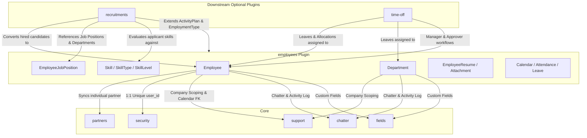
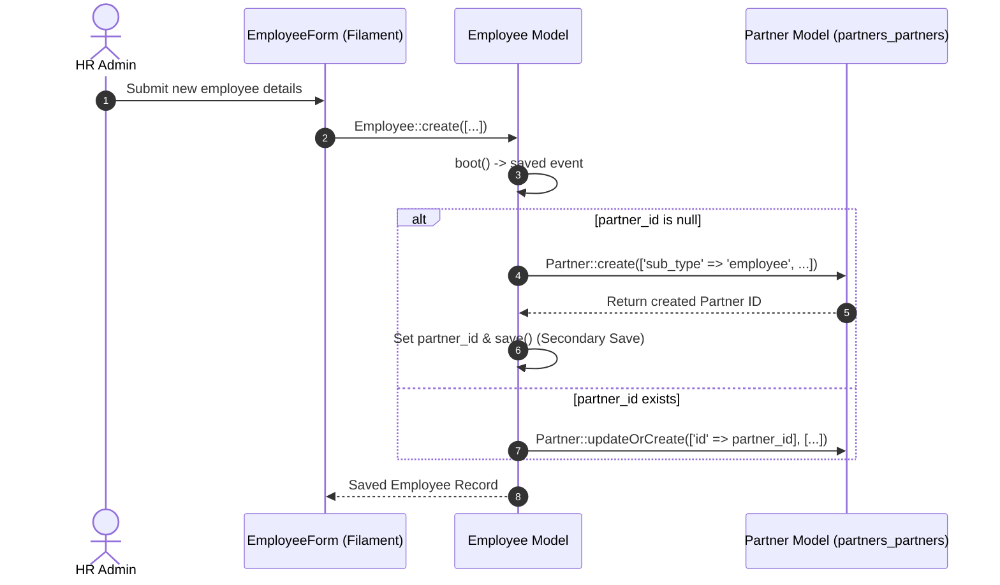
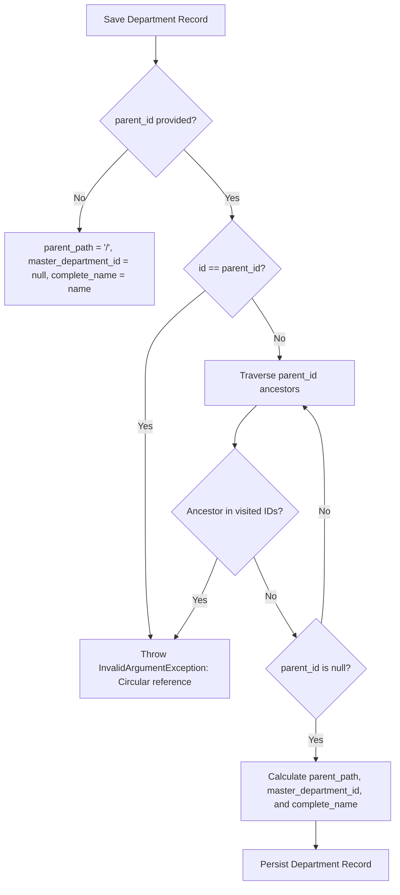

# Plugin: Employees (`employees`)

## Status
[VERIFIED]
Active Optional Module. Registered in `bootstrap/providers.php:41` as `Webkul\Employee\EmployeeServiceProvider::class`.

## Core/Optional
[VERIFIED]
**Optional Plugin**. Configured as an optional domain module without calling `$package->isCore()` (`plugins/webkul/employees/src/EmployeeServiceProvider.php:18-56`). Execution and Filament UI contribution are gated by runtime installation verification via `Package::isPluginInstalled('employees')` (`plugins/webkul/employees/src/EmployeePlugin.php:23`).

## Enabled/Disabled
[VERIFIED]
**Conditionally Enabled (Database-Gated)**. `EmployeeServiceProvider` registers package capabilities, but Filament admin panel resources, pages, and clusters are discovered and registered only when `Package::isPluginInstalled('employees')` returns true (`plugins/webkul/employees/src/EmployeePlugin.php:23-47`).

## Purpose
[VERIFIED]
The `employees` module manages human capital, organizational structures, employee master records, skill grading matrices, and career timelines for Aureus ERP. It acts as the central workforce registry referenced across recruitment, leave management, time tracking, project assignment, and user access domains:

1. **Employee Master Directory (`Employee`)**:
   - Manages comprehensive personal, employment, and contact records (`employees_employees`).
   - Maintains a strict 1-to-1 unique mapping to system users (`user_id` mapped uniquely via `employees_employees_user_id_unique` from migration `2025_08_20_082638_add_unique_user_id_to_employees_employees_table.php`).
   - Automates bi-directional synchronization with the Core `partners_partners` table (`account_type = individual`, `sub_type = employee`) on model creation and updates via `Employee::boot()` (`plugins/webkul/employees/src/Models/Employee.php:244-304`).
   - Supports self-referencing hierarchical relationships for direct management (`parent_id`) and mentorship/coaching (`coach_id`).
   - Tracks operational supervisor designations: leave approval manager (`leave_manager_id`) and attendance manager (`attendance_manager_id`).

2. **Hierarchical Department Tree (`Department`)**:
   - Organizes the workforce into multi-tier organizational units (`employees_departments`).
   - Implements recursive path materialized hierarchy tracking (`parent_path`), top-level root department resolution (`master_department_id`), and auto-generated slash-delimited breadcrumb names (`complete_name`) (`plugins/webkul/employees/src/Models/Department.php:140-181`).
   - Enforces circular reference prevention on create and update via `validateNoRecursion()`, throwing `InvalidArgumentException` if a loop is detected (`plugins/webkul/employees/src/Models/Department.php:109-138`).
   - Dynamically renders an organizational hierarchy tree in the Filament infolist view with custom indentation, colors, manager names, and active member counts (`plugins/webkul/employees/src/Filament/Resources/DepartmentResource/Schemas/DepartmentInfolist.php:56-150`).

3. **Job Positions & Recruitment Targets (`EmployeeJobPosition`)**:
   - Defines position classifications, job requirements, descriptions, and expected headcount targets (`employees_job_positions`).
   - Implements drag-and-drop sort ordering via `spatie/eloquent-sortable` (`sort`).
   - Serves as the foundation for downstream talent acquisition and hiring pipelines in `recruitments`.

4. **Skill Taxonomy & Multi-Level Grading Matrix (`SkillType`, `Skill`, `SkillLevel`, `EmployeeSkill`, `JobPositionSkill`)**:
   - Implements a two-tiered skill classification hierarchy: `SkillType` (e.g., Programming, Languages, Soft Skills) categorizes individual `Skill` records and defines ordered proficiency scales (`SkillLevel` with percentage `level` attributes).
   - Maps concrete employee competencies and proficiency levels in `employees_employee_skills`, rendered as dynamic colored progress bars (`ProgressBarEntry`) across infolists and report views.
   - Maps required job position skills via junction table `job_position_skills`.

5. **Career Resume Timeline & Attachment Management (`EmployeeResume`, `EmployeeResumeLineType`, `EmployeeResumeAttachment`)**:
   - Captures chronological employee career histories, qualifications, and certifications categorized by `EmployeeResumeLineType` (`employees_employee_resumes`).
   - Manages physical file attachments (e.g., CVs, certificates, diplomas) via `EmployeeResumeAttachment` (`employees_employee_resume_attachments`).
   - Implements model-level upload constraints (`MAX_UPLOAD_SIZE = 10240` KB, strict MIME whitelist) and automatic disk cleanup on attachment deletion (`plugins/webkul/employees/src/Models/EmployeeResumeAttachment.php:22-100`).

6. **Work Locations, Departure Reasons, Categories & Employment Types**:
   - Manages physical and remote work locations (`WorkLocation` on `employees_work_locations`).
   - Tracks structured departure codes and reasons (`DepartureReason` on `employees_departure_reasons`).
   - Organizes employees using taggable color badges (`EmployeeCategory` on `employees_categories` linked via `employees_employee_categories`).
   - Defines formal contract classifications (`EmploymentType` on `employees_employment_types`).

7. **Working Schedule / Shift Calendar Subclassing (`Calendar`, `CalendarAttendance`, `CalendarLeave`)**:
   - Subclasses universal working schedule models from the `support` module (`Webkul\Support\Models\Calendar`, `CalendarAttendance`, `CalendarLeave`) to assign standard working hours, two-week rotas, and flexible schedules to employees (`employees_employees.calendar_id`).

## Service Provider
[VERIFIED]
- **Class**: `Webkul\Employee\EmployeeServiceProvider` (`plugins/webkul/employees/src/EmployeeServiceProvider.php:14`)
- **Inheritance**: Extends `Webkul\PluginManager\PackageServiceProvider`
- **Registration & Configuration**:
  - `configureCustomPackage(Package $package)`:
    - Sets package name to `employees` (`EmployeeServiceProvider::$name = 'employees'`).
    - Registers translation namespace (`hasTranslations()`).
    - Registers 19 database migrations (`hasMigrations([...])`) and executes them (`runsMigrations()`):
      1. `2024_12_11_045350_create_employees_work_locations_table`
      2. `2024_12_11_051916_create_employees_departments_table`
      3. `2024_12_11_054555_create_employees_categories_table`
      4. `2024_12_11_073130_create_employees_employment_types_table`
      5. `2024_12_11_075004_create_employees_skill_types_table`
      6. `2024_12_11_075011_create_employees_skill_levels_table`
      7. `2024_12_11_075017_create_employees_skills_table`
      8. `2024_12_11_081046_create_employees_job_positions_table`
      9. `2024_12_11_120605_create_employees_departure_reasons_table`
      10. `2024_12_12_063353_create_employees_employees_table`
      11. `2024_12_12_063354_create_employees_employee_skills_table`
      12. `2024_12_12_140840_create_employees_employee_categories_table`
      13. `2024_12_16_065746_create_employees_employee_resume_line_types_table`
      14. `2024_12_16_070029_create_employees_employee_resumes_table`
      15. `2025_01_08_104443_add_manager_id_to_employees_departments_table`
      16. `2025_01_15_045708_create_job_position_skills_table`
      17_ `2025_01_24_052852_add_department_id_to_activity_plans_table`
      18. `2025_08_20_082638_add_unique_user_id_to_employees_employees_table`
      19. `2026_08_09_000000_create_employees_employee_resume_attachments_table`
    - Registers database seeder: `Webkul\Employee\Database\Seeders\DatabaseSeeder` (`hasSeeder(...)`).
    - Configures install command: runs migrations and seeders (`hasInstallCommand(...)`).
    - Configures uninstall command: purges chatter audit logs for `[Department::class, Employee::class]` via `ChatterCleanupService::purgeForModels(...)` (`hasUninstallCommand(...)`).
    - Sets package icon to `employees` (`icon('employees')`).
  - `packageRegistered()`:
    - Registers `EmployeePlugin::make()` with the Filament Panel builder via `Panel::configureUsing()`.
  - `packageBooted()`:
    - Empty implementation (`//`).

## Filament Plugin Class
[VERIFIED]
- **Class**: `Webkul\Employee\EmployeePlugin` (`plugins/webkul/employees/src/EmployeePlugin.php:9`)
- **Implements**: `Filament\Contracts\Plugin`
- **Plugin ID**: `employees` (`getId(): string`)
- **Panel Registration Logic**:
  - Checks if plugin is installed in database via `Package::isPluginInstalled($this->getId())`; returns early if false.
  - When panel ID is `'admin'`, discovers:
    - Resources: `plugins/webkul/employees/src/Filament/Resources`
    - Pages: `plugins/webkul/employees/src/Filament/Pages`
    - Clusters: `plugins/webkul/employees/src/Filament/Clusters`
    - Widgets: `plugins/webkul/employees/src/Filament/Widgets`

## Composer Dependencies
[VERIFIED]
Defined in `plugins/webkul/employees/composer.json`:
- **Package Name**: `webkul/employees`
- **Description**: `Employees management`
- **Autoload PSR-4**:
  - `Webkul\Employee\`: `src/`
  - `Webkul\Employee\Database\Factories\`: `database/factories/`
  - `Webkul\Employee\Database\Seeders\`: `database/seeders/`
- **Autoload-Dev PSR-4**:
  - `Webkul\Employee\Tests\`: `tests/`
- **Laravel Package Discovery**: Registers `Webkul\Employee\EmployeeServiceProvider`

## Runtime Plugin Dependencies
[VERIFIED]
**None (`—`)**. `EmployeeServiceProvider` does not invoke `Package::hasDependencies([...])`. It is a foundational optional plugin with no prerequisite optional modules.

## Directory Structure
[VERIFIED]
```text
plugins/webkul/employees/
├── composer.json
├── config/
│   └── filament-shield.php
├── database/
│   ├── factories/
│   │   ├── CalendarAttendanceFactory.php
│   │   ├── CalendarFactory.php
│   │   ├── CalendarLeaveFactory.php
│   │   ├── DepartmentFactory.php
│   │   ├── DepartureReasonFactory.php
│   │   ├── EmployeeCategoryFactory.php
│   │   ├── EmployeeEmployeeCategoryFactory.php
│   │   ├── EmployeeFactory.php
│   │   ├── EmployeeJobPositionFactory.php
│   │   ├── EmployeeResumeAttachmentFactory.php
│   │   ├── EmployeeResumeFactory.php
│   │   ├── EmployeeResumeLineTypeFactory.php
│   │   ├── EmployeeSkillFactory.php
│   │   ├── EmploymentTypeFactory.php
│   │   ├── JobPositionSkillFactory.php
│   │   ├── SkillFactory.php
│   │   ├── SkillLevelFactory.php
│   │   ├── SkillTypeFactory.php
│   │   └── WorkLocationFactory.php
│   ├── migrations/
│   │   ├── 2024_12_11_045350_create_employees_work_locations_table.php
│   │   ├── 2024_12_11_051916_create_employees_departments_table.php
│   │   ├── 2024_12_11_054555_create_employees_categories_table.php
│   │   ├── 2024_12_11_073130_create_employees_employment_types_table.php
│   │   ├── 2024_12_11_075004_create_employees_skill_types_table.php
│   │   ├── 2024_12_11_075011_create_employees_skill_levels_table.php
│   │   ├── 2024_12_11_075017_create_employees_skills_table.php
│   │   ├── 2024_12_11_081046_create_employees_job_positions_table.php
│   │   ├── 2024_12_11_100426_create_employees_calendars_table.php              # [DORMANT / UNREGISTERED]
│   │   ├── 2024_12_11_100435_create_employees_calendar_attendances_table.php  # [DORMANT / UNREGISTERED]
│   │   ├── 2024_12_11_100442_create_employees_calendar_leaves_table.php       # [DORMANT / UNREGISTERED]
│   │   ├── 2024_12_11_120605_create_employees_departure_reasons_table.php
│   │   ├── 2024_12_12_063353_create_employees_employees_table.php
│   │   ├── 2024_12_12_063354_create_employees_employee_skills_table.php
│   │   ├── 2024_12_12_140840_create_employees_employee_categories_table.php
│   │   ├── 2024_12_16_065746_create_employees_employee_resume_line_types_table.php
│   │   ├── 2024_12_16_070029_create_employees_employee_resumes_table.php
│   │   ├── 2025_01_08_104443_add_manager_id_to_employees_departments_table.php
│   │   ├── 2025_01_15_045708_create_job_position_skills_table.php
│   │   ├── 2025_01_24_052852_add_department_id_to_activity_plans_table.php
│   │   ├── 2025_08_20_082638_add_unique_user_id_to_employees_employees_table.php
│   │   └── 2026_08_09_000000_create_employees_employee_resume_attachments_table.php
│   └── seeders/
│       ├── ActivityPlanTemplateSeeder.php
│       ├── CalendarAttendanceSeeder.php
│       ├── CalendarSeeder.php
│       ├── DatabaseSeeder.php
│       ├── DepartmentSeeder.php
│       ├── DepartureReasonSeeder.php
│       ├── EmployeeCategorySeeder.php
│       ├── EmployeeJobPositionSeeder.php
│       ├── EmployeeSeeder.php
│       ├── EmploymentTypeSeeder.php
│       ├── SkillLevelSeeder.php
│       ├── SkillSeeder.php
│       ├── SkillTypeSeeder.php
│       └── WorkLocationSeeder.php
├── resources/
│   └── lang/
│       ├── ar/
│       ├── en/
│       ├── es/
│       ├── fr/
│       └── pt_BR/
├── src/
│   ├── EmployeePlugin.php
│   ├── EmployeeServiceProvider.php
│   ├── Enums/
│   │   ├── CalendarDisplayType.php
│   │   ├── Colors.php
│   │   ├── DayOfWeek.php
│   │   ├── DayPeriod.php
│   │   ├── DistanceUnit.php
│   │   ├── Gender.php
│   │   ├── MaritalStatus.php
│   │   ├── ResumeDisplayType.php
│   │   ├── WeekType.php
│   │   └── WorkLocation.php
│   ├── Filament/
│   │   ├── Clusters/
│   │   │   ├── Configurations.php
│   │   │   ├── Configurations/
│   │   │   │   └── Resources/
│   │   │   │       ├── ActivityPlanResource.php
│   │   │   │       ├── ActivityPlanResource/
│   │   │   │       ├── DepartureReasonResource.php
│   │   │   │       ├── DepartureReasonResource/
│   │   │   │       ├── EmployeeCategoryResource.php
│   │   │   │       ├── EmployeeCategoryResource/
│   │   │   │       ├── EmploymentTypeResource.php
│   │   │   │       ├── EmploymentTypeResource/
│   │   │   │       ├── JobPositionResource.php
│   │   │   │       ├── JobPositionResource/
│   │   │   │       ├── SkillTypeResource.php
│   │   │   │       ├── SkillTypeResource/
│   │   │   │       ├── WorkLocationResource.php
│   │   │   │       └── WorkLocationResource/
│   │   │   ├── Reportings.php
│   │   │   └── Reportings/
│   │   │       └── Resources/
│   │   │           ├── EmployeeSkillResource.php
│   │   │           └── EmployeeSkillResource/
│   │   └── Resources/
│   │       ├── DepartmentResource.php
│   │       ├── DepartmentResource/
│   │       │   ├── Pages/
│   │       │   ├── Schemas/
│   │       │   └── Tables/
│   │       ├── EmployeeResource.php
│   │       └── EmployeeResource/
│   │           ├── Pages/
│   │           ├── RelationManagers/
│   │           ├── Schemas/
│   │           └── Tables/
│   ├── Http/
│   │   └── Resources/
│   │       └── V1/
│   │           ├── DepartmentResource.php
│   │           ├── DepartureReasonResource.php
│   │           ├── EmployeeResource.php
│   │           └── WorkLocationResource.php
│   ├── Models/
│   │   ├── ActivityPlan.php
│   │   ├── Calendar.php
│   │   ├── CalendarAttendance.php
│   │   ├── CalendarLeave.php
│   │   ├── Department.php
│   │   ├── DepartureReason.php
│   │   ├── Employee.php
│   │   ├── EmployeeCategory.php
│   │   ├── EmployeeEmployeeCategory.php
│   │   ├── EmployeeJobPosition.php
│   │   ├── EmployeeResume.php
│   │   ├── EmployeeResumeAttachment.php
│   │   ├── EmployeeResumeLineType.php
│   │   ├── EmployeeSkill.php
│   │   ├── EmploymentType.php
│   │   ├── JobPositionSkill.php
│   │   ├── Skill.php
│   │   ├── SkillLevel.php
│   │   ├── SkillType.php
│   │   └── WorkLocation.php
│   ├── Policies/
│   │   ├── ActivityPlanPolicy.php
│   │   ├── DepartmentPolicy.php
│   │   ├── DepartureReasonPolicy.php
│   │   ├── EmployeeCategoryPolicy.php
│   │   ├── EmployeeJobPositionPolicy.php
│   │   ├── EmployeePolicy.php
│   │   ├── EmployeeSkillPolicy.php
│   │   ├── EmploymentTypePolicy.php
│   │   ├── SkillTypePolicy.php
│   │   └── WorkLocationPolicy.php
│   └── Traits/
│       └── Resources/
│           ├── Department/
│           │   └── DepartmentEmployee.php
│           └── Employee/
│               ├── EmployeeResumeRelation.php
│               └── EmployeeSkillRelation.php
└── tests/
    ├── Feature/
    │   ├── Filament/
    │   │   ├── ManageResumeTest.php
    │   │   └── ResumeAttachmentUploadTest.php
    │   └── Models/
    │       ├── EmployeeResumeAttachmentTest.php
    │       └── EmployeeResumeTest.php
    └── Helpers/
        └── EmployeeHelper.php
```

## Models
[VERIFIED]
The `employees` module declares 20 Eloquent model classes:

| Model Class | Physical Database Table | Traits | Company Scoped | Key Relationships |
| :--- | :--- | :--- | :--- | :--- |
| `Employee` | `employees_employees` | `BelongsToCompany`, `HasChatter`, `HasCustomFields`, `HasFactory`, `HasLogActivity`, `SoftDeletes` | Yes (`company_id`) | `belongsTo(User, 'user_id')`, `belongsTo(Department, 'department_id')`, `belongsTo(EmployeeJobPosition, 'job_id')`, `belongsTo(Partner, 'partner_id')`, `belongsTo(Calendar, 'calendar_id')`, `belongsTo(WorkLocation, 'work_location_id')`, `belongsTo(Employee, 'parent_id')`, `belongsTo(Employee, 'coach_id')`, `belongsTo(User, 'leave_manager_id')`, `belongsTo(User, 'attendance_manager_id')`, `belongsTo(DepartureReason, 'departure_reason_id')`, `belongsTo(EmploymentType, 'employee_type')`, `belongsToMany(EmployeeCategory)`, `hasMany(EmployeeSkill)`, `hasMany(EmployeeResume)`. Lifecycle: provisions shadow partner (`sub_type = 'employee'`) omitting `parent_id`. |
| `Department` | `employees_departments` | `BelongsToCompany`, `HasChatter`, `HasCustomFields`, `HasFactory`, `HasLogActivity`, `SoftDeletes` | Yes (`company_id`) | `belongsTo(User, 'creator_id')`, `belongsTo(Department, 'parent_id')`, `belongsTo(Department, 'master_department_id')`, `belongsTo(Employee, 'manager_id')`, `belongsTo(Company, 'company_id')`, `hasMany(EmployeeJobPosition)`, `hasMany(Employee)` |
| `EmployeeJobPosition` | `employees_job_positions` | `BelongsToCompany`, `HasCustomFields`, `HasFactory`, `SoftDeletes`, `SortableTrait` | Yes (`company_id`) | `belongsTo(Department, 'department_id')`, `belongsTo(EmploymentType, 'employment_type_id')`, `belongsTo(Company, 'company_id')`, `belongsTo(User, 'creator_id')`, `hasMany(Employee, 'job_id')` |
| `WorkLocation` | `employees_work_locations` | `BelongsToCompany`, `HasCustomFields`, `HasFactory`, `SoftDeletes` | Yes (`company_id`) | `belongsTo(Company, 'company_id')`, `belongsTo(User, 'creator_id')` |
| `SkillType` | `employees_skill_types` | `HasCustomFields`, `HasFactory`, `SoftDeletes` | No | `hasMany(SkillLevel, 'skill_type_id')`, `hasMany(Skill, 'skill_type_id')`, `belongsTo(User, 'creator_id')` |
| `SkillLevel` | `employees_skill_levels` | `HasFactory`, `SoftDeletes` | No | `belongsTo(SkillType, 'skill_type_id')`, `hasMany(EmployeeSkill, 'skill_level_id')` |
| `Skill` | `employees_skills` | `HasCustomFields`, `HasFactory`, `SoftDeletes`, `SortableTrait` | No | `belongsTo(SkillType, 'skill_type_id')`, `hasMany(SkillLevel)`, `hasMany(EmployeeSkill, 'skill_id')`, `belongsTo(User, 'creator_id')` |
| `EmployeeSkill` | `employees_employee_skills` | `HasFactory`, `SoftDeletes` | No | `belongsTo(Employee, 'employee_id')`, `belongsTo(Skill, 'skill_id')`, `belongsTo(SkillLevel, 'skill_level_id')`, `belongsTo(SkillType, 'skill_type_id')`, `belongsTo(User, 'creator_id')` |
| `JobPositionSkill` | `job_position_skills` | None | No | `belongsTo(EmployeeJobPosition, 'job_position_id')`, `belongsTo(EmployeeSkill, 'skill_id')` |
| `EmployeeResume` | `employees_employee_resumes` | `HasFactory` | No | `belongsTo(Employee, 'employee_id')`, `belongsTo(EmployeeResumeLineType, 'employee_resume_line_type_id')`, `belongsTo(User, 'creator_id')`, `hasMany(EmployeeResumeAttachment, 'employee_resume_id')` |
| `EmployeeResumeLineType` | `employees_employee_resume_line_types` | `HasFactory`, `SortableTrait` | No | `hasMany(EmployeeResume, 'employee_resume_line_type_id')` |
| `EmployeeResumeAttachment` | `employees_employee_resume_attachments` | `HasFactory` | No | `belongsTo(EmployeeResume, 'employee_resume_id')`, `belongsTo(User, 'creator_id')` |
| `DepartureReason` | `employees_departure_reasons` | `HasCustomFields`, `HasFactory`, `SoftDeletes`, `SortableTrait` | No | `belongsTo(User, 'creator_id')`, `hasMany(Employee, 'departure_reason_id')` |
| `EmployeeCategory` | `employees_categories` | `HasCustomFields`, `HasFactory` | No | `belongsTo(User, 'creator_id')` |
| `EmployeeEmployeeCategory` | `employees_employee_categories` | `HasFactory` | No | `belongsTo(Employee, 'employee_id')`, `belongsTo(EmployeeCategory, 'category_id')` |
| `EmploymentType` | `employees_employment_types` | `HasCustomFields`, `HasFactory`, `SortableTrait` | No | `belongsTo(Country, 'country_id')`, `belongsTo(User, 'creator_id')` |
| `ActivityPlan` | `activity_plans` | Inherited from `Webkul\Support\Models\ActivityPlan` | Yes (via Core) | `belongsTo(Department, 'department_id')` (added to Support base model) |
| `Calendar` | `calendars` | Inherited from `Webkul\Support\Models\Calendar` | Yes (via Core) | Empty subclass wrapper extending Core Support Calendar |
| `CalendarAttendance` | `calendar_attendances` | Inherited from `Webkul\Support\Models\CalendarAttendance` | No (via Core) | Empty subclass wrapper extending Core Support CalendarAttendance |
| `CalendarLeave` | `calendar_leaves` | Inherited from `Webkul\Support\Models\CalendarLeave` | Yes (via Core) | Empty subclass wrapper extending Core Support CalendarLeave |

## Database
[VERIFIED]
### Migration Index
The plugin defines 22 migration files in `database/migrations/`, of which **19 are active and registered** in `EmployeeServiceProvider::$hasMigrations`:

| Migration File | Physical Table / Alteration | Purpose | Registration Status |
| :--- | :--- | :--- | :--- |
| `2024_12_11_045350_create_employees_work_locations_table.php` | `employees_work_locations` | Physical & remote work location registry | Registered |
| `2024_12_11_051916_create_employees_departments_table.php` | `employees_departments` | Organizational hierarchy structure | Registered |
| `2024_12_11_054555_create_employees_categories_table.php` | `employees_categories` | Employee category/tag master data | Registered |
| `2024_12_11_073130_create_employees_employment_types_table.php` | `employees_employment_types` | Employment contract classifications | Registered |
| `2024_12_11_075004_create_employees_skill_types_table.php` | `employees_skill_types` | Skill classification taxonomies | Registered |
| `2024_12_11_075011_create_employees_skill_levels_table.php` | `employees_skill_levels` | Proficiency level grading scale | Registered |
| `2024_12_11_075017_create_employees_skills_table.php` | `employees_skills` | Specific skill definitions | Registered |
| `2024_12_11_081046_create_employees_job_positions_table.php` | `employees_job_positions` | Job position requirements & targets | Registered |
| `2024_12_11_100426_create_employees_calendars_table.php` | `employees_calendars` | Working schedule templates (Initial 2024) | **DORMANT** (Promoted to Core `support`) |
| `2024_12_11_100435_create_employees_calendar_attendances_table.php` | `employees_calendar_attendances` | Schedule shift hours (Initial 2024) | **DORMANT** (Promoted to Core `support`) |
| `2024_12_11_100442_create_employees_calendar_leaves_table.php` | `employees_calendar_leaves` | Schedule public leaves (Initial 2024) | **DORMANT** (Promoted to Core `support`) |
| `2024_12_11_120605_create_employees_departure_reasons_table.php` | `employees_departure_reasons` | Structured departure reason codes | Registered |
| `2024_12_12_063353_create_employees_employees_table.php` | `employees_employees` | Primary employee master profile table | Registered |
| `2024_12_12_063354_create_employees_employee_skills_table.php` | `employees_employee_skills` | Employee-to-skill assignment matrix | Registered |
| `2024_12_12_140840_create_employees_employee_categories_table.php` | `employees_employee_categories` | Employee-to-category junction table | Registered |
| `2024_12_16_065746_create_employees_employee_resume_line_types_table.php` | `employees_employee_resume_line_types` | Resume line classification types | Registered |
| `2024_12_16_070029_create_employees_employee_resumes_table.php` | `employees_employee_resumes` | Employee career experience timeline | Registered |
| `2025_01_08_104443_add_manager_id_to_employees_departments_table.php` | `employees_departments` | Adds `manager_id` foreign key | Registered |
| `2025_01_15_045708_create_job_position_skills_table.php` | `job_position_skills` | Job position required skill junction | Registered |
| `2025_01_24_052852_add_department_id_to_activity_plans_table.php` | `activity_plans` | Adds `department_id` to Core activity plans | Registered |
| `2025_08_20_082638_add_unique_user_id_to_employees_employees_table.php` | `employees_employees` | Adds unique index on `user_id` (1:1 constraint) | Registered |
| `2026_08_09_000000_create_employees_employee_resume_attachments_table.php` | `employees_employee_resume_attachments` | Uploaded career attachments & metadata | Registered |

---

### Calendar Architecture & Schema Elevation Resolution
[VERIFIED]
A critical architectural evolution exists regarding the working schedule calendar tables:

1. **Initial Implementation (December 2024)**: Working schedule shift templates were originally authored inside the `employees` plugin under table names `employees_calendars`, `employees_calendar_attendances`, and `employees_calendar_leaves` (`plugins/webkul/employees/database/migrations/2024_12_11_100426_create_employees_calendars_table.php`).
2. **Elevation to Core Infrastructure (April 2026)**: In April 2026, working schedule calendars were recognized as an enterprise-wide foundational resource required across other modules (such as `time-off`, `purchases`, and `manufacturing`). Working schedules were elevated to the Core `support` plugin via migration `2026_04_02_000001_create_calendars_table.php` (`plugins/webkul/support/database/migrations/2026_04_02_000001_create_calendars_table.php`).
3. **Migration Logic**: The `support` migration checks whether legacy `employees_calendars` tables exist:
   ```php
   if (Schema::hasTable('employees_calendars') && ! Schema::hasTable('calendars')) {
       Schema::rename('employees_calendars', 'calendars');
   } elseif (! Schema::hasTable('calendars')) {
       Schema::create('calendars', ...);
   }
   ```
4. **Current Status in `employees`**:
   - `EmployeeServiceProvider` removed the three 2024 calendar migrations from its `$package->hasMigrations([...])` registration list. The physical migration files remain in `database/migrations/` but are **dormant and never executed**.
   - `Webkul\Employee\Models\Calendar`, `CalendarAttendance`, and `CalendarLeave` were refactored into empty subclass wrappers extending `Webkul\Support\Models\Calendar`, `CalendarAttendance`, and `CalendarLeave`.
   - **Functional Purpose**: `calendars` defines working schedule shift templates (standard daily hours, weekday morning/afternoon attendance periods, two-week rotas, flexible hours, and public holidays/calendar leaves) assigned to employees (`employees_employees.calendar_id` → `calendars.id`) and leave requests (`time_off_leaves.calendar_id` → `calendars.id`). It is not a duplication; `support` is the canonical owner of the physical tables.

---

### Database Schemas
[VERIFIED]
#### 1. `employees_employees`
Primary employee master repository.
- `id`: unsigned bigint, primary key, auto-increment
- `company_id`: unsigned bigint, nullable, foreign key → `companies.id` (onDelete: set null)
- `user_id`: unsigned bigint, nullable, unique foreign key → `users.id` (onDelete: set null)
- `creator_id`: unsigned bigint, nullable, foreign key → `users.id` (onDelete: set null)
- `calendar_id`: unsigned bigint, nullable, foreign key → `calendars.id` (onDelete: set null)
- `department_id`: unsigned bigint, nullable, foreign key → `employees_departments.id` (onDelete: set null)
- `job_id`: unsigned bigint, nullable, foreign key → `employees_job_positions.id` (onDelete: set null)
- `attendance_manager_id`: unsigned bigint, nullable, foreign key → `users.id` (onDelete: set null)
- `partner_id`: unsigned bigint, nullable, foreign key → `partners_partners.id` (onDelete: set null)
- `work_location_id`: unsigned bigint, nullable, foreign key → `employees_work_locations.id` (onDelete: set null)
- `parent_id`: unsigned bigint, nullable, foreign key → `employees_employees.id` (onDelete: set null) [Manager]
- `coach_id`: unsigned bigint, nullable, foreign key → `employees_employees.id` (onDelete: set null) [Coach/Mentor]
- `country_id`: unsigned bigint, nullable, foreign key → `countries.id` (onDelete: set null)
- `state_id`: unsigned bigint, nullable, foreign key → `states.id` (onDelete: set null)
- `country_of_birth`: unsigned bigint, nullable, foreign key → `countries.id` (onDelete: set null)
- `bank_account_id`: unsigned bigint, nullable, foreign key → `partners_bank_accounts.id` (onDelete: set null)
- `departure_reason_id`: unsigned bigint, nullable, foreign key → `employees_departure_reasons.id` (onDelete: set null)
- `employee_type`: unsigned bigint, nullable, foreign key → `employees_employment_types.id` (onDelete: set null)
- `leave_manager_id`: unsigned bigint, nullable, foreign key → `users.id` (onDelete: set null)
- `name`: string, nullable
- `job_title`: string, nullable
- `work_phone`: string, nullable
- `mobile_phone`: string, nullable
- `color`: string, nullable
- `work_email`: string, nullable
- `children`: integer, nullable
- `distance_home_work`: float, nullable
- `km_home_work`: float, nullable
- `distance_home_work_unit`: string, nullable (default: 'kilometer')
- `private_street1`: string, nullable
- `private_street2`: string, nullable
- `private_city`: string, nullable
- `private_zip`: string, nullable
- `private_state_id`: unsigned bigint, nullable, foreign key → `states.id` (onDelete: set null)
- `private_country_id`: unsigned bigint, nullable, foreign key → `countries.id` (onDelete: set null)
- `private_phone`: string, nullable
- `private_email`: string, nullable
- `lang`: string, nullable
- `gender`: string, nullable ('male', 'female', 'other')
- `birthday`: date, nullable
- `marital`: string, nullable ('single', 'married', 'divorced', 'widowed')
- `spouse_complete_name`: string, nullable
- `spouse_birthdate`: date, nullable
- `place_of_birth`: string, nullable
- `ssnid`: string, nullable
- `sinid`: string, nullable
- `identification_id`: string, nullable
- `passport_id`: string, nullable
- `permit_no`: string, nullable
- `visa_no`: string, nullable
- `certificate`: string, nullable
- `study_field`: string, nullable
- `study_school`: string, nullable
- `emergency_contact`: string, nullable
- `emergency_phone`: string, nullable
- `barcode`: string, nullable
- `pin`: string, nullable
- `private_car_plate`: string, nullable
- `time_zone`: string, nullable
- `work_permit`: string, nullable
- `visa_expire`: date, nullable
- `work_permit_expiration_date`: date, nullable
- `departure_date`: date, nullable
- `departure_description`: text, nullable
- `additional_note`: text, nullable
- `notes`: text, nullable
- `is_active`: boolean (default: true)
- `is_flexible`: boolean (default: false)
- `is_fully_flexible`: boolean (default: false)
- `work_permit_scheduled_activity`: boolean (default: false)
- `deleted_at`: timestamp, nullable (soft deletes)
- `created_at`, `updated_at`: timestamps

#### 2. `employees_departments`
Organizational departmental tree.
- `id`: unsigned bigint, primary key, auto-increment
- `name`: string
- `color`: string, nullable
- `complete_name`: string, nullable
- `parent_path`: string, nullable
- `parent_id`: unsigned bigint, nullable, foreign key → `employees_departments.id` (onDelete: set null)
- `master_department_id`: unsigned bigint, nullable, foreign key → `employees_departments.id` (onDelete: set null)
- `manager_id`: unsigned bigint, nullable, foreign key → `employees_employees.id` (onDelete: set null)
- `company_id`: unsigned bigint, nullable, foreign key → `companies.id` (onDelete: set null)
- `creator_id`: unsigned bigint, nullable, foreign key → `users.id` (onDelete: set null)
- `deleted_at`: timestamp, nullable
- `created_at`, `updated_at`: timestamps

#### 3. `employees_job_positions`
Job role and headcount tracking.
- `id`: unsigned bigint, primary key, auto-increment
- `name`: string
- `sort`: integer, nullable
- `expected_employees`: integer, nullable
- `no_of_employee`: integer, nullable
- `no_of_recruitment`: integer, nullable
- `description`: text, nullable
- `requirements`: text, nullable
- `is_active`: boolean (default: true)
- `department_id`: unsigned bigint, nullable, foreign key → `employees_departments.id` (onDelete: set null)
- `employment_type_id`: unsigned bigint, nullable, foreign key → `employees_employment_types.id` (onDelete: set null)
- `company_id`: unsigned bigint, nullable, foreign key → `companies.id` (onDelete: set null)
- `creator_id`: unsigned bigint, nullable, foreign key → `users.id` (onDelete: set null)
- `recruiter_id`: unsigned bigint, nullable, foreign key → `users.id` (onDelete: set null)
- `deleted_at`: timestamp, nullable
- `created_at`, `updated_at`: timestamps

#### 4. `employees_work_locations`
Workplace locations.
- `id`: unsigned bigint, primary key, auto-increment
- `name`: string
- `location_type`: string ('home', 'office', 'other')
- `location_number`: string, nullable
- `is_active`: boolean (default: true)
- `company_id`: unsigned bigint, nullable, foreign key → `companies.id` (onDelete: set null)
- `creator_id`: unsigned bigint, nullable, foreign key → `users.id` (onDelete: set null)
- `deleted_at`: timestamp, nullable
- `created_at`, `updated_at`: timestamps

#### 5. `employees_skill_types`
Skill categories.
- `id`: unsigned bigint, primary key, auto-increment
- `name`: string
- `color`: string, nullable
- `is_active`: boolean (default: true)
- `creator_id`: unsigned bigint, nullable, foreign key → `users.id` (onDelete: set null)
- `deleted_at`: timestamp, nullable
- `created_at`, `updated_at`: timestamps

#### 6. `employees_skill_levels`
Proficiency levels bound to a skill type.
- `id`: unsigned bigint, primary key, auto-increment
- `name`: string
- `level`: integer (percentage score: 0–100)
- `default_level`: boolean (default: false)
- `skill_type_id`: unsigned bigint, foreign key → `employees_skill_types.id` (onDelete: cascade)
- `deleted_at`: timestamp, nullable
- `created_at`, `updated_at`: timestamps

#### 7. `employees_skills`
Individual skills belonging to a skill type.
- `id`: unsigned bigint, primary key, auto-increment
- `name`: string
- `sort`: integer, nullable
- `skill_type_id`: unsigned bigint, foreign key → `employees_skill_types.id` (onDelete: cascade)
- `creator_id`: unsigned bigint, nullable, foreign key → `users.id` (onDelete: set null)
- `deleted_at`: timestamp, nullable
- `created_at`, `updated_at`: timestamps

#### 8. `employees_employee_skills`
Employee competency assignments.
- `id`: unsigned bigint, primary key, auto-increment
- `employee_id`: unsigned bigint, foreign key → `employees_employees.id` (onDelete: cascade)
- `skill_id`: unsigned bigint, foreign key → `employees_skills.id` (onDelete: cascade)
- `skill_level_id`: unsigned bigint, foreign key → `employees_skill_levels.id` (onDelete: cascade)
- `skill_type_id`: unsigned bigint, foreign key → `employees_skill_types.id` (onDelete: cascade)
- `creator_id`: unsigned bigint, nullable, foreign key → `users.id` (onDelete: set null)
- `deleted_at`: timestamp, nullable
- `created_at`, `updated_at`: timestamps

#### 9. `job_position_skills`
Required skills per job position.
- `id`: unsigned bigint, primary key, auto-increment
- `job_position_id`: unsigned bigint, foreign key → `employees_job_positions.id` (onDelete: cascade)
- `skill_id`: unsigned bigint, foreign key → `employees_skills.id` (onDelete: cascade)

#### 10. `employees_employee_resumes`
Career experience and education timeline.
- `id`: unsigned bigint, primary key, auto-increment
- `name`: string
- `display_type`: string ('classic')
- `start_date`: date, nullable
- `end_date`: date, nullable
- `description`: text, nullable
- `employee_id`: unsigned bigint, foreign key → `employees_employees.id` (onDelete: cascade)
- `employee_resume_line_type_id`: unsigned bigint, nullable, foreign key → `employees_employee_resume_line_types.id` (onDelete: set null)
- `creator_id`: unsigned bigint, nullable, foreign key → `users.id` (onDelete: set null)
- `created_at`, `updated_at`: timestamps

#### 11. `employees_employee_resume_line_types`
Resume line type classification (e.g., Experience, Education, Internal Certification).
- `id`: unsigned bigint, primary key, auto-increment
- `name`: string
- `sort`: integer, nullable
- `creator_id`: unsigned bigint, nullable, foreign key → `users.id` (onDelete: set null)
- `created_at`, `updated_at`: timestamps

#### 12. `employees_employee_resume_attachments`
Uploaded resume file attachments.
- `id`: unsigned bigint, primary key, auto-increment
- `name`: string, nullable
- `file_path`: string
- `original_file_name`: string
- `mime_type`: string, nullable
- `file_size`: unsigned bigint, nullable (bytes)
- `employee_resume_id`: unsigned bigint, foreign key → `employees_employee_resumes.id` (onDelete: cascade)
- `creator_id`: unsigned bigint, nullable, foreign key → `users.id` (onDelete: set null)
- `created_at`, `updated_at`: timestamps

#### 13. `employees_departure_reasons`
Structured departure classifications.
- `id`: unsigned bigint, primary key, auto-increment
- `name`: string
- `reason_code`: integer, nullable
- `sort`: integer, nullable
- `creator_id`: unsigned bigint, nullable, foreign key → `users.id` (onDelete: set null)
- `deleted_at`: timestamp, nullable
- `created_at`, `updated_at`: timestamps

#### 14. `employees_categories` & `employees_employee_categories`
Employee tags and junction table.
- `employees_categories`: `id`, `name`, `color`, `creator_id` (foreign key → `users.id`), `created_at`, `updated_at`.
- `employees_employee_categories`: `id`, `employee_id` (foreign key → `employees_employees.id`, cascade), `category_id` (foreign key → `employees_categories.id`, cascade).

#### 15. `employees_employment_types`
Employment contract types.
- `id`: unsigned bigint, primary key, auto-increment
- `name`: string
- `code`: string, nullable
- `sort`: integer, nullable
- `country_id`: unsigned bigint, nullable, foreign key → `countries.id` (onDelete: set null)
- `creator_id`: unsigned bigint, nullable, foreign key → `users.id` (onDelete: set null)
- `created_at`, `updated_at`: timestamps

## Filament Resources, Pages, Widgets & Clusters
[VERIFIED]
All UI resources belong to the `NavigationGroup::Employee` navigation group:

### 1. Top-Level Resources
- **`EmployeeResource`** (`plugins/webkul/employees/src/Filament/Resources/EmployeeResource.php`):
  - **Navigation Sort**: 1
  - **Slug**: `employees/employees`
  - **Record Subnavigation Position**: Top (`SubNavigationPosition::Top`)
  - **Subnavigation Items**: `ViewEmployee`, `EditEmployee`, `ManageSkill`, `ManageResume`
  - **Pages**:
    - `ListEmployees` (`/`): Kanban and list view filtering by company, department, active status, manager (`parent_id`), and search tags.
    - `CreateEmployee` (`/create`): Create form.
    - `ViewEmployee` (`/{record}`): Detailed infolist view.
    - `EditEmployee` (`/{record}/edit`): Edit form.
    - `ManageSkill` (`/{record}/skills`): `ManageRelatedRecords` using `EmployeeSkillRelation` trait.
    - `ManageResume` (`/{record}/resumes`): `ManageRelatedRecords` using `EmployeeResumeRelation` trait.
  - **Relation Managers**:
    - `SkillsRelationManager` (`RelationGroup::make('Manage Skills', ...)->icon('heroicon-o-bolt')`)
    - `ResumeRelationManager` (`RelationGroup::make('Manage Resumes', ...)->icon('heroicon-o-clipboard-document-list')`)
  - **Form Structure (`EmployeeForm`)**:
    - Applies `hide_deleted_unless_selected($state)` across relationship fields (department, manager, coach) to support soft-deleted records when editing existing employees while filtering them out of new selections.
    - Header: Avatar image upload (`partner.avatar`), Name, Job Title, Work Contact details (email, phone, mobile), Department, Job Position, Manager (`parent_id`), Coach (`coach_id`), Employee Tags (`categories`).
    - Tab 1: **Work Information**: Location (Company Address, Work Location), Approvers (Leave Manager, Attendance Manager), Schedule (Working Hours Calendar, Timezone), Organization Details (Company, Color).
    - Tab 2: **Private Information**: Private Contact (Street, City, Postal Code, State, Country, Email, Phone, Car Plate, Distance from home to work), Family Status (Marital status, Spouse name/birthdate, Children), Emergency Contact (Name, Phone), Citizenship (Country of birth, Identification No, Passport No, SSN, SIN), Education (Certificate level, Field of study, School), Work Permit (Visa No, Work Permit No, Visa Expiration, Permit Expiration).
    - Tab 3: **Settings**: Employee Type, Attendance & Point of Sale (Badge ID Barcode, PIN code), Additional Notes.
  - **Infolist Structure (`EmployeeInfolist`)**:
    - Header Card: Employee avatar, name, job title, work email (`mailto:` action), mobile (`tel:` action), phone (`tel:` action), department, job position, manager, coach, and color-coded employee tag badges.
    - Tab 1: **Resume**:
      - *Resume Timeline*: Grouped by `EmployeeResumeLineType` (sorted by sort order), sorted descending by start date, formatted as `MM/YYYY — MM/YYYY` (or `MM/YYYY — Present`), showing title, description, and clickable downloadable attachments (`EmployeeResumeAttachment.url`).
      - *Skills Matrix*: Grouped by `SkillType`, showing skill name, skill level badge, and dynamic `ProgressBarEntry` (100% green/success, 50–79% amber/warning, <20% red/danger, default blue/info).
    - Tab 2: **Work Information**: Work address, work location, leave/attendance approver user references, working hours schedule template, timezone, company, and color indicator.
    - Tab 3: **Private Information**: Full private residential address, citizenship, private contact, emergency contact, passport/visa credentials, and education history.
    - Tab 4: **Settings**: Badge barcode and security PIN code.

- **`DepartmentResource`** (`plugins/webkul/employees/src/Filament/Resources/DepartmentResource.php`):
  - **Navigation Sort**: 2
  - **Slug**: `employees/departments`
  - **Record Subnavigation Items**: `ViewDepartment`, `EditDepartment`, `ManageEmployee`
  - **Pages**:
    - `ListDepartments` (`/`): Department table with manager, company, employee count, and parent department.
    - `CreateDepartment` (`/create`): Create form.
    - `ViewDepartment` (`/{record}`): Infolist view with dynamic organizational hierarchy tree renderer.
    - `EditDepartment` (`/{record}/edit`): Edit form.
    - `ManageEmployee` (`/{record}/employees`): `ManageRelatedRecords` using `DepartmentEmployee` trait, embedding the full `EmployeeResource` table scoped to the department.
  - **Dynamic Infolist Tree Renderer (`DepartmentInfolist::buildHierarchyTree`)**:
    - Recursively traverses root-to-leaf department trees.
    - Generates formatted branch connectors (`├──`, `└──`) with custom indentation (`&nbsp;&nbsp;&nbsp;`).
    - Highlights active department name in bold with department color styling.
    - Displays department manager name (` · Manager Name`) and total member count (`(%d members)`).

---

### 2. Clusters
- **`Configurations` Cluster** (`Webkul\Employee\Filament\Clusters\Configurations`):
  - **Navigation Sort**: 4
  - **Slug**: `employees/configurations`
  - **Child Resources**:
    1. `ActivityPlanResource`: Manages onboarding/offboarding activity plan templates linked to departments (`plugins/webkul/employees/src/Filament/Clusters/Configurations/Resources/ActivityPlanResource.php`). Includes `ActivityTemplateRelationManager`.
    2. `DepartureReasonResource`: Manages reason codes for employee departure (`DepartureReasonResource.php`).
    3. `EmployeeCategoryResource`: Manages employee categorization tag badges with color pickers (`EmployeeCategoryResource.php`).
    4. `EmploymentTypeResource`: Manages employment contract types (full-time, part-time, contractor) (`EmploymentTypeResource.php`).
    5. `JobPositionResource`: Manages position requirements, department links, recruiter assignments, and target employee counts (`JobPositionResource.php`).
    6. `SkillTypeResource`: Manages skill taxonomy categories with `SkillsRelationManager` and `SkillLevelRelationManager` (`SkillTypeResource.php`).
    7. `WorkLocationResource`: Manages physical office and remote locations (`WorkLocationResource.php`).

- **`Reportings` Cluster** (`Webkul\Employee\Filament\Clusters\Reportings`):
  - **Navigation Sort**: 3
  - **Slug**: `employees/reportings`
  - **Child Resources**:
    1. `EmployeeSkillResource`: Comprehensive cross-organization skill reporting table (`plugins/webkul/employees/src/Filament/Clusters/Reportings/Resources/EmployeeSkillResource.php`). Scopes query to `whereHas('employee')`, enabling grouping and filtering by skill type, skill name, skill level, and employee.

## Panels
[VERIFIED]
- **Admin Panel (`admin`)**: Fully integrated. All 2 top-level resources, 2 clusters, 8 cluster resources, and relation managers register under the `admin` panel.
- **Customer Panel (`customer`)**: Not registered. `EmployeePlugin::register` explicitly enforces `$panel->when($panel->getId() == 'admin', ...)`.

## Services
[VERIFIED]
- **`Webkul\Chatter\Services\ChatterCleanupService`**: Invoked upon plugin uninstallation in `EmployeeServiceProvider` (`plugins/webkul/employees/src/EmployeeServiceProvider.php:52`) to clean up chatter audit records and activity logs for `Department::class` and `Employee::class`.

## Events
[VERIFIED]
No custom event classes are declared. Model lifecycle events are handled directly via model `boot()` closures:
- `Employee::saved`: Triggers partner provisioning or synchronization (`handlePartnerCreation` / `handlePartnerUpdation`).
- `Department::creating` / `updating`: Triggers hierarchy validation (`validateNoRecursion`) and calculates `parent_path`, `master_department_id`, and `complete_name`.
- `EmployeeResume::deleting`: Sequentially deletes child `EmployeeResumeAttachment` instances (`$employeeResume->attachments->each->delete()`) to trigger disk cleanup events.
- `EmployeeResumeAttachment::deleted`: Deletes the uploaded physical file from the `public` storage disk (`Storage::disk('public')->delete(...)`).

## Listeners
[VERIFIED]
None (`—`).

## Observers
[VERIFIED]
None registered in `EmployeeServiceProvider`. All lifecycle hooks are encapsulated within model `boot()` methods.

## Policies
[VERIFIED]
The plugin implements 10 policy classes registered in `plugins/webkul/employees/src/Policies/`:

| Policy Class | Target Model | Permission Prefix | Scoped Permissions / Special Rules |
| :--- | :--- | :--- | :--- |
| `EmployeePolicy` | `Employee` | `employee_employee` | Uses `HasScopedPermissions` (`Webkul\Security\Traits\HasScopedPermissions`). Enforces `$this->hasAccess($user, $employee, 'coach')` on `update`, `delete`, `forceDelete`, and `restore`. |
| `DepartmentPolicy` | `Department` | `employee_department` | Standard Filament Shield CRUD permissions (`viewAny`, `view`, `create`, `update`, `delete`, `deleteAny`, `forceDelete`, `forceDeleteAny`, `restore`, `restoreAny`). |
| `EmployeeJobPositionPolicy` | `EmployeeJobPosition` | `employee_job_position` | Standard CRUD permissions with reorder authorization. |
| `WorkLocationPolicy` | `WorkLocation` | `employee_work_location` | Standard CRUD and soft-delete restore permissions. |
| `SkillTypePolicy` | `SkillType` | `employee_skill_type` | Standard CRUD and soft-delete restore permissions. |
| `EmploymentTypePolicy` | `EmploymentType` | `employee_employment_type` | Standard CRUD permissions with reorder authorization. |
| `DepartureReasonPolicy` | `DepartureReason` | `employee_departure_reason` | Standard CRUD permissions with reorder authorization. |
| `EmployeeCategoryPolicy` | `EmployeeCategory` | `employee_category` | Basic view, create, update, and delete permissions. |
| `ActivityPlanPolicy` | `ActivityPlan` | `employee_activity_plan` | Standard CRUD and soft-delete restore permissions. |
| `EmployeeSkillPolicy` | `EmployeeSkill` | `employee_employee::skill` | Read-only reporting permissions (`viewAny`, `view`). |

## Routes
[VERIFIED]
**None (`—`)**. The `employees` module does not define any web or API route files. Data is managed through Filament panel interfaces, and API resources exist only as JSON Resource transformation classes (`plugins/webkul/employees/src/Http/Resources/V1/`).

## Settings
[VERIFIED]
**None (`—`)**. The module registers no database settings migrations or setting classes.

## Translations
[VERIFIED]
Full localization files are provided across 5 languages in `plugins/webkul/employees/resources/lang/`:
- `ar` (Arabic)
- `en` (English)
- `es` (Spanish)
- `fr` (French)
- `pt_BR` (Portuguese - Brazil)

Structure per locale includes:
- `enums/`: `colors.php`, `distance-unit.php`, `gender.php`, `marital-status.php`, `resume-display-type.php`, `work-location.php`
- `filament/`: `clusters/`, `resources/` (form fields, infolist entries, table columns, relation managers, actions, notifications)
- `models/`: `department.php`, `employee.php`

## Tests
[VERIFIED]
The plugin includes **5 Pest feature test files** and **1 test helper** located in `plugins/webkul/employees/tests/`:

1. **`tests/Feature/Filament/ManageResumeTest.php`**:
   - Tests rendering the Manage Resume page for an employee (`ManageResume::class`).
   - Tests listing resume lines and verifying table records.
   - Tests mounting the create form and the attachments repeater.
   - Tests mounting the view modal for resume entries carrying attachments.

2. **`tests/Feature/Filament/ResumeAttachmentUploadTest.php`**:
   - Asserts allowed document and image MIME types (`application/pdf`, `application/msword`, `application/vnd.openxmlformats-officedocument.wordprocessingml.document`, `text/plain`, `image/png`, `image/jpeg`, `image/webp`).
   - Asserts rejection of executable/archive formats (`application/zip`, `application/x-msdownload`).
   - Asserts maximum upload size cap of 10 MB (`MAX_UPLOAD_SIZE = 10240`).
   - Tests file metadata extraction (MIME type derivation, file size, storage directory).
   - Tests attaching multiple documents to a single resume record.

3. **`tests/Feature/Models/EmployeeResumeAttachmentTest.php`**:
   - Tests storing attachments against a resume record with actual file content.
   - Tests public URL generation (`$attachment->url`).
   - Tests automatic file removal from disk when an attachment is deleted.
   - Tests cascading attachment and file deletion when parent `EmployeeResume` is deleted.

4. **`tests/Feature/Models/EmployeeResumeTest.php`**:
   - Tests building resume lines from factories.
   - Tests relationship association between resumes, employees, and resume line types.

5. **`tests/Feature/Models/EmployeeFactoryTest.php`**:
   - Tests employee generation via factory (`Employee::factory()`).
   - Asserts valid enum constraints on factory generation for `Gender`, `DistanceUnit`, and `MaritalStatus`.
   - Tests relationship resolution for `employmentType`.

5. **`tests/Helpers/EmployeeHelper.php`**:
   - Provides test utility methods `EmployeeHelper::employee()` and `EmployeeHelper::resume()`.
   - Explicitly avoids `Employee::factory()` to prevent infinite factory recursion caused by circular dependencies with `DepartmentFactory`.

## Runtime Dependencies
[VERIFIED]
**None (`—`)**. Does not declare runtime plugin dependencies (`Package::hasDependencies()`).

## Cross-Plugin Relationships
[VERIFIED]
The `employees` module serves as a foundational upstream dependency and integrates across multiple plugins:



- **`partners`**: Every `Employee` creation/update triggers automated synchronization with a corresponding `Partner` record in `partners_partners` (`account_type = 'individual'`, `sub_type = 'employee'`).
- **`security`**: `User` model declares a 1:1 relationship `User::hasOne(Employee::class, 'user_id')`. Policies use `HasScopedPermissions` to enforce user/manager access hierarchies.
- **`support`**: Models consume `BelongsToCompany`, `Company`, `Country`, `State`, and `ProgressBarEntry`. `Calendar`, `CalendarAttendance`, and `CalendarLeave` subclass Core Support working schedule entities.
- **`chatter`**: `Employee` and `Department` use `HasChatter` and `HasLogActivity` for universal audit feeds, follower tracking, and activity planning.
- **`fields`**: `Employee`, `Department`, `EmployeeJobPosition`, `WorkLocation`, `Skill`, `SkillType`, `DepartureReason`, `EmployeeCategory`, and `EmploymentType` use `HasCustomFields` for runtime custom schema additions.
- **`recruitments`**: Declares `employees` as a runtime dependency. Converts hired candidates into active `Employee` records; links job applications to `EmployeeJobPosition` and `Department`; evaluates candidate skills against `Skill`, `SkillLevel`, and `SkillType`.
- **`time-off`**: Declares `employees` as a runtime dependency. All leave requests (`time_off_leaves`) and balance allocations (`time_off_leave_allocations`) reference `Employee` and `Department`.

## Data Flow
[VERIFIED]
### 1. Employee Creation & Partner Master Synchronization


### 2. Department Hierarchy Resolution & Validation


### 3. Career Resume Attachment Upload & Cleanup Lifecycle
```mermaid
flowchart TD
    Upload[Upload File in ManageResume] --> Validate[Validate MIME type & size <= 10MB]
    Validate --> Store[Store on public disk: employees/resumes/...]
    Store --> CreateRecord[Create EmployeeResumeAttachment record]
    CreateRecord --> ExtractMeta[saving event: Derive mime_type and file_size from disk]

    Delete[Delete EmployeeResume] --> Cascade[deleting event: attachments->each->delete()]
    Cascade --> DeleteAttachment[deleted event on EmployeeResumeAttachment]
    DeleteAttachment --> DeleteDisk[Storage::disk('public')->delete(file_path)]
```

## Business Rules
[VERIFIED]
1. **Strict 1-to-1 User Mapping**: An employee record may be linked to at most one system user via unique database constraint `employees_employees_user_id_unique`.
2. **Mandatory Partner Synchronization**: An employee record must always have a linked partner record (`account_type = individual`, `sub_type = employee`) in the `partners_partners` table. The `Employee::saved` lifecycle hook automatically maintains this record.
3. **No Circular Department Hierarchies**: A department cannot be an ancestor of itself. The `validateNoRecursion` method traverses all parent links before saving and throws `InvalidArgumentException` on circular dependencies.
4. **Hierarchical Path Synchronization**: Every child department inherits its parent's `parent_path`, resolves the root `master_department_id`, and concatenates ancestor names to generate its `complete_name` (e.g., `Executive / Engineering / Backend`).
5. **Resume Attachment Constraints**: Attachments uploaded to employee resume lines must match the approved MIME type whitelist (`PDF`, `DOC`, `DOCX`, `TXT`, `PNG`, `JPEG`, `WEBP`) and cannot exceed 10 MB (10,240 KB).
6. **Physical File Lifecycle Cleanup**: Deleting a resume line or an attachment must physically delete the corresponding stored file from disk via `Storage::disk('public')->delete()`.

## Extension Points
[VERIFIED]
1. **Custom Fields Injection**: All primary models (`Employee`, `Department`, `EmployeeJobPosition`, `WorkLocation`, `Skill`, `SkillType`, `DepartureReason`, `EmployeeCategory`, `EmploymentType`) use `HasCustomFields`, allowing dynamic field injection through the `fields` plugin.
2. **Subnavigation Customization**: Record subnavigation on `EmployeeResource` and `DepartmentResource` uses Filament's `generateNavigationItems()`, allowing downstream plugins to append custom related pages.
3. **Relation Managers & Tabs**: Downstream plugins can register relation managers or infolist tabs to `EmployeeResource` (e.g., Time Off balances, Recruitment application history).
4. **Dynamic Model Relations**: `User::hasOne(Employee::class)` and `Partner::belongsTo(Employee::class)` can be resolved dynamically via Laravel's `resolveRelationUsing`.

## Dangerous Areas
[VERIFIED]
1. **Circular Factory Deadlock (`EmployeeFactory` ↔ `DepartmentFactory`)**:
   - `EmployeeFactory` defines `'department_id' => Department::factory()`.
   - `DepartmentFactory` defines `'manager_id' => Employee::factory()`.
   - **Risk**: Calling `Employee::factory()->create()` or `Department::factory()->create()` directly without overriding `department_id` or `manager_id` creates an infinite recursion loop that exhausts PHP memory and crashes the process.
   - **Mitigation**: Always instantiate minimal test employees using `EmployeeHelper::employee()` or pass explicit IDs (`Employee::factory()->create(['department_id' => null])`).
2. **Secondary Model Save during Partner Sync in `Employee::boot()`**:
   - In `Employee::boot()`, the `saved` event callback calls `$employee->save()` to store the generated `partner_id` (`plugins/webkul/employees/src/Models/Employee.php:277, 302`).
   - **Risk**: Risk of recursive event firing or unintended side effects if other listeners or observers hook into the `saved` event without checking dirty attributes.
3. **Dormant / Unregistered Migration Files**:
   - The plugin contains 3 dormant calendar migrations in `database/migrations/`:
     - `2024_12_11_100426_create_employees_calendars_table.php`
     - `2024_12_11_100435_create_employees_calendar_attendances_table.php`
     - `2024_12_11_100442_create_employees_calendar_leaves_table.php`
   - **Risk**: Running raw `artisan migrate` without `plugin-manager`'s service provider registrations could attempt to run these legacy tables and conflict with Core `calendars` tables. Never manually execute migrations in this directory outside `EmployeeServiceProvider`.
4. **Physical Disk File Orphan Risk**:
   - `EmployeeResumeAttachment` relies on model events (`deleted` hook) to remove physical files from storage.
   - **Risk**: Bulk database queries (e.g., `EmployeeResumeAttachment::where(...)->delete()` or direct SQL `DELETE`) bypass Eloquent model events, leaving orphaned files on the public storage disk. Always delete models individually or via `$resume->attachments->each->delete()`.
5. **Department Circular Reference Exception Handling**:
   - If an administrator updates a department parent to create a circular loop, `Department::boot()` throws an unhandled `InvalidArgumentException`.
   - **Risk**: Can produce an uncaught 500 error if UI forms fail to filter out child departments from parent select options.
6. **Test Coverage Gaps**:
   - Existing automated tests in `tests/` focus exclusively on resume lines and resume attachment uploads.
   - **Uncovered Areas**: There are no unit or feature tests covering Department circular reference validation, hierarchical path generation, Employee-to-Partner synchronization, Job Position recruitment quotas, or Skill matrix reporting queries.

## Change Impact
[VERIFIED]
- **Modifying `Employee` Table/Model**:
  - Direct impact on `recruitments` (`Candidate::employee_id`), `time-off` (`Leave::employee_id`, `LeaveAllocation::employee_id`), `security` (`User::employee`), and `partners` (`Partner::sub_type = employee`).
- **Modifying `Department` Model**:
  - Direct impact on organizational chart rendering, `recruitments` (`Applicant::department_id`), `time-off` (`Leave::department_id`), and `activity_plans` (`ActivityPlan::department_id`).
- **Modifying Skill Schema (`Skill`, `SkillLevel`, `SkillType`)**:
  - Direct impact on `recruitments` candidate skill evaluations (`recruitments_candidate_skills`) and the `EmployeeSkillResource` reporting cluster.
- **Modifying Calendar Subclasses**:
  - Modifying `Webkul\Employee\Models\Calendar` must remain fully compatible with Core `Webkul\Support\Models\Calendar` and its schema.

## Evidence
[VERIFIED]
1. `plugins/webkul/employees/src/EmployeeServiceProvider.php`: Package configuration, 19 active migrations, install/uninstall cleanup hooks.
2. `plugins/webkul/employees/src/EmployeePlugin.php`: Panel gating (`admin`), discovery of resources, pages, clusters, and widgets.
3. `plugins/webkul/employees/composer.json`: Package name, PSR-4 namespaces, service provider registration.
4. `plugins/webkul/employees/src/Models/Employee.php`: Employee fillable attributes, relations, partner synchronization lifecycle hooks.
5. `plugins/webkul/employees/src/Models/Department.php`: Department hierarchy resolution, circular reference validation, activity plan constant.
6. `plugins/webkul/employees/src/Models/EmployeeResumeAttachment.php`: Upload constants (MIME types, max size 10MB), URL accessor, automatic disk cleanup.
7. `plugins/webkul/employees/src/Models/Calendar.php`: Empty subclass wrapper extending `Webkul\Support\Models\Calendar`.
8. `plugins/webkul/support/database/migrations/2026_04_02_000001_create_calendars_table.php`: Core calendar elevation migration with table rename logic.
9. `plugins/webkul/employees/src/Filament/Resources/EmployeeResource.php`: Top-level employee resource, subnavigation, form tabs, infolist structure.
10. `plugins/webkul/employees/src/Filament/Resources/DepartmentResource/Schemas/DepartmentInfolist.php`: Recursive ASCII/HTML hierarchy tree generator.
11. `plugins/webkul/employees/config/filament-shield.php`: Shield permission matrix across all 10 resources.
12. `plugins/webkul/employees/tests/Feature/Filament/ManageResumeTest.php`: Livewire feature tests for resume management.
13. `plugins/webkul/employees/tests/Feature/Filament/ResumeAttachmentUploadTest.php`: File upload MIME type and size constraints tests.
14. `plugins/webkul/employees/tests/Feature/Models/EmployeeResumeAttachmentTest.php`: Disk storage and cascading deletion tests.
15. `plugins/webkul/employees/tests/Helpers/EmployeeHelper.php`: Test helper documenting factory recursion mitigation.
