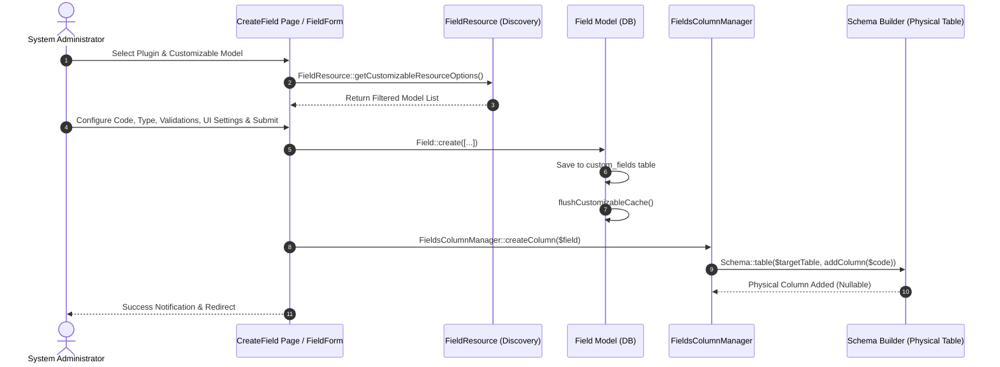
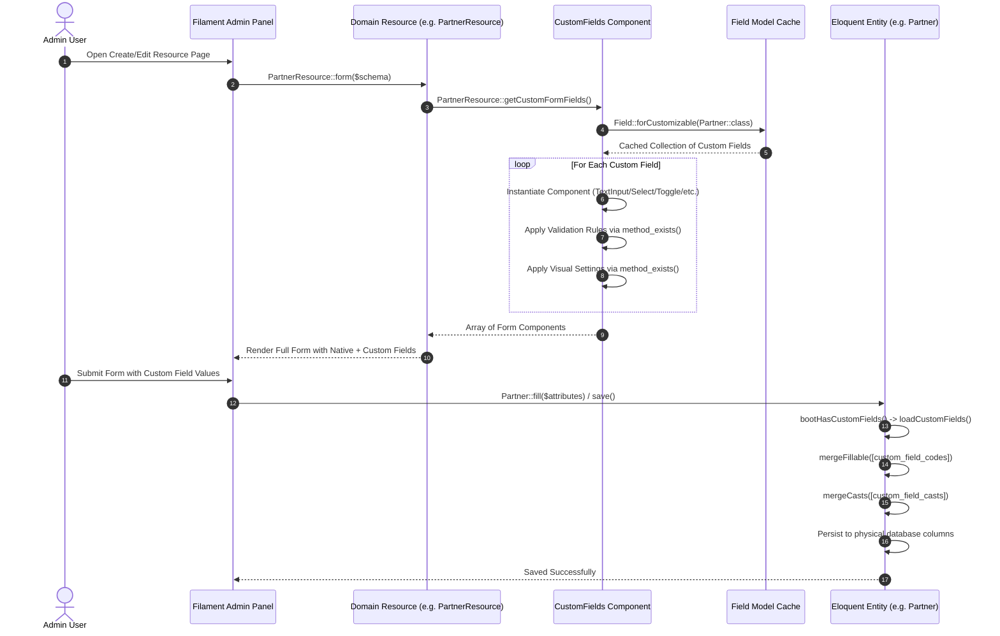

# Plugin: Custom Fields (`fields`)

## Status
[VERIFIED]
Active Core Module. Registered explicitly in `bootstrap/providers.php:47` as `Webkul\Field\FieldServiceProvider::class`.

## Core/Optional
[VERIFIED]
**Core Plugin**. Configured via `$package->isCore()` within `FieldServiceProvider::configureCustomPackage()` (`plugins/webkul/fields/src/FieldServiceProvider.php:23`).

## Enabled/Disabled
[VERIFIED]
**Always Enabled (Core Infrastructure)**. Core plugin status causes `PackageServiceProvider::boot()` to bypass database installation checks (`Package::isInstalled()`) when loading migrations and views (`plugins/webkul/plugin-manager/src/PackageServiceProvider.php:131-135, 202`). The custom fields schema, model extensions, and Filament UI components execute unconditionally at boot time once registered in `bootstrap/providers.php`.

## Purpose
[VERIFIED]
The `fields` plugin provides a metadata-driven runtime attribute customization engine and dynamic schema extension framework across Aureus ERP. It delivers:
1. **Dynamic Database Schema Mutation**: Automatically manages physical database table alterations (`Blueprint::addColumn`, `Blueprint::dropColumn`) at runtime via `FieldsColumnManager` whenever custom field definitions are created, updated, or permanently deleted.
2. **Eloquent Model Auto-Hydration & Casting**: Dynamically merges custom field attributes into Eloquent `$fillable` mass-assignment arrays and dynamically maps custom attribute casts (e.g. JSON array for multiselect/checkbox lists, boolean for toggles/checkboxes, string/decimal for text/numeric) via `Webkul\Field\Traits\HasCustomFields`.
3. **Runtime Filament UI Field Generation**: Injects custom form components, table columns, table filters, table QueryBuilder constraints, and infolist entries at request time into Filament resources via `Webkul\Field\Filament\Traits\HasCustomFields` and the component generators (`CustomFields`, `CustomColumns`, `CustomFilters`, `CustomEntries`).
4. **Administrative Custom Field Builder**: Provides an administrative UI (`FieldResource`) allowing system administrators to define custom attributes per model, configure validation rules, set visual column and infolist layout properties, and manage field options.
5. **Specialized Filament UI Primitives**: Houses reusable UI components including `ProgressStepper` (stage workflow toggle buttons for form and infolist schemas) and `TimeToFloatPicker` (bidirectional converter between `H:i` time picker strings and float decimal hours).

## Service Provider
[VERIFIED]
- **Class**: `Webkul\Field\FieldServiceProvider` (`plugins/webkul/fields/src/FieldServiceProvider.php:14`)
- **Inheritance**: Extends `Webkul\PluginManager\PackageServiceProvider`
- **Registration & Configuration**:
  - `configureCustomPackage(Package $package)`:
    - Sets package name to `'fields'` (`$package->name(static::$name)`)
    - Declares package as core (`$package->isCore()`)
    - Enables views (`$package->hasViews()`) with view namespace `'fields'`
    - Enables translations (`$package->hasTranslations()`)
    - Registers migration `'2024_11_13_052541_create_custom_fields_table'`
    - Enables automatic migration execution (`$package->runsMigrations()`)
  - `packageRegistered()`:
    - Configures Filament panels via `Panel::configureUsing()`, registering `FieldsPlugin::make()`
  - `packageBooted()`:
    - Registers custom CSS asset `fields` (`resources/dist/fields.css`) via `FilamentAsset::register()`
    - Binds authorization policy: `Gate::policy(Field::class, FieldPolicy::class)`

## Filament Plugin class
[VERIFIED]
- **Class**: `Webkul\Field\FieldsPlugin` (`plugins/webkul/fields/src/FieldsPlugin.php:8`)
- **Interface**: Implements `Filament\Contracts\Plugin`
- **Identifier**: `getId()` returns `'fields'`
- **Panel Registration**:
  - `register(Panel $panel)` executes conditionally when `$panel->getId() == 'admin'` (`plugins/webkul/fields/src/FieldsPlugin.php:23`).
  - Discovers resources in `src/Filament/Resources` under namespace `Webkul\Field\Filament\Resources`.
  - Discovers pages in `src/Filament/Pages` under namespace `Webkul\Field\Filament\Pages`.
  - Discovers clusters in `src/Filament/Clusters` under namespace `Webkul\Field\Filament\Clusters`.
  - Attempts discovery on `src/Filament/Widgets` using `discoverClusters()` [INFERRED: code typo in upstream source calling `discoverClusters` instead of `discoverWidgets`; directory does not exist].
- **Boot**: `boot(Panel $panel)` is defined as an empty method stub.

## Composer dependencies
[VERIFIED]
- **Local Package Definition**: `plugins/webkul/fields/composer.json`
  - Name: `webkul/fields`
  - Autoload PSR-4: `Webkul\Field\` -> `src/`, `Webkul\Field\Database\Factories\` -> `database/factories/`, `Webkul\Field\Database\Seeders\` -> `database/seeders/`
  - Autoload-dev PSR-4: `Webkul\Field\Tests\` -> `tests/`
  - Extra Laravel Providers: `Webkul\Field\FieldServiceProvider`
- **External Dependencies Consumed via Root Composer** (`composer.lock`):
  - `spatie/eloquent-sortable` (`v4.5.0`): Implements `Sortable` and `SortableTrait` on `Field` model.
  - `filament/filament` (`v5.7.6`): Filament resources, forms, tables, infolists, and assets.
  - `illuminate/support` (`v13.21.1`): Laravel schema builder, collections, and model events.

## Runtime plugin dependencies
[VERIFIED]
None (`—`). `FieldServiceProvider::configureCustomPackage()` does not declare any runtime plugin dependencies via `hasDependencies()`.

## Directory structure
[VERIFIED]
Full verified tree of `plugins/webkul/fields/`:

```text
plugins/webkul/fields/
├── .gitignore
├── composer.json
├── package.json
├── postcss.config.js
├── tailwind.config.js
├── config/
│   └── filament-shield.php
├── database/
│   ├── factories/
│   │   └── FieldFactory.php
│   └── migrations/
│       └── 2024_11_13_052541_create_custom_fields_table.php
├── resources/
│   ├── css/
│   │   └── index.css
│   ├── dist/
│   │   └── fields.css
│   ├── lang/
│   │   ├── ar/
│   │   │   └── filament/resources/field.php
│   │   │   └── filament/resources/field/pages/
│   │   │       ├── create-field.php
│   │   │       ├── edit-field.php
│   │   │       └── list-fields.php
│   │   ├── en/
│   │   │   └── filament/resources/field.php
│   │   │   └── filament/resources/field/pages/
│   │   │       ├── create-field.php
│   │   │       ├── edit-field.php
│   │   │       └── list-fields.php
│   │   ├── es/
│   │   │   └── filament/resources/field.php
│   │   │   └── filament/resources/field/pages/
│   │   │       ├── create-field.php
│   │   │       ├── edit-field.php
│   │   │       └── list-fields.php
│   │   ├── fr/
│   │   │   └── filament/resources/field.php
│   │   │   └── filament/resources/field/pages/
│   │   │       ├── create-field.php
│   │   │       ├── edit-field.php
│   │   │       └── list-fields.php
│   │   └── pt_BR/
│   │       └── filament/resources/field.php
│   │       └── filament/resources/field/pages/
│   │           ├── create-field.php
│   │           ├── edit-field.php
│   │           └── list-fields.php
│   └── views/
│       └── filament/
│           ├── forms/
│           │   └── components/
│           │       └── progress-stepper/
│           │           └── index.blade.php
│           └── infolists/
│               └── components/
│                   └── progress-stepper.blade.php
└── src/
    ├── FieldsColumnManager.php
    ├── FieldsPlugin.php
    ├── FieldServiceProvider.php
    ├── Filament/
    │   ├── Forms/
    │   │   └── Components/
    │   │       ├── CustomFields.php
    │   │       ├── ProgressStepper.php
    │   │       └── TimeToFloatPicker.php
    │   ├── Infolists/
    │   │   └── Components/
    │   │       ├── CustomEntries.php
    │   │       └── ProgressStepper.php
    │   ├── Resources/
    │   │   ├── FieldResource.php
    │   │   └── FieldResource/
    │   │       ├── Pages/
    │   │       │   ├── CreateField.php
    │   │       │   ├── EditField.php
    │   │       │   └── ListFields.php
    │   │       ├── Schemas/
    │   │       │   └── FieldForm.php
    │   │       └── Tables/
    │   │           └── FieldsTable.php
    │   ├── Tables/
    │   │   ├── Columns/
    │   │   │   └── CustomColumns.php
    │   │   └── Filters/
    │   │       └── CustomFilters.php
    │   └── Traits/
    │       └── HasCustomFields.php
    ├── Http/
    │   └── Resources/
    │       └── V1/
    │           └── FieldResource.php
    ├── Models/
    │   └── Field.php
    ├── Policies/
    │   └── FieldPolicy.php
    └── Traits/
        └── HasCustomFields.php
```

## Models
[VERIFIED]
- **`Webkul\Field\Models\Field`** (`plugins/webkul/fields/src/Models/Field.php:11`)
  - **Table**: `custom_fields`
  - **Primary Key**: `id` (bigint, auto-increment)
  - **Traits & Interfaces**: Implements `Spatie\EloquentSortable\Sortable`, uses `Illuminate\Database\Eloquent\SoftDeletes`, `Spatie\EloquentSortable\SortableTrait`
  - **Fillable Attributes**: `['code', 'name', 'type', 'input_type', 'is_multiselect', 'datalist', 'options', 'form_settings', 'use_in_table', 'table_settings', 'infolist_settings', 'sort', 'customizable_type']`
  - **Casts**:
    - `is_multiselect` => `'boolean'`
    - `options` => `'array'`
    - `form_settings` => `'array'`
    - `table_settings` => `'array'`
    - `infolist_settings` => `'array'`
  - **Sort Configuration**: `$sortable = ['order_column_name' => 'sort', 'sort_when_creating' => true]`
  - **Company Scoping Status**: **Not Company-Scoped (Global Schema Definition)**. Confirmed independently from both `Field.php` (no `BelongsToCompany` trait, no `CompanyScope`, no `company_id` relation) and migration `create_custom_fields_table.php` (no `company_id` column). Custom fields define global metadata extensions for model classes across all companies.
  - **In-Memory Static Cache**:
    - `protected static array $customizableCache = []`: Stores resolved custom fields collection keyed by customizable model class FQCN (`plugins/webkul/fields/src/Models/Field.php:20`).
    - Model events (`saved`, `deleted`, `restored`) registered in `Field::booted()` invoke `Field::flushCustomizableCache()`.
  - **Static Helper Methods**:
    - `Field::forCustomizable(string $model): Collection`: Returns cached collection of custom fields matching `customizable_type` via `Field::customizableTypes($model)`, querying columns `['code', 'type', 'is_multiselect']` (`plugins/webkul/fields/src/Models/Field.php:83-88`).
    - `Field::flushCustomizableCache(?string $model = null): void`: Resets the static cache array globally or for a specified model class (`plugins/webkul/fields/src/Models/Field.php:93-102`).
    - `Field::customizableTypes(string $model): array`: Traverses `class_parents($model)` up to `Illuminate\Database\Eloquent\Model` to return the model class and all its parent classes, allowing custom fields defined on base model classes to apply to child models (`plugins/webkul/fields/src/Models/Field.php:107-120`).

### Adoption of `Webkul\Field\Traits\HasCustomFields` Across Models
[VERIFIED — repository snapshot]
At the time of verification, a total of **52 Eloquent models** across 17 domain plugins import and use `Webkul\Field\Traits\HasCustomFields`:

| Plugin | Adopting Eloquent Models |
|---|---|
| `support` | `Calendar`, `Company`, `Currency`, `ActivityPlan`, `ActivityType` |
| `security` | `Team` |
| `partners` | `Partner` |
| `products` | `Product`, `Attribute`, `Packaging`, `Category`, `PriceList` |
| `accounts` | `Move`, `Product`, `PaymentTerm`, `Journal`, `FiscalPosition`, `Account`, `TaxGroup`, `Incoterm`, `Tax`, `Payment` |
| `sales` | `Team`, `Order` |
| `purchases` | `Order`, `Requisition` |
| `inventories` | `OperationType`, `Scrap`, `Product`, `Operation`, `OrderPoint`, `Rule`, `StorageCategory`, `Warehouse`, `Lot`, `Location`, `Route`, `PutawayRule`, `PackageType` |
| `manufacturing` | `BillOfMaterial`, `Order`, `Operation`, `WorkOrder`, `WorkCenter` |
| `projects` | `ProjectStage`, `Milestone`, `Task`, `Tag`, `TaskStage`, `Project` |
| `employees` | `Department`, `DepartureReason`, `Skill`, `SkillType`, `EmployeeJobPosition`, `Employee`, `EmploymentType`, `EmployeeCategory`, `WorkLocation` |
| `recruitments` | `Applicant`, `Candidate` |
| `time-off` | `Leave`, `LeaveAllocation`, `LeaveAccrualPlan`, `LeaveType` |
| `timesheets` | `Timesheet` |
| `maintenance` | `MaintenanceRequest`, `Team`, `Stage`, `Equipment` |
| `blogs` | `Category`, `Post`, `Tag` |
| `website` | `Page` |

## Database
[VERIFIED]
### Owned Migrations
- `plugins/webkul/fields/database/migrations/2024_11_13_052541_create_custom_fields_table.php`:
  - Creates table `custom_fields`:
    - `id`: `bigIncrements` (primary key)
    - `code`: `string` (column identifier on the target model table)
    - `name`: `string` (human-readable label)
    - `type`: `string` (`text`, `textarea`, `select`, `checkbox`, `radio`, `toggle`, `checkbox_list`, `datetime`, `editor`, `markdown`, `color`)
    - `input_type`: `string`, nullable (sub-type for text fields: `text`, `email`, `numeric`, `integer`, `password`, `tel`, `url`, `color`)
    - `is_multiselect`: `boolean`, default `0`
    - `datalist`: `json`, nullable
    - `options`: `json`, nullable (array of available selectable values)
    - `form_settings`: `json`, nullable (structured array of `validations` and `settings`)
    - `use_in_table`: `boolean`, default `0` (whether column appears in Filament table)
    - `table_settings`: `json`, nullable (structured array of table column visual/functional settings)
    - `infolist_settings`: `json`, nullable (structured array of infolist entry visual/functional settings)
    - `sort`: `integer`, nullable (ordering sequence)
    - `customizable_type`: `string` (fully qualified target Model class name)
    - `deleted_at`: `softDeletes()` timestamp
    - `timestamps`: `created_at`, `updated_at`
  - Indexes & Constraints:
    - Unique composite constraint: `unique(['code', 'customizable_type'])`
    - Index: `index('code')`
    - Index: `index('sort')`

### Dynamic Database Schema Management (`FieldsColumnManager`)
[VERIFIED]
Unlike traditional metadata systems storing dynamic attributes in key-value EAV tables or single JSON blobs, Aureus ERP physically alters the customizable model's database table using Laravel's `Schema` builder:
- **`FieldsColumnManager::createColumn(Field $field)`** (`plugins/webkul/fields/src/FieldsColumnManager.php:14-29`):
  - Resolves target table name via `app($field->customizable_type)->getTable()`.
  - Executes `Schema::table($table, ...)` if `$table` exists and `$field->code` column does not exist.
  - Adds physical column with type determined by `getColumnType($field)`:
    - `text` => `integer` (when `input_type == 'integer'`), `decimal` (when `input_type == 'numeric'`), or `string`.
    - `textarea`, `editor`, `markdown` => `text`.
    - `radio`, `color` => `string`.
    - `select` => `json` if `is_multiselect` is true, otherwise `string`.
    - `checkbox`, `toggle` => `boolean`.
    - `checkbox_list` => `json`.
    - `datetime` => `datetime`.
    - Default fallback => `string`.
  - All added columns are marked `nullable()` by default.
- **`FieldsColumnManager::updateColumn(Field $field)`** (`plugins/webkul/fields/src/FieldsColumnManager.php:34-49`):
  - Ensures the column exists on the physical table; invokes `createColumn()` if missing.
- **`FieldsColumnManager::deleteColumn(Field $field)`** (`plugins/webkul/fields/src/FieldsColumnManager.php:54-69`):
  - Invoked exclusively on **permanent force deletion** (`ForceDeleteAction`, `ForceDeleteBulkAction` in `FieldsTable`).
  - Executes `Schema::table($table, fn (Blueprint $table) => $table->dropColumn($field->code))` to drop the physical column from the database.

### Factories & Stale Artifacts
[VERIFIED]
- `Webkul\Field\Database\Factories\FieldFactory` (`plugins/webkul/fields/database/factories/FieldFactory.php:12`):
  - [WARNING] Contains outdated definition attributes (`label`, `is_required`, `is_unique`, `is_searchable`, `is_filterable`, `is_sortable`, `is_visible`, `model_type`, `creator_id`) that do not match the physical `custom_fields` schema. Calling `FieldFactory::new()->create()` without overriding attributes will trigger database insert exceptions.

## Filament resources/pages/widgets/clusters
[VERIFIED]
### Resources
- **`Webkul\Field\Filament\Resources\FieldResource`** (`plugins/webkul/fields/src/Filament/Resources/FieldResource.php:19`):
  - **Model**: `Webkul\Field\Models\Field`
  - **Navigation Group**: `NavigationGroup::Setting` (`settings`) (`plugins/webkul/fields/src/Filament/Resources/FieldResource.php:37`)
  - **Navigation Sort**: `5`
  - **Labels**: Localized via `__('fields::filament/resources/field.navigation.title')`
  - **Form**: Delegated to `FieldForm::configure($schema)`
  - **Table**: Delegated to `FieldsTable::configure($table)`
  - **Dynamic Model Inspection Engine**:
    - `FieldResource::customizableResources()`: Scans all admin panel resources (`Filament::getPanel('admin')->getResources()`), filtering via `isCustomizableResource($resource)`.
    - `isCustomizableResource(string $resource)`: Validates that the class is a `Filament\Resources\Resource`, implements trait `Webkul\Field\Filament\Traits\HasCustomFields`, originates from an active/installed plugin, and passes `resourceRendersCustomFields()`.
    - `resourceRendersCustomFields(string $resource)`: Uses `ReflectionMethod` to inspect the resource's `form()` method source code, confirming that it contains string references to `getCustomFormFields` or `mergeCustomFormFields`.
    - `FieldResource::getCustomizableResourceOptions(?string $plugin = null)`: Formats the discovered customizable resources into dropdown options keyed by model FQCN (`$resource::getModel()`).

### Pages
- **`Webkul\Field\Filament\Resources\FieldResource\Pages\ListFields`** (`plugins/webkul/fields/src/Filament/Resources/FieldResource/Pages/ListFields.php:11`):
  - **Tabs**:
    - `all`: All custom field records (`Field::count()`).
    - `archived`: Soft-deleted records (`Field::onlyTrashed()->count()`).
  - **Header Actions**: `CreateAction` opening the creation page.
- **`Webkul\Field\Filament\Resources\FieldResource\Pages\CreateField`** (`plugins/webkul/fields/src/Filament/Resources/FieldResource/Pages/CreateField.php:10`):
  - `afterCreate()`: Invokes `FieldsColumnManager::createColumn($this->record)` to execute DDL adding the column to the physical table.
- **`Webkul\Field\Filament\Resources\FieldResource\Pages\EditField`** (`plugins/webkul/fields/src/Filament/Resources/FieldResource/Pages/EditField.php:11`):
  - `afterSave()`: Invokes `FieldsColumnManager::updateColumn($this->record)`.
  - Header actions: `DeleteAction` (soft delete).

### Schemas / Form Builder
- **`Webkul\Field\Filament\Resources\FieldResource\Schemas\FieldForm`** (`plugins/webkul/fields/src/Filament/Resources/FieldResource/Schemas/FieldForm.php:21`):
  - 3-column layout dividing configuration into:
    - **General Section**: `name` (required, max 255), `code` (required, disabled on edit, regex `/^[a-zA-Z_][a-zA-Z0-9_]*$/`, validated against existing columns via `Schema::getColumnListing($table)`).
    - **Options Section**: Dynamic `Repeater` for option items; visible only when type is `select`, `checkbox_list`, or `radio`.
    - **Form Settings Section**: Repeaters for configuring client/server `validations` (e.g. `required`, `maxLength`, `regex`, `gt`, `lt`, `after`, `unique`, `requiredIf`) and `additional-settings` (e.g. `prefix`, `suffix`, `helperText`, `placeholder`, `disabled`, `mask`, `autofocus`, `default`).
    - **Table Settings Section**: `use_in_table` toggle plus repeaters for `alignment`, `weight`, `size`, `color`, `icon`, `searchable`, `sortable`, `copyable`, `tooltip`.
    - **Infolist Settings Section**: Repeaters for entry visual options (`weight`, `size`, `color`, `badge`, `copyable`, `helperText`, `hint`).
    - **Settings Sidebar**: `type` select (11 supported types), `input_type` select (for text fields), `is_multiselect` toggle (for select), `sort` integer input.
    - **Resource Sidebar**: `plugin` select (dynamically populated) and `customizable_type` select (filtered customizable models).

### Tables
- **`Webkul\Field\Filament\Resources\FieldResource\Tables\FieldsTable`** (`plugins/webkul/fields/src/Filament/Resources/FieldResource/Tables/FieldsTable.php:22`):
  - **Columns**: `code` (searchable/sortable), `name` (searchable/sortable), `type` (sortable), `customizable_type` (displays short resource name), `created_at` (sortable).
  - **Filters**: `SelectFilter` on `type` (11 types), `SelectFilter` on `customizable_type` (dynamically listing customizable models).
  - **Record Actions**: `ActionGroup` containing `EditAction`, `RestoreAction`, `DeleteAction` (soft delete), `ForceDeleteAction` (with `before` hook calling `FieldsColumnManager::deleteColumn($record)`).
  - **Toolbar Bulk Actions**: `RestoreBulkAction`, `DeleteBulkAction`, `ForceDeleteBulkAction` (with `before` hook calling `FieldsColumnManager::deleteColumn($record)` for each record).

### Clusters & Widgets
- [NOT APPLICABLE] No clusters or widgets are defined in `fields`.

## Panels
[VERIFIED]
- **Admin Panel**: Exclusively registered on the `admin` panel (`app/Providers/Filament/AdminPanelProvider.php`). `FieldsPlugin::register(Panel $panel)` validates `$panel->getId() == 'admin'`.
- **Customer Panel**: Not registered. `CustomerPanelProvider` (`app/Providers/Filament/CustomerPanelProvider.php`) contains no custom field discovery or management resources.

## Services & Runtime Rendering Engine
[VERIFIED]
The plugin delivers 5 core runtime rendering and schema management services:

```
┌──────────────────────────────────────────────────────────────────────────────────┐
│                         Custom Fields Rendering Engine                           │
└────────────────────────────────────────┬─────────────────────────────────────────┘
                                         │
       ┌─────────────────────────────────┼─────────────────────────────────┐
       ▼                                 ▼                                 ▼
┌─────────────────────────┐   ┌─────────────────────────┐   ┌─────────────────────────┐
│       Form Engine       │   │      Table Engine       │   │     Infolist Engine     │
│   (CustomFields.php)    │   │  (CustomColumns/Filters)│   │   (CustomEntries.php)   │
├─────────────────────────┤   ├─────────────────────────┤   ├─────────────────────────┤
│ • Resolves Field rows   │   │ • Filters use_in_table  │   │ • Maps Field -> Entry   │
│ • Maps Field -> Form    │   │ • Maps Field -> Column  │   │ • Injects Weight, Size, │
│   Component             │   │ • Injects TextSize,     │   │   Color, Badge, Copy    │
│ • Injects Validations   │   │   FontWeight, Colors    │   │ • Handles Enums & Array │
│ • Injects UI Settings   │   │ • Builds SelectFilters  │   │   display               │
│ • Configures Options    │   │ • Builds QueryBuilder   │   │                         │
│   & Multiselect         │   │   Constraints           │   │                         │
└─────────────────────────┘   └─────────────────────────┘   └─────────────────────────┘
```

1. **`Webkul\Field\FieldsColumnManager`** (`plugins/webkul/fields/src/FieldsColumnManager.php:9`):
   - Executes DDL schema modifications on target tables via `Schema::table()`.
   - Manages physical column lifecycle (`createColumn`, `updateColumn`, `deleteColumn`).
2. **`Webkul\Field\Filament\Forms\Components\CustomFields`** (`plugins/webkul/fields/src/Filament/Forms/Components/CustomFields.php:20`):
   - Queries `Field` models where `customizable_type` matches `$resource::getModel()` and its parent classes.
   - Instantiates matching Filament Form components:
     - `text` => `TextInput`
     - `textarea` => `Textarea`
     - `select` => `Select` (with `multiple()` if `is_multiselect`, `native(false)`)
     - `checkbox` => `Checkbox`
     - `radio` => `Radio`
     - `toggle` => `Toggle`
     - `checkbox_list` => `CheckboxList`
     - `datetime` => `DateTimePicker` (with `native(false)`)
     - `editor` => `RichEditor`
     - `markdown` => `MarkdownEditor`
     - `color` => `ColorPicker`
   - Dynamically evaluates `$field->form_settings['validations']`, checking `method_exists($component, $rule)` to invoke validation methods with arguments.
   - Dynamically evaluates `$field->form_settings['settings']`, invoking matching component setting methods.
3. **`Webkul\Field\Filament\Tables\Columns\CustomColumns`** (`plugins/webkul/fields/src/Filament/Tables/Columns/CustomColumns.php:15`):
   - Queries `Field` records where `use_in_table = true` for the target model.
   - Instantiates `TextColumn`, `IconColumn` (for checkbox/toggle), or `ColorColumn` (for color).
   - Maps table settings, converting font weight and text size strings to Filament enum constants (`FontWeight::{$value}`, `TextSize::{$value}`).
4. **`Webkul\Field\Filament\Tables\Filters\CustomFilters`** (`plugins/webkul/fields/src/Filament/Tables/Filters/CustomFilters.php:19`):
   - Generates standard table filters (`getFilters()`) including boolean toggles, select filters, and JSON-aware multiple select filters (`orWhereJsonContains`).
   - Generates advanced table QueryBuilder constraints (`getQueryBuilderConstraints()`) mapping field types to `TextConstraint`, `NumberConstraint`, `DateConstraint`, `BooleanConstraint`, and `SelectConstraint`.
5. **`Webkul\Field\Filament\Infolists\Components\CustomEntries`** (`plugins/webkul/fields/src/Filament/Infolists/Components/CustomEntries.php:15`):
   - Queries custom fields and instantiates `TextEntry`, `IconEntry`, or `ColorEntry`.
   - Injects visual infolist settings (weights, sizes, colors, copyable, badges).

### Specialized Filament UI Components
[VERIFIED]
1. **`Webkul\Field\Filament\Forms\Components\ProgressStepper`** (`plugins/webkul/fields/src/Filament/Forms/Components/ProgressStepper.php:7`):
   - Extends `ToggleButtons` using view `fields::filament.forms.components.progress-stepper.index`.
   - Renders horizontal interactive stage progression chevrons for state transitions.
2. **`Webkul\Field\Filament\Infolists\Components\ProgressStepper`** (`plugins/webkul/fields/src/Filament/Infolists/Components/ProgressStepper.php:9`):
   - Extends `Entry` using view `fields::filament.infolists.components.progress-stepper`.
   - Renders read-only progress stage chevrons on infolist view pages.
3. **`Webkul\Field\Filament\Forms\Components\TimeToFloatPicker`** (`plugins/webkul/fields/src/Filament/Forms/Components/TimeToFloatPicker.php:8`):
   - Extends `TimePicker`.
   - `dehydrateStateUsing`: Converts `H:i` time string (e.g. `'01:30'`) to float decimal hours (e.g. `1.5`).
   - `afterStateHydrated`: Converts float hours (e.g. `1.5`) back to `H:i` display format (`'01:30'`).

## Events
[NOT APPLICABLE]
No domain events are dispatched or subscribed to by `fields`.

## Listeners
[NOT APPLICABLE]
No event listeners are defined in `fields`.

## Observers
[NOT APPLICABLE]
No standalone Eloquent observer classes exist; model cache invalidation is handled directly within `Field::booted()` via model lifecycle callbacks (`saved`, `deleted`, `restored`).

## Policies
[VERIFIED]
- **`Webkul\Field\Policies\FieldPolicy`** (`plugins/webkul/fields/src/Policies/FieldPolicy.php:9`):
  - Implements authorization checks using `$user->can()` for the `Field` model:
    - `viewAny(User $user)`: `$user->can('view_any_field_field')`
    - `view(User $user, Field $field)`: `$user->can('view_field_field')`
    - `create(User $user)`: `$user->can('create_field_field')`
    - `update(User $user, Field $field)`: `$user->can('update_field_field')`
    - `delete(User $user, Field $field)`: `$user->can('delete_field_field')`
    - `deleteAny(User $user)`: `$user->can('delete_any_field_field')`
    - `forceDelete(User $user, Field $field)`: `$user->can('force_delete_field_field')`
    - `forceDeleteAny(User $user)`: `$user->can('force_delete_any_field_field')`
    - `restore(User $user, Field $field)`: `$user->can('restore_field_field')`
    - `restoreAny(User $user)`: `$user->can('restore_any_field_field')`
  - Explicitly mapped in `FieldServiceProvider::packageBooted()` via `Gate::policy(Field::class, FieldPolicy::class)`.
  - Shield configuration in `config/filament-shield.php` (`plugins/webkul/fields/config/filament-shield.php:11-18`) registers `FieldResource::class` under `manage` permissions with basic, delete, force delete, restore, and reorder permissions.

## Routes
[NOT APPLICABLE]
No HTTP web or API route files are defined or loaded by `fields`.
- Note: An unreferenced API Resource scaffold exists at `plugins/webkul/fields/src/Http/Resources/V1/FieldResource.php`, but no API routes or controllers exist in the plugin.

## Settings
[NOT APPLICABLE]
No plugin-specific settings schema exists under `database/settings/`.

## Translations
[VERIFIED]
- **Supported Locales**: `ar`, `en`, `es`, `fr`, `pt_BR`
- **Translation Namespace**: `fields`
- **Files per Locale**:
  - `filament/resources/field.php`: Complete labels for field types, input types, form sections, 50+ validation rule labels, 40+ form setting labels, 30+ table column setting labels, 20+ infolist setting labels, and action notifications.
  - `filament/resources/field/pages/list-fields.php`: Tab labels (`all`, `archived`) and header action labels.
  - `filament/resources/field/pages/create-field.php`: Creation success notification title and body.
  - `filament/resources/field/pages/edit-field.php`: Update success notification title and body.

## Tests
[VERIFIED]
- **Explicit Test Coverage Status**: The `fields` plugin contains **zero test files** (0 unit tests, 0 feature tests under `plugins/webkul/fields/tests/`). Although `composer.json` declares an `autoload-dev` mapping for `Webkul\Field\Tests\` to `tests/`, no `tests/` directory exists in the plugin.
- **Root Test Coverage**: Zero test files in `tests/Feature/` or `tests/Unit/` reference or assert custom field functionality.
- **E2E Playwright Coverage**: Zero Playwright browser tests exist for custom fields under `tests/e2e-pw/`.

## Runtime dependencies
[VERIFIED]
None (`—`).

## Cross-plugin relationships
[VERIFIED]
1. **Foundation for All Domain Plugins**: At the time of verification, custom fields are consumed across 17 domain plugins, extending 52 Eloquent models and 33 Filament resource schemas.
2. **Support Plugin**:
   - `FieldResource` binds to `Webkul\Support\Enums\NavigationGroup::Setting`.
   - Models in `support` (`Company`, `Calendar`, `Currency`, `ActivityPlan`, `ActivityType`) use `HasCustomFields`.
   - `CompanyResource` uses `Webkul\Field\Filament\Traits\HasCustomFields`.
3. **Security Plugin**:
   - `FieldPolicy` references `Webkul\Security\Models\User`.
   - `Team` model in `security` uses `HasCustomFields`.
4. **Filament Resources Adopting `Webkul\Field\Filament\Traits\HasCustomFields` (33 Resources)**:
   - `accounts`: `AccountResource`, `BillResource`, `InvoiceResource`, `PaymentResource`
   - `accounting`: `JournalEntryResource`, `ProductResource`
   - `blogs`: `PostResource`
   - `employees`: `EmployeeResource`
   - `fields`: `FieldResource`
   - `inventories`: `LotResource`, `OperationResource`, `WarehouseResource`
   - `invoices`: `ProductResource`
   - `maintenance`: `EquipmentResource`, `MaintenanceRequestResource`
   - `manufacturing`: `ManufacturingOrderResource`, `WorkOrderResource`
   - `partners`: `PartnerResource`
   - `products`: `ProductResource`
   - `projects`: `MilestoneResource`, `ProjectResource`, `TaskResource`
   - `purchases`: `OrderResource`, `ProductResource`, `PurchaseAgreementResource`, `VendorResource`
   - `recruitments`: `ApplicantResource`, `CandidateResource`
   - `sales`: `QuotationResource`
   - `support`: `CompanyResource`
   - `time-off`: `TimeOffResource`
   - `timesheets`: `TimesheetResource`
   - `website`: `PageResource`

## Data flow
[VERIFIED]
### 1. Custom Field Creation & Physical Table Mutation Flow


### 2. Live Request Form Rendering & Model Hydration Flow


## Business rules
[VERIFIED]
1. **Physical Column Co-existence**:
   - Every custom field created in `custom_fields` must exist as a real, physical column on the target model's database table.
   - Column names must follow the regex `^[a-zA-Z_][a-zA-Z0-9_]*$` and cannot collide with existing table column names.
2. **Global Schema Scope**:
   - Custom field definitions are global schema extensions tied to model classes (`customizable_type`). They are not scoped by company ID and apply across all companies in the multi-company ERP instance.
3. **Inheritance-Aware Custom Fields**:
   - Custom fields registered against a parent model class automatically apply to all child classes traversing the inheritance tree (`Field::customizableTypes()`).
4. **Soft Delete Preservation vs. Force Delete Destruction**:
   - Soft-deleting a custom field hides it from active listings and form discovery but **preserves** the physical table column and historical data.
   - Force-deleting a custom field permanently executes `Schema::table()->dropColumn()` via `FieldsColumnManager::deleteColumn()`, dropping the physical column and permanently destroying all stored data for that attribute across all records.
5. **Static In-Memory Cache Invalidation**:
   - `Field::$customizableCache` caches custom field lookups during the request lifecycle. Any mutation (`saved`, `deleted`, `restored`) automatically flushes the cache.

## Extension points
[VERIFIED]
1. **`Webkul\Field\Traits\HasCustomFields` (Eloquent)**: Trait applied to any Eloquent model to automatically load custom fields into `$fillable` and `$casts` on model lifecycle events (`retrieved`, `creating`, `updating`, `fill`).
2. **`Webkul\Field\Filament\Traits\HasCustomFields` (Filament Resource)**: Trait providing helper methods (`mergeCustomFormFields`, `getCustomFormFields`, `mergeCustomTableColumns`, `getCustomTableColumns`, `mergeCustomTableFilters`, `getCustomTableFilters`, `getTableQueryBuilderConstraints`, `mergeCustomInfolistEntries`, `getCustomInfolistEntries`) to dynamically merge custom UI components into Filament resources.
3. **Dynamic Reflection Validation in `FieldResource::resourceRendersCustomFields`**: Allows any new resource to be automatically discovered by the Custom Field builder UI simply by using `HasCustomFields` and referencing `getCustomFormFields` / `mergeCustomFormFields` in its `form()` method.

## Dangerous areas
[VERIFIED]
1. **Zero Automated Test Coverage Across Repository**:
   - **Critical Fact**: `plugins/webkul/fields/` contains **0 test files**. Furthermore, no root PHP tests or Playwright E2E tests exist for custom fields anywhere in the repository.
   - Any regressions in runtime DDL schema modification, dynamic casting, or form component generation cannot be detected by automated CI/CD pipelines.
2. **Runtime DDL Table Modifications on Live Production Databases**:
   - `FieldsColumnManager::createColumn` and `FieldsColumnManager::deleteColumn` execute runtime DDL queries (`ALTER TABLE ADD/DROP COLUMN`) during HTTP requests.
   - On large production tables (e.g. `partners_partners`, `analytic_records`, `orders`), executing `ALTER TABLE` can lock tables, cause request timeouts, or trigger replication lag.
3. **Irreversible Data Destruction on Force Delete**:
   - When a custom field is force deleted via `FieldsTable` record or bulk action, `FieldsColumnManager::deleteColumn()` drops the column from the database without a backup, permanently destroying all user-entered data for that field across all historical records.
4. **Stale `FieldFactory` Artifact**:
   - `Webkul\Field\Database\Factories\FieldFactory` contains stale column definitions (`label`, `is_required`, `is_unique`, `is_searchable`, `model_type`, `creator_id`) that will cause immediate SQL errors if used in future testing without refactoring.
5. **Unvalidated Custom Validations and Settings Execution**:
   - `CustomFields::applyValidation` and `applySetting` use `method_exists($component, $rule)` to dynamically invoke methods on Filament components. If an invalid or incompatible method is stored in JSON settings, unexpected behavior or method signature mismatch exceptions can occur.

## Change impact
[VERIFIED]
- **Architectural Scope**: **High / Cross-Cutting**.
- **Blast Radius**: Affects 52 Eloquent models and 33 Filament resources across 17 domain plugins (repository snapshot at time of verification).
- **Database Schema Impact**: Modifying `FieldsColumnManager` or `Field` model lifecycle impacts physical database table structures across all modules.
- **Security Impact**: Custom field values respect model-level authorization and company ownership of parent entities; custom field definition management is governed by `FieldPolicy` and `view_any_field_field` / `create_field_field` permissions.

---

## Evidence Index

| Evidence ID | Source File | Symbol / Method | Purpose / Claim Verified |
|---|---|---|---|
| **E-001** | `plugins/webkul/fields/src/FieldServiceProvider.php` | `FieldServiceProvider::configureCustomPackage()` | Core flag, migration registration, package registration, asset registration, policy binding |
| **E-002** | `plugins/webkul/fields/src/FieldsPlugin.php` | `FieldsPlugin::register()` | Filament plugin registration on admin panel |
| **E-003** | `plugins/webkul/fields/src/Models/Field.php` | `Field::forCustomizable()`, `Field::customizableTypes()`, `Field::flushCustomizableCache()` | Custom field model, global scoping, static cache, inheritance traversal |
| **E-004** | `plugins/webkul/fields/src/FieldsColumnManager.php` | `FieldsColumnManager::createColumn()`, `deleteColumn()` | Runtime DDL schema modification engine (`ALTER TABLE ADD/DROP COLUMN`) |
| **E-005** | `plugins/webkul/fields/src/Traits/HasCustomFields.php` | `HasCustomFields::bootHasCustomFields()`, `loadCustomFields()`, `mergeFillable()`, `mergeCasts()` | Eloquent trait for auto-loading fillable and dynamic attribute casts |
| **E-006** | `plugins/webkul/fields/src/Filament/Traits/HasCustomFields.php` | `HasCustomFields::mergeCustomFormFields()`, `getCustomTableColumns()` | Filament trait providing helpers for form, table, filter, and infolist integration |
| **E-007** | `plugins/webkul/fields/src/Filament/Forms/Components/CustomFields.php` | `CustomFields::getSchema()`, `createField()`, `applyValidation()` | Dynamic Filament form component builder from `custom_fields` metadata |
| **E-008** | `plugins/webkul/fields/src/Filament/Tables/Columns/CustomColumns.php` | `CustomColumns::getColumns()`, `createColumn()` | Dynamic Filament table column builder with font/size/color settings |
| **E-009** | `plugins/webkul/fields/src/Filament/Tables/Filters/CustomFilters.php` | `CustomFilters::getFilters()`, `getQueryBuilderConstraints()` | Dynamic table filter and QueryBuilder constraint builder |
| **E-010** | `plugins/webkul/fields/src/Filament/Infolists/Components/CustomEntries.php` | `CustomEntries::getSchema()`, `createEntry()` | Dynamic infolist entry builder with typography and badge settings |
| **E-011** | `plugins/webkul/fields/src/Filament/Forms/Components/ProgressStepper.php` | `ProgressStepper` | Form component for interactive stage progression buttons |
| **E-012** | `plugins/webkul/fields/src/Filament/Infolists/Components/ProgressStepper.php` | `ProgressStepper` | Infolist component for read-only stage progression display |
| **E-013** | `plugins/webkul/fields/src/Filament/Forms/Components/TimeToFloatPicker.php` | `TimeToFloatPicker::setUp()` | Time string (`H:i`) to decimal float hours converter |
| **E-014** | `plugins/webkul/fields/src/Filament/Resources/FieldResource.php` | `FieldResource::customizableResources()`, `resourceRendersCustomFields()` | Resource definition, reflection-based customizable model discovery |
| **E-015** | `plugins/webkul/fields/src/Filament/Resources/FieldResource/Schemas/FieldForm.php` | `FieldForm::configure()`, `getFormSettingsSchema()` | Comprehensive 3-column custom field creation/edit form schema |
| **E-016** | `plugins/webkul/fields/src/Filament/Resources/FieldResource/Tables/FieldsTable.php` | `FieldsTable::configure()` | Table schema, type/resource filters, restore/delete/force-delete actions |
| **E-017** | `plugins/webkul/fields/src/Filament/Resources/FieldResource/Pages/CreateField.php` | `CreateField::afterCreate()` | Hook triggering `FieldsColumnManager::createColumn()` |
| **E-018** | `plugins/webkul/fields/src/Filament/Resources/FieldResource/Pages/EditField.php` | `EditField::afterSave()` | Hook triggering `FieldsColumnManager::updateColumn()` |
| **E-019** | `plugins/webkul/fields/src/Policies/FieldPolicy.php` | `FieldPolicy::viewAny()`, `create()`, `delete()` | Authorization policy for `Field` model |
| **E-020** | `plugins/webkul/fields/config/filament-shield.php` | Configuration array | Filament Shield permission mapping for `FieldResource` |
| **E-021** | `plugins/webkul/fields/database/migrations/2024_11_13_052541_create_custom_fields_table.php` | `Schema::create('custom_fields', ...)` | Physical table schema for custom field definitions |
| **E-022** | `plugins/webkul/fields/database/factories/FieldFactory.php` | `FieldFactory::definition()` | Factory definition containing stale attributes |
| **E-023** | `bootstrap/providers.php` | `bootstrap/providers.php:47` | Registration of `FieldServiceProvider` |
