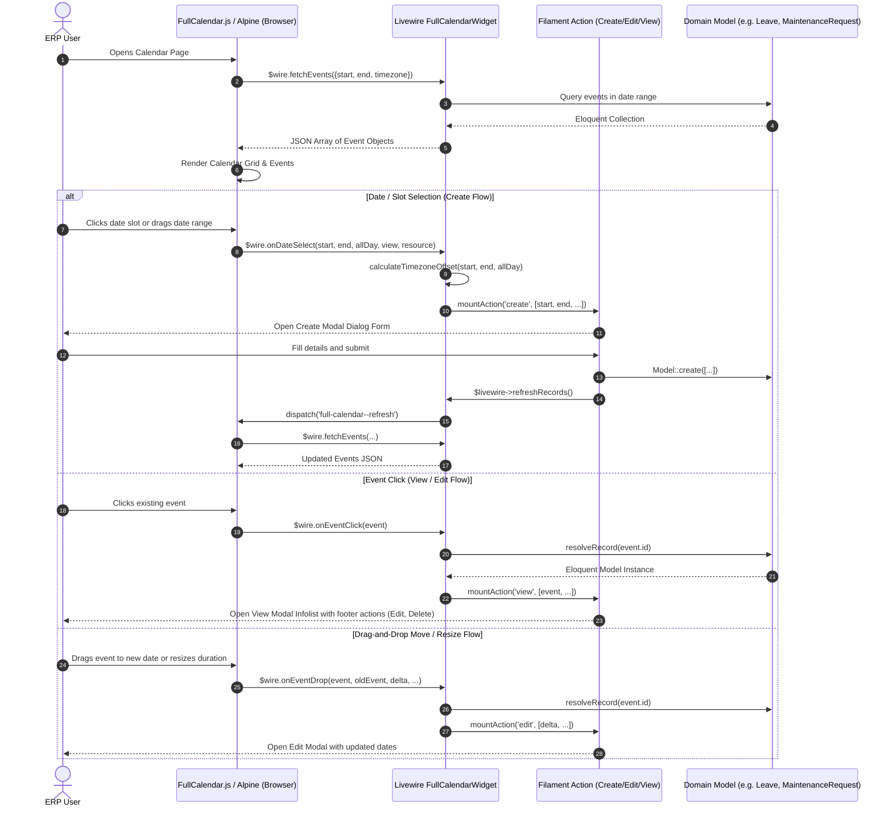

# Plugin: Calendar (`full-calendar`)

## Status
[VERIFIED]
Active Core Module. Registered explicitly in `bootstrap/providers.php:63` as `Webkul\FullCalendar\FullCalendarServiceProvider::class`.

## Core/Optional
[VERIFIED]
**Core Plugin**. Configured via `$package->isCore()` within `FullCalendarServiceProvider::configureCustomPackage()` (`plugins/webkul/full-calendar/src/FullCalendarServiceProvider.php:23`).

## Enabled/Disabled
[VERIFIED]
**Always Enabled (Core Infrastructure)**. Core plugin status causes `PackageServiceProvider::boot()` to bypass database installation checks (`Package::isInstalled()`) when registering views and assets (`plugins/webkul/plugin-manager/src/PackageServiceProvider.php:131-135, 202`). The FullCalendar widget foundation, JavaScript Alpine bundle, and Filament action integration execute unconditionally at boot time once registered in `bootstrap/providers.php`.

## Purpose
[VERIFIED]
The `full-calendar` plugin is an abstract UI and Livewire component engine that bridges the FullCalendar JavaScript library (v6) with Filament and Livewire across Aureus ERP. It delivers:
1. **Reusable FullCalendar Livewire Widget Primitive**: `FullCalendarWidget` provides a standardized base class for calendar views across ERP domain modules.
2. **Bidirectional Event & Action Lifecycle**: Translates JavaScript calendar interactions (date click, date range select, event click, drag-and-drop event move, event resize) into Livewire action invocations (`view`, `create`, `edit`) and browser event dispatches (`full-calendar--refresh`, `full-calendar--goto`, etc.).
3. **Record-Bound & Schema-Driven Modals**: Integrates Filament modal actions (`CreateAction`, `EditAction`, `ViewAction`, `DeleteAction`) that automatically bind to Eloquent models, hydrate form and infolist schemas, and refresh calendar events upon mutation.
4. **Multi-Plugin Dynamic Calendar Configuration**: Allows domain modules (e.g. `time-off`, `maintenance`) to configure FullCalendar views (month, week, day, list, multi-month year), plugins, locales, timezones, and custom JavaScript callbacks.
5. **Pre-Bundled FullCalendar Assets**: Packages and registers compiled JavaScript (`AlpineComponent::make('full-calendar', resources/dist/app.js)`) and CSS (`Css::make('full-calendar', resources/dist/app.css)`) across Filament panels.

## Service Provider
[VERIFIED]
- **Class**: `Webkul\FullCalendar\FullCalendarServiceProvider` (`plugins/webkul/full-calendar/src/FullCalendarServiceProvider.php:14`)
- **Inheritance**: Extends `Webkul\PluginManager\PackageServiceProvider`
- **Registration & Configuration**:
  - `configureCustomPackage(Package $package)`:
    - Sets package name to `'full-calendar'` (`$package->name(static::$name)`)
    - Declares package as core (`$package->isCore()`)
    - Enables views (`$package->hasViews()`) with view namespace `'full-calendar'`
    - Enables translations (`$package->hasTranslations()`) [VERIFIED: declared in provider, though no `resources/lang/` directory exists]
    - Registers empty install/uninstall command closures
  - `packageRegistered()`:
    - Configures Filament panels via `Panel::configureUsing()` (`plugins/webkul/full-calendar/src/FullCalendarServiceProvider.php:37-45`).
    - Conditional check: `if (! $panel->hasPlugin((new FullCalendarPlugin)->getId())) { $panel->plugin(FullCalendarPlugin::make()); }`. This prevents default settings from overwriting custom configurations registered earlier by downstream domain plugins (e.g. `TimeOffPlugin`, `MaintenancePlugin`).
  - `packageBooted()`:
    - Invokes `registerCustomCss()` (`plugins/webkul/full-calendar/src/FullCalendarServiceProvider.php:32, 48-54`).
    - Registers custom assets via `FilamentAsset::register()`:
      - `Css::make('full-calendar', resources/dist/app.css)`
      - `AlpineComponent::make('full-calendar', resources/dist/app.js)`

## Filament Plugin class
[VERIFIED]
- **Class**: `Webkul\FullCalendar\FullCalendarPlugin` (`plugins/webkul/full-calendar/src/FullCalendarPlugin.php:8`)
- **Interface**: Implements `Filament\Contracts\Plugin`
- **Identifier**: `getId()` returns `'full-calendar'`
- **Instance Factory & Accessor**:
  - `FullCalendarPlugin::make()`: Resolves instance from Laravel container via `app(static::class)`.
  - `FullCalendarPlugin::get()`: Retrieves active panel plugin instance via `filament(app(static::class)->getId())`.
- **Configuration Methods**:
  - `setPlugins(array $plugins, bool $merge = true)`: Default plugin array `['dayGrid', 'timeGrid', 'interaction', 'list', 'multiMonth', 'moment', 'momentTimezone']`.
  - `getPlugins()`: Returns active FullCalendar JS plugin keys.
  - `setConfig(array $config)` / `getConfig()`: Custom FullCalendar configuration options array.
  - `setTimezone(string $timezone)` / `getTimezone()`: Active timezone (falls back to `config('app.timezone')`).
  - `setLocale(string $locale)` / `getLocale()`: Active locale string (falls back to `strtolower(str_replace('_', '-', app()->getLocale()))`).
  - `editable(bool $editable = true)` / `isEditable()`: Enables or disables calendar drag-and-drop and resize editing.
  - `selectable(bool $selectable = true)` / `isSelectable()`: Enables or disables date/range selection for event creation.
- **Panel Registration**:
  - `register(Panel $panel)`: Executes resource, page, cluster, and widget auto-discovery under `src/Filament/` for namespace `Webkul\FullCalendar\Filament\*`.
  - `boot(Panel $panel)`: Defined as an empty method stub.

## Composer dependencies
[VERIFIED]
- **Local Package Definition**: `plugins/webkul/full-calendar/composer.json`
  - Name: `webkul/full-calendar`
  - Autoload PSR-4: `Webkul\FullCalendar\` -> `src/`, `Webkul\FullCalendar\Database\Factories\` -> `database/factories/`, `Webkul\FullCalendar\Database\Seeders\` -> `database/seeders/`
  - Autoload-dev PSR-4: `Webkul\FullCalendar\Tests\` -> `tests/`
  - Extra Laravel Providers: `Webkul\FullCalendar\FullCalendarServiceProvider`
- **External Dependencies Consumed via Root Composer** (`composer.lock`):
  - `filament/filament` (`v5.7.6`): Filament widgets, actions, forms, and asset registration.
  - `livewire/livewire` (`v4.3.3`): Reactive component state management and method invocation.
  - `nesbot/carbon` (`v3`): Date and timezone calculation.
- **Frontend Dependencies (`package.json`)**:
  - `@fullcalendar/core` (`^6.1.9`), `@fullcalendar/daygrid` (`^6.1.9`), `@fullcalendar/timegrid` (`^6.1.9`), `@fullcalendar/interaction` (`^6.1.9`), `@fullcalendar/list` (`^6.1.9`), `@fullcalendar/multimonth` (`^6.1.9`), `@fullcalendar/moment` (`^6.1.9`), `@fullcalendar/moment-timezone` (`^6.1.9`), `@fullcalendar/resource` (`^6.1.9`), `@fullcalendar/resource-timegrid` (`^6.1.9`), `@fullcalendar/resource-timeline` (`^6.1.9`), `@fullcalendar/scrollgrid` (`^6.1.9`), `@fullcalendar/timeline` (`^6.1.9`), `@fullcalendar/adaptive` (`^6.1.9`), `@fullcalendar/rrule` (`^6.1.9`).
  - `moment` (`^2.29.4`), `moment-timezone` (`^0.5.43`), `rrule` (`^2.7.2`), `esbuild` (`^0.25.9`), `tailwindcss` (`^4.1.12`).

## Runtime plugin dependencies
[VERIFIED]
None (`—`). `FullCalendarServiceProvider::configureCustomPackage()` does not declare any runtime plugin dependencies via `hasDependencies()`.

## Directory structure
[VERIFIED]
Full verified tree of `plugins/webkul/full-calendar/`:

```text
plugins/webkul/full-calendar/
├── .gitignore
├── composer.json
├── package-lock.json
├── package.json
├── postcss.config.js
├── tailwind.config.js
├── config/
│   └── filament-shield.php
├── resources/
│   ├── bin/
│   │   └── build.js
│   ├── css/
│   │   └── app.css
│   ├── dist/
│   │   ├── app.css
│   │   └── app.js
│   ├── js/
│   │   └── app.js
│   └── views/
│       └── filament/
│           └── widgets/
│               └── full-calendar.blade.php
└── src/
    ├── FullCalendarPlugin.php
    ├── FullCalendarServiceProvider.php
    ├── Concerns/
    │   ├── CanBeConfigured.php
    │   ├── InteractsWithEvents.php
    │   ├── InteractsWithHeaderActions.php
    │   ├── InteractsWithModalActions.php
    │   ├── InteractsWithRawJS.php
    │   └── InteractsWithRecord.php
    ├── Contracts/
    │   ├── HasConfigurations.php
    │   ├── HasEvents.php
    │   ├── HasHeaderActions.php
    │   ├── HasModalActions.php
    │   ├── HasRawJs.php
    │   └── HasRecords.php
    └── Filament/
        ├── Actions/
        │   ├── CreateAction.php
        │   ├── DeleteAction.php
        │   ├── EditAction.php
        │   └── ViewAction.php
        └── Widgets/
            └── FullCalendarWidget.php
```

## Models
[NOT APPLICABLE]
The `full-calendar` plugin defines **zero Eloquent models**. It provides the abstract `InteractsWithRecord` trait allowing child widgets in domain plugins to bind any target Eloquent model dynamically (e.g. `Webkul\TimeOff\Models\Leave`, `Webkul\Maintenance\Models\MaintenanceRequest`).

## Database
[NOT APPLICABLE]
The `full-calendar` plugin defines **zero database migrations** and owns **zero database tables** (confirmed in `docs/database/erds/core.md:40, 1035`). All physical working calendar and schedule tables (`calendars`, `calendar_attendances`, `calendar_leaves`) in Aureus ERP are owned and migrated by the `support` plugin (`plugins/webkul/support/database/migrations/2026_04_02_000001_create_calendars_table.php`).

## Filament resources/pages/widgets/clusters
[VERIFIED]

### Resources
[NOT APPLICABLE] No Filament resources are defined in `full-calendar`.

### Pages
[NOT APPLICABLE] No Filament standalone pages are defined in `full-calendar`.

### Clusters
[NOT APPLICABLE] No Filament clusters are defined in `full-calendar`.

### Widgets
- **`Webkul\FullCalendar\Filament\Widgets\FullCalendarWidget`** (`plugins/webkul/full-calendar/src/Filament/Widgets/FullCalendarWidget.php:28`):
  - **Base Class**: Extends `Filament\Widgets\Widget`.
  - **Implemented Contracts**: `HasActions`, `HasConfigurations`, `HasEvents`, `HasForms`, `HasHeaderActions`, `HasModalActions`, `HasRawJs`, `HasRecords`.
  - **Used Concerns**: `CanBeConfigured`, `InteractsWithActions`, `InteractsWithEvents`, `InteractsWithForms`, `InteractsWithHeaderActions`, `InteractsWithModalActions`, `InteractsWithRawJS`, `InteractsWithRecord`.
  - **Blade View**: `full-calendar::filament.widgets.full-calendar` (`resources/views/filament/widgets/full-calendar.blade.php`).
  - **Column Span**: Defaults to `'full'`.
  - **Default Header Actions**: `[CreateAction::make()]`.
  - **Default Modal Actions**: `[EditAction::make(), DeleteAction::make()]`.
  - **Default View Action**: `ViewAction::make()`.
  - **Stubs for Child Implementation**:
    - `fetchEvents(array $info): array`: Returns event array formatted for FullCalendar.js.
    - `getFormSchema(): array`: Returns Filament form schema for create/edit action modals.

### Specialized Filament Actions
[VERIFIED]
1. **`Webkul\FullCalendar\Filament\Actions\CreateAction`** (`plugins/webkul/full-calendar/src/Filament/Actions/CreateAction.php:8`):
   - Extends `Filament\Actions\CreateAction`.
   - Binds target model dynamically via `$livewire->getModel()`.
   - Binds form schema via `$livewire->getFormSchema()`.
   - Hooks `after()` callback to invoke `$livewire->refreshRecords()`.
   - Invokes `cancelParentActions()` to prevent action collisions.
2. **`Webkul\FullCalendar\Filament\Actions\EditAction`** (`plugins/webkul/full-calendar/src/Filament/Actions/EditAction.php:8`):
   - Extends `Filament\Actions\EditAction`.
   - Binds target model via `$livewire->getModel()`, record via `$livewire->getRecord()`, and form schema via `$livewire->getFormSchema()`.
   - Hooks `after()` to trigger `$livewire->refreshRecords()`.
   - Suppresses default success notification (`successNotification(null)`) for custom child handling.
3. **`Webkul\FullCalendar\Filament\Actions\DeleteAction`** (`plugins/webkul/full-calendar/src/Filament/Actions/DeleteAction.php:9`):
   - Extends `Filament\Actions\DeleteAction`.
   - Binds target model and record.
   - Clears `$livewire->record = null` and invokes `$livewire->refreshRecords()` upon deletion.
   - Automatically hides itself if the target record uses `SoftDeletes` and is currently trashed (`hidden(fn (?Model $record) => $record?->trashed())`).
   - Suppresses default notification and calls `cancelParentActions()`.
4. **`Webkul\FullCalendar\Filament\Actions\ViewAction`** (`plugins/webkul/full-calendar/src/Filament/Actions/ViewAction.php:8`):
   - Extends `Filament\Actions\ViewAction`.
   - Binds schema via `$livewire->getInfolistSchema()`.
   - Injects `$livewire->modalActions()` and modal cancel button into modal footer via `modalFooterActions()`.
   - Calls `cancelParentActions('view')` and triggers `refreshRecords()`.

### Modular Concerns Architecture
[VERIFIED]
- **`Webkul\FullCalendar\Concerns\CanBeConfigured`** (`plugins/webkul/full-calendar/src/Concerns/CanBeConfigured.php:8`):
  - Provides recursive array merge (`mergeConfig`) combining plugin-level options (`FullCalendarPlugin::get()->getConfig()`) with widget-level options (`$this->config()`).
- **`Webkul\FullCalendar\Concerns\InteractsWithEvents`** (`plugins/webkul/full-calendar/src/Concerns/InteractsWithEvents.php:8`):
  - `onEventClick(array $event)`: Resolves record via `$this->resolveRecord($event['id'])` and mounts `'view'` action.
  - `onEventDrop(...)`: Resolves record and mounts `'edit'` action with delta parameters.
  - `onEventResize(...)`: Resolves record and mounts `'edit'` action with start/end deltas.
  - `onDateSelect(...)`: Normalizes start/end dates with timezone offsets and mounts `'create'` action.
  - `refreshRecords()`: Dispatches Livewire/browser event `full-calendar--refresh`.
  - `calculateTimezoneOffset(...)`: Parses start and end dates with `Carbon` under the configured plugin timezone (`FullCalendarPlugin::make()->getTimezone()`), subtracting one day for all-day end boundaries.
- **`Webkul\FullCalendar\Concerns\InteractsWithRecord`** (`plugins/webkul/full-calendar/src/Concerns/InteractsWithRecord.php:11`):
  - Manages Eloquent model resolution via `resolveRecordRouteBinding($key)` using `app($this->getModel())->resolveRouteBindingQuery(...)`.
  - Throws `ModelNotFoundException` if key cannot be resolved.
- **`Webkul\FullCalendar\Concerns\InteractsWithHeaderActions`** (`plugins/webkul/full-calendar/src/Concerns/InteractsWithHeaderActions.php:7`):
  - Caches header action definitions during widget boot lifecycle (`bootInteractsWithHeaderActions`, `bootedInteractsWithHeaderActions`).
- **`Webkul\FullCalendar\Concerns\InteractsWithModalActions`** (`plugins/webkul/full-calendar/src/Concerns/InteractsWithModalActions.php:9`):
  - Caches and flattens modal action buttons embedded in view/edit modal footers.
- **`Webkul\FullCalendar\Concerns\InteractsWithRawJS`** (`plugins/webkul/full-calendar/src/Concerns/InteractsWithRawJS.php:5`):
  - Declares JavaScript string hooks for FullCalendar callbacks: `eventClassNames()`, `eventContent()`, `eventDidMount()`, `eventWillUnmount()`.

## Panels
[VERIFIED]
- **Dual Panel Participation**: `FullCalendarServiceProvider` registers `FullCalendarPlugin::make()` via `Panel::configureUsing()`, registering without panel-ID restrictions across both **`admin`** and **`customer`** panels (`app/Providers/Filament/AdminPanelProvider.php`, `app/Providers/Filament/CustomerPanelProvider.php`).
- **Conflict Prevention**: `FullCalendarServiceProvider::packageRegistered()` validates `! $panel->hasPlugin('full-calendar')` before attaching default instances, allowing panels or domain plugins to register customized plugin instances.

## Services & JavaScript Integration Architecture
[VERIFIED]
The plugin implements a decoupled architecture connecting FullCalendar v6, Alpine.js, and Livewire:

```
┌─────────────────────────────────────────────────────────────────────────────┐
│                      FullCalendar UI & Action Engine                        │
└──────────────────────────────────────┬──────────────────────────────────────┘
                                       │
            ┌──────────────────────────┴──────────────────────────┐
            ▼                                                     ▼
┌──────────────────────────────────────┐        ┌──────────────────────────────────────┐
│        Alpine.js / FullCalendar      │        │       Livewire / FullCalendarWidget   │
│   (resources/js/app.js)              │        │   (src/Filament/Widgets/)            │
├──────────────────────────────────────┤        ├──────────────────────────────────────┤
│ • Initializes new Calendar(el, opts) │        │ • HasActions, HasForms, HasRecords   │
│ • Listens to 'events' fetch function │◄──────►│ • fetchEvents(): loads model records  │
│ • Handles eventClick / dateClick     │        │ • onEventClick(): mounts 'view'      │
│ • Handles select / eventDrop / resize│        │ • onDateSelect(): mounts 'create'    │
│ • Listens to window browser events   │        │ • onEventDrop(): mounts 'edit'       │
└──────────────────────────────────────┘        └──────────────────────────────────────┘
```

### Browser Window Events
[VERIFIED]
The Alpine component (`resources/js/app.js:131-135`) listens for the following global window events:
- `full-calendar--refresh`: Invokes `calendar.refetchEvents()` to reload all event feeds from Livewire.
- `full-calendar--prev`: Moves calendar to the previous time interval (`calendar.prev()`).
- `full-calendar--next`: Moves calendar to the next time interval (`calendar.next()`).
- `full-calendar--today`: Moves calendar to the current date (`calendar.today()`).
- `full-calendar--goto`: Navigates to a specific date passed in `event.detail.date` (`calendar.gotoDate(...)`).

## Events
[NOT APPLICABLE]
No Laravel domain events are dispatched or subscribed to by `full-calendar`. All reactive synchronization occurs via Livewire method invocations and browser window events.

## Listeners
[NOT APPLICABLE]
No Laravel event listeners are defined in `full-calendar`.

## Observers
[NOT APPLICABLE]
No Eloquent model observers are defined in `full-calendar`.

## Policies
[NOT APPLICABLE]
- No dedicated policy classes exist in `full-calendar` (since the plugin owns no Eloquent models).
- **Shield Configuration**: `config/filament-shield.php` (`plugins/webkul/full-calendar/config/filament-shield.php:8`) explicitly excludes `FullCalendarWidget::class` from automatic permission generation, as it is an abstract base widget. Child widgets implement their own Shield permissions (e.g. `widget_time_off_calendar_widget`).

## Routes
[NOT APPLICABLE]
No HTTP web or API route files are defined or loaded by `full-calendar`.

## Settings
[NOT APPLICABLE]
No plugin-specific settings schema exists under `database/settings/`.

## Translations
[VERIFIED]
- **Declared in Provider**: `FullCalendarServiceProvider::configureCustomPackage()` invokes `$package->hasTranslations()`.
- **Physical State**: The `plugins/webkul/full-calendar/resources/lang/` directory **does not exist**. FullCalendar relies on built-in locales imported via `@fullcalendar/core/locales-all` in JavaScript (`resources/js/app.js:17, 47`) and translated labels supplied by child widgets in domain plugins.

## Tests
[VERIFIED]
- **Explicit Test Coverage Status**: The `full-calendar` plugin contains **zero test files** (0 unit tests, 0 feature tests under `plugins/webkul/full-calendar/tests/`). Although `composer.json` declares an `autoload-dev` mapping for `Webkul\FullCalendar\Tests\` to `tests/`, no `tests/` directory exists on disk.
- **Root & E2E Test Coverage**: Zero tests in `tests/Feature/`, `tests/Unit/`, or Playwright browser tests (`tests/e2e-pw/`) test `full-calendar` components or JavaScript rendering.

## Runtime dependencies
[VERIFIED]
None (`—`).

## Cross-plugin relationships
[VERIFIED]
`full-calendar` is an abstract foundation consumed by multiple domain plugins and UI features:

```
                          ┌────────────────────────┐
                          │     full-calendar      │
                          │  (FullCalendarWidget)  │
                          └───────────┬────────────┘
                                      │
              ┌───────────────────────┼───────────────────────┐
              ▼                       ▼                       ▼
    ┌──────────────────┐    ┌──────────────────┐    ┌──────────────────┐
    │     support      │    │     time-off     │    │   maintenance    │
    ├──────────────────┤    ├──────────────────┤    ├──────────────────┤
    │ • Owns tables:   │    │ • CalendarWidget │    │ • Maintenance-   │
    │   calendars,     │    │ • Overview-      │    │   CalendarWidget │
    │   attendances,   │    │   CalendarWidget │    │ • Schedules      │
    │   leaves         │    │ • Reads support's│    │   Maintenance-   │
    │ • Calendar-      │    │   CalendarLeave  │    │   Requests       │
    │   Resource       │    │   (HolidayAction)│    │                  │
    └──────────────────┘    └──────────────────┘    └──────────────────┘
```

1. **Relationship with `support` Plugin**:
   - `support` physically owns the working calendar tables: `calendars`, `calendar_attendances`, and `calendar_leaves` (`plugins/webkul/support/database/migrations/2026_04_02_000001_create_calendars_table.php`).
   - `support` provides the admin CRUD resource `CalendarResource` (`plugins/webkul/support/src/Filament/Resources/CalendarResource.php:21`) for managing company work schedules, attendance intervals, and leave periods.
   - `full-calendar` does not directly query `support`'s tables; domain modules integrate `support`'s models into calendar widgets.
2. **Adoption in `time-off` Plugin**:
   - `Webkul\TimeOff\TimeOffPlugin` (`plugins/webkul/time-off/src/TimeOffPlugin.php:49-53`) configures `FullCalendarPlugin::make()->selectable()->editable(true)->setPlugins(['multiMonth'])`.
   - `Webkul\TimeOff\Filament\Widgets\CalendarWidget` (`plugins/webkul/time-off/src/Filament/Widgets/CalendarWidget.php:31`) extends `FullCalendarWidget`:
     - Binds `$model = Leave::class` (`Webkul\TimeOff\Models\Leave`).
     - In `fetchEvents()`, queries user/employee leave requests within the requested time window (`fetchInfo['start']` to `fetchInfo['end']`).
     - Includes `HolidayAction` (`plugins/webkul/time-off/src/Filament/Actions/HolidayAction.php:32`) in `headerActions()`, which queries `Webkul\Support\Models\CalendarLeave::with('company')->get()` to display public holidays in a slide-over modal.
     - In `onDateSelect()`, mounts `create` action pre-filling `request_date_from` and `request_date_to`.
   - `Webkul\TimeOff\Filament\Widgets\OverviewCalendarWidget` (`plugins/webkul/time-off/src/Filament/Widgets/OverviewCalendarWidget.php:23`) extends `FullCalendarWidget`, displaying all organization leaves on a multi-month year view (`initialView => 'multiMonthYear'`).
3. **Adoption in `maintenance` Plugin**:
   - `Webkul\Maintenance\MaintenancePlugin` (`plugins/webkul/maintenance/src/MaintenancePlugin.php:49-52`) registers `FullCalendarPlugin::make()->selectable()->setPlugins(['multiMonth'])`.
   - `Webkul\Maintenance\Filament\Widgets\MaintenanceCalendarWidget` (`plugins/webkul/maintenance/src/Filament/Widgets/MaintenanceCalendarWidget.php:28`) extends `FullCalendarWidget`:
     - Binds `$model = MaintenanceRequest::class` (`Webkul\Maintenance\Models\MaintenanceRequest`).
     - In `fetchEvents()`, queries `MaintenanceRequest` records where `scheduled_at` falls within the active calendar viewport.
     - In `onDateSelect()`, mounts create modal action setting `scheduled_at`.
     - In `createMaintenanceRequest()`, persists new maintenance records and dispatches `$this->refreshRecords()`.
4. **Shield Integration**:
   - `config/filament-shield.php` excludes `FullCalendarWidget::class` from permission generation.

## Data flow
[VERIFIED]

### Calendar Event Interaction & Mutation Lifecycle Flow


## Business rules
[VERIFIED]
1. **Abstract Framework Pattern**:
   - `FullCalendarWidget` is an abstract base component; it does not persist data directly, relying on child classes to implement `fetchEvents()`, `getFormSchema()`, and assign `$model`.
2. **Registration Idempotency & Custom Configuration Preservation**:
   - `FullCalendarServiceProvider::packageRegistered()` checks `! $panel->hasPlugin('full-calendar')` before registering `FullCalendarPlugin::make()`. If a domain plugin (e.g. `TimeOffPlugin`) has already registered a customized instance with custom options (`->editable()`, `->selectable()`, `->setPlugins()`), the customized instance is preserved.
3. **All-Day Date Offset Normalization**:
   - In `InteractsWithEvents::calculateTimezoneOffset()`, when `allDay` is `true` and an `end` date is supplied by FullCalendar, the end date is decremented by one day (`$end->subDay()->endOfDay()`) to compensate for FullCalendar's exclusive end-date convention.
4. **Soft-Delete Safe Deletion Action**:
   - `DeleteAction` automatically hides itself if the bound record uses `SoftDeletes` and has already been soft-deleted (`$record->trashed()`).
5. **Modal Action Isolation**:
   - Actions invoke `cancelParentActions()` to prevent nested action state corruption when chaining view, edit, and delete modals.

## Extension points
[VERIFIED]
1. **Subclassing `FullCalendarWidget`**: Any domain plugin can create custom calendar interfaces by extending `Webkul\FullCalendar\Filament\Widgets\FullCalendarWidget` and implementing `fetchEvents()`, `getFormSchema()`, and optional `infolist()`.
2. **Customizing Calendar Plugins & Views**: Domain plugins can add FullCalendar JS plugins (e.g. `multiMonth`, `resourceTimeline`, `rrule`) via `FullCalendarPlugin::make()->setPlugins([...])` and configure custom views via `config()`.
3. **JavaScript Lifecycle Callbacks via `InteractsWithRawJS`**: Child widgets can override `eventClassNames()`, `eventContent()`, `eventDidMount()`, and `eventWillUnmount()` to provide custom client-side JavaScript rendering routines.
4. **Custom Header and Modal Actions**: Widgets can customize header buttons via `headerActions()` (e.g. `HolidayAction`) and view modal footer actions via `modalActions()`.

## Dangerous areas
[VERIFIED]
1. **Zero Automated Test Coverage Across Entire Repository**:
   - **Critical Fact**: `plugins/webkul/full-calendar/` contains **0 test files**. No Pest tests, PHPUnit tests, or Playwright E2E browser tests exist for calendar components anywhere in the repository.
   - Any regression in Livewire-to-Alpine event dispatching, timezone parsing, or action mounting cannot be detected by automated CI/CD pipelines.
2. **Raw JavaScript String Execution (`InteractsWithRawJS`)**:
   - `eventClassNames`, `eventContent`, `eventDidMount`, and `eventWillUnmount` output raw JavaScript strings directly into Blade templates (`resources/views/filament/widgets/full-calendar.blade.php:26-29`).
   - If unsanitized user or tenant input is ever interpolated into these methods in child classes, it creates potential Cross-Site Scripting (XSS) vulnerabilities.
3. **FullCalendar Exclusive End-Date Inconsistency**:
   - FullCalendar treats all-day range end dates as exclusive (e.g., May 1 to May 3 in FullCalendar means May 1 through May 2). `calculateTimezoneOffset()` subtracts one day, but child widgets overriding `onDateSelect()` without applying this normalization can cause off-by-one date storage bugs.
4. **Unbounded `fetchEvents()` Query Load**:
   - `fetchEvents(array $fetchInfo)` receives date boundaries from the browser viewport. If child widgets omit index optimizations or fetch large unbounded date ranges (e.g. year views in `OverviewCalendarWidget`), this can cause heavy database queries and slow Livewire response payloads.
5. **Plugin Registration Order Sensitivity**:
   - Because `FullCalendarServiceProvider` checks `! $panel->hasPlugin('full-calendar')`, domain plugins configuring custom options (like `TimeOffPlugin`) must register their `FullCalendarPlugin` instance during panel building before the fallback provider runs.

## Change impact
[VERIFIED]
- **Architectural Scope**: **Low Database / Medium UI Layer**.
- **Blast Radius**: Affects calendar widgets in `time-off` and `maintenance`, and any future domain module subclassing `FullCalendarWidget`.
- **Database Schema Impact**: **Zero**. The plugin defines no tables or migrations.
- **Security Impact**: Governed by child widget policies and Shield traits (`HasWidgetShield`); `FullCalendarWidget` itself is excluded from Shield permission discovery.

---

## Evidence Index

| Evidence ID | Source File | Symbol / Method | Purpose / Claim Verified |
|---|---|---|---|
| **E-001** | `plugins/webkul/full-calendar/src/FullCalendarServiceProvider.php` | `FullCalendarServiceProvider::configureCustomPackage()` | Core flag, package name, views, translations declaration |
| **E-002** | `plugins/webkul/full-calendar/src/FullCalendarServiceProvider.php` | `FullCalendarServiceProvider::packageRegistered()` | Conditional panel registration preventing clobbering of custom instances |
| **E-003** | `plugins/webkul/full-calendar/src/FullCalendarServiceProvider.php` | `FullCalendarServiceProvider::registerCustomCss()` | Registration of `app.css` and `app.js` Alpine component |
| **E-004** | `plugins/webkul/full-calendar/src/FullCalendarPlugin.php` | `FullCalendarPlugin::register()`, `setPlugins()`, `editable()`, `selectable()` | Plugin definition, defaults, configuration setters/getters, auto-discovery |
| **E-005** | `plugins/webkul/full-calendar/src/Filament/Widgets/FullCalendarWidget.php` | `FullCalendarWidget` | Base Livewire widget class, contracts, concerns, default actions |
| **E-006** | `plugins/webkul/full-calendar/src/Filament/Actions/CreateAction.php` | `CreateAction::setUp()` | Model/schema binding, refresh hook, action cancellation |
| **E-007** | `plugins/webkul/full-calendar/src/Filament/Actions/EditAction.php` | `EditAction::setUp()` | Record/model/schema binding, refresh hook, notification suppression |
| **E-008** | `plugins/webkul/full-calendar/src/Filament/Actions/DeleteAction.php` | `DeleteAction::setUp()` | Trashed record hidden check, refresh hook, action cancellation |
| **E-009** | `plugins/webkul/full-calendar/src/Filament/Actions/ViewAction.php` | `ViewAction::setUp()` | Infolist schema binding, modal footer action injection |
| **E-010** | `plugins/webkul/full-calendar/src/Concerns/CanBeConfigured.php` | `CanBeConfigured::mergeConfig()`, `getConfig()` | Recursive config array merge between plugin and widget |
| **E-011** | `plugins/webkul/full-calendar/src/Concerns/InteractsWithEvents.php` | `InteractsWithEvents::onEventClick()`, `onDateSelect()`, `calculateTimezoneOffset()` | Event interaction handlers, timezone offset calculation, refresh dispatch |
| **E-012** | `plugins/webkul/full-calendar/src/Concerns/InteractsWithRecord.php` | `InteractsWithRecord::resolveRecord()`, `resolveRecordRouteBinding()` | Dynamic Eloquent model record resolution by key |
| **E-013** | `plugins/webkul/full-calendar/src/Concerns/InteractsWithHeaderActions.php` | `InteractsWithHeaderActions::cacheHeaderActions()` | Header action caching during widget boot |
| **E-014** | `plugins/webkul/full-calendar/src/Concerns/InteractsWithModalActions.php` | `InteractsWithModalActions::cacheModalActions()` | Modal action caching and flattening |
| **E-015** | `plugins/webkul/full-calendar/src/Concerns/InteractsWithRawJS.php` | `InteractsWithRawJS::eventClassNames()`, `eventContent()` | Raw JavaScript callback string stubs |
| **E-016** | `plugins/webkul/full-calendar/resources/js/app.js` | `fullCalendar()` | Alpine.js FullCalendar v6 initialization, event hooks, window listeners |
| **E-017** | `plugins/webkul/full-calendar/resources/views/filament/widgets/full-calendar.blade.php` | Blade Template | Widget view rendering Alpine component and modal containers |
| **E-018** | `plugins/webkul/full-calendar/config/filament-shield.php` | Shield Configuration | Exclusion of `FullCalendarWidget::class` from permission generation |
| **E-019** | `plugins/webkul/full-calendar/composer.json` | Composer Configuration | Package metadata and PSR-4 autoload definitions |
| **E-020** | `plugins/webkul/full-calendar/package.json` | NPM Package Configuration | FullCalendar v6 npm dependencies and build scripts |
| **E-021** | `bootstrap/providers.php` | Line 63 | Registration of `FullCalendarServiceProvider` |
| **E-022** | `plugins/webkul/time-off/src/Filament/Widgets/CalendarWidget.php` | `CalendarWidget` | Child widget implementation binding `Leave` model and `HolidayAction` |
| **E-023** | `plugins/webkul/time-off/src/Filament/Actions/HolidayAction.php` | `HolidayAction::setUp()` | Slide-over action querying `Webkul\Support\Models\CalendarLeave` |
| **E-024** | `plugins/webkul/maintenance/src/Filament/Widgets/MaintenanceCalendarWidget.php` | `MaintenanceCalendarWidget` | Child widget implementation binding `MaintenanceRequest` model |
| **E-025** | `docs/database/erds/core.md` | Lines 40, 1035 | Confirmation that `full-calendar` owns zero database tables/migrations |
