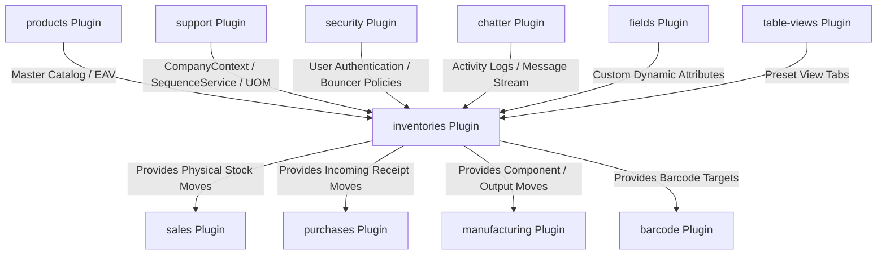
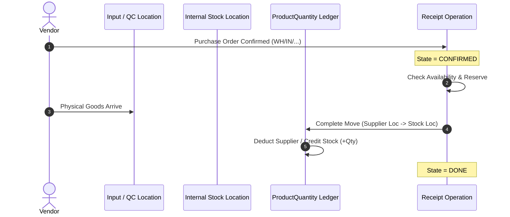
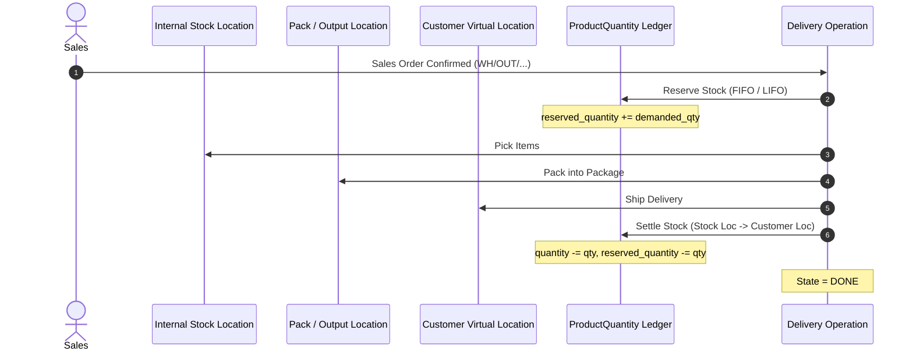

# Plugin: Inventory (`inventories`)

## Status
[VERIFIED]
Active Optional Module. Registered explicitly in `bootstrap/providers.php:48` as `Webkul\Inventory\InventoryServiceProvider::class`.

## Core/Optional
[VERIFIED]
**Optional Plugin**. Configured as a modular business domain plugin without calling `$package->isCore()` (`plugins/webkul/inventories/src/InventoryServiceProvider.php:48-162`). Execution, dynamic schema contribution, and asset registration are gated by runtime installation verification via `Package::isPluginInstalled('inventories')` (`plugins/webkul/inventories/src/InventoryServiceProvider.php:177,197,210` and `plugins/webkul/inventories/src/InventoryPlugin.php:23`).

## Enabled/Disabled
[VERIFIED]
**Conditionally Enabled (Database-Gated)**. `InventoryServiceProvider` boots conditionally based on whether the plugin record in the database is marked `installed = true`. If uninstalled, event observers (`CompanyObserver`, `ProductObserver`, `UOMObserver`), schema mutations into `products`, livewire components, and REST API routes are suppressed.

## Purpose
[VERIFIED]
The `inventories` module serves as the comprehensive double-entry inventory ledger, multi-warehouse topology, stock movement engine, automated replenishment pipeline, putaway planner, packaging container hierarchy, lot/serial traceability, and physical stock adjustment system for Aureus ERP:

1. **Double-Entry Stock Movement Ledger (`Move` & `MoveLine`)**:
   - Implements a balanced double-entry inventory ledger mirroring financial accounting: stock is never created or destroyed arbitrarily in place, but transferred from a `source_location_id` (credit analog) to a `destination_location_id` (debit analog).
   - Manages physical warehouse picking/delivery documents (`inventories_operations`), detailed item movements (`inventories_moves`), and lot/serial/package execution lines (`inventories_move_lines`).
   - Tracks document lifecycle states (`OperationState`: `DRAFT`, `WAITING`, `CONFIRMED`, `ASSIGNED`, `DONE`, `CANCELED`) and move progression states (`MoveState`: `DRAFT`, `WAITING`, `CONFIRMED`, `PARTIALLY_ASSIGNED`, `ASSIGNED`, `DONE`, `CANCELED`).

2. **Quant Stock Balance at Rest (`ProductQuantity`)**:
   - Maintains physical stock balances partitioned by `(product_id, location_id, company_id, lot_id, package_id, partner_id)`.
   - Distinguishes real on-hand stock (`quantity`), active reservations (`reserved_quantity`), and physical inventory count audits (`counted_quantity`, `difference_quantity`, `inventory_diff_quantity`).

3. **Multi-Warehouse & Hierarchical Location Topology (`Warehouse`, `Location`, `StorageCategory`)**:
   - Supports multi-warehouse storage facilities (`inventories_warehouses`) with independent incoming, internal, output, and quality control routing configurations.
   - Organizes physical bins, shelves, and virtual locations into recursive trees (`inventories_locations`) with materialized `parent_path` indexing.
   - Enforces location capacity restrictions and dimensional limits via storage categories (`inventories_storage_categories`, `inventories_storage_category_capacities`).

4. **Multi-Step Route & Push/Pull Procurement Engine (`Route`, `Rule`, `ProcurementGroup`, `OrderPoint`)**:
   - Configures flexible 1-step, 2-step, or 3-step logistics routes for receipts (Vendor → Stock, Vendor → Input → Stock, or Vendor → Input → QC → Stock), deliveries (Stock → Customer, Stock → Output → Customer, or Stock → Pack → Output → Customer), and manufacturing.
   - Executes automated push and pull rules (`RuleAction`: `PULL`, `PUSH`, `PULL_PUSH`, `BUY`, `MANUFACTURE`) orchestrated by `ProcurementRunner` and `RuleResolver`.
   - Automates reordering min/max replenishment policies (`inventories_order_points`) triggered automatically or manually.

5. **Automated Putaway & Removal Strategies (`PutawayRule`, Removal Strategies)**:
   - Directs incoming goods to designated warehouse zones and bins via putaway automation (`inventories_putaway_rules`, `inventories_putaway_rule_package_types`).
   - Applies location and category-level stock removal strategies: FIFO (First In, First Out), LIFO (Last In, First Out), and Closest Location (`ProductQuantity::resolveRemovalStrategy()`).

6. **Packaging, Containers & Package Levels (`Package`, `PackageType`, `PackageLevel`, `Packaging`)**:
   - Manages physical containers and boxes (`inventories_packages`) categorized by package types (`inventories_package_types`) with weight and capacity limits.
   - Tracks container state transitions during picking/packing via package levels (`inventories_package_levels`, `inventories_package_destinations`).

7. **Lot & Serial Number Traceability (`Lot`)**:
   - Tracks individual lots and serial numbers (`inventories_lots`) across receipt, storage, production, and delivery.
   - Supports expiration date tracking (`use_expiration_date`, `expiration_time`, `use_time`, `removal_time`, `alert_time`).

8. **Physical Inventory Adjustments & Scrap Management (`QuantityResource`, `Scrap`)**:
   - Provides physical count reconciliation generating balancing inventory adjustment moves against virtual loss/gain locations.
   - Manages scrap write-offs (`inventories_scraps`, `inventories_scrap_tags`) transferring damaged/obsolete inventory to designated virtual scrap locations.

9. **Seamless Cross-Plugin Supply Chain Integration**:
   - Dynamically injects inventory tab schemas, on-hand/forecasted stock columns, and quantity update actions into `products` via `ProductSchemaRegistry`.
   - Fulfills delivery demand generated by `sales` (`sale_order_line_id`, `procurement_group_id`) and incoming receipts from `purchases` (`purchase_order_line_id`).
   - Integrates raw material consumption and finished goods production with `manufacturing`.

10. **Comprehensive REST API Suite**:
    - Exposes complete REST API v1 endpoints under `admin/api/v1/inventories` for warehouses, locations, operation types, routes, rules, storage categories, package types, packages, lots, products, receipts, deliveries, internal transfers, dropships, quantities, scraps, and moves.

---

## Service Provider
[VERIFIED]
- **Class**: `Webkul\Inventory\InventoryServiceProvider` (`plugins/webkul/inventories/src/InventoryServiceProvider.php:42`)
- **Inheritance**: Extends `Webkul\PluginManager\PackageServiceProvider`
- **Registration & Configuration**:
  - `configureCustomPackage(Package $package)`:
    - Sets package name to `inventories` (`InventoryServiceProvider::$name = 'inventories'`).
    - Sets view namespace to `inventories` (`$viewNamespace = 'inventories'`).
    - Registers view namespace (`hasViews()`).
    - Registers translation namespace (`hasTranslations()`).
    - Registers API routes (`hasRoute('api')`).
    - Registers 57 database migrations (`hasMigrations([...])`) and executes them (`runsMigrations()`):
      1. `2025_01_06_072032_create_inventories_tags_table`
      2. `2025_01_06_072130_create_inventories_warehouses_table`
      3. `2025_01_06_072135_create_inventories_storage_categories_table`
      4. `2025_01_06_072224_create_inventories_locations_table`
      5. `2025_01_06_072349_create_inventories_operation_types_table`
      6. `2025_01_06_072353_create_inventories_routes_table`
      7. `2025_01_06_072356_create_inventories_rules_table`
      8. `2025_01_06_143103_create_inventories_route_warehouses_table`
      9. `2025_01_07_083342_add_relationship_to_inventories_warehouses_table`
      10. `2025_01_07_095737_create_inventories_warehouse_resupplies_table`
      11. `2025_01_07_145741_create_inventories_package_types_table`
      12. `2025_01_07_145741_create_inventories_packages_table`
      13. `2025_01_10_091035_alter_products_products_table`
      14. `2025_01_10_095946_create_inventories_category_routes_table`
      15. `2025_01_10_095946_create_inventories_product_routes_table`
      16. `2025_01_10_102716_add_package_type_id_column_in_products_packagings_table`
      17. `2025_01_10_111734_create_inventories_storage_category_capacities_table`
      18. `2025_01_13_061029_create_inventories_route_packagings_table`
      19. `2025_01_14_092601_create_inventories_lots_table`
      20. `2025_01_14_113233_create_inventories_product_quantities_table`
      21. `2025_01_14_113235_create_inventories_product_quantity_relocations_table`
      22. `2025_01_14_133233_create_inventories_operations_table`
      23. `2025_01_14_133245_create_inventories_package_levels_table`
      24. `2025_01_14_133246_create_inventories_package_destinations_table`
      25. `2025_01_14_133250_create_inventories_scraps_table`
      26. `2025_01_14_133255_create_inventories_scrap_tags_table`
      27. `2025_01_14_133260_create_inventories_moves_table`
      28. `2025_01_14_133266_create_inventories_move_destinations_table`
      29. `2025_01_15_095753_create_inventories_move_lines_table`
      30. `2025_03_13_074205_create_inventories_order_points_table`
      31. `2025_03_17_101755_add_inventories_columns_to_purchases_orders_table_from_inventories`
      32. `2025_03_17_101814_add_inventories_columns_to_purchases_order_lines_table_from_inventories`
      33. `2025_03_17_111610_add_purchases_columns_to_inventories_moves_table_from_inventories`
      34. `2025_03_17_115707_create_purchases_order_operations_table_from_inventories`
      35. `2025_03_19_100337_add_is_refund_column_in_inventories_moves_table`
      36. `2025_04_07_111609_add_sales_columns_to_inventories_operations_table_from_inventories`
      37. `2025_04_07_111610_add_sales_columns_to_inventories_moves_table_from_inventories`
      38. `2025_04_09_101755_add_inventories_columns_to_sales_orders_table_from_inventories`
      39. `2025_04_09_101814_add_inventories_columns_to_sales_order_lines_table_from_inventories`
      40. `2025_08_13_120000_alter_description_column_in_inventories_locations_table`
      41. `2026_03_17_055610_fix_corrupted_location_parent_paths`
      42. `2026_04_08_042911_create_procurement_groups_table`
      43. `2026_04_08_043248_add_procurement_group_id_inventories_operations_table`
      44. `2026_04_08_043311_add_procurement_group_id_inventories_moves_table`
      45. `2026_04_08_043411_add_procurement_group_id_column_in_sales_orders_table_from_inventories`
      46. `2026_04_08_043511_add_sale_order_id_column_in_inventories_procurement_groups_table_from_inventories`
      47. `2026_04_09_113843_add_procurement_group_id_column_in_inventories_rules_table`
      48. `2026_04_10_094203_add_price_unit_column_in_inventories_moves_table`
      49: `2026_04_16_074549_create_inventories_route_moves_table`
      50. `2026_04_22_115707_create_purchases_order_line_moves_table_from_inventories`
      51. `2026_04_23_043411_add_procurement_group_id_column_in_purchases_orders_table_from_inventories`
      52. `2026_04_23_043412_add_procurement_group_id_column_in_purchases_order_lines_table_from_inventories`
      53. `2026_05_14_092628_inventories_create_putaway_rules_table`
      54. `2026_05_15_103923_create_inventories_putaway_rule_package_types_table`
      55. `2026_06_22_104603_add_additional_column_in_inventories_moves_table`
      56. `2026_07_21_130000_provision_company_virtual_locations`
      57. `2026_08_03_130000_seed_inventories_sequences`
    - Registers 4 settings migrations (`hasSettings([...])`, `runsSettings()`):
      - `2025_01_17_094021_create_inventories_operation_settings`
      - `2025_01_17_094023_create_inventories_traceability_settings`
      - `2025_01_17_094024_create_inventories_warehouse_settings`
      - `2025_01_17_094051_create_inventories_logistic_settings`
    - Registers database seeder: `Webkul\Inventory\Database\Seeders\DatabaseSeeder`.
    - Declares runtime plugin dependency: `products` (`hasDependencies(['products'])`).
    - Configures install and uninstall lifecycle hooks:
      - `InstallCommand`: installs dependencies, runs migrations, and runs seeders.
      - `UninstallCommand`: truncates 10 inventory tables, purges polymorphic chatter records for `Operation` and `Scrap` via `ChatterCleanupService`, and purges sequence definitions (`inventories.scrap` and `OperationType`) via `SequenceService::purge()`.
- **Boot Lifecycle (`packageBooted()`)**:
  - Registers Eloquent model observers: `Company::observe(CompanyObserver::class)`, `UOM::observe(UOMObserver::class)`, `Product::observe(ProductObserver::class)`.
  - Registers product usage tracking in `ProductUsageRegistry` for `Move`, `MoveLine`, `ProductQuantity`, `Lot`, and `Scrap`.
  - Injects inventory form section, infolist section, on-hand/forecasted table columns, update quantity action, and storable product preset view into `ProductSchemaRegistry`.
  - Contributes fillable attributes (`sale_delay`, `tracking`, `is_storable`, `expiration_time`, `responsible_id`, etc.) and casts to `Product`.
  - Resolves dynamic relationships on `Product`: `routes`, `responsible`, `moveLines`, `moves`, `quantities`.
  - Registers Livewire component `inventories-operation-type-card` (`OperationTypeCardWidget`).
- **Registration Lifecycle (`packageRegistered()`)**:
  - Injects `InventoryPlugin` into Filament panels.
  - Registers facade alias `inventory` pointing to `Webkul\Inventory\Facades\Inventory`.
  - Binds singleton `inventory` to `Webkul\Inventory\InventoryManager`.
  - Binds scoped service `QuantityResolver`.

---

## Filament Plugin Class
[VERIFIED]
- **Class**: `Webkul\Inventory\InventoryPlugin` (`plugins/webkul/inventories/src/InventoryPlugin.php:9`)
- **Plugin ID**: `inventories`
- **Panel Target**: Admin panel (`$panel->getId() == 'admin'`).
- **Discovery Registration**:
  - Discovers Resources under `plugins/webkul/inventories/src/Filament/Resources`
  - Discovers Pages under `plugins/webkul/inventories/src/Filament/Pages`
  - Discovers Clusters under `plugins/webkul/inventories/src/Filament/Clusters`
  - Discovers Widgets under `plugins/webkul/inventories/src/Filament/Widgets`

---

## Composer Dependencies
[VERIFIED]
Inspected directly from `plugins/webkul/inventories/composer.json`:
- `name`: `webkul/inventories`
- `description`: Inventory and warehouse management
- `authors`: Jitendra Singh (`jitendra@webkul.in`)
- `autoload`:
  - `PSR-4`: `Webkul\Inventory\` => `src/`
  - `Database\Factories\`: `database/factories/`
  - `Database\Seeders\`: `database/seeders/`
- `autoload-dev`:
  - `PSR-4`: `Webkul\Inventory\Tests\` => `tests/`
- Zero external composer require overrides (inherits root project dependencies).

---

## Runtime Plugin Dependencies
[VERIFIED]
Inspected from `InventoryServiceProvider::configureCustomPackage()`:
- `products`: Declared via `$package->hasDependencies(['products'])` (`plugins/webkul/inventories/src/InventoryServiceProvider.php:123`).

---

## Directory Structure
[VERIFIED]
```text
plugins/webkul/inventories/
├── composer.json
├── config/
│   └── filament-shield.php
├── database/
│   ├── factories/                   # 23 model factories
│   ├── migrations/                  # 57 database migrations
│   ├── seeders/                     # 7 database seeders
│   └── settings/                    # 4 spatie settings migrations
├── resources/
│   ├── lang/                        # Translations (en/)
│   └── views/                       # Blade components and email templates
├── routes/
│   └── api.php                      # REST API v1 routes
├── src/
│   ├── Enums/                       # 20 backed business enums
│   ├── Events/                      # 6 operation domain events
│   ├── Exceptions/                  # CrossCompanyTransferException
│   ├── Facades/                     # Inventory facade accessor
│   ├── Filament/
│   │   ├── Clusters/                # 5 Filament clusters (Operations, Products, Configurations, Reporting, Settings)
│   │   ├── Pages/                   # Overview dashboard page & standalone settings
│   │   └── Widgets/                 # OperationTypeOverviewWidget & OperationTypeCardWidget
│   ├── Http/
│   │   ├── Controllers/API/V1/      # 18 REST API controllers
│   │   ├── Requests/                # Form request validation classes
│   │   └── Resources/V1/            # API JSON transformation resources
│   ├── InventoryManager.php         # Central domain orchestrator
│   ├── InventoryPlugin.php          # Filament plugin provider
│   ├── InventoryServiceProvider.php # Core package service provider
│   ├── Models/                      # 31 Eloquent models & proxy classes
│   ├── Observers/                   # CompanyObserver, ProductObserver, UOMObserver
│   ├── Policies/                    # 24 Security Bouncer authorization policies
│   ├── Services/                    # 16 domain service workflow classes
│   ├── Settings/                    # 4 Spatie settings data classes
│   └── Support/                     # 8 Stock query, guard, and ledger helper classes
└── tests/
    ├── Feature/
    │   ├── API/V1/                  # 18 API feature tests
    │   ├── Filament/                # 6 Filament UI & smoke tests
    │   └── Workflows/               # 16 complex multi-step logistic workflow tests
    └── Helpers/                     # Pest test setup helpers
```

---

## Models
[VERIFIED]
Inspected from `plugins/webkul/inventories/src/Models/` and `docs/database/erds/operations.md`:

| Model | Table | Traits / Interfaces | Primary Role |
|---|---|---|---|
| `Warehouse` | `inventories_warehouses` | `BelongsToCompany`, `HasCustomFields`, `HasFactory`, `SoftDeletes`, `SortableTrait` | Physical fulfillment warehouse, route configuration, and 1/2/3 step logistics rules |
| `Location` | `inventories_locations` | `BelongsToCompany`, `HasCustomFields`, `HasFactory`, `SoftDeletes` | Hierarchical warehouse storage bins, zones, and virtual counterpart locations |
| `ProductQuantity` | `inventories_product_quantities` | `BelongsToCompany`, `HasFactory` | Stock quant ledger at rest (on-hand, reserved, counted difference) |
| `ProductQuantityRelocation` | `inventories_product_quantity_relocations` | `BelongsToCompany`, `HasFactory` | Audit ledger tracking quant physical bin-to-bin movements |
| `OperationType` | `inventories_operation_types` | `BelongsToCompany`, `HasCustomFields`, `HasFactory`, `SoftDeletes`, `SortableTrait` | Transfer type classification (Receipt, Delivery, Internal, Dropship, Manufacturing) |
| `Operation` | `inventories_operations` | `BelongsToCompany`, `ChecksCompanyConsistency`, `ChecksCrossCompanyTransfer`, `HasChatter`, `HasCustomFields`, `HasFactory`, `HasLogActivity`, `HasOwnershipScope` | Picking slip / transfer header document orchestrating stock movements |
| `Move` | `inventories_moves` | `BelongsToCompany`, `HasFactory` | Individual stock movement record from source location to destination location |
| `MoveLine` | `inventories_move_lines` | `BelongsToCompany`, `HasFactory` | Detailed item transfer line with specific lot/serial and package tracking |
| `Lot` | `inventories_lots` | `BelongsToCompany`, `HasChatter`, `HasCustomFields`, `HasFactory`, `HasLogActivity`, `SoftDeletes` | Unique lot and serial number tracking |
| `Package` | `inventories_packages` | `BelongsToCompany`, `HasFactory` | Physical container or box holding multiple product quants |
| `PackageType` | `inventories_package_types` | `BelongsToCompany`, `HasFactory`, `SortableTrait` | Package container specifications (dimensions, max weight, tare weight) |
| `PackageLevel` | `inventories_package_levels` | `BelongsToCompany`, `HasFactory` | Package handling state within a transfer operation |
| `PackageDestination` | `inventories_package_destinations` | `HasFactory` | Target destination location mapping for packaged moves |
| `Route` | `inventories_routes` | `BelongsToCompany`, `HasCustomFields`, `HasFactory`, `SoftDeletes`, `SortableTrait` | Supply chain replenishment path definition |
| `Rule` | `inventories_rules` | `BelongsToCompany`, `HasCustomFields`, `HasFactory`, `SoftDeletes`, `SortableTrait` | Push/Pull procurement action rule |
| `OrderPoint` | `inventories_order_points` | `BelongsToCompany`, `HasChatter`, `HasCustomFields`, `HasFactory`, `HasLogActivity`, `SoftDeletes` | Automated reordering rule with min/max stock thresholds |
| `PutawayRule` | `inventories_putaway_rules` | `BelongsToCompany`, `HasFactory` | Automated destination location routing rule for products/packages |
| `Scrap` | `inventories_scraps` | `BelongsToCompany`, `ChecksCrossCompanyTransfer`, `HasChatter`, `HasCustomFields`, `HasFactory`, `HasLogActivity` | Inventory damage and waste write-off document |
| `StorageCategory` | `inventories_storage_categories` | `BelongsToCompany`, `HasFactory`, `SortableTrait` | Location capacity category definition |
| `StorageCategoryCapacity` | `inventories_storage_category_capacities` | `HasFactory` | Capacity limits per product or package type |
| `Tag` | `inventories_tags` | `HasFactory`, `SoftDeletes`, `SortableTrait` | Categorization tags for inventory transfers |
| `ProcurementGroup` | `inventories_procurement_groups` | `HasFactory` | Grouping token linking orders to chained inventory moves |
| `Product` | `products_products` | Extends `Webkul\Product\Models\Product`, `HasCustomFields` | Inventory proxy extension over Product catalog |
| `Category` | `products_categories` | Extends `Webkul\Product\Models\Category` | Inventory proxy extension over Product Category |
| `Packaging` | `products_packagings` | Extends `Webkul\Product\Models\Packaging` | Packaging quantity specification linking to PackageType |
| `Delivery` | `inventories_operations` | Extends `Operation` | Proxy model for outgoing delivery transfers |
| `Receipt` | `inventories_operations` | Extends `Operation` | Proxy model for incoming vendor receipts |
| `InternalTransfer` | `inventories_operations` | Extends `Operation` | Proxy model for internal warehouse transfers |
| `Dropship` | `inventories_operations` | Extends `Operation` | Proxy model for direct vendor-to-customer transfers |
| `Attribute` | `products_attributes` | Extends `Webkul\Product\Models\Attribute` | Proxy model for variant attributes |
| `UOMCategory` | `unit_of_measure_categories` | Extends `Webkul\Support\Models\UOMCategory` | Proxy model for UOM categories |

---

## Database
[VERIFIED]

### Physical Tables Owned by `inventories`
1. `inventories_warehouses`: Physical warehouse definitions, multi-step route switches, default locations.
2. `inventories_locations`: Hierarchical storage bins, shelves, and virtual counterpart locations (`parent_path`).
3. `inventories_storage_categories`: Capacity categories for locations.
4. `inventories_storage_category_capacities`: Capacity thresholds by product/package type.
5. `inventories_operation_types`: Operation type master (Receipt, Delivery, Internal, etc.).
6. `inventories_routes`: Named supply chain replenishment paths.
7. `inventories_rules`: Procurement push and pull execution rules.
8. `inventories_route_warehouses`: Pivot linking routes to warehouses.
9. `inventories_category_routes`: Pivot linking routes to product categories.
10. `inventories_product_routes`: Pivot linking routes to individual products.
11. `inventories_route_packagings`: Pivot linking routes to product packaging units.
12. `inventories_route_moves`: Pivot linking routes to generated moves.
13. `inventories_warehouse_resupplies`: Inter-warehouse resupply routes.
14. `inventories_package_types`: Container dimension, max weight, and tare specifications.
15. `inventories_packages`: Physical package instances holding stock.
16. `inventories_package_levels`: Package tracking state within an operation.
17. `inventories_package_destinations`: Destination mapping for package levels.
18. `inventories_lots`: Lot and serial number tracking records.
19. `inventories_product_quantities`: Static stock balance ledger at rest.
20. `inventories_product_quantity_relocations`: Relocation log for quant bin-to-bin movements.
21. `inventories_operations`: Transfer/picking document header.
22. `inventories_moves`: Stock movement ledger line transferring from source to destination.
23. `inventories_move_lines`: Detailed movement execution line with lot/package/result_package.
24. `inventories_move_destinations`: Junction table chaining multi-step moves (`origin_move_id` ↔ `destination_move_id`).
25. `inventories_order_points`: Automated min/max stock replenishment rules.
26. `inventories_putaway_rules`: Automated destination location routing rules.
27. `inventories_putaway_rule_package_types`: Pivot linking putaway rules to package types.
28. `inventories_scraps`: Damaged/scrap inventory write-off document.
29. `inventories_scrap_tags`: Pivot linking scrap records to tags.
30. `inventories_tags`: General inventory classification tags.
31. `inventories_procurement_groups`: Grouping token linking orders to operations.

### Cross-Module Foreign Key Alterations
- `products_products`: mutated to add `is_storable`, `tracking`, `sale_delay`, `expiration_time`, `use_time`, `removal_time`, `alert_time`, `use_expiration_date`, `responsible_id`, `description_picking`, `description_pickingin`, `description_pickingout`.
- `products_packagings`: mutated to add `package_type_id`.
- `sales_orders` & `sales_order_lines`: mutated to link `procurement_group_id`, `sale_order_id`, and `sale_order_line_id` into `inventories_moves` and `inventories_operations`.
- `purchases_orders` & `purchases_order_lines`: mutated to link `procurement_group_id`, `purchase_order_id`, and `purchase_order_line_id` via `purchases_order_operations` and `purchases_order_line_moves`.

---

## Double-Entry Stock Movement Engine
[VERIFIED]
Aureus ERP models inventory through a strict double-entry stock movement ledger analog to double-entry financial accounting:

### The Debit / Credit Analogy
In financial accounting, value never appears or disappears; every transaction debits one account and credits another. In the `inventories` engine:
- **`source_location_id` (Credit Analog)**: The location relinquishing stock. Quantity is decremented (`-uom_qty`).
- **`destination_location_id` (Debit Analog)**: The location acquiring stock. Quantity is incremented (`+uom_qty`).
- **Total Ledger Equilibrium**: The algebraic sum of all stock across all locations (physical + virtual) always equals zero.

### The 7 Location Types & Operational Balances
Location classification (`LocationType` enum) enables comprehensive enterprise balance tracking:

| Location Type | Physical / Virtual | Accounting Analog | Operational Role |
|---|---|---|---|
| `INTERNAL` | Physical | Asset Account | Real warehouse storage bins, shelves, and racks holding actual company-owned stock on hand. |
| `SUPPLIER` | Virtual | Liability / Vendor Contra | Counterpart source location for incoming vendor receipts (Receipt: Supplier → Internal). |
| `CUSTOMER` | Virtual | Expense / COGS Contra | Counterpart destination location for outgoing customer deliveries (Delivery: Internal → Customer). |
| `INVENTORY` | Virtual | Equity / P&L Loss/Gain | Counterpart location for physical inventory count adjustments and damaged scrap write-offs. |
| `PRODUCTION` | Virtual | Work-In-Progress (WIP) | Counterpart location for manufacturing component consumption and finished goods output. |
| `TRANSIT` | Virtual | Clearing / Inter-Company | Clearing location for multi-warehouse transfers or inter-company shipments in transit. |
| `VIEW` | Virtual | Chart Header / Folder | Non-stock grouping node in the hierarchical location tree (`parent_path`). |

### Quant Ledger Settlement Lifecycle
When a stock move is processed via `InventoryManager::completeTransfer()`:
1. **Backorder Evaluation**: If picked quantities are less than demanded, `BackorderCreator::splitShortMoves()` splits the move and creates a linked backorder `Operation`.
2. **Serial & Lot Validation**: `MoveCompleter::completeLines()` verifies required serial numbers (`ProductTracking::SERIAL`) and lot numbers (`ProductTracking::LOT`).
3. **Double-Entry Settlement (`MoveCompleter::settleStock()`)**:
   - Decrements reserved quantity on `source_location_id` (`ProductQuantity::applyReservationDelta(-$qty)`).
   - Decrements on-hand stock from `source_location_id` (`ProductQuantity::applyQuantityDelta(-$qty)`).
   - Increments on-hand stock on `destination_location_id` (`ProductQuantity::applyQuantityDelta(+$qty)`).
4. **Push Rule Triggering**: `PushRuleRunner` detects downstream push rules and automatically schedules the next transfer in multi-step logistics chains.

---

## Filament Resources, Pages, Widgets & Clusters
[VERIFIED]
All UI components register under the `admin` panel within `NavigationGroup::Inventory`.

### 1. Operations Cluster (`Filament/Clusters/Operations`)
- **`ReceiptResource`**: Manages incoming shipments from suppliers or customer return receipts (`Receipt` model).
- **`DeliveryResource`**: Manages outgoing customer shipments and vendor returns (`Delivery` model).
- **`InternalResource`**: Manages internal bin-to-bin or warehouse-to-warehouse stock relocations (`InternalTransfer` model).
- **`DropshipResource`**: Manages vendor-to-customer dropship logistics without touching internal stock (`Dropship` model).
- **`OperationResource`**: Base polymorphic transfer resource handling picking slips, package packing, barcode scanning, and multi-step transfer execution.
- **`QuantityResource`**: Physical inventory counting interface supporting cyclic count scheduling, theoretical vs counted stock reconciliation, and automatic difference move creation.
- **`ReplenishmentResource`**: Automated and manual stock reordering rule interface (`OrderPoint` model) with lead times, min/max thresholds, and route triggers.
- **`ScrapResource`**: Damaged goods write-off resource with chatter audit trail and direct virtual scrap location transfers.

### 2. Products Cluster (`Filament/Clusters/Products`)
- **`ProductResource`**: Extended inventory view of products, storable toggles, tracking policies, expiration dates, lead times, and on-hand/forecasted stock metrics.
- **`LotResource`**: Master lot and serial number management, traceability ledger, and expiration tracking.
- **`PackageResource`**: Physical package container registry, multi-product quant contents, and weight limits.

### 3. Configurations Cluster (`Filament/Clusters/Configurations`)
- **`WarehouseResource`**: Fulfillment warehouse topology, 1/2/3 step receipt and delivery routing switches, and address bindings.
- **`LocationResource`**: Hierarchical location tree management, cyclic count frequency, removal strategy assignment, and barcode assignments.
- **`OperationTypeResource`**: Transfer type definitions, sequence prefixes, reservation policies (`at_confirm`, `manually`, `before_scheduled_date`), and default source/destination locations.
- **`RouteResource`**: Supply chain replenishment routes with product, category, and warehouse selection rules.
- **`RuleResource`**: Detailed push and pull procurement rules defining action types, procurement propagation, and automatic triggers.
- **`StorageCategoryResource`**: Warehouse bin capacity categories with dimensional limits.
- **`PutawayRuleResource`**: Automated destination assignment rules based on product, category, package type, and storage capacity.
- **`PackagingResource`**: Product packaging quantity definitions linked to package types.
- **`PackageTypeResource`**: Standard container dimensions, tare weight, and max payload specs.
- **`ProductCategoryResource`**: Category-level route assignments and removal strategies.
- **`ProductAttributeResource`**: Configurable variant attribute management.
- **`UOMCategoryResource`**: Unit of measure categories and unit conversion factors.

### 4. Reporting Cluster (`Filament/Clusters/Reporting`)
- **`MoveResource`**: Complete historical stock move ledger with source/destination locations, lot tracking, quantities, and timestamps.
- **`QuantityResource`**: Location-level on-hand inventory stock balances at rest.

### 5. Settings Cluster (`Filament/Clusters/Settings` & `Filament/Clusters/PluginSettings`)
- **`ManageOperations`**: Package support, warning popups, reception reports, annual inventory schedule.
- **`ManageTraceability`**: Lot/serial number tracking, expiration date workflows, delivery slip display options, consignment stock.
- **`ManageWarehouses`**: Multi-location management, multi-step route switches.
- **`ManageLogistics`**: Dropshipping configuration.
- **`ManageProducts`**: Attributes, packagings, and UOM settings.

### 6. Top-Level Pages & Dashboard Widgets
- **`Overview` Page (`Filament/Pages/Overview.php`)**: Central Inventory KPI dashboard.
- **`OperationTypeOverviewWidget`**: Overview stats grid displaying pending, late, and waiting transfers per operation type.
- **`OperationTypeCardWidget`**: Visual operation type card with quick action buttons for receipts, deliveries, and internal transfers.

---

## Panels
[VERIFIED]
- **Admin Panel**: Full access to all 5 clusters, 20 Filament resources, 5 settings pages, dashboard overview, and widgets.
- **Customer Panel**: Zero direct inventory resources exposed to customer portal (inventory operations are internal back-office operations).

---

## Services
[VERIFIED]
The `inventories` domain logic is driven by 16 specialized service classes orchestrated by `InventoryManager`:

1. **`InventoryManager` (`src/InventoryManager.php`)**: Facade service coordinating transfers, confirmations, reservations, completions, backorders, and procurements.
2. **`TransferWorkflow` (`src/Services/TransferWorkflow.php`)**: Manages transfer lifecycle states (`confirm`, `reserve`, `complete`, `cancel`, `createReturn`).
3. **`MoveCompleter` (`src/Services/MoveCompleter.php`)**: Executes stock move completion, serial validation, double-entry quant settlement, downstream reservation, and backorder spawning.
4. **`MoveConfirmer` (`src/Services/MoveConfirmer.php`)**: Transitions moves from draft to confirmed and triggers pull procurement rules.
5. **`MoveReserver` (`src/Services/MoveReserver.php`)**: Allocates available stock quants to pending moves based on removal strategies (FIFO/LIFO).
6. **`MoveCanceller` (`src/Services/MoveCanceller.php`)**: Cancels pending moves and releases reserved stock quants.
7. **`MoveMerger` (`src/Services/MoveMerger.php`)**: Merges compatible moves sharing product, source, and destination locations.
8. **`MoveStateResolver` (`src/Services/MoveStateResolver.php`)**: Computes aggregate operation state based on child move states.
9. **`BackorderCreator` (`src/Services/BackorderCreator.php`)**: Splits partially fulfilled moves and generates chained backorder operations.
10. **`ProcurementRunner` (`src/Services/ProcurementRunner.php`)**: Evaluates procurement requests and creates required moves or purchasing/manufacturing replenishment orders.
11. **`RuleResolver` (`src/Services/RuleResolver.php`)**: Matches applicable push/pull procurement rules based on route, product, category, and warehouse.
12. **`PushRuleRunner` (`src/Services/PushRuleRunner.php`)**: Executes push rules upon move completion to advance goods to the next logistic step.
13. **`PutawayPlanner` (`src/Services/PutawayPlanner.php`)**: Computes optimal destination storage locations based on putaway rules and storage category capacities.
14. **`PackageLevelSynchronizer` (`src/Services/PackageLevelSynchronizer.php`)**: Synchronizes package levels and move line package placements.
15. **`OperationAssembler` (`src/Services/OperationAssembler.php`)**: Groups orphaned moves into appropriate operation transfer headers.
16. **`TransferValidator` (`src/Services/TransferValidator.php`)**: Validates transfer completion readiness, picked quantities, and package integrity.
17. **`CompanyLocationProvisioner` (`src/Services/CompanyLocationProvisioner.php`)**: Automatically provisions virtual `Inventory Adjustment`, `Production`, and `Scrap` locations for new companies.

---

## Events, Listeners & Observers
[VERIFIED]

### Domain Events (`plugins/webkul/inventories/src/Events/`)
- `OperationConfirmed`: Dispatched when a transfer is confirmed.
- `OperationAssigned`: Dispatched when stock is fully or partially reserved for a transfer.
- `OperationDone`: Dispatched when a transfer is validated and completed.
- `OperationCanceled`: Dispatched when a transfer is canceled.
- `OperationBackOrdered`: Dispatched when a backorder transfer is generated.
- `OperationReturned`: Dispatched when a return transfer is created.

### Observers (`plugins/webkul/inventories/src/Observers/`)
- **`CompanyObserver`**: Listens to `Company::created` to automatically provision company virtual locations via `CompanyLocationProvisioner`.
- **`ProductObserver`**: Listens to `Product::updating` to prevent altering a product's unit of measure (`uom_id`) if stock moves already exist for that product.
- **`UOMObserver`**: Listens to `UOM::saving` and `UOM::deleting` to prevent ratio modifications or deletions of units of measure actively referenced in stock moves, move lines, or scraps.

---

## Policies
[VERIFIED]
Authorization is managed across 24 dedicated policy classes using the custom `Webkul\Security\Bouncer` and Filament Shield permissions:

1. `WarehousePolicy` (`plugins/webkul/inventories/src/Policies/WarehousePolicy.php`)
2. `LocationPolicy` (`plugins/webkul/inventories/src/Policies/LocationPolicy.php`)
3. `OperationTypePolicy` (`plugins/webkul/inventories/src/Policies/OperationTypePolicy.php`)
4. `ReceiptPolicy` (`plugins/webkul/inventories/src/Policies/ReceiptPolicy.php`)
5. `DeliveryPolicy` (`plugins/webkul/inventories/src/Policies/DeliveryPolicy.php`)
6. `InternalTransferPolicy` (`plugins/webkul/inventories/src/Policies/InternalTransferPolicy.php`)
7. `DropshipPolicy` (`plugins/webkul/inventories/src/Policies/DropshipPolicy.php`)
8. `ProductQuantityPolicy` (`plugins/webkul/inventories/src/Policies/ProductQuantityPolicy.php`)
9. `OrderPointPolicy` (`plugins/webkul/inventories/src/Policies/OrderPointPolicy.php`)
10. `ScrapPolicy` (`plugins/webkul/inventories/src/Policies/ScrapPolicy.php`)
11. `LotPolicy` (`plugins/webkul/inventories/src/Policies/LotPolicy.php`)
12. `PackagePolicy` (`plugins/webkul/inventories/src/Policies/PackagePolicy.php`)
13. `PackageTypePolicy` (`plugins/webkul/inventories/src/Policies/PackageTypePolicy.php`)
14. `PackagingPolicy` (`plugins/webkul/inventories/src/Policies/PackagingPolicy.php`)
15. `PutawayRulePolicy` (`plugins/webkul/inventories/src/Policies/PutawayRulePolicy.php`)
16. `RoutePolicy` (`plugins/webkul/inventories/src/Policies/RoutePolicy.php`)
17. `RulePolicy` (`plugins/webkul/inventories/src/Policies/RulePolicy.php`)
18. `StorageCategoryPolicy` (`plugins/webkul/inventories/src/Policies/StorageCategoryPolicy.php`)
19. `ProductPolicy` (`plugins/webkul/inventories/src/Policies/ProductPolicy.php`)
20. `CategoryPolicy` (`plugins/webkul/inventories/src/Policies/CategoryPolicy.php`)
21. `AttributePolicy` (`plugins/webkul/inventories/src/Policies/AttributePolicy.php`)
22. `UOMCategoryPolicy` (`plugins/webkul/inventories/src/Policies/UOMCategoryPolicy.php`)
23. `TagPolicy` (`plugins/webkul/inventories/src/Policies/TagPolicy.php`)
24. `MoveLinePolicy` (`plugins/webkul/inventories/src/Policies/MoveLinePolicy.php`)

---

## Routes
[VERIFIED]
Inspected from `plugins/webkul/inventories/routes/api.php`:
- Prefix: `admin/api/v1/inventories`
- Middleware: `auth:sanctum`
- Endpoints:
  - `warehouses` (Soft-deletable CRUD)
  - `locations` (Soft-deletable CRUD)
  - `routes` (Soft-deletable CRUD)
  - `operation-types` (Soft-deletable CRUD)
  - `rules` (Soft-deletable CRUD)
  - `storage-categories` (CRUD)
  - `package-types` (CRUD)
  - `tags` (Soft-deletable CRUD)
  - `products` (Soft-deletable CRUD)
  - `packages` (CRUD)
  - `lots` (CRUD)
  - `receipts` (CRUD + `check-availability`, `todo`, `validate`, `cancel`, `return`)
  - `deliveries` (CRUD + `check-availability`, `todo`, `validate`, `cancel`, `return`)
  - `internal-transfers` (CRUD + `check-availability`, `todo`, `validate`, `cancel`, `return`)
  - `dropships` (CRUD + `check-availability`, `todo`, `validate`, `cancel`, `return`)
  - `quantities` (CRUD + `apply`, `clear`)
  - `scraps` (CRUD + `validate`)
  - `moves` (`index` only)

---

## Settings
[VERIFIED]
Inspected from `plugins/webkul/inventories/src/Settings/`:
1. **`OperationSettings`** (`group: inventories_operation`): `enable_packages`, `enable_warnings`, `enable_reception_report`, `annual_inventory_day`, `annual_inventory_month`.
2. **`TraceabilitySettings`** (`group: inventories_traceability`): `enable_lots_serial_numbers`, `enable_expiration_dates`, `display_on_delivery_slips`, `display_expiration_dates_on_delivery_slips`, `enable_consignments`.
3. **`WarehouseSettings`** (`group: inventories_warehouse`): `enable_locations`, `enable_multi_steps_routes`.
4. **`LogisticSettings`** (`group: inventories_logistic`): `enable_dropshipping`.

---

## Sequence Service Usage
[VERIFIED]
The `inventories` plugin integrates with Core `SequenceService` for automated document numbering:

1. **Scrap Numbering (`inventories.scrap`)**:
   - `SequenceService::next('inventories.scrap', $this->company_id, ['name' => 'Scrap', 'prefix' => 'SP/'])` in `plugins/webkul/inventories/src/Models/Scrap.php:160`.
   - Seeded by `SequenceSeeder::class` in `plugins/webkul/inventories/database/seeders/SequenceSeeder.php:17`.
   - Purged on uninstall via `SequenceService::purge(['inventories.scrap'], [OperationType::class])` in `plugins/webkul/inventories/src/InventoryServiceProvider.php:158`.
2. **Transfer Operation Numbering (`OperationType` Sequences)**:
   - `SequenceService::nextFor($this->operationType, '', $this->company_id, $this->operationType?->sequenceDefaults() ?? [])` in `plugins/webkul/inventories/src/Models/Operation.php:367`.
   - Synchronized on warehouse and operation type changes via `OperationType::ensureSequence()` (`plugins/webkul/inventories/src/Models/OperationType.php:167`) and `OperationType::syncSequence()` (`plugins/webkul/inventories/src/Models/OperationType.php:170`).

---

## Translations
[VERIFIED]
Namespace: `inventories`
Path: `plugins/webkul/inventories/resources/lang/`
Contains comprehensive English translations across `enums/`, `filament/`, `models/`, `observers/`, `system.php`, and `app.php`.

---

## Tests
[VERIFIED]
The `inventories` plugin contains an extensive automated test suite comprising **40 dedicated test files** under `plugins/webkul/inventories/tests/`:

1. **18 API Feature Tests (`tests/Feature/API/V1/`)**:
   - `DeliveryTest.php`, `DropshipTest.php`, `InternalTransferTest.php`, `LocationTest.php`, `LotTest.php`, `MoveTest.php`, `OperationTypeTest.php`, `PackageTest.php`, `PackageTypeTest.php`, `ProductTest.php`, `QuantityTest.php`, `ReceiptTest.php`, `RouteTest.php`, `RuleTest.php`, `ScrapTest.php`, `StorageCategoryTest.php`, `TagTest.php`, `WarehouseTest.php`.
2. **6 Filament Feature Tests (`tests/Feature/Filament/`)**:
   - `DeliveryResourceTest.php`, `DropshipResourceTest.php`, `InternalResourceTest.php`, `QuantityResourceTest.php`, `ReceiptResourceTest.php`, `ResourceGlobalSearchSmokeTest.php`.
3. **16 Complex Logistic Workflow Tests (`tests/Feature/Workflows/`)**:
   - `CompanyIsolationTest.php`, `CompanyScopingInvariantsTest.php`, `DropshipTest.php`, `ForecastAvailabilityTest.php`, `InternalTransferTest.php`, `OneStepDeliveryTest.php`, `OneStepReceiptTest.php`, `OperationChangeTest.php`, `QuantityTest.php`, `ReplicationTest.php`, `ScrapTest.php`, `ThreeStepDeliveryTest.php`, `ThreeStepReceiptTest.php`, `TwoStepDeliveryTest.php`, `TwoStepReceiptTest.php`, `WarehouseTest.php`.

---

## Cross-Plugin Relationships
[VERIFIED]



1. **Upstream Integrations**:
   - `products`: Base catalog model, variant attribute values, and packaging definitions.
   - `support`: Tenant company context (`CompanyContext`, `BelongsToCompany`), document sequence generation (`SequenceService`), measurement units (`UOM`).
   - `security`: Authenticated creators/assignees and policy gates (`User`, custom `Bouncer`).
   - `chatter`: Social activity feed and communication stream on `Operation`, `Scrap`, `Lot`, `Warehouse`.
   - `fields`: Custom field injection into `Warehouse`, `Location`, `Operation`, `Scrap`.
2. **Downstream Integrations**:
   - `sales`: Generates delivery transfers upon sales order confirmation (`sales_orders.procurement_group_id` → `inventories_moves`).
   - `purchases`: Generates incoming receipt transfers upon purchase order confirmation (`purchases_orders` → `purchases_order_operations`).
   - `manufacturing`: Consumes raw material moves and yields finished product moves for production orders (`manufacturing_orders` → `inventories_moves`).
   - `barcode`: Scans physical barcodes on `Location`, `Lot`, `Package`, and `Product` to execute mobile warehouse workflows.

---

## Data Flow
[VERIFIED]

### 1. Inbound Receipt Flow (1-Step, 2-Step, 3-Step)


### 2. Outbound Delivery Flow (Picking, Packing, Shipping)


---

## Business Rules
[VERIFIED]
1. **Double-Entry Equilibrium**: Every stock change must be recorded via a balanced `Move` specifying valid source and destination locations. Quantities can never be directly incremented without a corresponding counterpart move.
2. **Strict Company Scoping & Cross-Company Transfer Guard**:
   - Transfers cannot bridge different legal entities directly. `CrossCompanyTransferGuard::assert()` throws `CrossCompanyTransferException` if `source_location_id` and `destination_location_id` belong to different companies.
3. **UOM Immutability on Active Stock**:
   - `ProductObserver` prevents changing `uom_id` on a `Product` if any `Move` records exist for that product.
   - `UOMObserver` prevents deleting or changing conversion ratios on a `UOM` if it is in use by uncancelled moves or scraps.
4. **Automated Serial Number Uniqueness**:
   - Products tracked by unique serial number (`ProductTracking::SERIAL`) enforce that each serial number is assigned to at most one unit and cannot exist in multiple locations simultaneously (`Move::assertSerialUniqueness()`).
5. **Short Move Backorder Splitting**:
   - When completing an operation where picked quantity is less than initial demand, `BackorderCreator` automatically creates a child backorder operation for the remaining balance unless explicitly canceled.
6. **Package Integrity Enforcement**:
   - `MoveCompleter::assertPackagesStayWhole()` enforces that a single physical package cannot be split across multiple different warehouse locations simultaneously.

---

## Extension Points
[VERIFIED]
1. **`ProductSchemaRegistry`**: Allows downstream plugins to inject additional form fields, table columns, infolist sections, and action buttons into product views.
2. **`ProductUsageRegistry`**: Registers inventory models as active product consumers to prevent accidental product deletion.
3. **`InventoryManager` & Service Inversion**: Custom procurement rules, putaway planners, and reservation strategies can be replaced via Laravel service container bindings.
4. **Dynamic Relation Injection**: `Product::resolveRelationUsing()` injects `routes`, `responsible`, `moveLines`, `moves`, and `quantities`.

---

## Dangerous Areas
[VERIFIED]
1. **Cross-Company Stock Contamination**:
   - If moves are manually instantiated without `CrossCompanyTransferGuard`, inventory balances could accidentally transfer across tenant company boundaries.
2. **Direct Database Quant Alteration**:
   - Modifying `inventories_product_quantities` directly without generating corresponding `inventories_moves` breaks the double-entry audit trail and causes inventory valuation discrepancies with financial general ledgers.
3. **UOM Conversion Drift**:
   - Changing unit conversion ratios on units of measure with active transaction history can corrupt historical inventory ledger quantities.
4. **Negative Stock on Unreserved Internal Moves**:
   - Completing unreserved moves when physical on-hand quantity is insufficient causes negative stock balances on internal locations and triggers automated competing reservation releases.

---

## Change Impact
[VERIFIED]
- Modifying `inventories_moves` or `inventories_move_lines` schemas impacts `sales`, `purchases`, `manufacturing`, `barcode`, and `accounting` plugins.
- Altering `ProductQuantity::applyQuantityDelta()` changes the core calculation logic of stock on-hand, available, and reserved balances across the entire enterprise ERP suite.

---

## Evidence
[VERIFIED]
- Service Provider: `plugins/webkul/inventories/src/InventoryServiceProvider.php:42-298`
- Filament Plugin: `plugins/webkul/inventories/src/InventoryPlugin.php:9-54`
- Inventory Manager: `plugins/webkul/inventories/src/InventoryManager.php:21-154`
- Move Completer: `plugins/webkul/inventories/src/Services/MoveCompleter.php:16-328`
- Move Reserver: `plugins/webkul/inventories/src/Services/MoveReserver.php:1-250`
- Quant Model: `plugins/webkul/inventories/src/Models/ProductQuantity.php:25-625`
- Move Model: `plugins/webkul/inventories/src/Models/Move.php:33-1266`
- MoveLine Model: `plugins/webkul/inventories/src/Models/MoveLine.php:21-541`
- Location Model: `plugins/webkul/inventories/src/Models/Location.php:26-711`
- Warehouse Model: `plugins/webkul/inventories/src/Models/Warehouse.php:35-1377`
- Scrap Model: `plugins/webkul/inventories/src/Models/Scrap.php:26-269`
- Cross-Company Guard: `plugins/webkul/inventories/src/Support/CrossCompanyTransferGuard.php:9-47`
- Observers: `plugins/webkul/inventories/src/Observers/CompanyObserver.php`, `ProductObserver.php`, `UOMObserver.php`
- Shield Configuration: `plugins/webkul/inventories/config/filament-shield.php:1-73`
- REST API Routes: `plugins/webkul/inventories/routes/api.php:1-85`
- Migrations: `plugins/webkul/inventories/database/migrations/` (57 migration files)
- Tests: `plugins/webkul/inventories/tests/` (40 test files)
