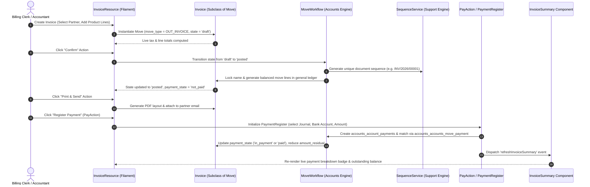

# Plugin: Invoices (`invoices`)

## Status
[VERIFIED]
Active Optional Module. Registered explicitly in `bootstrap/providers.php:49` as `Webkul\Invoice\InvoiceServiceProvider::class`.

## Core/Optional
[VERIFIED]
**Optional Plugin**. Configured as a modular operational invoicing and vendor billing presentation layer without calling `$package->isCore()` (`plugins/webkul/invoices/src/InvoiceServiceProvider.php:17-31`). Execution, Filament resource auto-discovery, cluster mounting, and page registration are gated by runtime installation verification via `Package::isPluginInstalled('invoices')` (`plugins/webkul/invoices/src/InvoicePlugin.php:23`).

## Enabled/Disabled
[VERIFIED]
**Conditionally Enabled (Database-Gated)**. `InvoicePlugin` registers conditionally on the `admin` Filament panel only when the plugin record in the database is marked `is_installed = true` (`plugins/webkul/invoices/src/InvoicePlugin.php:23-25`). When uninstalled, the entire `Invoices` navigation group, including customer invoicing, vendor bills, configuration, and settings screens, remains dormant without registering UI components.

## Purpose
[VERIFIED]
The `invoices` plugin serves as the dedicated operational invoicing, vendor bill management, payment matching, and commercial master data workspace for Aureus ERP. While the foundational `accounts` plugin provides the underlying double-entry ledger engine, calculation managers, and headless resources, and `accounting` provides financial statement reporting and overview dashboard charts, `invoices` delivers the core operational billing workflows:

1. **Customer Invoicing & Credit Notes (`Customers` Cluster)**:
   - Manages the full customer billing lifecycle for sales invoices (`MoveType::OUT_INVOICE`) and customer credit notes / refunds (`MoveType::OUT_REFUND`).
   - Supports line-item drafting with instant product navigation (`openProduct` action in `getProductRepeater()`), automated multi-tax calculations, document confirmation, sequential invoice numbering, print-and-send email dispatch with automatic PDF generation (`PrintAndSendAction`), and dynamic Livewire invoice summaries (`InvoiceSummary`).
   - Provides direct payment registration (`PayAction`) supporting full, partial, and installment payments, and integrates matched payment inspection tabs (`ManagePayments`).

2. **Vendor Bills & Debit Notes (`Vendors` Cluster)**:
   - Manages the purchasing accounts payable lifecycle for vendor bills (`MoveType::IN_INVOICE`) and vendor debit notes / refunds (`MoveType::IN_REFUND`).
   - Facilitates bill validation, payment registration against supplier bank accounts, and matched payment tracking (`ManagePayments`).

3. **Customer & Vendor Master Data Hub**:
   - Provides filtered customer (`customer_rank > 0`) and vendor (`supplier_rank > 0`) master profile management with tabbed sub-navigation for Contacts (`ManageContacts`), Addresses (`ManageAddresses`), and Bank Accounts (`ManageBankAccounts`).
   - Mounts dedicated product catalog management (`ProductResource`) with dynamic sub-navigation tabs that conditionally activate based on installed sibling plugins (Bills of Materials if `manufacturing` is installed, Vendors if `purchases` is installed, Stock Quantities and Stock Moves if `inventories` is installed).

4. **Invoicing Configuration & Settings (`Configuration` & `PluginSettings` Clusters)**:
   - Exposes configuration resources for Taxes (`TaxResource` with dedicated invoice and refund distribution tabs), Tax Groups (`TaxGroupResource`), Payment Terms (`PaymentTermResource`), Product Categories (`ProductCategoryResource`), Product Variant Attributes (`ProductAttributeResource`), Bank Accounts (`BankAccountResource`), Currencies (`CurrencyResource`), and Incoterms (`IncotermResource`).
   - Provides plugin settings (`Products` page under `invoice/settings`) for toggling units of measure (`enable_uom`).

5. **Bidirectional Payment & Document Navigation**:
   - Customizes customer and vendor payment sub-navigation (`ManageInvoices` under Customer Payments, `ManageBills` under Vendor Payments) to allow seamless navigation between registered payments and their underlying commercial documents.

---

## Service Provider
[VERIFIED]
- **Class**: `Webkul\Invoice\InvoiceServiceProvider` (`plugins/webkul/invoices/src/InvoiceServiceProvider.php:13`)
- **Inheritance**: Extends `Webkul\PluginManager\PackageServiceProvider`
- **Registration & Configuration**:
  - `configureCustomPackage(Package $package)`:
    - Sets package name to `invoices` (`InvoiceServiceProvider::$name = 'invoices'`).
    - Registers translation namespace (`hasTranslations()`).
    - Declares runtime plugin dependency on `accounts` (`hasDependencies(['accounts'])`).
    - Configures install command: runs dependency installation and seeders (`$command->installDependencies()->runsSeeders()`).
    - Configures uninstall command: empty closure.
    - Configures plugin icon: `invoices`.
  - `packageBooted()`:
    - Registers Livewire component: `invoice-invoice-summary` (`Webkul\Invoice\Livewire\InvoiceSummary::class`) (`plugins/webkul/invoices/src/InvoiceServiceProvider.php:33-36`).
  - `packageRegistered()`:
    - Registers `InvoicePlugin::make()` with the Filament panel builder (`plugins/webkul/invoices/src/InvoiceServiceProvider.php:38-43`).

---

## Filament Plugin Class
[VERIFIED]
- **Class**: `Webkul\Invoice\InvoicePlugin` (`plugins/webkul/invoices/src/InvoicePlugin.php:9`)
- **Plugin Identifier**: `'invoices'` (`getId(): string`)
- **Panel Registration**: Registers on the **`admin`** panel only (`plugins/webkul/invoices/src/InvoicePlugin.php:28`).
- **Auto-Discovery Configuration**:
  - Resources: `plugins/webkul/invoices/src/Filament/Resources` (`Webkul\Invoice\Filament\Resources`)
  - Pages: `plugins/webkul/invoices/src/Filament/Pages` (`Webkul\Invoice\Filament\Pages`)
  - Clusters: `plugins/webkul/invoices/src/Filament/Clusters` (`Webkul\Invoice\Filament\Clusters`)
  - Widgets: `plugins/webkul/invoices/src/Filament/Widgets` (`Webkul\Invoice\Filament\Widgets`)

---

## Composer Dependencies
[VERIFIED]
- **Declared in `plugins/webkul/invoices/composer.json`**:
  - `webkul/invoices` declares zero package-level Composer `require` dependencies.
  - Autoloads PSR-4 namespaces:
    - `Webkul\Invoice\`: `src/`
    - `Webkul\Invoice\Database\Factories\`: `database/factories/`
    - `Webkul\Invoice\Database\Seeders\`: `database/seeders/`
  - Autoloads dev PSR-4 namespace:
    - `Webkul\Invoice\Tests\`: `tests/`

---

## Runtime Plugin Dependencies
[VERIFIED]
- **`accounts`**: Declared in `InvoiceServiceProvider::configureCustomPackage()` via `->hasDependencies(['accounts'])` (`plugins/webkul/invoices/src/InvoiceServiceProvider.php:21-23`). The `invoices` plugin cannot operate without `accounts`, as it owns no physical tables and derives its entire data model, calculations, transactions, and settings from `accounts`.

---

## Directory Structure
[VERIFIED]
```text
plugins/webkul/invoices/
├── composer.json
├── config/
│   └── filament-shield.php
├── database/
│   ├── factories/
│   │   └── CategoryFactory.php
│   └── seeders/
│       └── DatabaseSeeder.php
├── resources/
│   └── lang/
│       ├── ar/
│       ├── en/
│       │   ├── app.php
│       │   ├── models/
│       │   │   └── product.php
│       │   └── filament/
│       │       ├── clusters/
│       │       │   ├── configurations.php
│       │       │   ├── customers.php
│       │       │   ├── vendors.php
│       │       │   ├── configurations/ (resource translation files)
│       │       │   ├── customers/ (resource translation files)
│       │       │   └── vendors/ (resource translation files)
│       │       └── resources/
│       │           └── payment.php
│       ├── es/
│       ├── fr/
│       └── pt_BR/
└── src/
    ├── InvoicePlugin.php
    ├── InvoiceServiceProvider.php
    ├── Filament/
    │   ├── Clusters/
    │   │   ├── Configuration.php
    │   │   ├── Customers.php
    │   │   ├── PluginSettings.php
    │   │   ├── Vendors.php
    │   │   ├── Configuration/
    │   │   │   └── Resources/
    │   │   │       ├── BankAccountResource.php
    │   │   │       ├── BankAccountResource/ (Pages)
    │   │   │       ├── CurrencyResource.php
    │   │   │       ├── CurrencyResource/ (Pages)
    │   │   │       ├── IncotermResource.php
    │   │   │       ├── IncotermResource/ (Pages)
    │   │   │       ├── PaymentTermResource.php
    │   │   │       ├── PaymentTermResource/ (Pages, RelationManagers)
    │   │   │       ├── ProductAttributeResource.php
    │   │   │       ├── ProductAttributeResource/ (Pages)
    │   │   │       ├── ProductCategoryResource.php
    │   │   │       ├── ProductCategoryResource/ (Pages)
    │   │   │       ├── TaxGroupResource.php
    │   │   │       ├── TaxGroupResource/ (Pages)
    │   │   │       ├── TaxResource.php
    │   │   │       └── TaxResource/ (Pages, RelationManagers)
    │   │   ├── Customers/
    │   │   │   └── Resources/
    │   │   │       ├── CreditNoteResource.php
    │   │   │       ├── CreditNoteResource/ (Pages)
    │   │   │       ├── CustomerResource.php
    │   │   │       ├── CustomerResource/ (Pages)
    │   │   │       ├── InvoiceResource.php
    │   │   │       ├── InvoiceResource/ (Pages)
    │   │   │       ├── PaymentResource.php
    │   │   │       ├── PaymentResource/ (Pages)
    │   │   │       ├── ProductResource.php
    │   │   │       └── ProductResource/ (Pages, Tables)
    │   │   ├── Settings/
    │   │   │   └── Pages/
    │   │   │       └── Products.php
    │   │   └── Vendors/
    │   │       └── Resources/
    │   │           ├── BillResource.php
    │   │           ├── BillResource/ (Pages)
    │   │           ├── PaymentResource.php
    │   │           ├── PaymentResource/ (Pages)
    │   │           ├── ProductResource.php
    │   │           ├── ProductResource/ (Pages, Tables)
    │   │           ├── RefundResource.php
    │   │           ├── RefundResource/ (Pages)
    │   │           ├── VendorResource.php
    │   │           └── VendorResource/ (Pages, RelationManagers)
    │   └── Pages/
    │       └── Settings/
    │           └── Products.php
    ├── Livewire/
    │   └── InvoiceSummary.php
    ├── Models/ (17 extension and proxy models)
    └── Policies/ (16 authorization policy classes)
```

---

## Models
[VERIFIED] [NOT APPLICABLE]
The `invoices` plugin **owns zero distinct physical database tables**. It defines 17 Eloquent proxy and subclass model classes (`plugins/webkul/invoices/src/Models/`) that extend the models defined in `Webkul\Account\Models\*`, `Webkul\Support\Models\*`, `Webkul\Partner\Models\*`, and `Webkul\Product\Models\*` to provide plugin-local namespacing for Filament Shield permissions, chatter tracking, and model label hooks:

1. **`Attribute` (`Webkul\Invoice\Models\Attribute`)**: Subclasses `Webkul\Product\Models\Attribute`.
2. **`BankAccount` (`Webkul\Invoice\Models\BankAccount`)**: Subclasses `Webkul\Partner\Models\BankAccount`.
3. **`Bill` (`Webkul\Invoice\Models\Bill`)**: Subclasses `Webkul\Account\Models\Move` (`MoveType::IN_INVOICE`).
4. **`Category` (`Webkul\Invoice\Models\Category`)**: Subclasses `Webkul\Account\Models\Category` (uses `HasChatter`, sets `ACTIVITY_PLAN_PLUGIN = 'invoices'`, fillable `product_properties_definition`, `property_account_income_category_id`, `property_account_expense_category_id`, `property_account_down_payment_category_id`, defines `creator()` and `products()` relations).
5. **`CreditNote` (`Webkul\Invoice\Models\CreditNote`)**: Subclasses `Webkul\Account\Models\Move` (`MoveType::OUT_REFUND`).
6. **`Currency` (`Webkul\Invoice\Models\Currency`)**: Subclasses `Webkul\Support\Models\Currency`.
7. **`Customer` (`Webkul\Invoice\Models\Customer`)**: Subclasses `Webkul\Account\Models\Customer` (`Partner` filtered by `customer_rank > 0`).
8. **`Incoterm` (`Webkul\Invoice\Models\Incoterm`)**: Subclasses `Webkul\Account\Models\Incoterm`.
9. **`Invoice` (`Webkul\Invoice\Models\Invoice`)**: Subclasses `Webkul\Account\Models\Move` (`MoveType::OUT_INVOICE`).
10. **`Partner` (`Webkul\Invoice\Models\Partner`)**: Subclasses `Webkul\Account\Models\Partner`.
11. **`Payment` (`Webkul\Invoice\Models\Payment`)**: Subclasses `Webkul\Account\Models\Payment`.
12. **`PaymentTerm` (`Webkul\Invoice\Models\PaymentTerm`)**: Subclasses `Webkul\Account\Models\PaymentTerm`.
13. **`Product` (`Webkul\Invoice\Models\Product`)**: Subclasses `Webkul\Account\Models\Product` (overrides `getModelTitle()` and `getLogAttributeLabels()`).
14. **`Refund` (`Webkul\Invoice\Models\Refund`)**: Subclasses `Webkul\Account\Models\Move` (`MoveType::IN_REFUND`).
15. **`Tax` (`Webkul\Invoice\Models\Tax`)**: Subclasses `Webkul\Account\Models\Tax`.
16. **`TaxGroup` (`Webkul\Invoice\Models\TaxGroup`)**: Subclasses `Webkul\Account\Models\TaxGroup`.
17. **`Vendor` (`Webkul\Invoice\Models\Vendor`)**: Subclasses `Webkul\Account\Models\Vendor` (`Partner` filtered by `supplier_rank > 0`).

---

## Database
[VERIFIED] [NOT APPLICABLE]
The `invoices` plugin **owns zero physical database tables** and registers **zero database migrations** (`plugins/webkul/invoices/database/migrations` does not exist).

All physical schemas (`accounts_account_moves`, `accounts_account_move_lines`, `accounts_accounts`, `accounts_journals`, `accounts_taxes`, `accounts_tax_groups`, `accounts_tax_repartition_lines`, `accounts_fiscal_positions`, `accounts_payment_terms`, `accounts_account_payments`, `accounts_accounts_move_payment`, `accounts_partial_reconciles`, `accounts_full_reconciles`), foreign key constraints, indexes, and company isolation scopes are physically defined and owned by `accounts`.

For comprehensive database schema diagrams, column definitions, foreign keys, indexes, and multi-company scoping rules, refer to the verified Phase 4 ERD document: [`docs/database/erds/finance.md`](../database/erds/finance.md) and the plugin documentation: [`docs/plugins/accounts.md`](accounts.md).

- **Seeders**: `DatabaseSeeder` (`plugins/webkul/invoices/database/seeders/DatabaseSeeder.php:7`) defines an empty run method (`$this->call([])`).
- **Factories**: `CategoryFactory` (`plugins/webkul/invoices/database/factories/CategoryFactory.php:11`) extends `AccountCategoryFactory` with `product_properties_definition` state management.

---

## Filament Resources, Pages, Widgets & Clusters
[VERIFIED]
The `invoices` plugin organizes its user interface into 4 clusters under `NavigationGroup::Invoice`, providing 18 resources, 1 settings page, and 1 specialized Livewire summary component:

### 1. Navigation Clusters
All clusters register under `NavigationGroup::Invoice`:
1. **`Configuration` Cluster** (`Webkul\Invoice\Filament\Clusters\Configuration`): Slug `invoices/configurations` (Navigation Sort: 0).
2. **`Customers` Cluster** (`Webkul\Invoice\Filament\Clusters\Customers`): Slug `invoices/customers`.
3. **`Vendors` Cluster** (`Webkul\Invoice\Filament\Clusters\Vendors`): Slug `invoices/vendors`.
4. **`PluginSettings` Cluster** (`Webkul\Invoice\Filament\Clusters\PluginSettings`): Slug `invoice/settings` (Navigation Sort: 4).

---

### 2. Operational Invoicing Workflow (Customer Invoices vs. Vendor Bills)

#### Customer Invoicing Suite (`Customers` Cluster)
- **`InvoiceResource`** (`plugins/webkul/invoices/src/Filament/Clusters/Customers/Resources/InvoiceResource.php:19`):
  - Model: `Webkul\Invoice\Models\Invoice` (`MoveType::OUT_INVOICE`)
  - Navigation Sort: 1 (Enabled: `$shouldRegisterNavigation = true`)
  - Summary Component: `Webkul\Invoice\Livewire\InvoiceSummary::class`
  - Record Sub-Navigation: `ViewInvoice`, `EditInvoice`, `ManagePayments`
  - Product Repeater: Extends base product repeater with `openProduct` action (`heroicon-m-arrow-top-right-on-square`) opening `ProductResource::getUrl('edit', ...)` in a new tab.
  - Pages:
    - `ListInvoices`: `/`
    - `CreateInvoice`: `/create`
    - `ViewInvoice`: `/{record}` (Header actions: `ChatterAction`, `PrintAndSendAction`, `PreviewAction`, `PayAction`, `ConfirmAction`, `CancelAction`, `SetAsCheckedAction`, `ReverseAction` linking to `CreditNoteResource`, `ResetToDraftAction`, `DeleteAction`)
    - `EditInvoice`: `/{record}/edit`
    - `ManagePayments`: `/{record}/payments` (Sub-navigation table displaying matched payment lines linking to `PaymentResource` view/edit)
- **`CreditNoteResource`** (`plugins/webkul/invoices/src/Filament/Clusters/Customers/Resources/CreditNoteResource.php:19`):
  - Model: `Webkul\Invoice\Models\CreditNote` (`MoveType::OUT_REFUND`)
  - Navigation Sort: 2
  - Record Sub-Navigation: `ViewCreditNote`, `EditCreditNote`, `ManagePayments`
  - Product Repeater: Features `openProduct` action.
  - Pages: `ListCreditNotes`, `CreateCreditNote`, `ViewCreditNote`, `EditCreditNote`, `ManagePayments`.
- **`PaymentResource`** (`plugins/webkul/invoices/src/Filament/Clusters/Customers/Resources/PaymentResource.php:15`):
  - Model: `Webkul\Invoice\Models\Payment`
  - Navigation Sort: 4
  - Record Sub-Navigation: `ViewPayment`, `EditPayment`, `ManageInvoices`
  - Pages:
    - `ListPayments`: `/`
    - `CreatePayment`: `/create`
    - `ViewPayment`: `/{record}`
    - `EditPayment`: `/{record}/edit`
    - `ManageInvoices`: `/{record}/invoices` (Sub-navigation table showing invoices settled by this payment, dynamically linking to `InvoiceResource` or `CreditNoteResource` based on `move_type`)
- **`CustomerResource`** (`plugins/webkul/invoices/src/Filament/Clusters/Customers/Resources/CustomerResource.php:17`):
  - Model: `Webkul\Invoice\Models\Customer` (`Partner` where `customer_rank > 0`)
  - Navigation Sort: 6
  - Record Sub-Navigation: `ViewCustomer`, `EditCustomer`, `ManageContacts`, `ManageAddresses`, `ManageBankAccounts`.
  - Pages: `ListCustomers`, `CreateCustomer`, `ViewCustomer`, `EditCustomer`, `ManageContacts`, `ManageAddresses`, `ManageBankAccounts`.
- **`ProductResource`** (`plugins/webkul/invoices/src/Filament/Clusters/Customers/Resources/ProductResource.php:23`):
  - Model: `Webkul\Invoice\Models\Product`
  - Navigation Sort: 5
  - Dynamic Sub-Navigation & Pages:
    - Base: `ViewProduct`, `EditProduct`, `ManageAttributes`, `ManageVariants`
    - If `manufacturing` installed: `ManageBillsOfMaterials` (`/{record}/boms`)
    - If `purchases` installed: `ManageVendors` (`/{record}/vendors`)
    - If `inventories` installed: `ManageQuantities` (`/{record}/quantities`), `ManageMoves` (`/{record}/moves`)
  - Table: `ProductsTable::configure(parent::table($table))`.

---

#### Vendor Bills Suite (`Vendors` Cluster)
- **`BillResource`** (`plugins/webkul/invoices/src/Filament/Clusters/Vendors/Resources/BillResource.php:19`):
  - Model: `Webkul\Invoice\Models\Bill` (`MoveType::IN_INVOICE`)
  - Navigation Sort: 1 (Icon: `heroicon-o-credit-card`)
  - Summary Component: `Webkul\Invoice\Livewire\InvoiceSummary::class`
  - Record Sub-Navigation: `ViewBill`, `EditBill`, `ManagePayments`
  - Product Repeater: Features `openProduct` action.
  - Pages:
    - `ListBills`: `/`
    - `CreateBill`: `/create`
    - `ViewBill`: `/{record}`
    - `EditBill`: `/{record}/edit`
    - `ManagePayments`: `/{record}/payments` (Sub-navigation table displaying matched payment lines linking to `PaymentResource` view/edit)
- **`RefundResource`** (`plugins/webkul/invoices/src/Filament/Clusters/Vendors/Resources/RefundResource.php:16`):
  - Model: `Webkul\Invoice\Models\Refund` (`MoveType::IN_REFUND`)
  - Navigation Sort: 2
  - Record Sub-Navigation: `ViewRefund`, `EditRefund`, `ManagePayments`
  - Pages: `ListRefunds`, `CreateRefund`, `ViewRefund`, `EditRefund`, `ManagePayments`.
- **`PaymentResource`** (`plugins/webkul/invoices/src/Filament/Clusters/Vendors/Resources/PaymentResource.php:15`):
  - Model: `Webkul\Invoice\Models\Payment`
  - Navigation Sort: 3
  - Record Sub-Navigation: `ViewPayment`, `EditPayment`, `ManageBills`
  - Pages:
    - `ListPayments`: `/`
    - `CreatePayment`: `/create`
    - `ViewPayment`: `/{record}`
    - `EditPayment`: `/{record}/edit`
    - `ManageBills`: `/{record}/bills` (Sub-navigation table showing bills settled by this payment, dynamically linking to `BillResource` or `RefundResource` based on `move_type`)
- **`VendorResource`** (`plugins/webkul/invoices/src/Filament/Clusters/Vendors/Resources/VendorResource.php:19`):
  - Model: `Webkul\Invoice\Models\Vendor` (`Partner` where `supplier_rank > 0`)
  - Navigation Sort: 5
  - Relations: `BankAccountsRelationManager`
  - Record Sub-Navigation: `ViewVendor`, `EditVendor`, `ManageContacts`, `ManageAddresses`, `ManageBankAccounts`.
  - Pages: `ListVendors`, `CreateVendor`, `EditVendor`, `ViewVendor`, `ManageContacts`, `ManageAddresses`, `ManageBankAccounts`.
- **`ProductResource`** (`plugins/webkul/invoices/src/Filament/Clusters/Vendors/Resources/ProductResource.php:24`):
  - Model: `Webkul\Invoice\Models\Product`
  - Navigation Sort: 4 (Icon: `heroicon-o-shopping-bag`)
  - Uses `HasCustomFields`
  - Dynamic Sub-Navigation & Pages: Matches customer `ProductResource` structure with conditional tabs for BOMs, Vendors, Quantities, and Moves.

---

### 3. Invoices vs. Bills Filament UI Comparison

| Feature / UI Dimension | Customer Invoices (`InvoiceResource`) | Vendor Bills (`BillResource`) |
|:---|:---|:---|
| **Cluster** | `Customers` (`invoices/customers`) | `Vendors` (`invoices/vendors`) |
| **Model** | `Webkul\Invoice\Models\Invoice` (`MoveType::OUT_INVOICE`) | `Webkul\Invoice\Models\Bill` (`MoveType::IN_INVOICE`) |
| **Navigation Sort** | 1 | 1 |
| **Navigation Icon** | Default | `heroicon-o-credit-card` |
| **Reversal Resource** | `CreditNoteResource` (`MoveType::OUT_REFUND`) | `RefundResource` (`MoveType::IN_REFUND`) |
| **Reversal Label** | Add Credit Note (`ReverseAction`) | Add Debit Note / Refund |
| **Payment Registration** | `PayAction` (Inbound `PaymentType::RECEIVE`) | `PayAction` (Outbound `PaymentType::SEND`) |
| **Payment Sub-Nav Tab** | `ManagePayments` (`/{record}/payments`) | `ManagePayments` (`/{record}/payments`) |
| **Payment Back-Link** | `PaymentResource/Pages/ManageInvoices` (`/{record}/invoices`) | `PaymentResource/Pages/ManageBills` (`/{record}/bills`) |
| **Email & PDF Action** | `PrintAndSendAction` with customer template | Standard print/preview |
| **Partner Model** | `Customer` (`customer_rank > 0`) | `Vendor` (`supplier_rank > 0`) |
| **Summary Component** | `InvoiceSummary` (`invoice-invoice-summary`) | `InvoiceSummary` (`invoice-invoice-summary`) |

---

### 4. Configuration Cluster Resources (`Configuration`)
- **`BankAccountResource`** (`plugins/webkul/invoices/src/Filament/Clusters/Configuration/Resources/BankAccountResource.php:10`):
  - Navigation Sort: 1. Pages: `ListBankAccounts`.
- **`IncotermResource`** (`plugins/webkul/invoices/src/Filament/Clusters/Configuration/Resources/IncotermResource.php:10`):
  - Navigation Sort: 2. Pages: `ManageIncoterms`.
- **`PaymentTermResource`** (`plugins/webkul/invoices/src/Filament/Clusters/Configuration/Resources/PaymentTermResource.php:15`):
  - Navigation Sort: 3. Pages: `ListPaymentTerms`, `CreatePaymentTerm`, `ViewPaymentTerm`, `EditPaymentTerm`.
- **`ProductCategoryResource`** (`plugins/webkul/invoices/src/Filament/Clusters/Configuration/Resources/ProductCategoryResource.php:15`):
  - Navigation Sort: 4. Sub-Navigation: `ViewProductCategory`, `EditProductCategory`, `ManageProducts`. Pages: `ListProductCategories`, `CreateProductCategory`, `ViewProductCategory`, `EditProductCategory`, `ManageProducts` (`/{record}/products`).
- **`ProductAttributeResource`** (`plugins/webkul/invoices/src/Filament/Clusters/Configuration/Resources/ProductAttributeResource.php:13`):
  - Navigation Sort: 5. Pages: `ListProductAttributes`, `CreateProductAttribute`, `ViewProductAttribute`, `EditProductAttribute`.
- **`CurrencyResource`** (`plugins/webkul/invoices/src/Filament/Clusters/Configuration/Resources/CurrencyResource.php:13`):
  - Navigation Sort: 6. Pages: `ListCurrencies`, `CreateCurrency`, `EditCurrency`, `ViewCurrency`.
- **`TaxGroupResource`** (`plugins/webkul/invoices/src/Filament/Clusters/Configuration/Resources/TaxGroupResource.php:13`):
  - Navigation Sort: 7. Pages: `ListTaxGroups`, `CreateTaxGroup`, `ViewTaxGroup`, `EditTaxGroup`.
- **`TaxResource`** (`plugins/webkul/invoices/src/Filament/Clusters/Configuration/Resources/TaxResource.php:15`):
  - Navigation Sort: 8. Pages: `ListTaxes`, `CreateTax`, `ViewTax`, `EditTax`, `ManageDistributionForInvoice` (`/{record}/manage-distribution-for-invoice`), `ManageDistributionForRefund` (`/{record}/manage-distribution-for-refunds`).

---

### 5. Settings Pages (`PluginSettings` Cluster)
- **`Products` Page** (`plugins/webkul/invoices/src/Filament/Pages/Settings/Products.php:9` & `plugins/webkul/invoices/src/Filament/Clusters/Settings/Pages/Products.php:12`):
  - Cluster: `PluginSettings` (`invoice/settings`)
  - Permission: `page_invoice_products`
  - Settings Class: `Webkul\Product\Settings\ProductSettings`
  - Field: `enable_uom` (Toggle: Unit of Measure).

---

### 6. Livewire Summary Component
- **`InvoiceSummary`** (`plugins/webkul/invoices/src/Livewire/InvoiceSummary.php:15`):
  - Registered as `invoice-invoice-summary` in `InvoiceServiceProvider::packageBooted()`.
  - Overrides `getResourceUrl($record)` to dynamically route move records to the `invoices` cluster resources:
    - `MoveType::OUT_INVOICE` → `InvoiceResource::getUrl('view', ...)`
    - `MoveType::IN_INVOICE` → `BillResource::getUrl('view', ...)`
    - `MoveType::OUT_REFUND` → `CreditNoteResource::getUrl('view', ...)`
    - `MoveType::IN_REFUND` → `RefundResource::getUrl('view', ...)`
    - `MoveType::ENTRY` (Payments) → `CustomerPaymentResource` (customer/company) or `VendorPaymentResource` (supplier).

---

## Panels
[VERIFIED]
Registers on the **`admin`** panel only (`plugins/webkul/invoices/src/InvoicePlugin.php:28`). Does not register on the `customer` portal panel.

---

## Services
[VERIFIED]
The `invoices` plugin defines **zero custom service classes**. All financial computation, move state transitions, tax calculations, payment registration, and sequence evaluations are executed by services defined in `accounts` (`Webkul\Account\Services\MoveWorkflow`, `TaxManager`, `AccountManager`, `PaymentRegistrar`) and `support` (`Webkul\Support\Services\SequenceService`).

---

## Events
[VERIFIED]
The `invoices` plugin defines **zero custom event classes**. All lifecycle events (`MoveCreated`, `MoveConfirmed`, `MovePaid`, `MoveCancelled`, `MoveReversed`) are fired by `accounts`.

---

## Listeners
[VERIFIED]
The `invoices` plugin defines **zero event listeners**.

---

## Observers
[VERIFIED]
The `invoices` plugin defines **zero model observers**.

---

## Policies
[VERIFIED]
The `invoices` module registers 16 authorization policies under `plugins/webkul/invoices/src/Policies/`. Each policy enforces granular Filament Shield permissions prefixed with `..._invoice_...`:

| Policy Class | Model | Verified Permissions Enforced |
|:---|:---|:---|
| `InvoicePolicy` | `Webkul\Invoice\Models\Invoice` | `view_any_invoice_invoice`, `view_invoice_invoice`, `create_invoice_invoice`, `update_invoice_invoice`, `delete_invoice_invoice`, `delete_any_invoice_invoice` |
| `BillPolicy` | `Webkul\Invoice\Models\Bill` | `view_any_invoice_bill`, `view_invoice_bill`, `create_invoice_bill`, `update_invoice_bill`, `delete_invoice_bill`, `delete_any_invoice_bill` |
| `CreditNotePolicy` | `Webkul\Invoice\Models\CreditNote` | `view_any_invoice_credit_note`, `view_invoice_credit_note`, `create_invoice_credit_note`, `update_invoice_credit_note`, `delete_invoice_credit_note`, `delete_any_invoice_credit_note` |
| `RefundPolicy` | `Webkul\Invoice\Models\Refund` | `view_any_invoice_refund`, `view_invoice_refund`, `create_invoice_refund`, `update_invoice_refund`, `delete_invoice_refund`, `delete_any_invoice_refund` |
| `PaymentPolicy` | `Webkul\Invoice\Models\Payment` | `view_any_invoice_payment`, `view_invoice_payment`, `create_invoice_payment`, `update_invoice_payment`, `delete_invoice_payment`, `delete_any_invoice_payment` |
| `CustomerPolicy` | `Webkul\Invoice\Models\Customer` | `view_any_invoice_customer`, `view_invoice_customer`, `create_invoice_customer`, `update_invoice_customer`, `delete_invoice_customer`, `delete_any_invoice_customer`, `force_delete_invoice_customer`, `force_delete_any_invoice_customer`, `restore_invoice_customer`, `restore_any_invoice_customer` |
| `VendorPolicy` | `Webkul\Invoice\Models\Vendor` | `view_any_invoice_vendor`, `view_invoice_vendor`, `create_invoice_vendor`, `update_invoice_vendor`, `delete_invoice_vendor`, `delete_any_invoice_vendor`, `force_delete_invoice_vendor`, `force_delete_any_invoice_vendor`, `restore_invoice_vendor`, `restore_any_invoice_vendor` |
| `ProductPolicy` | `Webkul\Invoice\Models\Product` | `view_any_invoice_product`, `view_invoice_product`, `create_invoice_product`, `update_invoice_product`, `delete_invoice_product`, `delete_any_invoice_product`, `force_delete_invoice_product`, `force_delete_any_invoice_product`, `restore_invoice_product`, `restore_any_invoice_product` |
| `CategoryPolicy` | `Webkul\Invoice\Models\Category` | `view_any_invoice_category`, `view_invoice_category`, `create_invoice_category`, `update_invoice_category`, `delete_invoice_category`, `delete_any_invoice_category` |
| `AttributePolicy` | `Webkul\Invoice\Models\Attribute` | `view_any_invoice_product::attribute`, `view_invoice_product::attribute`, `create_invoice_product::attribute`, `update_invoice_product::attribute`, `delete_invoice_product::attribute`, `delete_any_invoice_product::attribute`, `force_delete_invoice_product::attribute`, `force_delete_any_invoice_product::attribute`, `restore_invoice_product::attribute`, `restore_any_invoice_product::attribute` |
| `BankAccountPolicy` | `Webkul\Invoice\Models\BankAccount` | `view_any_invoice_bank_account`, `view_invoice_bank_account`, `create_invoice_bank_account`, `update_invoice_bank_account`, `delete_invoice_bank_account`, `delete_any_invoice_bank_account`, `force_delete_invoice_bank_account`, `force_delete_any_invoice_bank_account`, `restore_invoice_bank_account`, `restore_any_invoice_bank_account` |
| `PaymentTermPolicy` | `Webkul\Invoice\Models\PaymentTerm` | `view_any_invoice_payment::term`, `view_invoice_payment::term`, `create_invoice_payment::term`, `update_invoice_payment::term`, `delete_invoice_payment::term`, `delete_any_invoice_payment::term`, `force_delete_invoice_payment::term`, `force_delete_any_invoice_payment::term`, `restore_invoice_payment::term`, `restore_any_invoice_payment::term` |
| `TaxPolicy` | `Webkul\Invoice\Models\Tax` | `view_any_invoice_tax`, `view_invoice_tax`, `create_invoice_tax`, `update_invoice_tax`, `delete_invoice_tax`, `delete_any_invoice_tax` |
| `TaxGroupPolicy` | `Webkul\Invoice\Models\TaxGroup` | `view_any_invoice_tax::group`, `view_invoice_tax::group`, `create_invoice_tax::group`, `update_invoice_tax::group`, `delete_invoice_tax::group`, `delete_any_invoice_tax::group` |
| `IncotermPolicy` | `Webkul\Invoice\Models\Incoterm` | `view_any_invoice_incoterm`, `view_invoice_incoterm`, `create_invoice_incoterm`, `update_invoice_incoterm`, `delete_invoice_incoterm`, `delete_any_invoice_incoterm`, `force_delete_invoice_incoterm`, `force_delete_any_invoice_incoterm`, `restore_invoice_incoterm`, `restore_any_invoice_incoterm` |
| `CurrencyPolicy` | `Webkul\Invoice\Models\Currency` | `view_any_invoice_currency`, `view_invoice_currency`, `create_invoice_currency`, `update_invoice_currency`, `delete_invoice_currency`, `delete_any_invoice_currency`, `force_delete_invoice_currency`, `force_delete_any_invoice_currency`, `restore_invoice_currency`, `restore_any_invoice_currency` |

---

## Routes
[VERIFIED]
The `invoices` plugin defines **zero custom HTTP or API routes** and contains no `routes/` directory. All finance REST API endpoints are registered and served exclusively by `accounts`.

---

## Settings
[VERIFIED]
The `invoices` plugin registers 1 settings page under `plugins/webkul/invoices/src/Filament/Pages/Settings/Products.php` within the `PluginSettings` cluster (`invoice/settings`), enabling administrators to configure `Webkul\Product\Settings\ProductSettings::$enable_uom`.

---

## Translations
[VERIFIED]
The `invoices` module registers the translation namespace `invoices` (`resources/lang/`):
- Supported Locales: `ar`, `en`, `es`, `fr`, `pt_BR`.
- Key English Translation Files (`resources/lang/en/`):
  - `app.php`: Settings and navigation labels.
  - `models/product.php`: Product model title and audit log attribute labels.
  - `filament/clusters/customers.php`, `vendors.php`, `configurations.php`: Navigation group and cluster headers.
  - `filament/clusters/customers/resources/invoice.php`, `credit-note.php`, `payment.php`, `products.php`: Form, table, and action labels for customer invoicing.
  - `filament/clusters/vendors/resources/bill.php`, `refund.php`, `payment.php`, `product.php`: Form, table, and action labels for vendor billing.
  - `filament/clusters/configurations/resources/*.php`: Labels for Tax, Tax Group, Payment Term, Category, Attribute, Currency, and Incoterm resources.

---

## Tests
[VERIFIED]
- **Test Presence**: The `invoices` plugin **has zero test files** (no `tests/` directory exists).
- **Testing Rationale**: The `invoices` module is a pure Filament presentation and cluster routing layer over `accounts`. All business logic, tax calculation formulas, move workflow state machines, and payment registration flows are thoroughly tested in `plugins/webkul/accounts/tests/` and downstream integration tests in `plugins/webkul/sales/tests/` and `plugins/webkul/purchases/tests/`.

---

## Runtime Dependencies
[VERIFIED]
- **`accounts`**: Required runtime dependency declared via `->hasDependencies(['accounts'])`. Provides all physical database tables, Eloquent models, general ledger posting workflows, payment allocation engines, and base Filament schemas.

---

## Cross-Plugin Relationships
[VERIFIED]
1. **`accounts`**: Host foundation. `invoices` subclasses `accounts` models (`Move`, `Payment`, `Tax`, `PaymentTerm`, `Category`), extends its base Filament resources, and consumes its business services (`MoveWorkflow`, `PaymentRegister`).
2. **`partners`**: Supplies `Customer` and `Vendor` proxy base models, addresses, and bank accounts.
3. **`products`**: Supplies line-item product models, category hierarchy, variant attributes, and unit-of-measure configuration.
4. **`support`**: Provides multi-company tenant scoping (`CompanyContext`), document sequence numbering (`SequenceService`), currency formatting, and navigation enums (`NavigationGroup::Invoice`).
5. **`security`**: Provides `User` model, Filament Shield permission policies (`..._invoice_...`), and Bouncer authorization integration.
6. **`chatter`**: Supplies `HasChatter` trait for activity planning and message audit trails on `Category` and invoice moves.
7. **`sales` (Downstream Dependant)**: Upstream sales order workflows link directly to `invoices` customer invoicing resources via `sales_order_invoices` junction table.
8. **`purchases` (Downstream Dependant)**: Upstream purchase order workflows link directly to `invoices` vendor bill resources via `purchases_order_account_moves` junction table.
9. **`payments` (Downstream Dependant)**: External transaction gateway integration extends invoice payment allocation records.
10. **`manufacturing` & `inventories` (Optional Integration)**: `ProductResource` dynamically adds BOM, Stock Quantities, and Stock Moves tabs if these modules are installed.

---

## Data Flow
[VERIFIED]



---

## Business Rules
[VERIFIED]
1. **Separation of Invoicing & Billing Workspaces**:
   - Customer sales invoices (`OUT_INVOICE`) and customer refunds (`OUT_REFUND`) are strictly segregated into the `Customers` cluster (`invoices/customers`), while vendor purchase bills (`IN_INVOICE`) and vendor refunds (`IN_REFUND`) are segregated into the `Vendors` cluster (`invoices/vendors`).
2. **Product Line Deep-Navigation**:
   - The product line repeater in both `InvoiceResource`, `BillResource`, and `CreditNoteResource` injects an `openProduct` action allowing billing clerks to open the product catalog card in a new browser tab directly from a draft invoice line.
3. **Sub-Navigation Matched Payment Inspection**:
   - Invoices and bills feature a `ManagePayments` record navigation tab that queries all partial reconciliations and matched payments linked to that move. Reciprocally, payments feature `ManageInvoices` (Customer payments) or `ManageBills` (Vendor payments) linking directly back to the commercial documents settled by that payment.
4. **Conditional Master Data Sub-Navigation**:
   - `ProductResource` inspects runtime module availability via `Package::isPluginInstalled()`, dynamically attaching `ManageBillsOfMaterials` (if `manufacturing` is present), `ManageVendors` (if `purchases` is present), and `ManageQuantities`/`ManageMoves` (if `inventories` is present).
5. **Partial, Installment & Full Payment Allocation**:
   - `PayAction` initializes `PaymentRegister` against the active move's unreconciled payment term lines, computing default amounts, validating bank accounts for electronic payment method lines, and allowing toggle between full settlement and installment installments.
6. **Immutability of Posted Financial Documents**:
   - Deletion of posted moves is strictly prohibited (`DeleteAction` is hidden when `state = 'posted'`). Adjustments must be performed by issuing reversing credit notes via `ReverseAction`.

---

## Extension Points
[VERIFIED]
1. **Dynamic Product Sub-Navigation**:
   - Custom or third-party plugins can inject sub-navigation pages into `ProductResource` by following the `Package::isPluginInstalled()` pattern used for manufacturing and inventory tabs.
2. **Custom Invoice Action Handlers**:
   - Header actions on `ViewInvoice` and `ViewBill` can be extended to support electronic invoicing (e-invoicing / ZATCA / PEPPOL) or custom PDF rendering engines.
3. **Cluster Resource Injection**:
   - Sibling plugins can mount custom pages or resources into `Customers`, `Vendors`, `Configuration`, or `PluginSettings` clusters by setting `protected static ?string $cluster = Webkul\Invoice\Filament\Clusters\...::class`.

---

## Dangerous Areas
[VERIFIED]
- **Test Presence**: The `invoices` plugin **has zero test files** (no `tests/` folder). Changes to Filament resource schemas, product repeater actions, or sub-navigation routes must be manually verified or tested via `accounts` and downstream feature test suites.
- **Sibling Module Navigation Collision**:
  - When both `invoices` and `accounting` plugins are simultaneously installed, each registers navigation clusters and resources under different navigation groups (`NavigationGroup::Invoice` for `invoices` vs `NavigationGroup::Accounting` for `accounting`). Role permissions must be carefully configured via Filament Shield to prevent duplicate menu clutter for administrators.
- **Payment Method Bank Account Validation**:
  - In `PayAction`, selecting electronic or bank transfer payment methods requires a valid partner bank account linked to the journal's company. Missing bank configurations will cause payment registration transactions to halt.
- **Livewire Summary Dynamic Routing**:
  - `InvoiceSummary::getResourceUrl()` relies on exact enum string matching against `move_type` and `partner_type`. If an unhandled move type is processed, it returns `null`, preventing URL navigation from the summary badge.

---

## Change Impact
[VERIFIED]
- **Downstream Module Breakages**:
  - The `sales` and `purchases` plugins declare runtime dependencies on `invoices` (`hasDependencies(['invoices'])`). Modifying resource URLs, model classes, or cluster slug structures in `invoices` directly impacts sales order invoice generation and purchase order bill generation.
- **Filament Shield Role Permissions**:
  - Modifying model class names under `Webkul\Invoice\Models\` will alter generated Shield permission keys (`..._invoice_...`), requiring role permission resets in production environments.

---

## Evidence
[VERIFIED]
- **Package Configuration & Dependency**: `plugins/webkul/invoices/src/InvoiceServiceProvider.php:13-44`
- **Plugin Lifecycle & Discovery**: `plugins/webkul/invoices/src/InvoicePlugin.php:9-53`
- **Navigation Groups & Clusters**:
  - `plugins/webkul/invoices/src/Filament/Clusters/Customers.php:8-21`
  - `plugins/webkul/invoices/src/Filament/Clusters/Vendors.php:8-21`
  - `plugins/webkul/invoices/src/Filament/Clusters/Configuration.php:8-23`
  - `plugins/webkul/invoices/src/Filament/Clusters/PluginSettings.php:8-23`
- **Customer Invoicing Suite**:
  - `plugins/webkul/invoices/src/Filament/Clusters/Customers/Resources/InvoiceResource.php:19-80`
  - `plugins/webkul/invoices/src/Filament/Clusters/Customers/Resources/CreditNoteResource.php:19-87`
  - `plugins/webkul/invoices/src/Filament/Clusters/Customers/Resources/PaymentResource.php:15-56`
  - `plugins/webkul/invoices/src/Filament/Clusters/Customers/Resources/PaymentResource/Pages/ManageInvoices.php:15-56`
  - `plugins/webkul/invoices/src/Filament/Clusters/Customers/Resources/CustomerResource.php:17-52`
  - `plugins/webkul/invoices/src/Filament/Clusters/Customers/Resources/ProductResource.php:23-101`
- **Vendor Billing Suite**:
  - `plugins/webkul/invoices/src/Filament/Clusters/Vendors/Resources/BillResource.php:19-91`
  - `plugins/webkul/invoices/src/Filament/Clusters/Vendors/Resources/RefundResource.php:16-67`
  - `plugins/webkul/invoices/src/Filament/Clusters/Vendors/Resources/PaymentResource.php:15-61`
  - `plugins/webkul/invoices/src/Filament/Clusters/Vendors/Resources/PaymentResource/Pages/ManageBills.php:15-56`
  - `plugins/webkul/invoices/src/Filament/Clusters/Vendors/Resources/VendorResource.php:19-69`
  - `plugins/webkul/invoices/src/Filament/Clusters/Vendors/Resources/ProductResource.php:24-101`
- **Configuration & Settings**:
  - `plugins/webkul/invoices/src/Filament/Clusters/Configuration/Resources/TaxResource.php:15-51`
  - `plugins/webkul/invoices/src/Filament/Clusters/Configuration/Resources/PaymentTermResource.php:15-59`
  - `plugins/webkul/invoices/src/Filament/Clusters/Configuration/Resources/ProductCategoryResource.php:15-54`
  - `plugins/webkul/invoices/src/Filament/Pages/Settings/Products.php:9-16`
- **Livewire Summary**: `plugins/webkul/invoices/src/Livewire/InvoiceSummary.php:15-33`
- **Models & Traits**: `plugins/webkul/invoices/src/Models/` (17 models)
- **Shield Configuration & Policies**: `plugins/webkul/invoices/config/filament-shield.php:31-64`, `plugins/webkul/invoices/src/Policies/` (16 policy classes)
