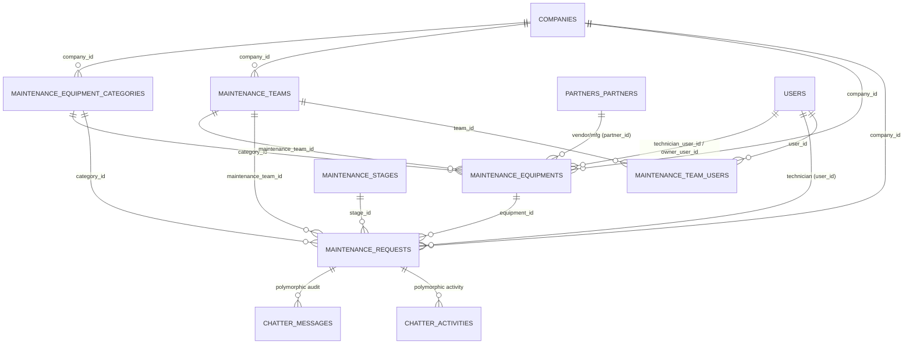
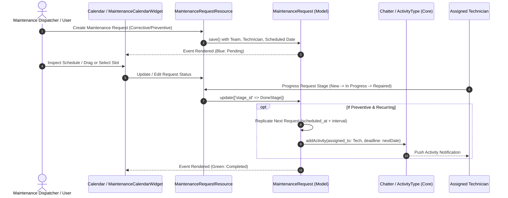

# Plugin: Maintenance (`maintenance`)

## Status
[VERIFIED]
Active Optional Module. Registered in `bootstrap/providers.php:50` as `Webkul\Maintenance\MaintenanceServiceProvider::class`.

## Core/Optional
[VERIFIED]
**Optional Plugin**. Configured as an optional domain module without calling `$package->isCore()` (`plugins/webkul/maintenance/src/MaintenanceServiceProvider.php:19-45`). Execution and Filament UI contribution are gated by runtime installation verification via `Package::isPluginInstalled('maintenance')` (`plugins/webkul/maintenance/src/MaintenancePlugin.php:24`).

## Enabled/Disabled
[VERIFIED]
**Conditionally Enabled (Database-Gated)**. `MaintenanceServiceProvider` registers package capabilities, migrations, seeders, and translations, but Filament admin panel resources, pages, clusters, and widgets are discovered and registered only when `Package::isPluginInstalled('maintenance')` returns `true` (`plugins/webkul/maintenance/src/MaintenancePlugin.php:24-53`).

## Purpose
[VERIFIED]
The `maintenance` module provides physical equipment asset lifecycle management, maintenance request tracking, preventive service scheduling automation, technician work allocation, and calendar dispatching for Aureus ERP:

1. **Equipment Asset Management (`Equipment`)**:
   - Manages physical machinery and equipment asset records (`maintenance_equipments`) with serial numbers (`serial_no`), model identifiers (`model`), vendor links (`partner_id`), internal locations (`location`), effective/warranty dates (`effective_date`, `warranty_date`), and purchase costs (`cost`).
   - Tracks Mean Time Between Failures (`expected_mtbf`), total maintenance interventions (`maintenance_count`), and current active open repair tickets (`maintenance_open_count`).
   - Assigns asset ownership to custodians (`owner_user_id`), designated engineering teams (`maintenance_team_id`), and responsible technicians (`technician_user_id`).

2. **Categorization & Specialization (`EquipmentCategory`)**:
   - Classifies equipment into organizational taxonomies (`maintenance_equipment_categories`) with default technician assignments (`technician_user_id`) that automatically propagate to associated equipment and requests.

3. **Maintenance Engineering Teams (`Team`)**:
   - Organizes maintenance personnel into dedicated service teams (`maintenance_teams`) and assigns multiple technicians via the `maintenance_team_users` junction table (`team_id` ↔ `user_id`).

4. **Maintenance Request Workflow & Ticketing (`MaintenanceRequest`)**:
   - Dispatches corrective breakdown repairs and scheduled preventive maintenance tickets (`maintenance_requests`) across customizable status stages (`maintenance_stages`).
   - Tracks repair priority (`priority`, 0–3), requested dates (`requested_at`), scheduled execution timestamps (`scheduled_at`), repair duration (`duration`), and closure timestamps (`closed_at`).
   - Integrates rich multi-format standard operating procedure (SOP) instructions supporting uploaded PDFs (with inline iframe viewer), Google Slide presentations (with auto-converted `/preview` embed), and structured text notes.

5. **Automated Recurring Preventive Maintenance Engine**:
   - Automatically computes recurring maintenance schedules based on configurable intervals (`repeat_interval`) and units (`day`, `week`, `month`, `year`) with termination boundaries (`forever` or `until`).
   - When a preventive recurring request is moved to a completion stage (`stage.done = true`), the model lifecycle hook automatically spawns the next scheduled request and schedules a corresponding Chatter Activity for the responsible technician.

6. **Interactive FullCalendar Scheduling Dashboard (`Calendar`, `MaintenanceCalendarWidget`)**:
   - Delivers a FullCalendar interface (`/admin/maintenance/maintenance/calendar`) displaying maintenance events across year, month, week, and list views with status color coding (green for completed, blue for pending/in-progress).
   - Allows maintenance dispatchers to click open time slots to instantly create corrective work requests with pre-filled scheduling.

7. **Universal Audit Trail & Activity Feed**:
   - Implements `HasChatter` and `HasLogActivity` on maintenance requests, providing audit logging for date changes, technician reassignments, and stage transitions, while registering a dedicated `Maintenance Request` activity type in `activity_types`.

## Service Provider
[VERIFIED]
- **Class**: `Webkul\Maintenance\MaintenanceServiceProvider` (`plugins/webkul/maintenance/src/MaintenanceServiceProvider.php:13`)
- **Inheritance**: Extends `Webkul\PluginManager\PackageServiceProvider`
- **Registration & Configuration**:
  - `configureCustomPackage(Package $package)`:
    - Sets package name to `maintenance` (`MaintenanceServiceProvider::$name = 'maintenance'`).
    - Registers package view namespace `maintenance` (`hasViews()`).
    - Registers translation namespace (`hasTranslations()`).
    - Registers 6 database migrations (`hasMigrations([...])`) and runs them (`runsMigrations()`):
      1. `2026_05_18_000001_create_maintenance_equipment_categories_table`
      2. `2026_05_18_000002_create_maintenance_stages_table`
      3. `2026_05_18_000003_create_maintenance_teams_table`
      4. `2026_05_18_000004_create_maintenance_equipments_table`
      5. `2026_05_18_000005_create_maintenance_requests_table`
      6. `2026_05_18_000006_create_maintenance_team_users_table`
    - Registers database seeder: `Webkul\Maintenance\Database\Seeders\DatabaseSeeder` (`hasSeeder(...)`).
    - Configures install command: runs migrations and seeders (`hasInstallCommand(...)`).
    - Configures uninstall command: purges Chatter audit messages and attachments for `[MaintenanceRequest::class]` via `ChatterCleanupService::purgeForModels(...)` (`hasUninstallCommand(...)`).
    - Sets package icon identifier to `maintenance` (`icon('maintenance')`).
  - `packageRegistered()`:
    - Registers `MaintenancePlugin::make()` with the Filament Panel builder via `Panel::configureUsing()`.
  - `packageBooted()`:
    - Empty implementation (`//`).

## Filament Plugin Class
[VERIFIED]
- **Class**: `Webkul\Maintenance\MaintenancePlugin` (`plugins/webkul/maintenance/src/MaintenancePlugin.php:10`)
- **Implements**: `Filament\Contracts\Plugin`
- **Plugin ID**: `maintenance` (`getId(): string`)
- **Singleton Factory**: `MaintenancePlugin::make()` resolves `app(static::class)`.
- **Panel Registration Logic**:
  - Verifies runtime database installation via `Package::isPluginInstalled($this->getId())`; returns early if false (`plugins/webkul/maintenance/src/MaintenancePlugin.php:24-26`).
  - When panel ID is `'admin'` (`$panel->getId() == 'admin'`), discovers:
    - Resources: `plugins/webkul/maintenance/src/Filament/Resources` (namespace `Webkul\Maintenance\Filament\Resources`)
    - Pages: `plugins/webkul/maintenance/src/Filament/Pages` (namespace `Webkul\Maintenance\Filament\Pages`)
    - Clusters: `plugins/webkul/maintenance/src/Filament/Clusters` (namespace `Webkul\Maintenance\Filament\Clusters`)
    - Widgets: `plugins/webkul/maintenance/src/Filament/Widgets` (namespace `Webkul\Maintenance\Filament\Widgets`)
  - Configures `FullCalendarPlugin::make()->selectable()->setPlugins(['multiMonth'])` on the panel builder (`plugins/webkul/maintenance/src/MaintenancePlugin.php:48-52`).
- **Boot**: Empty method stub (`boot(Panel $panel)`).

## Composer Dependencies
[VERIFIED]
Defined in `plugins/webkul/maintenance/composer.json`:
- **Package Name**: `webkul/maintenance`
- **Description**: `Maintenance management`
- **Autoload PSR-4**:
  - `Webkul\Maintenance\`: `src/`
  - `Webkul\Maintenance\Database\Factories\`: `database/factories/`
  - `Webkul\Maintenance\Database\Seeders\`: `database/seeders/`
- **Autoload-dev PSR-4**:
  - `Webkul\Maintenance\Tests\`: `tests/`
- **Require Dependencies**: None declared in local `composer.json` (relies on root application packages and Core plugins).

## Runtime Plugin Dependencies
[VERIFIED]
- **Declared Runtime Dependencies (`Package::hasDependencies([...])`)**: None (`—`). The plugin does not call `hasDependencies()` in `MaintenanceServiceProvider`.
- **Implicit Core Plugin Dependencies**:
  - `full-calendar`: Powers `FullCalendarPlugin`, `FullCalendarWidget`, and FullCalendar interactive schedule views.
  - `chatter`: Provides `HasChatter`, `HasLogActivity`, `ChatterAction`, `ActivityTableAction`, `ActivityType` seeding, and `ChatterCleanupService`.
  - `fields`: Provides `HasCustomFields` trait on models, schemas, tables, and infolists (`Equipment`, `EquipmentCategory`, `MaintenanceRequest`, `Stage`, `Team`), plus `ProgressStepper` components.
  - `security`: Provides `User` model, role-based authorization policies via Filament Shield, and `HasOwnershipScope` on requests.
  - `support`: Provides `Company` multi-tenancy model, `BelongsToCompany` trait, `NavigationGroup::Maintenance`, `ActivityType` model and enums, and time formatting helpers (`format_float_time()`, `parse_float_time()`).
  - `partners`: Provides `Partner` vendor references on equipment assets (`partners_partners`).
  - `table-views`: Provides `HasTableViews` concern and `PresetView` tabbed filter presets on equipment and request list pages.

## Directory Structure
[VERIFIED]
```text
plugins/webkul/maintenance/
├── composer.json
├── config/
│   └── filament-shield.php
├── database/
│   ├── factories/
│   │   ├── EquipmentCategoryFactory.php
│   │   ├── EquipmentFactory.php
│   │   ├── MaintenanceRequestFactory.php
│   │   ├── StageFactory.php
│   │   └── TeamFactory.php
│   ├── migrations/
│   │   ├── 2026_05_18_000001_create_maintenance_equipment_categories_table.php
│   │   ├── 2026_05_18_000002_create_maintenance_stages_table.php
│   │   ├── 2026_05_18_000003_create_maintenance_teams_table.php
│   │   ├── 2026_05_18_000004_create_maintenance_equipments_table.php
│   │   ├── 2026_05_18_000005_create_maintenance_requests_table.php
│   │   └── 2026_05_18_000006_create_maintenance_team_users_table.php
│   └── seeders/
│       ├── ActivityTypeSeeder.php
│       ├── DatabaseSeeder.php
│       ├── StageSeeder.php
│       └── TeamSeeder.php
├── resources/
│   ├── lang/
│   │   ├── ar/
│   │   ├── en/
│   │   ├── es/
│   │   ├── fr/
│   │   └── pt_BR/
│   └── views/
│       └── filament/
│           └── clusters/
│               └── maintenance/
│                   └── resources/
│                       └── maintenance-request/
│                           └── instruction-preview.blade.php
└── src/
    ├── Enums/
    │   ├── MaintenanceRepeatType.php
    │   ├── MaintenanceRepeatUnit.php
    │   └── MaintenanceRequestType.php
    ├── Filament/
    │   ├── Clusters/
    │   │   ├── Configurations.php
    │   │   ├── Configurations/
    │   │   │   └── Resources/
    │   │   │       ├── EquipmentCategoryResource.php
    │   │   │       ├── EquipmentCategoryResource/
    │   │   │       │   ├── Pages/
    │   │   │       │   │   ├── CreateEquipmentCategory.php
    │   │   │       │   │   ├── EditEquipmentCategory.php
    │   │   │       │   │   ├── ListEquipmentCategories.php
    │   │   │       │   │   └── ViewEquipmentCategory.php
    │   │   │       │   ├── Schemas/
    │   │   │       │   │   ├── EquipmentCategoryForm.php
    │   │   │       │   │   └── EquipmentCategoryInfolist.php
    │   │   │       │   └── Tables/
    │   │   │       │       └── EquipmentCategoriesTable.php
    │   │   │       ├── StageResource.php
    │   │   │       ├── StageResource/
    │   │   │       │   ├── Pages/
    │   │   │       │   │   └── ManageStages.php
    │   │   │       │   ├── Schemas/
    │   │   │       │   │   ├── StageForm.php
    │   │   │       │   │   └── StageInfolist.php
    │   │   │       │   └── Tables/
    │   │   │       │       └── StagesTable.php
    │   │   │       ├── TeamResource.php
    │   │   │       └── TeamResource/
    │   │   │           ├── Pages/
    │   │   │           │   └── ManageTeams.php
    │   │   │           ├── Schemas/
    │   │   │           │   └── TeamForm.php
    │   │   │           └── Tables/
    │   │   │               └── TeamsTable.php
    │   │   ├── Maintenance.php
    │   │   └── Maintenance/
    │   │       ├── Pages/
    │   │       │   └── Calendar.php
    │   │       └── Resources/
    │   │           ├── MaintenanceRequestResource.php
    │   │           └── MaintenanceRequestResource/
    │   │               ├── Pages/
    │   │               │   ├── CreateMaintenanceRequest.php
    │   │               │   ├── EditMaintenanceRequest.php
    │   │               │   ├── ListMaintenanceRequests.php
    │   │               │   └── ViewMaintenanceRequest.php
    │   │               ├── Schemas/
    │   │               │   ├── MaintenanceRequestForm.php
    │   │               │   └── MaintenanceRequestInfolist.php
    │   │               └── Tables/
    │   │                   └── MaintenanceRequestsTable.php
    │   ├── Resources/
    │   │   ├── EquipmentResource.php
    │   │   └── EquipmentResource/
    │   │       ├── Pages/
    │   │       │   ├── CreateEquipment.php
    │   │       │   ├── EditEquipment.php
    │   │       │   ├── ListEquipment.php
    │   │       │   └── ViewEquipment.php
    │   │       ├── Schemas/
    │   │       │   ├── EquipmentForm.php
    │   │       │   └── EquipmentInfolist.php
    │   │       └── Tables/
    │   │           └── EquipmentTable.php
    │   └── Widgets/
    │       └── MaintenanceCalendarWidget.php
    ├── MaintenancePlugin.php
    ├── MaintenanceServiceProvider.php
    ├── Models/
    │   ├── Equipment.php
    │   ├── EquipmentCategory.php
    │   ├── MaintenanceRequest.php
    │   ├── Stage.php
    │   └── Team.php
    └── Policies/
        ├── EquipmentCategoryPolicy.php
        ├── EquipmentPolicy.php
        ├── MaintenanceRequestPolicy.php
        ├── StagePolicy.php
        └── TeamPolicy.php
```

## Models
[VERIFIED]

### 1. `Equipment` (`Webkul\Maintenance\Models\Equipment`)
- **Table**: `maintenance_equipments`
- **Traits**: `BelongsToCompany`, `HasCustomFields`, `HasFactory`, `SoftDeletes`
- **Company Scoping**: Optional company assignment (`autoAssignsCompany(): bool { return false; }`). Scoped via `BelongsToCompany` trait when `company_id` is populated; globally visible across companies when `null`.
- **Key Attributes**: `partner_ref`, `location`, `model`, `serial_no`, `effective_date` (date), `warranty_date` (date), `assigned_at` (date), `scraped_at` (date), `name`, `note`, `cost` (float), `maintenance_count` (integer), `maintenance_open_count` (integer), `expected_mtbf` (integer, days), `category_id`, `partner_id`, `owner_user_id`, `maintenance_team_id`, `technician_user_id`, `company_id`, `creator_id`.
- **Relationships**:
  - `category()`: `BelongsTo` → `EquipmentCategory` (`category_id`)
  - `partner()`: `BelongsTo` → `Webkul\Partner\Models\Partner` (`partner_id`)
  - `owner()`: `BelongsTo` → `Webkul\Security\Models\User` (`owner_user_id`)
  - `team()`: `BelongsTo` → `Team` (`maintenance_team_id`, `withTrashed()`)
  - `technician()`: `BelongsTo` → `Webkul\Security\Models\User` (`technician_user_id`)
  - `company()`: `BelongsTo` → `Webkul\Support\Models\Company` (`company_id`)
  - `creator()`: `BelongsTo` → `Webkul\Security\Models\User` (`creator_id`)
  - `requests()`: `HasMany` → `MaintenanceRequest` (`equipment_id`)
- **Lifecycle Hooks (`boot()`)**:
  - `creating`: Defaults `creator_id ??= Auth::id()`, `effective_date ??= now()->toDateString()`, `maintenance_count ??= 0`, `maintenance_open_count ??= 0`.

### 2. `EquipmentCategory` (`Webkul\Maintenance\Models\EquipmentCategory`)
- **Table**: `maintenance_equipment_categories`
- **Traits**: `BelongsToCompany`, `HasFactory`
- **Company Scoping**: Optional company assignment (`autoAssignsCompany(): bool { return false; }`).
- **Key Attributes**: `name`, `note`, `creator_id`, `technician_user_id`, `company_id`.
- **Relationships**:
  - `creator()`: `BelongsTo` → `Webkul\Security\Models\User` (`creator_id`)
  - `technician()`: `BelongsTo` → `Webkul\Security\Models\User` (`technician_user_id`)
  - `company()`: `BelongsTo` → `Webkul\Support\Models\Company` (`company_id`)
  - `equipments()`: `HasMany` → `Equipment` (`category_id`)
  - `requests()`: `HasMany` → `MaintenanceRequest` (`category_id`)
- **Lifecycle Hooks (`boot()`)**:
  - `creating`: Defaults `creator_id ??= Auth::id()`.

### 3. `MaintenanceRequest` (`Webkul\Maintenance\Models\MaintenanceRequest`)
- **Table**: `maintenance_requests`
- **Traits**: `BelongsToCompany`, `HasChatter`, `HasCustomFields`, `HasFactory`, `HasLogActivity`, `HasOwnershipScope`, `SoftDeletes`
- **Company Scoping**: Mandatory company assignment. Scoped via `BelongsToCompany` trait.
- **Constants**: `ACTIVITY_PLAN_PLUGIN = 'maintenance'`.
- **Key Attributes & Casts**:
  - `name`: string (work order title / issue summary)
  - `priority`: string / integer (0 to 3 rating)
  - `maintenance_type`: cast to `MaintenanceRequestType` enum (`corrective`, `preventive`)
  - `recurring_maintenance`: boolean
  - `repeat_interval`: integer (interval frequency count)
  - `repeat_unit`: cast to `MaintenanceRepeatUnit` enum (`day`, `week`, `month`, `year`)
  - `repeat_type`: cast to `MaintenanceRepeatType` enum (`forever`, `until`)
  - `repeat_until`: date
  - `duration`: float (logged repair duration in hours)
  - `requested_at`: date
  - `closed_at`: date
  - `scheduled_at`: datetime
  - `description`: text (work notes)
  - `instruction_type`: string (`pdf`, `google_slide`, `text`)
  - `instruction_pdf`: string (uploaded public disk file path)
  - `instruction_google_slide`: string (presentation URL)
  - `instruction_text`: text (manual instructions)
  - Foreign keys: `equipment_id`, `stage_id`, `category_id`, `user_id` (technician), `maintenance_team_id`, `company_id`, `creator_id`.
- **Relationships**:
  - `equipment()`: `BelongsTo` → `Equipment` (`equipment_id`, `withTrashed()`)
  - `stage()`: `BelongsTo` → `Stage` (`stage_id`)
  - `category()`: `BelongsTo` → `EquipmentCategory` (`category_id`)
  - `user()`: `BelongsTo` → `Webkul\Security\Models\User` (`user_id`)
  - `team()`: `BelongsTo` → `Team` (`maintenance_team_id`, `withTrashed()`)
  - `company()`: `BelongsTo` → `Webkul\Support\Models\Company` (`company_id`)
  - `creator()`: `BelongsTo` → `Webkul\Security\Models\User` (`creator_id`)
- **Audit Logging (`getLogAttributeLabels()`)**:
  - Tracks changes on `requested_at`, `user.name` (Responsible), and `stage.name` (Stage).
- **Lifecycle Hooks (`boot()`)**:
  - `creating`: Defaults `stage_id ??= Stage::query()->orderBy('sort')->value('id')`, `creator_id ??= Auth::id()`, `company_id ??= current_company_id()`.
  - `updated`: When `stage_id` changes to a stage where `done == true`, and `maintenance_type === MaintenanceRequestType::PREVENTIVE` with `recurring_maintenance == true`:
    - Computes next execution date: `$scheduledAt = Carbon::parse($request->scheduled_at ?? now())->add($request->repeat_interval, $request->repeat_unit->value.'s')`.
    - If `repeat_type === MaintenanceRepeatType::FOREVER` or `$scheduledAt <= repeat_until`:
      - Resolves first initial stage (`Stage::query()->orderBy('sort')->value('id')`).
      - Replicates the request: `$nextRequest = $request->replicate()->fill(['scheduled_at' => $scheduledAt, 'closed_at' => null, 'stage_id' => $stageId])->save()`.
      - Creates a corresponding technician activity via `$nextRequest->addActivity([...])` linking the active `ActivityType` for `plugin = 'maintenance'`.

### 4. `Stage` (`Webkul\Maintenance\Models\Stage`)
- **Table**: `maintenance_stages`
- **Traits**: `HasCustomFields`, `HasFactory`, `Spatie\EloquentSortable\SortableTrait`
- **Interfaces**: `Spatie\EloquentSortable\Sortable`
- **Company Scoping**: Global Master (not company-scoped).
- **Key Attributes**: `sort` (integer), `name` (string), `done` (boolean), `creator_id`.
- **Sort Configuration**: `$sortable = ['order_column_name' => 'sort', 'sort_when_creating' => true]`.
- **Relationships**:
  - `creator()`: `BelongsTo` → `Webkul\Security\Models\User` (`creator_id`)
  - `requests()`: `HasMany` → `MaintenanceRequest` (`stage_id`)
- **Lifecycle Hooks (`boot()`)**:
  - `creating`: Defaults `creator_id ??= Auth::id()`, `done ??= false`.

### 5. `Team` (`Webkul\Maintenance\Models\Team`)
- **Table**: `maintenance_teams`
- **Traits**: `BelongsToCompany`, `HasCustomFields`, `HasFactory`, `SoftDeletes`
- **Company Scoping**: Optional company assignment (`autoAssignsCompany(): bool { return false; }`).
- **Key Attributes**: `name`, `creator_id`, `company_id`.
- **Relationships**:
  - `creator()`: `BelongsTo` → `Webkul\Security\Models\User` (`creator_id`)
  - `company()`: `BelongsTo` → `Webkul\Support\Models\Company` (`company_id`)
  - `equipments()`: `HasMany` → `Equipment` (`maintenance_team_id`)
  - `requests()`: `HasMany` → `MaintenanceRequest` (`maintenance_team_id`)
  - `users()`: `BelongsToMany` → `Webkul\Security\Models\User` (pivot `maintenance_team_users`, `team_id` ↔ `user_id`)
- **Lifecycle Hooks (`boot()`)**:
  - `creating`: Defaults `creator_id ??= Auth::id()`.

## Database
[VERIFIED]

### Schema Tables & Columns

| Table | Column | Type | Nullable | Default | FK Constraint / Index |
|---|---|---|---|---|---|
| `maintenance_equipment_categories` | `id` | bigint unsigned | No | auto_increment | Primary Key |
| | `name` | varchar(255) | No | — | — |
| | `note` | text | Yes | NULL | — |
| | `creator_id` | bigint unsigned | Yes | NULL | `users(id)` `nullOnDelete` |
| | `technician_user_id` | bigint unsigned | Yes | NULL | `users(id)` `nullOnDelete` |
| | `company_id` | bigint unsigned | Yes | NULL | `companies(id)` `nullOnDelete` |
| | `created_at` / `updated_at` | timestamp | Yes | NULL | — |
| `maintenance_stages` | `id` | bigint unsigned | No | auto_increment | Primary Key |
| | `sort` | int | Yes | NULL | Sort order index |
| | `name` | varchar(255) | No | — | — |
| | `done` | boolean | Yes | NULL | Completion flag |
| | `creator_id` | bigint unsigned | Yes | NULL | `users(id)` `nullOnDelete` |
| | `created_at` / `updated_at` | timestamp | Yes | NULL | — |
| `maintenance_teams` | `id` | bigint unsigned | No | auto_increment | Primary Key |
| | `name` | varchar(255) | No | — | — |
| | `creator_id` | bigint unsigned | Yes | NULL | `users(id)` `nullOnDelete` |
| | `company_id` | bigint unsigned | Yes | NULL | `companies(id)` `nullOnDelete` |
| | `deleted_at` | timestamp | Yes | NULL | Soft delete timestamp |
| | `created_at` / `updated_at` | timestamp | Yes | NULL | — |
| `maintenance_equipments` | `id` | bigint unsigned | No | auto_increment | Primary Key |
| | `partner_ref` | varchar(255) | Yes | NULL | Vendor reference string |
| | `location` | varchar(255) | Yes | NULL | Physical site location |
| | `model` | varchar(255) | Yes | NULL | Equipment model name |
| | `serial_no` | varchar(255) | Yes | NULL | Serial number string |
| | `effective_date` | date | No | — | Asset commissioning date |
| | `warranty_date` | date | Yes | NULL | Warranty expiry date |
| | `assigned_at` | date | Yes | NULL | Custodian assignment date |
| | `scraped_at` | date | Yes | NULL | Scrap/decommission date |
| | `name` | varchar(255) | No | — | Asset display name |
| | `note` | text | Yes | NULL | Asset description/notes |
| | `cost` | double | Yes | NULL | Equipment purchase cost |
| | `maintenance_count` | int | Yes | NULL | Total interventions count |
| | `maintenance_open_count` | int | Yes | NULL | Open repair tickets count |
| | `expected_mtbf` | int | Yes | NULL | Mean Time Between Failures |
| | `category_id` | bigint unsigned | Yes | NULL | `maintenance_equipment_categories(id)` `nullOnDelete` |
| | `partner_id` | bigint unsigned | Yes | NULL | `partners_partners(id)` `nullOnDelete` |
| | `owner_user_id` | bigint unsigned | Yes | NULL | `users(id)` `nullOnDelete` |
| | `maintenance_team_id` | bigint unsigned | Yes | NULL | `maintenance_teams(id)` `nullOnDelete` |
| | `technician_user_id` | bigint unsigned | Yes | NULL | `users(id)` `nullOnDelete` |
| | `company_id` | bigint unsigned | Yes | NULL | `companies(id)` `nullOnDelete` |
| | `creator_id` | bigint unsigned | Yes | NULL | `users(id)` `nullOnDelete` |
| | `deleted_at` | timestamp | Yes | NULL | Soft delete timestamp |
| | `created_at` / `updated_at` | timestamp | Yes | NULL | — |
| `maintenance_requests` | `id` | bigint unsigned | No | auto_increment | Primary Key |
| | `name` | varchar(255) | No | — | Request subject/title |
| | `priority` | varchar(255) | Yes | NULL | Priority rating (0–3) |
| | `maintenance_type` | varchar(255) | Yes | NULL | `corrective` or `preventive` |
| | `recurring_maintenance` | boolean | Yes | NULL | Recurrence active flag |
| | `repeat_interval` | int | Yes | NULL | Recurrence interval number |
| | `repeat_unit` | varchar(255) | Yes | NULL | `day`, `week`, `month`, `year` |
| | `repeat_type` | varchar(255) | Yes | NULL | `forever` or `until` |
| | `repeat_until` | date | Yes | NULL | Recurrence cut-off date |
| | `duration` | double | Yes | NULL | Repair duration in hours |
| | `requested_at` | date | Yes | NULL | Request date |
| | `closed_at` | date | Yes | NULL | Work completion date |
| | `scheduled_at` | timestamp | Yes | NULL | Scheduled start timestamp |
| | `description` | text | Yes | NULL | Request description/notes |
| | `instruction_type` | varchar(255) | Yes | NULL | `pdf`, `google_slide`, `text` |
| | `instruction_pdf` | varchar(255) | Yes | NULL | Relative storage file path |
| | `instruction_google_slide` | varchar(255) | Yes | NULL | Presentation external URL |
| | `instruction_text` | text | Yes | NULL | Manual instructions text |
| | `equipment_id` | bigint unsigned | Yes | NULL | `maintenance_equipments(id)` `restrictOnDelete` |
| | `stage_id` | bigint unsigned | Yes | NULL | `maintenance_stages(id)` `restrictOnDelete` |
| | `category_id` | bigint unsigned | Yes | NULL | `maintenance_equipment_categories(id)` `nullOnDelete` |
| | `user_id` | bigint unsigned | Yes | NULL | `users(id)` `nullOnDelete` |
| | `maintenance_team_id` | bigint unsigned | No | — | `maintenance_teams(id)` `restrictOnDelete` |
| | `company_id` | bigint unsigned | No | — | `companies(id)` `restrictOnDelete` |
| | `creator_id` | bigint unsigned | Yes | NULL | `users(id)` `nullOnDelete` |
| | `deleted_at` | timestamp | Yes | NULL | Soft delete timestamp |
| | `created_at` / `updated_at` | timestamp | Yes | NULL | — |
| `maintenance_team_users` | `id` | bigint unsigned | No | auto_increment | Primary Key |
| | `team_id` | bigint unsigned | No | — | `maintenance_teams(id)` `cascadeOnDelete` |
| | `user_id` | bigint unsigned | No | — | `users(id)` `cascadeOnDelete` |
| | `created_at` / `updated_at` | timestamp | Yes | NULL | Unique index on `['team_id', 'user_id']` |

### Database Seeders
- `DatabaseSeeder`: Calls `ActivityTypeSeeder`, `StageSeeder`, and `TeamSeeder`.
- `ActivityTypeSeeder`: Inserts a default `Maintenance Request` activity type into `activity_types` with icon `heroicon-c-wrench`, plugin identifier `maintenance`, decoration alert, and chaining suggest.
- `StageSeeder`: Seeds 4 standard workflow stages: `New Request` (sort 1, done: false), `In Progress` (sort 2, done: false), `Repaired` (sort 3, done: true), `Scrap` (sort 4, done: true).
- `TeamSeeder`: Seeds default team `Internal Maintenance` assigned to initial company.

## Filament Resources, Pages, Widgets & Clusters
[VERIFIED]

### 1. Top-Level Resource: `EquipmentResource` (`Webkul\Maintenance\Filament\Resources\EquipmentResource`)
- **Cluster**: None (registered top-level under navigation group `NavigationGroup::Maintenance`, slug `maintenance/equipments`, sort `-1`).
- **Pages**:
  - `ListEquipment`: Displays equipment table with header create action and 5 preset table view tabs:
    1. `my_equipment` (default): `owner_user_id = Auth::id()`
    2. `assigned`: `whereNotNull('owner_user_id')`
    3. `unassigned`: `whereNull('owner_user_id')`
    4. `under_maintenance`: `where('maintenance_open_count', '>', 0)`
    5. `archived`: `onlyTrashed()`
  - `CreateEquipment`: Form creation page with success notification.
  - `ViewEquipment`: Infolist view page with header Edit action.
  - `EditEquipment`: Record editing page with header View and Delete actions.
- **Form Schema (`EquipmentForm`)**:
  - Two-column main group: Asset Name (large text input), Notes, Product Information (Partner/Vendor, Partner Ref, Model, Serial No, Effective Date, Cost, Warranty Date).
  - One-column sidebar: Category (live select auto-populating technician from category defaults), Maintenance Team (filtering by company with `(Deleted)` indicator for soft-deleted teams), Company (live select triggering `clear_foreign_company_values`), Technician, Owner, Location, Expected MTBF.
  - Dynamic custom fields injection (`$customFormFields`).
- **Table Schema (`EquipmentTable`)**:
  - Columns: `name`, `owner.name`, `serial_no`, `technician.name`, `category.name`, `company.name`, `created_at`.
  - Filters: `category_id`, `maintenance_team_id`, `technician_user_id`.
  - Groups: Technician (`technician.name`), Category (`category.name`), Owner (`owner.name`), Vendor (`partner.name`).
  - Actions: View, Edit, Restore, Delete, ForceDelete (with QueryException handling), Bulk Restore, Bulk Delete, Bulk ForceDelete.

### 2. Cluster: `Maintenance` (`Webkul\Maintenance\Filament\Clusters\Maintenance`)
- **Navigation Group**: `NavigationGroup::Maintenance`
- **Slug**: `maintenance/maintenance`
- **Navigation Sort**: `-1`
- **Clustered Resources & Pages**:
  - **`MaintenanceRequestResource`** (`Webkul\Maintenance\Filament\Clusters\Maintenance\Resources\MaintenanceRequestResource`):
    - Slug: `requests` (sort `0`, icon `heroicon-o-wrench-screwdriver`).
    - Record Sub-navigation: `ViewMaintenanceRequest` and `EditMaintenanceRequest` (`HasRecordNavigationTabs`).
    - Pages: `ListMaintenanceRequests`, `CreateMaintenanceRequest`, `ViewMaintenanceRequest`, `EditMaintenanceRequest`.
    - Table Views Tabs (`ListMaintenanceRequests`):
      1. `my_maintenances`: `user_id = Auth::id()`
      2. `todo` (default): `stage.done = false`
      3. `done`: `stage.done = true`
      4. `high_priority`: `priority > 0`
      5. `unscheduled`: `whereNull('scheduled_at')`
      6. `cancelled`: `onlyTrashed()`
    - Form Schema (`MaintenanceRequestForm`):
      - Applies `hide_deleted_unless_selected($state)` across relationship fields (equipment, team, technician, company) to support historical soft-deleted records when editing existing requests while filtering them out of new selections.
      - Stage Progress Stepper: `FormProgressStepper::make('stage_id')` showing ordered workflow stages.
      - Request Details: Name (disabled on edit), Equipment (live select auto-populating Category, Requested At, Team, Technician, and Company), Category, Requested At, Maintenance Type (`corrective` vs `preventive`), Recurring Checkbox, Fused Recurrence Group (`repeat_interval`, `repeat_unit`, `repeat_type`).
      - Tabbed Notes & Instructions:
        - `Notes` Tab: Description textarea.
        - `Instructions` Tab: Radio selector (`pdf`, `google_slide`, `text`), PDF FileUpload, Google Slide URL input, Textarea notes, and persistent live iframe/text preview blade component (`instruction-preview.blade.php`).
      - Sidebar Settings: Team select, Responsible Technician select, Scheduled At datetime picker, Duration input (HH:MM regex with float time conversion), Priority input (0–3), Company select (with `clear_foreign_company_values` and company default re-application).
    - Table Schema (`MaintenanceRequestsTable`):
      - Columns: `name`, `creator.name`, `user.name` (technician), `category.name`, `stage.name`, `company.name`.
      - Actions: `ActivityTableAction` (Chatter activity launcher), View, Edit, Restore, Delete, ForceDelete.
    - Infolist Schema (`MaintenanceRequestInfolist`):
      - Stage Progress Stepper: `InfolistProgressStepper::make('stage_id')`.
      - Request Summary: Large bold Name, Equipment, Category, Requested At, Maintenance Type, Instruction Preview embed, Description, Team, Responsible, Scheduled At, Duration, Priority, Company.
    - Record Actions: `ChatterAction` on View and Edit pages showing Chatter activities feed and plan drawer.
  - **`Calendar` Dashboard Page** (`Webkul\Maintenance\Filament\Clusters\Maintenance\Pages\Calendar`):
    - Route: `/admin/maintenance/maintenance/calendar` (slug `calendar`, sort `1`, icon `heroicon-o-calendar-days`).
    - Permission Guard: `HasPageShield` checking `page_maintenance_calendar`.
    - Widgets: Dispatches `MaintenanceCalendarWidget`.

### 3. Cluster: `Configurations` (`Webkul\Maintenance\Filament\Clusters\Configurations`)
- **Navigation Group**: `NavigationGroup::Maintenance`
- **Slug**: `maintenance/configurations`
- **Navigation Sort**: `0`
- **Clustered Resources**:
  - **`StageResource`** (`Webkul\Maintenance\Filament\Clusters\Configurations\Resources\StageResource`):
    - Slug: `stages` (sort `1`, icon `heroicon-o-squares-2x2`).
    - Pages: `ManageStages` (single-page modal CRUD table).
    - Table: Reorderable drag-and-drop sort (`reorderable('sort')`, default sort `sort`), columns `name`, `done` (boolean icon), `created_at`.
    - Form: Stage Name (unique), Done toggle.
  - **`TeamResource`** (`Webkul\Maintenance\Filament\Clusters\Configurations\Resources\TeamResource`):
    - Slug: `teams` (sort `2`, icon `heroicon-o-user-group`).
    - Pages: `ManageTeams` (single-page modal CRUD table).
    - Table: Columns `name`, `company.name`, `users.name` (badges), `created_at`. Actions: Edit, Restore, Delete, ForceDelete, Bulk Restore/Delete/ForceDelete.
    - Form: Team Name (unique), Multi-select Technicians (`users`), Company select.
  - **`EquipmentCategoryResource`** (`Webkul\Maintenance\Filament\Clusters\Configurations\Resources\EquipmentCategoryResource`):
    - Slug: `equipment-categories` (sort `3`, icon `heroicon-o-tag`).
    - Pages: `ListEquipmentCategories`, `CreateEquipmentCategory`, `ViewEquipmentCategory`, `EditEquipmentCategory`.
    - Table: Columns `name`, `technician.name`, `company.name`, `created_at`. Grouping by technician.
    - Form: Category Name (unique), Default Technician, Company, Notes.

### 4. Widgets: `MaintenanceCalendarWidget` (`Webkul\Maintenance\Filament\Widgets\MaintenanceCalendarWidget`)
- **Inheritance**: Extends `Webkul\FullCalendar\Filament\Widgets\FullCalendarWidget`.
- **Model**: `MaintenanceRequest::class`.
- **Calendar Views**: `multiMonthYear`, `dayGridMonth`, `timeGridWeek`, `listWeek` (aspect ratio 1.8, first day Monday, selectable time slots).
- **Event Hydration (`fetchEvents()`)**:
  - Queries scheduled requests (`whereNotNull('scheduled_at')`) within the active calendar viewport date range (`whereBetween('scheduled_at', [$start, $end])`).
  - Colors events dynamically: Green (`#10B981` / `#059669`) if `stage.done = true`, Blue (`#3B82F6` / `#2563EB`) if in-progress/pending.
- **Interactive Actions**:
  - Date Slot Click (`onDateSelect()`): Captures clicked timestamp and mounts quick Create modal with pre-filled `scheduled_at`.
  - Header Create Action: Validates initial stage and internal team for current company, creates a `CORRECTIVE` request, and refreshes records.
  - Event Click View Action: Opens modal infolist displaying date, time interval (calculated from scheduled start + duration hours), technician, priority, maintenance type label, and stage, with direct modal action jump to Edit request.

## Panels
[VERIFIED]
- **Admin Panel (`admin`)**: Full participation. All resources, clusters, pages, and widgets are discovered and registered when `Package::isPluginInstalled('maintenance')` is true.
- **Customer Panel (`customer`)**: No participation (`[NOT APPLICABLE]`). Maintenance is an internal operational asset and maintenance dispatching tool.

## Services
[NOT APPLICABLE]
The plugin does not declare standalone domain service classes. Business logic is encapsulated in Eloquent model lifecycle hooks (`Equipment::boot()`, `MaintenanceRequest::boot()`, `Stage::boot()`, `Team::boot()`), FullCalendar widget actions, and Filament schemas.

## Events
[NOT APPLICABLE]
No custom Laravel Event classes are declared in this plugin.

## Listeners
[NOT APPLICABLE]
No custom Laravel Event Listener classes are declared in this plugin.

## Observers
[NOT APPLICABLE]
No standalone Eloquent Observer classes are registered; model event handling is registered via closure callbacks inside `boot()` on `Equipment`, `EquipmentCategory`, `MaintenanceRequest`, `Stage`, and `Team`.

## Policies
[VERIFIED]
Managed via Filament Shield permissions (`config/filament-shield.php`):

| Policy Class | Model | Handled Permissions |
|---|---|---|
| `EquipmentPolicy` | `Equipment` | `view_any_maintenance_equipment`, `view_maintenance_equipment`, `create_maintenance_equipment`, `update_maintenance_equipment`, `delete_maintenance_equipment`, `delete_any_maintenance_equipment`, `force_delete_maintenance_equipment`, `force_delete_any_maintenance_equipment`, `restore_maintenance_equipment`, `restore_any_maintenance_equipment` |
| `EquipmentCategoryPolicy` | `EquipmentCategory` | `view_any_maintenance_equipment::category`, `view_maintenance_equipment::category`, `create_maintenance_equipment::category`, `update_maintenance_equipment::category`, `delete_maintenance_equipment::category`, `delete_any_maintenance_equipment::category` |
| `MaintenanceRequestPolicy` | `MaintenanceRequest` | `view_any_maintenance_request` (or `view_any_maintenance_maintenance::request`), `view_*`, `create_*`, `update_*`, `delete_*`, `delete_any_*`, `force_delete_*`, `force_delete_any_*`, `restore_*`, `restore_any_*` |
| `StagePolicy` | `Stage` | `view_any_maintenance_stage`, `view_maintenance_stage`, `create_maintenance_stage`, `update_maintenance_stage`, `delete_maintenance_stage`, `delete_any_maintenance_stage`, `reorder_maintenance_stage` |
| `TeamPolicy` | `Team` | `view_any_maintenance_team`, `view_maintenance_team`, `create_maintenance_team`, `update_maintenance_team`, `delete_maintenance_team`, `delete_any_maintenance_team`, `force_delete_maintenance_team`, `force_delete_any_maintenance_team`, `restore_maintenance_team`, `restore_any_maintenance_team` |

Page-level permissions:
- `Calendar` page: Protected by `HasPageShield` evaluating `page_maintenance_calendar`.

## Routes
[NOT APPLICABLE]
The plugin defines 0 web routes and 0 API routes (no `routes/` directory). All HTTP interactions are routed through Filament admin panel endpoints (`/admin/maintenance/*`).

## Settings
[NOT APPLICABLE]
The plugin defines 0 settings classes or settings migrations.

## Translations
[VERIFIED]
Registered under namespace `maintenance` in 5 locales:
- `ar` (Arabic)
- `en` (English)
- `es` (Spanish)
- `fr` (French)
- `pt_BR` (Portuguese - Brazil)

Includes localization keys for models (`equipment`, `equipment-category`, `maintenance-request`, `stage`, `team`), enums (`maintenance-request-type`, `maintenance-repeat-unit`, `maintenance-repeat-type`), clusters (`maintenance`, `configurations`), resources, pages, widgets (`maintenance-calendar-widget`), and table/infolist actions.

## Tests
[VERIFIED]
- **Automated Test Suite Status**: **Zero Test Files (`0`)**.
- The plugin directory contains **0 test files** (the `plugins/webkul/maintenance/tests/` directory is not present), and the root application test suite (`tests/`) contains **0 tests** targeting `Webkul\Maintenance`.

## Runtime Dependencies
[VERIFIED]
- **Declared Dependencies**: None (`—`).
- **Core Package Dependencies**:
  - `plugin-manager`: Package discovery and lifecycle orchestration.
  - `full-calendar`: FullCalendar calendar engine and JavaScript multi-month calendar plugin.
  - `chatter`: Audit logging (`HasChatter`, `HasLogActivity`), Chatter activity dispatching, and cleanup service.
  - `fields`: Custom fields engine (`HasCustomFields`) and progress stepper components.
  - `security`: Authenticated user resolution (`Auth::id()`), ownership scope (`HasOwnershipScope`), and authorization policies.
  - `support`: Multi-tenant isolation (`CompanyContext`, `BelongsToCompany`), navigation enums (`NavigationGroup::Maintenance`), and activity type catalog.
  - `partners`: Vendor master entity (`Partner`) on equipment records.
  - `table-views`: Table view customization and preset filter tabs (`HasTableViews`, `PresetView`).

## Cross-Plugin Relationships
[VERIFIED]

### Cross-Plugin Architectural Resolution: Maintenance Equipment vs Manufacturing Work Centers
- **Direct Codebase Verification**: `maintenance_equipments` does **NOT** link to `manufacturing_work_centers` (nor vice versa).
- Static analysis of all schema definitions, migrations, and Eloquent relationships across `plugins/webkul/maintenance` and `plugins/webkul/manufacturing` confirms that `Equipment` and `WorkCenter` are distinct, decoupled operational domain models:
  - `Equipment` represents physical machinery assets, tracking serial numbers, warranty terms, vendor suppliers (`partners_partners`), asset owners, engineering teams, and repair service requests.
  - `WorkCenter` represents shop-floor production capacity and routing work stations, tracking working hour calendars, cost per hour, capacity metrics, and time tracking logs.
  - There are no foreign key columns, junction tables, or runtime linkages connecting equipment assets to manufacturing work centers in the codebase.

### Integration with Other Modules


## Data Flow
[VERIFIED]



## Business Rules
[VERIFIED]
1. **Preventive vs Corrective Maintenance**:
   - Corrective requests represent ad-hoc breakdown repairs; recurring fields are disabled and hidden.
   - Preventive requests enable the recurring maintenance checkbox. When checked, `repeat_interval` (min 1), `repeat_unit` (`day`, `week`, `month`, `year`), and `repeat_type` (`forever` or `until`) become mandatory.
2. **Automated Preventive Recurrence**:
   - When a preventive recurring request transitions into a stage flagged with `done = true`:
     - Computes the next scheduled datetime by adding `$repeat_interval` `$repeat_unit`s to `scheduled_at`.
     - Validates that the next schedule is within `repeat_until` (if `repeat_type === UNTIL`).
     - Clones the request to the lowest sort-order stage (initial stage).
     - Dispatches a new Chatter Activity linked to the active `maintenance` activity type, assigned to the technician with a deadline matching the new schedule.
3. **Equipment Hierarchy Defaults**:
   - Selecting an equipment asset on a request automatically cascades and pre-fills its category, maintenance team, default technician, and company isolation into the form.
4. **Instruction SOP Multi-Format Rendering**:
   - Supports 3 instruction formats with real-time in-form preview:
     - PDF: File upload to `public` disk directory `maintenance/requests/instructions` with downloadable link and inline 800px iframe viewer.
     - Google Slide: Presentation URL with automatic regex transformation of `/edit` links to `/preview` in an embedded responsive iframe.
     - Text: Structured markdown / text notes.
5. **Multi-Tenant Company Boundaries**:
   - Requests enforce hard company isolation (`company_id restrictOnDelete`).
   - Category and Team selectors dynamically filter by company using `owned_by_company($company_id)` and clear invalid cross-tenant selections via `clear_foreign_company_values`.
6. **Soft Deletes & Cascade Protection**:
   - Deleting a team or stage while active requests exist is blocked at the database level via `restrictOnDelete()`.
   - Forms safely handle soft-deleted teams and equipments via `->withTrashed()` and append `(Deleted)` labels.

## Extension Points
[VERIFIED]
- **Custom Fields (`HasCustomFields`)**: `Equipment`, `EquipmentCategory`, `MaintenanceRequest`, `Stage`, and `Team` support user-defined custom attributes injected dynamically into schemas and tables.
- **Chatter & Activities (`HasChatter`, `HasLogActivity`)**: Polymorphic social feed, message tracking, follower subscriptions, and scheduled activities on `MaintenanceRequest`.
- **Table Views (`HasTableViews`)**: Saved custom filter tabs and presets on `ListEquipment` and `ListMaintenanceRequests`.
- **FullCalendar Engine (`FullCalendarWidget`)**: Extensible calendar dashboard widget and custom event mapping.

## Dangerous Areas
[VERIFIED]

1. **Zero Automated Test Coverage**:
   - **Severity**: High.
   - The plugin contains **0 test files**, and the application test suite contains **0 tests** covering maintenance functionality. Any future modifications to model lifecycle hooks, recurrence calculations, or company clearing helpers must be verified through manual testing or newly constructed feature test suites.

2. **Recursive Replication Loop Risk on Misconfigured Stages**:
   - **Severity**: Critical.
   - In `MaintenanceRequest::boot()`, moving a recurring request to a stage where `done == true` executes `$request->replicate()` and assigns the first available stage: `Stage::query()->orderBy('sort')->value('id')`.
   - If the first stage in the database is accidentally configured with `done = true`, saving the replicated record will immediately trigger another `updated` event, causing an infinite replication loop and memory exhaustion.

3. **External URL Iframe Embedding in Instruction SOPs**:
   - **Severity**: Medium.
   - Google Slide instructions render arbitrary user-provided URLs in an `<iframe>` within the admin panel. While convenient for SOP presentations, unvalidated URLs or external resources could trigger browser mixed-content warnings or frame-busting scripts.

4. **Foreign Key Deletion Restrictions (`restrictOnDelete`)**:
   - **Severity**: Medium.
   - Foreign keys `maintenance_requests.equipment_id`, `stage_id`, `maintenance_team_id`, and `company_id` use `restrictOnDelete()`. Direct hard-deletion attempts on teams, stages, or equipment assets with existing requests will throw unhandled database exceptions unless records are archived or reassigned first.

5. **Float Time Parsing Accuracy**:
   - **Severity**: Low.
   - The `duration` field uses regex validation `^\d+:\d{2}$` and converts between formatted HH:MM strings and decimal float hours via `format_float_time()` and `parse_float_time()`. Manual database mutations bypassing these helpers can cause rounding discrepancies in calendar time slot rendering.

## Change Impact
[VERIFIED]
- **Upstream Dependencies**: Depends on `plugin-manager`, `support`, `security`, `partners`, `chatter`, `fields`, `full-calendar`, and `table-views`.
- **Downstream Dependents**: None. No downstream plugins currently depend on `maintenance` (verified: `manufacturing` operates independently with 0 foreign keys to maintenance equipment).

## Evidence Index
[VERIFIED]
- `plugins/webkul/maintenance/src/MaintenanceServiceProvider.php`
- `plugins/webkul/maintenance/src/MaintenancePlugin.php`
- `plugins/webkul/maintenance/composer.json`
- `plugins/webkul/maintenance/config/filament-shield.php`
- `plugins/webkul/maintenance/database/migrations/2026_05_18_000001_create_maintenance_equipment_categories_table.php`
- `plugins/webkul/maintenance/database/migrations/2026_05_18_000002_create_maintenance_stages_table.php`
- `plugins/webkul/maintenance/database/migrations/2026_05_18_000003_create_maintenance_teams_table.php`
- `plugins/webkul/maintenance/database/migrations/2026_05_18_000004_create_maintenance_equipments_table.php`
- `plugins/webkul/maintenance/database/migrations/2026_05_18_000005_create_maintenance_requests_table.php`
- `plugins/webkul/maintenance/database/migrations/2026_05_18_000006_create_maintenance_team_users_table.php`
- `plugins/webkul/maintenance/database/seeders/DatabaseSeeder.php`
- `plugins/webkul/maintenance/database/seeders/ActivityTypeSeeder.php`
- `plugins/webkul/maintenance/database/seeders/StageSeeder.php`
- `plugins/webkul/maintenance/database/seeders/TeamSeeder.php`
- `plugins/webkul/maintenance/database/factories/EquipmentFactory.php`
- `plugins/webkul/maintenance/database/factories/EquipmentCategoryFactory.php`
- `plugins/webkul/maintenance/database/factories/MaintenanceRequestFactory.php`
- `plugins/webkul/maintenance/database/factories/StageFactory.php`
- `plugins/webkul/maintenance/database/factories/TeamFactory.php`
- `plugins/webkul/maintenance/src/Models/Equipment.php`
- `plugins/webkul/maintenance/src/Models/EquipmentCategory.php`
- `plugins/webkul/maintenance/src/Models/MaintenanceRequest.php`
- `plugins/webkul/maintenance/src/Models/Stage.php`
- `plugins/webkul/maintenance/src/Models/Team.php`
- `plugins/webkul/maintenance/src/Enums/MaintenanceRequestType.php`
- `plugins/webkul/maintenance/src/Enums/MaintenanceRepeatUnit.php`
- `plugins/webkul/maintenance/src/Enums/MaintenanceRepeatType.php`
- `plugins/webkul/maintenance/src/Policies/EquipmentPolicy.php`
- `plugins/webkul/maintenance/src/Policies/EquipmentCategoryPolicy.php`
- `plugins/webkul/maintenance/src/Policies/MaintenanceRequestPolicy.php`
- `plugins/webkul/maintenance/src/Policies/StagePolicy.php`
- `plugins/webkul/maintenance/src/Policies/TeamPolicy.php`
- `plugins/webkul/maintenance/src/Filament/Clusters/Maintenance.php`
- `plugins/webkul/maintenance/src/Filament/Clusters/Configurations.php`
- `plugins/webkul/maintenance/src/Filament/Resources/EquipmentResource.php`
- `plugins/webkul/maintenance/src/Filament/Resources/EquipmentResource/Pages/ListEquipment.php`
- `plugins/webkul/maintenance/src/Filament/Resources/EquipmentResource/Pages/CreateEquipment.php`
- `plugins/webkul/maintenance/src/Filament/Resources/EquipmentResource/Pages/EditEquipment.php`
- `plugins/webkul/maintenance/src/Filament/Resources/EquipmentResource/Pages/ViewEquipment.php`
- `plugins/webkul/maintenance/src/Filament/Resources/EquipmentResource/Schemas/EquipmentForm.php`
- `plugins/webkul/maintenance/src/Filament/Resources/EquipmentResource/Schemas/EquipmentInfolist.php`
- `plugins/webkul/maintenance/src/Filament/Resources/EquipmentResource/Tables/EquipmentTable.php`
- `plugins/webkul/maintenance/src/Filament/Clusters/Maintenance/Resources/MaintenanceRequestResource.php`
- `plugins/webkul/maintenance/src/Filament/Clusters/Maintenance/Resources/MaintenanceRequestResource/Pages/ListMaintenanceRequests.php`
- `plugins/webkul/maintenance/src/Filament/Clusters/Maintenance/Resources/MaintenanceRequestResource/Pages/CreateMaintenanceRequest.php`
- `plugins/webkul/maintenance/src/Filament/Clusters/Maintenance/Resources/MaintenanceRequestResource/Pages/EditMaintenanceRequest.php`
- `plugins/webkul/maintenance/src/Filament/Clusters/Maintenance/Resources/MaintenanceRequestResource/Pages/ViewMaintenanceRequest.php`
- `plugins/webkul/maintenance/src/Filament/Clusters/Maintenance/Resources/MaintenanceRequestResource/Schemas/MaintenanceRequestForm.php`
- `plugins/webkul/maintenance/src/Filament/Clusters/Maintenance/Resources/MaintenanceRequestResource/Schemas/MaintenanceRequestInfolist.php`
- `plugins/webkul/maintenance/src/Filament/Clusters/Maintenance/Resources/MaintenanceRequestResource/Tables/MaintenanceRequestsTable.php`
- `plugins/webkul/maintenance/src/Filament/Clusters/Maintenance/Pages/Calendar.php`
- `plugins/webkul/maintenance/src/Filament/Widgets/MaintenanceCalendarWidget.php`
- `plugins/webkul/maintenance/src/Filament/Clusters/Configurations/Resources/StageResource.php`
- `plugins/webkul/maintenance/src/Filament/Clusters/Configurations/Resources/StageResource/Pages/ManageStages.php`
- `plugins/webkul/maintenance/src/Filament/Clusters/Configurations/Resources/StageResource/Schemas/StageForm.php`
- `plugins/webkul/maintenance/src/Filament/Clusters/Configurations/Resources/StageResource/Tables/StagesTable.php`
- `plugins/webkul/maintenance/src/Filament/Clusters/Configurations/Resources/TeamResource.php`
- `plugins/webkul/maintenance/src/Filament/Clusters/Configurations/Resources/TeamResource/Pages/ManageTeams.php`
- `plugins/webkul/maintenance/src/Filament/Clusters/Configurations/Resources/TeamResource/Schemas/TeamForm.php`
- `plugins/webkul/maintenance/src/Filament/Clusters/Configurations/Resources/TeamResource/Tables/TeamsTable.php`
- `plugins/webkul/maintenance/src/Filament/Clusters/Configurations/Resources/EquipmentCategoryResource.php`
- `plugins/webkul/maintenance/src/Filament/Clusters/Configurations/Resources/EquipmentCategoryResource/Pages/ListEquipmentCategories.php`
- `plugins/webkul/maintenance/src/Filament/Clusters/Configurations/Resources/EquipmentCategoryResource/Pages/CreateEquipmentCategory.php`
- `plugins/webkul/maintenance/src/Filament/Clusters/Configurations/Resources/EquipmentCategoryResource/Pages/EditEquipmentCategory.php`
- `plugins/webkul/maintenance/src/Filament/Clusters/Configurations/Resources/EquipmentCategoryResource/Pages/ViewEquipmentCategory.php`
- `plugins/webkul/maintenance/src/Filament/Clusters/Configurations/Resources/EquipmentCategoryResource/Schemas/EquipmentCategoryForm.php`
- `plugins/webkul/maintenance/src/Filament/Clusters/Configurations/Resources/EquipmentCategoryResource/Schemas/EquipmentCategoryInfolist.php`
- `plugins/webkul/maintenance/src/Filament/Clusters/Configurations/Resources/EquipmentCategoryResource/Tables/EquipmentCategoriesTable.php`
- `plugins/webkul/maintenance/resources/views/filament/clusters/maintenance/resources/maintenance-request/instruction-preview.blade.php`
