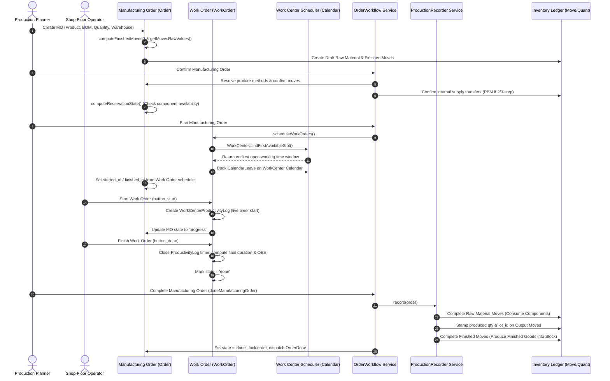

# Plugin: Manufacturing (`manufacturing`)

## Status
[VERIFIED]
Active Optional Module. Registered explicitly in `bootstrap/providers.php:51` as `Webkul\Manufacturing\ManufacturingServiceProvider::class`.

## Core/Optional
[VERIFIED]
**Optional Plugin**. Configured as a domain-specific local business plugin without calling `$package->isCore()` (`plugins/webkul/manufacturing/src/ManufacturingServiceProvider.php:49-109`). Execution, dynamic schema extensions, model observers, and Filament resources are gated by runtime installation checks via `Package::isPluginInstalled('manufacturing')` (`plugins/webkul/manufacturing/src/ManufacturingServiceProvider.php:251,268,313` and `plugins/webkul/manufacturing/src/ManufacturingPlugin.php:23`).

## Enabled/Disabled
[VERIFIED]
**Conditionally Enabled (Database-Gated)**. `ManufacturingServiceProvider` boots conditionally based on whether the plugin record in the database is marked `installed = true`. If uninstalled, event observers (`MoveObserver`, `WarehouseObserver`), product schema extensions (`Product::resolveRelationUsing`), product usage registries (`ProductUsageRegistry`), custom CSS assets, and Filament panel resources are suppressed.

## Purpose
[VERIFIED]
The `manufacturing` module provides comprehensive discrete manufacturing engineering, Bill of Materials (BOM) formulation, shop-floor work center topologies, capacity planning and calendar scheduling, routing operation tracking, manufacturing order (MO) lifecycle management, work order (WO) shop-floor execution with live timer tracking, and disassembly unbuild workflows for Aureus ERP:

1. **Bill of Materials (BOM) Engineering (`BillOfMaterial`, `BillOfMaterialLine`, `BillOfMaterialByproduct`)**:
   - Supports Standard/Normal manufacturing BOMs as well as Kit/Phantom BOMs exploded on demand (`BillOfMaterialType`: `NORMAL`, `PHANTOM`).
   - Manages component raw material requirements, unit multipliers, manual consumption flags, and byproduct generation with proportional cost sharing (`cost_share`).
   - Enforces product variant attribute value matching (`attributeValues`), allowing BOM components and routing steps to dynamically filter based on variant selections.
   - Configures production lead times (`produce_delay`) and manufacturing preparation buffers (`days_to_prepare_mo`).

2. **Work Center Topology & Scheduling (`WorkCenter`, `WorkCenterCapacity`, `WorkCenterTag`)**:
   - Manages shop-floor work stations (`manufacturing_work_centers`) configured with working hour calendars (`Webkul\Support\Models\Calendar`), hourly operational costs (`costs_per_hour`), setup time (`setup_time`), cleanup time (`cleanup_time`), time efficiency ratings (`time_efficiency`), and Overall Equipment Effectiveness targets (`oee_target`).
   - Supports product-specific capacity and setup/cleanup overrides via `WorkCenterCapacity`.
   - Organizes work centers with alternative work center failovers (`manufacturing_work_center_alternatives`) and color-coded taxonomy tags (`WorkCenterTag`).

3. **Routing Operations & Worksheets (`Operation`)**:
   - Defines sequenced production steps linked to specific work centers and BOMs.
   - Calculates expected cycle durations using manual baseline times or automatic historical batch moving averages (`OperationTimeMode`: `MANUAL`, `AUTO`).
   - Embeds standard operating procedures and digital work instructions via multimedia worksheets (`OperationWorksheetType`: `TEXT`, `PDF`, `GOOGLE_SLIDE`).
   - Models inter-operation dependency graphs (`manufacturing_operation_dependencies`), preventing downstream steps from starting before upstream prerequisites complete.

4. **Manufacturing Order (MO) Lifecycle Engine (`Order`, `OrderWorkflow`, `ProductionRecorder`)**:
   - Coordinates the full lifecycle of production orders (`ManufacturingOrderState`: `DRAFT`, `CONFIRMED`, `PROGRESS`, `TO_CLOSE`, `DONE`, `CANCEL`).
   - Evaluates component stock availability (`ManufacturingOrderReservationState`: `CONFIRMED`, `WAITING`, `ASSIGNED`) and enforces consumption policies (`BillOfMaterialConsumption`: `FLEXIBLE`, `WARNING`, `STRICT`).
   - Automates stock reservation, production lot/serial number generation, serial unicity verification, and stock movements.
   - Supports 1-step, 2-step (Pick Components + Manufacture [PBM]), and 3-step (Pick Components + Manufacture + Store [PBM + SAM]) multi-warehouse logistics flows.

5. **Work Orders & Shop-Floor Execution (`WorkOrder`, `WorkCenterProductivityLog`, `WorkCenterProductivityLoss`)**:
   - Tracks operational execution on the shop floor (`WorkOrderState`: `PENDING`, `WAITING`, `READY`, `PROGRESS`, `DONE`, `CANCEL`).
   - Provides live time tracking per operator and work center, recording real-time durations in `WorkCenterProductivityLog`.
   - Analyzes Overall Equipment Effectiveness (OEE) with categorized productivity losses (`loss_type`: `productive`, `performance`, `other`), automatically splitting excess duration overruns into underperformance logs.
   - Allocates calendar leave reservations (`CalendarLeave`) on work center working calendars during order planning.

6. **Kit / Phantom BOM Explosion (`KitExpander`)**:
   - Recursively unpacks phantom kit stock moves into their underlying component moves across inventory transfers without requiring physical assembly orders.

7. **Disassembly & Unbuild Orders (`UnbuildOrder`)**:
   - Manages the dismantling and reverse manufacturing of finished goods back into their constituent components, returning raw materials to inventory quantities.

8. **Product Registry & Usage Protection**:
   - Contributes dynamic relations (`billsOfMaterials`, `billOfMaterialLines`) and preset filter tabs (`components`) to `products`.
   - Protects manufacturing master data against accidental deletion by registering models in `ProductUsageRegistry`.

---

## Service Provider
[VERIFIED]
- **Class**: `Webkul\Manufacturing\ManufacturingServiceProvider` (`plugins/webkul/manufacturing/src/ManufacturingServiceProvider.php:43`)
- **Inheritance**: Extends `Webkul\PluginManager\PackageServiceProvider`
- **Package Configuration (`configureCustomPackage`)**:
  - Package Name: `manufacturing` (`$name = 'manufacturing'`)
  - View Namespace: `manufacturing` (`$viewNamespace = 'manufacturing'`)
  - Views: Enabled (`hasViews()`)
  - Translations: Enabled (`hasTranslations()`)
  - Migrations: 38 migration files registered (`hasMigrations([...])`) and run (`runsMigrations()`):
    1. `2026_03_31_064242_create_manufacturing_bills_of_materials_table`
    2. `2026_03_31_064243_create_manufacturing_work_centers_table`
    3. `2026_03_31_064244_create_manufacturing_operations_table`
    4. `2026_03_31_064245_create_manufacturing_bill_of_material_lines_table`
    5. `2026_03_31_064246_create_manufacturing_bill_of_material_byproducts_table`
    6. `2026_03_31_064247_create_manufacturing_orders_table`
    7. `2026_03_31_064248_create_manufacturing_work_orders_table`
    8. `2026_03_31_064249_create_manufacturing_unbuild_orders_table`
    9. `2026_03_31_064250_create_manufacturing_batch_productions_table`
    10. `2026_03_31_064251_create_manufacturing_consumption_warnings_table`
    11. `2026_03_31_064252_create_manufacturing_consumption_warning_lines_table`
    12. `2026_03_31_064253_create_manufacturing_order_backorders_table`
    13. `2026_03_31_064254_create_manufacturing_order_backorder_lines_table`
    14. `2026_03_31_064255_create_manufacturing_order_split_batches_table`
    15. `2026_03_31_064256_create_manufacturing_order_splits_table`
    16. `2026_03_31_064257_create_manufacturing_order_split_lines_table`
    17. `2026_03_31_064258_create_manufacturing_work_center_capacities_table`
    18. `2026_03_31_064259_create_manufacturing_work_center_loss_types_table`
    19. `2026_03_31_064260_create_manufacturing_work_center_productivity_losses_table`
    20. `2026_03_31_064261_create_manufacturing_work_center_productivity_logs_table`
    21. `2026_03_31_064262_create_manufacturing_work_center_tags_table`
    22. `2026_03_31_064263_create_manufacturing_bill_of_material_byproduct_attribute_values_table`
    23. `2026_03_31_064264_create_manufacturing_bill_of_material_line_attribute_values_table`
    24. `2026_03_31_064265_create_manufacturing_operation_dependencies_table`
    25. `2026_03_31_064266_create_manufacturing_operation_attribute_values_table`
    26. `2026_03_31_064267_create_manufacturing_consumption_warning_order_table`
    27. `2026_03_31_064268_create_manufacturing_order_backorder_order_table`
    28. `2026_03_31_064269_create_manufacturing_order_label_types_table`
    29. `2026_03_31_064270_create_manufacturing_work_center_alternatives_table`
    30: `2026_03_31_064271_create_manufacturing_work_center_tag_table`
    31. `2026_03_31_064272_create_manufacturing_work_order_dependencies_table`
    32. `2026_03_31_180000_add_worksheet_to_manufacturing_operations_table`
    33. `2026_04_01_000001_add_lead_time_fields_to_manufacturing_bills_of_materials_table`
    34. `2026_04_02_000002_alter_inventories_warehouses_table`
    35. `2026_04_02_000003_alter_inventories_moves_table`
    36. `2026_04_02_000004_alter_inventories_move_lines_table`
    37. `2026_08_03_130000_seed_manufacturing_sequences`
  - Settings: 2 settings schemas registered (`hasSettings([...])`) and run (`runsSettings()`):
    - `2026_05_08_094021_create_manufacturing_operation_settings`
    - `2026_05_08_094031_create_manufacturing_planning_settings`
  - Runtime Dependencies: `products`, `inventories` (`hasDependencies(['products', 'inventories'])`)
  - Seeder: `Webkul\Manufacturing\Database\Seeders\DatabaseSeeder`
  - Install Command: executes dependencies installation, migrations, and seeders (`plugins/webkul/manufacturing/src/ManufacturingServiceProvider.php:104-109`).
  - Uninstall Command: deep teardown purging manufacturing warehouse links, operation types, routes, rules, locations, moves, move lines, scraps, quant records, sequences (`manufacturing.order`), and chatter records (`Order::class`) (`plugins/webkul/manufacturing/src/ManufacturingServiceProvider.php:110-234`).
  - Icon: `'manufacturing'`

- **Lifecycle Hooks**:
  - `packageRegistered()`:
    - Injects `ManufacturingPlugin::make()` into all Filament panels (`Panel::configureUsing()`).
    - Registers facade alias `manufacturing` -> `Webkul\Manufacturing\Facades\Manufacturing::class`.
    - Binds singleton `'manufacturing'` -> `Webkul\Manufacturing\ManufacturingManager::class`.
  - `packageBooted()`:
    - Registers custom stylesheet: `Css::make('manufacturing', __DIR__.'/../resources/dist/manufacturing.css')`.
    - Registers model observers: `Warehouse::observe(WarehouseObserver::class)`, `Move::observe(MoveObserver::class)`.
    - Registers dynamic product relations: `Product::resolveRelationUsing('billsOfMaterials', ...)` and `Product::resolveRelationUsing('billOfMaterialLines', ...)`.
    - Injects `components` preset filter view into `ProductSchemaRegistry`.
    - Registers models in `ProductUsageRegistry`: `Order`, `WorkOrder`, `UnbuildOrder`, `BillOfMaterial`, `BillOfMaterialLine`, `BillOfMaterialByproduct`, `WorkCenterCapacity`.

---

## Filament Plugin Class
[VERIFIED]
- **Class**: `Webkul\Manufacturing\ManufacturingPlugin` (`plugins/webkul/manufacturing/src/ManufacturingPlugin.php:9`)
- **Plugin ID**: `manufacturing`
- **Panel Registration**: Admin panel only (`when($panel->getId() == 'admin')`).
- **Discovery Paths**:
  - Resources: `plugins/webkul/manufacturing/src/Filament/Resources` -> `Webkul\Manufacturing\Filament\Resources`
  - Pages: `plugins/webkul/manufacturing/src/Filament/Pages` -> `Webkul\Manufacturing\Filament\Pages`
  - Clusters: `plugins/webkul/manufacturing/src/Filament/Clusters` -> `Webkul\Manufacturing\Filament\Clusters`
  - Widgets: `plugins/webkul/manufacturing/src/Filament/Widgets` -> `Webkul\Manufacturing\Filament\Widgets`

---

## Composer Dependencies
[VERIFIED]
- **Package Name**: `webkul/manufacturing` (`plugins/webkul/manufacturing/composer.json:2`)
- **Type**: Local Composer package module
- **Autoload Mappings**:
  - PSR-4: `Webkul\Manufacturing\` -> `src/`
  - PSR-4: `Webkul\Manufacturing\Database\Factories\` -> `database/factories/`
  - PSR-4: `Webkul\Manufacturing\Database\Seeders\` -> `database/seeders/`
  - PSR-4 (Dev): `Webkul\Manufacturing\Tests\` -> `tests/`
- **Service Provider Auto-discovery**: `Webkul\Manufacturing\ManufacturingServiceProvider`

---

## Runtime Plugin Dependencies
[VERIFIED]
Declared explicitly in `ManufacturingServiceProvider::configureCustomPackage()` (`plugins/webkul/manufacturing/src/ManufacturingServiceProvider.php:99-102`):
1. `products`: Required for base product catalog, inventory tracking attributes, unit of measures (UOM), and product variant attributes.
2. `inventories`: Required for warehouse topology, locations, operations (`Operation`), moves (`Move`), move lines (`MoveLine`), quants (`ProductQuantity`), lots (`Lot`), procurement routes (`Route`), push/pull rules (`Rule`), and scrap write-offs (`Scrap`).

---

## Directory Structure
[VERIFIED]
```text
plugins/webkul/manufacturing/
├── .gitignore
├── composer.json
├── package.json
├── postcss.config.js
├── tailwind.config.js
├── config/
│   └── filament-shield.php
├── database/
│   ├── factories/
│   │   ├── BillOfMaterialFactory.php
│   │   ├── OperationFactory.php
│   │   ├── OrderFactory.php
│   │   ├── UnbuildOrderFactory.php
│   │   ├── WorkCenterFactory.php
│   │   ├── WorkCenterProductivityLogFactory.php
│   │   └── WorkOrderFactory.php
│   ├── migrations/
│   │   ├── 2026_03_31_064242_create_manufacturing_bills_of_materials_table.php
│   │   ├── 2026_03_31_064243_create_manufacturing_work_centers_table.php
│   │   ├── 2026_03_31_064244_create_manufacturing_operations_table.php
│   │   ├── 2026_03_31_064245_create_manufacturing_bill_of_material_lines_table.php
│   │   ├── 2026_03_31_064246_create_manufacturing_bill_of_material_byproducts_table.php
│   │   ├── 2026_03_31_064247_create_manufacturing_orders_table.php
│   │   ├── 2026_03_31_064248_create_manufacturing_work_orders_table.php
│   │   ├── 2026_03_31_064249_create_manufacturing_unbuild_orders_table.php
│   │   ├── 2026_03_31_064250_create_manufacturing_batch_productions_table.php
│   │   ├── 2026_03_31_064251_create_manufacturing_consumption_warnings_table.php
│   │   ├── 2026_03_31_064252_create_manufacturing_consumption_warning_lines_table.php
│   │   ├── 2026_03_31_064253_create_manufacturing_order_backorders_table.php
│   │   ├── 2026_03_31_064254_create_manufacturing_order_backorder_lines_table.php
│   │   ├── 2026_03_31_064255_create_manufacturing_order_split_batches_table.php
│   │   ├── 2026_03_31_064256_create_manufacturing_order_splits_table.php
│   │   ├── 2026_03_31_064257_create_manufacturing_order_split_lines_table.php
│   │   ├── 2026_03_31_064258_create_manufacturing_work_center_capacities_table.php
│   │   ├── 2026_03_31_064259_create_manufacturing_work_center_loss_types_table.php
│   │   ├── 2026_03_31_064260_create_manufacturing_work_center_productivity_losses_table.php
│   │   ├── 2026_03_31_064261_create_manufacturing_work_center_productivity_logs_table.php
│   │   ├── 2026_03_31_064262_create_manufacturing_work_center_tags_table.php
│   │   ├── 2026_03_31_064263_create_manufacturing_bill_of_material_byproduct_attribute_values_table.php
│   │   ├── 2026_03_31_064264_create_manufacturing_bill_of_material_line_attribute_values_table.php
│   │   ├── 2026_03_31_064265_create_manufacturing_operation_dependencies_table.php
│   │   ├── 2026_03_31_064266_create_manufacturing_operation_attribute_values_table.php
│   │   ├── 2026_03_31_064267_create_manufacturing_consumption_warning_order_table.php
│   │   ├── 2026_03_31_064268_create_manufacturing_order_backorder_order_table.php
│   │   ├── 2026_03_31_064269_create_manufacturing_order_label_types_table.php
│   │   ├── 2026_03_31_064270_create_manufacturing_work_center_alternatives_table.php
│   │   ├── 2026_03_31_064271_create_manufacturing_work_center_tag_table.php
│   │   ├── 2026_03_31_064272_create_manufacturing_work_order_dependencies_table.php
│   │   ├── 2026_03_31_180000_add_worksheet_to_manufacturing_operations_table.php
│   │   ├── 2026_04_01_000001_add_lead_time_fields_to_manufacturing_bills_of_materials_table.php
│   │   ├── 2026_04_02_000002_alter_inventories_warehouses_table.php
│   │   ├── 2026_04_02_000003_alter_inventories_moves_table.php
│   │   ├── 2026_04_02_000004_alter_inventories_move_lines_table.php
│   │   └── 2026_08_03_130000_seed_manufacturing_sequences.php
│   ├── seeders/
│   │   ├── DatabaseSeeder.php
│   │   ├── SequenceSeeder.php
│   │   ├── WorkCenterLossTypeSeeder.php
│   │   └── WorkCenterProductivityLossSeeder.php
│   └── settings/
│       ├── 2026_05_08_094021_create_manufacturing_operation_settings.php
│       └── 2026_05_08_094031_create_manufacturing_planning_settings.php
├── resources/
│   ├── css/
│   │   └── index.css
│   ├── lang/ (ar, de, en, es, fr, hi_IN, nl, pt_BR, tr, zh_CN)
│   └── views/
│       └── filament/
│           └── clusters/
│               └── operations/
│                   └── resources/
│                       └── manufacturing-order/
│                           └── pages/
│                               └── overview-manufacturing-order.blade.php
├── src/
│   ├── Enums/
│   │   ├── BillOfMaterialConsumption.php
│   │   ├── BillOfMaterialReadyToProduce.php
│   │   ├── BillOfMaterialType.php
│   │   ├── ManufacturingOrderPriority.php
│   │   ├── ManufacturingOrderReservationState.php
│   │   ├── ManufacturingOrderState.php
│   │   ├── OperationTimeMode.php
│   │   ├── OperationWorksheetType.php
│   │   ├── UnbuildOrderState.php
│   │   ├── WorkCenterWorkingState.php
│   │   ├── WorkOrderProductionAvailability.php
│   │   └── WorkOrderState.php
│   ├── Events/
│   │   ├── OrderCanceled.php
│   │   ├── OrderConfirmed.php
│   │   ├── OrderDone.php
│   │   ├── OrderPlanned.php
│   │   └── OrderStarted.php
│   ├── Facades/
│   │   └── Manufacturing.php
│   ├── Filament/
│   │   ├── Clusters/
│   │   │   ├── Configurations.php
│   │   │   ├── Configurations/
│   │   │   │   └── Resources/
│   │   │   │       ├── OperationResource.php
│   │   │   │       └── WorkCenterResource.php
│   │   │   ├── Operations.php
│   │   │   ├── Operations/
│   │   │   │   ├── Actions/
│   │   │   │   │   ├── CancelAction.php
│   │   │   │   │   ├── ConfirmAction.php
│   │   │   │   │   ├── DoneAction.php
│   │   │   │   │   ├── PlanAction.php
│   │   │   │   │   ├── Print/
│   │   │   │   │   │   ├── PrintLabelsAction.php
│   │   │   │   │   │   └── PrintMOAction.php
│   │   │   │   │   ├── StartAction.php
│   │   │   │   │   └── UnplanAction.php
│   │   │   │   └── Resources/
│   │   │   │       ├── ManufacturingOrderResource.php
│   │   │   │       ├── TransferResource.php
│   │   │   │       └── WorkOrderResource.php
│   │   │   ├── PluginSettings.php
│   │   │   ├── Products.php
│   │   │   ├── Products/
│   │   │   │   └── Resources/
│   │   │   │       ├── BillsOfMaterialResource.php
│   │   │   │       ├── LotResource.php
│   │   │   │       └── ProductResource.php
│   │   │   └── Settings/
│   │   │       └── Pages/
│   │   │           ├── ManageOperations.php
│   │   │           └── ManagePlanning.php
│   │   └── Pages/
│   │       └── Settings/
│   │           └── ManageOperations.php
│   ├── ManufacturingManager.php
│   ├── ManufacturingPlugin.php
│   ├── ManufacturingServiceProvider.php
│   ├── Models/
│   │   ├── BillOfMaterial.php
│   │   ├── BillOfMaterialByproduct.php
│   │   ├── BillOfMaterialLine.php
│   │   ├── Lot.php (proxy/extension)
│   │   ├── Move.php (proxy/extension)
│   │   ├── MoveLine.php (proxy/extension)
│   │   ├── Operation.php
│   │   ├── Order.php
│   │   ├── ProcurementGroup.php (proxy/extension)
│   │   ├── Product.php (proxy/extension)
│   │   ├── UnbuildOrder.php
│   │   ├── Warehouse.php (proxy/extension)
│   │   ├── WorkCenter.php
│   │   ├── WorkCenterCapacity.php
│   │   ├── WorkCenterLossType.php
│   │   ├── WorkCenterProductivityLog.php
│   │   ├── WorkCenterProductivityLoss.php
│   │   ├── WorkCenterTag.php
│   │   └── WorkOrder.php
│   ├── Observers/
│   │   ├── MoveObserver.php
│   │   └── WarehouseObserver.php
│   ├── Policies/
│   │   ├── BillOfMaterialPolicy.php
│   │   ├── LotPolicy.php
│   │   ├── OperationPolicy.php
│   │   ├── OrderPolicy.php
│   │   ├── ProductPolicy.php
│   │   ├── UnbuildOrderPolicy.php
│   │   ├── WorkCenterLossTypePolicy.php
│   │   ├── WorkCenterPolicy.php
│   │   ├── WorkCenterProductivityLogPolicy.php
│   │   ├── WorkCenterProductivityLossPolicy.php
│   │   └── WorkOrderPolicy.php
│   ├── Services/
│   │   ├── KitExpander.php
│   │   ├── OrderWorkflow.php
│   │   └── ProductionRecorder.php
│   └── Settings/
│       ├── OperationSettings.php
│       └── PlanningSettings.php
└── tests/
    ├── Feature/
    │   └── Workflows/
    │       ├── CompanyIsolationTest.php
    │       ├── CompanyScopingInvariantsTest.php
    │       ├── ManufacturingOrderTest.php
    │       ├── OneStepManufacturingOrderTest.php
    │       ├── ThreeStepsManufacturingOrderTest.php
    │       ├── TwoStepsManufacturingOrderTest.php
    │       └── WorkOrderTest.php
    └── Helpers/
        └── ManufacturingHelper.php
```

---

## Models
[VERIFIED]

### Primary Plugin Models

| Model Class | Table Name | Company-Scoped | Soft Deletes | Key Traits & Interfaces | Description |
| :--- | :--- | :--- | :--- | :--- | :--- |
| `BillOfMaterial` | `manufacturing_bills_of_materials` | Yes (`BelongsToCompany`) | Yes (`SoftDeletes`) | `BelongsToCompany`, `HasCustomFields`, `HasFactory`, `SoftDeletes` | Engineering BOM header defining product, routing, consumption policy, and variants. |
| `BillOfMaterialLine` | `manufacturing_bill_of_material_lines` | Yes (`BelongsToCompany`) | No | `BelongsToCompany`, `HasFactory` | Raw material component requirements on a BOM. |
| `BillOfMaterialByproduct` | `manufacturing_bill_of_material_byproducts` | Yes (`BelongsToCompany`) | No | `BelongsToCompany`, `HasFactory` | Secondary byproduct output line with cost sharing percentage. |
| `WorkCenter` | `manufacturing_work_centers` | Yes (`BelongsToCompany`) | Yes (`SoftDeletes`) | `BelongsToCompany`, `HasCustomFields`, `HasFactory`, `SoftDeletes`, `SortableTrait` | Production workstation with hourly costs, setup/cleanup times, and calendar. |
| `WorkCenterCapacity` | `manufacturing_work_center_capacities` | No (via WorkCenter) | No | `Model` | Product-specific capacity and setup/cleanup overrides on a work center. |
| `WorkCenterLossType` | `manufacturing_work_center_loss_types` | No | No | `Model` | High-level loss category container (`productive`, `performance`, `other`). |
| `WorkCenterProductivityLoss` | `manufacturing_work_center_productivity_losses` | No | No | `Model` | Reason code definitions for downtime and productivity tracking. |
| `WorkCenterProductivityLog` | `manufacturing_work_center_productivity_logs` | Yes (`BelongsToCompany`) | No | `BelongsToCompany`, `HasFactory` | Real-time operator time tracking and duration log on a work order. |
| `WorkCenterTag` | `manufacturing_work_center_tags` | No | Yes (`SoftDeletes`) | `HasFactory`, `SoftDeletes` | Color-coded categorization tags for work centers. |
| `Operation` | `manufacturing_operations` | No (via BOM) | Yes (`SoftDeletes`) | `HasCustomFields`, `HasFactory`, `SoftDeletes`, `SortableTrait` | Sequenced routing operation step on a BOM. |
| `Order` | `manufacturing_orders` | Yes (`BelongsToCompany`) | No | `BelongsToCompany`, `HasChatter`, `HasCustomFields`, `HasFactory`, `HasLogActivity`, `HasOwnershipScope` | Manufacturing order header executing production and consuming raw materials. |
| `WorkOrder` | `manufacturing_work_orders` | No (via MO) | No | `HasCustomFields`, `HasFactory`, `SortableTrait` | Shop-floor execution operation work order. |
| `UnbuildOrder` | `manufacturing_unbuild_orders` | Yes (`BelongsToCompany`) | No | `BelongsToCompany`, `HasFactory` | Reverse manufacturing order dismantling products back to components. |

### Extended / Proxy Models (Inheriting from `inventories` & `products`)

| Extended Model Class | Base Class | Purpose of Extension |
| :--- | :--- | :--- |
| `Webkul\Manufacturing\Models\Lot` | `Webkul\Inventory\Models\Lot` | Scopes product relation with trashed and provides `moveLines` relationship. |
| `Webkul\Manufacturing\Models\Move` | `Webkul\Inventory\Models\Move` | Adds manufacturing fillable attributes (`order_id`, `raw_material_order_id`, `work_order_id`, `bom_line_id`, `byproduct_id`, `cost_share`, `manual_consumption`) and relationships. |
| `Webkul\Manufacturing\Models\MoveLine` | `Webkul\Inventory\Models\MoveLine` | Adds `work_order_id` and `order_id` fillable columns and relationships. |
| `Webkul\Manufacturing\Models\ProcurementGroup` | `Webkul\Inventory\Models\ProcurementGroup` | Connects manufacturing orders to procurement groups via `orders()` relationship. |
| `Webkul\Manufacturing\Models\Product` | `Webkul\Inventory\Models\Product` | Adds `billsOfMaterials`, `billOfMaterialLines`, and configurable variant move relationship helpers. |
| `Webkul\Manufacturing\Models\Warehouse` | `Webkul\Inventory\Models\Warehouse` | Adds multi-step manufacturing logistics configuration (`handleManufacturingWarehouseCreation`, `createManufacturingLocations`, `createManufacturingOperationTypes`, `createManufacturingRoutes`, `createManufacturingRules`, `syncManufacturingWarehouseConfiguration`). |

---

## Database
[VERIFIED]

The `manufacturing` plugin introduces 28 core physical tables, 7 pivot/junction tables, and alters 3 `inventories` tables:

### Core Tables Summary

1. `manufacturing_bills_of_materials`:
   - `id`, `code`, `type` (`normal`, `phantom`), `ready_to_produce` (`all_available`, `asap`), `consumption` (`flexible`, `warning`, `strict`), `quantity`, `allow_operation_dependencies`, `produce_delay`, `days_to_prepare_mo`.
   - Foreign Keys: `product_id` -> `products_products`, `uom_id` -> `unit_of_measures`, `operation_type_id` -> `inventories_operation_types`, `company_id` -> `companies`, `creator_id` -> `users`.
   - Soft deletes: `deleted_at`.

2. `manufacturing_bill_of_material_lines`:
   - `id`, `sort`, `quantity`, `is_manual_consumption`.
   - Foreign Keys: `bill_of_material_id` -> `manufacturing_bills_of_materials` (`cascadeOnDelete`), `product_id` -> `products_products`, `uom_id` -> `unit_of_measures`, `operation_id` -> `manufacturing_operations` (`nullOnDelete`), `company_id` -> `companies`, `creator_id` -> `users`.

3. `manufacturing_bill_of_material_byproducts`:
   - `id`, `sort`, `quantity`, `cost_share`.
   - Foreign Keys: `bill_of_material_id` -> `manufacturing_bills_of_materials` (`cascadeOnDelete`), `product_id` -> `products_products`, `uom_id` -> `unit_of_measures`, `operation_id` -> `manufacturing_operations` (`nullOnDelete`), `company_id` -> `companies`, `creator_id` -> `users`.

4. `manufacturing_work_centers`:
   - `id`, `sort`, `color`, `name`, `code`, `working_state` (`normal`, `blocked`, `done`), `note`, `time_efficiency`, `default_capacity`, `costs_per_hour`, `setup_time`, `cleanup_time`, `oee_target`.
   - Foreign Keys: `calendar_id` -> `calendars` (`nullOnDelete`), `company_id` -> `companies` (`restrictOnDelete`), `creator_id` -> `users`.
   - Soft deletes: `deleted_at`.

5. `manufacturing_work_center_capacities`:
   - `id`, `capacity`, `time_start`, `time_stop`.
   - Foreign Keys: `work_center_id` -> `manufacturing_work_centers` (`cascadeOnDelete`), `product_id` -> `products_products` (`cascadeOnDelete`), `creator_id` -> `users`.

6. `manufacturing_work_center_loss_types` & `manufacturing_work_center_productivity_losses`:
   - Track OEE category structures (`loss_type`: `productive`, `performance`, `other`, `manual`).

7. `manufacturing_work_center_productivity_logs`:
   - `id`, `loss_type`, `description`, `started_at`, `finished_at`, `duration`.
   - Foreign Keys: `work_center_id` -> `manufacturing_work_centers`, `work_order_id` -> `manufacturing_work_orders` (`cascadeOnDelete`), `assigned_user_id` -> `users`, `loss_id` -> `manufacturing_work_center_productivity_losses`, `company_id` -> `companies`, `creator_id` -> `users`.

8. `manufacturing_operations`:
   - `id`, `sort`, `time_mode_batch`, `name`, `worksheet_type` (`text`, `pdf`, `google_slide`), `worksheet`, `worksheet_google_slide_url`, `time_mode` (`auto`, `manual`), `note`, `manual_cycle_time`.
   - Foreign Keys: `work_center_id` -> `manufacturing_work_centers`, `bill_of_material_id` -> `manufacturing_bills_of_materials` (`cascadeOnDelete`), `creator_id` -> `users`.
   - Soft deletes: `deleted_at`.

9. `manufacturing_orders`:
   - `id`, `name`, `reference`, `priority` (`0`, `1`), `origin`, `state` (`draft`, `confirmed`, `progress`, `to_close`, `done`, `cancel`), `reservation_state` (`confirmed`, `assigned`, `waiting`), `consumption` (`flexible`, `warning`, `strict`), `quantity`, `quantity_producing`, `product_uom_qty`, `is_planned`, `is_locked`, `deadline_at`, `started_at`, `finished_at`.
   - Foreign Keys: `product_id` -> `products_products`, `uom_id` -> `unit_of_measures`, `producing_lot_id` -> `inventories_lots`, `operation_type_id` -> `inventories_operation_types`, `source_location_id` -> `inventories_locations`, `destination_location_id` -> `inventories_locations`, `final_location_id` -> `inventories_locations`, `production_location_id` -> `inventories_locations`, `bill_of_material_id` -> `manufacturing_bills_of_materials`, `assigned_user_id` -> `users`, `company_id` -> `companies` (`restrictOnDelete`), `order_point_id` -> `inventories_order_points`, `procurement_group_id` -> `inventories_procurement_groups`, `creator_id` -> `users`.

10. `manufacturing_work_orders`:
    - `id`, `sort`, `name`, `barcode`, `production_availability` (`confirmed`, `assigned`, `waiting`), `state` (`pending`, `waiting`, `ready`, `progress`, `done`, `cancel`), `quantity_produced`, `expected_duration`, `started_at`, `finished_at`, `duration`, `duration_per_unit`, `duration_percent`, `costs_per_hour`.
    - Foreign Keys: `manufacturing_order_id` -> `manufacturing_orders` (`cascadeOnDelete`), `work_center_id` -> `manufacturing_work_centers`, `product_id` -> `products_products`, `uom_id` -> `unit_of_measures`, `operation_id` -> `manufacturing_operations`, `calendar_leave_id` -> `calendar_leaves` (`nullOnDelete`), `creator_id` -> `users`.

11. `manufacturing_unbuild_orders`:
    - `id`, `name`, `state` (`draft`, `done`), `quantity`.
    - Foreign Keys: `product_id` -> `products_products`, `company_id` -> `companies`, `uom_id` -> `unit_of_measures`, `bill_of_material_id` -> `manufacturing_bills_of_materials`, `manufacturing_order_id` -> `manufacturing_orders`, `lot_id` -> `inventories_lots`, `location_id` -> `inventories_locations`, `destination_location_id` -> `inventories_locations`, `creator_id` -> `users`.

### Foreign Key Extensions into Inventory

- **`inventories_warehouses`** (`2026_04_02_000002_alter_inventories_warehouses_table.php`):
  - Adds `manu_type_id`, `pbm_type_id`, `sam_type_id` (`FK` -> `inventories_operation_types`).
  - Adds `pbm_route_id` (`FK` -> `inventories_routes`).
  - Adds `pbm_loc_id`, `sam_loc_id` (`FK` -> `inventories_locations`).
  - Adds `manufacture_pull_id`, `manufacture_mto_pull_id`, `pbm_mto_pull_id`, `sam_rule_id` (`FK` -> `inventories_rules`).
  - Adds `manufacture_steps` (`one_step`, `two_steps`, `three_steps`) and `manufacture_to_resupply` (boolean).

- **`inventories_moves`** (`2026_04_02_000003_alter_inventories_moves_table.php`):
  - Adds `raw_material_order_id` (`FK` -> `manufacturing_orders`).
  - Adds `order_id` (`FK` -> `manufacturing_orders`).
  - Adds `created_order_id` (`FK` -> `manufacturing_orders`).
  - Adds `unbuild_order_id` & `consume_unbuild_order_id` (`FK` -> `manufacturing_unbuild_orders`).
  - Adds `mo_operation_id` (`FK` -> `manufacturing_operations`).
  - Adds `work_order_id` (`FK` -> `manufacturing_work_orders`).
  - Adds `bom_line_id` (`FK` -> `manufacturing_bill_of_material_lines`).
  - Adds `byproduct_id` (`FK` -> `manufacturing_bill_of_material_byproducts`).
  - Adds `order_finished_lot_id` (`FK` -> `inventories_lots`).
  - Adds `cost_share` (`decimal:4`) and `manual_consumption` (`boolean`).

- **`inventories_move_lines`** (`2026_04_02_000004_alter_inventories_move_lines_table.php`):
  - Adds `work_order_id` (`FK` -> `manufacturing_work_orders`).
  - Adds `order_id` (`FK` -> `manufacturing_orders`).

---

## Filament Resources, Pages, Widgets & Clusters
[VERIFIED]

### Filament Clusters

1. **`Webkul\Manufacturing\Filament\Clusters\Operations`**:
   - Navigation Group: `'Manufacturing'`
   - Hosts `ManufacturingOrderResource`, `WorkOrderResource`, `TransferResource`.
2. **`Webkul\Manufacturing\Filament\Clusters\Products`**:
   - Navigation Group: `'Manufacturing'`
   - Hosts `BillsOfMaterialResource`, `LotResource`, `ProductResource`.
3. **`Webkul\Manufacturing\Filament\Clusters\Configurations`**:
   - Navigation Group: `'Manufacturing'`
   - Hosts `OperationResource`, `WorkCenterResource`.
4. **`Webkul\Manufacturing\Filament\Clusters\PluginSettings`**:
   - Local plugin configuration cluster containing `ManageOperations`.
5. **`Webkul\Support\Filament\Clusters\Settings`** (Global Integration):
   - Integrates `ManageOperations` and `ManagePlanning` into the global Settings cluster under `'Manufacturing'` group.

### Filament Resources & Page Breakdown

```text
Operations Cluster:
├── ManufacturingOrderResource (Model: Order)
│   ├── ListManufacturingOrders (Tabs: todo [default], done, cancelled, planned, draft, confirmed, in-progress, to-close, mo-pending, mo-ready, my-mos, late)
│   ├── CreateManufacturingOrder
│   ├── ViewManufacturingOrder
│   ├── EditManufacturingOrder
│   ├── OverviewManufacturingOrder (Detailed visual BOM/MO costing, component readiness, expected vs actual hours/costs)
│   └── ManageTransfers (Related picking transfers from inventories_operations)
├── WorkOrderResource (Model: WorkOrder) [Gated by OperationSettings::$enable_work_orders]
│   ├── ListWorkOrders (Tabs: todo [default], draft, done, cancelled; Inline Actions: Start [Timer], Pause [Pending], Done)
│   ├── ViewWorkOrder
│   └── EditWorkOrder
└── TransferResource (Model: Webkul\Inventory\Models\Operation)
    ├── ViewTransfer
    ├── EditTransfer
    └── ManageMoves

Products Cluster:
├── BillsOfMaterialResource (Model: BillOfMaterial)
│   ├── ListBillsOfMaterial
│   ├── CreateBillOfMaterial
│   ├── ViewBillOfMaterial
│   ├── EditBillOfMaterial
│   └── BillOfMaterialOverview (BOM cost structure analysis)
├── LotResource (Model: Lot)
│   ├── ListLots
│   ├── CreateLot
│   ├── ViewLot
│   ├── EditLot
│   └── ManageQuantities
└── ProductResource (Model: Product)
    ├── ListProducts (Tabs: all, goods, services, combos, components)
    ├── CreateProduct
    ├── ViewProduct
    ├── EditProduct
    ├── ManageAttributes
    ├── ManageVariants
    ├── ManageBillsOfMaterials
    ├── ManageMoves
    ├── ManageQuantities
    └── ManageVendors

Configurations Cluster:
├── OperationResource (Model: Operation)
│   ├── ListOperations
│   ├── CreateOperation
│   ├── ViewOperation
│   └── EditOperation
└── WorkCenterResource (Model: WorkCenter)
    ├── ListWorkCenters
    ├── CreateWorkCenter
    ├── ViewWorkCenter
    ├── EditWorkCenter
    └── ManageOperations
```

### Custom MO Lifecycle Actions (`plugins/webkul/manufacturing/src/Filament/Clusters/Operations/Actions/`)

- **`ConfirmAction`**: Confirms draft MO, resolves procure methods on raw material moves, links work orders, and confirms internal warehouse supply transfers.
- **`StartAction`**: Transitions confirmed MO to `progress` state.
- **`PlanAction`**: Confirms draft MO if needed, schedules work order calendar leaves on work centers, and transitions MO to `planned`.
- **`UnplanAction`**: Deletes calendar leave bookings and resets work order started/finished timestamps (validates that no work order has started or completed).
- **`DoneAction`**: Completes all work orders, consumes components via `ProductionRecorder`, produces finished goods and byproducts, locks order, and marks MO `done`.
- **`CancelAction`**: Cancels open work orders, releases calendar leaves, and cancels unpicked supply and finished moves via `Inventory::cancelMoves()`.
- **`PrintLabelsAction`** & **`PrintMOAction`**: Generates printable PDF production documentation and lot/barcode labels.

---

## Panels
[VERIFIED]
- **`admin`**: Primary operational panel. All clusters, resources, settings pages, and custom actions are registered and discovered here.
- **`customer`**: `[NOT APPLICABLE]`. Manufacturing does not register any customer-facing portals or routes.

---

## Services
[VERIFIED]

1. **`OrderWorkflow` (`Webkul\Manufacturing\Services\OrderWorkflow`)**:
   - Manages state transitions and operations for `Order` records:
     - `confirm(Order $order)`: Sets confirmation defaults, resolves procure methods, confirms component/finished moves, links work orders to moves, confirms warehouse supply operations, dispatches `OrderConfirmed`.
     - `start(Order $order)`: Transitions state to `progress`, dispatches `OrderStarted`.
     - `plan(Order $order)`: Automates work order calendar slot scheduling via `scheduleWorkOrders()`, dispatches `OrderPlanned`.
     - `unplan(Order $order)`: Verifies no work order has started or finished, deletes `CalendarLeave` records, resets planned flags.
     - `complete(Order $order)`: Finishes work orders, invokes `ProductionRecorder`, marks moves `done`, locks MO, dispatches `OrderDone`.
     - `cancel(Order $order)`: Cancels pending work orders and moves, cleans up flexible orders, dispatches `OrderCanceled`.
     - `scheduleWorkOrders(Order $order, bool $replan = false)`: Evaluates operation dependency chains, calls `WorkOrder::plan()`, and adjusts overall MO `started_at` / `finished_at`.

2. **`ProductionRecorder` (`Webkul\Manufacturing\Services\ProductionRecorder`)**:
   - Orchestrates final stock mutations upon MO completion:
     - `record(Order $order, bool $cancelBackorder = false)`:
       1. `consumeComponents()`: Completes picked raw material moves and cancels unpicked lines via `Inventory::completeMoves()` / `Inventory::cancelMoves()`.
       2. `stampProducedQuantity()`: Updates output move quantities to match actual produced count and stamps `producing_lot_id`.
       3. `backfillWorkOrderDurations()`: Backfills expected duration and creates productivity logs for unstarted work orders.
       4. `produceOutput()`: Marks finished moves as picked and completes them into inventory stock.

3. **`KitExpander` (`Webkul\Manufacturing\Services\KitExpander`)**:
   - Explodes phantom/kit BOM moves (`BillOfMaterialType::PHANTOM`) on demand:
     - Detects if an inventory move represents a kit product via `BillOfMaterial::bomFind(..., bomType: 'phantom')`.
     - Replaces parent kit move with individual constituent component moves with proportional demand quantities.
     - Discards original kit parent move from inventory ledger.

4. **`ManufacturingManager` (`Webkul\Manufacturing\ManufacturingManager`)**:
   - Public facade service container exposing workflow operations (`confirmManufacturingOrder`, `startManufacturingOrder`, `planManufacturingOrder`, `unplanManufacturingOrder`, `doneManufacturingOrder`, `cancelManufacturingOrder`, `planWorkOrders`, `settleProduction`, `expandKitMoves`).

---

## Events & Listeners
[VERIFIED]

### Events (`Webkul\Manufacturing\Events`)

| Event Class | Dispatched When | Payload |
| :--- | :--- | :--- |
| `OrderConfirmed` | Manufacturing order is confirmed from draft. | `public Order $order` |
| `OrderStarted` | Manufacturing order begins production (`progress`). | `public Order $order` |
| `OrderPlanned` | Work orders are scheduled onto work center calendars. | `public Order $order` |
| `OrderDone` | Production is settled and MO is marked complete. | `public Order $order` |
| `OrderCanceled` | Manufacturing order is canceled and stock unreserved. | `public Order $order` |

### Listeners
- `[NOT APPLICABLE]`. No custom Event Listeners are registered in `ManufacturingServiceProvider`.

---

## Observers
[VERIFIED]

1. **`MoveObserver` (`Webkul\Manufacturing\Observers\MoveObserver`)**:
   - Observes: `Webkul\Inventory\Models\Move`
   - Event `updated`: When a raw material stock move's reservation or pick status changes, recalculates `rawMaterialOrder->computeReservationState()` and updates child `workOrders.production_availability`.

2. **`WarehouseObserver` (`Webkul\Manufacturing\Observers\WarehouseObserver`)**:
   - Observes: `Webkul\Inventory\Models\Warehouse` (implements `ShouldHandleEventsAfterCommit`)
   - Event `created`: Invokes `handleManufacturingWarehouseCreation()` and `finalizeManufacturingWarehouseCreation()` on `Warehouse`, creating Pre-Production / Post-Production locations, PBM/SAM operation types, and 1/2/3-step routing rules.
   - Event `updated`: Invokes `syncManufacturingWarehouseConfiguration()` when `manufacture_steps` changes, restoring or archiving PBM/SAM locations, operation types, and push/pull rules accordingly.

---

## Policies
[VERIFIED]

The module defines 11 policies enforcing permissions generated by `Webkul\Security\Bouncer` and configured in `config/filament-shield.php`:

| Policy Class | Model | Ability Check Format |
| :--- | :--- | :--- |
| `OrderPolicy` | `Order` | `view_any_manufacturing_order`, `view_manufacturing_order`, `create_manufacturing_order`, `update_manufacturing_order`, `delete_manufacturing_order`, `delete_any_manufacturing_order` |
| `WorkOrderPolicy` | `WorkOrder` | `view_any_manufacturing_work::order`, `view_manufacturing_work::order`, `create_manufacturing_work::order`, `update_manufacturing_work::order`, `delete_manufacturing_work::order`, `delete_any_manufacturing_work::order` |
| `BillOfMaterialPolicy` | `BillOfMaterial` | `view_any_manufacturing_bill::of::material`, `view_manufacturing_bill::of::material`, `create_manufacturing_bill::of::material`, `update_manufacturing_bill::of::material`, `delete_manufacturing_bill::of::material`, `restore_manufacturing_bill::of::material`, `force_delete_manufacturing_bill::of::material` |
| `WorkCenterPolicy` | `WorkCenter` | `view_any_manufacturing_work::center`, `view_manufacturing_work::center`, `create_manufacturing_work::center`, `update_manufacturing_work::center`, `delete_manufacturing_work::center`, `restore_manufacturing_work::center`, `force_delete_manufacturing_work::center`, `reorder_manufacturing_work::center` |
| `OperationPolicy` | `Operation` | `view_any_manufacturing_operation`, `view_manufacturing_operation`, `create_manufacturing_operation`, `update_manufacturing_operation`, `delete_manufacturing_operation`, `restore_manufacturing_operation`, `force_delete_manufacturing_operation`, `reorder_manufacturing_operation` |
| `ProductPolicy` | `Product` | `view_any_manufacturing_product`, `view_manufacturing_product`, `create_manufacturing_product`, `update_manufacturing_product`, `delete_manufacturing_product`, `restore_manufacturing_product`, `force_delete_manufacturing_product`, `reorder_manufacturing_product` |
| `LotPolicy` | `Lot` | `view_any_manufacturing_lot`, `view_manufacturing_lot`, `create_manufacturing_lot`, `update_manufacturing_lot`, `delete_manufacturing_lot` |
| `UnbuildOrderPolicy` | `UnbuildOrder` | `view_any_manufacturing_unbuild_order`, `view_manufacturing_unbuild_order`, `create_manufacturing_unbuild_order`, `update_manufacturing_unbuild_order`, `delete_manufacturing_unbuild_order` |
| `WorkCenterLossTypePolicy` | `WorkCenterLossType` | `view_any_manufacturing_work_center_loss_type`, `view_manufacturing_work_center_loss_type`, `create_manufacturing_work_center_loss_type`, `update_manufacturing_work_center_loss_type`, `delete_manufacturing_work_center_loss_type` |
| `WorkCenterProductivityLossPolicy` | `WorkCenterProductivityLoss` | `view_any_manufacturing_work_center_productivity_loss`, `view_manufacturing_work_center_productivity_loss`, `create_manufacturing_work_center_productivity_loss`, `update_manufacturing_work_center_productivity_loss`, `delete_manufacturing_work_center_productivity_loss` |
| `WorkCenterProductivityLogPolicy` | `WorkCenterProductivityLog` | `view_any_manufacturing_work_center_productivity_log`, `view_manufacturing_work_center_productivity_log`, `create_manufacturing_work_center_productivity_log`, `update_manufacturing_work_center_productivity_log`, `delete_manufacturing_work_center_productivity_log` |

---

## Routes
[VERIFIED]
- **Web Routes**: None (`routes/web.php` does not exist).
- **API Routes**: None (`routes/api.php` does not exist). REST API endpoints for manufacturing are not exposed in the current plugin version.

---

## Settings
[VERIFIED]

1. **`OperationSettings` (`Webkul\Manufacturing\Settings\OperationSettings`)**:
   - Setting Group: `'manufacturing_operation'`
   - Properties:
     - `enable_work_orders` (bool): Enables or disables work order shop-floor routing and UI resources.
     - `enable_work_order_dependencies` (bool): Enables sequential and branched dependency rules between work orders.
     - `enable_byproducts` (bool): Enables byproduct lines on Bills of Materials.
   - Managed via Filament Settings page: `ManageOperations`.

2. **`PlanningSettings` (`Webkul\Manufacturing\Settings\PlanningSettings`)**:
   - Setting Group: `'manufacturing_planning'`
   - Properties:
     - `manufacturing_lead` (int): General safety manufacturing lead time buffer in days.
   - Managed via Filament Settings page: `ManagePlanning`.

---

## Translations
[VERIFIED]
Complete translation dictionaries provided under `plugins/webkul/manufacturing/resources/lang/` across 10 locales:
- `ar`, `de`, `en`, `es`, `fr`, `hi_IN`, `nl`, `pt_BR`, `tr`, `zh_CN`
- Covers application UI, model titles, action notifications, log attributes, system exceptions, and all 12 enum definitions.

---

## Tests
[VERIFIED]
The plugin includes a dedicated Pest feature test suite containing 7 feature workflow test files and 1 test helper under `plugins/webkul/manufacturing/tests/`:

1. `plugins/webkul/manufacturing/tests/Feature/Workflows/ManufacturingOrderTest.php`: Tests BOM explosion into raw/finished moves, order confirmation, component consumption, finished goods production, manual component addition, strict/flexible consumption issue detection, order cancellation, unplan prevention on started work orders, quantity rescaling, byproduct production, and producing lot assignment.
2. `plugins/webkul/manufacturing/tests/Feature/Workflows/WorkOrderTest.php`: Tests operation duration computation, time efficiency scaling, hourly cost calculations, duration percentage against expected duration, work order start/pause timer execution, work order auto-completion, multi-operation linking, blocked work center prevention, and productivity log accumulation.
3. `plugins/webkul/manufacturing/tests/Feature/Workflows/OneStepManufacturingOrderTest.php`: Tests single-step manufacturing flow (Manufacture directly from stock).
4. `plugins/webkul/manufacturing/tests/Feature/Workflows/TwoStepsManufacturingOrderTest.php`: Tests two-step manufacturing flow (Pick components to Pre-Production [PBM], then manufacture).
5. `plugins/webkul/manufacturing/tests/Feature/Workflows/ThreeStepsManufacturingOrderTest.php`: Tests three-step manufacturing flow (Pick components to Pre-Production [PBM], manufacture, then transfer finished goods from Post-Production to Stock [SAM]).
6. `plugins/webkul/manufacturing/tests/Feature/Workflows/CompanyIsolationTest.php`: Verifies multi-company tenant data isolation across manufacturing orders, BOMs, and work centers.
7. `plugins/webkul/manufacturing/tests/Feature/Workflows/CompanyScopingInvariantsTest.php`: Verifies `BelongsToCompany` scope invariants on all manufacturing models.
8. `plugins/webkul/manufacturing/tests/Helpers/ManufacturingHelper.php`: Test fixture orchestration helper providing factory wrappers for multi-step warehouses, BOMs, operations, work orders, orders, and productivity logs.

---

## Cross-Plugin Relationships
[VERIFIED]

### Cross-Plugin Architectural Resolution: Maintenance Equipment vs Manufacturing Work Centers
- **Direct Codebase Verification**: `maintenance_equipments` does **NOT** link to `manufacturing_work_centers` (nor vice versa).
- Analysis across `plugins/webkul/maintenance` and `plugins/webkul/manufacturing` confirms that `Equipment` and `WorkCenter` are distinct, decoupled operational models:
  - `Equipment` (in `maintenance`) models physical hardware assets, serial numbers, vendor warranty terms, and repair service requests.
  - `WorkCenter` (in `manufacturing`) models workstation production capacity, hourly labor/overhead cost rates, working hour calendars, and operation time logs.
  - There are no foreign key columns, junction tables, or runtime linkages connecting equipment assets to manufacturing work centers in the repository source code.

### Integration Architecture Diagram

```mermaid
erDiagram
    COMPANIES ||--o{ MANUFACTURING_BILLS_OF_MATERIALS : "company_id"
    COMPANIES ||--o{ MANUFACTURING_ORDERS : "company_id"
    COMPANIES ||--o{ MANUFACTURING_WORK_CENTERS : "company_id"
    COMPANIES ||--o{ MANUFACTURING_UNBUILD_ORDERS : "company_id"
    
    CALENDARS ||--o{ MANUFACTURING_WORK_CENTERS : "calendar_id [SUPPORT]"
    CALENDAR_LEAVES ||--o{ MANUFACTURING_WORK_ORDERS : "calendar_leave_id [SUPPORT]"
    
    USERS ||--o{ MANUFACTURING_ORDERS : "assigned_user_id / creator_id [SECURITY]"
    USERS ||--o{ MANUFACTURING_WORK_ORDERS : "creator_id [SECURITY]"
    USERS ||--o{ MANUFACTURING_WORK_CENTER_PRODUCTIVITY_LOGS : "assigned_user_id [SECURITY]"
    
    PRODUCTS_PRODUCTS ||--o{ MANUFACTURING_BILLS_OF_MATERIALS : "product_id [PRODUCTS]"
    PRODUCTS_PRODUCTS ||--o{ MANUFACTURING_BILL_OF_MATERIAL_LINES : "product_id [PRODUCTS]"
    PRODUCTS_PRODUCTS ||--o{ MANUFACTURING_BILL_OF_MATERIAL_BYPRODUCTS : "product_id [PRODUCTS]"
    PRODUCTS_PRODUCTS ||--o{ MANUFACTURING_ORDERS : "product_id [PRODUCTS]"
    PRODUCTS_PRODUCTS ||--o{ MANUFACTURING_WORK_CENTERS : "capacities [PRODUCTS]"
    
    MANUFACTURING_BILLS_OF_MATERIALS ||--o{ MANUFACTURING_BILL_OF_MATERIAL_LINES : "bill_of_material_id"
    MANUFACTURING_BILLS_OF_MATERIALS ||--o{ MANUFACTURING_BILL_OF_MATERIAL_BYPRODUCTS : "bill_of_material_id"
    MANUFACTURING_BILLS_OF_MATERIALS ||--o{ MANUFACTURING_OPERATIONS : "bill_of_material_id"
    MANUFACTURING_BILLS_OF_MATERIALS ||--o{ MANUFACTURING_ORDERS : "bill_of_material_id"
    MANUFACTURING_BILLS_OF_MATERIALS ||--o{ MANUFACTURING_UNBUILD_ORDERS : "bill_of_material_id"
    
    MANUFACTURING_WORK_CENTERS ||--o{ MANUFACTURING_OPERATIONS : "work_center_id"
    MANUFACTURING_WORK_CENTERS ||--o{ MANUFACTURING_WORK_CENTER_CAPACITIES : "work_center_id"
    MANUFACTURING_WORK_CENTERS ||--o{ MANUFACTURING_WORK_CENTER_PRODUCTIVITY_LOGS : "work_center_id"
    MANUFACTURING_WORK_CENTERS ||--o{ MANUFACTURING_WORK_ORDERS : "work_center_id"
    
    MANUFACTURING_ORDERS ||--o{ MANUFACTURING_WORK_ORDERS : "manufacturing_order_id"
    MANUFACTURING_ORDERS ||--o{ MANUFACTURING_UNBUILD_ORDERS : "manufacturing_order_id"
    MANUFACTURING_ORDERS ||--o{ INVENTORIES_MOVES : "raw_material_order_id / order_id [INVENTORIES]"
    
    MANUFACTURING_WORK_ORDERS ||--o{ MANUFACTURING_WORK_CENTER_PRODUCTIVITY_LOGS : "work_order_id"
    MANUFACTURING_WORK_ORDERS ||--o{ INVENTORIES_MOVES : "work_order_id [INVENTORIES]"
    MANUFACTURING_WORK_ORDERS ||--o{ INVENTORIES_MOVE_LINES : "work_order_id [INVENTORIES]"
    
    INVENTORIES_LOTS ||--o{ MANUFACTURING_ORDERS : "producing_lot_id [INVENTORIES]"
    INVENTORIES_PROCUREMENT_GROUPS ||--o{ MANUFACTURING_ORDERS : "procurement_group_id [INVENTORIES]"
```



---

## Data Flow
[VERIFIED]



---

## Business Rules
[VERIFIED]

1. **Work Center Capacity Scheduling Logic (`WorkCenter::findFirstAvailableSlot`)**:
   - Search parameters: `SLOT_SEARCH_WINDOW_DAYS = 14`, `SLOT_SEARCH_WINDOWS = 50` (scans up to 700 calendar days).
   - Searches forward or backward from the target start date.
   - Evaluates working shifts from `Calendar::getWorkIntervalsBatch`.
   - Subtracts blocked intervals from `Calendar::getLeaveIntervalsBatch` (filtering for `time_type = 'other'` and existing work order bookings).
   - Slides along available working intervals until cumulative available minutes satisfy required work order expected duration (`$available >= $remaining`).
   - If alternative work centers are configured on the work center, searches alternatives and selects the work center yielding the earliest completion timestamp.

2. **Operation Duration Calculation (`Operation::getExpectedDuration`)**:
   - $\text{Expected Duration} = \text{Setup/Cleanup Time} + \left(\lceil \frac{\text{Quantity}}{\text{WorkCenter Capacity}} \rceil \times \text{Time Cycle} \times \frac{100}{\text{Time Efficiency}}\right)$.
   - When `time_mode === AUTO`, $\text{Time Cycle}$ is dynamically computed from the moving average duration of the last $N$ completed work orders (`time_mode_batch`).

3. **Productivity Log Overrun Auto-Splitting (`WorkCenterProductivityLog::splitOffOverrun`)**:
   - When an operator completes a work order where actual duration exceeded `expected_duration`, the productivity log is split at the expected duration threshold:
     - The base portion ($\le \text{expected duration}$) remains classified as `productive`.
     - The excess overrun portion ($> \text{expected duration}$) is automatically created as a separate log entry and assigned `loss_type = 'performance'`.

4. **BOM Consumption Enforcement (`BillOfMaterialConsumption`)**:
   - `FLEXIBLE`: No warning or blocking if consumed component quantities deviate from BOM standards.
   - `WARNING`: Flags consumption discrepancy warnings (`getConsumptionIssues()`) in UI if quantities deviate.
   - `STRICT`: Rejects completion if components are under-consumed or over-consumed without explicit authorization.

5. **Serial & Lot Uniqueness Invariants (`Order::checkSnUniqueness` & `isFinishedSnAlreadyProduced`)**:
   - Ensures finished serial numbers cannot be produced twice into stock unless reversed by an unbuild order.
   - Prevents duplicate consumption of the same component serial number across concurrent production orders.

6. **Multi-Step Logistics Warehouse Configurations (`Warehouse::handleManufacturingWarehouseCreation`)**:
   - `1-Step` (`ONE_STEP`): Single manufacturing operation pulling directly from stock and delivering directly to stock (`Stock → Production → Stock`).
   - `2-Step` (`TWO_STEPS`): Generates Pick Components internal transfer (`Stock → Pre-Production`) prior to manufacturing (`Pre-Production → Production → Stock`).
   - `3-Step` (`THREE_STEPS`): Generates Pick Components (`Stock → Pre-Production`), Manufacturing (`Pre-Production → Production → Post-Production`), and Store Finished Products (`Post-Production → Stock`).

---

## Extension Points
[VERIFIED]
- **Custom Fields**: `Order`, `WorkOrder`, `BillOfMaterial`, `WorkCenter`, and `Operation` all utilize `HasCustomFields`, supporting runtime schema mutations and custom field injection into Filament forms and tables.
- **Product Schema Contribution**: Dynamically registers `billsOfMaterials` and `billOfMaterialLines` relations on `Product` and adds `components` preset filter tab in `ProductResource`.
- **Product Usage Registry**: Protects manufacturing entities from deletion when attached to products via `ProductUsageRegistry`.
- **Alternative Work Centers**: Extensible workstation topologies with automatic failover planning during scheduling.
- **Custom Preset Table Views**: Extensive filter tabs on `ListManufacturingOrders` and `ListWorkOrders` leveraging `HasTableViews`.

---

## Dangerous Areas
[VERIFIED]

1. **Unplan Execution Guard**:
   - Calling `unplanManufacturingOrder()` on an order where any work order has already progressed to `progress` or `done` throws a hard exception (`assertUnplannable`), preventing corrupted calendar leaves and orphaned productivity logs.
2. **Serial Number Collision**:
   - Producing duplicate serial numbers without proper unbuild reconciliation triggers fatal validation errors in `checkSnUniqueness()`.
3. **Warehouse Multi-Step Reconfiguration**:
   - Changing `manufacture_steps` on an active warehouse executes `syncManufacturingWarehouseConfiguration()`, which archives or restores locations and operation types. In-flight stock moves must be validated before altering warehouse steps.
4. **Test Coverage Assertion**:
   - **Test Suite Status**: **Verified and Present**. The plugin contains comprehensive workflow tests (`ManufacturingOrderTest`, `WorkOrderTest`, `OneStepManufacturingOrderTest`, `TwoStepsManufacturingOrderTest`, `ThreeStepsManufacturingOrderTest`, `CompanyIsolationTest`, `CompanyScopingInvariantsTest`) verifying multi-step logistics, calendar planning, OEE productivity logs, and multi-tenant scoping.

---

## Change Impact
[VERIFIED]
- **Warehouse Logistics**: Directly controls internal replenishment moves and picking operations in `inventories`.
- **Product Costing**: Computes analytical unit component costs and routing operation labor/overhead costs for production cost overviews (Note: Stock tracking remains purely quantitative; no financial inventory valuation layer is updated).
- **Enterprise Calendars**: Reserves time slots in `calendars` and `calendar_leaves`, impacting overall facility scheduling.
- **Sales & Procurement**: Fulfills Make-To-Order (MTO) demands generated by `sales` and triggers raw material purchase requisitions in `purchases`.

---

## Evidence
[VERIFIED]

| Topic | File Reference | Symbol / Implementation Evidence |
| :--- | :--- | :--- |
| Service Provider | `plugins/webkul/manufacturing/src/ManufacturingServiceProvider.php` | `ManufacturingServiceProvider`, `configureCustomPackage()`, `packageBooted()`, `packageRegistered()` |
| Filament Plugin | `plugins/webkul/manufacturing/src/ManufacturingPlugin.php` | `ManufacturingPlugin`, `getId()`, `register()` |
| Manager Service | `plugins/webkul/manufacturing/src/ManufacturingManager.php` | `ManufacturingManager` |
| Facade | `plugins/webkul/manufacturing/src/Facades/Manufacturing.php` | `ManufacturingFacade` |
| Order Workflow | `plugins/webkul/manufacturing/src/Services/OrderWorkflow.php` | `OrderWorkflow::confirm()`, `plan()`, `unplan()`, `complete()`, `cancel()`, `scheduleWorkOrders()` |
| Production Recorder | `plugins/webkul/manufacturing/src/Services/ProductionRecorder.php` | `ProductionRecorder::record()`, `consumeComponents()`, `produceOutput()` |
| Kit Expander | `plugins/webkul/manufacturing/src/Services/KitExpander.php` | `KitExpander::expandMoves()`, `kitFor()`, `componentsOf()` |
| Bill of Materials Model | `plugins/webkul/manufacturing/src/Models/BillOfMaterial.php` | `BillOfMaterial`, `bomFind()`, `explode()`, `getComponentCost()`, `getOperationDuration()` |
| Work Center Model | `plugins/webkul/manufacturing/src/Models/WorkCenter.php` | `WorkCenter`, `findFirstAvailableSlot()`, `capacityFor()`, `setupAndCleanupTime()`, `computeWorkingState()` |
| Operation Model | `plugins/webkul/manufacturing/src/Models/Operation.php` | `Operation`, `getExpectedDuration()`, `getExpectedCost()`, `getTimeCycleAttribute()` |
| Manufacturing Order Model | `plugins/webkul/manufacturing/src/Models/Order.php` | `Order`, `computeState()`, `computeReservationState()`, `setQuantities()`, `checkSnUniqueness()` |
| Work Order Model | `plugins/webkul/manufacturing/src/Models/WorkOrder.php` | `WorkOrder`, `start()`, `pending()`, `finish()`, `plan()`, `computeDuration()` |
| Productivity Log Model | `plugins/webkul/manufacturing/src/Models/WorkCenterProductivityLog.php` | `WorkCenterProductivityLog`, `stop()`, `splitOffOverrun()`, `computeDuration()` |
| Warehouse Extension | `plugins/webkul/manufacturing/src/Models/Warehouse.php` | `Warehouse::handleManufacturingWarehouseCreation()`, `createManufacturingLocations()`, `createManufacturingRoutes()` |
| Move Observer | `plugins/webkul/manufacturing/src/Observers/MoveObserver.php` | `MoveObserver::updated()` |
| Warehouse Observer | `plugins/webkul/manufacturing/src/Observers/WarehouseObserver.php` | `WarehouseObserver::created()`, `updated()` |
| Settings | `plugins/webkul/manufacturing/src/Settings/OperationSettings.php` | `OperationSettings`, `PlanningSettings` |
| Shield Config | `plugins/webkul/manufacturing/config/filament-shield.php` | Filament Shield permission matrices for manufacturing resources |
| Feature Tests | `plugins/webkul/manufacturing/tests/Feature/Workflows/ManufacturingOrderTest.php` | Pest feature workflow tests for orders, work orders, multi-step routes, and company scoping |
