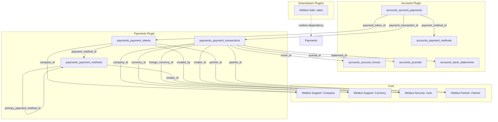

# Plugin: Payments (`payments`)

## Status
[VERIFIED]
Active Optional Module. Registered in `bootstrap/providers.php:53` as `Webkul\Payment\PaymentServiceProvider::class`.

## Core/Optional
[VERIFIED]
**Optional Plugin**. Configured as a modular external payment gateway, transaction tracking, and tokenization schema layer without calling `$package->isCore()` (`plugins/webkul/payments/src/PaymentServiceProvider.php:15-39`). Gated by runtime installation verification via `Package::isPluginInstalled('payments')` (`plugins/webkul/payments/src/PaymentPlugin.php:23`).

## Enabled/Disabled
[VERIFIED]
**Conditionally Enabled (Database-Gated)**. `PaymentPlugin` registers conditionally on the `admin` Filament panel only when the plugin is installed in the database (`Package::isPluginInstalled('payments')`) (`plugins/webkul/payments/src/PaymentPlugin.php:23-25`). When uninstalled, the plugin remains dormant.

## Purpose
[VERIFIED]
The `payments` plugin provides the physical database schemas, tokenization models, and transaction tracking structures required to integrate online payment gateways and electronic payment providers with Aureus ERP's financial ledger:

1. **Payment Gateway Capabilities & Methods (`payments_payment_methods`)**:
   - Stores payment gateway method configurations, defining capabilities such as refund support (`support_refund`), card/token persistence (`support_tokenization`), express checkout (`support_express_checkout`), and primary hierarchy (`primary_payment_method_id`).
2. **Customer Tokenization (`payments_payment_tokens`)**:
   - Maintains stored customer payment tokens and vaulted card/payment instrument metadata (`payment_details` JSON, `provider_reference_id`, `partner_id`, `company_id`, `is_active`) linked to specific gateway methods.
3. **Gateway Transaction Logging (`payments_payment_transactions`)**:
   - Captures low-level payment gateway transaction lifecycles (`transaction_type`, `amount`, `amount_currency`, `amount_residual`, `is_reconciled`, `payment_reference`, `internal_index`, `transaction_details` JSON) and binds them directly to journal entries (`accounts_account_moves`), journals (`accounts_journals`), bank statements (`accounts_bank_statements`), partners (`partners_partners`), and currencies (`currencies`).
4. **General Ledger Payment Extension (`accounts_account_payments`)**:
   - Extends the core accounting payment ledger (`accounts_account_payments`) via database foreign keys (`payment_token_id`, `payment_transaction_id`) to bridge double-entry payments with external electronic gateway records.

---

## Service Provider
[VERIFIED]
- **Class**: `Webkul\Payment\PaymentServiceProvider` (`plugins/webkul/payments/src/PaymentServiceProvider.php:11`)
- **Inheritance**: Extends `Webkul\PluginManager\PackageServiceProvider`
- **Registration & Configuration**:
  - `configureCustomPackage(Package $package)`:
    - Sets package name to `payments` (`PaymentServiceProvider::$name = 'payments'`).
    - Configures translation lookup (`hasTranslations()`).
    - Declares 6 database migrations (`hasMigrations([...])`):
      1. `2025_02_10_131418_create_payments_payment_methods_table`
      2. `2025_02_11_101123_create_payments_payment_tokens_table`
      3. `2025_02_11_103602_create_payments_payment_transactions_table`
      4. `2025_02_12_103602_add_columns_to_account_payments_table`
      5. `2025_08_08_105243_alter_payments_payment_methods_table`
      6. `2026_02_25_105243_alter_payments_payment_transactions_table`
    - Runs migrations automatically (`runsMigrations()`).
    - Declares runtime plugin dependency on `accounts` (`hasDependencies(['accounts'])`).
    - Registers root seeder: `Webkul\Payment\Database\Seeders\DatabaseSeeder`.
    - Configures install command: runs dependency installation, migrations, and seeders (`$command->installDependencies()->runsMigrations()->runsSeeders()`).
    - Configures uninstall command: empty closure.
  - `packageRegistered()`:
    - Registers `PaymentPlugin::make()` with the Filament panel builder (`plugins/webkul/payments/src/PaymentServiceProvider.php:43-45`).

---

## Filament Plugin Class
[VERIFIED]
- **Class**: `Webkul\Payment\PaymentPlugin` (`plugins/webkul/payments/src/PaymentPlugin.php:9`)
- **Plugin Identifier**: `'payments'` (`getId(): string`)
- **Panel Registration**: Registers on the **`admin`** panel only (`plugins/webkul/payments/src/PaymentPlugin.php:28`).
- **Discovery Configuration**:
  - Sets auto-discovery paths for `Filament/Resources`, `Filament/Pages`, `Filament/Clusters`, and `Filament/Widgets`.
  - *Current State*: The `src/Filament/` directory does not exist; no Filament UI resources, pages, clusters, or widgets are presently instantiated by this plugin.

---

## Composer Dependencies
[VERIFIED]
- **Declared in `plugins/webkul/payments/composer.json`**:
  - Name: `webkul/payments`
  - Declares zero direct Composer `require` package dependencies.
  - Autoloads PSR-4 namespaces:
    - `Webkul\Payment\`: `src/`
    - `Webkul\Payment\Database\Factories\`: `database/factories/`
    - `Webkul\Payment\Database\Seeders\`: `database/seeders/`
  - Autoloads dev PSR-4 namespace:
    - `Webkul\Payment\Tests\`: `tests/`

---

## Runtime Plugin Dependencies
[VERIFIED]
- **`accounts`**: Declared via `->hasDependencies(['accounts'])` (`plugins/webkul/payments/src/PaymentServiceProvider.php:28-30`). The `payments` plugin binds its transaction records to `accounts_account_moves`, `accounts_journals`, and `accounts_bank_statements`, and alters `accounts_account_payments` with gateway foreign keys.

---

## Directory Structure
[VERIFIED]
```text
plugins/webkul/payments/
├── composer.json
├── database/
│   ├── factories/
│   │   ├── PaymentFactory.php
│   │   ├── PaymentTokenFactory.php
│   │   └── PaymentTransactionFactory.php
│   ├── migrations/
│   │   ├── 2025_02_10_131418_create_payments_payment_methods_table.php
│   │   ├── 2025_02_11_101123_create_payments_payment_tokens_table.php
│   │   ├── 2025_02_11_103602_create_payments_payment_transactions_table.php
│   │   ├── 2025_02_12_103602_add_columns_to_account_payments_table.php
│   │   ├── 2025_08_08_105243_alter_payments_payment_methods_table.php
│   │   └── 2026_02_25_105243_alter_payments_payment_transactions_table.php
│   └── seeders/
│       ├── DatabaseSeeder.php
│       ├── PaymentSeeder.php
│       ├── PaymentTokenSeeder.php
│       └── PaymentTransactionSeeder.php
└── src/
    ├── Models/
    │   ├── Payment.php
    │   ├── PaymentToken.php
    │   └── PaymentTransaction.php
    ├── PaymentPlugin.php
    └── PaymentServiceProvider.php
```

---

## Models
[VERIFIED]

The `payments` plugin defines 3 Eloquent models in `plugins/webkul/payments/src/Models/`:

### 1. `Payment` (`Webkul\Payment\Models\Payment`)
[VERIFIED]
- **File**: `plugins/webkul/payments/src/Models/Payment.php`
- **Class**: `Webkul\Payment\Models\Payment extends Illuminate\Database\Eloquent\Model`
- **Traits**: `Illuminate\Database\Eloquent\Factories\HasFactory`
- **Table**: Defaults by Laravel convention to `payments` (Note: No standalone `payments` table exists; the operational payments ledger is `accounts_account_payments` managed by `Webkul\Account\Models\Payment`).
- **Characteristics**: Stub model class with factory support.

### 2. `PaymentToken` (`Webkul\Payment\Models\PaymentToken`)
[VERIFIED]
- **File**: `plugins/webkul/payments/src/Models/PaymentToken.php`
- **Class**: `Webkul\Payment\Models\PaymentToken extends Illuminate\Database\Eloquent\Model`
- **Traits**: `Illuminate\Database\Eloquent\Factories\HasFactory`
- **Table**: Maps by Laravel convention to `payments_payment_tokens`.
- **Target Table Schema**:
  - `id`: Primary key.
  - `company_id`: FK to `companies.id` (`nullOnDelete`).
  - `payment_method_id`: FK to `payments_payment_methods.id` (`restrictOnDelete`).
  - `partner_id`: FK to `partners_partners.id` (`restrictOnDelete`).
  - `created_by`: FK to `users.id` (`nullOnDelete`).
  - `payment_details`: JSON field storing token payload, card brand, expiration, or last-4 digits.
  - `provider_reference_id`: String storing external gateway token / customer ID.
  - `is_active`: Boolean status flag (default `false`).
- **Referenced By**: `Webkul\Account\Models\Payment::paymentToken()` (`belongsTo(PaymentToken::class, 'payment_token_id')`).

### 3. `PaymentTransaction` (`Webkul\Payment\Models\PaymentTransaction`)
[VERIFIED]
- **File**: `plugins/webkul/payments/src/Models/PaymentTransaction.php`
- **Class**: `Webkul\Payment\Models\PaymentTransaction extends Illuminate\Database\Eloquent\Model`
- **Traits**: `Illuminate\Database\Eloquent\Factories\HasFactory`
- **Table**: Maps by Laravel convention to `payments_payment_transactions`.
- **Target Table Schema**:
  - `id`: Primary key.
  - `sort`: Sort order integer.
  - `move_id`: FK to `accounts_account_moves.id` (`restrictOnDelete`).
  - `journal_id`: FK to `accounts_journals.id` (`nullOnDelete`).
  - `company_id`: FK to `companies.id` (`nullOnDelete`).
  - `statement_id`: FK to `accounts_bank_statements.id` (`nullOnDelete`).
  - `partner_id`: FK to `partners_partners.id` (`nullOnDelete`).
  - `currency_id`: FK to `currencies.id` (`restrictOnDelete`).
  - `foreign_currency_id`: FK to `currencies.id` (`restrictOnDelete`).
  - `creator_id`: FK to `users.id` (`nullOnDelete`, renamed from `created_id` in `2026_02_25_105243_alter_payments_payment_transactions_table.php`).
  - `account_number`: String customer bank account or card identifier.
  - `partner_name`: String customer/payer name.
  - `transaction_type`: String transaction classifier (`debit`, `credit`).
  - `payment_reference`: String transaction / receipt identifier.
  - `internal_index`: String indexing key.
  - `transaction_details`: JSON field storing gateway response payloads and metadata.
  - `amount`: Decimal(15,4) transaction monetary amount in journal currency.
  - `amount_currency`: Decimal(15,4) transaction monetary amount in transaction currency.
  - `amount_residual`: Decimal(15,4) unallocated/unreconciled residual amount.
  - `is_reconciled`: Boolean reconciliation state (default `false`).
- **Referenced By**: `Webkul\Account\Models\Payment::paymentTransaction()` (`belongsTo(PaymentTransaction::class, 'payment_transaction_id')`).

---

## Database
[VERIFIED]

### Physical Database Tables Owned by `payments`

| Table | Migration File | Primary Role | Multi-Company | Referential Integrity |
|---|---|---|---|---|
| `payments_payment_methods` | `2025_02_10_131418_create_payments_payment_methods_table.php`<br>`2025_08_08_105243_alter_payments_payment_methods_table.php` | External payment gateway method definitions and capabilities | Global (No `company_id`) | Self-referencing FK `primary_payment_method_id` (`nullOnDelete`), `creator_id` -> `users.id` (`nullOnDelete`) |
| `payments_payment_tokens` | `2025_02_11_101123_create_payments_payment_tokens_table.php` | Customer vaulted payment tokens and card identifiers | Yes (`company_id`) | `company_id` -> `companies` (`nullOnDelete`), `payment_method_id` -> `payments_payment_methods` (`restrictOnDelete`), `partner_id` -> `partners_partners` (`restrictOnDelete`), `created_by` -> `users` (`nullOnDelete`) |
| `payments_payment_transactions` | `2025_02_11_103602_create_payments_payment_transactions_table.php`<br>`2026_02_25_105243_alter_payments_payment_transactions_table.php` | Low-level gateway transaction execution records | Yes (`company_id`) | `move_id` -> `accounts_account_moves` (`restrictOnDelete`), `journal_id` -> `accounts_journals` (`nullOnDelete`), `company_id` -> `companies` (`nullOnDelete`), `statement_id` -> `accounts_bank_statements` (`nullOnDelete`), `partner_id` -> `partners_partners` (`nullOnDelete`), `currency_id` / `foreign_currency_id` -> `currencies` (`restrictOnDelete`), `creator_id` -> `users` (`nullOnDelete`) |

### Table Modifications to Sibling Plugins

| Modified Table | Sibling Plugin | Migration File | Columns Added | Referential Integrity |
|---|---|---|---|---|
| `accounts_account_payments` | `accounts` | `2025_02_12_103602_add_columns_to_account_payments_table.php` | `payment_token_id`<br>`payment_transaction_id` | `payment_token_id` -> `payments_payment_tokens.id` (`nullOnDelete`)<br>`payment_transaction_id` -> `payments_payment_transactions.id` (`nullOnDelete`) |

---

### Architectural Clarification: `payments_payment_methods` vs `accounts_payment_methods`
[VERIFIED]

A critical architectural distinction exists between the two payment method tables in the repository:

1. **`accounts_payment_methods`** (Owned by `accounts` plugin via `plugins/webkul/accounts/database/migrations/2025_02_10_075022_create_accounts_payment_methods_table.php`):
   - Mapped to `Webkul\Account\Models\PaymentMethod`.
   - Represents double-entry accounting payment mechanisms (e.g., Manual Inbound, Manual Outbound, Checks, Electronic Bank Transfers).
   - Bound to specific financial journals via `accounts_payment_method_lines` and selected during manual invoice/bill payment registration.
2. **`payments_payment_methods`** (Owned by `payments` plugin via `plugins/webkul/payments/database/migrations/2025_02_10_131418_create_payments_payment_methods_table.php`):
   - Represents external payment gateway provider configurations and integration capabilities.
   - Contains gateway feature flags: `support_refund`, `support_tokenization`, `support_express_checkout`, and hierarchy link `primary_payment_method_id`.
   - Referenced as a foreign key by `payments_payment_tokens.payment_method_id`.

*Note on ERD Inventory*: `docs/database/erds/finance.md` mentions `payments_payment_methods` in its summary narrative (line 35), while its Entity Inventory table listed `accounts_payment_methods` under `accounts`. Both tables physically exist in the database and represent distinct layers of the payment processing architecture.

---

## Filament Resources, Pages, Widgets, and Clusters
[NOT APPLICABLE]
- **Filament Resources**: None (`plugins/webkul/payments/src/Filament/Resources` does not exist).
- **Filament Pages**: None (`plugins/webkul/payments/src/Filament/Pages` does not exist).
- **Filament Clusters**: None (`plugins/webkul/payments/src/Filament/Clusters` does not exist).
- **Filament Widgets**: None (`plugins/webkul/payments/src/Filament/Widgets` does not exist).

## Panels
[VERIFIED]
- **Admin Panel (`admin`)**: `PaymentPlugin` is registered with the `admin` panel builder in `PaymentServiceProvider::packageRegistered()` (`plugins/webkul/payments/src/PaymentServiceProvider.php:43-45`) and configured with auto-discovery paths in `PaymentPlugin::register()` (`plugins/webkul/payments/src/PaymentPlugin.php:28-46`). Because no Filament classes currently exist under `src/Filament/`, no UI items are rendered.
- **Customer Panel (`customer`)**: Not registered (`when($panel->getId() == 'admin', ...)` excludes the customer panel).

## Services
[NOT APPLICABLE]
No dedicated service classes are defined under `plugins/webkul/payments/src/Services/`.

## Events
[NOT APPLICABLE]
No custom Event classes are dispatched or defined within `plugins/webkul/payments/`.

## Listeners
[NOT APPLICABLE]
No Event Listeners are registered or defined within `plugins/webkul/payments/`.

## Observers
[NOT APPLICABLE]
No Model Observers are registered or defined within `plugins/webkul/payments/`.

## Policies
[NOT APPLICABLE]
No authorization Policy classes are defined within `plugins/webkul/payments/`.

## Routes
[NOT APPLICABLE]
No HTTP routes are registered (`routes/web.php` and `routes/api.php` do not exist).

## Settings
[NOT APPLICABLE]
No spatie/laravel-settings or custom settings classes are registered.

## Translations
[VERIFIED]
- `PaymentServiceProvider` invokes `->hasTranslations()` (`plugins/webkul/payments/src/PaymentServiceProvider.php:18`), but no translation directory (`resources/lang/`) exists within the plugin.

---

## Tests
[VERIFIED]
No dedicated automated test files were found for this Plugin.
- **Directory**: `plugins/webkul/payments/tests/` does **NOT exist**.
- **Test Files**: Zero (`0`) test files exist.
- **Composer Dev Autoloading**: Configured in `composer.json` (`"Webkul\\Payment\\Tests\\": "tests/"`), but no tests have been authored.

---

## Gateway Integration Architecture & Tokenization Workflow

### 1. Gateway Driver Architecture Status
[VERIFIED]
The `payments` plugin provides the database foundation, schema constraints, and model stubs for payment processing. Concrete gateway drivers (e.g., Stripe, PayPal, Authorize.Net, Razorpay) and HTTP webhook endpoints are not yet implemented in this package.

### 2. Tokenization Lifecycle Schema
[VERIFIED]
The tokenization schema operates as follows:
1. **Method Definition (`payments_payment_methods`)**: Gateway methods define whether tokenization is supported via `support_tokenization = true`.
2. **Token Creation (`payments_payment_tokens`)**:
   - Customer payment tokens store `provider_reference_id` (the external customer/card token provided by the payment gateway).
   - Vault metadata (card brand, expiration, last 4 digits, billing reference) is stored in the `payment_details` JSON column.
   - The token is scoped to a `partner_id` (`partners_partners`), `payment_method_id` (`payments_payment_methods`), and `company_id` (`companies`).
3. **Payment Association (`accounts_account_payments`)**:
   - When an invoice or sales order executes an online charge, the resulting `accounts_account_payments` record stores `payment_token_id` referencing the vaulted token.

### 3. Transaction Execution & Ledger Binding
[VERIFIED]
- When an external payment is processed, a `payments_payment_transactions` record captures the gateway execution state (`amount`, `amount_currency`, `amount_residual`, `is_reconciled`, `transaction_type`, `payment_reference`, `transaction_details`).
- It is linked to:
  - `move_id` (`accounts_account_moves`): The double-entry journal entry recording the financial impact.
  - `journal_id` (`accounts_journals`): The bank or payment processing journal.
  - `statement_id` (`accounts_bank_statements`): Optional bank statement line for electronic settlement.
  - `partner_id` (`partners_partners`): The payer / customer.
  - `currency_id` / `foreign_currency_id` (`currencies`): Multi-currency exchange rate tracking.
  - `accounts_account_payments.payment_transaction_id`: The high-level payment record.

---

## Cross-Plugin Relationships
[VERIFIED]



### Upstream Dependencies Consumed
- **`accounts`**: Provides general ledger moves (`accounts_account_moves`), payment records (`accounts_account_payments`), journals (`accounts_journals`), and bank statements (`accounts_bank_statements`).
- **`partners`**: Provides counterparty partner profiles (`partners_partners`).
- **`support`**: Provides multi-company tenant scoping (`companies`) and multi-currency exchange definitions (`currencies`).
- **`security`**: Provides user references for audit tracking (`users`).

### Downstream Dependants
- **`sales`**: Declares a runtime plugin dependency on `payments` (`plugins/webkul/sales/src/SaleServiceProvider.php:82`).

---

## Business Rules
[VERIFIED]

1. **Foreign Key Integrity on Deletions**:
   - `payments_payment_tokens` enforces `restrictOnDelete()` on `payment_method_id` and `partner_id` to prevent accidental loss of customer payment vaults.
   - `payments_payment_transactions` enforces `restrictOnDelete()` on `move_id` and `currency_id` to preserve double-entry auditability.
   - `accounts_account_payments` enforces `nullOnDelete()` on `payment_token_id` and `payment_transaction_id` so ledger payment records remain intact even if raw transaction logs are pruned.
2. **Multi-Company Scoping**:
   - Both `payments_payment_tokens` and `payments_payment_transactions` store nullable `company_id` columns referencing `companies.id` to allow company-level tenant isolation.
   - `payments_payment_methods` is a global table without `company_id`, functioning as a system-wide capability catalog.
3. **Audit Trail Column Conventions**:
   - `payments_payment_methods` and `payments_payment_transactions` use `creator_id` referencing `users.id` (updated via migrations `2025_08_08_105243` and `2026_02_25_105243`).
   - `payments_payment_tokens` uses `created_by` referencing `users.id`.

---

## Extension Points
[VERIFIED]

1. **Payment Gateway Provider Drivers**:
   - Integration points for implementing dedicated payment gateway drivers (e.g. Stripe, PayPal, Square) that populate `payments_payment_tokens` upon card vaulted events and `payments_payment_transactions` upon charge/refund webhooks.
2. **Filament Administration Interfaces**:
   - `PaymentPlugin` already configures auto-discovery for `Filament/Resources`, `Filament/Pages`, and `Filament/Widgets`, providing an immediate mounting point for gateway configuration screens, token management, and transaction explorer resources.
3. **Webhook & API Routes**:
   - Adding `routes/api.php` to receive asynchronous IPN / webhook callbacks from payment processors to update transaction statuses and trigger automatic invoice reconciliation.

---

## Dangerous Areas
[VERIFIED]

1. **Zero Test Coverage**:
   - The plugin contains **no unit, feature, or integration tests** (`plugins/webkul/payments/tests/` does not exist). Any schema migrations or future model additions must be manually verified or tested via downstream feature tests in `accounts` or `sales`.
2. **Stub Eloquent Models Without Explicit Table Mapping or Relationships**:
   - `Webkul\Payment\Models\Payment`: Defaults to the non-existent table `payments` instead of `accounts_account_payments`.
   - `Webkul\Payment\Models\PaymentToken` and `Webkul\Payment\Models\PaymentTransaction`: Do not declare explicit `$table`, `$fillable`, `$casts`, or Eloquent relationship methods (`partner()`, `company()`, `journal()`, `move()`, `paymentMethod()`). Relationships are currently declared only unidirectionally from `Webkul\Account\Models\Payment`.
3. **Discrepancy in `PaymentTokenFactory`**:
   - `PaymentTokenFactory` (`plugins/webkul/payments/database/factories/PaymentTokenFactory.php:6,29`) imports and instantiates `Webkul\Account\Models\PaymentMethod` for the `payment_method_id` attribute, whereas the physical migration `2025_02_11_101123_create_payments_payment_tokens_table.php:18` constrains `payment_method_id` to `payments_payment_methods`. If `PaymentTokenFactory::new()->create()` is invoked in an environment where IDs in `accounts_payment_methods` do not match `payments_payment_methods`, a foreign key constraint violation will occur.
4. **Column Naming Inconsistency (`creator_id` vs `created_by`)**:
   - `payments_payment_methods` and `payments_payment_transactions` were migrated to `creator_id`.
   - `payments_payment_tokens` retains `created_by`.
5. **No Concrete Payment Gateway Drivers**:
   - While `sales` declares a runtime dependency on `payments`, there is no operational gateway execution logic; calling online payment checkout without implementing drivers will have no executable provider backend.

---

## Change Impact
[VERIFIED]

- **Database Changes**: Modifying `payments_payment_tokens` or `payments_payment_transactions` directly affects the extended columns on `accounts_account_payments` and downstream payment processing workflows.
- **Dependency Flow**: Modifying `payments` affects `sales` (which requires `payments` at runtime) and `accounts` (which holds foreign keys to `payments` tables).

---

## Evidence
[VERIFIED]

| Item / Claim | Source Code Reference | Status |
|---|---|---|
| Provider Registration | `bootstrap/providers.php:53` | [VERIFIED] |
| Plugin Name & Runtime Dependencies | `plugins/webkul/payments/src/PaymentServiceProvider.php:13,28-30` | [VERIFIED] |
| Migrations List | `plugins/webkul/payments/src/PaymentServiceProvider.php:20-25` | [VERIFIED] |
| Filament Plugin Discovery Config | `plugins/webkul/payments/src/PaymentPlugin.php:9-47` | [VERIFIED] |
| `payments_payment_methods` Schema | `plugins/webkul/payments/database/migrations/2025_02_10_131418_create_payments_payment_methods_table.php:14-28`<br>`plugins/webkul/payments/database/migrations/2025_08_08_105243_alter_payments_payment_methods_table.php:11-20` | [VERIFIED] |
| `payments_payment_tokens` Schema | `plugins/webkul/payments/database/migrations/2025_02_11_101123_create_payments_payment_tokens_table.php:14-26` | [VERIFIED] |
| `payments_payment_transactions` Schema | `plugins/webkul/payments/database/migrations/2025_02_11_103602_create_payments_payment_transactions_table.php:14-37`<br>`plugins/webkul/payments/database/migrations/2026_02_25_105243_alter_payments_payment_transactions_table.php:11-20` | [VERIFIED] |
| `accounts_account_payments` Extension | `plugins/webkul/payments/database/migrations/2025_02_12_103602_add_columns_to_account_payments_table.php:14-17` | [VERIFIED] |
| `Payment` Model Stub | `plugins/webkul/payments/src/Models/Payment.php:8-11` | [VERIFIED] |
| `PaymentToken` Model Stub | `plugins/webkul/payments/src/Models/PaymentToken.php:8-11` | [VERIFIED] |
| `PaymentTransaction` Model Stub | `plugins/webkul/payments/src/Models/PaymentTransaction.php:8-11` | [VERIFIED] |
| Account Payment Relations | `plugins/webkul/accounts/src/Models/Payment.php:164-177` | [VERIFIED] |
| Model Factories | `plugins/webkul/payments/database/factories/PaymentFactory.php`<br>`plugins/webkul/payments/database/factories/PaymentTokenFactory.php`<br>`plugins/webkul/payments/database/factories/PaymentTransactionFactory.php` | [VERIFIED] |
| Seeders | `plugins/webkul/payments/database/seeders/DatabaseSeeder.php`<br>`plugins/webkul/payments/database/seeders/PaymentSeeder.php`<br>`plugins/webkul/payments/database/seeders/PaymentTokenSeeder.php`<br>`plugins/webkul/payments/database/seeders/PaymentTransactionSeeder.php` | [VERIFIED] |
| Downstream Dependency in Sales | `plugins/webkul/sales/src/SaleServiceProvider.php:80-83` | [VERIFIED] |
