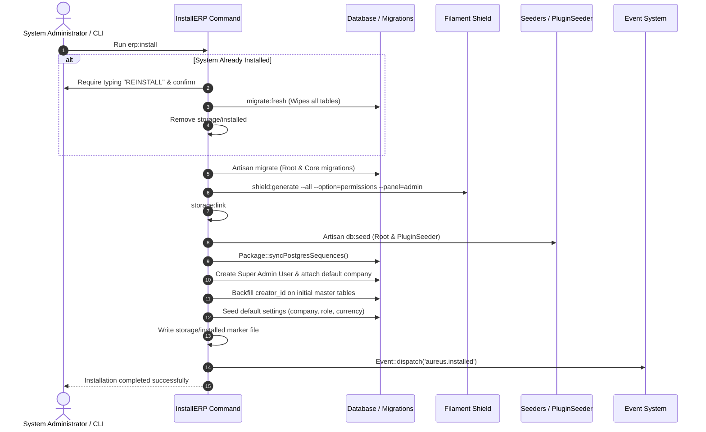
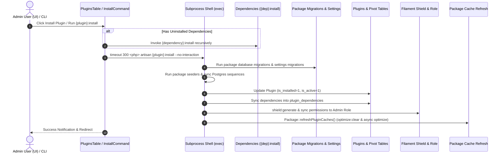
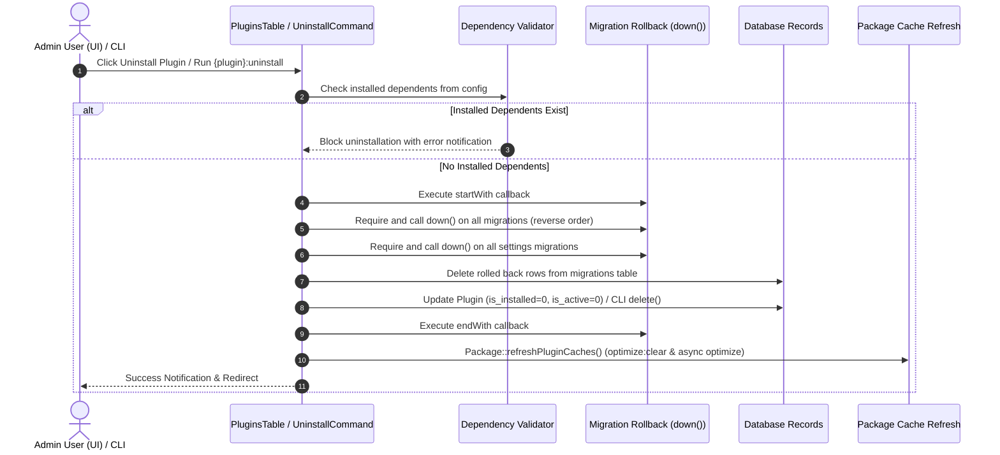

# Plugin: Plugin Manager (`plugin-manager`)

## Status
[VERIFIED]
Active Core Module. Registered explicitly in `bootstrap/providers.php:66` as the terminal service provider in the application provider stack (`Webkul\PluginManager\PluginManagerServiceProvider::class`).

## Core/Optional
[VERIFIED]
**Core Plugin**. Configured via `$package->isCore()` within `PluginManagerServiceProvider::configureCustomPackage()` (`plugins/webkul/plugin-manager/src/PluginManagerServiceProvider.php:21`).

## Enabled/Disabled
[VERIFIED]
**Always Enabled (Core Infrastructure)**. Core plugin status causes `PackageServiceProvider::boot()` to bypass database installation checks (`Package::isInstalled()`) when loading migrations and routes (`plugins/webkul/plugin-manager/src/PackageServiceProvider.php:131-135, 202`). While the `plugins` database table initializes records with `is_installed = 0` and `is_active = 0` by default (`plugins/webkul/plugin-manager/database/migrations/2024_11_05_105102_create_plugins_table.php:22-23`), the underlying package management engine executes unconditionally at boot time once registered in `bootstrap/providers.php`.

## Purpose
[VERIFIED]
The `plugin-manager` module is the central packaging foundation and module lifecycle orchestrator for Aureus ERP. It provides the following foundational services:
1. **Base Architecture**: Defines abstract classes `Webkul\PluginManager\PackageServiceProvider` (`plugins/webkul/plugin-manager/src/PackageServiceProvider.php`) and `Webkul\PluginManager\Package` (`plugins/webkul/plugin-manager/src/Package.php`), which extend Spatie Laravel Package Tools to provide uniform migration loading, settings migration loading, seeder execution, view/component publishing, route loading, and configuration merging across all 28 plugins in the repository.
2. **Console Command Engine**: Houses all 4 Artisan console command files in the entire repository:
   - `InstallERP` (`erp:install`): Orchestrates full ERP system setup, database migrations, initial Super Admin creation, default company/settings assignment, role/permission generation via Filament Shield, and storage linking.
   - `FindMissingTranslations` (`translations:check`): Performs automated parity and structural auditing across translation files for all plugins against the canonical English (`en`) baseline.
   - `InstallCommand` (`{shortName}:install`): Dynamically bound per package to manage asset/config publishing, migrations, seeders, dependency resolution, and permission generation.
   - `UninstallCommand` (`{shortName}:uninstall`): Dynamically bound per package to validate dependent packages, roll back migrations, remove database records, and refresh caches.
3. **Admin Panel UI**: Delivers a full administrative interface (`PluginResource`) with responsive card grid views, tabbed filtering (`Apps`, `Extra`, `Installed`, `Not Installed`), manual plugin discovery synchronization, and interactive modal dialogs for installing and uninstalling optional modules with data impact analysis.
4. **Access Control Integration**: Configures dynamic permission key formatting for Filament Shield via `PermissionManager` to enforce standardized plugin-scoped authorization across all resources, pages, and widgets.

## Service Provider
[VERIFIED]
- **Class**: `Webkul\PluginManager\PluginManagerServiceProvider` (`plugins/webkul/plugin-manager/src/PluginManagerServiceProvider.php:12`)
- **Inheritance**: Extends `Webkul\PluginManager\PackageServiceProvider`
- **Registration & Configuration**:
  - `configureCustomPackage(Package $package)`:
    - Sets package name to `'plugin-manager'`
    - Declares package as core (`$package->isCore()`)
    - Configures views (`hasViews()`) and translations (`hasTranslations()`)
    - Registers migration `'2024_11_05_105102_create_plugins_table'`
    - Registers seeder `'Webkul\PluginManager\Database\Seeders\PluginSeeder'`
    - Enables automatic migration and seeder execution (`runsMigrations()`, `runsSeeders()`)
    - Registers Artisan commands `InstallERP::class` and `FindMissingTranslations::class`
  - `packageRegistered()`:
    - Hooks into panel configuration via `Panel::configureUsing()`, registering `PluginManagerPlugin::make()`
    - Binds `Webkul\PluginManager\PermissionManager` as a container singleton
  - `packageBooted()`:
    - Registers custom CSS asset `plugins` (`resources/dist/plugin.css`) using `FilamentAsset::register()`
    - Executes `PermissionManager::managePermissions()`
    - Registers listener `Event::listen('aureus.installed', 'Webkul\PluginManager\Listeners\Installer@installed')`

## Filament Plugin class
[VERIFIED]
- **Class**: `Webkul\PluginManager\PluginManagerPlugin` (`plugins/webkul/plugin-manager/src/PluginManagerPlugin.php:8`)
- **Interface**: Implements `Filament\Contracts\Plugin`
- **Identifier**: `getId()` returns `'plugin-manager'`
- **Panel Registration**:
  - `register(Panel $panel)` executes conditionally when `$panel->getId() == 'admin'` (`plugins/webkul/plugin-manager/src/PluginManagerPlugin.php:23`).
  - Discovers resources in `src/Filament/Resources` under namespace `Webkul\PluginManager\Filament\Resources`.
  - Discovers pages in `src/Filament/Pages` under namespace `Webkul\PluginManager\Filament\Pages`.
  - Discovers clusters in `src/Filament/Clusters` under namespace `Webkul\PluginManager\Filament\Clusters`.
  - Discovers widgets in `src/Filament/Widgets` under namespace `Webkul\PluginManager\Filament\Widgets`.
- **Boot**: `boot(Panel $panel)` is defined as an empty method stub.

## Composer dependencies
[VERIFIED]
- **Local Package Definition**: `plugins/webkul/plugin-manager/composer.json`
  - Name: `webkul/plugin-manager`
  - Autoload PSR-4: `Webkul\PluginManager\` -> `src/`, `Webkul\PluginManager\Database\Factories\` -> `database/factories/`, `Webkul\PluginManager\Database\Seeders\` -> `database/seeders/`
  - Autoload-dev PSR-4: `Webkul\PluginManager\Tests\` -> `tests/`
  - Extra Laravel Providers: `Webkul\PluginManager\PluginManagerServiceProvider`
- **External Dependencies Consumed via Root Composer** (`composer.lock`):
  - `spatie/laravel-package-tools` (`v1.93.0`): Extends `BasePackage` and `BasePackageServiceProvider`.
  - `spatie/eloquent-sortable` (`v4.5.0`): Implements `Sortable` and uses `SortableTrait` on `Plugin` model.
  - `spatie/laravel-permission` (`v6.24.0`): Queries/syncs `Role` and `Permission` models in `InstallERP` and `InstallCommand`.
  - `bezhansalleh/filament-shield` (`4.2.0`): Configures dynamic permission key formatting via `FilamentShield::buildPermissionKeyUsing()` and role utilities via `Utils`.
  - `filament/filament` (`v5.7.6`): Filament resources, tables, pages, infolists, and assets.
  - `laravel/prompts` (`v0.3.10`): Interactive text and password input in `InstallERP`.
  - `guzzlehttp/guzzle` (`7.10.0`): Imported in `Installer` listener.

## Runtime plugin dependencies
[VERIFIED]
None (`—`). `PluginManagerServiceProvider::configureCustomPackage()` does not declare any runtime dependencies via `hasDependencies()` or `hasDependency()`.

## Directory structure
[VERIFIED]
Full verified tree of `plugins/webkul/plugin-manager/`:

```text
plugins/webkul/plugin-manager/
├── .gitignore
├── composer.json
├── package.json
├── package-lock.json
├── config/
│   └── filament-shield.php
├── database/
│   ├── migrations/
│   │   └── 2024_11_05_105102_create_plugins_table.php
│   └── seeders/
│       └── PluginSeeder.php
├── resources/
│   ├── css/
│   │   └── index.css
│   ├── dist/
│   │   └── plugin.css
│   ├── lang/
│   │   ├── ar/
│   │   │   ├── filament/resources/plugin.php
│   │   │   ├── filament/resources/plugin/pages/list-plugins.php
│   │   │   └── views/uninstall-modal.php
│   │   ├── en/
│   │   │   ├── filament/resources/plugin.php
│   │   │   ├── filament/resources/plugin/pages/list-plugins.php
│   │   │   └── views/uninstall-modal.php
│   │   ├── es/
│   │   │   ├── filament/resources/plugin.php
│   │   │   ├── filament/resources/plugin/pages/list-plugins.php
│   │   │   └── views/uninstall-modal.php
│   │   ├── fr/
│   │   │   ├── filament/resources/plugin.php
│   │   │   ├── filament/resources/plugin/pages/list-plugins.php
│   │   │   └── views/uninstall-modal.php
│   │   └── pt_BR/
│   │       ├── filament/resources/plugin.php
│   │       ├── filament/resources/plugin/pages/list-plugins.php
│   │       └── views/uninstall-modal.php
│   └── views/
│       └── uninstall-modal.blade.php
└── src/
    ├── Package.php
    ├── PackageServiceProvider.php
    ├── PermissionManager.php
    ├── PluginManagerPlugin.php
    ├── PluginManagerServiceProvider.php
    ├── Console/
    │   └── Commands/
    │       ├── FindMissingTranslations.php
    │       ├── InstallCommand.php
    │       ├── InstallERP.php
    │       └── UninstallCommand.php
    ├── Filament/
    │   └── Resources/
    │       ├── PluginResource.php
    │       └── PluginResource/
    │           ├── Pages/
    │           │   └── ListPlugins.php
    │           ├── Schemas/
    │           │   └── PluginInfolist.php
    │           └── Tables/
    │               └── PluginsTable.php
    ├── Listeners/
    │   └── Installer.php
    ├── Models/
    │   └── Plugin.php
    └── Policies/
        └── PluginPolicy.php
```

## Models
[VERIFIED]
- **`Webkul\PluginManager\Models\Plugin`** (`plugins/webkul/plugin-manager/src/Models/Plugin.php:13`)
  - **Table**: `plugins` (inferred from Eloquent conventions; migration at `plugins/webkul/plugin-manager/database/migrations/2024_11_05_105102_create_plugins_table.php`)
  - **Primary Key**: `id` (int, auto-increment)
  - **Traits & Interfaces**: Implements `Spatie\EloquentSortable\Sortable`, uses `Spatie\EloquentSortable\SortableTrait`
  - **Fillable Attributes**: `['name', 'author', 'summary', 'description', 'latest_version', 'license', 'is_active', 'is_installed', 'sort']`
  - **Casts**: `['is_active' => 'boolean']`
  - **Sort Configuration**: `$sortable = ['order_column_name' => 'sort', 'sort_when_creating' => true]`
  - **Relationships**:
    - `dependencies()`: `BelongsToMany` -> `Plugin::class` on pivot table `plugin_dependencies` (`plugin_id` -> `dependency_id`) (`plugins/webkul/plugin-manager/src/Models/Plugin.php:38-46`)
    - `dependents()`: `BelongsToMany` -> `Plugin::class` on pivot table `plugin_dependencies` (`dependency_id` -> `plugin_id`) (`plugins/webkul/plugin-manager/src/Models/Plugin.php:48-56`)
  - **Helper Methods**:
    - `getAllPluginPackages(): array`: Iterates over all panels via `app('filament')->getPanels()`, inspects each registered plugin, reflects its service provider class, instantiates `Package`, excludes core packages (`$package->isCore`), sets `basePath`, and returns an array of `Package` instances keyed by plugin identifier (`plugins/webkul/plugin-manager/src/Models/Plugin.php:58-97`).
    - `getPackageAttribute(): ?Package`: Accessor returning the matching `Package` instance from `getAllPluginPackages()` (`plugins/webkul/plugin-manager/src/Models/Plugin.php:99-104`).
    - `getDependenciesFromConfig(): array`: Returns `$this->package?->dependencies ?? []` (`plugins/webkul/plugin-manager/src/Models/Plugin.php:106-109`).
    - `getDependentsFromConfig(): array`: Inspects `getAllPluginPackages()` to return all plugin names declaring `$this->name` in their `dependencies` configuration (`plugins/webkul/plugin-manager/src/Models/Plugin.php:111-130`).

## Database
[VERIFIED]
### Owned Migrations
- `plugins/webkul/plugin-manager/database/migrations/2024_11_05_105102_create_plugins_table.php`
  - Creates table `plugins`:
    - `id`: `bigIncrements` (primary key)
    - `name`: `string`, unique
    - `author`: `string`, nullable
    - `summary`: `text`, nullable
    - `description`: `text`, nullable
    - `latest_version`: `string`, nullable
    - `license`: `string`, nullable
    - `is_active`: `boolean`, default `0`
    - `is_installed`: `boolean`, default `0`
    - `sort`: `integer`, nullable
    - `timestamps`: `created_at`, `updated_at`

### Cross-Module Database Dependencies
- The pivot table `plugin_dependencies` used by `Plugin::dependencies()` and `Plugin::dependents()` is created by the `support` plugin migration `plugins/webkul/support/database/migrations/2024_11_05_105112_create_plugin_dependencies_table.php`. It defines:
  - `plugin_id`: `foreignId()->constrained('plugins')->cascadeOnDelete()`
  - `dependency_id`: `foreignId()->constrained('plugins')->cascadeOnDelete()`

### Seeders
- `Webkul\PluginManager\Database\Seeders\PluginSeeder` (`plugins/webkul/plugin-manager/database/seeders/PluginSeeder.php:8`):
  - Discovers all non-core packages via `Plugin::getAllPluginPackages()`.
  - Reads `composer.json` from each package directory.
  - Executes `Plugin::updateOrCreate(['name' => $pluginName], [...])` to seed initial metadata with `author`, `summary`, `description`, `latest_version`, `license`, `is_active = true`, `is_installed = false`, and `sort = 1`.

## Filament resources/pages/widgets/clusters
[VERIFIED]
### Resources
- **`Webkul\PluginManager\Filament\Resources\PluginResource`** (`plugins/webkul/plugin-manager/src/Filament/Resources/PluginResource.php:15`):
  - **Model**: `Webkul\PluginManager\Models\Plugin`
  - **Navigation Group**: `NavigationGroup::Plugin` (`plugins`) (`plugins/webkul/plugin-manager/src/Filament/Resources/PluginResource.php:19-22`)
  - **Labels**: `__('plugin-manager::filament/resources/plugin.title')`
  - **Table**: Delegated to `PluginsTable::configure($table)`
  - **Infolist**: Delegated to `PluginInfolist::configure($schema)`
  - **Localization Helper**: `PluginResource::localize($group, $name, $fallback)` maps localized plugin names and summaries.
  - **Pages**: Registers `'index' => ListPlugins::route('/')`.

### Pages
- **`Webkul\PluginManager\Filament\Resources\PluginResource\Pages\ListPlugins`** (`plugins/webkul/plugin-manager/src/Filament/Resources/PluginResource/Pages/ListPlugins.php:15`):
  - **Navigation Title**: Localized via `__('plugin-manager::filament/resources/plugin/pages/list-plugins.navigation.title')`.
  - **Tabs** (`plugins/webkul/plugin-manager/src/Filament/Resources/PluginResource/Pages/ListPlugins.php:25-53`):
    - `apps`: Plugins with an assigned icon (`whereNotIn('name', $extra)`).
    - `extra`: Plugins without an assigned icon (`whereIn('name', $extra)`).
    - `installed`: Installed plugins (`where('is_installed', true)`).
    - `not_installed`: Uninstalled plugins (`where('is_installed', false)`).
  - **Header Actions** (`plugins/webkul/plugin-manager/src/Filament/Resources/PluginResource/Pages/ListPlugins.php:55-68`):
    - `sync_plugins`: Scans `Plugin::getAllPluginPackages()`, reads `composer.json` from each package, updates or creates `Plugin` records, syncs dependencies into `plugin_dependencies`, and notifies the user with the count of newly synced plugins.

### Tables
- **`Webkul\PluginManager\Filament\Resources\PluginResource\Tables\PluginsTable`** (`plugins/webkul/plugin-manager/src/Filament/Resources/PluginResource/Tables/PluginsTable.php:29`):
  - **Content Grid Layout**: Configured with responsive breakpoints (`sm: 1`, `md: 2`, `lg: 2`, `xl: 3`, `2xl: 4`) (`plugins/webkul/plugin-manager/src/Filament/Resources/PluginResource/Tables/PluginsTable.php:97-103`).
  - **Columns**: Card representation using `Split` and `Stack`:
    - `IconColumn` (`package_icon`): Heroicon `puzzle-piece` when no SVG icon exists.
    - `ImageColumn` (`package_image`): Custom SVG icon from `svg/{$icon}.svg`.
    - `TextColumn` (`name`): Semi-bold localized plugin title.
    - `TextColumn` (`latest_version`): Version badge.
    - `TextColumn` (`summary`): Localized plugin description (limit 80 chars).
    - `TextColumn` (`is_installed`): Green / gray installation badge.
    - `TextColumn` (`dependencies_count`): Warning badge with dependency count.
  - **Record Actions** (`plugins/webkul/plugin-manager/src/Filament/Resources/PluginResource/Tables/PluginsTable.php:104-232`):
    - `ViewAction`: Opens infolist view modal.
    - `install`: Available when `! $record->is_installed`. Executes CLI install command `timeout 300 <php> artisan <plugin>:install --no-interaction` via `exec()`, updates `is_installed = true` and `is_active = true`, sends notification, and redirects.
    - `uninstall`: Available when `$record->is_installed`. Opens modal rendering `uninstall-modal.blade.php`. Modal displays data impact table row counts and lists dependent plugins. If any installed plugin depends on this record, the submit button is hidden. Upon execution, rolls back migrations in reverse order (`downMigration()`), deletes records from `migrations` table, updates `is_installed = false` and `is_active = false`, clears caches via `Package::refreshPluginCaches()`, and redirects.

### Schemas / Infolists
- **`Webkul\PluginManager\Filament\Resources\PluginResource\Schemas\PluginInfolist`** (`plugins/webkul/plugin-manager/src/Filament/Resources/PluginResource/Schemas/PluginInfolist.php:15`):
  - Infolist section displaying `name`, `latest_version`, `is_installed`, `author`, `license`, and `summary`.
  - Repeatable entries for `dependencies` (Required Plugins) and `dependents` (Plugins That Depend On This) with real-time installation status icons.

### Clusters & Widgets
- [NOT APPLICABLE] No clusters or widgets are defined in `plugin-manager`.

## Panels
[VERIFIED]
- **Admin Panel**: Exclusively registered on the `admin` panel (`app/Providers/Filament/AdminPanelProvider.php`). `PluginManagerPlugin::register(Panel $panel)` validates `$panel->getId() == 'admin'`.
- **Customer Panel**: Not registered. `CustomerPanelProvider` (`app/Providers/Filament/CustomerPanelProvider.php`) contains no plugin manager discovery or resources.

## Services
[VERIFIED]
1. **`Webkul\PluginManager\PermissionManager`** (`plugins/webkul/plugin-manager/src/PermissionManager.php:12`):
   - Configures the global Filament Shield permission key generator via `FilamentShield::buildPermissionKeyUsing()`.
   - Extracts the plugin namespace token from the entity class, converting it to snake_case (e.g. `Webkul\Account\Filament\Resources\AccountResource` -> `account`).
   - Generates standardized keys:
     - Resources: `{affix}_{plugin}_{resource}` (e.g. `view_any_plugin_manager_plugin`, `view_account_account`).
     - Pages: `page_{plugin}_{page}` (e.g. `page_plugin_manager_list_plugins`).
     - Widgets: `widget_{plugin}_{widget}`.
   - Specifically excludes `Webkul\Security\Filament\Resources\RoleResource` from namespace prefixing.
2. **`Webkul\PluginManager\Package`** (`plugins/webkul/plugin-manager/src/Package.php:15`):
   - Acts as the runtime metadata container for plugins.
   - Manages static in-memory cache `Package::$plugins`.
   - `isPluginInstalled(string $name)`: Connects to DB, checks for `plugins` table existence, memoizes table rows in `static::$plugins`, and returns boolean installation status.
   - `refreshPluginCaches()`: Executes `Artisan::call('optimize:clear')` and, in production, triggers background optimization via `rebuildCachesInBackground()`.
   - `phpBinaryPath()`: Discovers the host PHP CLI binary path (`which php`, `PHP_BINARY`, `/usr/local/bin/php`, `/usr/bin/php`, Laravel Herd).
   - `syncPostgresSequences()`: Calls `db_dialect()->syncSequences()` after running seeders.

## Events
[VERIFIED]
### Dispatched Events
- **`aureus.installed`**: Dispatched by `InstallERP::handle()` (`plugins/webkul/plugin-manager/src/Console/Commands/InstallERP.php:73`) after initial ERP installation, migration, seeder, admin user, and settings generation are complete.

### Consumed Events
- [NOT APPLICABLE] No external domain events are subscribed to by `plugin-manager`.

## Listeners
[VERIFIED]
- **`Webkul\PluginManager\Listeners\Installer`** (`plugins/webkul/plugin-manager/src/Listeners/Installer.php:9`):
  - Registered to listen for `aureus.installed` in `PluginManagerServiceProvider::packageBooted()` (`plugins/webkul/plugin-manager/src/PluginManagerServiceProvider.php:42`).
  - Defines `protected const API_ENDPOINT = 'https://updates.aureuserp.com/api/updates'`.
  - `installed(): void` currently returns early as an inactive stub (`plugins/webkul/plugin-manager/src/Listeners/Installer.php:23-26`).

## Observers
[NOT APPLICABLE]
No Eloquent observers are registered in `plugin-manager`.

## Policies
[VERIFIED]
- **`Webkul\PluginManager\Policies\PluginPolicy`** (`plugins/webkul/plugin-manager/src/Policies/PluginPolicy.php:9`):
  - Implements authorization checks using `$user->can()` for the `Plugin` model:
    - `viewAny(User $user)`: `$user->can('view_any_plugin_manager_plugin')`
    - `view(User $user, Plugin $plugin)`: `$user->can('view_plugin_manager_plugin')`
    - `create(User $user)`: `$user->can('create_plugin_manager_plugin')`
    - `update(User $user, Plugin $plugin)`: `$user->can('update_plugin_manager_plugin')`
    - `delete(User $user, Plugin $plugin)`: `$user->can('delete_plugin_manager_plugin')`
    - `deleteAny(User $user)`: `$user->can('delete_any_plugin_manager_plugin')`
    - `forceDelete(User $user, Plugin $plugin)`: `$user->can('force_delete_plugin_manager_plugin')`
    - `forceDeleteAny(User $user)`: `$user->can('force_delete_any_plugin_manager_plugin')`
    - `restore(User $user, Plugin $plugin)`: `$user->can('restore_plugin_manager_plugin')`
    - `restoreAny(User $user)`: `$user->can('restore_any_plugin_manager_plugin')`
    - `reorder(User $user)`: `$user->can('reorder_plugin_manager_plugin')`
  - Shield configuration in `config/filament-shield.php` (`plugins/webkul/plugin-manager/config/filament-shield.php:9-16`) registers `PluginResource::class` under `manage` with basic, delete, and reorder permissions.

## Routes
[NOT APPLICABLE]
No HTTP web or API route files are defined or loaded by `plugin-manager`.

## Settings
[NOT APPLICABLE]
- No plugin-specific settings schema exists under `database/settings/`.
- [VERIFIED] **System Initialization Note**: `InstallERP::syncDefaultSettings()` populates default settings records directly into the `settings` database table during initial system installation:
  - `general.default_company_id`: ID of the initial company.
  - `general.default_role_id`: ID of the Super Admin role.
  - `currency.default_currency_id`: ID of the first active currency.

## Translations
[VERIFIED]
- **Supported Locales**: `ar`, `en`, `es`, `fr`, `pt_BR`
- **Translation Namespace**: `plugin-manager`
- **Files per Locale**:
  - `filament/resources/plugin.php`: Labels for tables, infolists, installation/uninstallation actions, notification strings, and canonical localized names/summaries for all 28 plugins in Aureus ERP.
  - `filament/resources/plugin/pages/list-plugins.php`: Navigation title, tab labels (`Apps`, `Extra`, `Installed`, `Not Installed`), sync action modal headings, descriptions, and notifications.
  - `views/uninstall-modal.php`: Modal headings, destructive deletion warnings, dependent plugin lists, and data impact table record count labels.

## Tests
[VERIFIED]
- **Explicit Test Coverage Status**: The `plugin-manager` plugin currently contains **zero PHP test files** (0 unit tests, 0 feature tests under `plugins/webkul/plugin-manager/tests/`). Although `composer.json` declares an `autoload-dev` mapping for `Webkul\PluginManager\Tests\` to `tests/`, no `tests/` directory exists in the plugin.
- **Root E2E Coverage**: Playwright browser tests exist in `tests/e2e-pw/tests/01_plugins/01_plugins.spec.ts` using page model `tests/e2e-pw/pages/01_pluginManagement.ts` to test admin login, navigation to the Plugins page, tab switching (`Apps`, `Extra`, `Installed`, `Not Installed`), search filtering, and plugin synchronization.

## Runtime dependencies
[VERIFIED]
None (`—`).

## Cross-plugin relationships
[VERIFIED]
1. **Architectural Parent to All Plugins**: All 28 plugins extend `Webkul\PluginManager\PackageServiceProvider` and configure `Webkul\PluginManager\Package`.
2. **Support Plugin**:
   - Migration `plugins/webkul/support/database/migrations/2024_11_05_105112_create_plugin_dependencies_table.php` defines the `plugin_dependencies` pivot table used by `Plugin::dependencies()`.
   - `InstallERP` imports and initializes `Webkul\Support\Models\Company` and `Webkul\Support\Models\Currency`.
   - `PluginResource` binds to `Webkul\Support\Enums\NavigationGroup::Plugin`.
3. **Security Plugin**:
   - `InstallERP` resolves the auth user model via `Utils::getAuthProviderFQCN()`, creates the primary administrator, assigns the Super Admin role, and syncs all permissions.
   - `PluginPolicy` references `Webkul\Security\Models\User`.
   - `PermissionManager` provides special-case handling for `Webkul\Security\Filament\Resources\RoleResource`.
4. **All Downstream Domain Plugins**:
   - `InstallCommand` and `PluginsTable` trigger the installation of dependent modules by calling `{dependency}:install`.
   - `PluginsTable` and `UninstallCommand` inspect dependent declarations and reverse migrations for domain modules upon uninstallation.

## Data flow
[VERIFIED]
### 1. ERP System Installation Flow (`artisan erp:install`)


### 2. Plugin Installation Flow (`PluginsTable` / `{shortName}:install`)


### 3. Plugin Uninstallation Flow (`PluginsTable` / `{shortName}:uninstall`)


## Business rules
[VERIFIED]
1. **Core Plugin Immutability**:
   - Plugins flagged with `Package::$isCore = true` cannot be uninstalled via the Filament UI or CLI uninstall commands.
   - Core plugins are filtered out of `Plugin::getAllPluginPackages()` and bypass `Package::isInstalled()` checks during migration and route booting.
2. **Strict Dependent Blocking**:
   - An installed plugin cannot be uninstalled if any other currently installed plugin lists it in its `dependencies` configuration. The UI hides the modal submit action, and `UninstallCommand` terminates with an error.
3. **Destructive Reinstallation Safeguard**:
   - `InstallERP` enforces a two-tier confirmation gate if `storage/installed` exists: the user must type the exact string `REINSTALL` in capital letters and confirm a secondary prompt before `migrate:fresh` is executed.
4. **English Canonical Translation Standard**:
   - `FindMissingTranslations` enforces English (`en`) as the canonical standard. Any missing keys, extra keys, key ordering mismatches, or structural deviations in other locales are flagged as test failures.
5. **Postgres Sequence Alignment**:
   - Whenever seeders insert explicit primary keys, `Package::syncPostgresSequences()` (`db_dialect()->syncSequences()`) must be invoked to avoid sequence collision on subsequent auto-increment inserts.

## Extension points
[VERIFIED]
1. **`PackageServiceProvider::configureCustomPackage(Package $package)`**: Abstract method implemented by every plugin service provider to declare its name, core status, dependencies, migrations, settings, seeders, commands, and views.
2. **`PackageServiceProvider::packageRegistered()` & `packageBooted()`**: Lifecycle hooks executed during provider registration and boot for custom singletons, assets, event listeners, and panel plugins.
3. **`Package::hasInstallCommand(Closure $callable)` & `Package::hasUninstallCommand(Closure $callable)`**: Allows domain plugins to inject custom callbacks (`startWith`, `endWith`), publishable tags, or confirmation steps into their dedicated `{shortName}:install` and `{shortName}:uninstall` commands.
4. **`FilamentShield::buildPermissionKeyUsing(Closure)`**: Configured by `PermissionManager` to enforce uniform permission key generation across all Filament resources, pages, and widgets.

## Dangerous areas
[VERIFIED]
1. **Zero PHP Unit/Feature Test Coverage**:
   - **Critical Fact**: `plugins/webkul/plugin-manager/` contains **zero PHP test files**. Any regression in base provider lifecycle, package loading, migration gates, or command execution can silently break all 28 plugins without automated test detection.
2. **Shell-Level Artisan Execution via `exec()`**:
   - `PluginsTable::configure` and `InstallCommand::regenerateAdminPanelPermissions` execute background CLI commands via `exec()`.
   - `Package::phpBinaryPath()` uses heuristic path lookups (`which php`, `/usr/local/bin/php`, Herd paths). If the CLI PHP executable differs from the web server PHP runtime or lacks required extensions, background plugin installation will fail.
3. **Raw Migration Inclusions During Uninstallation**:
   - `PluginsTable::downMigration()` and `UninstallCommand::dropTables()` do not execute standard `Artisan::call('migrate:rollback')`. Instead, they dynamically `require_once` migration files, invoke `$migrationInstance->down()`, and execute raw `DB::table('migrations')->where('migration', $migration)->delete()`.
   - If foreign key relationships exist across tables in different plugins, rolling back migrations in manual order can trigger database integrity constraint violations.
4. **Catastrophic Reinstallation Data Loss (`erp:install`)**:
   - `InstallERP::wipeDatabase()` executes `Artisan::call('migrate:fresh')`, which drops all tables and permanently destroys all company, transactional, and audit data.
5. **Silent Background Cache Optimization**:
   - In production environments, `Package::rebuildCachesInBackground()` executes `artisan optimize > /dev/null 2>&1 &` in the background. Any syntax or caching errors that occur during optimization are completely discarded.
6. **Reflection Overhead on Plugin Scanning**:
   - `Plugin::getAllPluginPackages()` instantiates service provider reflection objects across all configured panels during table queries and infolist rendering.

## Change impact
[VERIFIED]
- **Architectural Scope**: **Critical / System-Wide**.
- **Blast Radius**: Modifying `PackageServiceProvider` or `Package` directly affects all 28 plugins in Aureus ERP.
- **Security Impact**: Modifying `PermissionManager` alters the string format of permission keys generated by Filament Shield, which can immediately break role-based access control across all resources and pages in the application.
- **Operations Impact**: Modifying `InstallERP`, `InstallCommand`, or `UninstallCommand` impacts deployment pipelines, local setup, and module provisioning.

---

## Evidence Index

| Evidence ID | Source File | Symbol / Method | Purpose / Claim Verified |
|---|---|---|---|
| **E-001** | `plugins/webkul/plugin-manager/src/PluginManagerServiceProvider.php` | `PluginManagerServiceProvider::configureCustomPackage()` | Service provider configuration, core flag, migration and seeder registration |
| **E-002** | `plugins/webkul/plugin-manager/src/PackageServiceProvider.php` | `PackageServiceProvider::boot()` | Base package service provider lifecycle, migration loader, and route registration |
| **E-003** | `plugins/webkul/plugin-manager/src/Package.php` | `Package::isPluginInstalled()`, `Package::refreshPluginCaches()` | Package runtime metadata, installation memoization, cache refresh |
| **E-004** | `plugins/webkul/plugin-manager/src/PluginManagerPlugin.php` | `PluginManagerPlugin::register()` | Filament plugin registration for admin panel |
| **E-005** | `plugins/webkul/plugin-manager/src/Filament/Resources/PluginResource.php` | `PluginResource::configure()` | Filament plugin management resource definition and routes |
| **E-006** | `plugins/webkul/plugin-manager/src/Filament/Resources/PluginResource/Pages/ListPlugins.php` | `ListPlugins::getTabs()`, `sync_plugins` | Plugin list page, tabbed filtering (`Apps`, `Extra`, `Installed`, `Not Installed`), manual sync action |
| **E-007** | `plugins/webkul/plugin-manager/src/Filament/Resources/PluginResource/Tables/PluginsTable.php` | `PluginsTable::configure()` | Responsive card grid layout, install/uninstall actions, migration rollback |
| **E-008** | `plugins/webkul/plugin-manager/src/Filament/Resources/PluginResource/Schemas/PluginInfolist.php` | `PluginInfolist::configure()` | Infolist schema displaying plugin metadata and dependency statuses |
| **E-009** | `plugins/webkul/plugin-manager/src/Console/Commands/InstallERP.php` | `InstallERP::handle()` | System setup CLI command (`erp:install`), database wiping safeguard, super admin creation |
| **E-010** | `plugins/webkul/plugin-manager/src/Console/Commands/FindMissingTranslations.php` | `FindMissingTranslations::handle()` | Automated translation parity checking CLI command (`translations:check`) |
| **E-011** | `plugins/webkul/plugin-manager/src/Console/Commands/InstallCommand.php` | `InstallCommand::handle()` | Per-package installation CLI command (`{shortName}:install`) |
| **E-012** | `plugins/webkul/plugin-manager/src/Console/Commands/UninstallCommand.php` | `UninstallCommand::handle()` | Per-package uninstallation CLI command (`{shortName}:uninstall`) |
| **E-013** | `plugins/webkul/plugin-manager/src/Models/Plugin.php` | `Plugin::dependencies()`, `Plugin::getAllPluginPackages()` | Plugin catalog model, sortable trait, dependency relationships |
| **E-014** | `plugins/webkul/plugin-manager/src/PermissionManager.php` | `PermissionManager::managePermissions()` | Standardized Filament Shield permission key format generator |
| **E-015** | `plugins/webkul/plugin-manager/src/Policies/PluginPolicy.php` | `PluginPolicy::viewAny()`, `PluginPolicy::delete()` | Authorization policy for `Plugin` model |
| **E-016** | `plugins/webkul/plugin-manager/config/filament-shield.php` | Configuration array | Shield permission discovery configuration |
| **E-017** | `plugins/webkul/plugin-manager/database/migrations/2024_11_05_105102_create_plugins_table.php` | `Schema::create('plugins', ...)` | Physical table schema for system plugin registry |
| **E-018** | `plugins/webkul/plugin-manager/database/seeders/PluginSeeder.php` | `PluginSeeder::run()` | Initial database seeding for discovered non-core plugins |
| **E-019** | `plugins/webkul/support/database/migrations/2024_11_05_105112_create_plugin_dependencies_table.php` | `Schema::create('plugin_dependencies', ...)` | Cross-plugin pivot table schema for dependencies |
| **E-020** | `plugins/webkul/plugin-manager/resources/views/uninstall-modal.blade.php` | Blade template | Modal UI for uninstallation warnings and dependent impact listing |
| **E-021** | `plugins/webkul/plugin-manager/resources/dist/plugin.css` | CSS Stylesheet | Styling for plugin cards and UI components |
| **E-022** | `tests/e2e-pw/tests/01_plugins/01_plugins.spec.ts` | Playwright test suite | End-to-end browser test suite for plugin management UI |
| **E-023** | `bootstrap/providers.php` | `bootstrap/providers.php:66` | Terminal registration of `PluginManagerServiceProvider` |
