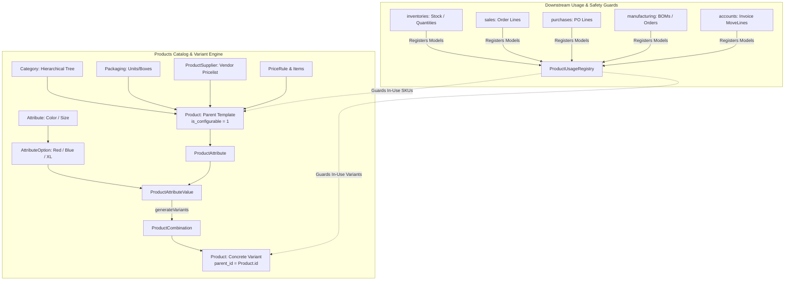

# Plugin: Products (`products`)

## Status
[VERIFIED]
Active Optional Module. Registered explicitly in `bootstrap/providers.php:54` as `Webkul\Product\ProductServiceProvider::class`.

## Core/Optional
[VERIFIED]
**Optional Plugin**. Configured as a modular business domain plugin without calling `$package->isCore()` (`plugins/webkul/products/src/ProductServiceProvider.php:24-64`). Execution and asset loading are gated by runtime installation verification via `Package::isPluginInstalled('products')` (`plugins/webkul/products/src/ProductServiceProvider.php:68` and `plugins/webkul/products/src/ProductPlugin.php:23`).

## Enabled/Disabled
[VERIFIED]
**Conditionally Enabled (Database-Gated)**. `ProductServiceProvider` boots conditionally based on whether the plugin record in the database marked `installed = true`. If uninstalled, observers, Filament resource registrations, and API routes are suppressed.

## Purpose
[VERIFIED]
The `products` module serves as the foundational product master data, catalog management, pricing rules, and configurable variant generation engine for Aureus ERP. It provides the central item repository referenced across supply chain, inventory, procurement, sales, manufacturing, and financial ledger domains:

1. **Self-Referencing Configurable Product Hierarchy (`Product`)**:
   - Manages both single/standalone items and parent configurable product templates alongside their concrete physical variants within a unified database table (`products_products`).
   - Distinguishes product template records (`parent_id = null`, `is_configurable = 1`) from concrete variant SKUs (`parent_id = <parent_product_id>`).
   - Supports product types via enum `ProductType` (`goods`, `service`).
   - Links foundational units of measure (`uom_id`, purchase unit `uom_po_id`) to the `support` module's `UOM` registry.

2. **Attribute-Driven Variant Generation & Combination Engine**:
   - Defines global attributes (`Attribute` on `products_attributes`) with display types (`radio`, `select`, `color`).
   - Defines reusable attribute options (`AttributeOption` on `products_attribute_options`) with optional surcharges (`extra_price`).
   - Binds attributes to product templates via `ProductAttribute` (`products_product_attributes`) and assigns specific options via `ProductAttributeValue` (`products_product_attribute_values`).
   - Generates cartesian-product variant combinations mapped via junction table `ProductCombination` (`products_product_combinations`).

3. **In-Use Guarding Architecture (`ProductUsageRegistry` & `VariantUsage`)**:
   - Implements `ProductUsageRegistry` (`plugins/webkul/products/src/Support/ProductUsageRegistry.php`), a dynamic registry allowing downstream plugins (`inventories`, `sales`, `purchases`, `manufacturing`, `accounts`) to register transactional and ledger models referencing `product_id`.
   - Prevents destructive modifications (e.g., converting a non-configurable product in use into configurable, removing attribute options whose variants are active in transactions, or deleting products in use) by throwing `ProductInUseException` or `VariantInUseException`.

4. **Hierarchical Taxonomy (`Category`)**:
   - Provides a self-referencing category tree (`products_categories`) with automated materialized path tracking (`parent_path`), recursive naming generation (`full_name`), and circular hierarchy prevention guards (`validateNoRecursion`).

5. **Packaging Specifications (`Packaging`)**:
   - Manages multi-quantity packaging configurations per product (`products_packagings`) with barcodes, quantities, and optional company scoping.

6. **Flexible Multi-Tier Pricing & Discount Rules (`PriceRule`, `PriceRuleItem`, `PriceList`)**:
   - Implements dynamic pricing rules (`products_price_rules`) and computation items (`products_price_rule_items`) supporting fixed prices, percentage discounts, and complex formula margins applied to products or categories based on min quantities and date windows.
   - Provides currency/company price lists (`products_product_price_lists`).

7. **Supplier Vendor Catalog & Pricelists (`ProductSupplier`)**:
   - Tracks vendor procurement pricing (`products_product_suppliers`), vendor part codes, vendor product names, delivery lead times (`delay`), quantity breaks (`min_qty`), discounts, and currency conversion.

8. **Dynamic Cross-Plugin Schema Extensibility (`ProductSchemaRegistry`)**:
   - Implements `ProductSchemaRegistry` extending `AbstractSchemaRegistry` to allow downstream modules (`accounts`, `inventories`, `sales`, `purchases`, `manufacturing`) to inject custom tabs, fields, infolist sections, table columns, filter presets, and eager loads without modifying core product files.

9. **Comprehensive REST API Suite**:
   - Exposes full REST API v1 endpoints under `admin/api/v1/products` for products, variants, categories, tags, attributes, attribute options, and packagings with soft-delete lifecycle management, Spatie QueryBuilder filtering/sorting/includes, and Scribe OpenAPI documentation.

## Service Provider
[VERIFIED]
- **Class**: `Webkul\Product\ProductServiceProvider` (`plugins/webkul/products/src/ProductServiceProvider.php:18`)
- **Inheritance**: Extends `Webkul\PluginManager\PackageServiceProvider`
- **Registration & Configuration**:
  - `configureCustomPackage(Package $package)`:
    - Sets package name to `products` (`ProductServiceProvider::$name = 'products'`).
    - Sets view namespace to `products` (`$viewNamespace = 'products'`).
    - Registers view namespace (`hasViews()`).
    - Registers translation namespace (`hasTranslations()`).
    - Registers API routes (`hasRoutes(['api'])`).
    - Registers 16 database migrations (`hasMigrations([...])`) and executes them (`runsMigrations()`):
      1. `2025_01_05_063925_create_products_categories_table`
      2. `2025_01_05_100751_create_products_products_table`
      3. `2025_01_05_100830_create_products_tags_table`
      4. `2025_01_05_100832_create_products_product_tag_table`
      5. `2025_01_05_104456_create_products_attributes_table`
      6. `2025_01_05_104512_create_products_attribute_options_table`
      7. `2025_01_05_104759_create_products_product_attributes_table`
      8. `2025_01_05_104809_create_products_product_attribute_values_table`
      9. `2025_01_05_105626_create_products_packagings_table`
      10. `2025_01_05_113357_create_products_price_rules_table`
      11. `2025_01_05_113402_create_products_price_rule_items_table`
      12. `2025_01_05_123412_create_products_product_suppliers_table`
      13. `2025_02_18_112837_create_products_product_price_lists_table`
      14. `2025_02_21_053249 _create_products_product_combinations_table`
      15. `2025_07_28_080116_alter_products_products_table`
      16. `2026_04_15_044431_add_columns_in_products_product_suppliers_table`
    - Registers database seeder: `Webkul\Product\Database\Seeders\DatabaseSeeder` (`hasSeeder(...)`).
    - Registers settings migration: `2025_01_17_094022_create_products_product_settings` (`hasSettings(...)`, `runsSettings()`).
    - Configures install command: runs migrations and seeders (`hasInstallCommand(...)`).
    - Configures uninstall command: purges chatter audit logs for `[Category::class, Product::class]` via `ChatterCleanupService::purgeForModels(...)` (`hasUninstallCommand(...)`).
  - `packageRegistered()`:
    - Registers `ProductPlugin::make()` with the Filament Panel builder via `Panel::configureUsing()`.
  - `packageBooted()`:
    - Executes runtime installation check `if (! Package::isPluginInstalled(static::$name)) { return; }`.
    - Registers `UOM::observe(UOMObserver::class)`.
    - Registers `ProductAttribute::observe(ProductAttributeObserver::class)`.

## Filament Plugin class
[VERIFIED]
- **Class**: `Webkul\Product\ProductPlugin` (`plugins/webkul/products/src/ProductPlugin.php:9`)
- **Interface**: Implements `Filament\Contracts\Plugin`
- **Identifier**: `getId()` returns `'products'` (`plugins/webkul/products/src/ProductPlugin.php:11-14`)
- **Factory Method**: `ProductPlugin::make()` resolves static singleton via `app(static::class)`
- **Panel Registration**:
  - `register(Panel $panel)`:
    - Evaluates `if (! Package::isPluginInstalled($this->getId())) { return; }`.
    - Scoped conditionally to the `admin` panel (`$panel->getId() == 'admin'`):
      - Discovers Resources under `src/Filament/Resources` in namespace `Webkul\Product\Filament\Resources` (`ProductResource`, `AttributeResource`, `CategoryResource`, `PackagingResource`, `PriceListResource`).
      - Discovers Pages under `src/Filament/Pages` in namespace `Webkul\Product\Filament\Pages` (none directly at root).
      - Discovers Clusters under `src/Filament/Clusters` in namespace `Webkul\Product\Filament\Clusters` (none directly at root).
      - Discovers Widgets under `src/Filament/Widgets` in namespace `Webkul\Product\Filament\Widgets` (none directly at root).
- **Boot**: `boot(Panel $panel)` contains empty method stub.

## Composer dependencies
[VERIFIED]
- **Local Package Definition**: `plugins/webkul/products/composer.json`
  - Name: `webkul/products`
  - Description: Product catalog and pricing module for Aureus ERP
  - Authors: Aureus ERP (`support@aureuserp.in`)
  - Autoload PSR-4:
    - `Webkul\Product\` -> `src/`
    - `Webkul\Product\Database\Factories\` -> `database/factories/`
    - `Webkul\Product\Database\Seeders\` -> `database/seeders/`
  - Autoload-dev PSR-4:
    - `Webkul\Product\Tests\` -> `tests/`
  - Extra Laravel Providers:
    - `Webkul\Product\ProductServiceProvider`

## Runtime plugin dependencies
[VERIFIED]
`products` declares **no runtime plugin dependencies** (`$package->hasDependencies([...])` is omitted in `ProductServiceProvider`). It acts as a foundational domain layer for downstream business modules (`accounts`, `inventories`, `manufacturing`, `purchases`, `sales`).

## Directory structure
[VERIFIED]
```text
plugins/webkul/products/
├── composer.json
├── config/
│   └── filament-shield.php
├── database/
│   ├── factories/
│   │   ├── AttributeFactory.php
│   │   ├── AttributeOptionFactory.php
│   │   ├── CategoryFactory.php
│   │   ├── PackagingFactory.php
│   │   ├── PriceListFactory.php
│   │   ├── PriceRuleFactory.php
│   │   ├── PriceRuleItemFactory.php
│   │   ├── ProductAttributeFactory.php
│   │   ├── ProductCombinationFactory.php
│   │   ├── ProductFactory.php
│   │   ├── ProductSupplierFactory.php
│   │   └── TagFactory.php
│   ├── migrations/
│   │   ├── 2025_01_05_063925_create_products_categories_table.php
│   │   ├── 2025_01_05_100751_create_products_products_table.php
│   │   ├── 2025_01_05_100830_create_products_tags_table.php
│   │   ├── 2025_01_05_100832_create_products_product_tag_table.php
│   │   ├── 2025_01_05_104456_create_products_attributes_table.php
│   │   ├── 2025_01_05_104512_create_products_attribute_options_table.php
│   │   ├── 2025_01_05_104759_create_products_product_attributes_table.php
│   │   ├── 2025_01_05_104809_create_products_product_attribute_values_table.php
│   │   ├── 2025_01_05_105626_create_products_packagings_table.php
│   │   ├── 2025_01_05_113357_create_products_price_rules_table.php
│   │   ├── 2025_01_05_113402_create_products_price_rule_items_table.php
│   │   ├── 2025_01_05_123412_create_products_product_suppliers_table.php
│   │   ├── 2025_02_18_112837_create_products_product_price_lists_table.php
│   │   ├── 2025_02_21_053249 _create_products_product_combinations_table.php
│   │   ├── 2025_07_28_080116_alter_products_products_table.php
│   │   └── 2026_04_15_044431_add_columns_in_products_product_suppliers_table.php
│   ├── seeders/
│   │   ├── DatabaseSeeder.php
│   │   ├── PriceListSeeder.php
│   │   ├── ProductCategorySeeder.php
│   │   └── ProductCombinationSeeder.php
│   └── settings/
│       └── 2025_01_17_094022_create_products_product_settings.php
├── resources/
│   ├── lang/
│   │   ├── ar/
│   │   ├── en/
│   │   │   ├── enums/
│   │   │   │   ├── attribute-type.php
│   │   │   │   ├── price-rule-apply-to.php
│   │   │   │   ├── price-rule-base.php
│   │   │   │   ├── price-rule-type.php
│   │   │   │   ├── product-removal.php
│   │   │   │   └── product-type.php
│   │   │   ├── exceptions/
│   │   │   │   ├── product-in-use.php
│   │   │   │   └── variant-in-use.php
│   │   │   ├── filament/
│   │   │   │   └── resources/
│   │   │   │       ├── attribute/
│   │   │   │       ├── attribute.php
│   │   │   │       ├── category/
│   │   │   │       ├── category.php
│   │   │   │       ├── packaging/
│   │   │   │       ├── packaging.php
│   │   │   │       ├── product/
│   │   │   │       └── product.php
│   │   │   ├── models/
│   │   │   │   ├── category.php
│   │   │   │   └── product.php
│   │   │   └── observers/
│   │   │       └── uom.php
│   │   ├── es/
│   │   ├── fr/
│   │   └── pt_BR/
│   └── views/
│       └── filament/
│           └── resources/
│               ├── packagings/
│               │   └── actions/
│               │       └── print.blade.php
│               └── products/
│                   └── actions/
│                       └── print.blade.php
├── routes/
│   └── api.php
├── src/
│   ├── Enums/
│   │   ├── AttributeType.php
│   │   ├── PriceRuleApplyTo.php
│   │   ├── PriceRuleBase.php
│   │   ├── PriceRuleType.php
│   │   ├── ProductRemoval.php
│   │   └── ProductType.php
│   ├── Exceptions/
│   │   ├── ProductInUseException.php
│   │   └── VariantInUseException.php
│   ├── Filament/
│   │   └── Resources/
│   │       ├── AttributeResource/
│   │       │   ├── Pages/
│   │       │   │   ├── CreateAttribute.php
│   │       │   │   ├── EditAttribute.php
│   │       │   │   ├── ListAttributes.php
│   │       │   │   └── ViewAttribute.php
│   │       │   ├── Schemas/
│   │       │   │   ├── AttributeForm.php
│   │       │   │   └── AttributeInfolist.php
│   │       │   └── Tables/
│   │       │       └── AttributesTable.php
│   │       ├── AttributeResource.php
│   │       ├── CategoryResource/
│   │       │   ├── Pages/
│   │       │   │   ├── CreateCategory.php
│   │       │   │   ├── EditCategory.php
│   │       │   │   ├── ListCategories.php
│   │       │   │   ├── ManageProducts.php
│   │       │   │   └── ViewCategory.php
│   │       │   ├── Schemas/
│   │       │   │   ├── CategoryForm.php
│   │       │   │   └── CategoryInfolist.php
│   │       │   └── Tables/
│   │       │       └── CategoriesTable.php
│   │       ├── CategoryResource.php
│   │       ├── PackagingResource/
│   │       │   ├── Pages/
│   │       │   │   └── ManagePackagings.php
│   │       │   ├── Schemas/
│   │       │   │   ├── PackagingForm.php
│   │       │   │   └── PackagingInfolist.php
│   │       │   └── Tables/
│   │       │       └── PackagingsTable.php
│   │       ├── PackagingResource.php
│   │       ├── PriceListResource/
│   │       │   ├── Pages/
│   │       │   │   ├── CreatePriceList.php
│   │       │   │   ├── EditPriceList.php
│   │       │   │   ├── ListPriceLists.php
│   │       │   │   └── ViewPriceList.php
│   │       │   ├── Schemas/
│   │       │   │   └── PriceListForm.php
│   │       │   └── Tables/
│   │       │       └── PriceListsTable.php
│   │       ├── PriceListResource.php
│   │       ├── ProductResource/
│   │       │   ├── Actions/
│   │       │   │   └── GenerateVariantsAction.php
│   │       │   ├── Pages/
│   │       │   │   ├── CreateProduct.php
│   │       │   │   ├── EditProduct.php
│   │       │   │   ├── ListProducts.php
│   │       │   │   ├── ManageAttributes.php
│   │       │   │   ├── ManageVariants.php
│   │       │   │   └── ViewProduct.php
│   │       │   ├── Schemas/
│   │       │   │   ├── ProductForm.php
│   │       │   │   └── ProductInfolist.php
│   │       │   ├── Support/
│   │       │   │   └── ProductSchemaRegistry.php
│   │       │   └── Tables/
│   │       │       └── ProductsTable.php
│   │       └── ProductResource.php
│   ├── Http/
│   │   ├── Controllers/
│   │   │   └── API/
│   │   │       └── V1/
│   │   │           ├── AttributeController.php
│   │   │           ├── AttributeOptionController.php
│   │   │           ├── CategoryController.php
│   │   │           ├── Controller.php
│   │   │           ├── PackagingController.php
│   │   │           ├── ProductAttributeController.php
│   │   │           ├── ProductController.php
│   │   │           ├── ProductVariantController.php
│   │   │           └── TagController.php
│   │   ├── Requests/
│   │   │   ├── AttributeOptionRequest.php
│   │   │   ├── AttributeRequest.php
│   │   │   ├── CategoryRequest.php
│   │   │   ├── PackagingRequest.php
│   │   │   ├── ProductAttributeRequest.php
│   │   │   ├── ProductAttributeValueRequest.php
│   │   │   ├── ProductRequest.php
│   │   │   └── TagRequest.php
│   │   └── Resources/
│   │       └── V1/
│   │           ├── AttributeOptionResource.php
│   │           ├── AttributeResource.php
│   │           ├── CategoryResource.php
│   │           ├── PackagingResource.php
│   │           ├── PriceListResource.php
│   │           ├── ProductAttributeResource.php
│   │           ├── ProductAttributeValueResource.php
│   │           ├── ProductResource.php
│   │           ├── ProductSupplierResource.php
│   │           └── TagResource.php
│   ├── Models/
│   │   ├── Attribute.php
│   │   ├── AttributeOption.php
│   │   ├── Category.php
│   │   ├── Packaging.php
│   │   ├── PriceList.php
│   │   ├── PriceRule.php
│   │   ├── PriceRuleItem.php
│   │   ├── Product.php
│   │   ├── ProductAttribute.php
│   │   ├── ProductAttributeValue.php
│   │   ├── ProductCombination.php
│   │   ├── ProductSupplier.php
│   │   └── Tag.php
│   ├── Observers/
│   │   ├── ProductAttributeObserver.php
│   │   └── UOMObserver.php
│   ├── Policies/
│   │   ├── AttributePolicy.php
│   │   ├── CategoryPolicy.php
│   │   ├── PackagingPolicy.php
│   │   ├── PriceListPolicy.php
│   │   ├── ProductPolicy.php
│   │   └── TagPolicy.php
│   ├── ProductPlugin.php
│   ├── ProductServiceProvider.php
│   ├── Settings/
│   │   └── ProductSettings.php
│   └── Support/
│       ├── ProductUsageRegistry.php
│       └── VariantUsage.php
└── tests/
    └── Feature/
        ├── API/
        │   └── V1/
        │       ├── AttributeOptionTest.php
        │       ├── AttributeTest.php
        │       ├── CategoryTest.php
        │       ├── PackagingTest.php
        │       ├── ProductAttributeTest.php
        │       ├── ProductTest.php
        │       ├── ProductVariantTest.php
        │       └── TagTest.php
        ├── Filament/
        │   ├── GenerateVariantsActionTest.php
        │   ├── ManageAttributesGuardTest.php
        │   └── ResourceGlobalSearchSmokeTest.php
        └── Workflows/
            ├── AttributeDeleteTest.php
            ├── AttributeRowDeleteTest.php
            ├── CompanyIsolationTest.php
            ├── CompanyScopingInvariantsTest.php
            └── ProductUsageRegistryTest.php
```

## Models
[VERIFIED]
The plugin owns 13 Eloquent models mapping to 13 database tables:

1. **`Product` (`Webkul\Product\Models\Product`)**:
   - Table: `products_products`
   - Traits: `BelongsToCompany`, `HasChatter`, `HasContributedAttributes`, `HasCustomFields`, `HasFactory`, `HasLogActivity`, `SoftDeletes`, `SortableTrait`.
   - Interfaces: `Spatie\EloquentSortable\Sortable`.
   - Company Scoping: Optional multi-tenant (`BelongsToCompany`), declares `autoAssignsCompany(): bool => false`. When `company_id = null`, the product is global/shared; when populated, it is isolated to that tenant.
   - Core Relationships:
     - `parent()`: `belongsTo(self::class)`
     - `variants()`: `hasMany(self::class, 'parent_id')`
     - `uom()`: `belongsTo(UOM::class, 'uom_id')`
     - `uomPO()`: `belongsTo(UOM::class, 'uom_po_id')`
     - `category()`: `belongsTo(Category::class)`
     - `tags()`: `belongsToMany(Tag::class, 'products_product_tag', 'product_id', 'tag_id')`
     - `company()`: `belongsTo(Company::class)`
     - `creator()`: `belongsTo(User::class)`
     - `attributes()`: `hasMany(ProductAttribute::class)`
     - `attribute_values()`: `hasMany(ProductAttributeValue::class, 'product_id')`
     - `combinations()`: `hasMany(ProductCombination::class, 'product_id')`
     - `priceRuleItems()`: `hasMany(PriceRuleItem::class)`
     - `sellers()`: `hasMany(ProductSupplier::class)` (aggregates supplier pricing for both parent template and its variants when configurable)
   - Dynamic Contributed Attributes (from `accounts` module):
     - `supplierTaxes`: `belongsToMany(Tax::class, 'accounts_product_supplier_taxes', 'product_id', 'tax_id')`
     - `companyProperties`: `hasMany(ProductCompanyAccount::class, 'product_id')`
     - `propertyAccountIncome`: `belongsTo(Account::class, 'property_account_income_id')`
     - Dynamic Casts: `property_account_income_id` and `property_account_expense_id` mapped via `CompanyProperty::class.':'.ProductCompanyAccount::class.',product_id'`.

2. **`Category` (`Webkul\Product\Models\Category`)**:
   - Table: `products_categories`
   - Traits: `HasChatter`, `HasContributedAttributes`, `HasCustomFields`, `HasFactory`, `HasLogActivity`.
   - Company Scoping: Global master data (no company isolation column).
   - Core Relationships:
     - `parent()`: `belongsTo(self::class)`
     - `children()`: `hasMany(self::class, 'parent_id')`
     - `products()`: `hasMany(Product::class)`
     - `creator()`: `belongsTo(User::class)`
     - `priceRuleItems()`: `hasMany(PriceRuleItem::class)`
   - Dynamic Contributed Attributes (from `accounts` module):
     - `companyProperties`: `hasMany(CategoryCompanyAccount::class, 'category_id')`
     - Dynamic Casts: `property_account_income_id`, `property_account_expense_id`, `property_account_down_payment_id` mapped via `CompanyProperty::class.':'.CategoryCompanyAccount::class.',category_id'`.

3. **`Attribute` (`Webkul\Product\Models\Attribute`)**:
   - Table: `products_attributes`
   - Traits: `HasCustomFields`, `HasFactory`, `SoftDeletes`, `SortableTrait`.
   - Relationships: `options()` (`hasMany(AttributeOption::class)`), `productAttributes()` (`hasMany(ProductAttribute::class)`), `creator()` (`belongsTo(User::class)`).

4. **`AttributeOption` (`Webkul\Product\Models\AttributeOption`)**:
   - Table: `products_attribute_options`
   - Traits: `HasFactory`, `SortableTrait`.
   - Relationships: `attribute()` (`belongsTo(Attribute::class)`), `creator()` (`belongsTo(User::class)`).

5. **`ProductAttribute` (`Webkul\Product\Models\ProductAttribute`)**:
   - Table: `products_product_attributes`
   - Traits: `HasFactory`, `SortableTrait`.
   - Relationships: `product()` (`belongsTo(Product::class)`), `attribute()` (`belongsTo(Attribute::class)->withTrashed()`), `options()` (`belongsToMany(AttributeOption::class, 'products_product_attribute_values', 'product_attribute_id', 'attribute_option_id')`), `values()` (`hasMany(ProductAttributeValue::class, 'product_attribute_id')`), `creator()` (`belongsTo(User::class)`).

6. **`ProductAttributeValue` (`Webkul\Product\Models\ProductAttributeValue`)**:
   - Table: `products_product_attribute_values` (no timestamps).
   - Relationships: `product()` (`belongsTo(Product::class)`), `attribute()` (`belongsTo(Attribute::class)`), `productAttribute()` (`belongsTo(ProductAttribute::class)`), `attributeOption()` (`belongsTo(AttributeOption::class)`), `creator()` (`belongsTo(User::class)`).

7. **`ProductCombination` (`Webkul\Product\Models\ProductCombination`)**:
   - Table: `products_product_combinations`
   - Traits: `HasFactory`.
   - Relationships: `product()` (`belongsTo(Product::class, 'product_id')`), `productAttributeValue()` (`belongsTo(ProductAttributeValue::class, 'product_attribute_value_id')`).

8. **`Packaging` (`Webkul\Product\Models\Packaging`)**:
   - Table: `products_packagings`
   - Traits: `BelongsToCompany`, `HasCustomFields`, `HasFactory`, `SortableTrait`.
   - Company Scoping: Optional multi-tenant (`autoAssignsCompany(): bool => false`).
   - Relationships: `product()` (`belongsTo(Product::class)->withTrashed()`), `company()` (`belongsTo(Company::class)`), `creator()` (`belongsTo(User::class)`).

9. **`PriceRule` (`Webkul\Product\Models\PriceRule`)**:
   - Table: `products_price_rules`
   - Traits: `BelongsToCompany`, `HasFactory`, `SoftDeletes`, `SortableTrait`.
   - Relationships: `currency()` (`belongsTo(Currency::class)`), `company()` (`belongsTo(Company::class)`), `creator()` (`belongsTo(User::class)`), `items()` (`hasMany(PriceRuleItem::class)`).

10. **`PriceRuleItem` (`Webkul\Product\Models\PriceRuleItem`)**:
    - Table: `products_price_rule_items`
    - Traits: `BelongsToCompany`, `HasFactory`.
    - Relationships: `priceRule()` (`belongsTo(PriceRule::class)`), `basePriceRule()` (`belongsTo(PriceRule::class)`), `product()` (`belongsTo(Product::class)`), `category()` (`belongsTo(Category::class)`), `currency()` (`belongsTo(Currency::class)`), `company()` (`belongsTo(Company::class)`), `creator()` (`belongsTo(User::class)`).

11. **`PriceList` (`Webkul\Product\Models\PriceList`)**:
    - Table: `products_product_price_lists`
    - Traits: `BelongsToCompany`, `HasCustomFields`, `HasFactory`, `SortableTrait`.
    - Relationships: `currency()` (`belongsTo(Currency::class)`), `company()` (`belongsTo(Company::class)`), `creator()` (`belongsTo(User::class)`).

12. **`ProductSupplier` (`Webkul\Product\Models\ProductSupplier`)**:
    - Table: `products_product_suppliers`
    - Traits: `BelongsToCompany`, `HasFactory`, `SortableTrait`.
    - Relationships: `product()` (`belongsTo(Product::class)`), `partner()` (`belongsTo(Partner::class)`), `currency()` (`belongsTo(Currency::class)`), `uom()` (`belongsTo(UOM::class, 'uom_id')`), `company()` (`belongsTo(Company::class)`), `creator()` (`belongsTo(User::class)`).

13. **`Tag` (`Webkul\Product\Models\Tag`)**:
    - Table: `products_tags`
    - Traits: `HasFactory`, `SoftDeletes`.
    - Relationships: `creator()` (`belongsTo(User::class)`).

## Database
[VERIFIED]
The plugin defines 14 physical database tables (13 owned entity tables + 1 junction table `products_product_tag`):

| Physical Table | Model Mapping | Primary Key | Foreign Keys / Indexes | Company Scoping | Deletion Behavior |
| :--- | :--- | :--- | :--- | :--- | :--- |
| `products_categories` | `Category` | `id` | `parent_id` -> `products_categories`, `creator_id` -> `users` | No (Global) | `cascadeOnDelete()` on parent category |
| `products_products` | `Product` | `id` | `parent_id` -> `products_products`, `uom_id` -> `unit_of_measures`, `uom_po_id` -> `unit_of_measures`, `category_id` -> `products_categories`, `company_id` -> `companies`, `creator_id` -> `users` | Optional (`BelongsToCompany`, nullable) | `cascadeOnDelete()` on parent/category, `restrictOnDelete()` on UOMs, `nullOnDelete()` on company/creator |
| `products_tags` | `Tag` | `id` | `creator_id` -> `users` | No (Global) | `nullOnDelete()` on creator |
| `products_product_tag` | Pivot (`tags`) | Composite (`product_id`, `tag_id`) | `product_id` -> `products_products`, `tag_id` -> `products_tags` | Via Product | `cascadeOnDelete()` on both foreign keys |
| `products_attributes` | `Attribute` | `id` | `creator_id` -> `users` | No (Global) | `nullOnDelete()` on creator |
| `products_attribute_options` | `AttributeOption` | `id` | `attribute_id` -> `products_attributes`, `creator_id` -> `users` | No (Global) | `cascadeOnDelete()` on attribute, `nullOnDelete()` on creator |
| `products_product_attributes` | `ProductAttribute` | `id` | `product_id` -> `products_products`, `attribute_id` -> `products_attributes`, `creator_id` -> `users` | Via Product | `cascadeOnDelete()` on product and attribute |
| `products_product_attribute_values` | `ProductAttributeValue` | `id` | `product_id` -> `products_products`, `attribute_id` -> `products_attributes`, `product_attribute_id` -> `products_product_attributes`, `attribute_option_id` -> `products_attribute_options` | Via Product | `cascadeOnDelete()` on product, attribute, and option |
| `products_packagings` | `Packaging` | `id` | `product_id` -> `products_products`, `company_id` -> `companies`, `creator_id` -> `users` | Optional (`BelongsToCompany`, nullable) | `cascadeOnDelete()` on product, `nullOnDelete()` on company/creator |
| `products_price_rules` | `PriceRule` | `id` | `currency_id` -> `currencies`, `company_id` -> `companies`, `creator_id` -> `users` | Optional (`BelongsToCompany`, nullable) | `restrictOnDelete()` on currency, `nullOnDelete()` on company/creator |
| `products_price_rule_items` | `PriceRuleItem` | `id` | `price_rule_id` -> `products_price_rules`, `base_price_rule_id` -> `products_price_rules`, `currency_id` -> `currencies`, `product_id` -> `products_products`, `category_id` -> `products_categories`, `company_id` -> `companies`, `creator_id` -> `users` | Optional (`BelongsToCompany`, nullable) | `cascadeOnDelete()` on price_rule_id, `nullOnDelete()` on base_price_rule/product/category/company/creator |
| `products_product_suppliers` | `ProductSupplier` | `id` | `product_id` -> `products_products`, `partner_id` -> `partners_partners`, `currency_id` -> `currencies`, `company_id` -> `companies`, `creator_id` -> `users`, `uom_id` -> `unit_of_measures` | Optional (`BelongsToCompany`, nullable) | `cascadeOnDelete()` on product/partner, `restrictOnDelete()` on currency, `nullOnDelete()` on company/creator/uom |
| `products_product_price_lists` | `PriceList` | `id` | `currency_id` -> `currencies`, `company_id` -> `companies`, `creator_id` -> `users` | Optional (`BelongsToCompany`, nullable) | `restrictOnDelete()` on currency, `nullOnDelete()` on company/creator |
| `products_product_combinations` | `ProductCombination` | `id` | `product_id` -> `products_products`, `product_attribute_value_id` -> `products_product_attribute_values` | Via Product | `cascadeOnDelete()` on product and attribute value |

## Filament resources/pages/widgets/clusters
[VERIFIED]
- **Base Resources**:
  1. `ProductResource` (`plugins/webkul/products/src/Filament/Resources/ProductResource.php`):
     - Navigation: `protected static bool $shouldRegisterNavigation = false;` (rendered via downstream clusters).
     - Global Search: Disabled globally (`$isGloballySearchable = false;`), searches attributes `['name', 'reference', 'barcode']`.
     - Query Customization: Eager loads `['uom', 'uomPO']` merged with `ProductSchemaRegistry::eagerLoads()`.
     - Sub-Pages:
       - `ListProducts` (`ProductResource/Pages/ListProducts.php`): Modifies query to `whereNull('parent_id')` so only product templates/standalone products are listed. Provides Preset Views for Goods, Services, Favorites, and Trashed.
       - `CreateProduct` (`ProductResource/Pages/CreateProduct.php`): Handles cross-company exception bubbling and database transactions.
       - `EditProduct` (`ProductResource/Pages/EditProduct.php`): Injects Chatter action, dynamic header actions from `ProductSchemaRegistry`, label printing modal action (`print`), and record navigation tabs (`HasRecordNavigationTabs`).
       - `ViewProduct` (`ProductResource/Pages/ViewProduct.php`): Injects Chatter action, dynamic header actions, and label printing action.
       - `ManageAttributes` (`ProductResource/Pages/ManageAttributes.php`): Relationship page for `$product->attributes()`. Displays assigned attributes and value badges. Includes header action `GenerateVariantsAction::make()`, guards against creating/editing/deleting attributes or options in use via `VariantUsage`, and executes inline variant re-generation.
       - `ManageVariants` (`ProductResource/Pages/ManageVariants.php`): Relationship page for `$product->variants()`. Displays configured variants with combination badge columns (`attribute: option`), edit modal, and view modal with print action.
     - Form Schemas:
       - `ProductForm` (`ProductResource/Schemas/ProductForm.php`): 3-column layout featuring General section (name, rich text description, tags), Media section (multi-image upload), Inventory logistics section (weight, volume), Settings section (product type radio, reference, barcode, category select, company select with foreign company clear cascading), Pricing section (sales price with UOM, cost price with PO UOM). Injects slots from `ProductSchemaRegistry`.
     - Infolists: `ProductInfolist` (`ProductResource/Schemas/ProductInfolist.php`).
     - Tables: `ProductsTable` (`ProductResource/Tables/ProductsTable.php`).
     - Actions: `GenerateVariantsAction` (`ProductResource/Actions/GenerateVariantsAction.php`).
  2. `AttributeResource` (`plugins/webkul/products/src/Filament/Resources/AttributeResource.php`):
     - Navigation: `protected static bool $shouldRegisterNavigation = false;`.
     - Sub-Pages: `ListAttributes`, `CreateAttribute`, `EditAttribute`, `ViewAttribute`.
     - Form: `AttributeForm` (general section with name and type radio, options section with repeater for option name, hex color picker, extra price).
     - Table: `AttributesTable`.
     - Infolist: `AttributeInfolist`.
  3. `CategoryResource` (`plugins/webkul/products/src/Filament/Resources/CategoryResource.php`):
     - Navigation: `protected static bool $shouldRegisterNavigation = false;`.
     - Sub-Pages: `ListCategories`, `CreateCategory`, `EditCategory`, `ViewCategory`, `ManageProducts` (relationship page for `$category->products()`).
     - Form: `CategoryForm` (name, parent category select with recursive circular reference prevention).
     - Table: `CategoriesTable`.
     - Infolist: `CategoryInfolist`.
  4. `PackagingResource` (`plugins/webkul/products/src/Filament/Resources/PackagingResource.php`):
     - Navigation: `protected static bool $shouldRegisterNavigation = false;`.
     - Sub-Pages: `ManagePackagings` (`PackagingResource/Pages/ManagePackagings.php`).
     - Form: `PackagingForm`.
     - Table: `PackagingsTable`.
     - Infolist: `PackagingInfolist`.
  5. `PriceListResource` (`plugins/webkul/products/src/Filament/Resources/PriceListResource.php`):
     - Navigation: `protected static bool $shouldRegisterNavigation = false;`.
     - Sub-Pages: `ListPriceLists`, `CreatePriceList`, `EditPriceList`, `ViewPriceList`.
     - Form: `PriceListForm`.
     - Table: `PriceListsTable`.
- **Clusters & Widgets**: No standalone clusters or widgets are defined directly inside `products`; downstream domain modules extend and cluster these resources.

## Panels
[VERIFIED]
- **Admin Panel (`admin`)**: `ProductPlugin` registers all 5 resources (`ProductResource`, `AttributeResource`, `CategoryResource`, `PackagingResource`, `PriceListResource`) into the `admin` panel when installed (`plugins/webkul/products/src/ProductPlugin.php:28-46`).
- **Customer Panel (`customer`)**: Products plugin does not register resources directly into the `customer` panel.

## Services
[VERIFIED]
- **`ProductUsageRegistry` (`Webkul\Product\Support\ProductUsageRegistry`)**:
  - Central dynamic registry for recording downstream Eloquent models referencing `product_id`.
  - Methods:
    - `register(string ...$models): void`: Validates and registers models.
    - `models(): array`: Returns array of registered models.
    - `isProductInUse(int|string $productId): bool`: Checks single product usage across all registered models without company global scopes.
    - `isAnyProductInUse($productIds): bool`: Batch usage check per registered table model to avoid N+1 queries during bulk variant operations.
    - `flush(): void`: Clears registered models (used in test teardown).
- **`VariantUsage` (`Webkul\Product\Support\VariantUsage`)**:
  - Specialized helper determining if deleting attributes, options, or attribute values will corrupt active child variants in use.
  - Methods:
    - `productHasVariantsInUse(int|string $productId): bool`
    - `optionsHaveVariantsInUse($attributeOptionIds): bool`
    - `valuesHaveVariantsInUse(array $productAttributeValueIds): bool`
- **`ProductSchemaRegistry` (`Webkul\Product\Filament\Resources\ProductResource\Support\ProductSchemaRegistry`)**:
  - Extends `AbstractSchemaRegistry` under scope `'product'` to support dynamic injection of form sections, infolists, table columns, filter presets, and header actions from external plugins.

## Events
[VERIFIED]
No custom Laravel Event classes are defined in `plugins/webkul/products`.

## Listeners
[VERIFIED]
No custom Laravel Event Listeners are defined in `plugins/webkul/products`.

## Observers
[VERIFIED]
1. **Registered Service Provider Observers**:
   - `Webkul\Product\Observers\UOMObserver`:
     - Registered in `ProductServiceProvider::packageBooted()`.
     - Intercepts `UOM::deleting()`: Checks if the `UOM` record is assigned as `uom_id` or `uom_po_id` on any `Product` (including soft-deleted products via `withTrashed()`). If in use, throws an exception preventing deletion.
   - `Webkul\Product\Observers\ProductAttributeObserver`:
     - Registered in `ProductServiceProvider::packageBooted()`.
     - Intercepts `ProductAttribute::creating()`: Checks if the target product is not yet configurable (`is_configurable = false`) and already referenced in transactions via `ProductUsageRegistry::isProductInUse()`. If so, throws `ProductInUseException` preventing dynamic variant conversion.
2. **Model Lifecycle Hooks (`boot` methods)**:
   - `Product::boot()`:
     - `creating`: Stamps `creator_id = Auth::id()`.
     - `saved`: When a parent template is saved, synchronizes `is_storable` and `company_id` down to all child variants (bypassing `CompanyScope`).
     - `deleting`: Cascades soft delete or force delete down to child variants (`$product->variants()->forceDelete()` / `$product->variants()->delete()`).
   - `Attribute::boot()`:
     - `creating`: Stamps `creator_id ??= Auth::id()`.
     - `deleting`: If force deleting, checks `VariantUsage::optionsHaveVariantsInUse()` and throws `VariantInUseException` if options are active.
   - `AttributeOption::boot()`:
     - `creating`: Stamps `creator_id ??= Auth::id()`.
     - `deleting`: Checks `VariantUsage::optionsHaveVariantsInUse()` and throws `VariantInUseException`.
   - `ProductAttribute::boot()`:
     - `creating`: Stamps `creator_id ??= Auth::id()`.
     - `deleting`: Checks `VariantUsage::productHasVariantsInUse()`; if safe, force deletes child variants.
   - `Category::boot()`:
     - `creating` / `updating`: Runs `validateNoRecursion($category)` to detect and prevent circular category trees. Automatically builds `parent_path` (`/1/2/`) and computed `full_name` (`Parent / Child`). Sets `creator_id`.
   - `ProductSupplier::boot()`:
     - `creating`: Stamps `creator_id` and sets `company_id` matching the Product's company or active session company.
   - `Packaging::boot()`, `PriceRule::boot()`, `PriceRuleItem::boot()`, `PriceList::boot()`, `Tag::boot()`:
     - `creating`: Stamps `creator_id ??= Auth::id()`.

## Policies
[VERIFIED]
6 authorization policies mapped via Filament Shield and registered in `config/filament-shield.php`:
1. `ProductPolicy` (`plugins/webkul/products/src/Policies/ProductPolicy.php`): Checks permissions `view_any_product_product`, `view_product_product`, `create_product_product`, `update_product_product`, `delete_product_product`, `delete_any_product_product`, `force_delete_product_product`, `force_delete_any_product_product`, `restore_product_product`, `restore_any_product_product`, `reorder_product_product`.
2. `AttributePolicy` (`plugins/webkul/products/src/Policies/AttributePolicy.php`): Checks `*_product_attribute` permissions.
3. `CategoryPolicy` (`plugins/webkul/products/src/Policies/CategoryPolicy.php`): Checks `*_product_category` permissions.
4. `PackagingPolicy` (`plugins/webkul/products/src/Policies/PackagingPolicy.php`): Checks `*_product_packaging` permissions.
5. `PriceListPolicy` (`plugins/webkul/products/src/Policies/PriceListPolicy.php`): Checks `*_product_price_list` permissions.
6. `TagPolicy` (`plugins/webkul/products/src/Policies/TagPolicy.php`): Checks `*_product_tag` permissions.

## Routes
[VERIFIED]
The plugin registers REST API v1 endpoints under route group prefix `admin/api/v1/products` protected by `auth:sanctum` middleware (`plugins/webkul/products/routes/api.php`):

| HTTP Method | URI | Action Method | Controller | Description |
| :--- | :--- | :--- | :--- | :--- |
| `GET` | `/admin/api/v1/products/categories` | `index` | `CategoryController` | List hierarchical product categories |
| `POST` | `/admin/api/v1/products/categories` | `store` | `CategoryController` | Create product category |
| `GET` | `/admin/api/v1/products/categories/{category}` | `show` | `CategoryController` | Show category details |
| `PUT`/`PATCH` | `/admin/api/v1/products/categories/{category}` | `update` | `CategoryController` | Update category |
| `DELETE` | `/admin/api/v1/products/categories/{category}` | `destroy` | `CategoryController` | Delete category |
| `GET` | `/admin/api/v1/products/tags` | `index` | `TagController` | List tags (supports trashed filter) |
| `POST` | `/admin/api/v1/products/tags` | `store` | `TagController` | Create tag |
| `GET` | `/admin/api/v1/products/tags/{tag}` | `show` | `TagController` | Show tag |
| `PUT`/`PATCH` | `/admin/api/v1/products/tags/{tag}` | `update` | `TagController` | Update tag |
| `DELETE` | `/admin/api/v1/products/tags/{tag}` | `destroy` | `TagController` | Soft delete tag |
| `PUT`/`PATCH` | `/admin/api/v1/products/tags/{tag}/restore` | `restore` | `TagController` | Restore soft-deleted tag |
| `DELETE` | `/admin/api/v1/products/tags/{tag}/force` | `forceDestroy` | `TagController` | Permanently delete tag |
| `GET` | `/admin/api/v1/products/attributes` | `index` | `AttributeController` | List attributes |
| `POST` | `/admin/api/v1/products/attributes` | `store` | `AttributeController` | Create attribute |
| `GET` | `/admin/api/v1/products/attributes/{attribute}` | `show` | `AttributeController` | Show attribute |
| `PUT`/`PATCH` | `/admin/api/v1/products/attributes/{attribute}` | `update` | `AttributeController` | Update attribute |
| `DELETE` | `/admin/api/v1/products/attributes/{attribute}` | `destroy` | `AttributeController` | Soft delete attribute |
| `PUT`/`PATCH` | `/admin/api/v1/products/attributes/{attribute}/restore` | `restore` | `AttributeController` | Restore soft-deleted attribute |
| `DELETE` | `/admin/api/v1/products/attributes/{attribute}/force` | `forceDestroy` | `AttributeController` | Permanently delete attribute |
| `GET` | `/admin/api/v1/products/attributes/{attribute}/options` | `index` | `AttributeOptionController` | List attribute options |
| `POST` | `/admin/api/v1/products/attributes/{attribute}/options` | `store` | `AttributeOptionController` | Create attribute option |
| `GET` | `/admin/api/v1/products/attributes/{attribute}/options/{option}` | `show` | `AttributeOptionController` | Show attribute option |
| `PUT`/`PATCH` | `/admin/api/v1/products/attributes/{attribute}/options/{option}` | `update` | `AttributeOptionController` | Update attribute option |
| `DELETE` | `/admin/api/v1/products/attributes/{attribute}/options/{option}` | `destroy` | `AttributeOptionController` | Delete attribute option |
| `GET` | `/admin/api/v1/products/products` | `index` | `ProductController` | List products / parent templates |
| `POST` | `/admin/api/v1/products/products` | `store` | `ProductController` | Create product template/item |
| `GET` | `/admin/api/v1/products/products/{product}` | `show` | `ProductController` | Show product details |
| `PUT`/`PATCH` | `/admin/api/v1/products/products/{product}` | `update` | `ProductController` | Update product |
| `DELETE` | `/admin/api/v1/products/products/{product}` | `destroy` | `ProductController` | Soft delete product |
| `PUT`/`PATCH` | `/admin/api/v1/products/products/{product}/restore` | `restore` | `ProductController` | Restore soft-deleted product |
| `DELETE` | `/admin/api/v1/products/products/{product}/force` | `forceDestroy` | `ProductController` | Permanently delete product |
| `GET` | `/admin/api/v1/products/products/{product}/attributes` | `index` | `ProductAttributeController` | List product's assigned attributes |
| `POST` | `/admin/api/v1/products/products/{product}/attributes` | `store` | `ProductAttributeController` | Assign attribute to product |
| `GET` | `/admin/api/v1/products/products/{product}/attributes/{attribute}` | `show` | `ProductAttributeController` | Show assigned attribute |
| `PUT`/`PATCH` | `/admin/api/v1/products/products/{product}/attributes/{attribute}` | `update` | `ProductAttributeController` | Update assigned attribute options |
| `DELETE` | `/admin/api/v1/products/products/{product}/attributes/{attribute}` | `destroy` | `ProductAttributeController` | Remove assigned attribute |
| `GET` | `/admin/api/v1/products/products/{product}/variants` | `index` | `ProductVariantController` | List child variants for product |
| `POST` | `/admin/api/v1/products/products/{product}/variants` | `store` | `ProductVariantController` | Trigger variant generation/sync |
| `GET` | `/admin/api/v1/products/products/{product}/variants/{variant}` | `show` | `ProductVariantController` | Show specific variant |
| `PUT`/`PATCH` | `/admin/api/v1/products/products/{product}/variants/{variant}` | `update` | `ProductVariantController` | Update specific variant |
| `DELETE` | `/admin/api/v1/products/products/{product}/variants/{variant}` | `destroy` | `ProductVariantController` | Soft delete variant |
| `PUT`/`PATCH` | `/admin/api/v1/products/products/{product}/variants/{variant}/restore` | `restore` | `ProductVariantController` | Restore soft-deleted variant |
| `DELETE` | `/admin/api/v1/products/products/{product}/variants/{variant}/force` | `forceDestroy` | `ProductVariantController` | Permanently delete variant |
| `GET` | `/admin/api/v1/products/packagings` | `index` | `PackagingController` | List packagings |
| `POST` | `/admin/api/v1/products/packagings` | `store` | `PackagingController` | Create packaging |
| `GET` | `/admin/api/v1/products/packagings/{packaging}` | `show` | `PackagingController` | Show packaging |
| `PUT`/`PATCH` | `/admin/api/v1/products/packagings/{packaging}` | `update` | `PackagingController` | Update packaging |
| `DELETE` | `/admin/api/v1/products/packagings/{packaging}` | `destroy` | `PackagingController` | Delete packaging |

## Settings
[VERIFIED]
- **Class**: `Webkul\Product\Settings\ProductSettings` (`plugins/webkul/products/src/Settings/ProductSettings.php:7`)
- **Group**: `products_product`
- **Fields**:
  - `enable_variants` (`bool`, default: `true`)
  - `enable_uom` (`bool`, default: `false`)
  - `enable_packagings` (`bool`, default: `false`)
- **Migration**: `plugins/webkul/products/database/settings/2025_01_17_094022_create_products_product_settings.php`.

## Translations
[VERIFIED]
- Namespace: `products`
- Languages Supported: `en`, `ar`, `es`, `fr`, `pt_BR` under `resources/lang/`
- Translation Structure:
  - `enums/`: `attribute-type.php`, `price-rule-apply-to.php`, `price-rule-base.php`, `price-rule-type.php`, `product-removal.php`, `product-type.php`.
  - `exceptions/`: `product-in-use.php`, `variant-in-use.php`.
  - `filament/resources/`: `attribute.php`, `category.php`, `packaging.php`, `product.php`, and nested page translations.
  - `models/`: `category.php`, `product.php`.
  - `observers/`: `uom.php`.

## Tests
[VERIFIED]
The `products` plugin contains an extensive, dedicated Pest automated test suite with **16 test files** under `plugins/webkul/products/tests/`:
- **API Tests (`tests/Feature/API/V1/`)**:
  - `AttributeOptionTest.php`: Complete CRUD and authorization tests for attribute options.
  - `AttributeTest.php`: Soft delete, restore, force delete, and filtering tests for attributes.
  - `CategoryTest.php`: Hierarchical category creation, recursive nesting, and authorization tests.
  - `PackagingTest.php`: Product packaging API endpoint assertions.
  - `ProductAttributeTest.php`: Attribute assignment to product templates.
  - `ProductTest.php`: Product catalog CRUD, search, and soft-delete endpoints.
  - `ProductVariantTest.php`: Variant listing, generation trigger (`store`), variant update, and soft-delete lifecycle.
  - `TagTest.php`: Color-coded tag endpoint tests.
- **Filament UI Tests (`tests/Feature/Filament/`)**:
  - `GenerateVariantsActionTest.php`: Verifies `products.generate.variants` action execution, error reporting to logs, and Livewire notifications.
  - `ManageAttributesGuardTest.php`: Verifies UI safeguards preventing attribute deletion or conversion when products are in use.
  - `ResourceGlobalSearchSmokeTest.php`: Smoke test for global search attributes across product resources.
- **Workflow & Invariant Tests (`tests/Feature/Workflows/`)**:
  - `AttributeDeleteTest.php`: Verifies database cascades and variant deletion protections when deleting attributes.
  - `AttributeRowDeleteTest.php`: Tests row-level attribute deletion safeguards.
  - `CompanyIsolationTest.php`: Validates multi-tenant query isolation and access boundaries.
  - `CompanyScopingInvariantsTest.php`: Enforces that declared shared models (`Product`, `Packaging`) maintain nullable company columns and do not unexpectedly auto-stamp tenant IDs.
  - `ProductUsageRegistryTest.php`: Verifies model registration, table existence checks, and multi-company cross-reference detection in `ProductUsageRegistry`.

## Runtime dependencies
[VERIFIED]
The `products` module declares **no runtime dependencies** (`hasDependencies` is not called). It sits upstream of all transactional operational modules.

## Cross-plugin relationships
[VERIFIED]
1. **`support` [CORE]**:
   - Consumes `UOM` (`Webkul\Support\Models\UOM`) on `products_products.uom_id` and `uom_po_id` and `products_product_suppliers.uom_id`.
   - Consumes `Company` (`Webkul\Support\Models\Company`) for optional multi-tenant isolation.
   - Consumes `Currency` (`Webkul\Support\Models\Currency`) on `PriceRule`, `PriceList`, and `ProductSupplier`.
2. **`security` [CORE]**:
   - Binds `User` (`Webkul\Security\Models\User`) to `creator_id` audit columns across all 13 models.
   - Uses `Webkul\Product\Policies\*` for Filament Shield permission gates.
3. **`partners` [CORE]**:
   - Binds `Partner` (`Webkul\Partner\Models\Partner`) to `ProductSupplier.partner_id` for vendor supplier pricelists and lead time tracking.
4. **`chatter` [CORE]**:
   - Integrates `HasChatter` and `HasLogActivity` traits on `Product` and `Category`.
   - Automatically cleans up chatter activity upon plugin uninstallation via `ChatterCleanupService::purgeForModels([Category::class, Product::class])`.
5. **`fields` [CORE]**:
   - Integrates `HasCustomFields` on `Product`, `Category`, `Attribute`, `Packaging`, and `PriceList`.
6. **`accounts` [OPTIONAL]**:
   - Downstream integration: `AccountServiceProvider` contributes financial property casts (`property_account_income_id`, `property_account_expense_id`, `property_account_down_payment_id`) via `CompanyProperty` to `Product` and `Category`.
   - Resolves supplier taxes via junction table `accounts_product_supplier_taxes`.
   - Registers `MoveLine::class` with `ProductUsageRegistry::register(...)`.
7. **`inventories` [OPTIONAL]**:
   - Downstream consumer: Registers stock movements (`Move`, `MoveLine`), stock on hand (`ProductQuantity`), lots (`Lot`), order points (`OrderPoint`), putaway rules (`PutawayRule`), and scraps (`Scrap`) with `ProductUsageRegistry`.
   - Embeds `ProductResource` within its `Clusters\Products` panel hierarchy.
8. **`sales` [OPTIONAL]**:
   - Downstream consumer: References products on `OrderLine` and `Option`, registering them with `ProductUsageRegistry`.
9. **`purchases` [OPTIONAL]**:
   - Downstream consumer: References products on purchase orders and requisitions (`OrderLine`, `RequisitionLine`), registering them with `ProductUsageRegistry`.
10. **`manufacturing` [OPTIONAL]**:
    - Downstream consumer: References products on BOMs (`BillOfMaterial`, `BillOfMaterialLine`, `BillOfMaterialByproduct`) and manufacturing orders (`Order`), registering them with `ProductUsageRegistry`.

## Data flow
[VERIFIED]


## Business rules
[VERIFIED]
1. **Variant Generation Strategy (Inline Model Logic)**:
   - Variant generation logic is encapsulated in `Webkul\Product\Models\Product::generateVariants()`.
   - When triggered, it computes the Cartesian product of all assigned `ProductAttributeValue` options, computes variant display names (`Parent - Option1 / Option2`), base prices (`parent.price + sum(extra_price)`), and SKUs.
   - Synchronizes `ProductCombination` pivot entries for existing variants and instantiates new child `Product` records (`parent_id = $this->id`).
   - Automatically cleans up orphaned variants whose combination values were unassigned, unless prevented by in-use safeguards.
   - Sets `$this->is_configurable = true`.
2. **In-Use Mutation Protection**:
   - A standard product (`is_configurable = false`) that is already referenced in transactions (stock quantities, sales lines, POs, invoices) cannot have attributes assigned to convert it into a configurable parent template (`ProductAttributeObserver::creating()` throws `ProductInUseException`).
   - Attribute options or attributes whose resulting variants are active in downstream transaction documents cannot be deleted or pruned (`VariantUsage` throws `VariantInUseException`).
3. **Multi-Tenant Sharing vs Isolation**:
   - `Product` and `Packaging` opt out of automatic company assignment (`autoAssignsCompany(): bool => false`).
   - A product with `company_id = null` is universally visible across all company workspaces.
   - A product with a specific `company_id` is restricted strictly to that tenant via `CompanyScope`.
   - When a parent template is saved, its `company_id` and `is_storable` flag automatically synchronize down to all child variants via `Product::saved()`.
4. **Category Recursion & Materialized Path**:
   - Categories enforce a strict hierarchy without cyclic parent loops (`Category::validateNoRecursion()`).
   - Upon save, `parent_path` is calculated as `/{parent1_id}/{parent2_id}/` and `full_name` is formatted recursively as `Parent / Subcategory / Leaf`.
5. **Vendor Seller Selection Algorithm**:
   - `$product->getSeller(...)` evaluates active date ranges (`starts_at`, `ends_at`), partner matching, minimum quantities (`min_qty`), and converts currency to return the optimal vendor price.

## Extension points
[VERIFIED]
- **`ProductSchemaRegistry`**: Allows external plugins to register custom tabs, fieldsets, infolist entries, table columns, filter presets, and header actions on `ProductResource`.
- **`ProductUsageRegistry`**: Downstream modules register models containing `product_id` foreign keys to participate in global in-use deletion protection.
- **`HasContributedAttributes`**: Enables external packages (such as `accounts`) to contribute dynamic casts (e.g. `CompanyProperty`) and dynamic Eloquent relationships (`supplierTaxes`, `propertyAccountIncome`, `companyProperties`) to `Product` and `Category`.

## Dangerous areas
[VERIFIED]
1. **Direct Variant Manipulation**:
   - Directly creating or deleting records in `products_products` with a `parent_id` without updating `products_product_combinations` or executing `generateVariants()` will desynchronize the variant matrix from its attribute definitions.
2. **Bypassing `ProductUsageRegistry`**:
   - If a new plugin adds transactional tables referencing `product_id` but fails to register those models in `ProductUsageRegistry::register(...)`, the product module will not know records are in use and may allow variant regeneration or attribute deletion that orphans child SKUs.
3. **Company Scope Synchronization on Variants**:
   - Variants inherit `company_id` from their parent template. Updating a variant's `company_id` directly in the database without updating the parent template will cause `Product::saved()` to overwrite the variant's company when the parent is next saved.
4. **Test Suite Coverage**:
   - Explicit verification: `products` possesses a comprehensive 16-file test suite (`tests/Feature/API/V1`, `tests/Feature/Filament`, `tests/Feature/Workflows`). Running `php artisan test --filter=Product` validates API endpoints, UI actions, company scoping invariants, and safety guards.

## Change impact
[VERIFIED]
Modifications to `products` have high architectural impact across the entire Aureus ERP suite:
- Changes to `Product` or `Category` models directly affect `inventories`, `manufacturing`, `sales`, `purchases`, `accounts`, `invoices`, and `website`.
- Changes to `ProductUsageRegistry` or `VariantUsage` impact transactional referential integrity across all supply chain modules.
- Changes to `ProductSchemaRegistry` alter dynamic form and table rendering in all consuming domain plugins.

## Evidence
[VERIFIED]
- Service Provider & Lifecycle: `plugins/webkul/products/src/ProductServiceProvider.php`
- Plugin Class & Panel Registration: `plugins/webkul/products/src/ProductPlugin.php`
- Core Models & Variant Logic: `plugins/webkul/products/src/Models/Product.php`, `Category.php`, `Attribute.php`, `AttributeOption.php`, `ProductAttribute.php`, `ProductAttributeValue.php`, `ProductCombination.php`, `ProductSupplier.php`, `Packaging.php`, `PriceRule.php`, `PriceRuleItem.php`, `PriceList.php`, `Tag.php`
- Observers & In-Use Guards: `plugins/webkul/products/src/Observers/ProductAttributeObserver.php`, `UOMObserver.php`, `src/Support/ProductUsageRegistry.php`, `src/Support/VariantUsage.php`
- Filament UI & Variant Action: `plugins/webkul/products/src/Filament/Resources/ProductResource/Actions/GenerateVariantsAction.php`, `Pages/ManageAttributes.php`, `Pages/ManageVariants.php`, `Schemas/ProductForm.php`, `Support/ProductSchemaRegistry.php`
- API Routing & Controllers: `plugins/webkul/products/routes/api.php`, `src/Http/Controllers/API/V1/ProductController.php`, `ProductVariantController.php`
- Migrations: `plugins/webkul/products/database/migrations/2025_01_05_100751_create_products_products_table.php`, `2025_02_21_053249 _create_products_product_combinations_table.php`
- Automated Pest Tests: `plugins/webkul/products/tests/Feature/API/V1/ProductVariantTest.php`, `tests/Feature/Filament/GenerateVariantsActionTest.php`, `tests/Feature/Workflows/ProductUsageRegistryTest.php`, `CompanyScopingInvariantsTest.php`
