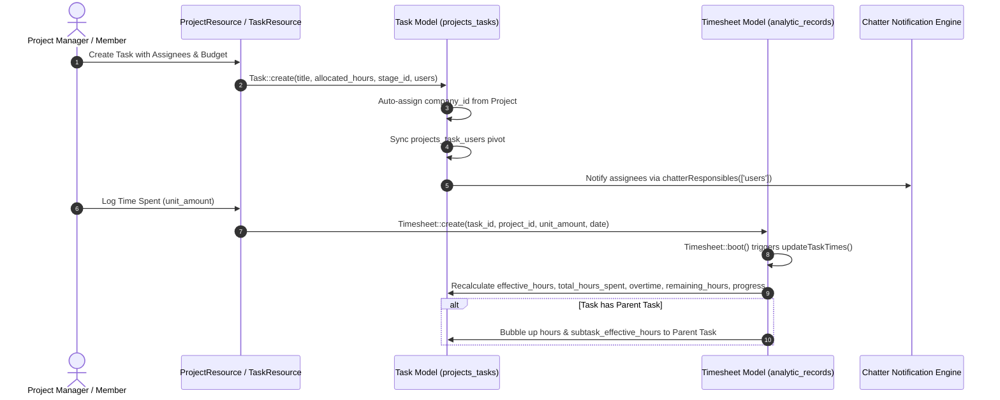

# Plugin: Projects (`projects`)

## Status
[VERIFIED]
Active Optional Module. Registered in `bootstrap/providers.php:49` as `Webkul\Project\ProjectServiceProvider::class`.

## Core/Optional
[VERIFIED]
**Optional Plugin**. Configured as an optional domain module without calling `$package->isCore()` (`plugins/webkul/projects/src/ProjectServiceProvider.php:14-55`). Execution and Filament UI registration are gated by runtime installation verification via `Package::isPluginInstalled('projects')` (`plugins/webkul/projects/src/ProjectPlugin.php:23`).

## Enabled/Disabled
[VERIFIED]
**Conditionally Enabled (Database-Gated)**. `ProjectServiceProvider` registers package capabilities, migrations, settings, routes, and translations, but Filament admin panel resources, pages, clusters, and widgets are discovered and registered only when `Package::isPluginInstalled('projects')` returns true (`plugins/webkul/projects/src/ProjectPlugin.php:23-46`).

## Purpose
[VERIFIED]
The `projects` module provides full-lifecycle project management, task execution tracking, milestone checkpoints, stage-based workflow pipelines, multi-assignee task distribution, and foundational time-tracking integration for Aureus ERP:

1. **Project Master Workspace (`Project`)**:
   - Manages project headers (`projects_projects`) with client association (`partner_id`), project manager assignment (`user_id`), start/end schedules (`start_date`, `end_date`), allocated budgets (`allocated_hours`), and color branding (`color`).
   - Implements multi-tier access visibility (`ProjectVisibility`: `private`, `internal`, `public`) and feature flags (`allow_timesheets`, `allow_milestones`, `allow_task_dependencies`, `is_active`).
   - Supports user favorite project pinning via junction table `projects_user_project_favorites` and accessor `is_favorite_by_user`.
   - Provides automated calculation of remaining hours budget (`remaining_hours` attribute subtracting task remaining hours from allocated project hours).

2. **Actionable Task Ticket System & Hierarchy (`Task`)**:
   - Manages task tickets (`projects_tasks`) with execution priority (`priority`), workflow state (`TaskState`: `in_progress`, `change_requested`, `approved`, `cancelled`, `done`), stage classification (`stage_id`), and deadline schedules (`deadline`).
   - Implements self-referencing parent-child subtask trees (`parent_id`, `subTasks()`).
   - Maintains real-time task time tracking metrics: `working_hours_open`, `working_hours_close`, `allocated_hours`, `remaining_hours`, `effective_hours`, `total_hours_spent`, `subtask_effective_hours`, `overtime`, and completion percentage `progress`.
   - Automatically synchronizes company isolation from parent project upon creation (`Project::withoutGlobalScope(CompanyScope::class)->find($task->project_id)?->company_id ?? current_company_id()`).

3. **Stage-Based Pipeline Architecture (`ProjectStage`, `TaskStage`)**:
   - **Project Stages (`ProjectStage`)**: Global or company-scoped lifecycle stages (`projects_project_stages`) for high-level project status tracking (e.g., Planning, In Progress, Completed), feature-flagged via `TaskSettings::$enable_project_stages`.
   - **Task Stages (`TaskStage`)**: Project-scoped workflow stage columns (`projects_task_stages`) defining the progression pipeline for individual task tickets within a project.

4. **Milestone Checkpoints (`Milestone`)**:
   - Tracks target delivery deadlines, completion flags (`is_completed`), and completion timestamps (`completed_at`) per project (`projects_milestones`).
   - Conditionally enabled per system via `TaskSettings::$enable_milestones` and per project via `Project::$allow_milestones`.

5. **Multi-Assignee Task Distribution (`projects_task_users`)**:
   - Distributes tasks across multiple assignees using the `projects_task_users` pivot table, tracking `task_id`, `user_id`, and optional `stage_id`.
   - Integrates assignees directly into Chatter notifications (`chatterResponsibles() = ['users']`) and permission evaluation (`TaskPolicy` checks `$this->hasAccess($user, $task, 'users')`).

6. **Analytic Ledger Foundation for Timesheets (`analytic_records`)**:
   - Alters the Core `analytics` table `analytic_records` by adding foreign keys `project_id` and `task_id` (`nullOnDelete`).
   - Provides the base Eloquent model `Webkul\Project\Models\Timesheet` (extending `Webkul\Analytic\Models\Record`) that triggers automatic rollup calculations (`updateTaskTimes()`) on task duration, progress, and parent tasks.

7. **Tagging & Taxonomy (`Tag`)**:
   - Manages color-coded classification tags (`projects_tags`) attached to projects (`projects_project_tag`) and tasks (`projects_task_tag`).

8. **Executive Project Dashboard & Analytics (`Dashboard`)**:
   - Delivers a dedicated analytics overview page (`/admin/project`) featuring KPIs (`StatsOverviewWidget`), stage distribution charts (`TaskByStageChart`), state distribution charts (`TaskByStateChart`), top project assignees (`TopAssigneesWidget`), and top projects by time/progress (`TopProjectsWidget`).

## Service Provider
[VERIFIED]
- **Class**: `Webkul\Project\ProjectServiceProvider` (`plugins/webkul/projects/src/ProjectServiceProvider.php:14`)
- **Inheritance**: Extends `Webkul\PluginManager\PackageServiceProvider`
- **Registration & Configuration**:
  - `configureCustomPackage(Package $package)`:
    - Sets package name to `projects` (`ProjectServiceProvider::$name = 'projects'`).
    - Registers API route file (`hasRoute('api')`).
    - Registers translation namespace (`hasTranslations()`).
    - Registers 12 database migrations (`hasMigrations([...])`) and executes them (`runsMigrations()`):
      1. `2024_12_12_074920_create_projects_project_stages_table`
      2. `2024_12_12_074929_create_projects_projects_table`
      3. `2024_12_12_074930_create_projects_milestones_table`
      4. `2024_12_12_100227_create_projects_user_project_favorites_table`
      5. `2024_12_12_100230_create_projects_tags_table`
      6. `2024_12_12_100232_create_projects_project_tag_table`
      7. `2024_12_12_101340_create_projects_task_stages_table`
      8. `2024_12_12_101344_create_projects_tasks_table`
      9. `2024_12_12_101350_create_projects_task_users_table`
      10. `2024_12_12_101352_create_projects_task_tag_table`
      11. `2024_12_18_145142_add_columns_to_analytic_records_table`
      12. `2025_09_24_062711_remove_tags_column_from_projects_tasks_table`
    - Registers settings migrations (`hasSettings([...])`) and executes them (`runsSettings()`):
      1. `2024_12_16_094021_create_project_task_settings`
      2. `2024_12_16_094021_create_project_time_settings`
    - Registers database seeder: `Webkul\Project\Database\Seeders\DatabaseSeeder` (`hasSeeder(...)`).
    - Configures install command: runs migrations and seeders (`hasInstallCommand(...)`).
    - Configures uninstall command: purges Chatter audit logs for `[Project::class, Task::class]` via `ChatterCleanupService::purgeForModels(...)` (`hasUninstallCommand(...)`).
    - Sets package icon to `projects` (`icon('projects')`).
  - `packageRegistered()`:
    - Registers `ProjectPlugin::make()` with the Filament Panel builder via `Panel::configureUsing()`.
  - `packageBooted()`:
    - Empty implementation (`//`).

## Filament Plugin Class
[VERIFIED]
- **Class**: `Webkul\Project\ProjectPlugin` (`plugins/webkul/projects/src/ProjectPlugin.php:9`)
- **Implements**: `Filament\Contracts\Plugin`
- **Plugin ID**: `projects` (`getId(): string`)
- **Panel Registration Logic**:
  - Checks if plugin is installed in database via `Package::isPluginInstalled($this->getId())`; returns early if false.
  - When panel ID is `'admin'`, discovers:
    - Resources: `plugins/webkul/projects/src/Filament/Resources`
    - Pages: `plugins/webkul/projects/src/Filament/Pages`
    - Clusters: `plugins/webkul/projects/src/Filament/Clusters`
    - Widgets: `plugins/webkul/projects/src/Filament/Widgets`

## Composer Dependencies
[VERIFIED]
Defined in `plugins/webkul/projects/composer.json`:
- **Package Name**: `webkul/projects`
- **Description**: `Project planning and management`
- **Autoload PSR-4**:
  - `Webkul\Project\`: `src/`
  - `Webkul\Project\Database\Factories\`: `database/factories/`
  - `Webkul\Project\Database\Seeders\`: `database/seeders/`
- **Autoload-Dev PSR-4**:
  - `Webkul\Project\Tests\`: `tests/`
- **Laravel Package Discovery**: Registers `Webkul\Project\ProjectServiceProvider`

## Runtime Plugin Dependencies
[VERIFIED]
**None (`—`)**. `ProjectServiceProvider` does not invoke `Package::hasDependencies([...])`. It is an independent optional plugin that interacts with foundational Core packages (`support`, `security`, `partner`, `chatter`, `fields`, `analytics`, `table-views`).

## Directory Structure
[VERIFIED]
```text
plugins/webkul/projects/
├── composer.json
├── config/
│   └── filament-shield.php
├── database/
│   ├── factories/
│   │   ├── MilestoneFactory.php
│   │   ├── ProjectFactory.php
│   │   ├── ProjectStageFactory.php
│   │   ├── TagFactory.php
│   │   ├── TaskFactory.php
│   │   └── TaskStageFactory.php
│   ├── migrations/
│   │   ├── 2024_12_12_074920_create_projects_project_stages_table.php
│   │   ├── 2024_12_12_074929_create_projects_projects_table.php
│   │   ├── 2024_12_12_074930_create_projects_milestones_table.php
│   │   ├── 2024_12_12_100227_create_projects_user_project_favorites_table.php
│   │   ├── 2024_12_12_100230_create_projects_tags_table.php
│   │   ├── 2024_12_12_100232_create_projects_project_tag_table.php
│   │   ├── 2024_12_12_101340_create_projects_task_stages_table.php
│   │   ├── 2024_12_12_101344_create_projects_tasks_table.php
│   │   ├── 2024_12_12_101350_create_projects_task_users_table.php
│   │   ├── 2024_12_12_101352_create_projects_task_tag_table.php
│   │   ├── 2024_12_18_145142_add_columns_to_analytic_records_table.php
│   │   └── 2025_09_24_062711_remove_tags_column_from_projects_tasks_table.php
│   ├── seeders/
│   │   ├── DatabaseSeeder.php
│   │   └── ProjectStageSeeder.php
│   └── settings/
│       ├── 2024_12_16_094021_create_project_task_settings.php
│       └── 2024_12_16_094021_create_project_time_settings.php
├── resources/
│   └── lang/
│       ├── ar/
│       ├── en/
│       ├── es/
│       ├── fr/
│       └── pt_BR/
├── routes/
│   └── api.php
├── src/
│   ├── Enums/
│   │   ├── ProjectVisibility.php
│   │   └── TaskState.php
│   ├── Filament/
│   │   ├── Clusters/
│   │   │   ├── Configurations/
│   │   │   │   ├── Resources/
│   │   │   │   │   ├── ActivityPlanResource/
│   │   │   │   │   ├── ActivityPlanResource.php
│   │   │   │   │   ├── MilestoneResource/
│   │   │   │   │   ├── MilestoneResource.php
│   │   │   │   │   ├── ProjectStageResource/
│   │   │   │   │   ├── ProjectStageResource.php
│   │   │   │   │   ├── TagResource/
│   │   │   │   │   ├── TagResource.php
│   │   │   │   │   ├── TaskStageResource/
│   │   │   │   │   └── TaskStageResource.php
│   │   │   │   └── Configurations.php
│   │   │   ├── Settings/
│   │   │   │   └── Pages/
│   │   │   │       ├── ManageTasks.php
│   │   │   │       └── ManageTime.php
│   │   │   └── PluginSettings.php
│   │   ├── Pages/
│   │   │   ├── Settings/
│   │   │   │   ├── ManageTasks.php
│   │   │   │   └── ManageTime.php
│   │   │   └── Dashboard.php
│   │   ├── Resources/
│   │   │   ├── ProjectResource/
│   │   │   │   ├── Pages/
│   │   │   │   │   ├── CreateProject.php
│   │   │   │   │   ├── EditProject.php
│   │   │   │   │   ├── ListProjects.php
│   │   │   │   │   ├── ManageMilestones.php
│   │   │   │   │   ├── ManageTasks.php
│   │   │   │   │   └── ViewProject.php
│   │   │   │   ├── RelationManagers/
│   │   │   │   │   ├── MilestonesRelationManager.php
│   │   │   │   │   └── TaskStagesRelationManager.php
│   │   │   │   ├── Schemas/
│   │   │   │   │   ├── ProjectForm.php
│   │   │   │   │   └── ProjectInfolist.php
│   │   │   │   └── Tables/
│   │   │   │       └── ProjectsTable.php
│   │   │   ├── ProjectResource.php
│   │   │   ├── TaskResource/
│   │   │   │   ├── Pages/
│   │   │   │   │   ├── CreateTask.php
│   │   │   │   │   ├── EditTask.php
│   │   │   │   │   ├── ListTasks.php
│   │   │   │   │   ├── ManageSubTasks.php
│   │   │   │   │   ├── ManageTimesheets.php
│   │   │   │   │   └── ViewTask.php
│   │   │   │   ├── RelationManagers/
│   │   │   │   │   ├── SubTasksRelationManager.php
│   │   │   │   │   └── TimesheetsRelationManager.php
│   │   │   │   ├── Schemas/
│   │   │   │   │   ├── TaskForm.php
│   │   │   │   │   └── TaskInfolist.php
│   │   │   │   └── Tables/
│   │   │   │       └── TasksTable.php
│   │   │   └── TaskResource.php
│   │   └── Widgets/
│   │       ├── StatsOverviewWidget.php
│   │       ├── TaskByStageChart.php
│   │       ├── TaskByStateChart.php
│   │       ├── TopAssigneesWidget.php
│   │       └── TopProjectsWidget.php
│   ├── Http/
│   │   ├── Controllers/
│   │   │   └── API/
│   │   │       └── V1/
│   │   │           ├── Controller.php
│   │   │           ├── MilestoneController.php
│   │   │           ├── ProjectController.php
│   │   │           ├── ProjectStageController.php
│   │   │           ├── TagController.php
│   │   │           ├── TaskController.php
│   │   │           └── TaskStageController.php
│   │   ├── Requests/
│   │   │   ├── MilestoneRequest.php
│   │   │   ├── ProjectRequest.php
│   │   │   ├── ProjectStageRequest.php
│   │   │   ├── TagRequest.php
│   │   │   ├── TaskRequest.php
│   │   │   └── TaskStageRequest.php
│   │   └── Resources/
│   │       └── V1/
│   │           ├── MilestoneResource.php
│   │           ├── ProjectResource.php
│   │           ├── ProjectStageResource.php
│   │           ├── TagResource.php
│   │           ├── TaskResource.php
│   │           └── TaskStageResource.php
│   ├── Models/
│   │   ├── ActivityPlan.php
│   │   ├── Milestone.php
│   │   ├── Project.php
│   │   ├── ProjectStage.php
│   │   ├── Tag.php
│   │   ├── Task.php
│   │   ├── TaskStage.php
│   │   └── Timesheet.php
│   ├── Policies/
│   │   ├── ActivityPlanPolicy.php
│   │   ├── MilestonePolicy.php
│   │   ├── ProjectPolicy.php
│   │   ├── ProjectStagePolicy.php
│   │   ├── TagPolicy.php
│   │   ├── TaskPolicy.php
│   │   ├── TaskStagePolicy.php
│   │   └── TimesheetPolicy.php
│   ├── ProjectPlugin.php
│   ├── ProjectServiceProvider.php
│   └── Settings/
│       ├── TaskSettings.php
│       └── TimeSettings.php
└── tests/
    └── Feature/
        ├── API/
        │   └── V1/
        │       ├── MilestoneTest.php
        │       ├── ProjectStageTest.php
        │       ├── ProjectTest.php
        │       ├── TagTest.php
        │       ├── TaskStageTest.php
        │       └── TaskTest.php
        └── Workflows/
            ├── CompanyIsolationTest.php
            └── CompanyScopingInvariantsTest.php
```

## Models
[VERIFIED]

| Model | Table | Traits & Interfaces | Scoping / Company | Relationships |
| :--- | :--- | :--- | :--- | :--- |
| `Project` | `projects_projects` | `Sortable`, `SortableTrait`, `BelongsToCompany`, `HasChatter`, `HasCustomFields`, `HasFactory`, `HasLogActivity`, `HasOwnershipScope`, `SoftDeletes` | Optional (`BelongsToCompany`, `autoAssignsCompany(): false`) | `partner(): BelongsTo` (`Partner`), `creator(): BelongsTo` (`User`), `user(): BelongsTo` (`User`), `stage(): BelongsTo` (`ProjectStage`), `taskStages(): HasMany` (`TaskStage`), `favoriteUsers(): BelongsToMany` (`User` via `projects_user_project_favorites`), `milestones(): HasMany` (`Milestone`), `tasks(): HasMany` (`Task`), `company(): BelongsTo` (`Company`), `tags(): BelongsToMany` (`Tag` via `projects_project_tag`) |
| `Task` | `projects_tasks` | `Sortable`, `SortableTrait`, `BelongsToCompany`, `HasChatter`, `HasCustomFields`, `HasFactory`, `HasLogActivity`, `HasOwnershipScope`, `SoftDeletes` | Optional (`BelongsToCompany`, `autoAssignsCompany(): false`) | `parent(): BelongsTo` (`Task`), `subTasks(): HasMany` (`Task`), `project(): BelongsTo` (`Project`), `milestone(): BelongsTo` (`Milestone`), `stage(): BelongsTo` (`TaskStage`), `partner(): BelongsTo` (`Partner`), `creator(): BelongsTo` (`User`), `users(): BelongsToMany` (`User` via `projects_task_users`), `company(): BelongsTo` (`Company`), `tags(): BelongsToMany` (`Tag` via `projects_task_tag`), `timesheets(): HasMany` (`Timesheet`) |
| `ProjectStage` | `projects_project_stages` | `Sortable`, `SortableTrait`, `BelongsToCompany`, `HasCustomFields`, `HasFactory`, `SoftDeletes` | Optional (`BelongsToCompany`, `autoAssignsCompany(): false`) | `creator(): BelongsTo` (`User`), `company(): BelongsTo` (`Company`), `projects(): HasMany` (`Project`) |
| `TaskStage` | `projects_task_stages` | `Sortable`, `SortableTrait`, `BelongsToCompany`, `HasCustomFields`, `HasFactory`, `SoftDeletes` | Optional (`BelongsToCompany`, `autoAssignsCompany(): false`) | `project(): BelongsTo` (`Project`), `tasks(): HasMany` (`Task`), `user(): BelongsTo` (`User`), `creator(): BelongsTo` (`User`), `company(): BelongsTo` (`Company`) |
| `Milestone` | `projects_milestones` | `HasCustomFields`, `HasFactory` | Via `Project` (`project_id`) | `project(): BelongsTo` (`Project`), `creator(): BelongsTo` (`User`) |
| `Tag` | `projects_tags` | `HasCustomFields`, `HasFactory`, `SoftDeletes` | No (Global Master) | `creator(): BelongsTo` (`User`) |
| `Timesheet` | `analytic_records` | Extends `Webkul\Analytic\Models\Record` | Optional (`BelongsToCompany`) via base `Record` | `project(): BelongsTo` (`Project`), `task(): BelongsTo` (`Task`) |
| `ActivityPlan` | `activity_plans` | Extends `Webkul\Support\Models\ActivityPlan` | Via base `ActivityPlan` | Inherited from `support` module |

## Database
[VERIFIED]

### 1. `projects_project_stages`
- **Columns**: `id` (bigint unsigned PK), `name` (string), `tags` (json nullable), `is_active` (boolean default 1), `is_collapsed` (boolean default 0), `sort` (integer nullable), `company_id` (foreignId nullable → `companies.id` `nullOnDelete`), `creator_id` (foreignId nullable → `users.id` `nullOnDelete`), `deleted_at` (timestamp nullable), `created_at`, `updated_at`.
- **Indexes**: Primary key `id`.

### 2. `projects_projects`
- **Columns**: `id` (bigint unsigned PK), `name` (string indexed), `tasks_label` (string nullable), `description` (text nullable), `visibility` (string nullable), `color` (string nullable), `sort` (integer nullable indexed), `start_date` (date nullable), `end_date` (date nullable), `allocated_hours` (decimal nullable), `allow_timesheets` (boolean default 0), `allow_milestones` (boolean default 0), `allow_task_dependencies` (boolean default 0), `is_active` (boolean default 1), `stage_id` (foreignId nullable → `projects_project_stages.id` `restrictOnDelete`), `partner_id` (foreignId nullable → `partners_partners.id` `nullOnDelete`), `company_id` (foreignId nullable → `companies.id` `nullOnDelete`), `user_id` (foreignId nullable → `users.id` `nullOnDelete`), `creator_id` (foreignId nullable → `users.id` `nullOnDelete`), `deleted_at` (timestamp nullable), `created_at`, `updated_at`.
- **Indexes**: Primary key `id`, index on `name`, index on `sort`.

### 3. `projects_milestones`
- **Columns**: `id` (bigint unsigned PK), `name` (string indexed), `deadline` (datetime nullable indexed), `is_completed` (boolean default 0), `completed_at` (datetime nullable indexed), `project_id` (foreignId → `projects_projects.id` `cascadeOnDelete`), `creator_id` (foreignId nullable → `users.id` `nullOnDelete`), `created_at`, `updated_at`.
- **Indexes**: Primary key `id`, index on `name`, index on `deadline`, index on `completed_at`.

### 4. `projects_user_project_favorites` (Junction Table)
- **Columns**: `project_id` (foreignId → `projects_projects.id` `cascadeOnDelete`), `user_id` (foreignId → `users.id` `cascadeOnDelete`).
- **Indexes**: Foreign keys cascade on delete.

### 5. `projects_tags`
- **Columns**: `id` (bigint unsigned PK), `name` (string unique), `color` (string nullable), `creator_id` (foreignId nullable → `users.id` `nullOnDelete`), `deleted_at` (timestamp nullable), `created_at`, `updated_at`.
- **Indexes**: Primary key `id`, unique index on `name`.

### 6. `projects_project_tag` (Junction Table)
- **Columns**: `tag_id` (foreignId → `projects_tags.id` `cascadeOnDelete`), `project_id` (foreignId → `projects_projects.id` `cascadeOnDelete`).
- **Indexes**: Foreign keys cascade on delete.

### 7. `projects_task_stages`
- **Columns**: `id` (bigint unsigned PK), `name` (string), `is_active` (boolean default 1), `is_collapsed` (boolean default 0), `sort` (integer nullable), `project_id` (foreignId → `projects_projects.id` `cascadeOnDelete`), `company_id` (foreignId nullable → `companies.id` `nullOnDelete`), `user_id` (foreignId nullable → `users.id` `nullOnDelete`), `creator_id` (foreignId nullable → `users.id` `nullOnDelete`), `deleted_at` (timestamp nullable), `created_at`, `updated_at`.
- **Indexes**: Primary key `id`.

### 8. `projects_tasks`
- **Columns**: `id` (bigint unsigned PK), `title` (string indexed), `description` (text nullable), `color` (string nullable), `priority` (boolean default 0 indexed), `state` (string indexed), `sort` (integer nullable), `is_active` (boolean default 1), `is_recurring` (boolean default 0), `deadline` (datetime nullable indexed), `working_hours_open` (decimal default 0), `working_hours_close` (decimal default 0), `allocated_hours` (decimal default 0), `remaining_hours` (decimal default 0), `effective_hours` (decimal default 0), `total_hours_spent` (decimal default 0), `overtime` (decimal default 0), `progress` (decimal default 0), `subtask_effective_hours` (decimal default 0), `project_id` (foreignId nullable → `projects_projects.id` `nullOnDelete`), `milestone_id` (foreignId nullable → `projects_milestones.id` `nullOnDelete`), `stage_id` (foreignId nullable → `projects_task_stages.id` `restrictOnDelete`), `partner_id` (foreignId nullable → `partners_partners.id` `nullOnDelete`), `parent_id` (foreignId nullable → `projects_tasks.id` `nullOnDelete`), `company_id` (foreignId nullable → `companies.id` `nullOnDelete`), `creator_id` (foreignId nullable → `users.id` `nullOnDelete`), `deleted_at` (timestamp nullable), `created_at`, `updated_at`.
- **Indexes**: Primary key `id`, index on `title`, index on `priority`, index on `state`, index on `deadline`.

### 9. `projects_task_users` (Junction Table)
- **Columns**: `id` (bigint unsigned PK), `task_id` (foreignId → `projects_tasks.id` `cascadeOnDelete`), `user_id` (foreignId → `users.id` `cascadeOnDelete`), `stage_id` (foreignId nullable → `projects_task_stages.id` `nullOnDelete`), `created_at`, `updated_at`.
- **Indexes**: Primary key `id`, unique constraint `unique(['task_id', 'user_id'])`.

### 10. `projects_task_tag` (Junction Table)
- **Columns**: `tag_id` (foreignId → `projects_tags.id` `cascadeOnDelete`), `task_id` (foreignId → `projects_tasks.id` `cascadeOnDelete`).
- **Indexes**: Foreign keys cascade on delete.

### 11. Schema Mutation: `analytic_records`
- **Added Columns**:
  - `project_id` (foreignId nullable → `projects_projects.id` `nullOnDelete`).
  - `task_id` (foreignId nullable → `projects_tasks.id` `nullOnDelete`).
- **Purpose**: Establishes the physical relational bridge between project work breakdowns and the universal financial analytic ledger (`Webkul\Analytic\Models\Record`).

## Filament UI Architecture
[VERIFIED]

### Primary Resources
1. **`ProjectResource` (`project/projects`)**:
   - **Navigation**: Group `Project`, label `Projects`, sub-navigation top position.
   - **Pages**:
     - `ListProjects`: Responsive card grid (`contentGrid(['sm' => 1, 'md' => 2, 'xl' => 3, '2xl' => 4])`) rendering project status, customer telephone, planned date span, remaining hours badge, manager user, tag color badges, favorite star toggle action (`is_favorite_by_user`), quick task count link, and milestone progress button. Table view tabs include `my_projects`, `my_favorite_projects`, `unassigned_projects`, `archived_projects`.
     - `CreateProject`: Multi-column creation wizard with stage stepper (`FormProgressStepper`), manager, customer, date ranges, and visibility options.
     - `EditProject`: Full record editor with relation managers.
     - `ViewProject`: Infolist overview with header metrics and stage progress.
     - `ManageTasks`: Embedded task management page scoped to the specific project (`modifyQueryUsing(fn ($q) => $q->whereNull('parent_id'))`) featuring task preset views (`open_tasks`, `my_tasks`, `unassigned_tasks`, `closed_tasks`, `starred_tasks`, `archived_tasks`).
     - `ManageMilestones`: Embedded milestone management page.
   - **Relation Managers**:
     - `TaskStagesRelationManager`: Configures project-scoped stages.
     - `MilestonesRelationManager`: Tracks milestone deliverables.

2. **`TaskResource` (`project/tasks`)**:
   - **Navigation**: Group `Project`, label `Tasks`, sub-navigation top position.
   - **Pages**:
     - `ListTasks`: Full task tabular view with `StatsOverviewWidget` header and preset views: `open_tasks` (default), `my_tasks`, `unassigned_tasks`, `private_tasks` (`whereNull('project_id')`), `followed_tasks` (Chatter followers), `closed_tasks`, `starred_tasks`, `archived_tasks`.
     - `CreateTask`: Ticket creation schema with live project-to-customer auto-fill and stage default resolution.
     - `EditTask`: Ticket editor. Form schemas (`TaskForm`, `TaskStageForm`) apply `hide_deleted_unless_selected($state)` to preserve historical soft-deleted associations.
     - `ViewTask`: Infolist displaying time metrics, assignees, description, chatter trail.
     - `ManageTimesheets`: Time tracking management page rendering logged hours against allocated budget, subtask hours rollup, and remaining time.
     - `ManageSubTasks`: Parent-child subtask ticket management page.
   - **Relation Managers**:
     - `TimesheetsRelationManager`: Direct timesheet entry grid.
     - `SubTasksRelationManager`: Nested subtask hierarchy table.

### Configurations Cluster (`project/configurations`)
- **`ActivityPlanResource`**: Configures automated activity plans for projects.
- **`MilestoneResource`**: Standalone milestone configuration (discovered when `TaskSettings::$enable_milestones = true`).
- **`ProjectStageResource`**: Global/company project pipeline stage configuration (discovered when `TaskSettings::$enable_project_stages = true`).
- **`TagResource`**: Global project/task taxonomy tag management with color pickers.
- **`TaskStageResource`**: Task workflow stage columns per project.

### Settings Cluster & Pages (`project/settings` & Core `settings`)
- **`ManageTasks`**: Settings page toggling `enable_project_stages` and `enable_milestones`.
- **`ManageTime`**: Settings page toggling `enable_timesheets`.

### Standalone Dashboard & Widgets (`project`)
- **`Dashboard` Page**: Analytics dashboard guarded by permission `page_project_dashboard` with reactive global filter controls (Project, Assignees, Tags, Customer Partners, and Date Range).
- **Widgets**:
  - `StatsOverviewWidget`: KPI cards (Total Projects, Total Tasks, Total Allocated Hours, Total Logged Timesheet Hours).
  - `TaskByStageChart`: Bar chart breaking down active tasks per stage.
  - `TaskByStateChart`: Doughnut chart visualizing task state distribution (`in_progress`, `done`, `cancelled`, etc.).
  - `TopAssigneesWidget`: Leaderboard table of team members by completed tasks and logged time.
  - `TopProjectsWidget`: Ranking of projects by time consumption and delivery progress.

## Panels
[VERIFIED]
- **Admin Panel (`admin`)**: Fully registered with resources, pages, clusters, and widgets.
- **Customer Panel (`customer`)**: Not registered (verified from `ProjectPlugin::register()` which contains only `$panel->when($panel->getId() == 'admin', ...)`).

## Services
[VERIFIED]
- **`TaskSettings` / `TimeSettings`**: Spatie Laravel Settings classes providing reactive configuration for feature flags.
- **`ChatterCleanupService`**: Invoked on plugin uninstall command to purge audit history and activities for `[Project::class, Task::class]`.

## Events, Listeners, Observers
[VERIFIED]
- **No standalone Event/Listener/Observer classes**: Lifecycle automation is implemented directly via Eloquent model lifecycle hooks in `boot()` methods:
  - `Project::creating`: Automatically populates `creator_id ??= Auth::id()`.
  - `Task::creating`: Automatically populates `creator_id ??= Auth::id()` and derives `company_id` from parent project or active company context.
  - `Task::updated`: Automatically propagates updated `project_id`, `partner_id`, and `company_id` to all child timesheet records in `analytic_records`.
  - `Timesheet::created` / `updated` / `deleted`: Automatically invokes `$timesheet->updateTaskTimes()` to recompute task time totals and bubble updates to parent tasks.
  - `ProjectStage::creating` / `TaskStage::creating` / `Milestone::creating` / `Tag::creating`: Automatically stamps `creator_id ??= Auth::id()`.

## Policies
[VERIFIED]
All policies reside in `Webkul\Project\Policies` and integrate with Bouncer permissions:

| Policy | Target Model | Permission Checks | Ownership / Scope Behavior |
| :--- | :--- | :--- | :--- |
| `ProjectPolicy` | `Project` | `view_any_project_project`, `view_project_project`, `create_project_project`, `update_project_project`, `delete_project_project`, `delete_any_project_project`, `force_delete_project_project`, `force_delete_any_project_project`, `restore_project_project`, `restore_any_project_project`, `reorder_project_project` | Uses `HasScopedPermissions`. Evaluates `$this->hasAccess($user, $project)` against `creator_id`, `user_id`, and Chatter followers. |
| `TaskPolicy` | `Task` | `view_any_project_task`, `view_project_task`, `create_project_task`, `update_project_task`, `delete_project_task`, `delete_any_project_task`, `force_delete_project_task`, `force_delete_any_project_task`, `restore_project_task`, `restore_any_project_task`, `reorder_project_task` | Uses `HasScopedPermissions`. Evaluates `$this->hasAccess($user, $task, 'users')` verifying multi-assignees, `creator_id`, and followers. |
| `TimesheetPolicy` | `Timesheet` | `view_any_project_timesheet`, `create_project_timesheet`, `update_project_timesheet`, `delete_project_timesheet`, `delete_any_project_timesheet` | Uses `HasScopedPermissions`. Evaluates `$this->hasAccess($user, $timesheet, 'users')`. |
| `ProjectStagePolicy` | `ProjectStage` | `view_any_project_project::stage`, `view_project_project::stage`, `create_project_project::stage`, `update_project_project::stage`, `delete_project_project::stage`, `delete_any_project_project::stage`, `force_delete_project_project::stage`, `force_delete_any_project_project::stage`, `restore_project_project::stage`, `restore_any_project_project::stage`, `reorder_project_project::stage` | Standard Bouncer checks. |
| `TaskStagePolicy` | `TaskStage` | `view_any_project_task::stage`, `view_project_task::stage`, `create_project_task::stage`, `update_project_task::stage`, `delete_project_task::stage`, `delete_any_project_task::stage`, `force_delete_project_task::stage`, `force_delete_any_project_task::stage`, `restore_project_task::stage`, `restore_any_project_task::stage`, `reorder_project_task::stage` | Standard Bouncer checks. |
| `MilestonePolicy` | `Milestone` | `view_any_project_milestone`, `view_project_milestone`, `create_project_milestone`, `update_project_milestone`, `delete_project_milestone`, `delete_any_project_milestone` | Standard Bouncer checks. |
| `TagPolicy` | `Tag` | `view_any_project_tag`, `view_project_tag`, `create_project_tag`, `update_project_tag`, `delete_project_tag`, `delete_any_project_tag`, `force_delete_project_tag`, `force_delete_any_project_tag`, `restore_project_tag`, `restore_any_project_tag` | Standard Bouncer checks. |
| `ActivityPlanPolicy` | `ActivityPlan` | `view_any_project_activity::plan`, `view_project_activity::plan`, `create_project_activity::plan`, `update_project_activity::plan`, `delete_project_activity::plan`, `delete_any_project_activity::plan` | Standard Bouncer checks. |

## Routes
[VERIFIED]
Registered in `plugins/webkul/projects/routes/api.php` under prefix `admin/api/v1/projects` with middleware `['auth:sanctum']`:
- `projects` (`ProjectController`): `softDeletableApiResource` (index, store, show, update, destroy, restore, force-destroy).
- `tasks` (`TaskController`): `softDeletableApiResource` (index, store, show, update, destroy, restore, force-destroy).
- `project-stages` (`ProjectStageController`): `softDeletableApiResource` (index, store, show, update, destroy, restore, force-destroy).
- `task-stages` (`TaskStageController`): `softDeletableApiResource` (index, store, show, update, destroy, restore, force-destroy).
- `milestones` (`MilestoneController`): `apiResource` (index, store, show, update, destroy).
- `tags` (`TagController`): `softDeletableApiResource` (index, store, show, update, destroy, restore, force-destroy).

No web routes are defined in `projects`.

## Settings
[VERIFIED]
- **`TaskSettings`** (Group `task`):
  - `enable_recurring_tasks` (bool, default `false`)
  - `enable_task_dependencies` (bool, default `false`)
  - `enable_project_stages` (bool, default `false`)
  - `enable_milestones` (bool, default `true`)
- **`TimeSettings`** (Group `time`):
  - `enable_timesheets` (bool, default `false`)

## Translations
[VERIFIED]
Translation files are organized under `plugins/webkul/projects/resources/lang/` across 5 locales (`ar`, `en`, `es`, `fr`, `pt_BR`) covering models, enums, settings, and Filament UI components.

## Tests
[VERIFIED]
**Test files present in repository**: The `projects` plugin contains an automated test suite under `plugins/webkul/projects/tests/`:
- `Feature/API/V1/ProjectTest.php` (CRUD, validation, soft-delete, restore, force-delete, auth/permissions).
- `Feature/API/V1/TaskTest.php` (Task ticket creation, multi-assignee assignment, time attributes, validation, lifecycle).
- `Feature/API/V1/MilestoneTest.php` (Milestone CRUD, completion toggles, project isolation).
- `Feature/API/V1/ProjectStageTest.php` (Stage CRUD, sort ordering, company scoping).
- `Feature/API/V1/TaskStageTest.php` (Project-specific stage pipelines, reordering).
- `Feature/API/V1/TagTest.php` (Tag creation, color assignments, unique names).
- `Feature/Workflows/CompanyIsolationTest.php` (Cross-company stage and project visibility isolation).
- `Feature/Workflows/CompanyScopingInvariantsTest.php` (Automated verification of company scoping invariants).

## Runtime Dependencies
[VERIFIED]
**None (`—`)**. Declares zero prerequisite optional plugins in `hasDependencies()`.

## Cross-Plugin Relationships
[VERIFIED]
- **`analytics` [CORE]**: Schema mutation adds `project_id` and `task_id` foreign keys to `analytic_records`. `Webkul\Project\Models\Timesheet` extends `Webkul\Analytic\Models\Record` directly, storing time tracking entries in the unified analytic ledger without creating redundant physical tables.
- **`timesheets` [OPTIONAL]**: The downstream `timesheets` module subclasses `Webkul\Project\Models\Timesheet` (`Webkul\Timesheet\Models\Timesheet extends BaseTimesheet`) and declares a formal runtime dependency on `projects` (`hasDependencies(['projects'])`).
- **`partners` [CORE]**: Projects and tasks link to client accounts via `partner_id` (`partners_partners`).
- **`security` [CORE]**: Multi-assignee task distribution maps `users.id` via `projects_task_users`, project favorite pinning maps `users.id` via `projects_user_project_favorites`, and ownership/manager tracking links to `users` (`user_id`, `creator_id`).
- **`support` [CORE]**: Provides company multi-tenancy (`BelongsToCompany`, `CompanyScope`) and base activity plan workflows (`ActivityPlan`).
- **`chatter` [CORE]**: Polymorphic audit logging and communication feeds on `Project` and `Task` (`HasChatter`, `HasLogActivity`), with automatic follower notifications dispatched to task assignees (`chatterResponsibles() = ['users']`).
- **`fields` [CORE]**: Dynamic custom fields injected into `Project`, `Task`, `ProjectStage`, `TaskStage`, `Milestone`, and `Tag`.
- **`table-views` [CORE]**: Custom filter preset tabs on `ListProjects`, `ListTasks`, and `ManageTasks`.

## Data Flow
[VERIFIED]



## Business Rules
[VERIFIED]

1. **Multi-Assignee Task Distribution**:
   - A single task ticket can be distributed across multiple team members via `projects_task_users` (`task_id`, `user_id`, `stage_id`).
   - All assignees are treated as responsible actors for Chatter feed notifications (`chatterResponsibles() = ['users']`).
   - `TaskPolicy` grants update and delete access to any user present in the `users` relationship through `$this->hasAccess($user, $task, 'users')`.

2. **Hierarchical Subtask Time Rollup**:
   - Tasks support recursive nesting via `parent_id`.
   - Logging a timesheet on a subtask automatically aggregates hours into the child task (`effective_hours`, `total_hours_spent`), and subsequently updates the parent task's `subtask_effective_hours`, `total_hours_spent`, `remaining_hours`, and `progress`.

3. **Timesheet Integration via `analytic_records`**:
   - Time entries are recorded in `analytic_records` with `type = 'projects'`, `project_id`, `task_id`, `user_id`, `partner_id`, and `unit_amount` (representing hours).
   - Changing a task's project, customer, or company automatically updates all associated timesheet records in `analytic_records` via `Task::boot()` updated hook.

4. **Multi-Tenant Company Scoping**:
   - `Project` and `Task` opt out of automatic company assignment (`autoAssignsCompany(): false`).
   - Tasks automatically inherit their parent project's `company_id` upon creation (`$task->company_id = Project::withoutGlobalScope(CompanyScope::class)->find($task->project_id)?->company_id ?? current_company_id()`).
   - `TaskStage` automatically inherits its parent project's `company_id`.

5. **Feature Flag Discovery**:
   - `ProjectStageResource` is discovered in Filament only when `TaskSettings::$enable_project_stages = true`.
   - `MilestoneResource` is discovered only when `TaskSettings::$enable_milestones = true`.
   - Timesheet columns, progress bars, and relation managers are visible only when `TimeSettings::$enable_timesheets = true` and `Project::$allow_timesheets = true`.

## Extension Points
[VERIFIED]
- **Downstream Module Inheritance**: `Webkul\Timesheet\Models\Timesheet` extends `Webkul\Project\Models\Timesheet`, inheriting time calculation hooks while adding module-specific UI layers.
- **Custom Field Injection**: `HasCustomFields` enabled on `Project`, `Task`, `ProjectStage`, `TaskStage`, `Milestone`, and `Tag`.
- **Chatter Audit Trail**: Polymorphic messaging and activity planning integrated into `Project` and `Task`.
- **Table View Presets**: Filament list pages integrate `HasTableViews` to allow user-defined filtering tabs.

## Dangerous Areas
[VERIFIED]
- **Automated Test Suite Status**: Automated feature tests **are present** in `plugins/webkul/projects/tests/`.
- **Physical Schema Mutation on Core `analytic_records`**: The `projects` plugin executes an `alter table` migration on `analytic_records`. Uninstalling or rolling back migrations drops `project_id` and `task_id` foreign keys, permanently severing timesheet linkages from financial analytics.
- **Cascading Deletions vs Soft Deletes**: Deleting a project permanently cascades to `projects_milestones`, `projects_task_stages`, and junction tables (`projects_user_project_favorites`, `projects_project_tag`), while setting `project_id` to null on associated `projects_tasks` and `analytic_records` via `nullOnDelete()`.
- **Heavy Recursive Querying in `updateTaskTimes()`**: Every create, update, or delete on a `Timesheet` executes recursive summation queries across all sibling subtasks and parent tasks. Bulk timesheet imports must avoid single-row model events to prevent N+1 query storms.
- **Multi-Assignee Notification Floods**: Updating a high-priority task with dozens of assignees triggers Chatter follower notifications to every user in `projects_task_users`.

## Change Impact
[VERIFIED]
Modifications to `projects` schema or models directly impact downstream operational and finance modules:
- Any schema alterations to `projects_projects` or `projects_tasks` affect `timesheets` model extension (`Webkul\Timesheet\Models\Timesheet`).
- Column drops or renaming on `analytic_records` break cross-module financial and project time accounting.
- Changes to `TaskState` enum affect status filtering and chart widgets on the Project Dashboard.

## Evidence Index
[VERIFIED]

| ID | Evidence File | Symbol / Definition | Supports |
| :--- | :--- | :--- | :--- |
| E-PRJ-001 | `plugins/webkul/projects/src/ProjectServiceProvider.php` | `ProjectServiceProvider::$name = 'projects'` | Service provider registration, migrations, seeders, settings, cleanup |
| E-PRJ-002 | `plugins/webkul/projects/src/ProjectPlugin.php` | `ProjectPlugin::register()` | Filament plugin class, database-gated installation check, panel discovery |
| E-PRJ-003 | `plugins/webkul/projects/src/Models/Project.php` | `class Project extends Model implements Sortable` | Project model, company scoping, favorite users, remaining hours |
| E-PRJ-004 | `plugins/webkul/projects/src/Models/Task.php` | `class Task extends Model implements Sortable` | Task ticket model, multi-assignees, parent-child hierarchy, company derivation |
| E-PRJ-005 | `plugins/webkul/projects/src/Models/Timesheet.php` | `class Timesheet extends Record` | Timesheet extension on analytic_records, updateTaskTimes rollup logic |
| E-PRJ-006 | `plugins/webkul/projects/database/migrations/2024_12_18_145142_add_columns_to_analytic_records_table.php` | `Schema::table('analytic_records', ...)` | Mutation adding project_id and task_id to analytic_records |
| E-PRJ-007 | `plugins/webkul/projects/database/migrations/2024_12_12_101350_create_projects_task_users_table.php` | `Schema::create('projects_task_users', ...)` | Multi-assignee task distribution junction table schema |
| E-PRJ-008 | `plugins/webkul/projects/src/Settings/TaskSettings.php` | `class TaskSettings extends Settings` | Task configuration flags (stages, milestones, dependencies) |
| E-PRJ-009 | `plugins/webkul/projects/src/Settings/TimeSettings.php` | `class TimeSettings extends Settings` | Time tracking configuration flags (timesheets) |
| E-PRJ-010 | `plugins/webkul/projects/src/Policies/TaskPolicy.php` | `TaskPolicy::update()` | Task permission check verifying multi-assignees via hasAccess |
| E-PRJ-011 | `plugins/webkul/projects/routes/api.php` | `Route::prefix('admin/api/v1/projects')` | REST API routes for projects, tasks, stages, milestones, tags |
| E-PRJ-012 | `plugins/webkul/projects/tests/Feature/API/V1/ProjectTest.php` | `it('lists projects for authorized users')` | Verified test suite for project API operations |
| E-PRJ-013 | `plugins/webkul/projects/tests/Feature/Workflows/CompanyIsolationTest.php` | `it('hides project stages owned by another company')` | Verified multi-company isolation test suite |
| E-PRJ-014 | `plugins/webkul/timesheets/src/TimesheetServiceProvider.php` | `Package::hasDependencies(['projects'])` | Verification of downstream timesheets runtime dependency |
| E-PRJ-015 | `plugins/webkul/timesheets/src/Models/Timesheet.php` | `class Timesheet extends BaseTimesheet` | Verification of downstream timesheets model subclassing |
