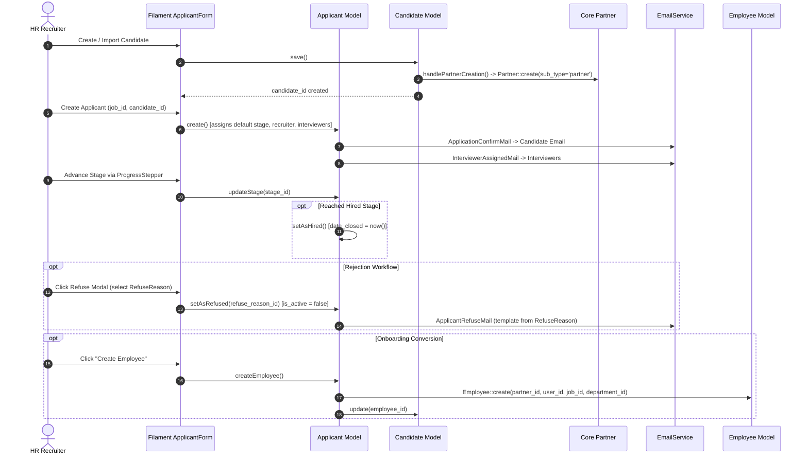

# Plugin: Recruitment (`recruitments`)

## Status
[VERIFIED]
Active Optional Module. Registered in `bootstrap/providers.php:57` as `Webkul\Recruitment\RecruitmentServiceProvider::class`.

## Core/Optional
[VERIFIED]
**Optional Plugin**. Configured as an optional domain module without calling `$package->isCore()` (`plugins/webkul/recruitments/src/RecruitmentServiceProvider.php:20-58`). Execution and Filament UI registration are gated by runtime installation verification via `Package::isPluginInstalled('recruitments')` (`plugins/webkul/recruitments/src/RecruitmentPlugin.php:23`).

## Enabled/Disabled
[VERIFIED]
**Conditionally Enabled (Database-Gated)**. `RecruitmentServiceProvider` registers package migrations, seeders, views, and translations, but Filament admin panel resources, clusters, pages, and widgets are discovered and registered only when `Package::isPluginInstalled('recruitments')` returns true (`plugins/webkul/recruitments/src/RecruitmentPlugin.php:23-47`).

## Purpose
[VERIFIED]
The `recruitments` module provides complete applicant tracking (ATS), recruitment pipeline management, candidate talent profiling, competency matrices, collaborative interview scheduling, stage progress monitoring, and automated employee onboarding for Aureus ERP:

1. **Candidate Talent Master (`Candidate`)**:
   - Manages personal contact information, LinkedIn profiles, degrees, availability dates, and ratings (`recruitments_candidates`).
   - Automatically synchronizes contact records with the Core `partners_partners` table (`sub_type = 'partner'`) on create and update via `Candidate::boot()` (`plugins/webkul/recruitments/src/Models/Candidate.php:140-194`).
   - Stores flexible custom fields and JSON properties (`candidate_properties`).
   - Supports multi-tag classification via `ApplicantCategory` through `recruitments_candidate_applicant_categories`.

2. **Job Application Submission & Lifecycle (`Applicant`)**:
   - Tracks job applications against specific job openings (`recruitments_applicants`).
   - Implements multi-state tracking: operational state (`RecruitmentState`: `normal`, `done`, `blocked`) and aggregate lifecycle status (`ApplicationStatus`: `ongoing`, `hired`, `refused`, `archived`) via `HasApplicationStatus` trait (`plugins/webkul/recruitments/src/Traits/HasApplicationStatus.php:10-104`).
   - Links UTM attribution tracking (`source_id` referencing `utm_sources` and `medium_id` referencing `utm_mediums`).
   - Tracks expected vs. proposed salary figures and delay-to-close metrics.

3. **Recruitment Stage Pipeline & Progress Stepper (`Stage`, `recruitments_stages`)**:
   - Defines ordered hiring stages (e.g., *New*, *First Interview*, *Initial Qualification*, *Second Interview*, *Contract Proposal*, *Contract Signed*) ordered via `spatie/eloquent-sortable` (`sort`).
   - Supports stage folding (`fold`), default initial stage assignment (`is_default`), and terminal hiring stage designation (`hired_stage`).
   - Maps stages to specific job positions via junction table `recruitments_stages_jobs`.
   - Embeds custom state legends (`legend_normal`, `legend_blocked`, `legend_done`).
   - Drives interactive stage transition on the application form via `FormProgressStepper::make('stage_id')` (`plugins/webkul/recruitments/src/Filament/Clusters/Applications/Resources/ApplicantResource/Schemas/ApplicantForm.php:39-73`).

4. **Job Position Recruitment Extensions (`JobPosition`, subclassing `EmployeeJobPosition`)**:
   - Extends the base `employees_job_positions` table by adding foreign keys and recruitment attributes: `address_id` (work location partner), `manager_id` (department manager employee), `industry_id` (partner industry), `recruiter_id` (responsible user), `no_of_hired_employee`, `date_from`, and `date_to` (`plugins/webkul/recruitments/database/migrations/2025_01_14_143102_add_columns_to_employees_job_positions_table.php:14-27`).
   - Automatically computes active employee counts (`no_of_employee`), hired application rollups (`no_of_hired_employee`), and total expected workforce targets (`expected_employees`) (`plugins/webkul/recruitments/src/Models/JobPosition.php:66-104`).
   - Associates default interviewers via `recruitments_job_position_interviewers`.

5. **Candidate Skill Grading Matrix (`CandidateSkill`, `recruitments_candidate_skills`)**:
   - Maps candidate competencies across two-tiered skill taxonomies from `employees`: `SkillType`, `Skill`, and `SkillLevel` (`plugins/webkul/recruitments/src/Models/CandidateSkill.php:13-64`).
   - Visualizes proficiency percentages using custom `ProgressBarEntry` components across Filament tables and infolists (`plugins/webkul/recruitments/src/Traits/CandidateSkillRelation.php:78-92`).

6. **Interviewer Assignment & Email Communications**:
   - Assigns collaborative panel interviewers (`recruitments_applicant_interviewers`).
   - Automatically dispatches transactional notifications via `Webkul\Support\Services\EmailService`:
     - `ApplicationConfirmMail`: Sent to candidate upon application registration (`plugins/webkul/recruitments/src/Mail/ApplicationConfirmMail.php:13-83`).
     - `InterviewerAssignedMail`: Sent to assigned interviewers when assigned to an applicant (`plugins/webkul/recruitments/src/Mail/InterviewerAssignedMail.php:13-83`).
     - `ApplicantRefuseMail`: Sent to applicant upon rejection with customizable blade templates based on `RefuseReason` (`plugins/webkul/recruitments/src/Mail/ApplicantRefuseMail.php:13-83`).

7. **Automated Employee Onboarding (`createEmployee()`)**:
   - Seamlessly converts a hired applicant or candidate into a full `Employee` record in `employees_employees`, linking the candidate's existing `partner_id`, `user_id`, `department_id`, and `job_id` (`plugins/webkul/recruitments/src/Models/Applicant.php:212-240`).

8. **Recruitment Analytics & KPI Dashboard (`Recruitments`)**:
   - Dedicated executive dashboard (`/admin/recruitment`) featuring multi-criteria filtering (job positions, departments, companies, stages, status, date ranges).
   - Real-time KPI widget `JobPositionStatsWidget` (active jobs, total applications, hired count with comparison trends) and status distribution chart `ApplicantChartWidget` (`plugins/webkul/recruitments/src/Filament/Pages/Recruitments.php:22-118`).

## Service Provider
[VERIFIED]
- **Class**: `Webkul\Recruitment\RecruitmentServiceProvider` (`plugins/webkul/recruitments/src/RecruitmentServiceProvider.php:14`)
- **Inheritance**: Extends `Webkul\PluginManager\PackageServiceProvider`
- **Registration & Configuration**:
  - `configureCustomPackage(Package $package)`:
    - Sets package name to `recruitments` (`RecruitmentServiceProvider::$name = 'recruitments'`).
    - Registers view namespace `recruitments` (`hasViews()`).
    - Registers translation namespace (`hasTranslations()`).
    - Registers 14 database migrations (`hasMigrations([...])`) and executes them (`runsMigrations()`):
      1. `2025_01_06_133002_create_recruitments_stages_table`
      2. `2025_01_07_053021_create_recruitments_stages_jobs_table`
      3. `2025_01_09_071817_create_recruitments_degrees_table`
      4. `2025_01_09_082748_create_recruitments_refuse_reasons_table`
      5. `2025_01_09_095909_create_recruitments_applicant_categories_table`
      6. `2025_01_09_125852_create_recruitments_candidates_table`
      7. `2025_01_10_045048_create_recruitments_candidate_applicant_categories_table`
      8. `2025_01_10_082944_create_recruitments_candidate_skills_table`
      9. `2025_01_10_115422_create_recruitments_applicants_table`
      10. `2025_01_13_072547_create_recruitments_applicant_interviewers_table`
      11. `2025_01_13_075926_create_recruitments_applicant_applicant_categories_table`
      12. `2025_01_14_080159_add_is_default_column_stages_table`
      13. `2025_01_14_143102_add_columns_to_employees_job_positions_table`
      14. `2025_01_16_081327_create_recruitments_job_position_interviewers_table`
    - Registers runtime plugin dependencies: `employees` (`hasDependencies(['employees'])`).
    - Registers database seeder: `Webkul\Recruitment\Database\Seeders\DatabaseSeeder` (`hasSeeder(...)`).
    - Configures install command: installs dependencies, runs migrations, and executes seeders (`hasInstallCommand(...)`).
    - Configures uninstall command: purges Chatter audit logs for `[Applicant::class, Candidate::class]` via `ChatterCleanupService::purgeForModels(...)` (`hasUninstallCommand(...)`).
    - Sets package icon to `recruitments` (`icon('recruitments')`).
  - `packageRegistered()`:
    - Registers `RecruitmentPlugin::make()` with the Filament Panel builder via `Panel::configureUsing()`.
  - `packageBooted()`:
    - Empty implementation (`//`).

## Filament Plugin Class
[VERIFIED]
- **Class**: `Webkul\Recruitment\RecruitmentPlugin` (`plugins/webkul/recruitments/src/RecruitmentPlugin.php:9`)
- **Implements**: `Filament\Contracts\Plugin`
- **Plugin ID**: `recruitments` (`getId(): string`)
- **Panel Registration Logic**:
  - Checks if plugin is installed in database via `Package::isPluginInstalled($this->getId())`; returns early if false.
  - When panel ID is `'admin'`, discovers:
    - Resources: `plugins/webkul/recruitments/src/Filament/Resources`
    - Pages: `plugins/webkul/recruitments/src/Filament/Pages`
    - Clusters: `plugins/webkul/recruitments/src/Filament/Clusters`
    - Widgets: `plugins/webkul/recruitments/src/Filament/Widgets`

## Composer Dependencies
[VERIFIED]
Defined in `plugins/webkul/recruitments/composer.json`:
- **Package Name**: `webkul/recruitments`
- **Description**: `Applicant tracking and hiring`
- **Autoload PSR-4**:
  - `Webkul\Recruitment\`: `src/`
  - `Webkul\Recruitment\Database\Factories\`: `database/factories/`
  - `Webkul\Recruitment\Database\Seeders\`: `database/seeders/`
- **Autoload-dev PSR-4**:
  - `Webkul\Recruitment\Tests\`: `tests/`

## Runtime Plugin Dependencies
[VERIFIED]
- **`employees`**: Declared via `$package->hasDependencies(['employees'])` in `RecruitmentServiceProvider.php:42-44`. Provides the base job positions, departments, employees, skill classifications, and work calendar schedules.

## Directory Structure
[VERIFIED]
```text
plugins/webkul/recruitments/
├── composer.json
├── config/
│   └── filament-shield.php
├── database/
│   ├── factories/
│   │   ├── ApplicantApplicantCategoryFactory.php
│   │   ├── ApplicantCategoryFactory.php
│   │   ├── ApplicantFactory.php
│   │   ├── ApplicantInterviewerFactory.php
│   │   ├── CandidateApplicantCategoryFactory.php
│   │   ├── CandidateFactory.php
│   │   ├── CandidateSkillFactory.php
│   │   ├── DegreeFactory.php
│   │   ├── JobPositionFactory.php
│   │   ├── JobPositionInterviewerFactory.php
│   │   ├── RefuseReasonFactory.php
│   │   ├── StageFactory.php
│   │   └── StageJobFactory.php
│   ├── migrations/
│   │   ├── 2025_01_06_133002_create_recruitments_stages_table.php
│   │   ├── 2025_01_07_053021_create_recruitments_stages_jobs_table.php
│   │   ├── 2025_01_09_071817_create_recruitments_degrees_table.php
│   │   ├── 2025_01_09_082748_create_recruitments_refuse_reasons_table.php
│   │   ├── 2025_01_09_095909_create_recruitments_applicant_categories_table.php
│   │   ├── 2025_01_09_125852_create_recruitments_candidates_table.php
│   │   ├── 2025_01_10_045048_create_recruitments_candidate_applicant_categories_table.php
│   │   ├── 2025_01_10_082944_create_recruitments_candidate_skills_table.php
│   │   ├── 2025_01_10_115422_create_recruitments_applicants_table.php
│   │   ├── 2025_01_13_072547_create_recruitments_applicant_interviewers_table.php
│   │   ├── 2025_01_13_075926_create_recruitments_applicant_applicant_categories_table.php
│   │   ├── 2025_01_14_080159_add_is_default_column_stages_table.php
│   │   ├── 2025_01_14_143102_add_columns_to_employees_job_positions_table.php
│   │   └── 2025_01_16_081327_create_recruitments_job_position_interviewers_table.php
│   └── seeders/
│       ├── ApplicantCategorySeeder.php
│       ├── DatabaseSeeder.php
│       ├── DegreeSeeder.php
│       ├── RefuseReasonSeeder.php
│       └── StageSeeder.php
├── resources/
│   ├── lang/
│   │   └── en/
│   │       ├── filament/
│   │       ├── mails/
│   │       └── models/
│   └── views/
│       └── mails/
│           ├── applicant-not-interested.blade.php
│           ├── applicant-refuse.blade.php
│           ├── application-confirm.blade.php
│           └── interviewer-assigned.blade.php
└── src/
    ├── Enums/
    │   ├── ApplicationStatus.php
    │   └── RecruitmentState.php
    ├── Filament/
    │   ├── Clusters/
    │   │   ├── Applications/
    │   │   │   └── Resources/
    │   │   │       ├── ApplicantResource.php
    │   │   │       ├── ApplicantResource/
    │   │   │       ├── CandidateResource.php
    │   │   │       ├── CandidateResource/
    │   │   │       ├── JobByPositionResource.php
    │   │   │       └── JobByPositionResource/
    │   │   ├── Applications.php
    │   │   ├── Configurations/
    │   │   │   └── Resources/
    │   │   │       ├── ActivityPlanResource.php
    │   │   │       ├── ActivityTypeResource.php
    │   │   │       ├── ApplicantCategoryResource.php
    │   │   │       ├── DegreeResource.php
    │   │   │       ├── DepartmentResource.php
    │   │   │       ├── EmploymentTypeResource.php
    │   │   │       ├── JobPositionResource.php
    │   │   │       ├── RefuseReasonResource.php
    │   │   │       ├── SkillTypeResource.php
    │   │   │       ├── StageResource.php
    │   │   │       ├── UTMMediumResource.php
    │   │   │       └── UTMSourceResource.php
    │   │   └── Configurations.php
    │   ├── Pages/
    │   │   └── Recruitments.php
    │   └── Widgets/
    │       ├── ApplicantChartWidget.php
    │       └── JobPositionStatsWidget.php
    ├── Http/
    │   └── Resources/
    │       └── V1/
    │           ├── ApplicantCategoryResource.php
    │           ├── ApplicantResource.php
    │           ├── CandidateResource.php
    │           ├── DegreeResource.php
    │           ├── JobPositionResource.php
    │           ├── RefuseReasonResource.php
    │           └── StageResource.php
    ├── Mail/
    │   ├── ApplicantRefuseMail.php
    │   ├── ApplicationConfirmMail.php
    │   └── InterviewerAssignedMail.php
    ├── Models/
    │   ├── ActivityPlan.php
    │   ├── ActivityType.php
    │   ├── Applicant.php
    │   ├── ApplicantApplicantCategory.php
    │   ├── ApplicantCategory.php
    │   ├── ApplicantInterviewer.php
    │   ├── Candidate.php
    │   ├── CandidateApplicantCategory.php
    │   ├── CandidateSkill.php
    │   ├── Degree.php
    │   ├── Department.php
    │   ├── EmploymentType.php
    │   ├── JobByPosition.php
    │   ├── JobPosition.php
    │   ├── JobPositionInterviewer.php
    │   ├── RefuseReason.php
    │   ├── SkillType.php
    │   ├── Stage.php
    │   ├── StageJob.php
    │   ├── UTMMedium.php
    │   └── UTMSource.php
    ├── Policies/
    │   ├── ActivityPlanPolicy.php
    │   ├── ActivityTypePolicy.php
    │   ├── ApplicantCategoryPolicy.php
    │   ├── ApplicantPolicy.php
    │   ├── CandidatePolicy.php
    │   ├── DegreePolicy.php
    │   ├── DepartmentPolicy.php
    │   ├── EmploymentTypePolicy.php
    │   ├── JobByPositionPolicy.php
    │   ├── JobPositionPolicy.php
    │   ├── RefuseReasonPolicy.php
    │   ├── SkillTypePolicy.php
    │   ├── StagePolicy.php
    │   ├── UTMMediumPolicy.php
    │   └── UTMSourcePolicy.php
    ├── RecruitmentPlugin.php
    ├── RecruitmentServiceProvider.php
    └── Traits/
        ├── CandidateSkillRelation.php
        └── HasApplicationStatus.php
```

## Models
[VERIFIED]

| Model Class | Physical Table | Scoping / Company | Soft Deletes | Key Traits & Interfaces | Purpose |
| :--- | :--- | :--- | :--- | :--- | :--- |
| `Applicant` | `recruitments_applicants` | Optional (`BelongsToCompany`) | Yes | `BelongsToCompany`, `HasApplicationStatus`, `HasChatter`, `HasCustomFields`, `HasLogActivity`, `SoftDeletes` | Central job application document linking candidate, stage, recruiter, job position, and evaluation ratings |
| `Candidate` | `recruitments_candidates` | Optional (`BelongsToCompany`) | Yes | `BelongsToCompany`, `HasChatter`, `HasCustomFields`, `HasLogActivity`, `SoftDeletes` | Candidate talent profile automatically synced with Core `partners_partners` |
| `Stage` | `recruitments_stages` | No (Global Master) | No | `SortableTrait`, `HasFactory`, `Sortable` | Pipeline hiring stage definition with fold, sort, default, and hired stage designations |
| `JobPosition` | `employees_job_positions` | Optional (`BelongsToCompany`) | Yes (via Base) | Extends `EmployeeJobPosition` | Recruitment job specifications, hiring targets, date windows, address, recruiter, and manager assignments |
| `CandidateSkill` | `recruitments_candidate_skills` | Via Candidate | No | — | Concrete skill rating on candidate linking `SkillType`, `Skill`, and `SkillLevel` |
| `Degree` | `recruitments_degrees` | No (Global Master) | No | `SortableTrait`, `Sortable` | Academic qualification level (Bachelor, Master, Doctoral) |
| `RefuseReason` | `recruitments_refuse_reasons` | No (Global Master) | No | `SortableTrait`, `Sortable` | Application rejection rationale linked to response email templates |
| `ApplicantCategory` | `recruitments_applicant_categories` | No (Global Master) | No | — | Color-badged categorization tags for candidates and applicants |
| `ApplicantApplicantCategory` | `recruitments_applicant_applicant_categories` | Pivot Table | No | — | Junction mapping applicants to applicant categories |
| `CandidateApplicantCategory` | `recruitments_candidate_applicant_categories` | Pivot Table | No | — | Junction mapping candidates to applicant categories |
| `ApplicantInterviewer` | `recruitments_applicant_interviewers` | Pivot Table | No | — | Junction mapping applicants to assigned interview users |
| `JobPositionInterviewer` | `recruitments_job_position_interviewers` | Pivot Table | No | — | Junction mapping job positions to default interview users |
| `StageJob` | `recruitments_stages_jobs` | Pivot Table | No | — | Junction mapping hiring stages to specific job positions |
| `JobByPosition` | `employees_job_positions` | Optional (`BelongsToCompany`) | Yes (via Base) | Extends `JobPosition` | Proxy model driving the Applications overview card grid in Filament |
| `Department` | `employees_departments` | Optional (`BelongsToCompany`) | Yes (via Base) | Extends `Webkul\Employee\Models\Department` | Module proxy subclass for department configurations |
| `EmploymentType` | `employees_employment_types` | No (Global Master) | No | Extends `Webkul\Employee\Models\EmploymentType` | Module proxy subclass for employment types |
| `SkillType` | `employees_skill_types` | No (Global Master) | No | Extends `Webkul\Employee\Models\SkillType` | Module proxy subclass for skill type configurations |
| `ActivityPlan` | `activity_plans` | No (Global Master) | No | Extends `Webkul\Employee\Models\ActivityPlan` | Module proxy subclass for activity plans |
| `ActivityType` | `activity_types` | No (Global Master) | No | Extends `Webkul\Support\Models\ActivityType` | Module proxy subclass for activity types |
| `UTMMedium` | `utm_mediums` | No (Global Master) | No | Extends `Webkul\Support\Models\UTMMedium` | Module proxy subclass for marketing UTM medium tracking |
| `UTMSource` | `utm_sources` | No (Global Master) | No | Extends `Webkul\Support\Models\UTMSource` | Module proxy subclass for marketing UTM source tracking |

### Model Details & Relationships

#### 1. `Applicant` (`Webkul\Recruitment\Models\Applicant`)
- **Table**: `recruitments_applicants`
- **Traits**: `BelongsToCompany`, `HasApplicationStatus`, `HasChatter`, `HasCustomFields`, `HasLogActivity`, `SoftDeletes`
- **Constants**: `ACTIVITY_PLAN_PLUGIN = 'recruitments'`
- **Casts**: `is_active` (`boolean`), `create_date` (`date`), `date_closed` (`date`), `date_opened` (`date`), `date_last_stage_updated` (`date`), `refuse_date` (`date`), `applicant_properties` (`json`), `probability` (`double`), `salary_proposed` (`double`), `salary_expected` (`double`), `delay_close` (`double`)
- **Appends**: `application_status` (`ApplicationStatus` enum)
- **Relationships**:
  - `source()`: `BelongsTo` `Webkul\Support\Models\UTMSource` (`source_id`)
  - `medium()`: `BelongsTo` `Webkul\Support\Models\UTMMedium` (`medium_id`)
  - `candidate()`: `BelongsTo` `Webkul\Recruitment\Models\Candidate` (`candidate_id`)
  - `skills()`: `HasManyThrough` `Webkul\Recruitment\Models\CandidateSkill` through `Candidate`
  - `stage()`: `BelongsTo` `Webkul\Recruitment\Models\Stage` (`stage_id`)
  - `lastStage()`: `BelongsTo` `Webkul\Recruitment\Models\Stage` (`last_stage_id`)
  - `company()`: `BelongsTo` `Webkul\Support\Models\Company` (`company_id`)
  - `recruiter()`: `BelongsTo` `Webkul\Security\Models\User` (`recruiter_id`)
  - `interviewer()`: `BelongsToMany` `Webkul\Security\Models\User` via `recruitments_applicant_interviewers` (`applicant_id`, `interviewer_id`)
  - `categories()`: `BelongsToMany` `Webkul\Recruitment\Models\ApplicantCategory` via `recruitments_applicant_applicant_categories` (`applicant_id`, `category_id`)
  - `job()`: `BelongsTo` `Webkul\Recruitment\Models\JobPosition` (`job_id`)
  - `department()`: `BelongsTo` `Webkul\Employee\Models\Department` (`department_id`)
  - `refuseReason()`: `BelongsTo` `Webkul\Recruitment\Models\RefuseReason` (`refuse_reason_id`)
  - `creator()`: `BelongsTo` `Webkul\Security\Models\User` (`creator_id`)
- **Lifecycle Methods**:
  - `setAsHired()`: Updates status to `HIRED` (`date_closed = now()`).
  - `setAsRefused(int $refuseReasonId)`: Updates status to `REFUSED` (`refuse_reason_id`, `refuse_date = now()`, `is_active = false`).
  - `setAsArchived()`: Updates status to `ARCHIVED` (`is_active = false`, `deleted_at = now()`).
  - `reopen()`: Updates status to `ONGOING` (`is_active = true`, `stage_id = default stage id`).
  - `createEmployee()`: Instantiates and returns a new `Employee` profile using candidate details.
  - `handleApplicationCreation()`: Sets default `creator_id` and `company_id`.
  - `handleApplicationUpdation()`: Sets `date_opened` on dirty recruiter, sets `date_last_stage_updated` and `last_stage_id` on dirty stage, and prepares interviewer diff collection.

#### 2. `Candidate` (`Webkul\Recruitment\Models\Candidate`)
- **Table**: `recruitments_candidates`
- **Traits**: `BelongsToCompany`, `HasChatter`, `HasCustomFields`, `HasLogActivity`, `SoftDeletes`
- **Casts**: `candidate_properties` (`array`), `is_active` (`boolean`)
- **Relationships**:
  - `company()`: `BelongsTo` `Company` (`company_id`)
  - `partner()`: `BelongsTo` `Webkul\Partner\Models\Partner` (`partner_id`)
  - `degree()`: `BelongsTo` `Webkul\Recruitment\Models\Degree` (`degree_id`)
  - `manager()`: `BelongsTo` `Webkul\Security\Models\User` (`manager_id`)
  - `employee()`: `BelongsTo` `Webkul\Employee\Models\Employee` (`employee_id`)
  - `creator()`: `BelongsTo` `Webkul\Security\Models\User` (`creator_id`)
  - `categories()`: `BelongsToMany` `ApplicantCategory` via `recruitments_candidate_applicant_categories` (`candidate_id`, `category_id`)
  - `skills()`: `HasMany` `Webkul\Recruitment\Models\CandidateSkill` (`candidate_id`)
- **Lifecycle Hooks**:
  - `boot()`: On `creating`, assigns `creator_id` and `company_id`. On `saved`, executes `handlePartnerCreation()` or `handlePartnerUpdation()` to synchronize partner master data in `partners_partners` (`sub_type = 'partner'`).

#### 3. `Stage` (`Webkul\Recruitment\Models\Stage`)
- **Table**: `recruitments_stages`
- **Traits**: `HasFactory`, `SortableTrait`
- **Casts**: `is_default` (`boolean`), `hired_stage` (`boolean`), `fold` (`boolean`)
- **Sortable Configuration**: `order_column_name => 'sort'`, `sort_when_creating => true`
- **Relationships**:
  - `creator()`: `BelongsTo` `User` (`creator_id`)
  - `jobs()`: `BelongsToMany` `EmployeeJobPosition` via `recruitments_stages_jobs` (`stage_id`, `job_id`)

#### 4. `JobPosition` (`Webkul\Recruitment\Models\JobPosition`)
- **Table**: `employees_job_positions` (extends `Webkul\Employee\Models\EmployeeJobPosition`)
- **Fillable Additions**: `address_id`, `manager_id`, `industry_id`, `recruiter_id`, `no_of_hired_employee`, `date_from`, `date_to`
- **Casts Additions**: `date_from` (`datetime`), `date_to` (`datetime`)
- **Relationships**:
  - `address()`: `BelongsTo` `Partner` (`address_id`) where `sub_type = 'company'`
  - `skills()`: `BelongsToMany` `Skill` via `job_position_skills`
  - `interviewers()`: `BelongsToMany` `User` via `recruitments_job_position_interviewers`
  - `manager()`: `BelongsTo` `Employee` (`manager_id`)
  - `recruiter()`: `BelongsTo` `User` (`recruiter_id`)
  - `industry()`: `BelongsTo` `Webkul\Partner\Models\Industry` (`industry_id`)
  - `applications()`: `HasMany` `Applicant` (`job_id`)
- **Accessors**:
  - `noOfEmployee`: Count of active employees linked to this position.
  - `noOfHiredEmployee`: Count of active applications linked to this position with `date_closed` set.
  - `expectedEmployees`: Sum of current employees and recruitment targets (`no_of_recruitment`).

## Database
[VERIFIED]

### Physical Schemas & Migrations

```text
recruitments_stages
├── id (BIGINT, PK)
├── is_default (BOOLEAN, default: false)
├── sort (INT, nullable)
├── creator_id (BIGINT, FK -> users.id, set null)
├── name (VARCHAR)
├── legend_blocked (VARCHAR)
├── legend_done (VARCHAR)
├── legend_normal (VARCHAR)
├── requirements (TEXT, nullable)
├── hired_stage (VARCHAR/BOOLEAN, nullable)
├── fold (BOOLEAN, default: false)
└── timestamps

recruitments_stages_jobs (Pivot)
├── stage_id (BIGINT, FK -> recruitments_stages.id, cascade)
└── job_id (BIGINT, FK -> employees_job_positions.id, cascade)

recruitments_degrees
├── id (BIGINT, PK)
├── sort (INT, nullable)
├── creator_id (BIGINT, FK -> users.id, set null)
├── name (VARCHAR)
└── timestamps

recruitments_refuse_reasons
├── id (BIGINT, PK)
├── sort (INT, nullable)
├── creator_id (BIGINT, FK -> users.id, set null)
├── name (VARCHAR)
├── template (VARCHAR)
├── is_active (BOOLEAN, default: true)
└── timestamps

recruitments_applicant_categories
├── id (BIGINT, PK)
├── creator_id (BIGINT, FK -> users.id, set null)
├── name (VARCHAR)
├── color (VARCHAR, nullable)
└── timestamps

recruitments_candidates
├── id (BIGINT, PK)
├── message_bounced (INT, default: 0)
├── company_id (BIGINT, FK -> companies.id, null on delete)
├── partner_id (BIGINT, FK -> partners_partners.id, null on delete)
├── degree_id (BIGINT, FK -> recruitments_degrees.id, null on delete)
├── manager_id (BIGINT, FK -> users.id, null on delete)
├── employee_id (BIGINT, FK -> employees_employees.id, null on delete)
├── creator_id (BIGINT, FK -> users.id, null on delete)
├── email_cc (VARCHAR, nullable)
├── name (VARCHAR, nullable)
├── email_from (VARCHAR, nullable)
├── phone (VARCHAR, nullable)
├── linkedin_profile (VARCHAR, nullable)
├── priority (INT, default: 0)
├── availability_date (DATE, nullable)
├── candidate_properties (JSON, nullable)
├── is_active (BOOLEAN, default: true)
├── color (VARCHAR, nullable)
├── deleted_at (TIMESTAMP, nullable)
└── timestamps

recruitments_candidate_applicant_categories (Pivot)
├── candidate_id (BIGINT, FK -> recruitments_candidates.id, cascade)
└── category_id (BIGINT, FK -> recruitments_applicant_categories.id, cascade)

recruitments_candidate_skills
├── id (BIGINT, PK)
├── candidate_id (BIGINT, FK -> recruitments_candidates.id, cascade)
├── skill_id (BIGINT, FK -> employees_skills.id, cascade)
├── skill_level_id (BIGINT, FK -> employees_skill_levels.id, cascade)
├── skill_type_id (BIGINT, FK -> employees_skill_types.id, cascade)
├── creator_id (BIGINT, FK -> users.id, set null)
├── user_id (BIGINT, FK -> users.id, set null)
└── timestamps

recruitments_applicants
├── id (BIGINT, PK)
├── source_id (BIGINT, FK -> utm_sources.id, null on delete)
├── medium_id (BIGINT, FK -> utm_mediums.id, null on delete)
├── candidate_id (BIGINT, FK -> recruitments_candidates.id, restrict on delete)
├── stage_id (BIGINT, FK -> recruitments_stages.id, restrict on delete)
├── last_stage_id (BIGINT, FK -> recruitments_stages.id, null on delete)
├── company_id (BIGINT, FK -> companies.id, null on delete)
├── recruiter_id (BIGINT, FK -> users.id, null on delete)
├── job_id (BIGINT, FK -> employees_job_positions.id, null on delete)
├── department_id (BIGINT, FK -> employees_departments.id, null on delete)
├── refuse_reason_id (BIGINT, FK -> recruitments_refuse_reasons.id, null on delete)
├── creator_id (BIGINT, FK -> users.id, null on delete)
├── email_cc (VARCHAR, nullable)
├── priority (VARCHAR/INT, default: 0)
├── salary_proposed_extra (VARCHAR, nullable)
├── salary_expected_extra (VARCHAR, nullable)
├── applicant_properties (JSON, nullable)
├── applicant_notes (TEXT, nullable)
├── is_active (BOOLEAN, default: false)
├── state (VARCHAR, nullable)
├── create_date (TIMESTAMP, nullable)
├── date_closed (TIMESTAMP, nullable)
├── date_opened (TIMESTAMP, nullable)
├── date_last_stage_updated (TIMESTAMP, nullable)
├── refuse_date (TIMESTAMP, nullable)
├── probability (DECIMAL(15,4), default: 0)
├── salary_proposed (DECIMAL(15,4), default: 0)
├── salary_expected (DECIMAL(15,4), default: 0)
├── delay_close (DECIMAL(15,4), default: 0)
├── deleted_at (TIMESTAMP, nullable)
└── timestamps

recruitments_applicant_interviewers (Pivot)
├── applicant_id (BIGINT, FK -> recruitments_applicants.id, cascade)
└── interviewer_id (BIGINT, FK -> users.id, cascade)

recruitments_applicant_applicant_categories (Pivot)
├── applicant_id (BIGINT, FK -> recruitments_applicants.id, cascade)
└── category_id (BIGINT, FK -> recruitments_applicant_categories.id, cascade)

recruitments_job_position_interviewers (Pivot)
├── job_position_id (BIGINT, FK -> employees_job_positions.id, cascade)
└── user_id (BIGINT, FK -> users.id, cascade)
```

### Schema Mutations on Other Plugins
- **`employees_job_positions` Table**: Altered by migration `2025_01_14_143102_add_columns_to_employees_job_positions_table.php` to add foreign keys `address_id` (`partners_partners.id`), `manager_id` (`employees_employees.id`), `industry_id` (`partners_industries.id`), `recruiter_id` (`users.id`), and columns `no_of_hired_employee`, `date_from`, `date_to`.

### Database Seeders
- `StageSeeder`: Seeds initial recruitment stages (*New*, *First Interview*, *Initial Qualification*, *Second Interview*, *Contract Proposal*, *Contract Signed*) and maps them to all existing job positions.
- `RefuseReasonSeeder`: Seeds standard refusal codes (*Does not fit the job requirements*, *Refused by applicant: job fit*, *Job already fulfilled*, *Duplicate*, *Spam*, *Refused by applicant: salary*) mapped to templates `applicant-refuse` and `applicant-not-interested`.
- `DegreeSeeder`: Seeds standard degree levels (*Graduate*, *Master*, *Bachelor*, *Doctoral Degree*).
- `ApplicantCategorySeeder`: Seeds initial color tags (*Sales* `#FF0000`, *Manager* `#00FF00`, *IT* `#0000FF`, *Reserve* `#FFFF00`).

## Filament Resources, Pages, Widgets & Clusters
[VERIFIED]

### Navigation & Clusters
- **Navigation Group**: `NavigationGroup::Recruitment` (Recruitment)
- **`Applications` Cluster** (`Webkul\Recruitment\Filament\Clusters\Applications`):
  - Slug: `/admin/recruitments/applications`
  - Sort: `2`
- **`Configurations` Cluster** (`Webkul\Recruitment\Filament\Clusters\Configurations`):
  - Slug: `/admin/recruitments/configurations`
  - Sort: `2`

### Applications Cluster Resources

#### 1. `ApplicantResource` (`Webkul\Recruitment\Filament\Clusters\Applications\Resources\ApplicantResource`)
- **Navigation**: `heroicon-o-user-group`, Sort: `2`
- **Model**: `Applicant`
- **Pages**:
  - `ListApplicants` (`/admin/recruitments/applications/applicants`):
    - Table view with default grouping by stage (`defaultGroup('stage.name')`).
    - Integrated header widget: `JobPositionStatsWidget`.
    - Preset view tabs via `HasTableViews`: `my_applications`, `un_assigned`, `in_progress`, `hired`, `refused`, `archived`, `blocked`, `directly_available`, `created_recently`, `stage_updated_recently`.
    - Create applicant modal header action with inline candidate creation form.
  - `ViewApplicant` (`/{record}`): Detailed infolist, chatter drawer, refusal modal, employee creation, and state toggle.
  - `EditApplicant` (`/{record}/edit`): Form editor, state toggle buttons, refuse action with email dispatch, create/goto employee action, restore action.
  - `ManageSkill` (`/{record}/skills`): Sub-navigation page for candidate skill management.
- **Form Components & Interactive Stage Stepper**:
  - `FormProgressStepper::make('stage_id')`: Visual sequential stepper of stages. Stage clicking triggers transaction updating `stage_id`, `last_stage_id`, `date_last_stage_updated`, and toggles `hired_stage` (`setAsHired()` vs `reopen()`).
  - Interactive 3-star rating component for `priority` (0, 1, 2, 3 stars).
  - Dynamic interviewer selection prefilled from `job_id`.
- **Relations**:
  - `SkillsRelationManager`: Interactive management of candidate competencies with progress bar visualizations.

#### 2. `CandidateResource` (`Webkul\Recruitment\Filament\Clusters\Applications\Resources\CandidateResource`)
- **Navigation**: `heroicon-o-user-group`, Sort: `3`
- **Model**: `Candidate`
- **Pages**: `ListCandidates`, `CreateCandidate`, `EditCandidate`, `ViewCandidate`, `ManageSkill`.
- **Relations**: `SkillsRelationManager`.

#### 3. `JobByPositionResource` (`Webkul\Recruitment\Filament\Clusters\Applications\Resources\JobByPositionResource`)
- **Navigation**: `heroicon-o-briefcase`, Sort: `1`
- **Model**: `JobByPosition` (extends `JobPosition`)
- **Pages**: `ListJobByPositions` (`/admin/recruitments/applications/job-by-positions`).
- **UI Structure**: Renders a card grid (`contentGrid(['md' => 2, 'xl' => 2])`) displaying job cards with aggregated counts for "New Applications" and "Total Applications", each linking directly to pre-filtered applicant lists in `ApplicantResource`.

### Configurations Cluster Resources

| Resource Class | Model | Navigation Group | Key Features |
| :--- | :--- | :--- | :--- |
| `StageResource` | `Stage` | `Recruitment` | Manage stages, sort reordering, fold status, default stage, hired stage, custom legends |
| `JobPositionResource` | `JobPosition` | `Recruitment` | Configure job specs, requirements, recruiter, default interviewers, target headcount |
| `RefuseReasonResource` | `RefuseReason` | `Recruitment` | Manage rejection reasons linked to email templates (`applicant-refuse`, `applicant-not-interested`) |
| `DegreeResource` | `Degree` | `Recruitment` | Academic qualification level catalog with sort ordering |
| `ApplicantCategoryResource` | `ApplicantCategory` | `Recruitment` | Color-coded candidate and applicant categorization tags |
| `UTMMediumResource` | `UTMMedium` | `Recruitment` | Marketing campaign medium tracking definition |
| `UTMSourceResource` | `UTMSource` | `Recruitment` | Marketing campaign source tracking definition |
| `DepartmentResource` | `Department` | `Recruitment` | Organization department structure configuration (proxy over `employees`) |
| `EmploymentTypeResource` | `EmploymentType` | `Recruitment` | Contract type classifications (proxy over `employees`) |
| `SkillTypeResource` | `SkillType` | `Recruitment` | Skill categories and level definitions (proxy over `employees`) |
| `ActivityPlanResource` | `ActivityPlan` | `Recruitment` | Structured onboarding / recruitment activity plans |
| `ActivityTypeResource` | `ActivityType` | `Recruitment` | Activity types scoped to `recruitments` |

### Dashboard Page & Widgets
- **Page**: `Recruitments` (`Webkul\Recruitment\Filament\Pages\Recruitments` at `/admin/recruitment`):
  - Dashboard route with filter form: job positions, departments, companies, stages, status (`all`, `ongoing`, `hired`, `refused`, `archived`), and `DashboardDateRange`.
- **Widgets**:
  - `JobPositionStatsWidget` (`Webkul\Recruitment\Filament\Widgets\JobPositionStatsWidget`): Summary metrics for active job openings, total applications, and hired candidate counts with sparkline trend charts.
  - `ApplicantChartWidget` (`Webkul\Recruitment\Filament\Widgets\ApplicantChartWidget`): Bar chart breakdown of applicants across Ongoing, Hired, Refused, and Archived statuses.

## Panels
[VERIFIED]
- **`admin`**: Full recruitment suite registered (Applications cluster, Configurations cluster, Recruitments dashboard page, widgets).
- **`customer`**: No recruitment resources or pages registered.

## Services
[VERIFIED]
- **`Webkul\Support\Services\EmailService`**: Consumed to dispatch asynchronous-styled transactional emails (`ApplicantRefuseMail`, `ApplicationConfirmMail`, `InterviewerAssignedMail`) using blade views and dynamic payloads.
- **`Webkul\Chatter\Services\ChatterCleanupService`**: Consumed in `RecruitmentServiceProvider::hasUninstallCommand()` to purge audit trail records for `Applicant` and `Candidate` models on module uninstallation.

## Events, Mail & Notifications
[VERIFIED]
- **Mailables**:
  - `ApplicantRefuseMail` (`Webkul\Recruitment\Mail\ApplicantRefuseMail`): Sent to rejected applicant with view determined by the refuse reason template (`recruitments::mails.applicant-refuse` or `applicant-not-interested`).
  - `ApplicationConfirmMail` (`Webkul\Recruitment\Mail\ApplicationConfirmMail`): Sent to candidate upon application receipt (`recruitments::mails.application-confirm`).
  - `InterviewerAssignedMail` (`Webkul\Recruitment\Mail\InterviewerAssignedMail`): Sent to newly assigned interview users with record link (`recruitments::mails.interviewer-assigned`).

## Policies & Authorization
[VERIFIED]

Configured in `plugins/webkul/recruitments/config/filament-shield.php`:

| Policy Class | Controlled Model | Key Permission Strings | Scoped Ownership Check |
| :--- | :--- | :--- | :--- |
| `ApplicantPolicy` | `Applicant` | `view_any_recruitment_applicant`, `view_recruitment_applicant`, `create_recruitment_applicant`, `update_recruitment_applicant`, `delete_recruitment_applicant`, `force_delete_recruitment_applicant`, `restore_recruitment_applicant` | Scoped via `$this->hasAccess($user, $applicant, 'recruiter')` |
| `CandidatePolicy` | `Candidate` | `view_any_recruitment_candidate`, `view_recruitment_candidate`, `create_recruitment_candidate`, `update_recruitment_candidate`, `delete_recruitment_candidate` | Scoped via `$this->hasAccess($user, $candidate, 'manager')` |
| `JobPositionPolicy` | `JobPosition` | `view_any_recruitment_job::position`, `view_recruitment_job::position`, `create_recruitment_job::position`, `update_recruitment_job::position`, `delete_recruitment_job::position`, `reorder_recruitment_job::position` | Global permission check |
| `JobByPositionPolicy` | `JobByPosition` | `view_any_recruitment_job::by::position`, `view_recruitment_job::by::position`, `create_recruitment_job::by::position`, `update_recruitment_job::by::position`, `delete_recruitment_job::by::position`, `reorder_recruitment_job::by::position` | Global permission check |
| `StagePolicy` | `Stage` | `view_any_recruitment_stage`, `view_recruitment_stage`, `create_recruitment_stage`, `update_recruitment_stage`, `delete_recruitment_stage`, `reorder_recruitment_stage` | Global permission check |
| `RefuseReasonPolicy` | `RefuseReason` | `view_any_recruitment_refuse::reason`, `create_recruitment_refuse::reason`, `update_recruitment_refuse::reason`, `delete_recruitment_refuse::reason`, `reorder_recruitment_refuse::reason` | Global permission check |
| `DegreePolicy` | `Degree` | `view_any_recruitment_degree`, `create_recruitment_degree`, `update_recruitment_degree`, `delete_recruitment_degree`, `reorder_recruitment_degree` | Global permission check |
| `ApplicantCategoryPolicy` | `ApplicantCategory` | `view_any_recruitment_applicant::category`, `create_recruitment_applicant::category`, `update_recruitment_applicant::category`, `delete_recruitment_applicant::category` | Global permission check |
| `UTMMediumPolicy` | `UTMMedium` | `view_any_recruitment_u_t_m_medium`, `create_recruitment_u_t_m_medium`, `update_recruitment_u_t_m_medium`, `delete_recruitment_u_t_m_medium` | Global permission check |
| `UTMSourcePolicy` | `UTMSource` | `view_any_recruitment_u_t_m_source`, `create_recruitment_u_t_m_source`, `update_recruitment_u_t_m_source`, `delete_recruitment_u_t_m_source` | Global permission check |
| `DepartmentPolicy` | `Department` | `view_any_recruitment_department`, `create_recruitment_department`, `update_recruitment_department`, `delete_recruitment_department` | Global permission check |
| `EmploymentTypePolicy` | `EmploymentType` | `view_any_recruitment_employment::type`, `create_recruitment_employment::type`, `update_recruitment_employment::type`, `delete_recruitment_employment::type` | Global permission check |
| `SkillTypePolicy` | `SkillType` | `view_any_recruitment_skill::type`, `create_recruitment_skill::type`, `update_recruitment_skill::type`, `delete_recruitment_skill::type` | Global permission check |
| `ActivityPlanPolicy` | `ActivityPlan` | `view_any_recruitment_activity::plan`, `create_recruitment_activity::plan`, `update_recruitment_activity::plan`, `delete_recruitment_activity::plan` | Global permission check |
| `ActivityTypePolicy` | `ActivityType` | `view_any_recruitment_activity::type`, `create_recruitment_activity::type`, `update_recruitment_activity::type`, `delete_recruitment_activity::type` | Global permission check |

## Routes
[NOT APPLICABLE]
The `recruitments` plugin does not register any web or API route files. Note that REST API resource classes are defined under `src/Http/Resources/V1/` for future endpoint exposure.

## Settings
[NOT APPLICABLE]
The plugin does not declare settings classes or settings migrations.

## Translations
[VERIFIED]
Translation namespace: `recruitments` located at `plugins/webkul/recruitments/resources/lang/en/`:
- `filament/`: UI strings for clusters, resources, relation managers, widgets, and dashboard pages.
- `mails/`: Subject lines and template strings for notification mailables.
- `models/`: Model titles and chatter audit log attribute labels.

## Tests
[VERIFIED]
**ZERO Automated Tests**. The plugin contains no test files (no `plugins/webkul/recruitments/tests/` directory and no feature or unit test files referencing `Webkul\Recruitment`).

## Cross-Plugin Relationships
[VERIFIED]

```mermaid
graph TD
    subgraph Core
        PARTNERS[partners<br/>partners_partners]
        SECURITY[security<br/>users / Bouncer]
        SUPPORT[support<br/>companies / EmailService]
        CHATTER[chatter<br/>chatter_messages / logs]
        FIELDS[fields<br/>custom fields]
        TABLEVIEWS[table-views<br/>preset filters]
    end

    subgraph HR
        EMPLOYEES[employees<br/>employees_employees / departments / job_positions / skills]
    end

    subgraph Recruitment Plugin
        CANDIDATES[Candidate<br/>recruitments_candidates]
        APPLICANTS[Applicant<br/>recruitments_applicants]
        STAGES[Stage<br/>recruitments_stages]
        JOB_POS[JobPosition<br/>employees_job_positions]
        CAND_SKILLS[CandidateSkill<br/>recruitments_candidate_skills]
    end

    CANDIDATES -->|syncs partner_id| PARTNERS
    CANDIDATES -->|BelongsToCompany| SUPPORT
    CANDIDATES -->|HasChatter / HasLogActivity| CHATTER
    CANDIDATES -->|HasCustomFields| FIELDS

    APPLICANTS -->|candidate_id| CANDIDATES
    APPLICANTS -->|stage_id| STAGES
    APPLICANTS -->|job_id| JOB_POS
    APPLICANTS -->|recruiter_id / interviewers| SECURITY
    APPLICANTS -->|BelongsToCompany| SUPPORT
    APPLICANTS -->|HasChatter / HasLogActivity| CHATTER
    APPLICANTS -->|HasCustomFields| FIELDS
    APPLICANTS -->|PresetView tabs| TABLEVIEWS
    APPLICANTS -.->|createEmployee()| EMPLOYEES

    JOB_POS -->|extends| EMPLOYEES
    CAND_SKILLS -->|skill_id / skill_level_id| EMPLOYEES
```

1. **`employees`**:
   - `JobPosition` subclasses `EmployeeJobPosition` and mutates `employees_job_positions`.
   - `CandidateSkill` references `Skill`, `SkillLevel`, and `SkillType` from `employees`.
   - `Applicant::createEmployee()` generates active `Employee` profiles in `employees_employees`.
2. **`partners`**:
   - `Candidate` auto-generates / updates party master records in `partners_partners` (`sub_type = 'partner'`).
   - `JobPosition.address_id` references `partners_partners` (`sub_type = 'company'`).
   - `JobPosition.industry_id` references `partners_industries`.
3. **`security`**:
   - Scoped access policies evaluate `$user->can()` and `$this->hasAccess($user, $record, 'recruiter'|'manager')`.
   - Assigns responsible recruiters and interviewers from `users`.
4. **`support`**:
   - Multi-company scoping via `BelongsToCompany` and `current_company_id()`.
   - Marketing UTM attribution via `UTMSource` and `UTMMedium`.
   - Transactional email dispatch via `EmailService`.
5. **`chatter`**:
   - Full audit logging, mentions, activities, and communication logs on `Applicant` and `Candidate`.
6. **`fields`**:
   - Runtime custom field schema injection on `Applicant` and `Candidate` forms/infolists.
7. **`table-views`**:
   - `ListApplicants` integrates `HasTableViews` with 10 pre-configured favorite filters.

## Data Flow & Workflows
[VERIFIED]



## Business Rules
[VERIFIED]

1. **Pipeline Stage Stepper Mechanics**:
   - Stage progression is driven interactively on the application form via `FormProgressStepper::make('stage_id')`.
   - Selecting a stage designated with `hired_stage = true` automatically triggers `Applicant::setAsHired()`, populating `date_closed = now()`.
   - Transitioning an applicant away from a hired stage automatically invokes `Applicant::reopen()`, clearing `date_closed = null`.
   - Updating `stage_id` records `last_stage_id`, sets `date_last_stage_updated = now()`, and resets operational `state` to `RecruitmentState::NORMAL ('normal')`.

2. **Interviewer Auto-Population & Notification Rules**:
   - Selecting a `job_id` on the application form automatically pulls default interviewers assigned to that job position (`jobPosition.interviewers`) into `recruitments_applicant_interviewers`.
   - Upon saving an applicant, any newly added interviewer IDs (excluding the currently authenticated user) trigger `InterviewerAssignedMail` notifications containing direct links to the application.

3. **3-Star Evaluation Rating Synchronization**:
   - Clicking evaluation star actions on `ApplicantForm` (`good` = 1, `veryGood` = 2, `excellent` = 3) updates `Applicant.priority` and immediately synchronizes the value to the parent `Candidate.priority`.

4. **Partner Synchronization Integrity**:
   - `Candidate::saved` event guarantees that every candidate record has a corresponding row in `partners_partners` (`sub_type = 'partner'`).
   - If `partner_id` is null on candidate creation, a partner is created and linked. If `partner_id` exists, contact details (name, email, phone, company) are synchronized to the partner record.

5. **Employee Creation Idempotency**:
   - `Applicant::createEmployee()` checks if the candidate already has an `employee_id`. If present, it returns the existing `Employee` instance to prevent duplicate employee profile creation.
   - Requires a valid `partner_id` on the candidate profile; returns `null` if no partner exists.

## Extension Points
[VERIFIED]
- **Chatter & Audit Trail**: Both `Applicant` and `Candidate` implement `HasChatter` and `HasLogActivity` for custom activity plans and communication feeds.
- **Custom Dynamic Fields**: `Applicant` and `Candidate` forms and infolists consume `HasCustomFields` from `fields`.
- **Custom Table Views**: `ListApplicants` provides customizable preset filter tabs via `Webkul\TableViews\Filament\Concerns\HasTableViews`.
- **Refusal Mail Templates**: Refusal reasons map to extensible blade mail views stored in `resources/views/mails/`.

## Dangerous Areas
[VERIFIED]

1. **Zero Automated Test Coverage**:
   - The `recruitments` plugin contains **NO automated test files** (neither unit nor feature tests). Changes to applicant lifecycle logic, partner synchronization, or employee conversion must be verified manually or through newly authored test suites.

2. **Hardcoded Stage IDs in Job Grid Filter Actions**:
   - In `Webkul\Recruitment\Filament\Clusters\Applications\Resources\JobByPositionResource\Tables\JobByPositionsTable.php:22,80`, the "New Applications" query and redirect filter hardcode stage ID `1` (`where('stage_id', 1)` and `'values' => [1]`). If the default stage ID in the database is not `1` (due to re-seeding or stage deletion/recreation), this filter will display incorrect counts or return empty results.

3. **Synchronous Email Dispatching in HTTP Cycle**:
   - `ApplicantRefuseMail`, `ApplicationConfirmMail`, and `InterviewerAssignedMail` are dispatched synchronously using `app(EmailService::class)->send(...)` within Filament form save operations (`EditApplicant::afterSave` and `refuse` actions) rather than queued background jobs. SMTP delays or connection timeouts will directly block the recruiter's UI request.

4. **Partner Contact Overwrite Side-Effects**:
   - `Candidate::saved` automatically executes `Partner::updateOrCreate` on the candidate's `partner_id`. If an existing partner is linked as a candidate, updating the candidate's name or contact details will mutate the underlying shared partner record used elsewhere in accounting, sales, or purchases.

5. **Multi-Model Policy Shield Resource Key Conflicts**:
   - The plugin registers proxy resources subclassing models from `employees` and `support` (`DepartmentResource`, `EmploymentTypeResource`, `SkillTypeResource`, `ActivityPlanResource`, `ActivityTypeResource`, `JobByPositionResource`). Permissions are configured under distinct Shield keys (e.g., `view_any_recruitment_job::by::position` vs `view_any_recruitment_job::position`), requiring proper role assignments across both modules.

## Change Impact
[VERIFIED]
- **`employees_job_positions` Table**: Column additions directly affect the shared `employees` table schema. Dropping or altering these columns impacts both `employees` and `recruitments`.
- **Application Status Invariants**: Aggregate `application_status` is derived dynamically from `refuse_reason_id`, `is_active`, `deleted_at`, and `date_closed`. Direct manual updates to these database columns bypass lifecycle triggers.

## Evidence
[VERIFIED]
- `plugins/webkul/recruitments/src/RecruitmentServiceProvider.php:20-58`
- `plugins/webkul/recruitments/src/RecruitmentPlugin.php:9-47`
- `plugins/webkul/recruitments/composer.json:1-30`
- `plugins/webkul/recruitments/database/migrations/2025_01_10_115422_create_recruitments_applicants_table.php:14-50`
- `plugins/webkul/recruitments/database/migrations/2025_01_09_125852_create_recruitments_candidates_table.php:14-38`
- `plugins/webkul/recruitments/database/migrations/2025_01_14_143102_add_columns_to_employees_job_positions_table.php:14-27`
- `plugins/webkul/recruitments/src/Models/Applicant.php:23-301`
- `plugins/webkul/recruitments/src/Models/Candidate.php:19-194`
- `plugins/webkul/recruitments/src/Models/JobPosition.php:14-120`
- `plugins/webkul/recruitments/src/Models/Stage.php:14-63`
- `plugins/webkul/recruitments/src/Traits/HasApplicationStatus.php:10-104`
- `plugins/webkul/recruitments/src/Filament/Clusters/Applications/Resources/ApplicantResource/Schemas/ApplicantForm.php:39-73`
- `plugins/webkul/recruitments/src/Filament/Clusters/Applications/Resources/ApplicantResource/Pages/ListApplicants.php:40-135`
- `plugins/webkul/recruitments/src/Filament/Clusters/Applications/Resources/ApplicantResource/Pages/EditApplicant.php:52-295`
- `plugins/webkul/recruitments/src/Filament/Clusters/Applications/Resources/JobByPositionResource/Tables/JobByPositionsTable.php:20-138`
- `plugins/webkul/recruitments/src/Filament/Pages/Recruitments.php:22-118`
- `plugins/webkul/recruitments/src/Filament/Widgets/ApplicantChartWidget.php:28-117`
- `plugins/webkul/recruitments/src/Filament/Widgets/JobPositionStatsWidget.php:29-175`
- `plugins/webkul/recruitments/config/filament-shield.php:28-55`
