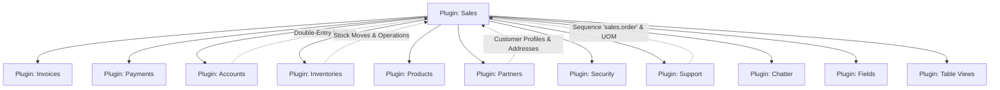
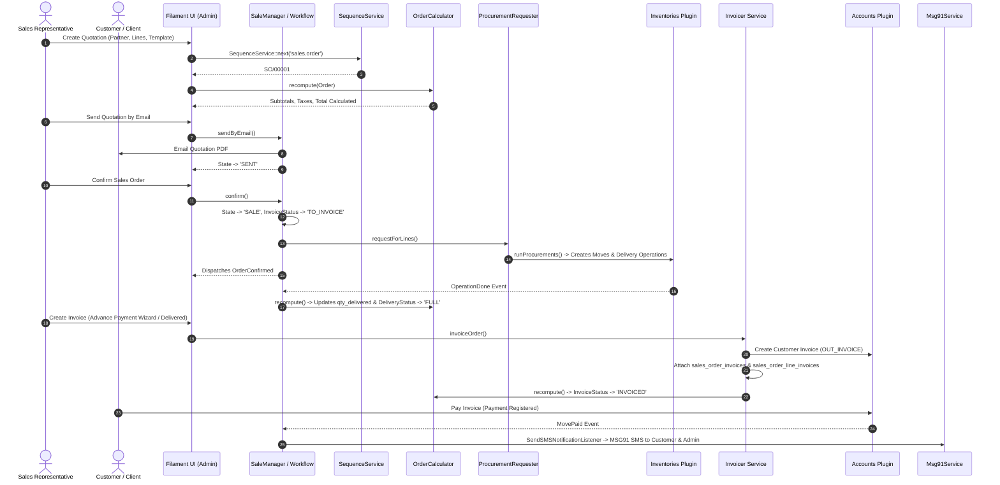

# Plugin: Sales (`sales`)

## Status
[VERIFIED]
Active Optional Module. Registered in `bootstrap/providers.php:57` as `Webkul\Sale\SaleServiceProvider::class`.

## Core/Optional
[VERIFIED]
**Optional Plugin**. Configured as a modular customer quotation, sales order fulfillment, delivery tracking, and commercial billing plugin extending the core architecture without calling `$package->isCore()` (`plugins/webkul/sales/src/SaleServiceProvider.php:33-99`). Execution, Filament resource auto-discovery, cluster mounting, and page registration are gated by runtime installation verification via `Package::isPluginInstalled('sales')` (`plugins/webkul/sales/src/SalePlugin.php:23`).

## Enabled/Disabled
[VERIFIED]
**Conditionally Enabled (Database-Gated)**. `SalePlugin` registers conditionally on the `admin` Filament panel only when the plugin record in the database is marked `is_installed = true` (`plugins/webkul/sales/src/SalePlugin.php:23-28`). When uninstalled, all Sales navigation groups, clusters, API endpoints, and configuration screens remain dormant without registering UI components.

## Purpose
[VERIFIED]
The `sales` plugin provides comprehensive commercial pipeline and revenue management for Aureus ERP. It orchestrates customer quotations, quotation templates, order confirmation, multi-tier pricing, taxes, discounts, profit margins, inventory procurement requests, warehouse delivery synchronization, customer invoicing workflows, advance payment invoice wizards, sales team assignment, and SMS notifications:

1. **Quotation & Sales Order Lifecycle (`Orders` Cluster)**:
   - Manages commercial transactions transitioning through the complete order lifecycle (`OrderState`: `draft`, `sent`, `sale`, `cancel`).
   - Supports quotation templating (`OrderTemplate` and `OrderTemplateProduct`) with automatic expiration dates, pre-filled line items, terms, and optional upsell products (`OrderOption`).
   - Generates document numbering sequentially via `SequenceService::next('sales.order')` (`SO/#####`).
   - Automates PDF generation (`DomPDF`) and email dispatch (`SaleOrderQuotation`, `SaleOrderCancelQuotation`) with customer chatter communication logging.
   - Provides administrative order locking (`OrderLocked` / `OrderUnlocked`) to prevent modifications on confirmed sales orders (`enable_lock_confirm_sales`).

2. **Pricing, Discounts, Margins & Calculations (`OrderCalculator`)**:
   - Calculates line-item subtotal, tax amounts, and grand totals across multi-currency orders using `Webkul\Account\Facades\Tax::computeAll()`.
   - Computes purchase cost margins (`margin` and `margin_percent`) and line-item discounts (`discount`).
   - Livewire real-time order calculation summary (`QuotationSummary`) reacting to form updates.

3. **Supply Chain & Inventory Procurement Integration (`ProcurementRequester`)**:
   - Automatically generates procurement demands and delivery operations upon order confirmation (`OrderState::SALE`), syncing with `inventories` via `Inventory::runProcurements()`.
   - Binds delivery tracking to dedicated procurement groups (`ProcurementGroup`), matching sales lines to inventory moves (`inventories_moves.sale_order_line_id`) and warehouse operations (`inventories_operations.sale_order_id`).
   - Dynamically tracks delivery status (`OrderDeliveryStatus`: `no`, `pending`, `started`, `partial`, `full`) by monitoring outgoing and incoming return inventory moves.
   - Automatically cancels pending warehouse transfers when a sales order is cancelled (`cancelOperations()`).

4. **Invoicing & Accounts Receivable Integration (`Invoicer`)**:
   - Generates customer invoices (`AccountMove` of type `OUT_INVOICE`) linked via pivot table `sales_order_invoices` (`order_id` ↔ `move_id`) and line junction `sales_order_line_invoices` (`order_line_id` ↔ `invoice_line_id`).
   - Computes invoiceable quantities (`qty_to_invoice`) based on product invoicing policy (`invoice_policy`: `'order'` for ordered quantities vs `'delivery'` for delivered goods).
   - Tracks billing status dynamically (`InvoiceStatus`: `no`, `to_invoice`, `invoiced`, `up_selling`).
   - Handles automated invoice reversal synchronization: when a customer credit note is issued (`MoveReversed`), `ComputeSaleOrderFromMoveListener` mirrors line links to the reversal move.

5. **Advance Payment Invoice Wizard (`CreateInvoiceAction`)**:
   - Dedicated modal wizard enabling advance payments and down payments against sales orders (`AdvancedPayment`: `delivered`, `percentage`, `fixed`).
   - Tracks advance payment wizard executions in `sales_advance_payment_invoices` linked via `sales_advance_payment_invoice_order_sales`.

6. **Sales Teams & Pipeline Target Management (`TeamResource`)**:
   - Models sales organizational departments (`Team`) with designated team leaders (`user_id`), team members (`sales_team_members`), color coding, and monthly/period monetary performance targets (`invoiced_target`).
   - *Note*: Sales teams serve organizational grouping and quota tracking; no automated commission calculation engine is implemented.

7. **Multi-Channel Notification & Customer Updates (`SendSMSNotificationListener` & `Msg91Service`)**:
   - Dispatches automated SMS alerts via MSG91 gateway to customer mobile numbers and admin mobile upon payment confirmation (`MovePaid`), reporting amounts paid and residual balances.

---

## Service Provider
[VERIFIED]
- **Class**: `Webkul\Sale\SaleServiceProvider` (`plugins/webkul/sales/src/SaleServiceProvider.php:33`)
- **Inheritance**: Extends `Webkul\PluginManager\PackageServiceProvider`
- **Registration & Configuration**:
  - `configureCustomPackage(Package $package)`:
    - Sets package name to `sales` (`SaleServiceProvider::$name = 'sales'`).
    - Configures view namespace `sales` (`SaleServiceProvider::$viewNamespace = 'sales'`).
    - Registers REST API routes (`hasRoutes(['api'])`).
    - Registers translation namespace (`hasTranslations()`).
    - Registers 25 database migrations (`hasMigrations([...])`).
    - Runs migrations automatically (`runsMigrations()`).
    - Registers 4 settings migrations (`hasSettings([...])`): `sales_product_settings`, `sales_price_settings`, `sales_invoice_settings`, and `sales_quotation_and_order_settings`.
    - Runs settings migrations automatically (`runsSettings()`).
    - Declares runtime plugin dependencies on `invoices` and `payments` (`hasDependencies(['invoices', 'payments'])`).
    - Registers database seeder: `Webkul\Sale\Database\Seeders\DatabaseSeeder::class`.
    - Configures install command: runs dependency installation, migrations, and seeders (`$command->installDependencies()->runsMigrations()->runsSeeders()`).
    - Configures uninstall command: purges chatter audit logs for `Order` and `Team` models via `ChatterCleanupService::purgeForModels([Order::class, Team::class])`, and purges sequence codes via `SequenceService::purge(['sales.order'])`.
    - Configures plugin icon: `sales`.
  - `packageBooted()`:
    - Registers Livewire component: `quotation-summary` (`QuotationSummary::class`).
    - Registers event listeners:
      - `OperationDone` → `ComputeSaleOrderListener::class` (recomputes delivery status and line deliveries when warehouse transfer finishes).
      - `MovePaid` → `SendSMSNotificationListener::class` (sends payment receipt SMS to customer and admin).
      - `MoveConfirmed`, `MoveCancelled`, `MoveDrafted`, `MoveReversed` → `ComputeSaleOrderFromMoveListener::class` (recomputes order invoice status and syncs reversal line junctions).
    - Registers product usage tracking in `ProductUsageRegistry::register(OrderLine::class, OrderOption::class, OrderTemplateProduct::class)`.
  - `packageRegistered()`:
    - Registers `SalePlugin::make()` with the Filament panel builder.
    - Registers alias `sale` for facade `SaleOrderFacade::class`.
    - Binds singleton service `sale` to `Webkul\Sale\SaleManager::class`.

---

## Filament Plugin Class
[VERIFIED]
- **Class**: `Webkul\Sale\SalePlugin` (`plugins/webkul/sales/src/SalePlugin.php:9`)
- **Plugin Identifier**: `'sales'` (`getId(): string`)
- **Panel Registration**: Registers **ONLY** on the **`admin`** Filament panel (`plugins/webkul/sales/src/SalePlugin.php:28-46`). Does not register on the `customer` panel.
- **Auto-Discovery Configuration** (Admin Panel):
  - Resources: `plugins/webkul/sales/src/Filament/Resources` (`Webkul\Sale\Filament\Resources`)
  - Pages: `plugins/webkul/sales/src/Filament/Pages` (`Webkul\Sale\Filament\Pages`)
  - Clusters: `plugins/webkul/sales/src/Filament/Clusters` (`Webkul\Sale\Filament\Clusters`)
  - Widgets: `plugins/webkul/sales/src/Filament/Widgets` (`Webkul\Sale\Filament\Widgets`)

---

## Composer Dependencies
[VERIFIED]
- **Declared in `plugins/webkul/sales/composer.json`**:
  - `webkul/sales` declares zero package-level Composer `require` dependencies.
  - Autoloads PSR-4 namespaces:
    - `Webkul\Sale\`: `src/`
    - `Webkul\Sale\Database\Factories\`: `database/factories/`
    - `Webkul\Sale\Database\Seeders\`: `database/seeders/`
  - Autoloads dev PSR-4 namespace:
    - `Webkul\Sale\Tests\`: `tests/`

---

## Runtime Plugin Dependencies
[VERIFIED]
Declared in `SaleServiceProvider::configureCustomPackage()` via `hasDependencies(['invoices', 'payments'])`:
1. **`invoices`**: Required runtime dependency. Provides customer invoice presentation (`Invoice`), invoice lines (`InvoiceLine`), invoice policies (`InvoicePolicy`), and billing lifecycle synchronization.
2. **`payments`**: Required runtime dependency. Provides electronic payment processing schemas, payment tokenization, and gateway transaction linking for settled invoices.

---

## Directory Structure
[VERIFIED]
```text
plugins/webkul/sales/
├── composer.json
├── config/
├── database/
│   ├── factories/
│   │   ├── OrderFactory.php
│   │   ├── OrderLineFactory.php
│   │   ├── TagFactory.php
│   │   └── TeamFactory.php
│   ├── migrations/
│   │   ├── 2025_01_28_061110_create_sales_teams_table.php
│   │   ├── 2025_01_28_074033_create_sales_team_members_table.php
│   │   ├── 2025_01_28_102329_create_add_columns_to_product_categories_table.php
│   │   ├── 2025_01_28_122700_create_sales_order_templates_table.php
│   │   ├── 2025_02_05_053212_create_sales_orders_table.php
│   │   ├── 2025_02_05_080609_create_sales_order_template_products_table.php
│   │   ├── 2025_02_05_102851_create_sales_order_lines_table.php
│   │   ├── 2025_03_05_073635_create_sales_order_options_table.php
│   │   ├── 2025_03_05_124300_create_sales_order_line_taxes_table.php
│   │   ├── 2025_03_05_124300_create_sales_tag_table.php
│   │   ├── 2025_03_05_124400_create_sales_order_invoices_table.php
│   │   ├── 2025_03_05_124400_create_sales_order_line_invoices_table.php
│   │   ├── 2025_03_05_124400_create_sales_order_tags_table.php
│   │   ├── 2025_03_06_133433_create_sales_advance_payment_invoices_table.php
│   │   ├── 2025_03_06_133458_create_sales_advance_payment_invoice_order_sales_table.php
│   │   ├── 2025_04_07_111609_add_sales_columns_to_inventories_operations_table_from_sales.php
│   │   ├── 2025_04_07_111610_add_sales_columns_to_inventories_moves_table_from_sales.php
│   │   ├── 2025_04_09_080746_add_delivery_status_column_in_sales_orders_table.php
│   │   ├── 2025_04_09_101755_add_inventories_columns_to_sales_orders_table_from_sales.php
│   │   ├── 2025_04_09_101814_add_inventories_columns_to_sales_order_lines_table_from_sales.php
│   │   ├── 2026_03_11_095519_alter_sales_order_lines_table.php
│   │   ├── 2026_03_11_103613_alter_sales_order_template_products_table.php
│   │   ├── 2026_04_08_043411_add_procurement_group_id_column_in_sales_orders_table_from_sales.php
│   │   ├── 2026_04_08_043511_add_sale_order_id_column_in_inventories_procurement_groups_table_from_sales.php
│   │   └── 2026_08_03_130000_seed_sales_sequences.php
│   ├── seeders/
│   │   ├── DatabaseSeeder.php
│   │   ├── SalesTeamSeeder.php
│   │   └── SequenceSeeder.php
│   └── settings/
│       ├── 2025_02_05_094022_create_sales_product_settings.php
│       ├── 2025_02_05_094025_create_sales_price_settings.php
│       ├── 2025_02_05_095000_create_sales_invoice_settings.php
│       └── 2025_02_05_095005_create_sales_quotation_and_order_settings.php
├── resources/
│   ├── lang/ (ar, en, es, fr, pt_BR)
│   └── views/
│       ├── livewire/
│       │   └── quotation-summary.blade.php
│       ├── mails/
│       │   ├── sale-order-cancel-quotation.blade.php
│       │   └── sale-order-quotation.blade.php
│       └── sales/
│           └── quotation.blade.php
├── routes/
│   └── api.php
├── src/
│   ├── Enums/
│   │   ├── AdvancedPayment.php
│   │   ├── InvoiceStatus.php
│   │   ├── OrderDeliveryStatus.php
│   │   ├── OrderDisplayType.php
│   │   ├── OrderState.php
│   │   └── QtyDeliveredMethod.php
│   ├── Events/
│   │   ├── OrderCanceled.php
│   │   ├── OrderConfirmed.php
│   │   ├── OrderDrafted.php
│   │   ├── OrderLocked.php
│   │   └── OrderUnlocked.php
│   ├── Facades/
│   │   └── SaleOrder.php
│   ├── Filament/
│   │   ├── Clusters/
│   │   │   ├── Configuration/
│   │   │   │   └── Resources/
│   │   │   │       ├── ActivityPlanResource.php
│   │   │   │       ├── ActivityTypeResource.php
│   │   │   │       ├── CurrencyResource.php
│   │   │   │       ├── PackagingResource.php
│   │   │   │       ├── ProductCategoryResource.php
│   │   │   │       ├── ProductAttributeResource.php
│   │   │   │       ├── QuotationTemplateResource.php
│   │   │   │       ├── TagResource.php
│   │   │   │       ├── TeamResource.php
│   │   │   │       └── UOMCategoryResource.php
│   │   │   ├── Orders/
│   │   │   │   └── Resources/
│   │   │   │       ├── CustomerResource.php
│   │   │   │       ├── OrderDeliveryResource.php
│   │   │   │       ├── OrderInvoiceResource.php
│   │   │   │       ├── OrderResource.php
│   │   │   │       ├── QuotationDeliveryResource.php
│   │   │   │       ├── QuotationInvoiceResource.php
│   │   │   │       └── QuotationResource.php
│   │   │   ├── Products/
│   │   │   │   └── Resources/
│   │   │   │       └── ProductResource.php
│   │   │   ├── Settings/
│   │   │   │   └── Pages/
│   │   │   │       ├── ManageInvoice.php
│   │   │   │       ├── ManagePricing.php
│   │   │   │       ├── ManageProducts.php
│   │   │   │       └── ManageQuotationAndOrder.php
│   │   │   ├── ToInvoice/
│   │   │   │   └── Resources/
│   │   │   │       ├── OrderToInvoiceResource.php
│   │   │   │       └── OrderToUpsellResource.php
│   │   │   ├── Configuration.php
│   │   │   ├── Orders.php
│   │   │   ├── PluginSettings.php
│   │   │   ├── Products.php
│   │   │   └── ToInvoice.php
│   ├── Http/
│   │   ├── Controllers/API/V1/
│   │   │   ├── Controller.php
│   │   │   ├── OrderController.php
│   │   │   ├── OrderDeliveryController.php
│   │   │   ├── OrderInvoiceController.php
│   │   │   ├── OrderLineController.php
│   │   │   └── TagController.php
│   │   ├── Requests/
│   │   │   ├── OrderRequest.php
│   │   │   └── TagRequest.php
│   │   └── Resources/V1/
│   │       ├── OrderLineResource.php
│   │       ├── OrderResource.php
│   │       └── TagResource.php
│   ├── Listeners/
│   │   ├── ComputeSaleOrderFromMoveListener.php
│   │   ├── ComputeSaleOrderListener.php
│   │   └── SendSMSNotificationListener.php
│   ├── Livewire/
│   │   └── QuotationSummary.php
│   ├── Mail/
│   │   ├── SaleOrderCancelQuotation.php
│   │   └── SaleOrderQuotation.php
│   ├── Models/
│   │   ├── ActivityPlan.php
│   │   ├── ActivityType.php
│   │   ├── AdvancedPaymentInvoice.php
│   │   ├── AdvancedPaymentInvoiceOrderSale.php
│   │   ├── Attribute.php
│   │   ├── Category.php
│   │   ├── Currency.php
│   │   ├── Invoice.php
│   │   ├── Order.php
│   │   ├── OrderLine.php
│   │   ├── OrderOption.php
│   │   ├── OrderTemplate.php
│   │   ├── OrderTemplateProduct.php
│   │   ├── OrderToInvoice.php
│   │   ├── OrderToUpsell.php
│   │   ├── Packaging.php
│   │   ├── Partner.php
│   │   ├── Product.php
│   │   ├── Quotation.php
│   │   ├── Tag.php
│   │   ├── Team.php
│   │   ├── TeamMember.php
│   │   └── UOMCategory.php
│   ├── Policies/
│   ├── Services/
│   │   ├── Invoicer.php
│   │   ├── Msg91Service.php
│   │   ├── OrderCalculator.php
│   │   ├── OrderMailer.php
│   │   ├── OrderWorkflow.php
│   │   └── ProcurementRequester.php
│   ├── Settings/
│   │   ├── InvoiceSettings.php
│   │   ├── PriceSettings.php
│   │   ├── ProductSettings.php
│   │   └── QuotationAndOrderSettings.php
│   ├── SaleManager.php
│   ├── SalePlugin.php
│   └── SaleServiceProvider.php
└── tests/
    ├── Feature/
    │   ├── API/V1/
    │   │   ├── OrderDeliveryTest.php
    │   │   ├── OrderInvoiceTest.php
    │   │   ├── OrderLineTest.php
    │   │   ├── OrderTest.php
    │   │   └── TagTest.php
    │   ├── Filament/
    │   │   ├── OrderResourceTest.php
    │   │   ├── QuotationResourceTest.php
    │   │   └── ResourceGlobalSearchSmokeTest.php
    │   └── Workflows/
    │       ├── ChainedPullRouteSaleOrderTest.php
    │       ├── CompanyIsolationTest.php
    │       ├── CompanyScopingInvariantsTest.php
    │       ├── OneStepSaleOrderTest.php
    │       ├── OrderInvoicingTest.php
    │       ├── SaleOrderTest.php
    │       ├── ThreeStepsSaleOrderTest.php
    │       └── TwoStepsSaleOrderTest.php
    └── Helpers/
        └── SaleHelper.php
```

---

## Models
[VERIFIED]

The `sales` plugin defines 23 Eloquent models categorized into concrete table owners, proxy models, and cross-domain subclasses:

### Concrete Domain Models (Own Physical Database Tables)
1. **`Order` (`Webkul\Sale\Models\Order`)**:
   - **Table**: `sales_orders`
   - **Traits**: `BelongsToCompany`, `ChecksCompanyConsistency`, `HasChatter`, `HasCustomFields`, `HasFactory`, `HasLogActivity`, `HasOwnershipScope`, `SoftDeletes`.
   - **Key Attributes**: `name`, `state` (`OrderState`), `invoice_status` (`InvoiceStatus`), `delivery_status` (`OrderDeliveryStatus`), `amount_untaxed`, `amount_tax`, `amount_total`, `validity_date`, `date_order`, `commitment_date`, `locked`, `prepayment_percent`, `require_signature`, `require_payment`, `currency_rate`, `client_order_ref`, `partner_id`, `partner_invoice_id`, `partner_shipping_id`, `user_id`, `team_id`, `warehouse_id`, `procurement_group_id`, `sale_order_template_id`, `journal_id`, `payment_term_id`, `fiscal_position_id`, `currency_id`, `company_id`, `creator_id`.
   - **Lifecycle Hooks**: Auto-resolves `creator_id`, `user_id`, `company_id`, and `warehouse_id` on create; generates sequential document name via `SequenceService::next('sales.order')`; cascades state updates to order lines on save.
2. **`OrderLine` (`Webkul\Sale\Models\OrderLine`)**:
   - **Table**: `sales_order_lines`
   - **Traits**: `BelongsToCompany`, `ChecksCompanyConsistency`, `HasFactory`, `SortableTrait`.
   - **Key Attributes**: `order_id`, `product_id`, `product_uom_id`, `product_uom_qty`, `qty_delivered`, `qty_invoiced`, `qty_to_invoice`, `price_unit`, `discount`, `price_subtotal`, `price_tax`, `price_total`, `purchase_price`, `margin`, `margin_percent`, `qty_delivered_method` (`QtyDeliveredMethod`), `state` (`OrderState`), `display_type`, `is_downpayment`, `is_expense`, `route_id`, `warehouse_id`, `company_id`, `salesman_id`, `order_partner_id`.
   - **Lifecycle Hooks**: Links matching optional products (`OrderOption`) on creation/update; triggers inventory procurement rule recomputation on quantity change when order is confirmed.
3. **`Team` (`Webkul\Sale\Models\Team`)**:
   - **Table**: `sales_teams`
   - **Traits**: `BelongsToCompany`, `HasChatter`, `HasCustomFields`, `HasFactory`, `HasLogActivity`, `SoftDeletes`, `SortableTrait`.
   - **Key Attributes**: `name`, `user_id` (Team Leader), `company_id`, `creator_id`, `color`, `is_active`, `sort`, `invoiced_target`.
   - **Relationships**: `members()` (`BelongsToMany` User via `sales_team_members`), `creator()` (`BelongsTo` User), `company()` (`BelongsTo` Company).
4. **`TeamMember` (`Webkul\Sale\Models\TeamMember`)**:
   - **Table**: `sales_team_members`
   - **Key Attributes**: `team_id`, `user_id` (`$timestamps = false`).
5. **`OrderTemplate` (`Webkul\Sale\Models\OrderTemplate`)**:
   - **Table**: `sales_order_templates`
   - **Traits**: `BelongsToCompany`, `HasFactory`, `SortableTrait`.
   - **Key Attributes**: `name`, `number_of_days`, `note`, `journal_id`, `company_id`, `creator_id`, `is_active`, `sort`.
   - **Relationships**: `products()` (`HasMany` `OrderTemplateProduct`).
6. **`OrderTemplateProduct` (`Webkul\Sale\Models\OrderTemplateProduct`)**:
   - **Table**: `sales_order_template_products`
   - **Traits**: `BelongsToCompany`.
   - **Key Attributes**: `order_template_id`, `product_id`, `product_uom_id`, `product_uom_qty`, `display_type`, `name`, `company_id`, `creator_id`.
7. **`OrderOption` (`Webkul\Sale\Models\OrderOption`)**:
   - **Table**: `sales_order_options`
   - **Traits**: `SortableTrait`.
   - **Key Attributes**: `order_id`, `product_id`, `line_id`, `uom_id`, `quantity`, `price_unit`, `discount`, `name`, `sort`, `creator_id`.
8. **`Tag` (`Webkul\Sale\Models\Tag`)**:
   - **Table**: `sales_tags`
   - **Traits**: `HasFactory`.
   - **Key Attributes**: `name`, `color`, `creator_id`.
9. **`AdvancedPaymentInvoice` (`Webkul\Sale\Models\AdvancedPaymentInvoice`)**:
   - **Table**: `sales_advance_payment_invoices`
   - **Traits**: `BelongsToCompany`.
   - **Key Attributes**: `currency_id`, `company_id`, `creator_id`, `advance_payment_method`, `fixed_amount`, `deduct_down_payments`, `consolidated_billing`, `amount`.
   - **Relationships**: `orders()` (`BelongsToMany` `Order` via `sales_advance_payment_invoice_order_sales`).
10. **`AdvancedPaymentInvoiceOrderSale` (`Webkul\Sale\Models\AdvancedPaymentInvoiceOrderSale`)**:
    - **Table**: `sales_advance_payment_invoice_order_sales`
    - **Key Attributes**: `advance_payment_invoice_id`, `order_id` (`$timestamps = false`).

### Proxy / State-Filtered Models (Subclasses of `Order`)
11. **`Quotation` (`Webkul\Sale\Models\Quotation`)**: Subclasses `Order`. Represents draft/sent quotations in `QuotationResource`.
12. **`OrderToInvoice` (`Webkul\Sale\Models\OrderToInvoice`)**: Subclasses `Order`. Scoped to orders ready for invoicing in `OrderToInvoiceResource`.
13. **`OrderToUpsell` (`Webkul\Sale\Models\OrderToUpsell`)**: Subclasses `Order`. Scoped to orders with upselling potential in `OrderToUpsellResource`.

### Extended Cross-Domain Proxy Models
14. **`Invoice` (`Webkul\Sale\Models\Invoice`)**: Extends `Webkul\Invoice\Models\Invoice`. Adds `salesOrders()` relation (`BelongsToMany` Order via `sales_order_invoices`).
15. **`Product` (`Webkul\Sale\Models\Product`)**: Extends `Webkul\Invoice\Models\Product`.
16. **`Partner` (`Webkul\Sale\Models\Partner`)**: Extends `Webkul\Invoice\Models\Partner`.
17. **`Category` (`Webkul\Sale\Models\Category`)**: Extends `Webkul\Invoice\Models\Category`. Adds `products()` relation.
18. **`Packaging` (`Webkul\Sale\Models\Packaging`)**: Extends `Webkul\Product\Models\Packaging`.
19. **`Attribute` (`Webkul\Sale\Models\Attribute`)**: Extends `Webkul\Product\Models\Attribute`.
20. **`UOMCategory` (`Webkul\Sale\Models\UOMCategory`)**: Extends `Webkul\Support\Models\UOMCategory`.
21. **`Currency` (`Webkul\Sale\Models\Currency`)**: Extends `Webkul\Support\Models\Currency`.
22. **`ActivityPlan` (`Webkul\Sale\Models\ActivityPlan`)**: Extends `Webkul\Support\Models\ActivityPlan`.
23. **`ActivityType` (`Webkul\Sale\Models\ActivityType`)**: Extends `Webkul\Support\Models\ActivityType`.

---

## Database
[VERIFIED]

### Physical Database Tables
1. **`sales_teams`**: Stores sales teams, team leaders, active flags, sort order, and monetary targets (`invoiced_target`).
2. **`sales_team_members`**: Pivot table associating users with sales teams (`team_id`, `user_id`).
3. **`sales_orders`**: Primary commercial document header tracking quotation/order state, multi-currency totals, partner addresses, payment terms, and inventory/invoice links.
4. **`sales_order_lines`**: Order line items tracking ordered/delivered/invoiced quantities, unit prices, taxes, discounts, profit margins, routes, and fulfillment warehouses.
5. **`sales_order_templates`**: Quotation templates defining validity duration, terms, and default journals.
6. **`sales_order_template_products`**: Reusable product and section line items for quotation templates.
7. **`sales_order_options`**: Optional/suggested upsell line items attached to quotations.
8. **`sales_tags`**: Classification tags with color metadata.
9. **`sales_order_tags`**: Pivot table binding tags to sales orders (`order_id`, `tag_id`).
10. **`sales_order_line_taxes`**: Pivot table binding sales order lines to finance tax rates (`order_line_id`, `tax_id`).
11. **`sales_order_invoices`**: Pivot table linking sales orders to customer account moves / invoices (`order_id`, `move_id`).
12. **`sales_order_line_invoices`**: Pivot table linking sales order lines to invoice move lines (`order_line_id`, `invoice_line_id`).
13. **`sales_advance_payment_invoices`**: Advance payment wizard transaction records.
14. **`sales_advance_payment_invoice_order_sales`**: Pivot table linking advance payment records to sales orders (`advance_payment_invoice_id`, `order_id`).

### Cross-Plugin Schema Alterations
- **`products_categories`**: Adds `sales_description` via `2025_01_28_102329_create_add_columns_to_product_categories_table`.
- **`inventories_operations`**: Adds `sale_order_id` via `2025_04_07_111609_add_sales_columns_to_inventories_operations_table_from_sales`.
- **`inventories_moves`**: Adds `sale_order_line_id` via `2025_04_07_111610_add_sales_columns_to_inventories_moves_table_from_sales`.
- **`inventories_procurement_groups`**: Adds `sale_order_id` via `2026_04_08_043511_add_sale_order_id_column_in_inventories_procurement_groups_table_from_sales`.

---

## Filament Resources, Pages, Widgets & Clusters
[VERIFIED]

### Admin Panel Clusters
1. **`Orders` Cluster (`Webkul\Sale\Filament\Clusters\Orders`)**:
   - **`QuotationResource`**: Manages quotations (`Quotation`). Pages: `ListQuotations` (Preset views: `my_quotations`, `quotations`, `sale_orders`, `archived`), `CreateQuotation`, `ViewQuotation`, `EditQuotation`, `ManageInvoices`, `ManageDeliveries`.
   - **`OrderResource`**: Extends `QuotationResource` filtered to `state = sale` (`Order`). Pages: `ListOrders` (Preset views: `my_orders`, `to_invoice`, `up_selling`, `archived`), `CreateOrder`, `ViewOrder`, `EditOrder`, `ManageInvoices`, `ManageDeliveries`.
   - **`CustomerResource`**: Manages commercial customers (`Partner`). Sub-navigation pages: `ListCustomers`, `CreateCustomer`, `ViewCustomer`, `EditCustomer`, `ManageContacts`, `ManageAddresses`, `ManageBankAccounts`.
   - **`QuotationInvoiceResource` / `OrderInvoiceResource`**: Sub-resource managing customer invoices directly within quotation/order context (`ManagePayments`, `ViewInvoice`, `EditInvoice`).
   - **`QuotationDeliveryResource` / `OrderDeliveryResource`**: Sub-resource managing warehouse delivery operations directly within quotation/order context (`ManageMoves`, `ViewDelivery`, `EditDelivery`).
2. **`ToInvoice` Cluster (`Webkul\Sale\Filament\Clusters\ToInvoice`)**:
   - **`OrderToInvoiceResource`**: Scoped list of confirmed sales orders ready for billing (`invoice_status = to_invoice`). Pages: `ListOrderToInvoices`, `ViewOrderToInvoice`, `EditOrderToInvoice`.
   - **`OrderToUpsellResource`**: Scoped list of orders with upselling potential (`invoice_status = up_selling`). Pages: `ListOrderToUpsells`.
3. **`Products` Cluster (`Webkul\Sale\Filament\Clusters\Products`)**:
   - **`ProductResource`**: Full product master catalogue. Sub-navigation pages: `ListProducts`, `CreateProduct`, `ViewProduct`, `EditProduct`, `ManageVariants`, `ManageAttributes`, `ManageQuantities`, `ManageMoves`, `ManageBillsOfMaterials`, `ManageVendors`.
4. **`Configuration` Cluster (`Webkul\Sale\Filament\Clusters\Configuration`)**:
   - **`TeamResource`**: Sales teams and targets. Pages: `ListTeams`, `CreateTeam`, `ViewTeam`, `EditTeam`.
   - **`QuotationTemplateResource`**: Reusable quotation templates. Pages: `ListQuotationTemplates`, `CreateQuotationTemplate`, `ViewQuotationTemplate`, `EditQuotationTemplate`.
   - **`ProductCategoryResource`**: Product categories. Pages: `ListProductCategories`, `CreateProductCategory`, `ViewProductCategory`, `EditProductCategory`, `ManageProducts`.
   - **`ProductAttributeResource`**: Product variant attributes. Pages: `ListProductAttributes`, `CreateProductAttribute`, `ViewProductAttribute`, `EditProductAttribute`.
   - **`ActivityPlanResource`**: Sales activity plans. Pages: `ListActivityPlans`, `ViewActivityPlan`, `EditActivityPlan` with `ActivityTemplateRelationManager`.
   - **`ActivityTypeResource`**: Activity types. Pages: `ListActivityTypes`, `CreateActivityType`, `ViewActivityType`, `EditActivityType`.
   - **`TagResource`**: Sales order tags. Pages: `ListTags`.
   - **`PackagingResource`**: Product packagings. Pages: `ManagePackagings`.
   - **`UOMCategoryResource`**: Unit of measure categories. Pages: `ListUOMCategories`, `CreateUOMCategory`, `ViewUOMCategory`, `EditUOMCategory`.
   - **`CurrencyResource`**: System currencies. Pages: `ListCurrencies`, `CreateCurrency`, `ViewCurrency`, `EditCurrency`.
5. **`PluginSettings` Cluster (`Webkul\Sale\Filament\Clusters\PluginSettings`)**:
   - **`ManageQuotationAndOrder`**: Settings for default quotation validity duration and locking confirmed sales orders (`enable_lock_confirm_sales`).
   - **`ManagePricing`**: Settings for discounts (`enable_discount`) and margins (`enable_margin`).
   - **`ManageProducts`**: Settings for email content delivery (`enable_deliver_content_by_email`).
   - **`ManageInvoice`**: Settings for global default invoicing policy (`invoice_policy`: `order` vs `delivery`).

---

## Panels
[VERIFIED]
- **`admin` Panel**: **YES**. All Sales clusters, resources, infolists, tables, and settings pages are registered on the `admin` panel.
- **`customer` Panel**: **NO**. The sales plugin registers exclusively on the `admin` panel (`plugins/webkul/sales/src/SalePlugin.php:28-46`). Customer portal interactions are hosted separately under `partners` and `website`.

---

## Services
[VERIFIED]

1. **`SaleManager` (`Webkul\Sale\SaleManager`)**:
   - Central sales coordinator registered as singleton `sale` and accessed via facade `Webkul\Sale\Facades\SaleOrder`.
   - Delegates operations to `OrderWorkflow`, `OrderCalculator`, `Invoicer`, `ProcurementRequester`, and `OrderMailer`.
2. **`OrderWorkflow` (`Webkul\Sale\Services\OrderWorkflow`)**:
   - Orchestrates order state transitions:
     - `confirm(Order $record)`: Transitions to `OrderState::SALE`, sets `invoice_status = to_invoice`, locks order if configured, triggers procurement requests via `ProcurementRequester::requestForLines()`, recalculates totals, and dispatches `OrderConfirmed`.
     - `backToQuotation(Order $record)`: Resets cancelled order to `OrderState::DRAFT` and `invoice_status = no`, dispatches `OrderDrafted`.
     - `cancel(Order $record, array $data)`: Transitions to `OrderState::CANCEL`, sends optional cancellation email, cancels active inventory operations via `ProcurementRequester::cancelOperations()`, and dispatches `OrderCanceled`.
     - `toggleLock(Order $record)`: Toggles `locked` boolean and dispatches `OrderLocked` / `OrderUnlocked`.
     - `sendByEmail(Order $record, array $data)`: Sends quotation email and advances draft to `OrderState::SENT`.
3. **`OrderCalculator` (`Webkul\Sale\Services\OrderCalculator`)**:
   - Recomputes full order and line financials:
     - Calculates discounts, tax breakdown (`Tax::computeAll()`), untaxed subtotals, and total amounts.
     - Calculates delivered quantities (`refreshQtyDelivered()`) by aggregating done inventory moves from `ProcurementRequester::outgoingAndIncomingMoves()`.
     - Calculates invoiced quantities (`refreshQtyInvoiced()`) and untaxed amounts across linked `accountMoveLines`.
     - Determines `qty_to_invoice` and `invoice_status` according to line `invoice_policy` (`order` vs `delivery`).
     - Refreshes header `delivery_status` and `invoice_status`.
4. **`Invoicer` (`Webkul\Sale\Services\Invoicer`)**:
   - Generates customer invoices (`AccountMove` of type `OUT_INVOICE`) and line items (`AccountMoveLine`).
   - Links orders via pivot `sales_order_invoices` and lines via `sales_order_line_invoices`.
   - Executes advance payment invoice creation via `invoiceOrder()`, storing records in `sales_advance_payment_invoices`.
5. **`ProcurementRequester` (`Webkul\Sale\Services\ProcurementRequester`)**:
   - Bridges sales lines to inventory operations by building `ProcurementRequest` objects with warehouse routes, partner addresses, and packaging specifications.
   - Dispatches procurement batches to `InventoryFacade::runProcurements()`.
   - Tracks outgoing and incoming inventory moves (`outgoingAndIncomingMoves()`) for accurate delivery computation.
   - Cancels unfinished delivery transfers upon sales order cancellation (`cancelOperations()`).
6. **`OrderMailer` (`Webkul\Sale\Services\OrderMailer`)**:
   - Generates and dispatches quotation PDFs and cancellation notices via `EmailService`, logging messages and file attachments to record chatter.
7. **`Msg91Service` (`Webkul\Sale\Services\Msg91Service`)**:
   - Dispatches transactional SMS messages via MSG91 HTTP API to customer phone numbers and administrative mobile contacts.

---

## Events
[VERIFIED]
1. **`OrderConfirmed` (`Webkul\Sale\Events\OrderConfirmed`)**: Dispatched when a quotation is confirmed into a sales order (`state = sale`).
2. **`OrderLocked` (`Webkul\Sale\Events\OrderLocked`)**: Dispatched when a confirmed sales order is locked.
3. **`OrderUnlocked` (`Webkul\Sale\Events\OrderUnlocked`)**: Dispatched when a locked sales order is unlocked for editing.
4. **`OrderDrafted` (`Webkul\Sale\Events\OrderDrafted`)**: Dispatched when a cancelled sales order is reverted to draft quotation.
5. **`OrderCanceled` (`Webkul\Sale\Events\OrderCanceled`)**: Dispatched when a quotation or sales order is cancelled.

---

## Listeners
[VERIFIED]
1. **`ComputeSaleOrderListener` (`Webkul\Sale\Listeners\ComputeSaleOrderListener`)**:
   - **Listens to**: `Webkul\Inventory\Events\OperationDone`
   - **Action**: Automatically recalculates delivery status and delivered quantities on the associated sales order when an inventory transfer completes.
2. **`ComputeSaleOrderFromMoveListener` (`Webkul\Sale\Listeners\ComputeSaleOrderFromMoveListener`)**:
   - **Listens to**: `MoveConfirmed`, `MoveCancelled`, `MoveDrafted`, `MoveReversed` (from `accounts`)
   - **Action**: Recalculates invoiced quantities and invoice status on linked sales orders; when a customer refund is created (`MoveReversed`), mirrors `sales_order_line_invoices` junction records to the reversal move lines.
3. **`SendSMSNotificationListener` (`Webkul\Sale\Listeners\SendSMSNotificationListener`)**:
   - **Listens to**: `Webkul\Account\Events\MovePaid`
   - **Action**: Looks up the related sales order and sends payment confirmation and residual balance SMS alerts to the customer and administrator via `Msg91Service`.

---

## Observers
[NOT APPLICABLE]
[VERIFIED] The `sales` plugin registers zero dedicated Eloquent Observer classes. Lifecycle behavior (user ID assignment, company scoping, sequence number generation, warehouse resolution, and line option syncing) is implemented directly in Eloquent model `boot()` methods on `Order`, `OrderLine`, `Team`, and `AdvancedPaymentInvoice`.

---

## Policies
[VERIFIED]
The plugin implements 19 authorization policies under `plugins/webkul/sales/src/Policies`:
1. `OrderPolicy`
2. `QuotationPolicy`
3. `OrderToInvoicePolicy`
4. `OrderToUpsellPolicy`
5. `TeamPolicy`
6. `OrderTemplatePolicy`
7. `OrderTemplateProductPolicy`
8. `ProductPolicy`
9. `CategoryPolicy`
10. `AttributePolicy`
11. `PackagingPolicy`
12. `TagPolicy`
13. `PartnerPolicy`
14. `ActivityPlanPolicy`
15. `ActivityTypePolicy`
16. `CurrencyPolicy`
17. `UOMCategoryPolicy`

Each policy validates permissions using `Webkul\Security\Bouncer::hasPermission()` against actions: `viewAny`, `view`, `create`, `update`, `delete`, `deleteAny`, `forceDelete`, `forceDeleteAny`, `restore`, `restoreAny`, `reorder`.

---

## Routes
[VERIFIED]

### REST API Routes (`plugins/webkul/sales/routes/api.php`)
Prefix: `admin/api/v1/sales`, Middleware: `['auth:sanctum']`:
- `GET|POST|PUT|PATCH|DELETE /admin/api/v1/sales/orders`: CRUD for sales orders / quotations (`OrderController`).
- `POST /admin/api/v1/sales/orders/{id}/confirm`: Confirm quotation into sales order (`OrderController::confirm`).
- `POST /admin/api/v1/sales/orders/{id}/cancel`: Cancel quotation or order (`OrderController::cancel`).
- `POST /admin/api/v1/sales/orders/{id}/set-as-quotation`: Revert cancelled order to quotation (`OrderController::setAsQuotation`).
- `POST /admin/api/v1/sales/orders/{id}/toggle-lock`: Lock or unlock sales order (`OrderController::toggleLock`).
- `GET /admin/api/v1/sales/orders/{order}/lines`: List order lines (`OrderLineController::index`).
- `GET /admin/api/v1/sales/orders/{order}/lines/{line}`: Show single order line (`OrderLineController::show`).
- `GET /admin/api/v1/sales/orders/{order}/deliveries`: List delivery operations for order (`OrderDeliveryController::index`).
- `GET /admin/api/v1/sales/orders/{order}/invoices`: List invoices for order (`OrderInvoiceController::index`).
- `GET|POST|PUT|PATCH|DELETE /admin/api/v1/sales/tags`: CRUD for tags (`TagController`).

---

## Settings
[VERIFIED]
1. **`QuotationAndOrderSettings`** (`group = 'sales_quotation_and_orders'`):
   - `default_quotation_validity`: Default validity period in days for new quotations.
   - `enable_lock_confirm_sales`: Boolean flag automatically locking sales orders upon confirmation.
2. **`PriceSettings`** (`group = 'sales_price'`):
   - `enable_discount`: Enables line-item percentage discount inputs.
   - `enable_margin`: Enables product purchase cost tracking and gross margin calculations.
3. **`ProductSettings`** (`group = 'sales_product'`):
   - `enable_deliver_content_by_email`: Toggles automatic digital content delivery upon order confirmation.
4. **`InvoiceSettings`** (`group = 'sales_invoicing'`):
   - `invoice_policy`: Default billing policy (`InvoicePolicy::ORDER` vs `InvoicePolicy::DELIVERY`).

---

## Translations
[VERIFIED]
Translation namespaces registered under `sales::` across 5 locales:
- `en` (English - default)
- `ar` (Arabic)
- `es` (Spanish)
- `fr` (French)
- `pt_BR` (Portuguese - Brazil)

Covers app strings, models (`order`, `team`), enums (`order-state`, `invoice-status`, `order-delivery-status`, `advanced-payment`, `qty-delivered-method`, `order-display-type`), and Filament UI clusters/resources/actions/pages.

---

## Tests
[VERIFIED]
**Test Coverage Status: Fully Tested**. The `sales` plugin contains a comprehensive test suite of **16 feature test files and 1 shared helper** under `plugins/webkul/sales/tests`:

### 1. Workflow & Integration Tests (`tests/Feature/Workflows/`)
- `SaleOrderTest.php`: Tests financial computations, exclusive/inclusive tax calculation, discount deductions, subtotal calculations, and gross profit margin evaluation.
- `OrderInvoicingTest.php`: Tests standard invoice generation, ordered quantity vs delivered quantity invoicing policies, partial billing, and invoice status transitions.
- `OneStepSaleOrderTest.php`: Tests end-to-end sales order confirmation with direct one-step warehouse delivery and inventory stock move completion.
- `TwoStepsSaleOrderTest.php`: Tests two-step delivery routing (Pick + Ship) triggered from sales confirmation.
- `ThreeStepsSaleOrderTest.php`: Tests three-step delivery routing (Pick + Pack + Ship).
- `ChainedPullRouteSaleOrderTest.php`: Tests complex multi-warehouse replenishment and pull routes triggered by customer demand.
- `CompanyIsolationTest.php` & `CompanyScopingInvariantsTest.php`: Verifies strict multi-company data isolation and company-consistency invariants across sales orders, lines, and linked journals.

### 2. Filament UI Feature Tests (`tests/Feature/Filament/`)
- `QuotationResourceTest.php`: Tests quotation creation, editing, state transition actions, email dispatch, invoice modal triggers, and delivery tabs.
- `OrderResourceTest.php`: Tests sales order views, locking actions, invoice generation, and tabbed sub-navigation.
- `ResourceGlobalSearchSmokeTest.php`: Verifies global search functionality across customer names, references, and order numbers.

### 3. REST API Feature Tests (`tests/Feature/API/V1/`)
- `OrderTest.php`: Tests CRUD API endpoints, pagination, and state action endpoints (`confirm`, `cancel`, `set-as-quotation`, `toggle-lock`).
- `OrderLineTest.php`: Tests order line retrieval endpoints.
- `OrderInvoiceTest.php`: Tests order invoice linking endpoints.
- `OrderDeliveryTest.php`: Tests order delivery operation retrieval endpoints.
- `TagTest.php`: Tests tag management endpoints.

### 4. Test Helper (`tests/Helpers/SaleHelper.php`)
- Provides reusable test factories, admin auth setup, line item builders, order calculators, and invoice generators.

---

## Runtime Dependencies & Cross-Plugin Relationships
[VERIFIED]



### Cross-Domain Linkages
- **`invoices` & `accounts`**:
  - `Order` links to `Move` (`OUT_INVOICE`) via `sales_order_invoices`.
  - `OrderLine` links to `MoveLine` via `sales_order_line_invoices`.
  - `OrderLine` links to `Tax` via `sales_order_line_taxes`.
  - `MoveReversed` event triggers `ComputeSaleOrderFromMoveListener` to preserve invoice line traceability on credit notes.
- **`inventories`**:
  - Confirmed orders create `ProcurementGroup` and trigger `Inventory::runProcurements()`.
  - Stock moves link to sales lines via `inventories_moves.sale_order_line_id`.
  - Delivery operations link to sales orders via `inventories_operations.sale_order_id`.
  - `OperationDone` event triggers `ComputeSaleOrderListener` to update delivered quantities.
- **`products`**:
  - `OrderLine`, `OrderOption`, and `OrderTemplateProduct` register with `ProductUsageRegistry` to enforce referential integrity.
- **`support`**:
  - Number generation uses `SequenceService::next('sales.order')`.
  - Multi-tenant isolation uses `BelongsToCompany` and `CompanyContext`.
- **`security`**:
  - Salesperson ownership scoping uses `HasOwnershipScope`.
  - Permissions evaluated via local `Bouncer`.
- **`chatter`**:
  - `Order` and `Team` use `HasChatter` and `HasLogActivity` for audit feeds.

---

## Data Flow
[VERIFIED]



---

## Business Rules
[VERIFIED]

1. **State Machine Invariants**:
   - Initial quotation creation sets `OrderState::DRAFT` and `InvoiceStatus::NO`.
   - Email dispatch transitions `DRAFT` to `OrderState::SENT`.
   - Confirmation transitions `DRAFT` or `SENT` to `OrderState::SALE` and sets `InvoiceStatus::TO_INVOICE`.
   - Cancellation transitions `DRAFT`, `SENT`, or `SALE` to `OrderState::CANCEL`, resetting `InvoiceStatus::NO` and canceling non-done warehouse delivery operations.
   - Reversion to quotation transitions `CANCEL` to `OrderState::DRAFT` and `InvoiceStatus::NO`.
2. **Invoicing Policy Determination**:
   - Invoicing policy is resolved in priority: line item product policy (`product.invoice_policy`) → product parent policy (`product.parent.invoice_policy`) → global setting (`InvoiceSettings.invoice_policy`).
   - `InvoicePolicy::ORDER`: `qty_to_invoice = product_uom_qty - qty_invoiced`.
   - `InvoicePolicy::DELIVERY`: `qty_to_invoice = qty_delivered - qty_invoiced`.
3. **Delivery Status Computation**:
   - `NO`: No operations exist or all operations are cancelled.
   - `PENDING`: Operations exist but none have reached `DONE` state.
   - `STARTED`: Operations have finished but delivered line items are not yet reflected.
   - `PARTIAL`: Operations completed and some delivered quantity > 0, but pending moves remain.
   - `FULL`: All associated warehouse operations are settled (`DONE` or `CANCELED`).
4. **Order Locking**:
   - Confirmed sales orders are locked automatically if `enable_lock_confirm_sales = true`. Locked orders cannot have new procurement requests dispatched until unlocked.
5. **Sequence Numbering**:
   - Sales order numbers follow format `SO/#####` scoped by `company_id`.

---

## Extension Points
[VERIFIED]

1. **Custom Fields (`HasCustomFields`)**:
   - Dynamic custom fields can be injected into `Order` and `Team` models and rendered automatically in Filament forms/infolists.
2. **Chatter & Activities (`HasChatter`, `HasLogActivity`)**:
   - `Order` and `Team` models accept polymorphic chatter comments, file attachments, follower subscriptions, and scheduled activity plans.
3. **Product Usage Registry (`ProductUsageRegistry`)**:
   - `OrderLine`, `OrderOption`, and `OrderTemplateProduct` register with the product catalog to safeguard against premature deletion of active commercial items.
4. **Domain Events**:
   - External plugins can listen to `OrderConfirmed`, `OrderLocked`, `OrderUnlocked`, `OrderDrafted`, and `OrderCanceled`.

---

## Dangerous Areas
[VERIFIED]

1. **Procurement Execution Without Stock Validation**:
   - `ProcurementRequester::requestForLines()` executes automatically on order confirmation without checking immediate stock availability, relying on downstream inventory procurement rules (MTO, MTS, Buy, Dropship) to generate requisitions or backorders.
2. **Line Item Quantity Mutations on Confirmed Orders**:
   - Updating `product_uom_qty` on an active confirmed order line (`OrderLine::boot()`) immediately calls `SaleOrderFacade::applyInventoryRules()`, which pushes delta procurement requests into inventory. Decreasing quantities without adjusting existing pick operations can cause orphaned stock moves.
3. **Invoice Line Junction Synching on Reversals**:
   - `ComputeSaleOrderFromMoveListener::copyInvoiceLinksToReversal()` uses direct database `DB::table('sales_order_line_invoices')->updateOrInsert()` based on positional line matching between original and reversal moves. If credit note lines do not strictly match original invoice line indices, junction mapping can misalign.
4. **Hard Deletion Cascades**:
   - Deleting a sales order permanently (`forceDelete()`) cascades deletions to all child `sales_order_lines`, `sales_order_options`, and junction associations (`sales_order_invoices`, `sales_order_tags`).

---

## Change Impact
[VERIFIED]

- **Altering Order Calculations**: Changes to `OrderCalculator` directly impact double-entry billing calculations in `invoices` and delivery reconciliation in `inventories`.
- **Modifying State Transitions**: Modifying `OrderWorkflow` or `OrderState` enum requires updating `QuotationResource`, `OrderResource`, API controllers, and background event listeners.
- **Uninstall / Teardown**: Executing `sales:uninstall` purges all chatter records for `Order` and `Team` models and purges sequence codes for `sales.order`.

---

## Evidence
[VERIFIED]
- Service Provider: `plugins/webkul/sales/src/SaleServiceProvider.php`
- Filament Plugin: `plugins/webkul/sales/src/SalePlugin.php`
- Models: `plugins/webkul/sales/src/Models/`
- Enums: `plugins/webkul/sales/src/Enums/`
- Services: `plugins/webkul/sales/src/Services/`
- Listeners: `plugins/webkul/sales/src/Listeners/`
- Events: `plugins/webkul/sales/src/Events/`
- Migrations: `plugins/webkul/sales/database/migrations/`
- Settings: `plugins/webkul/sales/src/Settings/`
- Routes: `plugins/webkul/sales/routes/api.php`
- Tests: `plugins/webkul/sales/tests/`
- ERD References: `docs/database/erds/operations.md:424-462`, `docs/database/erds/finance.md:236-243`
