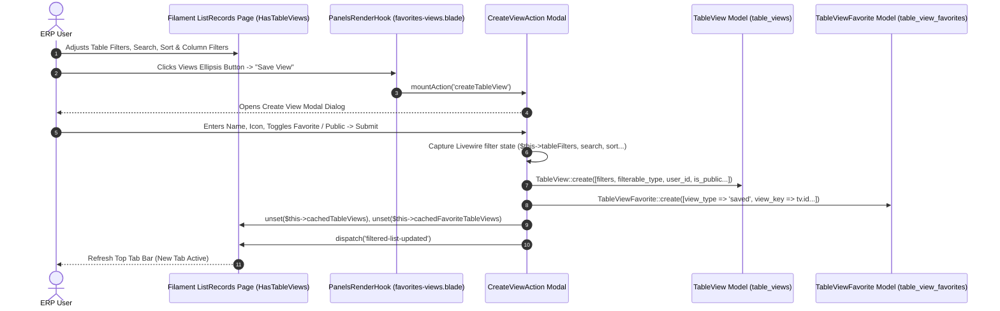
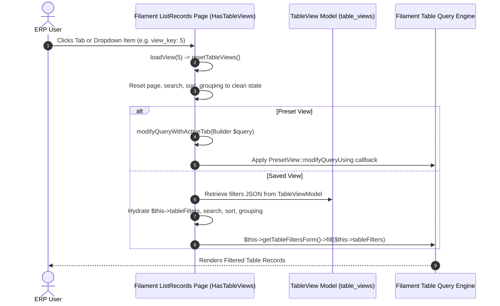

# Plugin: Table Views (`table-views`)

## Status
[VERIFIED]
Active Core Module. Registered explicitly in `bootstrap/providers.php:67` as `Webkul\TableViews\TableViewsServiceProvider::class`.

## Core/Optional
[VERIFIED]
**Core Plugin**. Configured via `$package->isCore()` within `TableViewsServiceProvider::configureCustomPackage()` (`plugins/webkul/table-views/src/TableViewsServiceProvider.php:22`).

## Enabled/Disabled
[VERIFIED]
**Always Enabled (Core Infrastructure)**. Core plugin status causes `PackageServiceProvider::boot()` to bypass database installation checks (`Package::isInstalled()`) when registering views, migrations, and assets (`plugins/webkul/plugin-manager/src/PackageServiceProvider.php:131-135, 202`). The render hooks and asset registrations execute unconditionally at boot time once registered in `bootstrap/providers.php`.

## Purpose
[VERIFIED]
The `table-views` plugin provides a centralized Filament table personalization and filter persistence engine across Aureus ERP. It delivers:
1. **Top Tab Filtering Interface**: Injects dynamic tab bars above Filament list and related record tables (`PanelsRenderHook::RESOURCE_PAGES_LIST_RECORDS_TABLE_BEFORE` and `PanelsRenderHook::RESOURCE_PAGES_MANAGE_RELATED_RECORDS_TABLE_BEFORE`).
2. **Preset View Definitions**: Enables domain modules to declare hardcoded or developer-defined query filters as preset tabs (via `PresetView` extending Filament `Tab`).
3. **User-Customized Saved Views**: Allows authenticated users to save active table filters, search terms, column searches, groupings, sort orders, and page sizes into persistent database records (`table_views`).
4. **Favorites Management & Quick Access**: Enables users to star/favorite preset and saved views (`table_view_favorites`), elevating frequently used filters directly into the top tab bar for immediate 1-click execution.
5. **View Sharing**: Supports public/shared views (`is_public = true`) enabling teams to share standard operational filters while preserving private user-scoped views.
6. **Dynamic View Lifecycle Operations**: Provides interactive modal actions to create, apply, edit, favorite, replace (update filter state), reset, and delete saved views.

## Service Provider
[VERIFIED]
- **Class**: `Webkul\TableViews\TableViewsServiceProvider` (`plugins/webkul/table-views/src/TableViewsServiceProvider.php:13`)
- **Inheritance**: Extends `Webkul\PluginManager\PackageServiceProvider`
- **Registration & Configuration**:
  - `configureCustomPackage(Package $package)`:
    - Sets package name to `'table-views'` (`$package->name(static::$name)`)
    - Declares package as core (`$package->isCore()`)
    - Enables views (`$package->hasViews()`) with view namespace `'table-views'`
    - Enables translations (`$package->hasTranslations()`)
    - Registers migrations (`$package->hasMigrations(['2024_11_19_142134_create_table_views_table', '2024_11_21_142134_create_table_view_favorites_table'])`)
    - Runs migrations (`$package->runsMigrations()`)
  - `packageRegistered()`:
    - Registers two global Filament panel render hooks via `FilamentView::registerRenderHook()` (`plugins/webkul/table-views/src/TableViewsServiceProvider.php:37-48`):
      1. `PanelsRenderHook::RESOURCE_PAGES_LIST_RECORDS_TABLE_BEFORE`: Injects `view('table-views::filament.resources.pages.list-records.favorites-views')`.
      2. `PanelsRenderHook::RESOURCE_PAGES_MANAGE_RELATED_RECORDS_TABLE_BEFORE`: Injects `view('table-views::filament.resources.pages.list-records.favorites-views')`.
  - `packageBooted()`:
    - Invokes `registerCustomCss()` (`plugins/webkul/table-views/src/TableViewsServiceProvider.php:32-35, 50-55`).
    - Registers compiled stylesheet via `FilamentAsset::register([Css::make('table-views', __DIR__.'/../resources/dist/table-views.css')], 'table-views')`.

## Filament Plugin class
[NOT APPLICABLE]
- **Confirmed Exception**: The `table-views` plugin does **not** define a `*Plugin.php` class (e.g. `TableViewsPlugin`).
- Instead of using a Filament Plugin contract, render hooks and asset registrations are wired directly through Laravel service provider lifecycle methods (`TableViewsServiceProvider::packageRegistered()` and `TableViewsServiceProvider::packageBooted()`). This architecture allows table view tabs to automatically attach to any Filament panel (`admin` or `customer`) and any page consuming the `HasTableViews` concern without explicit panel-level plugin registration.

## Composer dependencies
[VERIFIED]
- **Local Package Definition**: `plugins/webkul/table-views/composer.json`
  - Name: `webkul/table-views`
  - Autoload PSR-4: `Webkul\TableViews\` -> `src/`, `Webkul\TableViews\Database\Factories\` -> `database/factories/`, `Webkul\TableViews\Database\Seeders\` -> `database/seeders/`
  - Autoload-dev PSR-4: `Webkul\TableViews\Tests\` -> `tests/`
  - Extra Laravel Providers: `Webkul\TableViews\TableViewsServiceProvider`
- **External Dependencies Consumed via Root Composer** (`composer.lock`):
  - `filament/filament` (`v5.8.1`): Filament render hooks, tabs, forms, actions, notifications, and asset registration.
  - `guava/filament-icon-picker` (`2.1.2`): Icon picker component used in view creation/edit modals (`CreateViewAction`, `EditViewAction`).
  - `livewire/livewire` (`v4.4.5`): Component state hydration, URL query sync (`#[Url]`), and live event dispatching.
- **Frontend Dependencies (`package.json`)**:
  - `tailwindcss` (`^3.4.15`), `postcss` (`^8.4.49`), `autoprefixer` (`^10.4.20`).

## Runtime plugin dependencies
[VERIFIED]
None (`—`). `TableViewsServiceProvider::configureCustomPackage()` does not declare any runtime plugin dependencies via `hasDependencies()`.

## Directory structure
[VERIFIED]
Full verified tree of `plugins/webkul/table-views/`:

```text
plugins/webkul/table-views/
├── .gitignore
├── composer.json
├── package.json
├── postcss.config.js
├── database/
│   ├── factories/
│   │   ├── TableViewFactory.php
│   │   └── TableViewFavoriteFactory.php
│   └── migrations/
│       ├── 2024_11_19_142134_create_table_views_table.php
│       └── 2024_11_21_142134_create_table_view_favorites_table.php
├── resources/
│   ├── css/
│   │   └── index.css
│   ├── dist/
│   │   └── table-views.css
│   ├── lang/
│   │   ├── ar/
│   │   │   ├── app.php
│   │   │   └── filament/
│   │   │       ├── actions/
│   │   │       │   ├── create-view.php
│   │   │       │   └── edit-view.php
│   │   │       └── concerns/
│   │   │           └── has-table-views.php
│   │   ├── en/
│   │   │   ├── app.php
│   │   │   └── filament/
│   │   │       ├── actions/
│   │   │       │   ├── create-view.php
│   │   │       │   └── edit-view.php
│   │   │       └── concerns/
│   │   │           └── has-table-views.php
│   │   ├── es/
│   │   ├── fr/
│   │   └── pt_BR/
│   └── views/
│       ├── components/
│       │   ├── tables/
│       │   │   └── table-views/
│       │   │       └── index.blade.php
│       │   └── tabs/
│       │       └── item.blade.php
│       └── filament/
│           └── resources/
│               └── pages/
│                   └── list-records/
│                       └── favorites-views.blade.php
└── src/
    ├── TableViewsServiceProvider.php
    ├── Filament/
    │   ├── Actions/
    │   │   ├── CreateViewAction.php
    │   │   └── EditViewAction.php
    │   ├── Components/
    │   │   ├── PresetView.php
    │   │   └── SavedView.php
    │   └── Concerns/
    │       └── HasTableViews.php
    ├── Models/
    │   ├── TableView.php
    │   └── TableViewFavorite.php
    └── Policies/
        └── TableViewPolicy.php
```

## Models
[VERIFIED]

### 1. `Webkul\TableViews\Models\TableView`
- **Class**: `Webkul\TableViews\Models\TableView` (`plugins/webkul/table-views/src/Models/TableView.php:8`)
- **Table**: `table_views`
- **Fillable Attributes**: `name`, `icon`, `color`, `is_public`, `filters`, `filterable_type`, `user_id`
- **Casts**:
  - `filters` => `'array'`
- **Company Scoping**: Via User. Not multi-company scoped directly; scoped to the owning user (`user_id`) or publicly available within the system (`is_public = true`).
- **Relationships**:
  - `user()`: `BelongsTo` -> `Webkul\Security\Models\User` (`foreign_key: user_id`, cascade on delete).

### 2. `Webkul\TableViews\Models\TableViewFavorite`
- **Class**: `Webkul\TableViews\Models\TableViewFavorite` (`plugins/webkul/table-views/src/Models/TableViewFavorite.php:8`)
- **Table**: `table_view_favorites`
- **Fillable Attributes**: `is_favorite`, `view_type`, `view_key`, `filterable_type`, `user_id`
- **Company Scoping**: Via User. Scoped to the owning user (`user_id`).
- **Relationships**:
  - `user()`: `BelongsTo` -> `Webkul\Security\Models\User` (`foreign_key: user_id`, cascade on delete).

## Database
[VERIFIED]

### Migrations Inventory
1. `2024_11_19_142134_create_table_views_table.php` (`plugins/webkul/table-views/database/migrations/2024_11_19_142134_create_table_views_table.php`):
   - Creates table `table_views`.
2. `2024_11_21_142134_create_table_view_favorites_table.php` (`plugins/webkul/table-views/database/migrations/2024_11_21_142134_create_table_view_favorites_table.php`):
   - Creates table `table_view_favorites`.

### Database Schema Table Definitions

```
┌─────────────────────────────────────────────────────────────────────────────┐
│                                 table_views                                 │
├───────────────────┬──────────────────────┬──────────┬───────────────────────┤
│ Column            │ Type                 │ Nullable │ Constraints / Indices │
├───────────────────┼──────────────────────┼──────────┼───────────────────────┤
│ id                │ unsignedBigInteger   │ NO       │ PK, Auto-Increment    │
│ name              │ varchar(255)         │ NO       │                       │
│ icon              │ varchar(255)         │ YES      │                       │
│ color             │ varchar(255)         │ YES      │                       │
│ is_public         │ tinyint(1) (boolean) │ NO       │ Default: 0            │
│ filters           │ json                 │ YES      │ JSON filter payload   │
│ filterable_type   │ varchar(255)         │ NO       │ Target page class     │
│ user_id           │ unsignedBigInteger   │ NO       │ FK -> users.id,       │
│                   │                      │          │ cascadeOnDelete       │
│ created_at        │ timestamp            │ YES      │                       │
│ updated_at        │ timestamp            │ YES      │                       │
└───────────────────┴──────────────────────┴──────────┴───────────────────────┘

┌─────────────────────────────────────────────────────────────────────────────┐
│                            table_view_favorites                             │
├───────────────────┬──────────────────────┬──────────┬───────────────────────┤
│ Column            │ Type                 │ Nullable │ Constraints / Indices │
├───────────────────┼──────────────────────┼──────────┼───────────────────────┤
│ id                │ unsignedBigInteger   │ NO       │ PK, Auto-Increment    │
│ is_favorite       │ tinyint(1) (boolean) │ NO       │ Default: 1            │
│ view_type         │ varchar(255)         │ NO       │ 'preset' | 'saved'    │
│ view_key          │ varchar(255)         │ NO       │ Tab key or view id    │
│ filterable_type   │ varchar(255)         │ NO       │ Target page class     │
│ user_id           │ unsignedBigInteger   │ NO       │ FK -> users.id,       │
│                   │                      │          │ cascadeOnDelete       │
│ created_at        │ timestamp            │ YES      │                       │
│ updated_at        │ timestamp            │ YES      │                       │
├───────────────────┴──────────────────────┴──────────┴───────────────────────┤
│ UNIQUE KEY tbl_view_fav_unique (view_type, view_key, filterable_type,       │
│                                 user_id)                                    │
└─────────────────────────────────────────────────────────────────────────────┘
```

## Filament resources/pages/widgets/clusters
[VERIFIED]

### Resources
[NOT APPLICABLE] No Filament resources are defined in `table-views`.

### Pages
[NOT APPLICABLE] No standalone Filament pages are defined in `table-views`.

### Clusters
[NOT APPLICABLE] No Filament clusters are defined in `table-views`.

### Widgets
[NOT APPLICABLE] No Filament widgets are defined in `table-views`.

### Core Trait: `HasTableViews`
- **Class**: `Webkul\TableViews\Filament\Concerns\HasTableViews` (`plugins/webkul/table-views/src/Filament/Concerns/HasTableViews.php:20`)
- **Purpose**: Provides full Livewire lifecycle state, view discovery, filter application, and action routing to any Filament `ListRecords` or `ManageRelatedRecords` page.
- **State & Properties**:
  - `#[Url] public ?string $activeTableView = null`: Tracks the active view key in the URL query string (`?activeTableView=...`).
  - `protected array $cachedTableViews`: In-memory cache of saved views for the current page and user.
  - `protected array $cachedFavoriteTableViews`: In-memory cache of favorited preset and saved views.
  - `protected string|Closure|null $tableViewsFormMaxHeight = '500px'`: Dropdown menu height.
  - `protected Width|string|Closure|null $tableViewsFormWidth = null`: Dropdown menu width (defaults to `Width::ExtraSmall`).
- **Core Lifecycle Methods**:
  - `bootedInteractsWithTable()`: Calls `loadDefaultActiveTableView()`.
  - `loadDefaultActiveTableView()`: Sets default active view on first mount and applies filters if `activeTableView` is present in query parameters.
  - `loadView($tabKey)`: Resets table state (`resetTableViews()`), updates `activeTableView`, and executes `applyTableViewFilters()`.
  - `resetTableViews()`: Resets Livewire pagination (`resetPage()`), search (`resetTableSearch()`), sort (`resetTableSort()`), grouping (`resetTableGrouping()`), and reverts active view to default.
  - `applyTableViewFilters()`: Hydrates `$this->tableFilters`, `$this->tableGrouping`, `$this->tableSearch`, `$this->tableColumnSearches`, `$this->tableSort`, and `$this->tableRecordsPerPage` from the stored JSON payload, then invokes `$this->getTableFiltersForm()->fill($this->tableFilters)`.
  - `modifyQueryWithActiveTab(Builder $query, bool $isResolvingRecord = false)`: Evaluates query modifier callbacks registered on the active `PresetView` or `SavedView`.
  - `isActiveTableViewModified()`: Checks whether the current table filter/search/sort state diverges from the active `SavedView` definition.
- **Actions Defined in Trait**:
  - `getTableViewsTriggerAction()`: Returns ellipsis icon button triggering the views dropdown.
  - `createTableViewAction()`: Invokes `CreateViewAction` modal to persist new view and auto-favorite it.
  - `resetTableViewAction()`: Clears active filters and restores default state.
  - `applyTableViewAction()`: Applies view by `view_key` and `view_type`.
  - `addTableViewToFavoritesAction()`: Inserts/updates `table_view_favorites` with `is_favorite = true`.
  - `removeTableViewFromFavoritesAction()`: Inserts/updates `table_view_favorites` with `is_favorite = false`.
  - `editTableViewAction()`: Invokes `EditViewAction` modal to update view metadata.
  - `deleteTableViewAction()`: Deletes record from `table_views` and associated favorites in `table_view_favorites`.
  - `replaceTableViewAction()`: Overwrites stored filter JSON in `table_views` with the current table filter state.
  - `getTableViewActionGroup($key, $type, $tableView)`: Generates contextual dropdown action menu for individual view entries.

### Components
[VERIFIED]

1. **`Webkul\TableViews\Filament\Components\PresetView`** (`plugins/webkul/table-views/src/Filament/Components/PresetView.php:10`):
   - Extends `Filament\Schemas\Components\Tabs\Tab`.
   - Represents a code-defined preset filter tab in a domain `ListRecords` page.
   - Fluent Configuration: `color()`, `favorite()`, `setAsDefault()`, `modifyQueryUsing(Closure)`.
   - Immutable via UI: `isEditable() = false`, `isReplaceable() = false`, `isDeletable() = false`.
   - Visibility Icon: `heroicon-o-lock-closed`.
   - Favorite Evaluation: Queries cached `table_view_favorites` records matching `view_type = 'preset'` and `view_key = $id`.

2. **`Webkul\TableViews\Filament\Components\SavedView`** (`plugins/webkul/table-views/src/Filament/Components/SavedView.php:9`):
   - Extends `PresetView`.
   - Represents a user-saved or public filter configuration persisted in the `table_views` database table.
   - Binds `TableView` Eloquent record via `model()`.
   - Ownership & Permission Gates: `isEditable()`, `isReplaceable()`, and `isDeletable()` return `true` if `$this->getRecord()->user_id === Auth::id()`.
   - Visibility Icon: Returns `heroicon-o-eye` if `is_public = true`, else `heroicon-o-user`.
   - Favorite Evaluation: Queries cached `table_view_favorites` records matching `view_type = 'saved'` and `view_key = $model->id`.

### Specialized Actions
[VERIFIED]

1. **`Webkul\TableViews\Filament\Actions\CreateViewAction`** (`plugins/webkul/table-views/src/Filament/Actions/CreateViewAction.php:15`):
   - Extends `Filament\Actions\Action`.
   - Modal Form Schema: `name` (`TextInput`, required), `icon` (`IconPicker`), `is_favorite` (`Toggle`), `is_public` (`Toggle`).
   - Persists `TableView` model with active filters payload and creates initial `TableViewFavorite` record.
   - Dispatches Livewire event `'filtered-list-updated'` and sets `$this->activeTableView = $record->id`.

2. **`Webkul\TableViews\Filament\Actions\EditViewAction`** (`plugins/webkul/table-views/src/Filament/Actions/EditViewAction.php:15`):
   - Extends `Filament\Actions\Action`.
   - Pre-fills form with existing `TableView` and `TableViewFavorite` data for `view_key`.
   - Updates `name`, `color`, `icon`, `is_public`, and `is_favorite`.
   - Invalidates `$this->cachedTableViews` and `$this->cachedFavoriteTableViews`.

## Panels
[VERIFIED]
- **Universal Panel Participation**: `table-views` does not bind to specific panel IDs. Because render hooks are registered globally via `FilamentView::registerRenderHook()`, table views seamlessly execute in both **`admin`** and **`customer`** panels (`app/Providers/Filament/AdminPanelProvider.php`, `app/Providers/Filament/CustomerPanelProvider.php`) on any page incorporating the `HasTableViews` trait.

## Services (Render Hook Mechanism & View State Management)
[VERIFIED]

### Render Hook Architecture
The plugin operates entirely via Filament render hooks registered during service provider registration:

```
┌─────────────────────────────────────────────────────────────────────────────┐
│                       Filament Render Hook Engine                           │
└──────────────────────────────────────┬──────────────────────────────────────┘
                                       │
            ┌──────────────────────────┴──────────────────────────┐
            ▼                                                     ▼
┌──────────────────────────────────────┐        ┌──────────────────────────────────────┐
│  PanelsRenderHook::                  │        │  PanelsRenderHook::                  │
│  RESOURCE_PAGES_LIST_RECORDS_TABLE_  │        │  RESOURCE_PAGES_MANAGE_RELATED_      │
│  BEFORE                              │        │  RECORDS_TABLE_BEFORE                │
├──────────────────────────────────────┤        ├──────────────────────────────────────┤
│ Injects Blade View:                  │        │ Injects Blade View:                  │
│ table-views::filament.resources.     │        │ table-views::filament.resources.     │
│ pages.list-records.favorites-views   │        │ pages.list-records.favorites-views   │
└──────────────────────────────────────┘        └──────────────────────────────────────┘
                                       │
                                       ▼
┌─────────────────────────────────────────────────────────────────────────────┐
│ Evaluation Check:                                                           │
│ @if (method_exists($this, 'getCachedFavoriteTableViews') && count($tabs))   │
└──────────────────────────────────────┬──────────────────────────────────────┘
                                       │
                    ┌──────────────────┴──────────────────┐
                    ▼                                     ▼
        [Page uses HasTableViews]             [Page does not use trait]
                    │                                     │
                    ▼                                     ▼
      Renders Tabs Bar + Views Menu                 Renders Nothing
```

### UI Injection Details
When injected into a page using `HasTableViews`:
1. **Favorite Tabs Bar (`<x-filament::tabs>`)**: Iterates through `$this->getCachedFavoriteTableViews()` (which always contains the `'default'` tab plus any favorited presets or saved views). Clicking a tab invokes `$wire.loadView(tabKey)`.
2. **Views Trigger Dropdown (`<x-filament::dropdown>`)**: Renders an ellipsis icon button next to the tabs.
3. **Dropdown Menu (`<x-table-views::tables.table-views>`)**: Organizes views into three distinct groups:
   - **Favorite Views**: All currently favorited preset and saved views.
   - **Saved Views**: User-saved or shared views not currently in favorites.
   - **Preset Views**: Developer-defined preset views not currently in favorites.
4. **Contextual Action Group**: Each item in the dropdown exposes actions to apply the view, toggle favorite status, edit metadata, update/replace saved filters with current live state, or delete the view.
5. **CSS Isolation**: Pushes inline styles (`.fi-ta-ctn { border-top-left-radius: 0; border-top-right-radius: 0; }`) to seamlessly merge the tabs header with the Filament table container below.

## Events
[VERIFIED]
1. **`filtered-list-updated`** (Livewire Browser Event):
   - Dispatched by `HasTableViews::createTableViewAction()` after creating a new saved view (`$this->dispatch('filtered-list-updated')`).
   - Listened to by the tabs component (`wire:listen="filtered-list-updated"`) in `favorites-views.blade.php:17` to trigger reactive re-rendering of the top tab bar.

## Listeners
[NOT APPLICABLE]
No Laravel event listeners are defined in `table-views`.

## Observers
[NOT APPLICABLE]
No Eloquent model observers are defined in `table-views`.

## Policies
[VERIFIED]

### 1. `Webkul\TableViews\Policies\TableViewPolicy`
- **Class**: `Webkul\TableViews\Policies\TableViewPolicy` (`plugins/webkul/table-views/src/Policies/TableViewPolicy.php:9`)
- **Permissions Mapped**:
  - `viewAny` -> `'view_any_table_view'`
  - `view` -> `'view_table_view'`
  - `create` -> `'create_table_view'`
  - `update` -> `'update_table_view'`
  - `delete` -> `'delete_table_view'`
  - `deleteAny` -> `'delete_any_table_view'`
  - `forceDelete` -> `'force_delete_table_view'`
  - `forceDeleteAny` -> `'force_delete_any_table_view'`
  - `restore` -> `'restore_table_view'`
  - `restoreAny` -> `'restore_any_table_view'`
  - `replicate` -> `'replicate_table_view'`
  - `reorder` -> `'reorder_table_view'`
- **Authorization Implementation Nuance**: Although `TableViewPolicy` declares standard Shield permissions, the interactive Livewire actions (`CreateViewAction`, `EditViewAction`, `deleteTableViewAction`, `replaceTableViewAction`) perform direct model queries and verify ownership inline via `$record->user_id === Auth::id()` or UI action visibility rules rather than invoking Laravel `Gate::authorize()` or `$user->can()` on policy methods.

## Routes
[NOT APPLICABLE]
No HTTP web or API route files are defined or registered by `table-views`.

## Settings
[NOT APPLICABLE]
No plugin-specific settings schema exists under `database/settings/`.

## Translations
[VERIFIED]
- **Registered Languages**: `ar`, `en`, `es`, `fr`, `pt_BR` under `resources/lang/`.
- **Translation Keys**:
  - `table-views::app.views.component.tables.table-views.*`: Dropdown headings, group labels (`title`, `favorite-views`, `saved-views`, `preset-views`).
  - `table-views::filament/actions/create-view.*`: Create modal labels, field placeholders, help texts, and notifications.
  - `table-views::filament/actions/edit-view.*`: Edit modal labels, field placeholders, help texts, and notifications.
  - `table-views::filament/concerns/has-table-views.*`: Core action button labels (`title`, `reset`, `default`, `apply-view`, `add-to-favorites`, `remove-from-favorites`, `delete-view`, `replace-view`).

## Tests
[VERIFIED]
- **Explicit Test Coverage Status**: The `table-views` plugin contains **zero test files** (0 unit tests, 0 feature tests under `plugins/webkul/table-views/tests/`). Although `composer.json` declares an `autoload-dev` mapping for `Webkul\TableViews\Tests\` to `tests/`, no `tests/` directory exists on disk.
- **Repository Integration Test Coverage**: Only 1 test in the entire repository references table-view methods:
  - `plugins/webkul/inventories/tests/Feature/Filament/QuantityResourceTest.php:82-97` asserts that `ManageQuantities::getPresetTableViews()` returns expected preset keys (`internal_locations`, `transit_locations`, `on_hand`, `to_count`, `to_apply`).

## Runtime dependencies
[VERIFIED]
None (`—`).

## Cross-plugin relationships
[VERIFIED]

The `table-views` plugin is consumed across **18 distinct domain plugins** in Aureus ERP. It powers list filtering across core and optional business modules:

```
┌─────────────────────────────────────────────────────────────────────────────┐
│                                table-views                                  │
│                (HasTableViews, PresetView, SavedView)                       │
└──────────────────────────────────────┬──────────────────────────────────────┘
                                       │
        ┌──────────────────────────────┼──────────────────────────────┐
        ▼                              ▼                              ▼
┌──────────────────┐         ┌──────────────────┐         ┌──────────────────┐
│   Core Modules   │         │ Operations/Sales │         │ Finance/HR/Other │
├──────────────────┤         ├──────────────────┤         ├──────────────────┤
│ • partners       │         │ • sales          │         │ • accounts       │
│ • support        │         │ • purchases      │         │ • accounting     │
│                  │         │ • inventories    │         │ • invoices       │
│                  │         │ • manufacturing  │         │ • employees      │
│                  │         │ • maintenance    │         │ • recruitments   │
│                  │         │ • projects       │         │ • time-off       │
│                  │         │ • timesheets     │         │ • website        │
│                  │         │                  │         │ • blogs          │
│                  │         │                  │         │ • products       │
└──────────────────┘         └──────────────────┘         └──────────────────┘
```

### Verified Plugin Consumers Inventory
[VERIFIED — repository snapshot]
At the time of verification, 18 plugins consume `HasTableViews` across their administrative and customer list pages:

| Plugin | Consuming Page Classes | Sample Preset Views Declared |
|:---|:---|:---|
| **`partners`** (Core) | `ListPartners` | `individuals`, `companies`, `archived` |
| **`support`** (Core) | `AbstractSchemaRegistry`, `SchemaRegistry` | Extensibility hook: `SchemaRegistry::renderPresetViews()` |
| **`sales`** (Optional) | `ListQuotations`, `ListOrders`, `ListOrderToInvoices`, `ListOrderToUpsells` | `quotations`, `orders`, `to_invoice`, `upsell` |
| **`purchases`** (Optional) | `ListOrders`, `ListPurchaseAgreements`, `ListPurchaseOrders` | `rfq`, `purchase_orders`, `agreements` |
| **`products`** (Optional) | `ListProducts` | `goods`, `services`, `combo`, `archived` |
| **`inventories`** (Optional) | `ListDeliveries`, `ListDropships`, `ListInternals`, `ManageQuantities`, `ListReceipts`, `ManageReplenishment`, `ListScraps`, `ListLots`, `ListPackages`, `ManageOperations`, `ManageMoves` (13 pages total) | `internal_locations`, `transit_locations`, `on_hand`, `to_count`, `to_apply`, `ready`, `waiting`, `done` |
| **`manufacturing`** (Optional) | `ListManufacturingOrders`, `ListWorkOrders` | `to_do`, `in_progress`, `done`, `cancelled` |
| **`maintenance`** (Optional) | `ListEquipment`, `ListMaintenanceRequests` | `my_requests`, `to_do`, `in_progress`, `repaired`, `scrapped` |
| **`projects`** (Optional) | `ListProjects`, `ManageTasks`, `ListTasks` | `open_tasks`, `my_tasks`, `unassigned_tasks`, `closed_tasks` |
| **`timesheets`** (Optional) | `ManageTimesheets` | `my_timesheets`, `all_timesheets`, `approved`, `pending` |
| **`accounts`** (Optional) | `ManageAccounts`, `ListInvoices`, `ListPayments`, `ListTaxes` | `posted`, `draft`, `unpaid`, `customer_invoices`, `vendor_bills` |
| **`accounting`** (Optional) | `ListJournalEntries`, `ListJournalItems`, `ListPayments` (Customer & Vendor) | `posted_entries`, `draft_entries`, `customer_payments`, `vendor_payments` |
| **`invoices`** (Optional) | `ListRefunds`, `ListPayments` (Customer & Vendor) | `draft`, `posted`, `cancelled`, `refunds` |
| **`employees`** (Optional) | `ListEmployees`, `ListDepartments`, `ListJobPositions`, `ListEmployeeSkills` | `active`, `archived`, `management`, `departments` |
| **`recruitments`** (Optional) | `ListApplicants`, `ListCandidates` | `open_applications`, `hired`, `refused`, `candidates` |
| **`time-off`** (Optional) | `ListTimeOff`, `ListAllocations` | `my_time_off`, `to_approve`, `approved`, `second_approval` |
| **`website`** (Optional) | `ListPages` | `published`, `draft`, `archived` |
| **`blogs`** (Optional) | `ListPosts` | `published`, `draft`, `pending` |

### Non-Consuming Plugins
The following 10 plugins do not consume `HasTableViews`: `analytics` (dashboard widgets), `chatter` (collaboration panel), `fields` (custom fields schema), `full-calendar` (calendar views), `plugin-manager` (console management), `security` (user/role tables use standard Filament views), `barcode` (scanner overlay), `contacts` (lightweight partner alias), `payments` (backend payment drivers).

## Data flow
[VERIFIED]

### Saved View Creation & Persistence Flow


### View Application & Filter Hydration Flow


## Business rules
[VERIFIED]
1. **Polymorphic Model Target Binding**:
   - `filterable_type` stores the fully qualified class name of the target page (e.g. `Webkul\Partner\Filament\Resources\PartnerResource\Pages\ListPartners`).
   - Saved views are strictly segregated by `filterable_type`, preventing views created for one resource from leaking into another.
2. **Access Control & View Visibility**:
   - Private views (`is_public = false`) are visible only to the owning user (`user_id = Auth::id()`).
   - Public views (`is_public = true`) are visible to all users visiting that page.
   - Preset views (`PresetView`) are hardcoded in PHP and visible to all users.
3. **Modification & Deletion Authorization**:
   - Preset views are permanently locked (`isEditable() = false`, `isReplaceable() = false`, `isDeletable() = false`).
   - Saved views can only be modified, replaced, or deleted by their creator (`user_id === Auth::id()`).
4. **Favorite Persistence & Per-User Customization**:
   - Favorite state is stored per-user in `table_view_favorites` keyed by `(view_type, view_key, filterable_type, user_id)`.
   - Different users can independently favorite or unfavorite the same public saved view or code preset without affecting other users.
5. **Default Tab Behavior**:
   - The top tab bar always contains a default tab (`PresetView::make('default')`) using icon `'heroicon-m-queue-list'`.
   - When no specific view is requested in the URL query string (`$activeTableView`), the system falls back to the default view or the first favorited view.
6. **Livewire Filter Serialization**:
   - Saved views snapshot six distinct table state properties: `tableFilters`, `tableGrouping`, `tableSearch`, `tableColumnSearches`, `tableSort`, and `tableRecordsPerPage`.

## Extension points
[VERIFIED]
1. **Adopting Table Views in Custom Pages**:
   - Any Filament `ListRecords` or `ManageRelatedRecords` page can enable table view personalization by adding `use HasTableViews;`.
2. **Declaring Custom Preset Views**:
   - Page classes override `getPresetTableViews(): array` returning an array of `PresetView::make('key')->label(...)->icon(...)->modifyQueryUsing(fn (Builder $query) => ...)->favorite()`.
3. **Extensibility Hook via SchemaRegistry**:
   - `Webkul\Support\Filament\Contributions\SchemaRegistry::renderPresetViews(string $scope, mixed ...$args)` allows third-party plugins to dynamically register preset views into existing pages.
4. **Customizing Views Dropdown Dimensions**:
   - Page classes can customize the dropdown popup dimensions via `setTableViewsFormMaxHeight('600px')` and `setTableViewsFormWidth(Width::Medium)`.

## Dangerous areas
[VERIFIED]
1. **Zero Automated Test Coverage**:
   - **Critical Fact**: `plugins/webkul/table-views/` contains **0 test files**. No unit tests or feature tests exist for `HasTableViews`, `CreateViewAction`, `EditViewAction`, `PresetView`, `SavedView`, or filter serialization/deserialization.
   - Any regression in Livewire table state hydration, query modification, or favorites management cannot be caught by CI.
2. **Factory PSR-4 Namespace Mismatch**:
   - `TableViewFactory` (`plugins/webkul/table-views/database/factories/TableViewFactory.php:3`) and `TableViewFavoriteFactory` (`plugins/webkul/table-views/database/factories/TableViewFavoriteFactory.php:3`) declare namespace `Webkul\TableView\Database\Factories;` (singular `TableView`).
   - `composer.json` declares PSR-4 mapping `Webkul\TableViews\Database\Factories\` -> `database/factories/` (plural `TableViews`).
   - Executing `TableView::factory()` or `TableViewFavorite::factory()` fails standard class autoloading unless manually aliased or called via explicit class paths.
3. **Missing Server-Side Policy Checks on Direct Livewire Actions**:
   - `deleteTableViewAction()` (`plugins/webkul/table-views/src/Filament/Concerns/HasTableViews.php:410`) and `replaceTableViewAction()` (`plugins/webkul/table-views/src/Filament/Concerns/HasTableViews.php:431`) execute `TableViewModel::find($arguments['view_key'])->delete()` and `update()` directly based on user-supplied arguments without calling `Gate::authorize()` or verifying `$tableView->user_id === Auth::id()` inside the action execution closure.
   - Authorization relies exclusively on UI action visibility (`visible(fn () => ...)`). If action execution requests are crafted directly to the Livewire endpoint with altered `view_key` parameters, server-side ownership validation could be bypassed.
4. **Tight Class Name Coupling in `filterable_type`**:
   - `filterable_type` stores the exact PHP class string (e.g. `Webkul\Sales\Filament\Clusters\Orders\Resources\OrderResource\Pages\ListOrders`).
   - If a Filament resource or page class is renamed, reorganized into a cluster, or refactored, existing saved views in the database become permanently detached from the new class name.
5. **Raw Property Serialization Fragility**:
   - Filter state is stored as a raw associative array snapshot of Livewire component properties (`tableFilters`, `tableColumnSearches`, `tableSort`).
   - If a domain resource removes, renames, or modifies a table filter component, restoring legacy saved views may cause unexpected Livewire errors or corrupt table query state.

## Change impact
[VERIFIED]
- **Architectural Scope**: **High UI Impact / Medium Database Layer**.
- **Blast Radius**: Affects **18 domain plugins** and dozens of `ListRecords` / `ManageRelatedRecords` pages across the entire ERP platform.
- **Database Schema Impact**: Owns 2 tables (`table_views`, `table_view_favorites`).
- **Security Impact**: Governs visibility of saved queries across users and teams via user scoping and `is_public` flags.

---

## Evidence Index

| Evidence ID | Source File | Symbol / Method | Purpose / Claim Verified |
|---|---|---|---|
| **E-001** | `plugins/webkul/table-views/src/TableViewsServiceProvider.php` | `TableViewsServiceProvider::configureCustomPackage()` | Core flag, package name, views, translations, and migrations registration |
| **E-002** | `plugins/webkul/table-views/src/TableViewsServiceProvider.php` | `TableViewsServiceProvider::packageRegistered()` | Registration of render hooks for list records and manage related records tables |
| **E-003** | `plugins/webkul/table-views/src/TableViewsServiceProvider.php` | `TableViewsServiceProvider::registerCustomCss()` | Registration of `table-views.css` asset |
| **E-004** | `plugins/webkul/table-views/src/Models/TableView.php` | `TableView` | Model definition, fillable fields, array cast for `filters`, user relationship |
| **E-005** | `plugins/webkul/table-views/src/Models/TableViewFavorite.php` | `TableViewFavorite` | Favorite model definition, fillable fields, user relationship |
| **E-006** | `plugins/webkul/table-views/database/migrations/2024_11_19_142134_create_table_views_table.php` | `Schema::create('table_views', ...)` | Table schema, user foreign key cascade, json filters column |
| **E-007** | `plugins/webkul/table-views/database/migrations/2024_11_21_142134_create_table_view_favorites_table.php` | `Schema::create('table_view_favorites', ...)` | Table schema, unique constraint `tbl_view_fav_unique` |
| **E-008** | `plugins/webkul/table-views/src/Filament/Concerns/HasTableViews.php` | `HasTableViews` | Primary Livewire trait, active view management, filter hydration, action handlers |
| **E-009** | `plugins/webkul/table-views/src/Filament/Components/PresetView.php` | `PresetView` | Code preset tab component extending Filament `Tab` |
| **E-010** | `plugins/webkul/table-views/src/Filament/Components/SavedView.php` | `SavedView` | User saved view component extending `PresetView`, ownership methods |
| **E-011** | `plugins/webkul/table-views/src/Filament/Actions/CreateViewAction.php` | `CreateViewAction::setUp()` | Modal form schema, view creation, favorite record persistence |
| **E-012** | `plugins/webkul/table-views/src/Filament/Actions/EditViewAction.php` | `EditViewAction::setUp()` | Modal form schema, view update, favorite update |
| **E-013** | `plugins/webkul/table-views/src/Policies/TableViewPolicy.php` | `TableViewPolicy` | Policy permissions definition for Shield compatibility |
| **E-014** | `plugins/webkul/table-views/database/factories/TableViewFactory.php` | `TableViewFactory` | Factory states, namespace typo `Webkul\TableView` |
| **E-015** | `plugins/webkul/table-views/database/factories/TableViewFavoriteFactory.php` | `TableViewFavoriteFactory` | Factory states, namespace typo `Webkul\TableView` |
| **E-016** | `plugins/webkul/table-views/resources/views/filament/resources/pages/list-records/favorites-views.blade.php` | Blade View | Injected top tab bar, trigger action, dropdown container, style overrides |
| **E-017** | `plugins/webkul/table-views/resources/views/components/tables/table-views/index.blade.php` | Blade Component | Views dropdown content, grouping by favorite/saved/preset, action wiring |
| **E-018** | `plugins/webkul/table-views/resources/views/components/tabs/item.blade.php` | Blade Component | Custom tab item view supporting icons, badges, and Alpine active states |
| **E-019** | `plugins/webkul/table-views/composer.json` | Composer Metadata | PSR-4 autoloading definitions and Laravel provider declaration |
| **E-020** | `bootstrap/providers.php` | Line 67 | Registration of `TableViewsServiceProvider` |
| **E-021** | `plugins/webkul/partners/src/Filament/Resources/PartnerResource/Pages/ListPartners.php` | `ListPartners` | Consumer example in core `partners` plugin |
| **E-022** | `plugins/webkul/support/src/Filament/Contributions/SchemaRegistry.php` | `SchemaRegistry::renderPresetViews()` | Consumer example in core `support` plugin |
| **E-023** | `plugins/webkul/inventories/tests/Feature/Filament/QuantityResourceTest.php` | Line 82-97 | Integration test verifying `getPresetTableViews()` |
| **E-024** | `docs/database/erds/core.md` | Lines 132-133, 584-585, 683-698 | Core ERD documentation of `table_views` and `table_view_favorites` |
