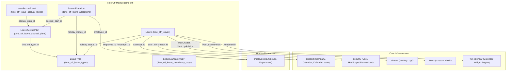
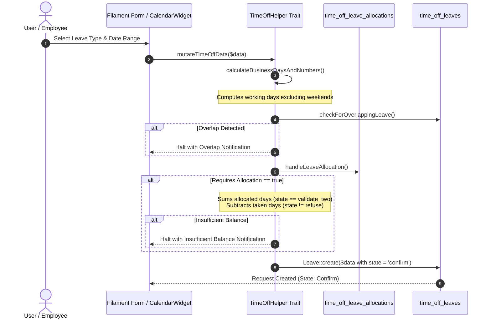
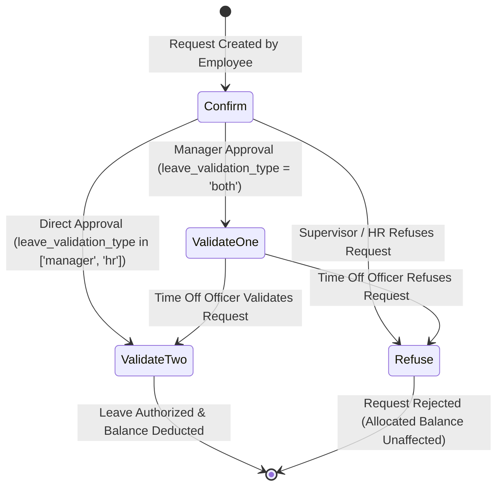

# Plugin: Time Off (`time-off`)

## Status
[VERIFIED]
Active Optional Module. Registered in `bootstrap/providers.php:62` as `Webkul\TimeOff\TimeOffServiceProvider::class`.

## Core/Optional
[VERIFIED]
**Optional Plugin**. Configured as an optional domain module without calling `$package->isCore()` (`plugins/webkul/time-off/src/TimeOffServiceProvider.php:20-52`). Execution and Filament UI component discovery are gated by runtime installation checks via `Package::isPluginInstalled('time-off')` (`plugins/webkul/time-off/src/TimeOffPlugin.php:24`).

## Enabled/Disabled
[VERIFIED]
**Conditionally Enabled (Database-Gated)**. `TimeOffServiceProvider` registers package migrations, translations, seeders, and Chatter cleanup handlers. Filament admin panel resources, clusters, pages, and widgets are discovered and registered only when `Package::isPluginInstalled('time-off')` returns true (`plugins/webkul/time-off/src/TimeOffPlugin.php:24-47`).

## Purpose
[VERIFIED]
The `time-off` module provides comprehensive employee leave and absence lifecycle tracking, leave entitlement allocation ledgers, tenure-based automated milestone accrual plan configurations, multi-tier supervisory approval workflows, working calendar synchronization, public holiday and mandatory working day management, and interactive calendar scheduling for Aureus ERP:

1. **Leave Request Management (`Leave`, `time_off_leaves`)**:
   - Manages personal and operational leave requests filed by or on behalf of employees.
   - Calculates effective business days vs. weekend days based on company working schedules (`calculateBusinessDays()`, `calculateTotalDays()` in `plugins/webkul/time-off/src/Traits/TimeOffHelper.php:346-366`).
   - Supports half-day leave increments (`request_unit_half`, morning/afternoon via `RequestDateFromPeriod`) and hourly leave intervals (`number_of_hours`).
   - Performs automated collision detection against existing approved or active leave records for the same employee (`checkForOverlappingLeave()` in `plugins/webkul/time-off/src/Traits/TimeOffHelper.php:368-389`).
   - Validates available allocation balances before allowing leave submission (`handleLeaveAllocation()` in `plugins/webkul/time-off/src/Traits/TimeOffHelper.php:274-344`).

2. **Leave Policy & Entitlement Types (`LeaveType`, `time_off_leave_types`)**:
   - Defines company leave policies (e.g., *Paid Time Off*, *Sick Time Off*, *Compensatory Days*, *Unpaid*, *Training Time Off*, *Parental Leaves*).
   - Configures validation rules (`leave_validation_type`: `no_validation`, `hr`, `manager`, `both`).
   - Governs allocation requirements (`requires_allocation`: `yes`/`no`), employee self-service allocation requests (`employee_requests`), and allocation approval rules (`allocation_validation_type`).
   - Supports negative balance caps (`allows_negative`, `max_allowed_negative`), public holiday exclusion (`include_public_holidays_in_duration`), document attachment requirements (`support_document`), and custom color assignments (`color`).
   - Maintains notification rosters for designated HR officers via `time_off_user_leave_types` junction.

3. **Leave Allocations Ledger (`LeaveAllocation`, `time_off_leave_allocations`)**:
   - Records granted time-off credit balances granted to individual employees.
   - Differentiates fixed manual allocations (`allocation_type = 'regular'`) from rule-based accruals (`allocation_type = 'accrual'`).
   - Tracks validity timeframes (`date_from`, `date_to`), carryover expiration windows (`carried_over_days_expiration_date`, `expiring_carryover_days`), and scheduled accrual execution timestamps (`last_called`, `actual_last_called`, `next_call`).

4. **Milestone Accrual Plans & Rules (`LeaveAccrualPlan`, `LeaveAccrualLevel`)**:
   - Encapsulates tenure-based, automated leave accumulation policies (`time_off_leave_accrual_plans`).
   - Defines tiered milestone levels (`time_off_leave_accrual_levels`) with progressive service thresholds (`start_count`, `start_type`: `days`, `months`, `years`).
   - Specifies flexible accrual frequencies (`daily`, `weekly`, `bimonthly`, `monthly`, `biyearly`, `yearly`), specific execution schedule anchor days, accrual gain timing (`start` vs. `end` of period), and level transition rules (`immediately` vs. `end_of_accrual`).
   - Enforces total accumulation caps (`maximum_leave`), annual earning caps (`maximum_leave_yearly`), and balance expiration rules (`action_with_unused_accruals`, `accrual_validity_count`, `accrual_validity_type`).

5. **Mandatory Non-Working / Working Days (`LeaveMandatoryDay`, `time_off_leave_mandatory_days`)**:
   - Defines company-mandated exception dates and holiday ranges displayed across calendar interfaces (`plugins/webkul/time-off/src/Filament/Actions/HolidayAction.php:68-99`).

6. **Interactive Calendar Scheduling & Dashboards (`CalendarWidget`, `OverviewCalendarWidget`, `MyTimeOffWidget`, `LeaveTypeWidget`)**:
   - Integrates `full-calendar` JavaScript engine for visual leave scheduling (`dayGridMonth`, `timeGridWeek`, `listWeek`, and `multiMonthYear` views).
   - Enables click-and-drag date selection to initiate leave requests (`onDateSelect()` in `CalendarWidget`).
   - Provides personal dashboard metric overviews (`MyTimeOffWidget`) and organizational absence distribution charts (`LeaveTypeWidget`).

## Service Provider
[VERIFIED]
- **Class**: `Webkul\TimeOff\TimeOffServiceProvider` (`plugins/webkul/time-off/src/TimeOffServiceProvider.php:14`)
- **Inheritance**: Extends `Webkul\PluginManager\PackageServiceProvider`
- **Registration & Configuration**:
  - `configureCustomPackage(Package $package)`:
    - Sets package name to `time-off` (`TimeOffServiceProvider::$name = 'time-off'`).
    - Sets view namespace `time-off` (`TimeOffServiceProvider::$viewNamespace = 'time-off'`).
    - Registers translation namespace (`hasTranslations()`).
    - Registers 9 migrations in `$package->hasMigrations([...])` and executes them (`runsMigrations()`):
      1. `2025_01_17_080711_create_time_off_leave_types_table`
      2. `2025_01_17_080712_create_time_off_leaves_table`
      3. `2025_01_20_080058_create_time_off_user_leave_types_table`
      4. `2025_01_20_130725_create_time_off_leave_mandatory_days_table`
      5. `2025_01_21_073921_create_time_off_leave_accrual_plans_table`
      6. `2025_01_21_085833_create_time_off_leave_accrual_levels_table`
      7. `2025_01_22_101656_create_time_off_leave_allocations_table`
      8. `2025_08_13_120000_alter_private_name_column_in_time_off_leaves_table`
      9. `2026_07_22_120000_add_company_id_to_time_off_leave_allocations_table`
    - Registers runtime plugin dependencies: `employees` (`hasDependencies(['employees'])`).
    - Registers database seeder: `Webkul\TimeOff\Database\Seeders\DatabaseSeeder` (`hasSeeder(...)`).
    - Configures install command: installs dependencies, runs migrations, and executes seeders (`hasInstallCommand(...)`).
    - Configures uninstall command: purges Chatter audit trail for `[Leave::class, LeaveAllocation::class]` via `ChatterCleanupService::purgeForModels(...)` (`hasUninstallCommand(...)`).
    - Sets package icon to `time-offs` (`icon('time-offs')`).
  - `packageRegistered()`:
    - Registers `TimeOffPlugin::make()` with the Filament Panel builder via `Panel::configureUsing()`.

## Filament Plugin Class
[VERIFIED]
- **Class**: `Webkul\TimeOff\TimeOffPlugin` (`plugins/webkul/time-off/src/TimeOffPlugin.php:10`)
- **Plugin ID**: `time-off` (`getId(): string`)
- **Registration Flow (`register(Panel $panel)`)**:
  - Checks if plugin is installed via `Package::isPluginInstalled('time-off')`; exits early if not.
  - When panel ID is `'admin'`:
    - Discovers Resources under `plugins/webkul/time-off/src/Filament/Resources` (`Webkul\TimeOff\Filament\Resources`).
    - Discovers Pages under `plugins/webkul/time-off/src/Filament/Pages` (`Webkul\TimeOff\Filament\Pages`).
    - Discovers Clusters under `plugins/webkul/time-off/src/Filament/Clusters` (`Webkul\TimeOff\Filament\Clusters`).
    - Discovers Widgets under `plugins/webkul/time-off/src/Filament/Widgets` (`Webkul\TimeOff\Filament\Widgets`).
  - Registers `FullCalendarPlugin::make()->selectable()->editable(true)->setPlugins(['multiMonth'])` on the panel.

## Composer Dependencies
[VERIFIED]
From `plugins/webkul/time-off/composer.json`:
- **Package Name**: `webkul/time-off`
- **Description**: Leave management and tracking
- **Autoload**:
  - PSR-4: `Webkul\TimeOff\` → `src/`
  - PSR-4: `Webkul\TimeOff\Database\Factories\` → `database/factories/`
  - PSR-4: `Webkul\TimeOff\Database\Seeders\` → `database/seeders/`
- **Autoload-Dev**:
  - PSR-4: `Webkul\TimeOff\Tests\` → `tests/`
- **Dependencies**: No external package dependencies declared in local `composer.json`.

## Runtime Plugin Dependencies
[VERIFIED]
- **Declared in Service Provider**: `employees` (`hasDependencies(['employees'])` in `TimeOffServiceProvider.php:35-37`).
- **Core Dependencies (Inherent)**: `security` (`User`), `support` (`Company`, `Calendar`, `CalendarLeave`, `ActivityType`, `CompanyScope`), `chatter` (`HasChatter`, `HasLogActivity`), `fields` (`HasCustomFields`), `full-calendar` (`FullCalendarPlugin`, `FullCalendarWidget`).

## Directory Structure
[VERIFIED]
```text
plugins/webkul/time-off/
├── composer.json
├── config/
│   └── filament-shield.php
├── database/
│   ├── factories/
│   │   ├── LeaveAccrualLevelFactory.php
│   │   ├── LeaveAccrualPlanFactory.php
│   │   ├── LeaveAllocationFactory.php
│   │   ├── LeaveFactory.php
│   │   ├── LeaveMandatoryDayFactory.php
│   │   ├── LeaveTypeFactory.php
│   │   └── UserLeaveTypeFactory.php
│   ├── migrations/
│   │   ├── 2025_01_17_080711_create_time_off_leave_types_table.php
│   │   ├── 2025_01_17_080712_create_time_off_leaves_table.php
│   │   ├── 2025_01_20_080058_create_time_off_user_leave_types_table.php
│   │   ├── 2025_01_20_130725_create_time_off_leave_mandatory_days_table.php
│   │   ├── 2025_01_21_073921_create_time_off_leave_accrual_plans_table.php
│   │   ├── 2025_01_21_085833_create_time_off_leave_accrual_levels_table.php
│   │   ├── 2025_01_22_101656_create_time_off_leave_allocations_table.php
│   │   ├── 2025_08_13_120000_alter_private_name_column_in_time_off_leaves_table.php
│   │   ├── 2026_07_22_120000_add_company_id_to_time_off_leave_allocations_table.php
│   │   └── 2026_08_04_100000_share_default_time_off_leave_types.php (unlisted in provider)
│   └── seeders/
│       ├── AccrualPlanSeeder.php
│       ├── DatabaseSeeder.php
│       ├── LeaveMandatoryDay.php
│       └── LeaveTypeSeeder.php
├── resources/
│   └── lang/
│       ├── ar/
│       ├── en/
│       ├── es/
│       ├── fr/
│       └── pt_BR/
└── src/
    ├── Enums/
    │   ├── AccrualValidityType.php
    │   ├── AccruedGainTime.php
    │   ├── AddedValueType.php
    │   ├── AllocationType.php
    │   ├── AllocationValidationType.php
    │   ├── CarryoverDate.php
    │   ├── CarryoverDay.php
    │   ├── CarryoverMonth.php
    │   ├── CarryOverUnusedAccruals.php
    │   ├── EmployeeRequest.php
    │   ├── Frequency.php
    │   ├── LeaveType.php
    │   ├── LeaveValidationType.php
    │   ├── RequestDateFromPeriod.php
    │   ├── RequestUnit.php
    │   ├── RequiresAllocation.php
    │   ├── StartType.php
    │   ├── State.php
    │   ├── TimeType.php
    │   └── TransitionMode.php
    ├── Filament/
    │   ├── Actions/
    │   │   └── HolidayAction.php
    │   ├── Clusters/
    │   │   ├── Configurations/
    │   │   │   └── Resources/
    │   │   │       ├── AccrualPlanResource/
    │   │   │       ├── ActivityTypeResource/
    │   │   │       ├── LeaveTypeResource/
    │   │   │       ├── MandatoryDayResource/
    │   │   │       └── PublicHolidayResource/
    │   │   ├── Configurations.php
    │   │   ├── Management/
    │   │   │   └── Resources/
    │   │   │       ├── AllocationResource/
    │   │   │       └── TimeOffResource/
    │   │   ├── Management.php
    │   │   ├── MyTime/
    │   │   │   └── Resources/
    │   │   │       ├── MyAllocationResource/
    │   │   │       └── MyTimeOffResource/
    │   │   ├── MyTime.php
    │   │   ├── Overview.php
    │   │   ├── Reporting/
    │   │   │   └── Resources/
    │   │   │       └── ByEmployeeResource/
    │   │   └── Reporting.php
    │   ├── Pages/
    │   │   ├── ByType.php
    │   │   ├── Dashboard.php
    │   │   └── Overview.php
    │   └── Widgets/
    │       ├── CalendarWidget.php
    │       ├── LeaveTypeWidget.php
    │       ├── MyTimeOffWidget.php
    │       └── OverviewCalendarWidget.php
    ├── Http/
    │   └── Resources/
    │       └── V1/
    │           ├── LeaveAccrualPlanResource.php
    │           ├── LeaveAllocationResource.php
    │           ├── LeaveResource.php
    │           └── LeaveTypeResource.php
    ├── Models/
    │   ├── ActivityType.php
    │   ├── CalendarLeave.php
    │   ├── Leave.php
    │   ├── LeaveAccrualLevel.php
    │   ├── LeaveAccrualPlan.php
    │   ├── LeaveAllocation.php
    │   ├── LeaveMandatoryDay.php
    │   ├── LeaveType.php
    │   └── UserLeaveType.php
    ├── Policies/
    │   ├── ActivityTypePolicy.php
    │   ├── CalendarLeavePolicy.php
    │   ├── LeaveAccrualPlanPolicy.php
    │   ├── LeaveAllocationPolicy.php
    │   ├── LeaveMandatoryDayPolicy.php
    │   ├── LeavePolicy.php
    │   └── LeaveTypePolicy.php
    ├── TimeOffPlugin.php
    ├── TimeOffServiceProvider.php
    └── Traits/
        ├── LeaveAccrualPlan.php
        └── TimeOffHelper.php
```

## Models
[VERIFIED]

| Model | Table | Traits / Interfaces | Key Relationships | Description |
| :--- | :--- | :--- | :--- | :--- |
| `Leave` | `time_off_leaves` | `BelongsToCompany`, `HasChatter`, `HasCustomFields`, `HasFactory`, `HasLogActivity` | `user` (`User`), `manager` (`Employee`), `holidayStatus` (`LeaveType`), `employee` (`Employee`), `employeeCompany` (`Company`), `company` (`Company`), `department` (`Department`), `calendar` (`Calendar`), `firstApprover` (`Employee`), `secondApprover` (`Employee`), `creator` (`User`) | Core leave request document with duration calculations and approval state tracking |
| `LeaveType` | `time_off_leave_types` | `BelongsToCompany`, `HasCustomFields`, `HasFactory`, `SoftDeletes`, `SortableTrait` (`Sortable`) | `company` (`Company`), `creator` (`User`), `notifiedTimeOffOfficers` (m:m `User` via `time_off_user_leave_types`) | Time-off classification policy and operational approval/allocation parameters |
| `LeaveAllocation` | `time_off_leave_allocations` | `BelongsToCompany`, `HasChatter`, `HasCustomFields`, `HasFactory`, `HasLogActivity` | `employee` (`Employee`), `company` (`Company`), `employeeCompany` (`Company`), `manager` (`Employee`), `approver` (`Employee`), `secondApprover` (`Employee`), `department` (`Department`), `accrualPlan` (`LeaveAccrualPlan`), `holidayStatus` (`LeaveType`), `creator` (`User`) | Granted leave credit allocation ledger |
| `LeaveAccrualPlan` | `time_off_leave_accrual_plans` | `BelongsToCompany`, `HasCustomFields`, `HasFactory` | `timeOffType` (`LeaveType`), `company` (`Company`), `creator` (`User`), `leaveAccrualLevels` (1:m `LeaveAccrualLevel`) | Master plan defining automated milestone accrual parameters |
| `LeaveAccrualLevel` | `time_off_leave_accrual_levels` | `HasFactory`, `SortableTrait` (`Sortable`) | `accrualPlan` (`LeaveAccrualPlan`), `creator` (`User`) | Milestone accrual tier defining rate, frequency, tenure thresholds, and caps |
| `LeaveMandatoryDay` | `time_off_leave_mandatory_days` | `BelongsToCompany`, `HasFactory` | `company` (`Company`), `creator` (`User`) | Mandatory company non-working / working exception dates |
| `UserLeaveType` | `time_off_user_leave_types` | None | `user` (`User`), `leaveType` (`LeaveType`) | Pivot model linking leave types to notified HR / Time Off officers |
| `ActivityType` | `activities_types` (Base) | Extends `Webkul\Support\Models\ActivityType` | Inherited from base | Time-off specific proxy for system activity types |
| `CalendarLeave` | `calendars_leaves` (Base) | Extends `Webkul\Support\Models\CalendarLeave` | Inherited from base | Time-off proxy for Core public holidays and calendar leaves |

## Database
[VERIFIED]

### Physical Schema & Tables

#### 1. `time_off_leave_types`
- `id`: `bigint unsigned PK`
- `sort`: `integer nullable`
- `color`: `varchar(255) nullable`
- `company_id`: `bigint unsigned nullable FK -> companies.id (nullOnDelete)`
- `max_allowed_negative`: `integer nullable`
- `creator_id`: `bigint unsigned nullable FK -> users.id (nullOnDelete)`
- `leave_validation_type`: `enum('no_validation','hr','manager','both') default 'hr'`
- `requires_allocation`: `enum('yes','no') default 'no'`
- `employee_requests`: `enum('yes','no') default 'no'`
- `allocation_validation_type`: `enum('no_validation','hr','manager','both') default 'hr'`
- `time_type`: `enum('leave','other') default 'leave'`
- `request_unit`: `enum('day','hour') default 'day'`
- `name`: `varchar(255) not null`
- `create_calendar_meeting`: `boolean nullable`
- `is_active`: `boolean nullable`
- `show_on_dashboard`: `boolean nullable`
- `unpaid`: `boolean nullable`
- `include_public_holidays_in_duration`: `boolean nullable`
- `support_document`: `boolean nullable`
- `allows_negative`: `boolean nullable`
- `deleted_at`: `timestamp nullable`
- `created_at`, `updated_at`: `timestamps`

#### 2. `time_off_leaves`
- `id`: `bigint unsigned PK`
- `user_id`: `bigint unsigned nullable FK -> users.id (nullOnDelete)`
- `manager_id`: `bigint unsigned nullable FK -> employees_employees.id (nullOnDelete)`
- `holiday_status_id`: `bigint unsigned nullable FK -> time_off_leave_types.id (restrictOnDelete)`
- `employee_id`: `bigint unsigned not null FK -> employees_employees.id (restrictOnDelete)`
- `employee_company_id`: `bigint unsigned nullable FK -> companies.id (nullOnDelete)`
- `company_id`: `bigint unsigned nullable FK -> companies.id (nullOnDelete)`
- `department_id`: `bigint unsigned nullable FK -> employees_departments.id (nullOnDelete)`
- `calendar_id`: `bigint unsigned nullable FK -> calendars.id (nullOnDelete)`
- `meeting_id`: `integer nullable`
- `first_approver_id`: `bigint unsigned nullable FK -> employees_employees.id (nullOnDelete)`
- `second_approver_id`: `bigint unsigned nullable FK -> employees_employees.id (nullOnDelete)`
- `creator_id`: `bigint unsigned nullable FK -> users.id (nullOnDelete)`
- `private_name`: `text nullable` (altered from varchar in migration `2025_08_13_120000`)
- `state`: `varchar(255) nullable` (`confirm`, `refuse`, `validate_one`, `validate_two`)
- `duration_display`: `varchar(255) nullable`
- `request_date_from_period`: `varchar(255) nullable` (`morning`, `afternoon`)
- `request_date_from`: `timestamp nullable`
- `request_date_to`: `timestamp nullable`
- `notes`: `text nullable`
- `attachment`: `varchar(255) nullable`
- `request_unit_half`: `boolean nullable`
- `request_unit_hours`: `boolean nullable`
- `date_from`: `timestamp nullable`
- `date_to`: `timestamp nullable`
- `number_of_days`: `decimal(15,4) default 0.0000`
- `number_of_hours`: `decimal(15,4) default 0.0000`
- `request_hour_from`: `decimal(15,4) default 0.0000`
- `request_hour_to`: `decimal(15,4) default 0.0000`
- `created_at`, `updated_at`: `timestamps`

#### 3. `time_off_user_leave_types`
- `user_id`: `bigint unsigned not null FK -> users.id (cascadeOnDelete)`
- `leave_type_id`: `bigint unsigned not null FK -> time_off_leave_types.id (cascadeOnDelete)`
- *Composite PK: (`user_id`, `leave_type_id`)*

#### 4. `time_off_leave_mandatory_days`
- `id`: `bigint unsigned PK`
- `company_id`: `bigint unsigned not null FK -> companies.id (cascadeOnDelete)`
- `creator_id`: `bigint unsigned nullable FK -> users.id (cascadeOnDelete)`
- `color`: `varchar(255) nullable`
- `name`: `varchar(255) not null`
- `start_date`: `date not null`
- `end_date`: `date not null`
- `created_at`, `updated_at`: `timestamps`

#### 5. `time_off_leave_accrual_plans`
- `id`: `bigint unsigned PK`
- `time_off_type_id`: `bigint unsigned nullable FK -> time_off_leave_types.id (cascadeOnDelete)`
- `company_id`: `bigint unsigned nullable FK -> companies.id (cascadeOnDelete)`
- `carryover_day`: `integer nullable`
- `creator_id`: `bigint unsigned nullable FK -> users.id (cascadeOnDelete)`
- `name`: `varchar(255) not null`
- `transition_mode`: `enum('immediately','end_of_accrual') default 'immediately'`
- `accrued_gain_time`: `enum('start','end') default 'end'`
- `carryover_date`: `enum('year_start','allocation','other') default 'year_start'`
- `carryover_month`: `enum('jan','feb','mar','apr','may','jun','jul','aug','sep','oct','nov','dec') default 'jan'`
- `added_value_type`: `varchar(255) nullable`
- `is_active`: `boolean nullable`
- `is_based_on_worked_time`: `boolean nullable`
- `created_at`, `updated_at`: `timestamps`

#### 6. `time_off_leave_accrual_levels`
- `id`: `bigint unsigned PK`
- `sort`: `integer nullable`
- `accrual_plan_id`: `bigint unsigned not null FK -> time_off_leave_accrual_plans.id (cascadeOnDelete)`
- `start_count`: `integer nullable`
- `first_day`: `integer nullable`
- `second_day`: `integer nullable`
- `first_month_day`: `integer nullable`
- `second_month_day`: `integer nullable`
- `yearly_day`: `integer nullable`
- `postpone_max_days`: `integer nullable`
- `accrual_validity_count`: `integer nullable`
- `creator_id`: `bigint unsigned nullable FK -> users.id (nullOnDelete)`
- `start_type`: `enum('days','months','years') default 'days'`
- `added_value_type`: `enum('days','hours') default 'days'`
- `frequency`: `enum('daily','weekly','bimonthly','monthly','biyearly','yearly') default 'daily'`
- `week_day`: `enum('monday','tuesday','wednesday','thursday','friday','saturday','sunday') nullable`
- `first_month`: `varchar(255) nullable`
- `second_month`: `varchar(255) nullable`
- `yearly_month`: `varchar(255) nullable`
- `action_with_unused_accruals`: `enum('all','none') default 'none'`
- `accrual_validity_type`: `enum('days','months','years') default 'days'`
- `added_value`: `integer not null`
- `maximum_leave`: `integer nullable`
- `maximum_leave_yearly`: `integer nullable`
- `cap_accrued_time`: `boolean nullable`
- `cap_accrued_time_yearly`: `boolean nullable`
- `accrual_validity`: `boolean nullable`
- `created_at`, `updated_at`: `timestamps`

#### 7. `time_off_leave_allocations`
- `id`: `bigint unsigned PK`
- `holiday_status_id`: `bigint unsigned not null FK -> time_off_leave_types.id (restrictOnDelete)`
- `employee_id`: `bigint unsigned not null FK -> employees_employees.id (restrictOnDelete)`
- `employee_company_id`: `bigint unsigned nullable FK -> companies.id (nullOnDelete)`
- `company_id`: `bigint unsigned nullable FK -> companies.id (nullOnDelete)` (added in `2026_07_22_120000`)
- `manager_id`: `bigint unsigned nullable FK -> employees_employees.id (nullOnDelete)`
- `approver_id`: `bigint unsigned nullable FK -> employees_employees.id (nullOnDelete)`
- `second_approver_id`: `bigint unsigned nullable FK -> employees_employees.id (nullOnDelete)`
- `department_id`: `bigint unsigned nullable FK -> employees_departments.id (nullOnDelete)`
- `accrual_plan_id`: `bigint unsigned nullable FK -> time_off_leave_accrual_plans.id (nullOnDelete)`
- `creator_id`: `bigint unsigned nullable FK -> users.id (nullOnDelete)`
- `name`: `varchar(255) nullable`
- `state`: `enum('confirm','refuse','validate_one','validate_two') default 'confirm'`
- `allocation_type`: `enum('regular','accrual') default 'regular'`
- `date_from`: `timestamp not null`
- `date_to`: `timestamp nullable`
- `last_executed_carryover_date`: `timestamp nullable`
- `last_called`: `timestamp nullable`
- `actual_last_called`: `timestamp nullable`
- `next_call`: `timestamp nullable`
- `carried_over_days_expiration_date`: `timestamp nullable`
- `notes`: `text nullable`
- `already_accrued`: `boolean nullable`
- `number_of_days`: `decimal(15,4) default 0.0000`
- `number_of_hours_display`: `decimal(15,4) default 0.0000`
- `yearly_accrued_amount`: `decimal(15,4) default 0.0000`
- `expiring_carryover_days`: `decimal(15,4) default 0.0000`
- `created_at`, `updated_at`: `timestamps`

### Seeders
- `DatabaseSeeder` (`plugins/webkul/time-off/database/seeders/DatabaseSeeder.php`): Invokes `AccrualPlanSeeder`, `LeaveTypeSeeder`, and `LeaveMandatoryDay`.
- `AccrualPlanSeeder` (`plugins/webkul/time-off/database/seeders/AccrualPlanSeeder.php`): Creates default *Seniority Plan* (`transition_mode = 'immediately'`, `accrued_gain_time = 'end'`, `carryover_date = 'year_start'`).
- `LeaveTypeSeeder` (`plugins/webkul/time-off/database/seeders/LeaveTypeSeeder.php`): Seeds standard leave classifications (*Training Time Off*, *Paid Time Off*, *Parental Leaves*, *Compensatory Days test*, *Sick Time Off*, *Unpaid*).
- `LeaveMandatoryDay` (`plugins/webkul/time-off/database/seeders/LeaveMandatoryDay.php`): Seeds standard mandatory holidays (*New Year*, *Christmas*).

### Factories
- `LeaveFactory`: Generates `Leave` instances with date ranges, working day/hour calculations, and factory states (`validated()`, `withDepartment()`, `withCalendar()`).
- `LeaveAllocationFactory`: Generates `LeaveAllocation` instances with states (`accrual()`, `validated()`, `withDepartment()`).
- `LeaveTypeFactory`, `LeaveAccrualPlanFactory`, `LeaveAccrualLevelFactory`, `LeaveMandatoryDayFactory`, `UserLeaveTypeFactory`.

## Filament Resources, Pages, Widgets & Clusters
[VERIFIED]

### Clusters (`Webkul\TimeOff\Filament\Clusters`)

| Cluster | Slug | Navigation Group | Sort | Description |
| :--- | :--- | :--- | :--- | :--- |
| `MyTime` | `time-off/dashboard` | `TimeOff` | 1 | Self-service cluster housing personal dashboard, time-off requests, and balance allocations |
| `Overview` | `time-off/overview` | `TimeOff` | 2 | Organization-wide multi-month absence calendar overview |
| `Management` | `time-off/management` | `TimeOff` | 3 | Supervisory and HR operational approval cluster for team time-off requests and allocations |
| `Reporting` | `time-off/reporting` | `TimeOff` | 4 | Executive leave reports grouped by employee and leave type |
| `Configurations` | `time-off/configurations` | `TimeOff` | 5 | Administrative setup for leave types, accrual plans, mandatory dates, and public holidays |

### Filament Resources

| Resource | Cluster | Model | Key Pages | Description |
| :--- | :--- | :--- | :--- | :--- |
| `MyTimeOffResource` | `MyTime` | `Leave` | `ListMyTimeOffs`, `CreateMyTimeOff`, `EditMyTimeOff`, `ViewMyTimeOff` | Employee self-service time-off request list, creation, and detail view |
| `MyAllocationResource` | `MyTime` | `LeaveAllocation` | `ListMyAllocations`, `CreateMyAllocation`, `EditMyAllocation`, `ViewMyAllocation` | Employee self-service allocation balance list and allocation request form |
| `TimeOffResource` | `Management` | `Leave` | `ListTimeOff`, `CreateTimeOff`, `EditTimeOff`, `ViewTimeOff` | Managerial time-off approval workbench with bulk approve/refuse actions and custom fields |
| `AllocationResource` | `Management` | `LeaveAllocation` | `ListAllocations`, `CreateAllocation`, `EditAllocation`, `ViewAllocation` | Managerial allocation review and grant console |
| `ByEmployeeResource` | `Reporting` | `Leave` | `ListByEmployees`, `CreateByEmployee`, `EditByEmployee`, `ViewByEmployee` | Reporting view extending `TimeOffResource` grouped by `employee.name` |
| `LeaveTypeResource` | `Configurations` | `LeaveType` | `ListLeaveTypes`, `CreateLeaveType`, `EditLeaveType`, `ViewLeaveType` | Leave policy parameter configuration, color palette, negative caps, and officer assignment |
| `AccrualPlanResource` | `Configurations` | `LeaveAccrualPlan` | `ListAccrualPlans`, `CreateAccrualPlan`, `EditAccrualPlan`, `ViewAccrualPlan`, `ManageMilestone` | Tenure accrual plan configuration with `MilestoneRelationManager` |
| `MandatoryDayResource`| `Configurations` | `LeaveMandatoryDay` | `ListMandatoryDays` | Management of mandatory company working/non-working dates |
| `PublicHolidayResource`| `Configurations`| `CalendarLeave` | `ListPublicHolidays` | Configuration of official company public holidays |
| `ActivityTypeResource` | `Configurations` | `ActivityType` | `ListActivityTypes`, `CreateActivityType`, `EditActivityType`, `ViewActivityType` | Configuration of Chatter activity types applicable to time-off |

### Standalone Pages

| Page | Cluster / Route | Permission | Description |
| :--- | :--- | :--- | :--- |
| `Dashboard` | `MyTime` / `time-off` | `page_time_off_dashboard` | Personal time-off landing page embedding `MyTimeOffWidget` and `CalendarWidget` |
| `Overview` | Standalone / `time-off` | `page_time_off_overview` | Comprehensive organizational multi-month schedule view embedding `OverviewCalendarWidget` |
| `ByType` | `Reporting` / `reporting/by-type` | `page_time_off_by_type` | Absence analysis dashboard page embedding `LeaveTypeWidget` |

### Widgets

| Widget | Type | Target Model / Target Page | Description |
| :--- | :--- | :--- | :--- |
| `CalendarWidget` | `FullCalendarWidget` | `Leave` (`Dashboard`) | Interactive month/week/list calendar with drag-select creation, color-coded state badges, and half-day markers |
| `OverviewCalendarWidget` | `FullCalendarWidget` | `Leave` (`Overview`) | Full multi-month year view displaying company-wide absence entries |
| `MyTimeOffWidget` | `StatsOverviewWidget` | `Leave`, `LeaveAllocation` (`Dashboard`) | Metric cards showing available days per leave type valid until year-end and pending request counts |
| `LeaveTypeWidget` | `ChartWidget` (Bar) | `Leave` (`ByType`) | Bar chart aggregating time-off requests by lifecycle status across companies/departments/dates |

### Actions
- `HolidayAction` (`plugins/webkul/time-off/src/Filament/Actions/HolidayAction.php`): Slide-over action rendered in calendar headers displaying active Public Holidays (`CalendarLeave`) and Mandatory Company Holidays (`LeaveMandatoryDay`).

## Panels
[VERIFIED]
- **Admin Panel (`admin`)**: All resources, clusters, pages, and widgets are discovered and registered exclusively on the `admin` panel (`plugins/webkul/time-off/src/TimeOffPlugin.php:29-47`).
- **Customer Panel (`customer`)**: `[NOT APPLICABLE]`. `time-off` does not register any resources, clusters, pages, or routes on the customer portal panel.

## Services
[VERIFIED]
`[NOT APPLICABLE]`. The module does not declare standalone dedicated service container classes; business logic for day calculations, collision detection, and allocation verification is encapsulated inside traits (`TimeOffHelper`, `LeaveAccrualPlan`) and model lifecycle hooks.

## Events
[VERIFIED]
`[NOT APPLICABLE]`. No custom Laravel Event classes are dispatched by the module.

## Listeners
[VERIFIED]
`[NOT APPLICABLE]`. No custom Laravel Event Listeners are registered.

## Observers
[VERIFIED]
`[NOT APPLICABLE]`. No dedicated Eloquent Observer classes exist. Default model attributes (`creator_id`, `company_id`, `employee_company_id`) are populated via Eloquent `boot()` model events (`Leave::boot()`, `LeaveAllocation::boot()`, `LeaveAccrualPlan::boot()`, `LeaveAccrualLevel::boot()`, `LeaveMandatoryDay::boot()`, `LeaveType::boot()`).

## Policies
[VERIFIED]
All policies reside under `plugins/webkul/time-off/src/Policies/` and integrate with `Webkul\Security\Bouncer` and `filament-shield`:

- `LeavePolicy` (`plugins/webkul/time-off/src/Policies/LeavePolicy.php:10-70`):
  - Uses `HasScopedPermissions` to gate `update()` and `delete()` via `$this->hasAccess($user, $leave, 'employee')`.
  - Checks permissions: `view_any_time_off_time::off`, `view_time_off_time::off`, `create_time_off_time::off`, `update_time_off_time::off`, `delete_time_off_time::off`, `delete_any_time_off_time::off`.
- `LeaveAllocationPolicy` (`plugins/webkul/time-off/src/Policies/LeaveAllocationPolicy.php:9-61`):
  - Checks permissions: `view_any_time_off_my::allocation`, `view_time_off_my::allocation`, `create_time_off_my::allocation`, `update_time_off_my::allocation`, `delete_time_off_my::allocation`, `delete_any_time_off_my::allocation`.
- `LeaveTypePolicy` (`plugins/webkul/time-off/src/Policies/LeaveTypePolicy.php`):
  - Checks permissions: `view_any_time_off_leave::type`, `view_time_off_leave::type`, `create_time_off_leave::type`, `update_time_off_leave::type`, `delete_time_off_leave::type`, `restore_time_off_leave::type`, `force_delete_time_off_leave::type`, `reorder_time_off_leave::type`.
- `LeaveAccrualPlanPolicy` (`plugins/webkul/time-off/src/Policies/LeaveAccrualPlanPolicy.php`):
  - Checks permissions: `view_any_time_off_accrual::plan`, `view_time_off_accrual::plan`, `create_time_off_accrual::plan`, `update_time_off_accrual::plan`, `delete_time_off_accrual::plan`, `delete_any_time_off_accrual::plan`.
- `LeaveMandatoryDayPolicy` (`plugins/webkul/time-off/src/Policies/LeaveMandatoryDayPolicy.php`):
  - Checks permissions: `view_any_time_off_mandatory::day`, etc.
- `CalendarLeavePolicy` (`plugins/webkul/time-off/src/Policies/CalendarLeavePolicy.php`):
  - Checks permissions: `view_any_time_off_public::holiday`, etc.
- `ActivityTypePolicy` (`plugins/webkul/time-off/src/Policies/ActivityTypePolicy.php`):
  - Checks permissions: `view_any_time_off_activity::type`, etc.

## Routes
[VERIFIED]
- **Web Routes**: `[NOT APPLICABLE]`. The plugin does not define a `routes/web.php` file.
- **API Routes**: `[NOT APPLICABLE]`. The plugin provides Eloquent API Resources in `src/Http/Resources/V1/` (`LeaveResource`, `LeaveAllocationResource`, `LeaveAccrualPlanResource`, `LeaveTypeResource`), but does not register API route endpoints in `routes/api.php`.

## Settings
[VERIFIED]
`[NOT APPLICABLE]`. The module does not define Spatie Laravel Settings classes; all operational configurations are persisted directly in `time_off_leave_types`, `time_off_leave_accrual_plans`, and `time_off_leave_mandatory_days`.

## Translations
[VERIFIED]
Registered under namespace `time-off` across 5 locales (`en`, `ar`, `es`, `fr`, `pt_BR`):
- `models/`: Entity titles and audit log attribute labels (`leave.php`, `leave-allocation.php`).
- `traits/`: Accrual plan and time-off helper form/table/infolist strings (`leave-accrual-plan.php`).
- `filament/`: UI strings across clusters, resources, pages, and widgets.
- `enums/`: Translated option labels for state, accrual validity, frequency, leave validation, start type, and transition mode.

## Tests
[VERIFIED]
No dedicated automated test files were found for this Plugin.
- `plugins/webkul/time-off/composer.json` declares a development PSR-4 namespace `"Webkul\\TimeOff\\Tests\\": "tests/"`, but the `plugins/webkul/time-off/tests/` directory does not exist on disk.
- Root test directories (`tests/Feature/`, `tests/Unit/`) contain zero tests covering `time-off` models, traits, or Filament workflows.

## Runtime Dependencies
[VERIFIED]
- **`employees`**: Required for employee identity resolution, supervisor hierarchy (`manager_id`, `first_approver_id`, `second_approver_id`), and department linkage.
- **`support`**: Provides multi-company context (`BelongsToCompany`, `CompanyScope`, `current_company_id()`), `Company`, `Calendar` (working schedules), `CalendarLeave` (public holidays), and `ActivityType`.
- **`security`**: Provides `User` master and policy authorization (`HasScopedPermissions`).
- **`chatter`**: Audit logging and activity trail integration via `HasChatter` and `HasLogActivity`.
- **`fields`**: Dynamic custom field support via `HasCustomFields`.
- **`full-calendar`**: Interactive calendar scheduling engine.

## Cross-Plugin Relationships
[VERIFIED]



## Data Flow
[VERIFIED]

### 1. Leave Request Submission & Allocation Validation


### 2. Multi-Stage Supervisory Approval Flow


## Business Rules
[VERIFIED]

### 1. Tenure-Based Accrual Calculation Logic
The accrual calculation engine in `time-off` is defined by `LeaveAccrualPlan` and tiered `LeaveAccrualLevel` records:
- **Milestone Qualification**: An employee enters an accrual tier when their tenure from allocation start (`date_from`) reaches the level's `start_count` in `start_type` units (`days`, `months`, or `years`). For example, Level 1 at 0 Days, Level 2 at 1 Year, Level 3 at 5 Years.
- **Accrual Rate & Frequency**: Each milestone level grants `added_value` amount of `added_value_type` (`days` or `hours`) at a specified `frequency` (`daily`, `weekly`, `bimonthly`, `monthly`, `biyearly`, `yearly`).
- **Calendar Execution Anchors**:
  - `weekly`: Accrues on specified `week_day` (e.g., `Monday`).
  - `monthly`: Accrues on specified day of month (`first_month_day` / `monthly_day`, e.g. 1st).
  - `bimonthly`: Accrues twice monthly on `first_day` and `second_day` (e.g. 1st and 15th).
  - `biyearly`: Accrues twice yearly on `first_month` + `first_day_biyearly`, and `second_month` + `second_day_biyearly` (e.g. Jan 1st and Jul 1st).
  - `yearly`: Accrues annually on `yearly_month` + `yearly_day` (e.g. Jan 1st).
- **Gain Timing (`accrued_gain_time`)**:
  - `start`: Granted at the beginning of the accrual period.
  - `end`: Granted at the end of the accrual period after the service duration is completed.
- **Milestone Transition (`transition_mode`)**:
  - `immediately`: Shifts to the new rate immediately upon reaching the service milestone date.
  - `end_of_accrual`: Waits until the completion of the current accrual cycle before applying the new rate.
- **Caps & Thresholds**:
  - `cap_accrued_time` & `maximum_leave`: Enforces a hard ceiling on cumulative accrued balance.
  - `cap_accrued_time_yearly` & `maximum_leave_yearly`: Restricts the maximum balance that can be earned within a single calendar year.
- **Carryover & Expiration (`action_with_unused_accruals`)**:
  - `none`: Unused balance resets to zero at the carryover date (`carryover_date`: `year_start`, `allocation` anniversary, or custom day/month).
  - `all`: Unused balance carries over; optionally limited by an expiration window (`accrual_validity`, `accrual_validity_count`, `accrual_validity_type`).

#### Concrete Accrual Calculation Example
Suppose an organization defines a *Standard Vacation Plan*:
- **Baseline Tier (0–2 Years)**:
  - `start_count = 0`, `start_type = 'days'`
  - `frequency = 'monthly'`, `monthly_day = 1`, `accrued_gain_time = 'end'`
  - `added_value = 1.75`, `added_value_type = 'days'` (21 days/year)
  - `maximum_leave = 25`, `cap_accrued_time = true`
- **Seniority Tier (2+ Years)**:
  - `start_count = 2`, `start_type = 'years'`
  - `frequency = 'monthly'`, `monthly_day = 1`, `accrued_gain_time = 'end'`
  - `added_value = 2.083`, `added_value_type = 'days'` (25 days/year)
  - `maximum_leave = 30`, `cap_accrued_time = true`
- **Execution**: On the 1st of each month at the end of the monthly period, the employee's active `LeaveAllocation` record has its `number_of_days` balance incremented by 1.75 days during the first 24 months. On month 25 (reaching 2 years), the milestone tier transitions (either immediately or at period close per `transition_mode`) to grant 2.083 days per month, capped at 30 total cumulative days.

### 2. Supervisory Approval Workflow Mechanics
- Requests start in state `State::CONFIRM` (`confirm`).
- Under `leave_validation_type = 'manager'`, the employee's designated manager / approver approves the request directly to `State::VALIDATE_TWO` (`validate_two`).
- Under `leave_validation_type = 'hr'`, a Time Off Officer / HR admin approves the request directly to `State::VALIDATE_TWO`.
- Under `leave_validation_type = 'both'`, two approvals are required:
  1. Direct manager approves, moving the request from `confirm` to `validate_one` (`first_approver_id` recorded).
  2. Time Off Officer performs final validation, moving the request from `validate_one` to `validate_two` (`second_approver_id` recorded).
- Either approver can click "Refuse", setting the state to `State::REFUSE` (`refuse`), which immediately releases reserved balance.

### 3. Collision Detection & Business Day Computation
- Working days are computed by iterating over calendar dates between `request_date_from` and `request_date_to`, skipping weekends (`isWeekend()`).
- Half-day requests set `request_unit_half = true` and `number_of_days = 0.5`.
- Overlapping requests check `where('employee_id', $employeeId)` and detect date collisions (`date_from` / `date_to` intersections), halting the form submission if a clash occurs.

## Extension Points
[VERIFIED]
1. **Chatter Activity Logs**: `Leave` and `LeaveAllocation` implement `HasChatter` and `HasLogActivity` with customizable log attribute labels (`getLogAttributeLabels()`).
2. **Custom Fields Injection**: `Leave`, `LeaveAllocation`, `LeaveType`, and `LeaveAccrualPlan` implement `HasCustomFields`. Custom fields configured via the `fields` core plugin automatically render on `TimeOffForm` and calendar modal forms (`CustomFields::make(MyTimeOffResource::class)`).
3. **FullCalendar Event Hook**: `CalendarWidget` and `OverviewCalendarWidget` extend `FullCalendarWidget`, allowing custom event coloring, priority tagging, and multi-month visualization.

## Dangerous Areas
[VERIFIED]
1. **Absence of Dedicated Automated Test Files (Zero Tests)**: `plugins/webkul/time-off/` contains **zero automated test files**. Any regressions in balance computation, collision detection, half-day handling, or multi-step approval state transitions cannot be caught by CI test suites.
2. **Unlisted Database Migration**: Migration `plugins/webkul/time-off/database/migrations/2026_08_04_100000_share_default_time_off_leave_types.php` exists on disk but is **not registered** in `TimeOffServiceProvider::$package->hasMigrations([...])`. Running package-managed migration commands (`php artisan package:install time-off` or `php artisan package:migrate time-off`) will skip this migration unless executed via global `php artisan migrate`.
3. **Absence of Background Accrual Runner Command**: While the database models (`LeaveAccrualPlan`, `LeaveAccrualLevel`, `LeaveAllocation`) define detailed scheduling timestamps (`last_called`, `next_call`, `last_executed_carryover_date`), there is currently no registered scheduled Artisan command or queue worker that automatically iterates over allocations to execute monthly/weekly accruals. Accruals must be calculated or triggered programmatically or via manual allocation updates.
4. **Duplicate Seeder Class Call**: `DatabaseSeeder.php:21` executes `$this->call([LeaveTypeSeeder::class])` twice during package seeding.
5. **State String Inconsistencies in Reporting Widget**: `LeaveTypeWidget.php:51-58` queries for states `'draft'`, `'validate'`, and `'cancel'`, whereas the canonical `State` enum defines `'confirm'`, `'validate_one'`, `'validate_two'`, and `'refuse'`. As a result, certain chart aggregations may return zero values if legacy state strings are absent.

## Change Impact
[VERIFIED]
- **Downstream Modules**:
  - `employees`: Tightly coupled via foreign keys (`employee_id`, `manager_id`, `approver_id`, `second_approver_id`, `department_id`).
  - `support`: Dependent on `CompanyContext` and `calendars` table for working hours per day.
- **Database Schema**: Modifying `time_off_leaves` or `time_off_leave_allocations` impacts balance calculation logic across `TimeOffHelper` and `MyTimeOffWidget`.
- **UI Customizations**: Form and infolist changes should preserve `HasCustomFields` hooks.

## Evidence
[VERIFIED]
- `plugins/webkul/time-off/src/TimeOffServiceProvider.php:14-61`: Provider definition, migrations list, runtime dependency on `employees`, Chatter purge hooks.
- `plugins/webkul/time-off/src/TimeOffPlugin.php:10-61`: Plugin registration, admin-only panel gating, FullCalendar integration.
- `plugins/webkul/time-off/src/Traits/TimeOffHelper.php:27-463`: Business days calculation, overlap detection, and balance validation rules.
- `plugins/webkul/time-off/src/Traits/LeaveAccrualPlan.php:42-438`: Accrual plan and milestone form/table/infolist definitions.
- `plugins/webkul/time-off/src/Models/Leave.php:21-172`: Leave model, relationships, casts, and company scoping.
- `plugins/webkul/time-off/src/Models/LeaveAllocation.php:20-170`: Allocation model, state handling, and tracking attributes.
- `plugins/webkul/time-off/src/Models/LeaveAccrualPlan.php:18-80`: Accrual plan master model.
- `plugins/webkul/time-off/src/Models/LeaveAccrualLevel.php:13-71`: Accrual level milestone model with sorting.
- `plugins/webkul/time-off/src/Models/LeaveType.php:18-84`: Leave type model with soft deletes and sortable trait.
- `plugins/webkul/time-off/src/Filament/Widgets/CalendarWidget.php:31-469`: Calendar widget implementation.
- `plugins/webkul/time-off/src/Filament/Widgets/MyTimeOffWidget.php:16-90`: Dashboard balance statistics widget.
- `plugins/webkul/time-off/database/migrations/2026_08_04_100000_share_default_time_off_leave_types.php:1-34`: Unlisted migration verifying company-sharing update.
