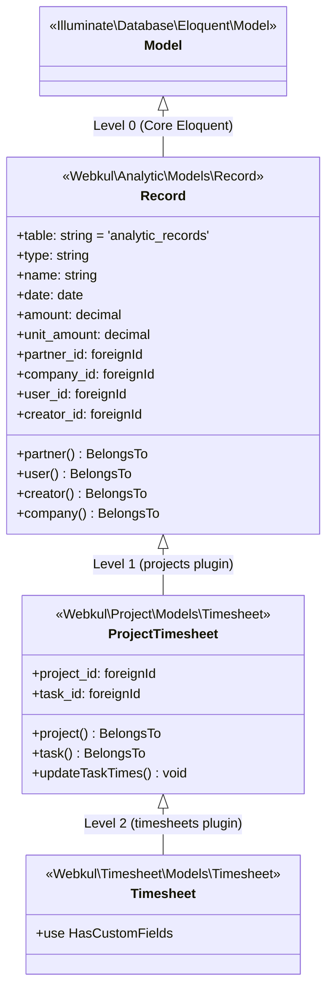
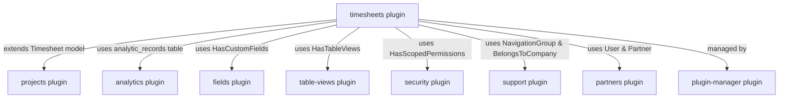
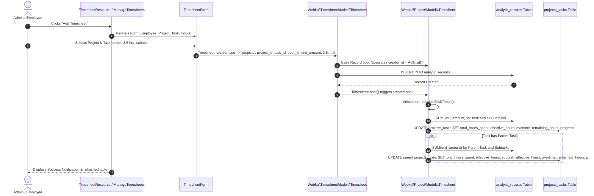

# Plugin: Timesheets (`timesheets`)

## Status
[VERIFIED]
Active Optional Module. Registered in `bootstrap/providers.php:32` as `Webkul\Timesheet\TimesheetServiceProvider::class`.

## Core/Optional
[VERIFIED]
**Optional Plugin**. Configured as an optional module without declaring `$package->isCore()` (`plugins/webkul/timesheets/src/TimesheetServiceProvider.php:15-28`). Execution and Filament UI registration are gated at runtime via `Package::isPluginInstalled('timesheets')` (`plugins/webkul/timesheets/src/TimesheetPlugin.php:23`).

## Enabled/Disabled
[VERIFIED]
**Conditionally Enabled (Database-Gated)**. `TimesheetServiceProvider` registers the package and binds `TimesheetPlugin` to Filament panels via `Panel::configureUsing()`, but admin panel resources and pages are discovered and mounted only if `Package::isPluginInstalled('timesheets')` returns `true` (`plugins/webkul/timesheets/src/TimesheetPlugin.php:23-47`).

## Purpose
[VERIFIED]
The `timesheets` module provides dedicated standalone administrative time tracking, employee work logging, and project task duration management within Aureus ERP. It functions as a lightweight UI, policy, and custom fields layer extending the Project management and Core Analytics infrastructure:

1. **Centralized Time Tracking UI (`TimesheetResource`)**:
   - Surfaces a top-level administrative timesheet management interface (`admin/timesheets`) under navigation group `NavigationGroup::Project` (`plugins/webkul/timesheets/src/Filament/Resources/TimesheetResource.php:28-31`).
   - Uses a single-page modal-driven table UI (`ManageTimesheets`) utilizing Filament's `ManageRecords` flow for creating, editing, and deleting timesheet entries without leaving the list view.
2. **Unified Financial/Operational Ledger Reuse**:
   - Rather than creating redundant physical tables, the module extends `Webkul\Project\Models\Timesheet`, which directly extends `Webkul\Analytic\Models\Record` on the Core `analytic_records` database table.
   - Automatically populates the `type` discriminator as `'projects'` (`plugins/webkul/timesheets/src/Filament/Resources/TimesheetResource/Schemas/TimesheetForm.php:21-22`).
3. **Dynamic Task Progress & Duration Rollup**:
   - Inherits automatic model lifecycle calculation hooks (`created`, `updated`, `deleted`) from `Webkul\Project\Models\Timesheet` that recalculate `total_hours_spent`, `effective_hours`, `remaining_hours`, `overtime`, and `progress` percentages on tasks and bubble them up to parent tasks.
4. **User Filter Presets & Scoped Views (`HasTableViews`)**:
   - Implements `HasTableViews` on `ManageTimesheets`, providing preset filtering tabs such as "My Timesheets" (filtered by authenticated user ID with live record count badge).
5. **Custom Fields Dynamic Extensibility**:
   - Attaches `HasCustomFields` on the model (`plugins/webkul/timesheets/src/Models/Timesheet.php:10`) and resource (`plugins/webkul/timesheets/src/Filament/Resources/TimesheetResource.php:19`), enabling dynamic schema injection, custom table columns, and custom form sections without migrations.

## Service Provider
[VERIFIED]
- **Class**: `Webkul\Timesheet\TimesheetServiceProvider` (`plugins/webkul/timesheets/src/TimesheetServiceProvider.php:11`)
- **Inheritance**: Extends `Webkul\PluginManager\PackageServiceProvider`
- **Registration & Configuration**:
  - `configureCustomPackage(Package $package)`:
    - Sets package name: `timesheets` (`TimesheetServiceProvider::$name = 'timesheets'`).
    - Registers translations: `hasTranslations()`.
    - Declares runtime plugin dependency on `projects`: `hasDependencies(['projects'])` (`plugins/webkul/timesheets/src/TimesheetServiceProvider.php:19-21`).
    - Configures CLI installer: `hasInstallCommand(fn (InstallCommand $command) => $command->installDependencies())`.
    - Configures CLI uninstaller: `hasUninstallCommand(fn (UninstallCommand $command) => null)`.
    - Sets package icon: `icon('timesheet')`.
    - Does **not** declare `$package->isCore()` (confirming optional plugin status).
    - Does **not** register database migrations, routes, or seeders.
  - `packageRegistered()`:
    - Registers `TimesheetPlugin::make()` with Filament panels via `Panel::configureUsing()` (`plugins/webkul/timesheets/src/TimesheetServiceProvider.php:37-39`).
  - `packageBooted()`:
    - Empty implementation stub (`//`).

## Filament Plugin Class
[VERIFIED]
- **Class**: `Webkul\Timesheet\TimesheetPlugin` (`plugins/webkul/timesheets/src/TimesheetPlugin.php:9`)
- **Implements**: `Filament\Contracts\Plugin`
- **Plugin ID**: `timesheets` (`getId(): string`)
- **Singleton Factory**: `TimesheetPlugin::make()` resolves `app(static::class)`.
- **Panel Registration Logic**:
  - Checks installation state: `Package::isPluginInstalled($this->getId())`; returns early if uninstalled (`plugins/webkul/timesheets/src/TimesheetPlugin.php:23-25`).
  - Restricts registration exclusively to the `admin` panel (`$panel->when($panel->getId() == 'admin', ...)`):
    - Discovers Resources in `plugins/webkul/timesheets/src/Filament/Resources` (`Webkul\Timesheet\Filament\Resources`).
    - Discovers Pages in `plugins/webkul/timesheets/src/Filament/Pages` (`Webkul\Timesheet\Filament\Pages`).
    - Discovers Clusters in `plugins/webkul/timesheets/src/Filament/Clusters` (`Webkul\Timesheet\Filament\Clusters`).
    - Discovers Widgets in `plugins/webkul/timesheets/src/Filament/Widgets` (`Webkul\Timesheet\Filament\Widgets`).
- **Boot**: Empty method stub (`boot(Panel $panel): void`).

## Composer Dependencies
[VERIFIED]
Defined in `plugins/webkul/timesheets/composer.json`:
- **Package Name**: `webkul/timesheets`
- **Description**: `Employee work hour tracking`
- **Autoload PSR-4**:
  - `Webkul\Timesheet\`: `src/`
  - `Webkul\Timesheet\Database\Factories\`: `database/factories/`
  - `Webkul\Timesheet\Database\Seeders\`: `database/seeders/`
- **Autoload-dev PSR-4**:
  - `Webkul\Timesheet\Tests\`: `tests/`
- **Require Dependencies**: None declared in `composer.json` (relies on root workspace Composer manifest and required parent plugins).

## Runtime Plugin Dependencies
[VERIFIED]
- **Declared Runtime Dependencies (`Package::hasDependencies([...])`)**:
  - `projects` (`plugins/webkul/timesheets/src/TimesheetServiceProvider.php:19-21`): Required for project and task base models (`Webkul\Project\Models\Project`, `Webkul\Project\Models\Task`), base timesheet class (`Webkul\Project\Models\Timesheet`), and schema alterations on `analytic_records`.
- **Implicit Core Plugin Dependencies**:
  - `analytics`: Underlying database table `analytic_records` and base model `Webkul\Analytic\Models\Record`.
  - `fields`: Custom fields integration via `Webkul\Field\Traits\HasCustomFields` and `Webkul\Field\Filament\Traits\HasCustomFields`.
  - `table-views`: Filter preset tabs via `Webkul\TableViews\Filament\Concerns\HasTableViews` and `PresetView`.
  - `security`: Authentication, authorization policies, and ownership scopes via `Webkul\Security\Traits\HasScopedPermissions` and `Webkul\Security\Models\User`.
  - `partners`: Partner relationship on the underlying `analytic_records` schema.
  - `support`: Navigation groupings via `Webkul\Support\Enums\NavigationGroup`, company scope via `Webkul\Support\Traits\BelongsToCompany`, and helper `owned_by_company()`.
  - `plugin-manager`: Local package lifecycle management and `Package::isPluginInstalled()`.

## Directory Structure
[VERIFIED]
```text
plugins/webkul/timesheets/
├── composer.json
├── config/
│   └── filament-shield.php
├── resources/
│   └── lang/
│       ├── ar/
│       │   └── filament/
│       │       └── resources/
│       │           ├── timesheet.php
│       │           └── timesheet/
│       │               └── manage-timesheets.php
│       ├── en/
│       │   └── filament/
│       │       └── resources/
│       │           ├── timesheet.php
│       │           └── timesheet/
│       │               └── manage-timesheets.php
│       ├── es/
│       │   └── filament/
│       │       └── resources/
│       │           ├── timesheet.php
│       │           └── timesheet/
│       │               └── manage-timesheets.php
│       ├── fr/
│       │   └── filament/
│       │       └── resources/
│       │           ├── timesheet.php
│       │           └── timesheet/
│       │               └── manage-timesheets.php
│       └── pt_BR/
│           └── filament/
│               └── resources/
│                   ├── timesheet.php
│                   └── timesheet/
│                       └── manage-timesheets.php
└── src/
    ├── Filament/
    │   └── Resources/
    │       ├── TimesheetResource.php
    │       └── TimesheetResource/
    │           ├── Pages/
    │           │   └── ManageTimesheets.php
    │           ├── Schemas/
    │           │   └── TimesheetForm.php
    │           └── Tables/
    │               └── TimesheetsTable.php
    ├── Models/
    │   └── Timesheet.php
    ├── Policies/
    │   └── TimesheetPolicy.php
    ├── TimesheetPlugin.php
    └── TimesheetServiceProvider.php
```

## Models
[VERIFIED]

### Inheritance Chain (2-Level Hierarchy)
The `timesheets` plugin defines a single Eloquent model that relies entirely on a 2-level inheritance chain terminating at the Core `analytics` ledger:



#### Exact Class Citations:
1. **Level 2 (Terminal Model in `timesheets`)**:
   - File: `plugins/webkul/timesheets/src/Models/Timesheet.php:8-11`
   - Declaration: `class Timesheet extends BaseTimesheet` (where `BaseTimesheet` is aliased from `Webkul\Project\Models\Timesheet` on line 6).
   - Added Traits: `use HasCustomFields;` (`Webkul\Field\Traits\HasCustomFields`).
2. **Level 1 (Intermediate Model in `projects`)**:
   - File: `plugins/webkul/projects/src/Models/Timesheet.php:8-95`
   - Declaration: `class Timesheet extends Record` (where `Record` is `Webkul\Analytic\Models\Record` imported on line 6).
   - Boot Hook: Registers `created`, `updated`, `deleted` model event callbacks invoking `$timesheet->updateTaskTimes()` (`plugins/webkul/projects/src/Models/Timesheet.php:14-24`).
   - Relationships:
     - `project(): BelongsTo` (`Webkul\Project\Models\Project`) (`plugins/webkul/projects/src/Models/Timesheet.php:27-30`).
     - `task(): BelongsTo` (`Webkul\Project\Models\Task`) (`plugins/webkul/projects/src/Models/Timesheet.php:32-35`).
   - Logic: `updateTaskTimes()` calculates total spent hours across task and all subtasks, updates `total_hours_spent`, `effective_hours`, `overtime`, `remaining_hours`, and `progress`, and recursively bubbles updates to `$task->parent`.
3. **Level 0 (Base Ledger Model in `analytics`)**:
   - File: `plugins/webkul/analytics/src/Models/Record.php:13-63`
   - Declaration: `class Record extends Model`
   - Table: `protected $table = 'analytic_records';` (`plugins/webkul/analytics/src/Models/Record.php:17`).
   - Traits: `use BelongsToCompany;` (`Webkul\Support\Traits\BelongsToCompany`).
   - Fillable Attributes: `type`, `name`, `date`, `amount`, `unit_amount`, `partner_id`, `company_id`, `user_id`, `creator_id`.
   - Casts: `'date' => 'date'`.
   - Relationships:
     - `partner(): BelongsTo` (`Webkul\Partner\Models\Partner`)
     - `user(): BelongsTo` (`Webkul\Security\Models\User`)
     - `creator(): BelongsTo` (`Webkul\Security\Models\User`)
     - `company(): BelongsTo` (`Webkul\Support\Models\Company`)
   - Boot Hook: Auto-assigns `creator_id ??= Auth::id()` on creating (`plugins/webkul/analytics/src/Models/Record.php:59-61`).

### Model Summary Table
| Model | Physical Table | Inheritance Parent | Traits | Company Scoping | Key Relationships |
| :--- | :--- | :--- | :--- | :--- | :--- |
| `Timesheet` | `analytic_records` | `Webkul\Project\Models\Timesheet` | `HasCustomFields`, `BelongsToCompany` (via `Record`) | Optional (`BelongsToCompany` via base `Record`) | `user(): BelongsTo` (`User`), `creator(): BelongsTo` (`User`), `project(): BelongsTo` (`Project`), `task(): BelongsTo` (`Task`), `partner(): BelongsTo` (`Partner`), `company(): BelongsTo` (`Company`) |

## Database
[NOT APPLICABLE]
- **Dedicated Physical Tables**: **0 tables**. The `timesheets` plugin owns zero physical tables.
- **Dedicated Migrations**: **0 migrations**. The `timesheets` plugin contains no `database/migrations` directory.
- **Underlying Storage Table (`analytic_records`)**:
  - Created by Core `analytics` plugin: `plugins/webkul/analytics/database/migrations/2024_12_18_131844_create_analytic_records_table.php:14`.
  - Mutated by `projects` plugin: `plugins/webkul/projects/database/migrations/2024_12_18_145142_add_columns_to_analytic_records_table.php:14` (adds foreign keys `project_id` referencing `projects_projects.id` `nullOnDelete` and `task_id` referencing `projects_tasks.id` `nullOnDelete`).

## Filament Resources, Pages, Schemas & Tables
[VERIFIED]

### 1. `TimesheetResource`
- **Class**: `Webkul\Timesheet\Filament\Resources\TimesheetResource` (`plugins/webkul/timesheets/src/Filament/Resources/TimesheetResource.php:17`)
- **Model**: `Webkul\Timesheet\Models\Timesheet`
- **Navigation Group**: `NavigationGroup::Project` (`plugins/webkul/timesheets/src/Filament/Resources/TimesheetResource.php:30`)
- **Navigation Label**: `timesheets::filament/resources/timesheet.navigation.title` ("Timesheets")
- **Global Search Attributes**: `['user.name', 'project.name', 'task.title', 'date']` (`plugins/webkul/timesheets/src/Filament/Resources/TimesheetResource.php:40`)
- **Global Search Result Title**: `$record->user->name`
- **Global Search Result Details**: Project name, Task title, Date.
- **Traits**: `Webkul\Field\Filament\Traits\HasCustomFields` (enables dynamic form/table fields).
- **Pages Registered**:
  - `index`: `ManageTimesheets::route('/')` (`plugins/webkul/timesheets/src/Filament/Resources/TimesheetResource.php:65`)

### 2. `ManageTimesheets` (Page)
- **Class**: `Webkul\Timesheet\Filament\Resources\TimesheetResource\Pages\ManageTimesheets` (`plugins/webkul/timesheets/src/Filament/Resources/TimesheetResource/Pages/ManageTimesheets.php:14`)
- **Inheritance**: `Filament\Resources\Pages\ManageRecords`
- **Traits**: `Webkul\TableViews\Filament\Concerns\HasTableViews`
- **Header Actions**:
  - `CreateAction`: Modal create action configured with success notification title and body (`plugins/webkul/timesheets/src/Filament/Resources/TimesheetResource/Pages/ManageTimesheets.php:23-31`).
- **Preset Table Views (`getPresetTableViews()`)**:
  - `my_timesheets`: PresetView labeled "My Timesheets", badged with the count of timesheets belonging to `Auth::id()`, filtered by `where('user_id', Auth::id())`, icon `heroicon-o-clock`, marked as `favorite()`.

### 3. `TimesheetForm` (Schema)
- **Class**: `Webkul\Timesheet\Filament\Resources\TimesheetResource\Schemas\TimesheetForm` (`plugins/webkul/timesheets/src/Filament/Resources/TimesheetResource/Schemas/TimesheetForm.php:15`)
- **Form Components**:
  - `Hidden('type')`: Defaults to `'projects'` (discriminator for `analytic_records`).
  - `DatePicker('date')`: Required, non-native date selector.
  - `Select('user_id')`: Required, searchable, preloaded relationship to `user.name` (labeled "Employee").
  - `Select('project_id')`: Required, searchable, preloaded relationship to `project.name` filtered by `where(owned_by_company())`, reactive (`live()`), resets `task_id` to `null` via `afterStateUpdated()`.
  - `Select('task_id')`: Required, searchable, preloaded relationship to `task.title` filtered by `where('project_id', $get('project_id'))`.
  - `TextInput('name')`: Optional string input (labeled "Description").
  - `TextInput('unit_amount')`: Required, numeric, min 0, max 99999999999 (labeled "Time Spent", helper text "Time spent in hours (Eg. 1.5 hours means 1 hour 30 minutes)").
  - `Section`: Injects custom form fields `$customFormFields` (2 columns).

### 4. `TimesheetsTable` (Table)
- **Class**: `Webkul\Timesheet\Filament\Resources\TimesheetResource\Tables\TimesheetsTable` (`plugins/webkul/timesheets/src/Filament/Resources/TimesheetResource/Tables/TimesheetsTable.php:20`)
- **Columns**:
  - `TextColumn('date')`: Formatted as `Y-m-d`, sortable.
  - `TextColumn('user.name')`: Sortable, searchable (labeled "Employee").
  - `TextColumn('project.name')`: Sortable, searchable.
  - `TextColumn('task.title')`: Sortable, searchable.
  - `TextColumn('name')`: Sortable, searchable (labeled "Description").
  - `TextColumn('unit_amount')`: Formats decimal hours into `hours:minutes` (e.g. `1.5` → `1:30`), sortable, includes footer `Sum` summarizer formatted as `hours:minutes`.
  - `TextColumn('created_at')`: DateTime, sortable, hidden by default.
  - `TextColumn('updated_at')`: DateTime, sortable, hidden by default.
  - Merges dynamic `$customColumns`.
- **Grouping Options**:
  - `Group('date')`: Grouped by date.
  - `Group('user.name')`: Grouped by employee.
  - `Group('project.name')`: Grouped by project.
  - `Group('task.title')`: Grouped by task.
  - `Group('creator.name')`: Grouped by creator.
- **Filters**:
  - `Filter('date')`: Custom date range filter (`date_from`, `date_until`) with custom query callbacks and indicator badges.
  - `SelectFilter('user_id')`: Searchable filter on employee (`user.name`).
  - `SelectFilter('project_id')`: Searchable filter on project (`project.name`).
  - `SelectFilter('task_id')`: Searchable filter on task (`task.title`).
  - `SelectFilter('creator_id')`: Searchable filter on entry creator (`creator.name`).
  - Merges dynamic `$customFilters`.
- **Record Actions**:
  - `EditAction`: Inline modal edit with success notification.
  - `DeleteAction`: Inline record delete with success notification.
- **Bulk Actions**:
  - `BulkActionGroup`: Contains `DeleteBulkAction` with success notification.

### 5. Clusters & Widgets
[NOT APPLICABLE]
The `timesheets` plugin defines 0 Filament Clusters and 0 Filament Widgets.

## Panels
[VERIFIED]
- **Admin Panel (`admin`)**: **Active**. All resources and pages are registered strictly when `$panel->getId() == 'admin'` (`plugins/webkul/timesheets/src/TimesheetPlugin.php:28`).
- **Customer Panel (`customer`)**: **Excluded**. No resources, pages, or widgets are registered for the customer portal.

## Services
[NOT APPLICABLE]
The `timesheets` plugin defines 0 dedicated service classes. All calculation logic is handled by model hooks on `Webkul\Project\Models\Timesheet::updateTaskTimes()`.

## Events, Listeners & Observers
[VERIFIED]
- **Events**: Zero dedicated custom Event classes declared in this plugin.
- **Model Lifecycle Events (Inherited from `Webkul\Project\Models\Timesheet`)**:
  - `Timesheet::created` → invokes `$timesheet->updateTaskTimes()`
  - `Timesheet::updated` → invokes `$timesheet->updateTaskTimes()`
  - `Timesheet::deleted` → invokes `$timesheet->updateTaskTimes()`
- **Listeners & Observers**: Zero dedicated Listener and Observer classes declared in this plugin.

## Policies & Security
[VERIFIED]

### 1. `TimesheetPolicy`
- **Class**: `Webkul\Timesheet\Policies\TimesheetPolicy` (`plugins/webkul/timesheets/src/Policies/TimesheetPolicy.php:10`)
- **Traits**: `HandlesAuthorization`, `HasScopedPermissions` (`Webkul\Security\Traits\HasScopedPermissions`)
- **Method Authorizations**:
  - `viewAny(User $user)`: Checks `$user->can('view_any_timesheet_timesheet')`.
  - `create(User $user)`: Checks `$user->can('create_timesheet_timesheet')`.
  - `update(User $user, Timesheet $timesheet)`: Checks `$user->can('update_timesheet_timesheet')` and evaluates `$this->hasAccess($user, $timesheet, 'users')`.
  - `delete(User $user, Timesheet $timesheet)`: Checks `$user->can('delete_timesheet_timesheet')` and evaluates `$this->hasAccess($user, $timesheet, 'users')`.
  - `deleteAny(User $user)`: Checks `$user->can('delete_any_timesheet_timesheet')`.

### 2. Filament Shield Configuration
- **File**: `plugins/webkul/timesheets/config/filament-shield.php:1-16`
- **Permissions Registered**:
  - `TimesheetResource`: `view_any_timesheet_timesheet`, `create_timesheet_timesheet`, `update_timesheet_timesheet`, `delete_timesheet_timesheet`, `delete_any_timesheet_timesheet` (`view` permission excluded since resource uses modal-based `ManageRecords`).

## Routes
[NOT APPLICABLE]
The `timesheets` plugin defines 0 HTTP routing files (`routes/web.php` and `routes/api.php` do not exist). All interactions occur via Livewire component actions in the Filament admin panel.

## Settings
[NOT APPLICABLE]
The `timesheets` plugin defines 0 dedicated settings classes. Global timesheet enablement toggles are governed by `Webkul\Project\Settings\TimeSettings` (`enable_timesheets`) in the `projects` plugin.

## Translations
[VERIFIED]
Registered namespace: `timesheets::` across 5 locales:
- `ar` (Arabic)
- `en` (English)
- `es` (Spanish)
- `fr` (French)
- `pt_BR` (Portuguese - Brazil)

Key language files:
- `timesheets::filament/resources/timesheet`: Navigation, form fields, table columns, table filters, table groups, global search, and action notifications.
- `timesheets::filament/resources/timesheet/manage-timesheets`: Header create action labels and tab headers (`all`, `my-timesheets`).

## Tests
[NOT APPLICABLE]
- **Test Coverage**: **0 test files**.
- The `timesheets` plugin contains no `tests/` directory and no feature/unit test cases exist in the workspace for `Webkul\Timesheet\*`.

## Cross-Plugin Relationships
[VERIFIED]



1. **`projects` [OPTIONAL]**:
   - Direct model parent: `Webkul\Timesheet\Models\Timesheet extends Webkul\Project\Models\Timesheet`.
   - Provides foreign key targets `projects_projects` and `projects_tasks`.
   - Inherits task duration computation engine (`updateTaskTimes()`).
2. **`analytics` [CORE]**:
   - Direct physical storage base: provides `analytic_records` table and base model `Webkul\Analytic\Models\Record`.
3. **`fields` [CORE]**:
   - Dynamic custom fields injection into timesheet forms and tables via `HasCustomFields`.
4. **`table-views` [CORE]**:
   - Preset table view filtering tabs ("My Timesheets") via `HasTableViews`.
5. **`security` [CORE]**:
   - User authentication, permission checks (`TimesheetPolicy`), and permission scoping (`HasScopedPermissions`).
6. **`support` [CORE]**:
   - `NavigationGroup::Project` enum, `BelongsToCompany` multi-tenancy trait, and `owned_by_company()` scope helper.

## Data Flow
[VERIFIED]

### Timesheet Entry & Task Rollup Data Flow



## Business Rules
[VERIFIED]

1. **Analytic Ledger Discrimination**:
   - Every record logged through `TimesheetForm` writes a hidden attribute `'type' => 'projects'` to `analytic_records.type` (`plugins/webkul/timesheets/src/Filament/Resources/TimesheetResource/Schemas/TimesheetForm.php:21-22`).
2. **Dependent Project-Task Dropdowns**:
   - In `TimesheetForm`, selecting a `project_id` immediately clears `task_id` (`afterStateUpdated(fn (Set $set) => $set('task_id', null))`) and restricts the `task_id` query strictly to tasks belonging to the selected project (`where('project_id', $get('project_id'))`).
3. **Time Formatting & Display**:
   - Hours stored as decimals in `unit_amount` (e.g. `1.5`) are formatted for display in tables and summarizers as `H:MM` (e.g. `1:30`) using `$hours = floor($state); $minutes = ($state - $hours) * 60; return $hours.':'.$minutes;` (`plugins/webkul/timesheets/src/Filament/Resources/TimesheetResource/Tables/TimesheetsTable.php:49-54`).
4. **Task Duration Rollup Mathematics**:
   - **Effective Hours**: Direct sum of `unit_amount` logged on the specific task (`$task->timesheets()->sum('unit_amount')`).
   - **Total Hours Spent**: Effective hours + sum of `unit_amount` across all child subtasks.
   - **Overtime**: If `total_hours_spent > allocated_hours`, `overtime = total_hours_spent - allocated_hours`; otherwise `0`.
   - **Remaining Hours**: `allocated_hours - total_hours_spent`.
   - **Progress Percentage**: If `allocated_hours > 0`, `(total_hours_spent / allocated_hours) * 100`; otherwise `0`.
5. **Parent Task Propagation**:
   - If the task has a `$parentTask`, the parent's `subtask_effective_hours`, `total_hours_spent`, `overtime`, `remaining_hours`, and `progress` are recomputed and updated in the same transaction cycle.
6. **Company Multi-Tenancy**:
   - Projects in the form are scoped to `owned_by_company()`. Records inherit `BelongsToCompany` from base `Record`.

## Extension Points
[VERIFIED]
1. **Dynamic Custom Fields**:
   - Administrators can attach custom attributes to `Webkul\Timesheet\Models\Timesheet` via the `fields` module. Form and table builders merge `$customFormFields`, `$customColumns`, and `$customFilters`.
2. **Table Preset Views**:
   - Developers can inject additional preset filter tabs into `ManageTimesheets::getPresetTableViews()` via `HasTableViews`.

## Dangerous Areas
[VERIFIED]

1. **Zero Test Coverage**:
   - **CRITICAL**: The `timesheets` plugin contains **0 automated test files** (`tests/` directory is completely missing). Any regression in model boot events, policy checks, or table formatting will not be caught by test suites.
2. **Heavy Recursive Querying in `updateTaskTimes()`**:
   - Whenever a timesheet is created, updated, or deleted, `updateTaskTimes()` executes aggregate `sum()` queries on the task, iterates through every subtask to sum timesheets, and repeats the process for parent tasks.
   - Bulk timesheet creation or seeding without disabling model events will trigger an N+1 query explosion on `analytic_records`.
3. **Policy Ownership Attribute Mismatch**:
   - In `Webkul\Timesheet\Policies\TimesheetPolicy:39,51`, `update()` and `delete()` call `$this->hasAccess($user, $timesheet, 'users')` with owner attribute `'users'`.
   - However, `Timesheet` extends `Record`, which defines a singular `user()` relationship (`user_id`), not `users`.
   - In `HasScopedPermissions`, accessing `$model->users` returns `null`, causing `hasGroupAccess()` and `hasIndividualAccess()` to evaluate to `false`. Users with scoped `GROUP` or `INDIVIDUAL` permissions will be denied update/delete access unless granted `GLOBAL` permissions.
4. **Physical Schema Coupling to Core `analytics`**:
   - The plugin depends on the `project_id` and `task_id` columns added to `analytic_records` by the `projects` migration. Rolling back `projects` migrations will break `timesheets` model queries immediately.

## Change Impact
[VERIFIED]

- **Upstream Dependencies**: Any modifications to `Webkul\Project\Models\Timesheet`, `Webkul\Project\Models\Task`, `Webkul\Analytic\Models\Record`, or `analytic_records` directly impact this plugin's model execution and query integrity.
- **Downstream Modules**: Downstream reporting and dashboard widgets (such as `TopAssigneesWidget` and `TopProjectsWidget` in `projects`) rely on the `analytic_records` entries written by this plugin.

## Evidence
[VERIFIED]

| Evidence ID | File | Symbol / Line | Description |
| :--- | :--- | :--- | :--- |
| E-TS-001 | `plugins/webkul/timesheets/src/TimesheetServiceProvider.php` | `TimesheetServiceProvider::configureCustomPackage():15-28` | Package definition, `hasDependencies(['projects'])`, translations |
| E-TS-002 | `plugins/webkul/timesheets/src/TimesheetServiceProvider.php` | `TimesheetServiceProvider::packageRegistered():35-40` | Panel configuration binding `TimesheetPlugin::make()` |
| E-TS-003 | `plugins/webkul/timesheets/src/TimesheetPlugin.php` | `TimesheetPlugin::register():21-47` | Plugin ID `'timesheets'`, installation check, admin panel discovery |
| E-TS-004 | `plugins/webkul/timesheets/src/Models/Timesheet.php` | `Timesheet extends BaseTimesheet:8-11` | Level 2 inheritance, `HasCustomFields` trait attachment |
| E-TS-005 | `plugins/webkul/projects/src/Models/Timesheet.php` | `Timesheet extends Record:8` | Level 1 inheritance, boot hooks, `updateTaskTimes()` calculation |
| E-TS-006 | `plugins/webkul/analytics/src/Models/Record.php` | `Record extends Model:13` | Level 0 inheritance, table `'analytic_records'`, `BelongsToCompany` |
| E-TS-007 | `plugins/webkul/timesheets/src/Filament/Resources/TimesheetResource.php` | `TimesheetResource:17-68` | Resource configuration, `NavigationGroup::Project`, global search |
| E-TS-008 | `plugins/webkul/timesheets/src/Filament/Resources/TimesheetResource/Pages/ManageTimesheets.php` | `ManageTimesheets:14-47` | `ManageRecords` page, `HasTableViews`, `my_timesheets` preset view |
| E-TS-009 | `plugins/webkul/timesheets/src/Filament/Resources/TimesheetResource/Schemas/TimesheetForm.php` | `TimesheetForm::configure():17-71` | Form schema, `'type' => 'projects'`, dependent project/task selectors |
| E-TS-010 | `plugins/webkul/timesheets/src/Filament/Resources/TimesheetResource/Tables/TimesheetsTable.php` | `TimesheetsTable::configure():22-173` | Table schema, `hours:minutes` time formatting, filters, sum footer |
| E-TS-011 | `plugins/webkul/timesheets/src/Policies/TimesheetPolicy.php` | `TimesheetPolicy:10-61` | Security policy checks, `HasScopedPermissions` |
| E-TS-012 | `plugins/webkul/timesheets/config/filament-shield.php` | `filament-shield.php:1-16` | Shield permission registration for `TimesheetResource` |
| E-TS-013 | `plugins/webkul/projects/database/migrations/2024_12_18_145142_add_columns_to_analytic_records_table.php` | `Migration:14-25` | Schema mutation adding `project_id` and `task_id` to `analytic_records` |
