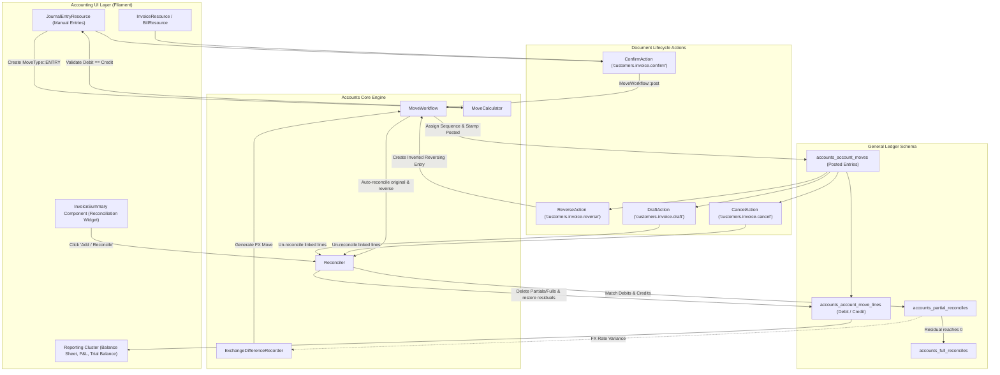

# Accounting & General Ledger Workflow

## 1. Scope

This document details the end-to-end financial workflows implemented in Aureus ERP. It covers manual journal entries (`MoveType::ENTRY`), document posting lifecycles, debit/credit balancing constraints, payment reconciliation, partial and full matching, un-reconciliation, multi-currency exchange gain/loss adjustments, bank statement data structures, fiscal period close status, and financial reporting data consumption.

The accounting architecture is split across two collaborating modules:
- **`accounts`** (`plugins/webkul/accounts`): Core double-entry general ledger engine, mathematical calculation pipeline (`MoveCalculator`, `TaxComputer`), payment registration, and reconciliation mechanics (`Reconciler`, `ExchangeDifferenceRecorder`).
- **`accounting`** (`plugins/webkul/accounting`): Administrative presentation layer, navigation clusters, financial statement generation (`BalanceSheet`, `ProfitLoss`, `TrialBalance`, `GeneralLedger`, `PartnerLedger`, `AgedReceivable`, `AgedPayable`), and real-time dashboard analytics (`JournalChartWidget`).

---

## 2. Entry Points

### Primary UI Entry Points (Filament Admin Panel)
- **Manual Journal Entries**:
  - `JournalEntryResource`: Route `/admin/accounting/accounting/journal-entries` (`plugins/webkul/accounting/src/Filament/Clusters/Accounting/Resources/JournalEntryResource.php`)
  - Sub-navigation: `CreateJournalEntry`, `EditJournalEntry`, `ViewJournalEntry`
- **Double-Entry Journal Items Ledger**:
  - `JournalItemResource`: Route `/admin/accounting/accounting/journal-items` (`plugins/webkul/accounting/src/Filament/Clusters/Accounting/Resources/JournalItemResource.php`)
- **Customer Financial Documents (`Customers` Cluster)**:
  - Invoices (`InvoiceResource`), Credit Notes (`CreditNoteResource`), Payments (`PaymentResource`)
- **Vendor Financial Documents (`Vendors` Cluster)**:
  - Vendor Bills (`BillResource`), Refunds (`RefundResource`), Vendor Payments (`PaymentResource`)
- **Financial Statement Reports (`Reporting` Cluster)**:
  - Balance Sheet (`BalanceSheet`), Profit & Loss (`ProfitLoss`), Trial Balance (`TrialBalance`), General Ledger (`GeneralLedger`), Partner Ledger (`PartnerLedger`), Aged Receivable (`AgedReceivable`), Aged Payable (`AgedPayable`)

### REST API v1 Entry Points
- `POST /api/v1/accounts/moves`: Creates generic account moves (`MoveController::store`).
- `POST /api/v1/accounts/moves/{id}/confirm`: Posts a draft move (`MoveController::confirm`).
- `POST /api/v1/accounts/moves/{id}/draft`: Resets a posted/canceled move to draft (`MoveController::draft`).
- `POST /api/v1/accounts/moves/{id}/cancel`: Cancels an account move (`MoveController::cancel`).
- `POST /api/v1/accounts/moves/{id}/reverse`: Generates a reversal move (`MoveController::reverse`).
- `POST /api/v1/accounts/payments`: Creates and posts payments (`PaymentController::store`).

[VERIFIED]
Evidence: `plugins/webkul/accounting/src/Filament/Clusters/Accounting/Resources/`, `plugins/webkul/accounts/routes/api.php`

---

## 3. Preconditions

1. **Company & Currencies**: Active `Company` with base currency and operational foreign exchange rates (`currencies_currencies`).
2. **Chart of Accounts**: Structured accounts (`accounts_accounts`) classified by `AccountType` (e.g. `ASSET_RECEIVABLE`, `LIABILITY_PAYABLE`, `INCOME_OTHER`, `EXPENSE_DIRECT`). Accounts intended for payment matching must have `reconcile = true`.
3. **Fiscal Journals**: At least one `Journal` (`accounts_journals`) configured per required type:
   - `GENERAL`: For manual adjustment entries (`MoveType::ENTRY`).
   - `SALE`: For customer invoices and credit notes.
   - `PURCHASE`: For vendor bills and debit notes.
   - `BANK` / `CASH`: For monetary disbursements and receipts.
4. **Exchange Difference Configuration**: When multi-currency transactions are processed, `DefaultAccountSettings` must specify `currency_exchange_journal_id`, `income_currency_exchange_account_id`, and `expense_currency_exchange_account_id`.

[VERIFIED]
Evidence: `plugins/webkul/accounts/src/Services/AccountingSetupService.php`, `plugins/webkul/accounts/src/Settings/DefaultAccountSettings.php`

---

## 4. Manual Journal Entry Flow

```
[1] Accountant opens JournalEntryResource / CreateJournalEntry
     │
     ├── Selects General Journal (type = GENERAL)
     ├── Sets Accounting Date (defaults to today)
     ├── Enters Reference Description
     └── Adds Multi-Line Debit and Credit Rows (JournalItemRepeater)
           ├── Line 1: Account A, Debit = 500.00, Credit = 0.00, Partner X
           └── Line 2: Account B, Debit = 0.00, Credit = 500.00, Partner X
     │
     ▼
[2] User clicks "Save" / Creates Draft Move
     │
     ├── Move::boot() generates provisional title
     ├── MoveCalculator::recompute() validates line sums:
     │     └── Sum(Debit) must equal Sum(Credit) for MoveType::ENTRY
     └── Move state is MoveState::DRAFT (posted_before = false)
     │
     ▼
[3] User clicks "Confirm" (ConfirmAction)
     │
     ├── MoveWorkflow::assertPostable() runs validation checks:
     │     ├── Partner presence (for customer/vendor lines)
     │     ├── Non-negative total amounts
     │     ├── Accounting date provided
     │     ├── Active journal and currency
     │     ├── No deprecated accounts
     │     └── Balanced debit and credit totals
     │
     ├── MoveWorkflow::post() executes:
     │     ├── Assigns sequential document number via SequenceService (e.g., GEN/2026/00001)
     │     ├── Sets Move::state = MoveState::POSTED
     │     ├── Sets Move::posted_before = true
     │     └── Stamps MoveLine::parent_state = MoveState::POSTED
     │
     ▼
[4] Dispatches: Webkul\Account\Events\MoveConfirmed
     └── Lines become visible in General Ledger and Financial Statements
```

[VERIFIED]
Evidence: `plugins/webkul/accounts/src/Services/MoveWorkflow.php:238-285`, `plugins/webkul/accounts/src/Services/MoveCalculator.php:14-45`, `plugins/webkul/accounting/src/Filament/Clusters/Accounting/Resources/JournalEntryResource/Pages/CreateJournalEntry.php`

---

## 5. Posting & Modification Lifecycle

### State Machine (`accounts_account_moves.state`)

```
┌──────────────┐     MoveWorkflow::post()      ┌──────────────┐
│    draft     │ ────────────────────────────► │    posted    │
└──────┬───────┘                               └──────┬───────┘
       ▲                                              │
       │                                              ├──► MoveWorkflow::reverse()
       │                                              │      (Creates reversing entry)
       │ MoveWorkflow::resetToDraft()                 │
       │ (Un-reconciles & re-opens)                   ├──► MoveWorkflow::cancel()
       │                                              │      (Un-reconciles & cancels)
       │                                              ▼
       │                                       ┌──────────────┐
       └────────────────────────────────────── │    cancel    │
                                               └──────────────┘
```

### Supported Lifecycle Operations

| Action | UI Trigger / Location | Code Path | System Behavior |
| :--- | :--- | :--- | :--- |
| **Post / Confirm** | "Confirm" button on header (`ConfirmAction`) | `MoveWorkflow::post()` | Validates balancing, assigns permanent sequence number (`GEN/YYYY/#####`), sets `state = POSTED`, `posted_before = true`, dispatches `MoveConfirmed`. |
| **Reset to Draft** | "Reset to Draft" button on header (`DraftAction`) | `MoveWorkflow::resetToDraft()` | 1. Un-reconciles all linked debits/credits via `Reconciler::unReconcile()`.<br>2. Verifies entry is not an exchange difference entry.<br>3. Sets `state = DRAFT`.<br>4. Dispatches `MoveDrafted`. Lines become editable again. |
| **Reverse** | "Reverse" button on header (`ReverseAction`) | `MoveWorkflow::reverse()` | 1. Replicates move and lines.<br>2. Inverts debits and credits.<br>3. Links `reversed_entry_id = $move->id`.<br>4. Posts reverse move.<br>5. Auto-reconciles original and reverse lines via `Reconciler::reconcileReversals()`.<br>6. Dispatches `MoveReversed`. |
| **Cancel** | "Cancel" button on header (`CancelAction`) | `MoveWorkflow::cancel()` | 1. Un-reconciles all linked debits/credits via `Reconciler::unReconcile()`.<br>2. Sets `state = CANCEL`.<br>3. Dispatches `MoveCancelled`. |
| **Duplicate** | Standard Filament table/page duplicate action | Model replication | Copies header attributes and lines into a brand-new draft move with `name = null` and `posted_before = false`. |

[VERIFIED]
Evidence: `plugins/webkul/accounts/src/Services/MoveWorkflow.php:40-182`, `plugins/webkul/accounts/src/Filament/Resources/Invoice/Actions/`

---

## 6. Reconciliation Engine

### Reconciliation Data Architecture
- **`accounts_partial_reconciles`**: Represents a specific financial match between a debit move line (`debit_move_id`) and a credit move line (`credit_move_id`) with `amount`, `debit_amount_currency`, and `credit_amount_currency`.
- **`accounts_full_reconciles`**: Represents a completed group reconciliation where all debit and credit lines in the match have zero remaining residual balance (`amount_residual == 0`).
- **Matching Numbers (`matching_number`)**:
  - Partial matches receive provisional identifier prefix `P` (e.g. `P1`, `P2`).
  - Full matches receive the integer ID of the `FullReconcile` record (e.g. `1`, `42`).

```
┌─────────────────────────┐                                ┌─────────────────────────┐
│  Invoice Move Line      │                                │  Payment Move Line      │
│  Debit = 1,000.00       │                                │  Credit = 600.00        │
│  amount_residual = 0.00 │                                │  amount_residual = 0.00 │
└────────────┬────────────┘                                └────────────┬────────────┘
             │                                                          │
             └────────────────► accounts_partial_reconciles ◄───────────┘
                                - amount = 600.00
                                - debit_move_id = Invoice.Line
                                - credit_move_id = Payment.Line
                                - matching_number = "P1"
                                - Invoice residual becomes 400.00
```

### Full vs Partial Reconciliation Workflow
1. **Reconciliation Execution (`Reconciler::reconcile()`)**:
   - `assertReconcilable()` verifies lines: must be `POSTED`, not already fully reconciled, belonging to the same account, partner, and company, on an account that allows reconciliation (`reconcile == true` or bank/cash/credit card type).
   - `reconcileGroups()` calculates matching debits and credits:
     - Creates `PartialReconcile` records for the matching amounts.
     - Decrements `amount_residual` and `amount_residual_currency` on both lines.
     - If all lines in the group reach `amount_residual == 0`, creates `FullReconcile` and stamps `reconciled = true` on lines.
2. **Multi-Currency Exchange Difference Auto-Recording**:
   - If lines in foreign currency are settled but residual amounts remain in company currency due to exchange rate movements, `Reconciler::exchangeMoveForUnsettled()` invokes `ExchangeDifferenceRecorder`.
   - `ExchangeDifferenceRecorder::buildExchangeMove()` generates and posts a balancing `MoveType::ENTRY` to the exchange gain/loss accounts, linking the exchange move to the `FullReconcile` record.
3. **Un-reconciliation (`Reconciler::unReconcile()`)**:
   - Deletes the `PartialReconcile` and any linked `FullReconcile`.
   - Reverses any generated currency exchange difference move.
   - Recomputes `amount_residual` on debit and credit lines, setting `reconciled = false`.
   - Clears or recalculates `matching_number` across surviving lines.

[VERIFIED]
Evidence: `plugins/webkul/accounts/src/Services/Reconciler.php:17-150,500-674`, `plugins/webkul/accounts/src/Services/ExchangeDifferenceRecorder.php:13-100`

---

## 7. Bank Statement Processing Status

### Model & Schema Investigation
Aureus ERP contains the following database models and schema definitions for bank statements:
- **`BankStatement`** (`accounts_bank_statements`): Stores bank statement headers with name, reference, journal, balance start, and balance end.
- **`BankStatementLine`** (`accounts_bank_statement_lines`): Stores statement line transactions with date, amount, partner, and payment reference.
- **`MoveLine` Linkage**: `accounts_account_move_lines` contains foreign keys `statement_id` and `statement_line_id`.

### Implementation Status: [NOT IMPLEMENTED / UNKNOWN]
- While models, migrations, seeders, and factories exist, there is **NO user interface (Filament Resource/Page), automatic bank rule matching engine, or bank statement import parser** in the current active codebase.
- Bank statement reconciliation is not exposed in the administrative navigation.

[VERIFIED]
Evidence: `plugins/webkul/accounts/src/Models/BankStatement.php`, `plugins/webkul/accounts/src/Models/BankStatementLine.php`

---

## 8. Period & Fiscal Year Closing Status

### Implementation Status: [NOT IMPLEMENTED / UNKNOWN]
- There is **NO period closing, fiscal year rollover, closing entry generator, or accounting lock-date validation engine** implemented in Aureus ERP.
- Moves can be posted to any date without period-closing restrictions.
- Financial reports (`BalanceSheet`, `ProfitLoss`) dynamically filter move lines by user-selected date ranges without requiring formal period close vouchers.

[VERIFIED]
Evidence: `plugins/webkul/accounts/src/Services/`, `plugins/webkul/accounting/src/Filament/Clusters/Reporting/`

---

## 9. Financial Reporting & Analytics Layer

The `accounting` plugin implements financial statements under the `Reporting` cluster. All reports consume raw journal item lines from the double-entry ledger:

```
┌────────────────────────────────────────────────────────────────────────────────────────┐
│                        Financial Reporting Aggregation Mapping                         │
├─────────────────────┬───────────────────────────┬──────────────────────────────────────┤
│ Report Name         │ Primary SQL Aggregation   │ Filter Conditions                    │
├─────────────────────┼───────────────────────────┼──────────────────────────────────────┤
│ Balance Sheet       │ SUM(debit - credit)       │ `parent_state = 'posted'`,           │
│                     │ grouped by AccountType    │ `account_type` in Assets,            │
│                     │                           │ Liabilities, Equity, `date <= end`   │
├─────────────────────┼───────────────────────────┼──────────────────────────────────────┤
│ Profit & Loss       │ SUM(credit - debit)       │ `parent_state = 'posted'`,           │
│                     │ grouped by AccountType    │ `account_type` in Income, Expense,   │
│                     │                           │ `date` between start and end         │
├─────────────────────┼───────────────────────────┼──────────────────────────────────────┤
│ Trial Balance       │ SUM(debit), SUM(credit),  │ `parent_state = 'posted'`,           │
│                     │ Initial & Ending Balance  │ grouped by `account_id`              │
├─────────────────────┼───────────────────────────┼──────────────────────────────────────┤
│ General Ledger      │ Detailed MoveLine listing │ `parent_state = 'posted'`,           │
│                     │ with running balance      │ filtered by account, date, journal   │
├─────────────────────┼───────────────────────────┼──────────────────────────────────────┤
│ Partner Ledger      │ MoveLine listing filtered │ `parent_state = 'posted'`,           │
│                     │ by partner & receivable/  │ `account_type` in Receivable/Payable │
│                     │ payable accounts          │                                      │
├─────────────────────┼───────────────────────────┼──────────────────────────────────────┤
│ Aged Receivable /   │ Unreconciled residual     │ `parent_state = 'posted'`,           │
│ Aged Payable        │ partitioned into ageing   │ `amount_residual > 0`, grouped by    │
│                     │ intervals (0-30, 31-60...)│ days past `date_maturity`            │
└─────────────────────┴───────────────────────────┴──────────────────────────────────────┘
```

- **Overview Dashboard (`JournalChartWidget`)**: Queries live bank and cash balances over a 5-week rolling window and counts open operational queues directly from `accounts_account_moves`.

[VERIFIED]
Evidence: `plugins/webkul/accounting/src/Filament/Clusters/Reporting/Pages/`, `plugins/webkul/accounting/src/Filament/Widgets/JournalChartWidget.php`

---

## 10. Edge Cases & Error Handling

1. **Unbalanced Journal Entries**:
   - Attempting to confirm a manual journal entry where total debits do not equal total credits is blocked by `MoveCalculator::recompute()`.
2. **Re-Opening Posted Invoices / Bills**:
   - Resetting a posted invoice to draft via `MoveWorkflow::resetToDraft()` automatically triggers `Reconciler::unReconcile()` on all attached payments, reopening residual balances.
3. **Protection of Exchange Difference Entries**:
   - `MoveWorkflow::assertNotExchangeDifference()` blocks users from resetting currency exchange difference entries to draft directly; they must be un-reconciled through the parent transaction.
4. **Negative Total Amount Protection**:
   - `MoveWorkflow::assertPostable()` verifies that documents do not contain negative total amounts (`float_compare(amount_total, 0) < 0`).
5. **Cross-Company Boundary Protection**:
   - `Reconciler::assertReconcilable()` rejects reconciliation if move lines belong to different company IDs.

[VERIFIED]
Evidence: `plugins/webkul/accounts/src/Services/MoveWorkflow.php:238-295`, `plugins/webkul/accounts/src/Services/Reconciler.php:626-666`

---

## 11. Authorization / Security

1. **Permissions Matrix**:
   - Enforced by `MovePolicy`, `MoveLinePolicy`, `PaymentPolicy`, `AccountPolicy`, `JournalPolicy`, and `FiscalPositionPolicy`.
   - Uses `HasScopedPermissions` to support granular `GLOBAL`, `GROUP`, and `INDIVIDUAL` resource scopes.
2. **Multi-Tenant Company Scoping**:
   - `Move`, `MoveLine`, `Payment`, `Account`, and `Journal` models implement `BelongsToCompany` and global `CompanyScope`.

[VERIFIED]
Evidence: `plugins/webkul/accounts/src/Policies/`

---

## 12. Models / Data Architecture

### Core Database Tables
- **`accounts_account_moves`**: Double-entry journal entry headers storing move type, journal, partner, date, state, and currency amounts.
- **`accounts_account_move_lines`**: Individual debit and credit rows storing account, partner, debit, credit, balance, amount currency, residual balance, and reconciliation pointers.
- **`accounts_partial_reconciles`**: Partial reconciliation links between debit and credit lines.
- **`accounts_full_reconciles`**: Full reconciliation headers grouping settled lines.
- **`accounts_payments`**: Payment transaction headers linked to payment journal entries.
- **`accounts_journals`**: Accounting books with sequence configurations.
- **`accounts_accounts`**: General ledger chart of accounts.
- **`accounts_fiscal_positions`**: Tax and account mapping rules.

[VERIFIED]
Evidence: `plugins/webkul/accounts/database/migrations/`

---

## 13. Events / Listeners / Observers Catalog

| Event Class | Dispatched By | Trigger Timing | Handled By Listener | Cross-Plugin Effect |
| :--- | :--- | :--- | :--- | :--- |
| `Webkul\Account\Events\MoveConfirmed` | `MoveWorkflow::post()` | Synchronous when move is posted. | `ComputePurchaseOrderFromMoveListener`<br>`ComputeSaleOrderFromMoveListener` | Recalculates invoiced quantities and billing status on PO/SO. |
| `Webkul\Account\Events\MoveDrafted` | `MoveWorkflow::resetToDraft()` | Synchronous when move is reset to draft. | `ComputePurchaseOrderFromMoveListener`<br>`ComputeSaleOrderFromMoveListener` | Recalculates invoiced quantities on PO/SO. |
| `Webkul\Account\Events\MoveCancelled` | `MoveWorkflow::cancel()` | Synchronous when move is cancelled. | `ComputePurchaseOrderFromMoveListener`<br>`ComputeSaleOrderFromMoveListener` | Re-opens billable/invoicable quantities on PO/SO. |
| `Webkul\Account\Events\MoveReversed` | `MoveWorkflow::reverse()` | Synchronous when reverse move is created. | `ComputePurchaseOrderFromMoveListener`<br>`ComputeSaleOrderFromMoveListener` | Offsets invoiced quantities on PO/SO. |
| `Webkul\Account\Events\MovePaid` | `PaymentWorkflow::post()` | Synchronous when invoice is fully settled. | None registered | Signals document payment. |

[VERIFIED]
Evidence: `plugins/webkul/accounts/src/Events/*.php`

---

## 14. Business Rules Observed

1. **Double-Entry Balance**: Automated operational workflows (invoices, bills, payments) generate balanced journal entries. However, manual journal entries created directly via API or draft moves lack debit/credit equality validation in `MoveWorkflow::assertPostable()` and can be posted with unbalanced sums.
2. **Auto-Reconciliation on Direct Payment**: Direct invoice/bill payments via `PayAction` immediately reconcile the payment with the invoice line.
3. **Suggestion-Based Standalone Matching**: Pre-existing unallocated payments or credit notes appear as suggestions on the invoice summary and require manual user confirmation to reconcile.
4. **Exchange Gain/Loss Automation**: Reconciling foreign-currency transactions with currency residual discrepancies automatically generates a balancing exchange move.
5. **Reversal by Counter-Entry**: Posted entries cannot be deleted; they must be reversed via an inverted balancing entry or reset to draft after un-reconciling.

[VERIFIED]
Evidence: `plugins/webkul/accounts/src/Services/`

---

## 15. Unknowns / Inferences

### [UNKNOWN]
1. **Bank Statement Automation UI**: The models `BankStatement` and `BankStatementLine` exist in schema, but their user-facing reconciliation interface is [UNKNOWN] / not implemented.
2. **Fiscal Year Closing Routine**: Formal year-end closing entries and lock-date enforcements are [UNKNOWN] / not present in active source code.

### [INFERRED]
1. **Reporting Performance Strategy**: Aggregating financial reports on-the-fly directly from `accounts_account_move_lines` reflects a real-time ledger design that eliminates batch posting queues.

---

## 16. Evidence References

| Area | File Path | Key Symbols |
| :--- | :--- | :--- |
| **Move Workflow Service** | `plugins/webkul/accounts/src/Services/MoveWorkflow.php` | `MoveWorkflow::post()`, `resetToDraft()`, `cancel()`, `reverse()`, `assertPostable()` |
| **Reconciler Service** | `plugins/webkul/accounts/src/Services/Reconciler.php` | `Reconciler::reconcile()`, `unReconcile()`, `reconcileReversals()`, `assertReconcilable()` |
| **Exchange Difference Service** | `plugins/webkul/accounts/src/Services/ExchangeDifferenceRecorder.php` | `ExchangeDifferenceRecorder::buildExchangeMove()`, `differenceFor()` |
| **Move Calculator Service** | `plugins/webkul/accounts/src/Services/MoveCalculator.php` | `MoveCalculator::recompute()`, `computeAmounts()` |
| **Invoice Summary Component** | `plugins/webkul/accounts/src/Livewire/InvoiceSummary.php` | `InvoiceSummary::reconcileAction()`, `unReconcileAction()` |
| **Filament Confirm Action** | `plugins/webkul/accounts/src/Filament/Resources/Invoice/Actions/ConfirmAction.php` | `ConfirmAction::setUp()` |
| **Filament Reverse Action** | `plugins/webkul/accounts/src/Filament/Resources/Invoice/Actions/ReverseAction.php` | `ReverseAction::setUp()` |
| **Filament Draft Action** | `plugins/webkul/accounts/src/Filament/Resources/Invoice/Actions/DraftAction.php` | `DraftAction::setUp()` |
| **Journal Entry Resource** | `plugins/webkul/accounting/src/Filament/Clusters/Accounting/Resources/JournalEntryResource.php` | `JournalEntryResource` definition |
| **Balance Sheet Page** | `plugins/webkul/accounting/src/Filament/Clusters/Reporting/Pages/BalanceSheet.php` | `BalanceSheet` report query |

---

## 17. Mermaid Flowchart


