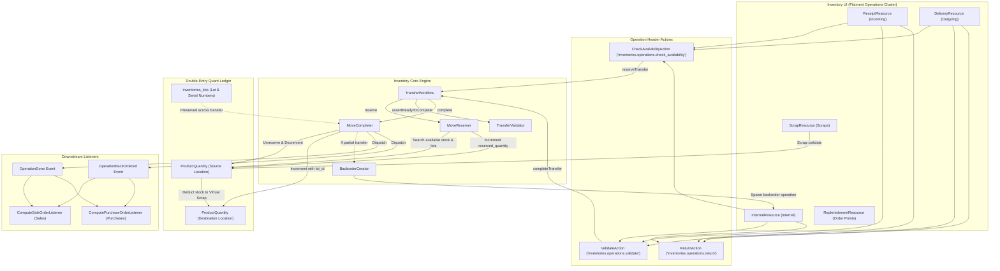

# Inventory & Warehouse Operations Workflow

## 1. Scope

This document details the verified end-to-end warehouse logistics and stock tracking workflows identified in the Aureus ERP repository. It covers the verified double-entry inventory ledger architecture, operation types, internal transfers, lot/serial number tracking and persistence, replenishment order point thresholds, scrap write-offs, stock reservations, backorders, and multi-step transfer execution.

The inventory domain operates across several collaborating modules:
- **`inventories`** (`plugins/webkul/inventories`): Core engine for warehouses, locations, operation types, stock moves (`inventories_moves`), move lines (`inventories_move_lines`), physical quants (`inventories_product_quantities`), lot/serial tracking (`inventories_lots`), packages (`inventories_packages`), scraps (`inventories_scraps`), and replenishment order points (`inventories_order_points`).
- **`products`** (`plugins/webkul/products`): Defines product master data, tracking options (`ProductTracking::QTY`, `ProductTracking::LOT`, `ProductTracking::SERIAL`), units of measure, and logistics categories.
- **`sales`** (`plugins/webkul/sales`): Generates outward delivery demand (`OperationType::OUTGOING`).
- **`purchases`** (`plugins/webkul/purchases`): Generates inward receipt demand (`OperationType::INCOMING` and `OperationType::DROPSHIP`).
- **`manufacturing`** (`plugins/webkul/manufacturing`): Generates production picking and assembly movements (`OperationType::MANUFACTURE`).

---

## 2. Entry Points

### Primary UI Entry Points (Filament Admin Panel - `Operations` Cluster)
- **Incoming Receipts**: `ReceiptResource` (`plugins/webkul/inventories/src/Filament/Clusters/Operations/Resources/ReceiptResource.php`)
  - Route: `/admin/inventories/operations/receipts`
  - Sub-navigation: `ViewReceipt`, `EditReceipt`, `ManageMoves`
- **Delivery Orders**: `DeliveryResource` (`plugins/webkul/inventories/src/Filament/Clusters/Operations/Resources/DeliveryResource.php`)
  - Route: `/admin/inventories/operations/deliveries`
  - Sub-navigation: `ViewDelivery`, `EditDelivery`, `ManageMoves`
- **Internal Transfers**: `InternalResource` (`plugins/webkul/inventories/src/Filament/Clusters/Operations/Resources/InternalResource.php`)
  - Route: `/admin/inventories/operations/internals`
  - Sub-navigation: `ViewInternal`, `EditInternal`, `ManageMoves`
- **Dropship Transfers**: `DropshipResource` (`plugins/webkul/inventories/src/Filament/Clusters/Operations/Resources/DropshipResource.php`)
  - Route: `/admin/inventories/operations/dropships`
  - Sub-navigation: `ViewDropship`, `EditDropship`, `ManageMoves`
- **Physical Inventory Adjustments**: `QuantityResource` (`plugins/webkul/inventories/src/Filament/Clusters/Operations/Resources/QuantityResource.php`)
  - Route: `/admin/inventories/operations/quantities`
- **Replenishment (Order Points)**: `ReplenishmentResource` (`plugins/webkul/inventories/src/Filament/Clusters/Operations/Resources/ReplenishmentResource.php`)
  - Route: `/admin/inventories/operations/replenishments`
- **Scrap Orders**: `ScrapResource` (`plugins/webkul/inventories/src/Filament/Clusters/Operations/Resources/ScrapResource.php`)
  - Route: `/admin/inventories/operations/scraps`
  - Sub-navigation: `ViewScrap`, `EditScrap`, `ManageMoves`

### REST API v1 Entry Points
- `POST /api/v1/inventories/receipts` & `POST .../{id}/validate`, `cancel`, `check-availability`
- `POST /api/v1/inventories/deliveries` & `POST .../{id}/validate`, `cancel`, `check-availability`
- `POST /api/v1/inventories/internal-transfers` & `POST .../{id}/validate`, `cancel`, `check-availability`
- `POST /api/v1/inventories/dropships` & `POST .../{id}/validate`, `cancel`, `check-availability`
- `POST /api/v1/inventories/quantities` (Physical Inventory Adjustment)
- `POST /api/v1/inventories/scraps` (Scrap execution)

[VERIFIED]
Evidence: `plugins/webkul/inventories/src/Filament/Clusters/Operations/Resources/`, `plugins/webkul/inventories/routes/api.php`

---

## 3. Preconditions

1. **Company & Multi-Warehouse Configuration**: Active `Company` record with configured default `Warehouse` and storage locations.
2. **Double-Entry Location Hierarchy**:
   - Physical internal locations (`LocationType::INTERNAL`): e.g. `WH/Stock`, `WH/Input`, `WH/Output`, `WH/Quality Control`.
   - Partner virtual locations: Vendor (`LocationType::SUPPLIER`), Customer (`LocationType::CUSTOMER`).
   - Virtual inventory locations: Loss/Gain (`LocationType::INVENTORY`), Production (`LocationType::PRODUCTION`), Transit (`LocationType::TRANSIT`).
3. **Storable Products**: Products configured with `type = ProductType::GOODS` and `is_storable = true`.
4. **Operation Types**: Pre-seeded `OperationType` records defining default source/destination locations and sequence codes (`IN`, `OUT`, `INT`, `DS`, `MO`).

[VERIFIED]
Evidence: `plugins/webkul/inventories/database/migrations/2025_01_06_072224_create_inventories_locations_table.php`, `plugins/webkul/inventories/database/seeders/`

---

## 4. Full Operation Taxonomy

Aureus ERP defines five operation types in `Webkul\Inventory\Enums\OperationType`. Below is the verified implementation status and execution profile for each:

```
┌──────────────────────────────────────────────────────────────────────────────────────────────────┐
│                                    OperationType Enum Matrix                                     │
├───────────────────┬─────────────────────────┬──────────────────────┬─────────────────────────────┤
│ Enum Value        │ Enum Exists [VERIFIED]  │ Workflow Implemented │ Primary Creation Site       │
├───────────────────┼─────────────────────────┼──────────────────────┼─────────────────────────────┤
│ INCOMING          │ [VERIFIED]              │ [VERIFIED]           │ ReceiptPlanner (Purchases)  │
│ OUTGOING          │ [VERIFIED]              │ [VERIFIED]           │ DeliveryPlanner (Sales)     │
│ INTERNAL          │ [VERIFIED]              │ [VERIFIED]           │ Manual / Multi-Step Routes  │
│ DROPSHIP          │ [VERIFIED]              │ [VERIFIED]           │ ReceiptPlanner (Dropship)   │
│ MANUFACTURE       │ [VERIFIED]              │ [VERIFIED]           │ OrderWorkflow (MO)          │
└───────────────────┴─────────────────────────┴──────────────────────┴─────────────────────────────┘
```

### 1. Inward Goods Receipt (`OperationType::INCOMING`)
- **Creation Site**: `Webkul\Purchase\Services\ReceiptPlanner::planForOrder()` or manual via `ReceiptResource`.
- **Trigger**: Confirmation of a Purchase Order (`OrderConfirmed`) or manual vendor intake.
- **UI Entry Point**: `ReceiptResource` / `PurchaseOrderReceiptResource`.
- **Source → Destination**: `LocationType::SUPPLIER` (Partner Locations/Vendors) → `LocationType::INTERNAL` (`WH/Stock` or `WH/Input`).
- **Validation**: `ValidateAction` → `TransferWorkflow::complete()` → `MoveCompleter::complete()`.
- **Move Behavior**: Converts `MoveState` to `DONE`. Increments on-hand balance in `ProductQuantity` at destination location.
- **State Transition**: `OperationState::DRAFT` / `ASSIGNED` → `OperationState::DONE`.
- **Downstream Effect**: Dispatches `OperationDone` / `OperationBackOrdered`. Caught by `ComputePurchaseOrderListener` in `purchases` to update `qty_received` and `receipt_status`.

### 2. Outward Delivery Order (`OperationType::OUTGOING`)
- **Creation Site**: `Webkul\Sale\Services\DeliveryPlanner::planForOrder()` or manual via `DeliveryResource`.
- **Trigger**: Confirmation of a Sale Order (`OrderConfirmed`) or manual warehouse dispatch.
- **UI Entry Point**: `DeliveryResource` / `SaleOrderDeliveryResource`.
- **Source → Destination**: `LocationType::INTERNAL` (`WH/Stock` or `WH/Output`) → `LocationType::CUSTOMER` (Partner Locations/Customers).
- **Validation**: `ValidateAction` → `TransferWorkflow::complete()` → `MoveCompleter::complete()`.
- **Move Behavior**: Decrements `quantity` and `reserved_quantity` in `ProductQuantity` at source location.
- **State Transition**: `OperationState::CONFIRMED` / `ASSIGNED` → `OperationState::DONE`.
- **Downstream Effect**: Dispatches `OperationDone` / `OperationBackOrdered`. Caught by `ComputeSaleOrderListener` in `sales` to update `qty_delivered` and `delivery_status`.

### 3. Internal Transfer (`OperationType::INTERNAL`)
- **Creation Site**: Manual via `InternalResource` or chained intermediate steps in multi-step logistics routes (e.g. `WH/Input → WH/Quality Control → WH/Stock`).
- **Trigger**: Manual stock relocation or upstream route progression (`PushRuleRunner` / `reserveWaitingOnRestock`).
- **UI Entry Point**: `InternalResource`.
- **Source → Destination**: `LocationType::INTERNAL` (e.g. `WH/Stock/Zone A`) → `LocationType::INTERNAL` (e.g. `WH/Stock/Zone B` or `WH-2/Stock`).
- **Validation**: `ValidateAction` → `TransferWorkflow::complete()`.
- **Move Behavior**: Simultaneously decrements source quant and increments destination quant in `ProductQuantity`. Preserves lot/serial and package tracking.
- **State Transition**: `OperationState::DRAFT` → `CONFIRMED` → `ASSIGNED` → `DONE`.
- **Downstream Effect**: Dispatches `OperationDone`. Unblocks downstream chained moves waiting on stock restock.

### 4. Dropship Transfer (`OperationType::DROPSHIP`)
- **Creation Site**: `ReceiptPlanner::planForOrder()` when purchase order has `destination_address_id` set.
- **Trigger**: Confirmation of a Dropship Purchase Order.
- **UI Entry Point**: `DropshipResource`.
- **Source → Destination**: `LocationType::SUPPLIER` → `LocationType::CUSTOMER`.
- **Validation**: `ValidateAction` → `TransferWorkflow::complete()`.
- **Move Behavior**: Completes stock moves between virtual locations without incrementing physical internal warehouse inventory.
- **State Transition**: `OperationState::DRAFT` → `DONE`.
- **Downstream Effect**: Dispatches `OperationDone`, updating received quantities on PO and delivered quantities on linked SO.

### 5. Manufacturing Operation (`OperationType::MANUFACTURE`)
- **Creation Site**: `Webkul\Manufacturing\Services\OrderWorkflow` in `manufacturing`.
- **Trigger**: Production order creation and confirmation.
- **UI Entry Point**: `ManufacturingOrderResource` in `manufacturing` plugin.
- **Source → Destination**: `LocationType::INTERNAL` (`WH/Stock`) → `LocationType::PRODUCTION` (Raw Materials) and `LocationType::PRODUCTION` → `LocationType::INTERNAL` (Finished Goods).
- **Validation**: Handled via `OrderWorkflow::complete()` and `ProductionRecorder::record()`.
- **Move Behavior**: Consumes components from stock and creates finished goods inventory.

[VERIFIED]
Evidence: `plugins/webkul/inventories/src/Services/TransferWorkflow.php`, `plugins/webkul/inventories/src/Services/MoveCompleter.php`, `plugins/webkul/inventories/src/Services/MoveReserver.php`

---

## 5. Internal Transfer Workflow

```
[1] User creates Internal Transfer (InternalResource)
     │
     ├── Selects Operation Type (Internal)
     ├── Selects Source Location (e.g., WH/Stock/Bin-1)
     ├── Selects Destination Location (e.g., WH/Stock/Bin-2)
     └── Adds Line Items (Product, Requested Quantity, Unit of Measure)
     │
     ▼
[2] Reserve Stock / Check Availability (CheckAvailabilityAction)
     │
     ├── MoveReserver::reserve() searches ProductQuantity at Source Location
     ├── Applies removal strategy (FIFO / LIFO / Closest Location)
     ├── Allocates available Lots / Serial numbers
     ├── Increments reserved_quantity in ProductQuantity
     └── Creates MoveLine records with lot_id and package_id
     │
     ▼
[3] Validate Internal Transfer (ValidateAction)
     │
     ├── TransferValidator::assertReadyToComplete() ensures quantities are picked
     ├── MoveCompleter::settleStock() executes double-entry balance adjustment:
     │     ├── Decrements quantity & reserved_quantity at Source Location
     │     └── Increments quantity at Destination Location (preserving lot_id)
     ├── Sets Move & Operation state = DONE
     └── Dispatches: Webkul\Inventory\Events\OperationDone
```

### Detailed Trace of Internal Movement
1. **Creation**: The user accesses `InternalResource\Pages\CreateInternal` and specifies `source_location_id` and `destination_location_id` (both of `LocationType::INTERNAL`).
2. **Move Confirmation**: Draft moves are confirmed via `MoveConfirmer::confirm()`, transitioning to `MoveState::CONFIRMED`.
3. **Reservation (`CheckAvailabilityAction`)**:
   - `MoveReserver::reserveFromLocation()` checks `ProductQuantity` at `source_location_id`.
   - If stock is sufficient, `reserved_quantity` is incremented, `MoveState` transitions to `ASSIGNED`, and `OperationState` becomes `ASSIGNED`.
   - `MoveLine` records are created for the specific lot/serial numbers reserved.
4. **Validation (`ValidateAction`)**:
   - `TransferWorkflow::complete()` invokes `MoveCompleter::complete()`.
   - `MoveCompleter::settleStock()` applies atomic quantity adjustments via `MoveLine::applyQuantityChange()`:
     - Source quant: `quantity = quantity - uom_qty`, `reserved_quantity = reserved_quantity - uom_qty`.
     - Destination quant: `quantity = quantity + uom_qty` (matching `lot_id` and `package_id`).
   - `OperationState` transitions to `DONE`, and `OperationDone` is dispatched.

[VERIFIED]
Evidence: `plugins/webkul/inventories/src/Services/TransferWorkflow.php:23-62`, `plugins/webkul/inventories/src/Services/MoveCompleter.php:188-233`, `plugins/webkul/inventories/src/Filament/Clusters/Operations/Resources/InternalResource.php`

---

## 6. Replenishment & Order Points Analysis

### Source Investigation: `inventories_order_points` / `OrderPoint`

Aureus ERP provides reordering rules through the `OrderPoint` model (`inventories_order_points`) managed in `ReplenishmentResource`.

```
┌────────────────────────────────────────────────────────────────────────────────────────┐
│               Replenishment Order Point Schema (inventories_order_points)              │
├──────────────────────────┬─────────────────────────┬───────────────────────────────────┤
│ Column                   │ Type                    │ Purpose                           │
├──────────────────────────┼─────────────────────────┼───────────────────────────────────┤
│ product_id               │ foreignId (products)    │ Target storable product           │
│ warehouse_id             │ foreignId (warehouses)  │ Target warehouse                  │
│ location_id              │ foreignId (locations)   │ Specific stock storage location   │
│ product_min_qty          │ decimal:4 (default: 0)  │ Reordering threshold trigger      │
│ product_max_qty          │ decimal:4 (default: 0)  │ Target replenishment ceiling      │
│ qty_multiple             │ decimal:4 (default: 0)  │ Batch order quantity rounding     │
│ qty_to_order_manual      │ decimal:4 (default: 0)  │ Manual order override quantity    │
│ trigger                  │ OrderPointTrigger enum  │ 'manual' vs 'automatic'           │
│ snoozed_until            │ date (nullable)         │ Temporary reminder suppression    │
└──────────────────────────┴─────────────────────────┴───────────────────────────────────┘
```

### Reality Check: Does Low Stock Automatically Create Another Document?

1. **Threshold & Master Data Definition**:
   - `OrderPoint` stores minimum stock (`product_min_qty`), maximum target stock (`product_max_qty`), order multiples (`qty_multiple`), and location associations.
2. **Absence of Background Procurement Automation**:
   - There is **NO background scheduler, cron job, console command, or database trigger** that monitors inventory balances and automatically generates Purchase Requisitions, RFQs, Purchase Orders, or Manufacturing Orders when on-hand stock falls below `product_min_qty`.
3. **Empty Execution Stubs in Procurement Engine**:
   - In `Webkul\Inventory\Services\ProcurementRunner`:
     ```php
     protected function runBuyRules(Collection $pairs): void {}

     protected function runManufactureRules(Collection $pairs): void {}
     ```
   - Automated "Buy" and "Manufacture" procurement dispatch handlers are explicitly empty stubs (`{}`).
4. **Summary**:
   - A low-stock order point **ONLY records and represents a threshold / configuration record**. It does **NOT** automatically create downstream procurement or manufacturing documents.

[VERIFIED]
Evidence: `plugins/webkul/inventories/src/Models/OrderPoint.php`, `plugins/webkul/inventories/src/Services/ProcurementRunner.php:194-197`, `plugins/webkul/inventories/src/Filament/Clusters/Operations/Resources/ReplenishmentResource.php`

---

## 7. Scrap Workflow

```
[1] User creates Scrap Document (ScrapResource)
     │
     ├── Selects Storable Product
     ├── Specifies Quantity & Unit of Measure
     ├── Selects Source Location (e.g., WH/Stock)
     ├── Destination Location defaults to Virtual Scrap Location (LocationType::INVENTORY)
     └── Selects optional Lot / Serial number & Package
     │
     ▼
[2] User clicks "Validate" (ValidateAction on ScrapResource)
     │
     ├── Scrap::validate() checks stock availability in ProductQuantity:
     │     └── Checks if on-hand quantity at source location >= scrap quantity
     │           │
     │           ├── IF INSUFFICIENT: Returns false (Aborts validation)
     │           │
     │           └── IF SUFFICIENT:
     │                 ├── Decrements quantity in ProductQuantity at Source Location
     │                 ├── Increments quantity in ProductQuantity at Virtual Scrap Location
     │                 ├── Sets Scrap state = DONE and closed_at = now()
     │                 ├── Generates balancing Move (state = DONE, scrap_id = scrap.id)
     │                 └── Generates balancing MoveLine (with lot_id and package_id)
     │
     ▼
[3] Direct On-Hand Stock Write-Off Completed
```

### Key Scrap Mechanics
1. **Source & Destination**:
   - Source: Physical internal location (`LocationType::INTERNAL`).
   - Destination: Virtual scrap/loss location (`LocationType::INVENTORY`, e.g. `Virtual Locations/Scrap`).
2. **Atomic Inventory Write-Off**:
   - `Scrap::validate()` directly decrements the source `ProductQuantity` row and increments the virtual destination `ProductQuantity` row.
   - It then creates a balancing `Move` record with `state = MoveState::DONE` and `is_picked = true`.
3. **Lot & Serial Tracking**:
   - If a lot or serial number is specified (`lot_id`), the stock deduction specifically targets that lot's quant row, and the generated `MoveLine` permanently records the scrapped lot.

[VERIFIED]
Evidence: `plugins/webkul/inventories/src/Models/Scrap.php:185-267`, `plugins/webkul/inventories/src/Filament/Clusters/Operations/Resources/ScrapResource.php`

---

## 8. Lot & Serial Number Traceability

### Traceability Lifecycle

```
┌──────────────────────────────────────────────────────────────────────────────────────────────────┐
│                                 Lot & Serial Number Progression                                  │
├───────────────────────┬──────────────────────────────────────────────────────────────────────────┤
│ Stage                 │ Mechanism & Implementation                                               │
├───────────────────────┼──────────────────────────────────────────────────────────────────────────┤
│ 1. Inward Receipt     │ Created on arrival (`use_create_lots`) or matched against existing lots   │
│                       │ (`use_existing_lots`). Stored in `inventories_lots`. Assigned to         │
│                       │ `MoveLine::lot_id` and recorded in `ProductQuantity` at WH/Stock.       │
├───────────────────────┼──────────────────────────────────────────────────────────────────────────┤
│ 2. Stock at Rest      │ Quant rows in `inventories_product_quantities` are keyed by              │
│                       │ `(product_id, location_id, lot_id, package_id, company_id)`.            │
├───────────────────────┼──────────────────────────────────────────────────────────────────────────┤
│ 3. Reservation        │ `MoveReserver::reserve()` allocates specific lots matching removal       │
│                       │ strategies (FIFO, LIFO, Closest Location), increments `reserved_quantity` │
│                       │ on that specific quant row, and populates `MoveLine::lot_id`.            │
├───────────────────────┼──────────────────────────────────────────────────────────────────────────┤
│ 4. Movement Execution │ `MoveCompleter::settleStock()` decrements source quant with `lot_id` and  │
│                       │ increments destination quant with the exact same `lot_id`.               │
├───────────────────────┼──────────────────────────────────────────────────────────────────────────┤
│ 5. Outward Delivery   │ Decrements `quantity` and `reserved_quantity` at WH/Stock for `lot_id`.  │
│                       │ Quant balance reaches 0; `ProductQuantity::purgeEmpty()` cleans up.      │
└───────────────────────┴──────────────────────────────────────────────────────────────────────────┘
```

### Crucial Finding: Does a Lot/Serial Identity Survive an Internal Transfer?

**Yes, lot and serial number identities survive internal transfers completely.**

**Detailed Code Trace**:
1. **Selection & Reservation**:
   - When an internal transfer is reserved (`MoveReserver::reserve()`), `MoveReserver::reserveFromLocation()` inspects available quants at the source location.
   - For tracked products (`ProductTracking::LOT` or `ProductTracking::SERIAL`), it selects available lots and instantiates `MoveLine` records with `'lot_id' => $quant->lot_id` and `'lot_name' => $lot->name`.
2. **Validation & Atomic Stock Transfer**:
   - When the transfer is validated, `MoveCompleter::settleStock()` loops through each `MoveLine`.
   - It calls `$line->applyQuantityChange(-$line->uom_qty, $line->sourceLocation, lot: $line->lot)`. This decrements `quantity` and `reserved_quantity` in `ProductQuantity` for `(product_id, source_location_id, lot_id)`.
   - It immediately calls `$line->applyQuantityChange($line->uom_qty, $line->destinationLocation, lot: $line->lot)`. This creates or increments the `ProductQuantity` row for `(product_id, destination_location_id, lot_id)`.
3. **Persistence**:
   - The master `Lot` entity (`inventories_lots`) remains unchanged.
   - The physical location of that lot in the quant ledger is transferred from `source_location_id` to `destination_location_id`.
   - Both the historical `MoveLine` records and the active `ProductQuantity` table maintain full traceability of the lot.

[VERIFIED]
Evidence: `plugins/webkul/inventories/src/Services/MoveReserver.php:129-151,188-200`, `plugins/webkul/inventories/src/Services/MoveCompleter.php:76-144,188-233`, `plugins/webkul/inventories/src/Models/MoveLine.php`

---

## 9. Edge Cases & Error Handling

1. **Negative Quantity Protection**:
   - `MoveCompleter::completeLines()` asserts that no move line contains negative quantities (`float_compare($line->qty, 0) < 0`), throwing an exception (`inventories::system.inventory-manager.validate.no-negative-quantities`).
2. **Missing Lot/Serial Numbers on Validation**:
   - If an operation type requires lots (`use_create_lots` or `use_existing_lots`) and a tracked product is picked without lot assignment, `TransferValidator::assertReadyToComplete()` throws an exception (`inventories::filament/clusters/operations/actions/validate.notification.warning.lot-missing.body`).
3. **Serial Number Uniqueness**:
   - `Move::assertSerialUniqueness()` enforces that serial-tracked products (`ProductTracking::SERIAL`) cannot have quantities greater than 1 per serial number in stock.
4. **Partial Package Integrity Protection**:
   - `MoveCompleter::assertPackagesStayWhole()` validates that individual package containers are not split across multiple locations simultaneously (`inventories::filament/clusters/operations/actions/validate.notification.warning.partial-package.body`).
5. **Cancellation Barrier on Done Moves**:
   - `MoveCanceller::cancel()` strictly prevents cancelling any stock move that has already reached `MoveState::DONE` (`inventories::system.inventory-manager.cancel-move.already-done`), ensuring double-entry ledger integrity.
6. **Partial Transfers & Backorder Splitting**:
   - When actual picked quantities are less than initial demand, `ValidateAction` prompts the user. If backorders are allowed, `BackorderCreator::createFor()` spawns a child `Operation` linked via `back_order_id`, transferring remaining unpicked moves to the new document.

[VERIFIED]
Evidence: `plugins/webkul/inventories/src/Services/MoveCompleter.php:86-94,258-278`, `plugins/webkul/inventories/src/Services/MoveCanceller.php:12-17`, `plugins/webkul/inventories/src/Services/TransferValidator.php:14-35`

---

## 10. Authorization / Security

1. **Permissions Matrix**:
   - Enforced by `OperationPolicy`, `MovePolicy`, `ScrapPolicy`, `LotPolicy`, `OrderPointPolicy`, and `WarehousePolicy`.
   - Uses `HasScopedPermissions` to support granular `GLOBAL`, `GROUP`, and `INDIVIDUAL` resource scopes.
2. **Multi-Tenant Company Scoping**:
   - `Operation`, `Move`, `MoveLine`, `ProductQuantity`, `Scrap`, and `Lot` models implement `BelongsToCompany` and global `CompanyScope`.
   - `ChecksCrossCompanyTransfer` prevents executing stock transfers across mismatched company boundaries unless transit locations are configured.

[VERIFIED]
Evidence: `plugins/webkul/inventories/src/Policies/OperationPolicy.php`, `plugins/webkul/inventories/src/Policies/ScrapPolicy.php`

---

## 11. Models / Data Architecture

### Core Database Tables
- **`inventories_operations`**: Master transfer documents storing operation type, source/destination locations, partner, procurement group, and state (`OperationState`).
- **`inventories_moves`**: Demand and planned movements between locations with quantities, unit of measure, and state (`MoveState`).
- **`inventories_move_lines`**: Execution lines tracking actual picked quantities, lot/serial numbers (`lot_id`), source packages (`package_id`), and destination packages (`result_package_id`).
- **`inventories_product_quantities`**: Quant inventory ledger holding physical stock balances and reservations per `(product_id, location_id, lot_id, package_id, company_id)`.
- **`inventories_lots`**: Master serial and lot numbers with optional expiration timestamps.
- **`inventories_packages`**: Physical shipping containers and pallets.
- **`inventories_scraps`**: Scrap orders recording stock write-offs to virtual inventory locations.
- **`inventories_order_points`**: Reordering min/max replenishment threshold definitions.

[VERIFIED]
Evidence: `plugins/webkul/inventories/database/migrations/`

---

## 12. Events / Listeners / Observers Catalog

| Event Class | Dispatched By | Trigger Timing | Handled By Listener | Cross-Plugin Effect |
| :--- | :--- | :--- | :--- | :--- |
| `Webkul\Inventory\Events\OperationConfirmed` | `TransferWorkflow::confirm()` | Synchronous when operation moves are confirmed. | None registered | Internal state signaling. |
| `Webkul\Inventory\Events\OperationAssigned` | `TransferWorkflow::reserve()` | Synchronous when stock is reserved. | None registered | Internal state signaling. |
| `Webkul\Inventory\Events\OperationDone` | `TransferWorkflow::complete()` | Synchronous when transfer is validated. | `Webkul\Sale\Listeners\ComputeSaleOrderListener`<br>`Webkul\Purchase\Listeners\ComputePurchaseOrderListener` | Updates `qty_delivered` on SO and `qty_received` on PO. |
| `Webkul\Inventory\Events\OperationBackOrdered` | `TransferWorkflow::complete()` | Synchronous when transfer is partially validated with backorder. | `Webkul\Sale\Listeners\ComputeSaleOrderListener`<br>`Webkul\Purchase\Listeners\ComputePurchaseOrderListener` | Updates delivered/received quantities and sets partial delivery/receipt status. |
| `Webkul\Inventory\Events\OperationCanceled` | `TransferWorkflow::cancel()` | Synchronous when transfer is cancelled. | None registered | Signals document cancellation. |
| `Webkul\Inventory\Events\OperationReturned` | `TransferWorkflow::createReturn()` | Synchronous when return operation is created. | None registered | Signals return creation. |

[VERIFIED]
Evidence: `plugins/webkul/inventories/src/Events/*.php`, `plugins/webkul/sales/src/SaleServiceProvider.php:97-100`, `plugins/webkul/purchases/src/PurchaseServiceProvider.php:101-104`

---

## 13. Business Rules Observed

1. **Double-Entry Balance Preservation**: Every physical or virtual stock change occurs as a balanced transfer between a source location and a destination location.
2. **Strict Non-Negative Line Quantities**: Stock move lines cannot be completed with negative quantities.
3. **Immutable Completed Moves**: A stock move in `DONE` state can never be cancelled directly; it must be reversed via a formal return transfer (`ReturnAction`).
4. **Package Indivisibility**: An existing container/package cannot be partially placed in multiple physical locations simultaneously.
5. **Replenishment Threshold Passivity**: Order points do not autonomously spawn procurement documents; they serve as master threshold definitions.

[VERIFIED]
Evidence: `plugins/webkul/inventories/src/Services/`

---

## 14. Unknowns / Inferences

### [UNKNOWN]
1. **Automated Order Point Trigger Execution**: While `OrderPointTrigger::AUTOMATIC` exists in `OrderPointTrigger.php`, the automated daemon or cron engine intended to process automatic order points is [UNKNOWN] / not present in active source code.

### [INFERRED]
1. **Order Point Future Roadmap**: The presence of `snoozed_until`, `qty_to_order_manual`, and `order_point_id` foreign keys on purchase and manufacturing lines indicates that a future automated replenishment daemon is planned, but remains unbuilt in the current codebase version.

---

## 15. Evidence References

| Area | File Path | Key Symbols |
| :--- | :--- | :--- |
| **Transfer Workflow** | `plugins/webkul/inventories/src/Services/TransferWorkflow.php` | `TransferWorkflow::confirm()`, `reserve()`, `complete()`, `cancel()`, `createReturn()` |
| **Move Completer Service** | `plugins/webkul/inventories/src/Services/MoveCompleter.php` | `MoveCompleter::complete()`, `completeLines()`, `settleStock()`, `assertPackagesStayWhole()` |
| **Move Reserver Service** | `plugins/webkul/inventories/src/Services/MoveReserver.php` | `MoveReserver::reserve()`, `release()`, `reserveFromLocation()`, `drawFromUpstream()` |
| **Procurement Runner** | `plugins/webkul/inventories/src/Services/ProcurementRunner.php` | `ProcurementRunner::run()`, `runPullRules()`, `runBuyRules()`, `runManufactureRules()` |
| **Scrap Model** | `plugins/webkul/inventories/src/Models/Scrap.php` | `Scrap::validate()`, `getInventoryMoveValues()` |
| **Order Point Model** | `plugins/webkul/inventories/src/Models/OrderPoint.php` | `OrderPoint` schema, `trigger`, `product_min_qty`, `product_max_qty` |
| **Filament Validate Action** | `plugins/webkul/inventories/src/Filament/Clusters/Operations/Actions/ValidateAction.php` | `ValidateAction::setUp()`, `canCreateBackOrder()`, `executeDoneTransfer()` |
| **Filament Check Availability** | `plugins/webkul/inventories/src/Filament/Clusters/Operations/Actions/CheckAvailabilityAction.php` | `CheckAvailabilityAction::setUp()` |
| **Filament Return Action** | `plugins/webkul/inventories/src/Filament/Clusters/Operations/Actions/ReturnAction.php` | `ReturnAction::setUp()` |
| **Internal Transfer Resource** | `plugins/webkul/inventories/src/Filament/Clusters/Operations/Resources/InternalResource.php` | `InternalResource` definition |

---

## 16. Mermaid Flowchart


