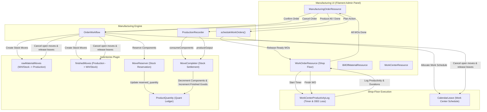

# Discrete Manufacturing & Shop-Floor Execution Workflow

## 1. Scope

This document details the discrete manufacturing, Bill of Materials (BOM) engineering, work center scheduling, shop-floor work order (WO) execution, real-time timer tracking, raw material component consumption, finished goods stock creation, multi-step warehouse routing, and order cancellation workflows implemented in Aureus ERP.

The manufacturing process operates across collaborating modules:
- **`manufacturing`** (`plugins/webkul/manufacturing`): Manages Bills of Materials (`BillOfMaterial`), work centers (`WorkCenter`), routing operations (`Operation`), manufacturing orders (`Order`), work orders (`WorkOrder`), productivity logs (`WorkCenterProductivityLog`), and OEE tracking.
- **`inventories`** (`plugins/webkul/inventories`): Manages component stock reservation (`MoveReserver`), inventory movements (`inventories_moves`), double-entry stock consumption (`MoveCompleter`), and finished goods quant increments (`ProductQuantity`).
- **`products`** (`plugins/webkul/products`): Provides component and finished product master data, tracking options (`ProductTracking`), units of measure, and variant attributes.

---

## 2. Entry Points

### Primary UI Entry Points (Filament Admin Panel - `Operations` & `Products` Clusters)
- **Manufacturing Orders (MOs)**:
  - `ManufacturingOrderResource`: Route `/admin/manufacturing/operations/manufacturing-orders` (`plugins/webkul/manufacturing/src/Filament/Clusters/Operations/Resources/ManufacturingOrderResource.php`)
  - Sub-navigation: `CreateManufacturingOrder`, `EditManufacturingOrder`, `ViewManufacturingOrder`, `ManageWorkOrders`
- **Work Orders (Shop-Floor Work Orders)**:
  - `WorkOrderResource`: Route `/admin/manufacturing/operations/work-orders` (`plugins/webkul/manufacturing/src/Filament/Clusters/Operations/Resources/WorkOrderResource.php`)
  - Sub-navigation: `ViewWorkOrder`, `EditWorkOrder`
- **Bills of Materials (BOMs)**:
  - `BillOfMaterialResource`: Route `/admin/manufacturing/products/bills-of-materials` (`plugins/webkul/manufacturing/src/Filament/Clusters/Products/Resources/BillsOfMaterialResource.php`)
- **Work Centers & Routing Operations**:
  - `WorkCenterResource`: Route `/admin/manufacturing/configurations/work-centers`
  - `OperationResource`: Route `/admin/manufacturing/configurations/operations`

### REST API v1 Entry Points
- Currently, manufacturing orders and work orders are managed primarily through the administrative Filament panel. Dedicated REST API v1 endpoints for manufacturing are [NOT IMPLEMENTED / UNKNOWN] (unlike `inventories`, `sales`, and `purchases` which expose full API v1 suites).

[VERIFIED]
Evidence: `plugins/webkul/manufacturing/src/Filament/Clusters/`

---

## 3. Preconditions

1. **Finished Storable Product**: A `Product` record with `type = ProductType::GOODS`, `is_storable = true`, and defined Unit of Measure (`uom_id`).
2. **Bill of Materials (BOM)**: An active `BillOfMaterial` record (`type = BillOfMaterialType::NORMAL`) containing at least one component line (`BillOfMaterialLine`).
3. **Warehouse Manufacturing Routing**: A `Warehouse` configured with manufacturing operation types (`manufacturing_type_id`, and optional `pbm_type_id` / `sam_type_id` for multi-step routing) and a virtual Production location (`LocationType::PRODUCTION`).
4. **Work Centers & Operations (Optional for Work Orders)**: Active `WorkCenter` records with assigned working calendars (`Calendar`) and configured `Operation` routing steps.

[VERIFIED]
Evidence: `plugins/webkul/manufacturing/src/Models/BillOfMaterial.php`, `plugins/webkul/manufacturing/src/Models/Order.php:598-600`

---

## 4. Main Flow: Production Order Lifecycle

| # | Step Name | UI Trigger | Code Path | State Change | Event Dispatched | Downstream Interaction |
| :--- | :--- | :--- | :--- | :--- | :--- | :--- |
| **1** | **MO Creation & BOM Selection** | Production planner creates MO on `ManufacturingOrderResource`. | `CreateManufacturingOrder::handleRecordCreation()` → `Order::boot()` → `Order::computeName()` | `Order::state` = `draft`<br>`Order::reservation_state` = `null` | None | Allocates sequential number `MO/YYYY/#####` via `SequenceService`. Populates components from BOM. |
| **2** | **Order Confirmation & Stock Demand** | Planner clicks "Confirm" on MO page (`ConfirmAction`). | `ConfirmAction::action()` → `OrderWorkflow::confirm()` | `Order::state` = `confirmed`<br>`Order::reservation_state` = `confirmed` (or `waiting`) | `Webkul\Manufacturing\Events\OrderConfirmed` | Generates component stock moves (`rawMaterialMoves`) targeting `production_location_id`, finished goods move (`finishedMoves`), and links work orders. |
| **3** | **Component Stock Reservation** | Planner clicks "Check Availability" (`CheckAvailabilityAction`) or automated at confirmation. | `CheckAvailabilityAction::action()` → `MoveReserver::reserve()` | `Move::state` = `assigned` (or `partially_assigned`)<br>`Order::reservation_state` = `assigned` | `Webkul\Inventory\Events\OperationAssigned` | Reserves raw material quants in `ProductQuantity` at `WH/Stock`, creating `MoveLine` records with assigned lots. |
| **4** | **Work Order Planning & Scheduling** | Planner clicks "Plan" (`PlanAction`). | `PlanAction::action()` → `OrderWorkflow::plan()` → `OrderWorkflow::scheduleWorkOrders()` | `Order::is_planned` = `true`<br>`WorkOrder::state` = `ready` (for unblocked ops) | `Webkul\Manufacturing\Events\OrderPlanned` | Evaluates operation dependency graph (`blockedByWorkOrders`) and creates `CalendarLeave` time reservations on work center calendars. |
| **5** | **Shop-Floor WO Execution & Timers** | Operator clicks "Start" on Work Order (`StartAction`). | `StartAction::action()` → `WorkOrder::start()` | `WorkOrder::state` = `progress`<br>`Order::state` = `progress` | `Webkul\Manufacturing\Events\OrderStarted` | Initiates operator timer, creating a live open `WorkCenterProductivityLog` record. |
| **6** | **Work Order Completion** | Operator clicks "Done" on Work Order (`DoneAction`). | `DoneAction::action()` → `WorkOrder::finish()` | `WorkOrder::state` = `done`<br>Dependent WOs become `ready` | None | Closes productivity log, calculates actual vs expected durations, records OEE loss, and unblocks downstream operations. |
| **7** | **Final Completion & Stock Produce** | Operator / Planner clicks "Produce All" or "Done" (`DoneAction` on MO). | `DoneAction::action()` → `OrderWorkflow::complete()` → `ProductionRecorder::record()` | `Order::state` = `done`<br>`Order::is_locked` = `true`<br>`Move::state` = `done` (all moves) | `Webkul\Manufacturing\Events\OrderDone` | **Component Consumption**: Decrements components from `WH/Stock` and moves them to `Production`.<br>**Finished Goods Inward**: Increases finished product on-hand balance in `ProductQuantity` at `WH/Stock` with producing lot number. |

[VERIFIED]
Evidence: `plugins/webkul/manufacturing/src/Services/OrderWorkflow.php:24-160`, `plugins/webkul/manufacturing/src/Services/ProductionRecorder.php:13-107`, `plugins/webkul/manufacturing/src/Models/Order.php:463-535`

---

## 5. State Transitions

### `ManufacturingOrderState` Lifecycle (`manufacturing_orders.state`)

```
   ┌─────────────────────────────────────────────────────────────┐
   │                                                             │
   ▼                                                             │
┌──────────────┐       Confirm Action        ┌──────────────┐    │
│    draft     │ ──────────────────────────► │  confirmed   │    │
└──────────────┘                             └──────┬───────┘    │
                                                    │            │
                                                    │ Start / WO │
                                                    ▼            │
                                             ┌──────────────┐    │
                                             │   progress   │    │
                                             └──────┬───────┘    │
                                                    │            │
                                                    │ WOs Done   │
                                                    ▼            │
                                             ┌──────────────┐    │
                                             │   to_close   │    │
                                             └──────┬───────┘    │
                                                    │            │
                                                    │ Complete   │
                                                    ▼            │
                                             ┌──────────────┐    │
                                             │     done     │    │ (Locked MO)
                                             └──────┬───────┘    │
                                                    │            │
                                                    │ Cancel     │
                                                    ▼            │
                                             ┌──────────────┐    │
                                             │    cancel    │ ───┘
                                             └──────────────┘
```

- **`draft`**: New MO. Line items, quantities, and BOM can be adjusted freely.
- **`confirmed`**: Order confirmed. Component and finished stock moves are generated in `inventories`.
- **`progress`**: Production underway. Triggered when work orders start or when partial component quantities are picked (`rawMaterialMoves.is_picked = true`).
- **`to_close`**: All work orders have reached `DONE` or full quantity produced (`quantity_producing >= quantity`), awaiting final order close.
- **`done`**: Order completed and administratively locked (`is_locked = true`). Raw materials are consumed, and finished goods are stocked in `ProductQuantity`.
- **`cancel`**: Order cancelled. Open component reservations and inventory transfers are aborted.

### `WorkOrderState` Lifecycle (`manufacturing_work_orders.state`)
- **`pending`**: Initial state for downstream dependent operations waiting on prerequisite work orders.
- **`waiting`**: Awaiting component availability.
- **`ready`**: Prerequisites satisfied and ready for shop-floor execution.
- **`progress`**: Operator is currently running the operation (active timer in `WorkCenterProductivityLog`).
- **`done`**: Operation completed. Duration and OEE metrics recorded.
- **`cancel`**: Operation cancelled due to MO cancellation.

[VERIFIED]
Evidence: `plugins/webkul/manufacturing/src/Enums/ManufacturingOrderState.php`, `plugins/webkul/manufacturing/src/Enums/WorkOrderState.php`, `plugins/webkul/manufacturing/src/Models/Order.php:463-535`

---

## 6. Component Consumption & Inventory Integration

### Operation Type Utilization

```
┌──────────────────────────────────────────────────────────────────────────────────────────────────┐
│                               Manufacturing Inventory Movement Flow                              │
├───────────────────────┬─────────────────────────────┬────────────────────────────────────────────┤
│ Movement Stage        │ Operation Type Used         │ Physical / Virtual Locations               │
├───────────────────────┼─────────────────────────────┼────────────────────────────────────────────┤
│ 1-Step Manufacturing  │ OperationType::MANUFACTURE  │ WH/Stock (Internal)                        │
│ (Raw Consumption)     │ (type = 'manufacture')      │   └─► Virtual Locations/Production         │
├───────────────────────┼─────────────────────────────┼────────────────────────────────────────────┤
│ 1-Step Manufacturing  │ OperationType::MANUFACTURE  │ Virtual Locations/Production               │
│ (Finished Production) │ (type = 'manufacture')      │   └─► WH/Stock (Internal)                  │
├───────────────────────┼─────────────────────────────┼────────────────────────────────────────────┤
│ 2-Step / 3-Step Routing│ OperationType::INTERNAL     │ WH/Stock (Internal)                        │
│ (Component Picking)   │ (type = 'internal')         │   └─► WH/Pre-Production (PBM Location)     │
├───────────────────────┼─────────────────────────────┼────────────────────────────────────────────┤
│ 3-Step Routing        │ OperationType::INTERNAL     │ WH/Post-Production (SAM Location)          │
│ (Finished Storage)    │ (type = 'internal')         │   └─► WH/Stock (Internal)                  │
└───────────────────────┴─────────────────────────────┴────────────────────────────────────────────┘
```

### Direct Answer to Component Consumption Query:
> **"Which Operation type does component consumption use, and is it already catalogued by inventory.md?"**

1. **Operation Type Used**:
   - In standard 1-step manufacturing, component consumption utilizes the **`OperationType::MANUFACTURE`** operation type (`warehouse->manufacturing_type_id`).
   - In multi-step warehouse manufacturing (2-step / 3-step), the pre-production component picking leg utilizes **`OperationType::INTERNAL`** (Pick Components to PBM).
2. **Catalogued in `inventory.md`**:
   - **YES**. Both `OperationType::MANUFACTURE` (Section 4, item 5) and `OperationType::INTERNAL` (Section 4, item 3) are already explicitly catalogued and verified in `docs/workflows/inventory.md`.

[VERIFIED]
Evidence: `plugins/webkul/manufacturing/src/Models/Order.php:800-819`, `docs/workflows/inventory.md §4`

---

## 7. Work Center Capacity, Scheduling & Timer Tracking

```
┌────────────────────────────────────────────────────────────────────────┐
│               Work Center & Work Order Execution Engine                │
├──────────────────────────┬─────────────────────────────────────────────┤
│ Component                │ Implementation Details                      │
├──────────────────────────┼─────────────────────────────────────────────┤
│ 1. Duration Calculation  │ • 'manual' mode: Uses BOM operation         │
│                          │   time_cycle_manual                         │
│                          │ • 'auto' mode: Computes moving average of   │
│                          │   recorded historical durations             │
│                          │ • Applies WorkCenter time_efficiency rating │
├──────────────────────────┼─────────────────────────────────────────────┤
│ 2. Calendar Scheduling   │ • OrderWorkflow::scheduleWorkOrders()       │
│                          │ • Allocates CalendarLeave records on the   │
│                          │   WorkCenter working hour calendar          │
│                          │ • Computes started_at and finished_at dates │
├──────────────────────────┼─────────────────────────────────────────────┤
│ 3. Dependency Sequencing │ • blockedByWorkOrders pivot                 │
│                          │ • Downstream WOs remain in 'pending' until  │
│                          │   all upstream prerequisites reach 'done'   │
├──────────────────────────┼─────────────────────────────────────────────┤
│ 4. Operator Timers & OEE │ • WorkCenterProductivityLog tracks start,   │
│                          │   stop, duration, user_id, and loss_type    │
│                          │ • Overrun past expected duration is split   │
│                          │   into 'performance' productivity loss logs │
└──────────────────────────┴─────────────────────────────────────────────┘
```

[VERIFIED]
Evidence: `plugins/webkul/manufacturing/src/Models/WorkCenter.php`, `plugins/webkul/manufacturing/src/Models/WorkOrder.php`, `plugins/webkul/manufacturing/src/Services/OrderWorkflow.php:216-245`

---

## 8. Disassembly & Unbuild Orders Status

### Implementation Status: [NOT IMPLEMENTED / UNKNOWN]

1. **Schema & Models Present**:
   - Model `UnbuildOrder` (`manufacturing_unbuild_orders`), factory `UnbuildOrderFactory`, and policy `UnbuildOrderPolicy` exist.
   - Foreign keys `unbuild_order_id` and `consume_unbuild_order_id` exist on `inventories_moves`.
2. **Missing UI & Execution Workflow**:
   - There is **NO Filament Resource, Page, or Service execution class** that implements the unbuild disassembly workflow in the active codebase.
   - The disassembly feature is dormant master data without an active UI execution workflow.

[VERIFIED]
Evidence: `plugins/webkul/manufacturing/src/Models/UnbuildOrder.php`, `plugins/webkul/manufacturing/src/Filament/`

---

## 9. Auto-Generation & Replenishment Findings

### Cross-Reference: `inventories_order_points` / Replenishment Rules

1. **Manual Order Creation Only**:
   - In Aureus ERP, manufacturing orders are **always created manually** by production planners through `ManufacturingOrderResource\Pages\CreateManufacturingOrder`.
2. **No Automated Replenishment Trigger**:
   - As verified in `inventory.md`, low stock levels evaluated against `inventories_order_points` do **NOT** automatically trigger manufacturing orders.
   - The dispatch method `ProcurementRunner::runManufactureRules()` in `inventories` is an empty stub (`{}`).

[VERIFIED]
Evidence: `plugins/webkul/inventories/src/Services/ProcurementRunner.php:196`, `docs/workflows/inventory.md §6`

---

## 10. Partial, Failed & Cancelled Production Reality Check

### Direct Answer to Production States Query:
> **"Are partial/failed/cancelled production states actually implemented?"**

| State / Condition | Implemented? | Code Implementation Details |
| :--- | :--- | :--- |
| **Cancelled Production** | **YES [VERIFIED]** | `OrderWorkflow::cancel()` terminates open work orders, releases calendar reservations, and cancels open component/finished stock moves via `InventoryFacade::cancelMoves()`. |
| **Partial Production** | **YES [VERIFIED]** | Supported via `quantity_producing` vs `quantity`, transitioning MO state to `PROGRESS`. Backorder tables (`manufacturing_order_backorders`) track split production runs, and `ProductionRecorder` completes only picked components and produced outputs. |
| **Failed Production** | **NO [NOT IMPLEMENTED / UNKNOWN]** | There is **NO "FAILED" enum state** in `ManufacturingOrderState` or `WorkOrderState`. Production disruptions are handled operationally via scrap write-offs (`ScrapResource`), timer pause with productivity loss reasons, or full cancellation (`CANCEL`). |

[VERIFIED]
Evidence: `plugins/webkul/manufacturing/src/Services/OrderWorkflow.php:161-194`, `plugins/webkul/manufacturing/src/Services/ProductionRecorder.php:13-107`, `plugins/webkul/manufacturing/src/Enums/ManufacturingOrderState.php`

---

## 11. Edge Cases & Error Handling

1. **Missing Lot/Serial Numbers on Produced Goods**:
   - `Order::setQuantities()` checks tracked finished goods (`ProductTracking::LOT` / `SERIAL`). If `producing_lot_id` is empty, it attempts auto-generation (`generateLot()`) or throws a missing lot exception.
2. **Serial Product Single-Unit Enforcement**:
   - For serial-tracked finished goods, `Order::setQuantityProducing()` enforces `quantity_producing = 1`, preventing bulk multi-unit completion under a single serial number.
3. **Multi-Step Route Synchronization**:
   - In 2-step manufacturing (PBM), the MO detects pending component transfer operations and defers raw material consumption until the PBM transfer completes.
4. **Unplan Guardrails**:
   - `OrderWorkflow::unplan()` strictly throws an exception if any work order has already started (`PROGRESS`) or finished (`DONE`).

[VERIFIED]
Evidence: `plugins/webkul/manufacturing/src/Models/Order.php:919-982`, `plugins/webkul/manufacturing/src/Services/OrderWorkflow.php:129-138`

---

## 12. Authorization / Security

1. **Policies & Scoped Permissions**:
   - Enforced by `OrderPolicy`, `WorkOrderPolicy`, `BillOfMaterialPolicy`, `WorkCenterPolicy`, `OperationPolicy`, and `UnbuildOrderPolicy`.
   - Uses `HasScopedPermissions` to support granular `GLOBAL`, `GROUP`, and `INDIVIDUAL` resource scopes.
2. **Multi-Tenant Company Scoping**:
   - All models implement `BelongsToCompany` and global `CompanyScope`.

[VERIFIED]
Evidence: `plugins/webkul/manufacturing/src/Policies/`

---

## 13. Models / Data Architecture

### Core Database Tables
- **`manufacturing_orders`**: Production orders storing state, quantities, dates, producing lot, BOM, and locations.
- **`manufacturing_work_orders`**: Individual operation steps per work center with duration and execution state.
- **`manufacturing_bills_of_materials`**: Master product recipes with consumption rules and produce delays.
- **`manufacturing_bill_of_material_lines`**: Raw material component lines with quantity multipliers.
- **`manufacturing_work_centers`**: Work stations with capacities, costs, and calendar linkages.
- **`manufacturing_operations`**: Sequenced routing operations.
- **`manufacturing_work_center_productivity_logs`**: Time tracking records and OEE loss categorization.
- **`manufacturing_unbuild_orders`**: Disassembly order master records.

[VERIFIED]
Evidence: `plugins/webkul/manufacturing/database/migrations/`

---

## 14. Events / Listeners / Observers Catalog

| Event Class | Dispatched By | Trigger Timing | Handled By Listener | Cross-Plugin Effect |
| :--- | :--- | :--- | :--- | :--- |
| `Webkul\Manufacturing\Events\OrderConfirmed` | `OrderWorkflow::confirm()` | Synchronous on MO confirmation. | None registered | Internal state signaling. |
| `Webkul\Manufacturing\Events\OrderPlanned` | `OrderWorkflow::plan()` | Synchronous when MO is planned. | None registered | Signals calendar allocation. |
| `Webkul\Manufacturing\Events\OrderStarted` | `OrderWorkflow::start()` | Synchronous when production starts. | None registered | Signals shop-floor commencement. |
| `Webkul\Manufacturing\Events\OrderDone` | `OrderWorkflow::complete()` | Synchronous on MO completion. | None registered | Signals production finish. |
| `Webkul\Manufacturing\Events\OrderCanceled` | `OrderWorkflow::cancel()` | Synchronous on MO cancellation. | None registered | Signals order cancellation. |

[VERIFIED]
Evidence: `plugins/webkul/manufacturing/src/Events/*.php`

---

## 15. Business Rules Observed

1. **Atomic Component & Finished Settlement**: Component deduction and finished goods increment are executed atomically during order completion.
2. **Strict Serial Unicity**: A serial number cannot be produced in quantities greater than 1 unit.
3. **Sequential Dependency Gating**: Downstream work orders cannot be started until upstream prerequisite work orders reach `DONE`.
4. **Active Timer Durations**: Real operator durations on work centers are tracked via live productivity logs and compared against expected cycle times.
5. **No Automated Replenishment**: Manufacturing orders must be initiated manually; order points do not auto-generate MOs.

[VERIFIED]
Evidence: `plugins/webkul/manufacturing/src/Services/`

---

## 16. Unknowns / Inferences

### [UNKNOWN]
1. **Unbuild Disassembly Execution UI**: The models and migration for `UnbuildOrder` exist, but user interface and service handlers are [UNKNOWN] / not implemented.
2. **Manufacturing REST API v1**: Unlike other core operational domains, manufacturing does not expose dedicated REST API v1 controllers.

### [INFERRED]
1. **OEE Analytics Roadmap**: The granular split of excess durations into productivity loss categories indicates preparation for advanced shop-floor OEE dashboard reporting.

---

## 17. Evidence References

| Area | File Path | Key Symbols |
| :--- | :--- | :--- |
| **Order Workflow Service** | `plugins/webkul/manufacturing/src/Services/OrderWorkflow.php` | `OrderWorkflow::confirm()`, `plan()`, `unplan()`, `start()`, `complete()`, `cancel()`, `scheduleWorkOrders()` |
| **Production Recorder** | `plugins/webkul/manufacturing/src/Services/ProductionRecorder.php` | `ProductionRecorder::record()`, `consumeComponents()`, `produceOutput()`, `stampProducedQuantity()` |
| **Manufacturing Order Model** | `plugins/webkul/manufacturing/src/Models/Order.php` | `Order::computeState()`, `computeReservationState()`, `setQuantities()`, `linkWorkOrdersAndMoves()` |
| **Work Order Model** | `plugins/webkul/manufacturing/src/Models/WorkOrder.php` | `WorkOrder::start()`, `finish()`, `plan()`, `computeState()` |
| **Work Center Model** | `plugins/webkul/manufacturing/src/Models/WorkCenter.php` | `WorkCenter` schema, `costs_per_hour`, `oee_target` |
| **Filament MO Resource** | `plugins/webkul/manufacturing/src/Filament/Clusters/Operations/Resources/ManufacturingOrderResource.php` | `ManufacturingOrderResource` definition |
| **Filament Work Order Resource** | `plugins/webkul/manufacturing/src/Filament/Clusters/Operations/Resources/WorkOrderResource.php` | `WorkOrderResource` definition |

---

## 18. Mermaid Flowchart


