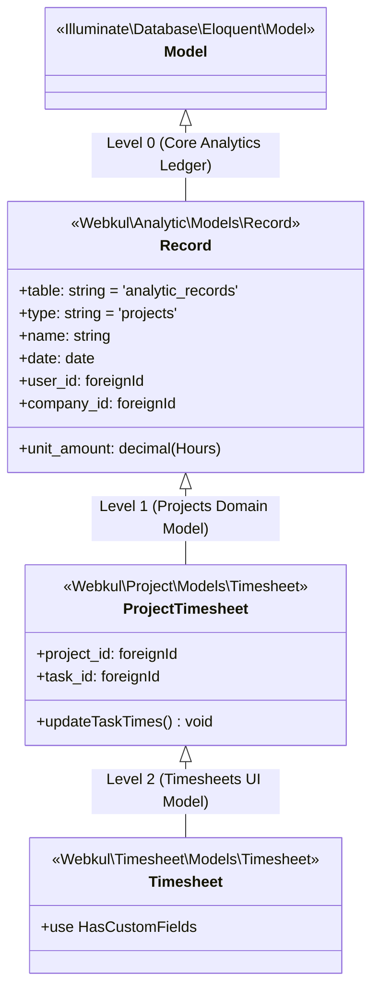
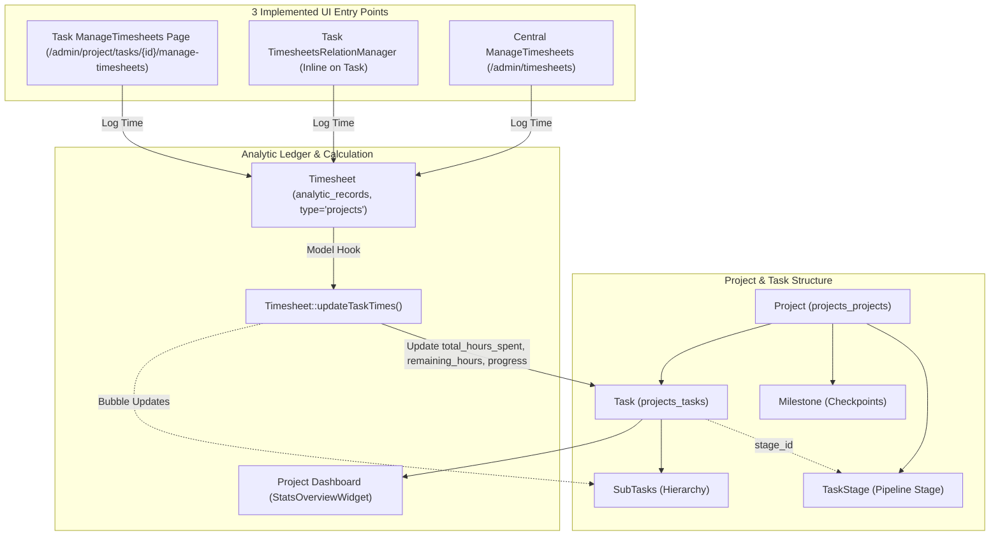

# Project Management, Task Execution & Time Tracking Workflow

## 1. Scope

This document details the project management, task breakdown hierarchy, multi-assignee task distribution, milestone tracking, stage progression pipelines, time tracking entry points, and analytic hour rollup mechanics implemented in Aureus ERP.

The project lifecycle spans two tightly integrated modules and the foundational analytics engine:
- **`projects`** (`plugins/webkul/projects`): Manages project master records (`Project`), task hierarchy (`Task`), project/task stages (`ProjectStage`, `TaskStage`), milestone checkpoints (`Milestone`), and base timesheet calculation hooks (`Webkul\Project\Models\Timesheet`).
- **`timesheets`** (`plugins/webkul/timesheets`): Centralized time logging interface (`TimesheetResource`), filter presets ("My Timesheets"), and custom fields integration on the operational timesheet model.
- **`analytics`** (`plugins/webkul/analytics`): Underlying double-entry / analytic ledger storage (`analytic_records`, `Webkul\Analytic\Models\Record`).

---

## 2. Entry Points

### Primary UI Entry Points (Filament Admin Panel - `Project` Navigation Group)
- **Projects Workspace (`ProjectResource`)**:
  - Route: `/admin/project/projects` (`plugins/webkul/projects/src/Filament/Resources/ProjectResource.php`)
  - Sub-navigation: `ListProjects`, `CreateProject`, `EditProject`, `ViewProject`, `ManageTasks`, `ManageMilestones`
- **Task Ticket System (`TaskResource`)**:
  - Route: `/admin/project/tasks` (`plugins/webkul/projects/src/Filament/Resources/TaskResource.php`)
  - Sub-navigation: `ListTasks`, `CreateTask`, `EditTask`, `ViewTask`, `ManageSubTasks`, `ManageTimesheets`
- **Dedicated Centralized Timesheets (`TimesheetResource`)**:
  - Route: `/admin/timesheets` (`plugins/webkul/timesheets/src/Filament/Resources/TimesheetResource.php`)
  - Page: `ManageTimesheets` (modal-driven table listing all project time logs with filter tabs)
- **Project Analytics Dashboard (`Dashboard`)**:
  - Route: `/admin/project` (`plugins/webkul/projects/src/Filament/Pages/Dashboard.php`)
  - Displays KPI summary widgets (`StatsOverviewWidget`), stage charts, and top assignees/projects.

### REST API v1 Entry Points
- `GET/POST/PUT/DELETE /admin/api/v1/projects/projects`: Project management (`ProjectController`).
- `GET/POST/PUT/DELETE /admin/api/v1/projects/tasks`: Task management (`TaskController`).
- `GET/POST/PUT/DELETE /admin/api/v1/projects/task-stages`: Task stage pipeline management (`TaskStageController`).
- `GET/POST/PUT/DELETE /admin/api/v1/projects/project-stages`: High-level project stage management (`ProjectStageController`).
- `GET/POST/PUT/DELETE /admin/api/v1/projects/milestones`: Milestone checkpoints (`MilestoneController`).
- `GET/POST/PUT/DELETE /admin/api/v1/projects/tags`: Tag taxonomy (`TagController`).

[VERIFIED]
Evidence: `plugins/webkul/projects/src/Filament/`, `plugins/webkul/timesheets/src/Filament/`, `plugins/webkul/projects/routes/api.php`

---

## 3. Preconditions

1. **Company & Authenticated User**: Active `Company` context and logged-in `User`.
2. **Project Master Record**: An active `Project` record with `allow_timesheets = true` and `is_active = true`.
3. **Task Stages**: At least one `TaskStage` configured for the project (or global default stages).
4. **Partner / Customer (Optional)**: Client account (`Partner`) attached for billable project alignment.

[VERIFIED]
Evidence: `plugins/webkul/projects/src/Models/Project.php`, `plugins/webkul/projects/src/Models/Task.php`

---

## 4. Main Flow: Project → Task → Assignment → Time Logging → Analytic Rollup

```
[1] Project Manager creates Project (ProjectResource / CreateProject)
     │
     ├── Sets Project Name, Client (partner_id), Budget (allocated_hours)
     ├── Configures ProjectVisibility (private, internal, public)
     └── Enables Flags (allow_timesheets = true, allow_milestones = true)
     │
     ▼
[2] Project Manager / Lead creates Tasks (TaskResource / CreateTask)
     │
     ├── Assigns Task to Project (project_id)
     ├── Sets Initial TaskStage (stage_id) and Priority (priority)
     ├── Defines Planned Duration (allocated_hours) and Deadline (deadline)
     └── Selects Multiple Assignees via projects_task_users (users multi-select)
     │
     ▼
[3] Team Member Logs Work Hours (3 Distinct UI Paths)
     │
     ├── Enters: date, spent hours (unit_amount), and work description (name)
     │
     ▼
[4] Persists into analytic_records (Webkul\Timesheet\Models\Timesheet)
     │
     ├── Inherits Webkul\Project\Models\Timesheet -> Webkul\Analytic\Models\Record
     ├── Sets type = 'projects', project_id = task.project_id, task_id = task.id
     │
     ▼
[5] Model Hook Invokes Timesheet::updateTaskTimes()
     │
     ├── Computes SUM(unit_amount) across task timesheets -> total_hours_spent
     ├── Computes effective_hours = total_hours_spent + subtask_effective_hours
     ├── Computes remaining_hours = MAX(0, allocated_hours - effective_hours)
     ├── Computes overtime = MAX(0, effective_hours - allocated_hours)
     ├── Computes progress = (effective_hours / allocated_hours) * 100
     │
     └── Recursively Bubbles Updates to Parent Task ($task->parent?->updateTaskTimes())
```

[VERIFIED]
Evidence: `plugins/webkul/projects/src/Models/Timesheet.php:14-95`, `plugins/webkul/timesheets/src/Filament/Resources/TimesheetResource/Schemas/TimesheetForm.php:15-42`

---

## 5. Time Entry UI Breakdown

> **"How many distinct UI entry points for time logging are actually implemented?"**

Aureus ERP implements exactly **3 distinct UI entry points** for logging timesheets:

```
┌──────────────────────────────────────────────────────────────────────────────────────────────────┐
│                             Implemented Time Logging UI Entry Points                             │
├─────────────────────┬────────────────────────────────────┬───────────────────────────────────────┤
│ UI Entry Point      │ Location / Filament Route          │ Component / Implementation Details    │
├─────────────────────┼────────────────────────────────────┼───────────────────────────────────────┤
│ 1. Centralized      │ `/admin/timesheets`                │ `TimesheetResource\Pages\             │
│    Timesheets Table │ (Central Timesheet Module)         │ ManageTimesheets`                     │
│                     │                                    │ • Single-page modal table with tabs   │
│                     │                                    │   ("My Timesheets")                   │
│                     │                                    │ • Creates entry via TimesheetForm     │
│                     │                                    │   (requires selecting Project & Task) │
├─────────────────────┼────────────────────────────────────┼───────────────────────────────────────┤
│ 2. Task In-Line     │ `/admin/project/tasks/{id}/edit`   │ `TaskResource\RelationManagers\       │
│    Relation Manager │ `/admin/project/tasks/{id}/view`   │ TimesheetsRelationManager`            │
│                     │ (Task Detail Form)                 │ • Inline modal table directly on task │
│                     │                                    │ • Automatically binds current task    │
│                     │                                    │   and parent project context          │
├─────────────────────┼────────────────────────────────────┼───────────────────────────────────────┤
│ 3. Dedicated Task   │ `/admin/project/tasks/{id}/        │ `TaskResource\Pages\ManageTimesheets` │
│    Timesheets Page  │ manage-timesheets`                 │ • Dedicated sub-navigation page for   │
│                     │ (Task Sub-Navigation Route)        │   task-scoped timesheet management    │
│                     │                                    │ • Modal-driven table view             │
└─────────────────────┴────────────────────────────────────┴───────────────────────────────────────┘
```

- **Not Implemented UI Mechanisms**: Live stopwatch timers, interactive weekly grid sheets, punch clocks, and desktop trackers are **[NOT IMPLEMENTED / UNKNOWN]**.

[VERIFIED]
Evidence: `plugins/webkul/timesheets/src/Filament/Resources/TimesheetResource/Pages/ManageTimesheets.php`, `plugins/webkul/projects/src/Filament/Resources/TaskResource/RelationManagers/TimesheetsRelationManager.php`, `plugins/webkul/projects/src/Filament/Resources/TaskResource/Pages/ManageTimesheets.php`

---

## 6. Task Stage & Pipeline Progression

```
┌────────────────────────────────────────────────────────────────────────┐
│                        Task Stage Progression                          │
├──────────────────────────┬─────────────────────────────────────────────┤
│ Dimension                │ Implementation Details                      │
├──────────────────────────┼─────────────────────────────────────────────┤
│ 1. Data Structure        │ `projects_task_stages` stores `name`,       │
│                          │ `sort`, and `project_id`.                   │
├──────────────────────────┼─────────────────────────────────────────────┤
│ 2. Stage Assignment      │ Selected via `stage_id` dropdown in         │
│                          │ `TaskForm` or edited in table view.         │
├──────────────────────────┼─────────────────────────────────────────────┤
│ 3. Table Grouping View   │ `TasksTable` provides collapsible grouping  │
│                          │ by `stage.name` with record count badges.   │
├──────────────────────────┼─────────────────────────────────────────────┤
│ 4. State vs Stage        │ `stage_id` reflects workflow column, while  │
│                          │ `state` reflects operational status         │
│                          │ (`in_progress`, `done`, `cancelled`).       │
└──────────────────────────┴─────────────────────────────────────────────┘
```

[VERIFIED]
Evidence: `plugins/webkul/projects/src/Models/TaskStage.php`, `plugins/webkul/projects/src/Filament/Resources/TaskResource/Tables/TasksTable.php`

---

## 7. Milestone Tracking & Completion

1. **Milestone Definition (`Milestone`)**:
   - Stores checkpoint title (`name`), target date (`deadline`), completion status (`is_completed`), and completion timestamp (`completed_at`).
   - Managed via `MilestonesRelationManager` under `ProjectResource`.
2. **Completion Action**:
   - Toggling `is_completed = true` records `completed_at = now()`.
   - Milestones serve as visual delivery markers; they do not trigger automated invoice generation or accounting events.

[VERIFIED]
Evidence: `plugins/webkul/projects/src/Models/Milestone.php:20-33`

---

## 8. Profitability / Costing Workflow Reality Check

> **"Does a real profitability/costing workflow exist, or is the analytic_records relationship currently structural without an implemented profitability workflow?"**

### Direct Answer based on Source Investigation:
1. **Structural Relationship Only [VERIFIED]**:
   - The connection between `Timesheet`, `Project\Timesheet`, and `Webkul\Analytic\Models\Record` on `analytic_records` is **strictly structural**.
   - It provides table storage reuse (`analytic_records`), type classification (`type = 'projects'`), and task progress/hour rollup calculations (`updateTaskTimes()`).
2. **Profitability & Costing Workflow: [UNKNOWN / NOT IMPLEMENTED]**:
   - There is **NO labor cost roll-up, employee hourly cost calculation, project margin, or financial profitability workflow/report** implemented in `projects` or `timesheets`.
   - The project dashboard (`StatsOverviewWidget`) tracks strictly **operational hours** (`total_hours_spent`, `remaining_hours`, `total_tasks`), not financial revenue, cost, or profitability metrics.

[VERIFIED]
Evidence: `plugins/webkul/projects/src/Filament/Widgets/StatsOverviewWidget.php:75-107`, `plugins/webkul/projects/src/Models/Timesheet.php`

---

## 9. State Transitions

### `TaskState` Lifecycle (`projects_tasks.state`)
- **`in_progress`**: Default state for active task execution.
- **`change_requested`**: Flagged for rework or requirement modification.
- **`approved`**: Task output reviewed and accepted.
- **`done`**: Task completed (excluded from default open task filters).
- **`cancelled`**: Task aborted.

### `ProjectVisibility` Access Levels (`projects_projects.visibility`)
- **`private`**: Visible only to assigned project team members and invited followers.
- **`internal`**: Visible to all internal company users.
- **`public`**: Accessible across portal/external interfaces.

[VERIFIED]
Evidence: `plugins/webkul/projects/src/Enums/TaskState.php`, `plugins/webkul/projects/src/Enums/ProjectVisibility.php`

---

## 10. Edge Cases & Error Handling

1. **Unassigned Tasks**:
   - Tasks without users in `projects_task_users` are tracked under the `unassigned_tasks` preset filter view and highlighted on the dashboard.
2. **Recursive Parent Subtask Hour Rollup**:
   - `Timesheet::updateTaskTimes()` calculates hours recursively across subtask trees, ensuring that logging 2 hours on a grandchild task correctly updates the child and top-level parent task metrics.
3. **Task-Less Timesheets**:
   - In `TimesheetForm`, `task_id` is nullable, allowing general project-level administrative work logging without binding to a specific task ticket.
4. **Company Isolation Synchronization**:
   - When creating a task, `Task::boot()` forces `company_id` to match the parent project's company ID, preventing cross-tenant project leakage.

[VERIFIED]
Evidence: `plugins/webkul/projects/src/Models/Timesheet.php:37-94`, `plugins/webkul/projects/src/Models/Task.php:124-126`

---

## 11. Authorization / Security

1. **Scoped Permissions**:
   - Enforced by `ProjectPolicy`, `TaskPolicy`, `MilestonePolicy`, `ProjectStagePolicy`, `TaskStagePolicy`, and `TimesheetPolicy`.
   - Supports `GLOBAL`, `GROUP`, and `INDIVIDUAL` resource scopes.
2. **Multi-User Task Access**:
   - `TaskPolicy` evaluates the `projects_task_users` junction table (`$this->hasAccess($user, $task, 'users')`), granting edit access to assigned collaborators.
3. **Multi-Tenant Isolation**:
   - `Project`, `Task`, `ProjectStage`, `Tag`, and `Timesheet` implement `BelongsToCompany` and global `CompanyScope`.

[VERIFIED]
Evidence: `plugins/webkul/projects/src/Policies/`, `plugins/webkul/timesheets/src/Policies/`

---

## 12. Models / Data Architecture

### Inheritance Chain (Terminal `Timesheet` Model)



[VERIFIED]
Evidence: `plugins/webkul/timesheets/src/Models/Timesheet.php`, `plugins/webkul/projects/src/Models/Timesheet.php`, `plugins/webkul/analytics/src/Models/Record.php`

---

## 13. Events / Listeners / Observers Catalog

| Mechanism | Trigger Source | Timing | Handled By | Effect |
| :--- | :--- | :--- | :--- | :--- |
| `Timesheet::created` | Time log created | Synchronous | Model Hook | Triggers `Timesheet::updateTaskTimes()`. |
| `Timesheet::updated` | Time log modified | Synchronous | Model Hook | Recomputes task `effective_hours` and `progress`. |
| `Timesheet::deleted` | Time log removed | Synchronous | Model Hook | Decrements task hours and updates parent tasks. |
| `Task::boot()` | Task saving | Synchronous | Model Hook | Syncs `company_id` from parent `Project`. |

[VERIFIED]
Evidence: `plugins/webkul/projects/src/Models/Timesheet.php:14-24`, `plugins/webkul/projects/src/Models/Task.php`

---

## 14. Business Rules Observed

1. **Subtask Metric Aggregation**: Task hours spent and progress metrics dynamically aggregate all underlying subtasks.
2. **Overtime Auto-Calculation**: Whenever `effective_hours > allocated_hours`, `overtime` is computed automatically.
3. **Multi-User Task Assignment**: A task can be assigned to multiple users simultaneously via `projects_task_users`.
4. **Purely Operational Time Tracking**: Timesheets record labor hours without calculating monetary labor costs or profit margins.
5. **Structural Ledger Inheritance**: Timesheets share physical database storage with Core Analytics (`analytic_records`) using discriminator `type = 'projects'`.

[VERIFIED]
Evidence: `plugins/webkul/projects/src/Models/Timesheet.php`

---

## 15. Unknowns / Inferences

### [UNKNOWN]
1. **Financial Profitability Engine**: Real project costing, billing rates, and margin roll-ups are [UNKNOWN] / not implemented in the active codebase.
2. **Timer / Stopwatch UI**: Live stopwatch timers and weekly grid sheets are [UNKNOWN] / not implemented.

### [INFERRED]
1. **Analytic Ledger Future Extensibility**: Storing timesheets inside `analytic_records` positions the architecture for future financial accounting and labor billing modules without schema migration.

---

## 16. Evidence References

| Area | File Path | Key Symbols |
| :--- | :--- | :--- |
| **Project Model** | `plugins/webkul/projects/src/Models/Project.php` | `Project` schema, relationships, visibility |
| **Task Model** | `plugins/webkul/projects/src/Models/Task.php` | `Task` schema, hours attributes, subtask hierarchy |
| **Base Timesheet Model** | `plugins/webkul/projects/src/Models/Timesheet.php` | `Timesheet::updateTaskTimes()` hour rollup |
| **Terminal Timesheet Model** | `plugins/webkul/timesheets/src/Models/Timesheet.php` | `Timesheet` class definition |
| **Central Timesheet Page** | `plugins/webkul/timesheets/src/Filament/Resources/TimesheetResource/Pages/ManageTimesheets.php` | Central time logging table UI |
| **Task Timesheet Relation** | `plugins/webkul/projects/src/Filament/Resources/TaskResource/RelationManagers/TimesheetsRelationManager.php` | In-line task time logging UI |
| **Task Manage Timesheets Page**| `plugins/webkul/projects/src/Filament/Resources/TaskResource/Pages/ManageTimesheets.php` | Dedicated task time logging route |
| **Project Dashboard Stats** | `plugins/webkul/projects/src/Filament/Widgets/StatsOverviewWidget.php` | Hour KPI aggregations (`getData()`) |

---

## 17. Mermaid Flowchart


