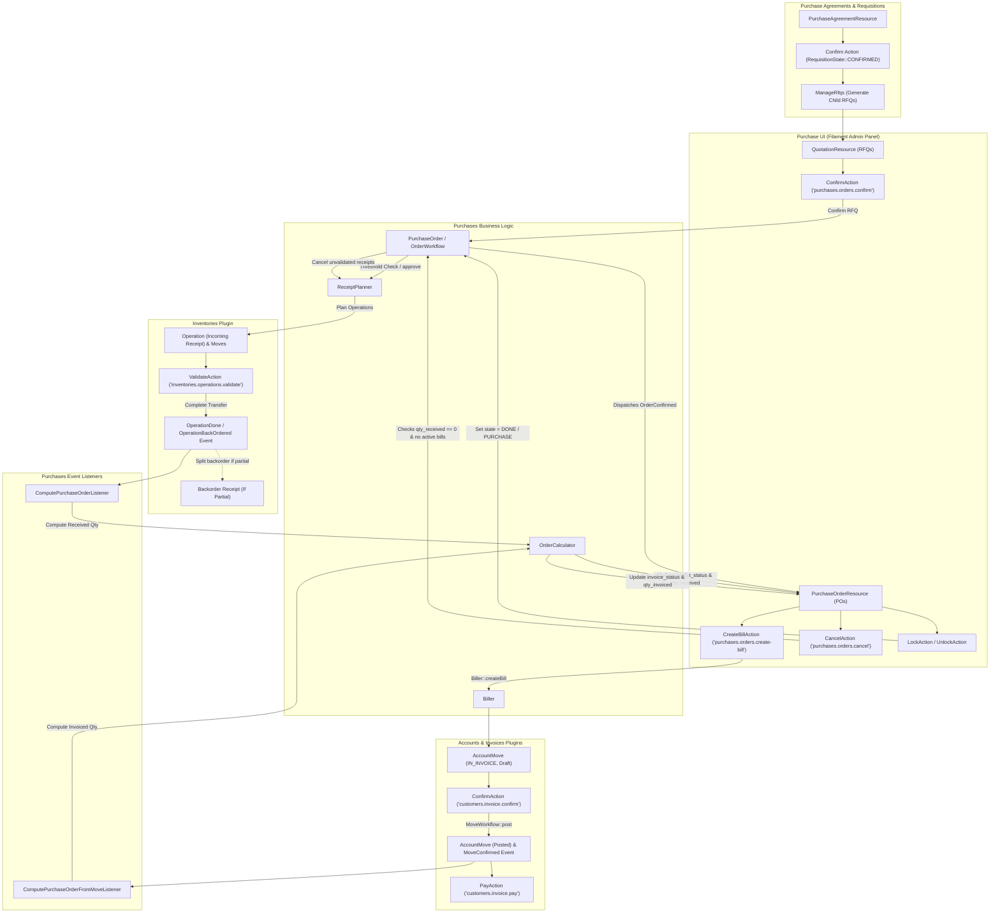

# Procurement & Purchasing Workflow

## 1. Scope

This document details the end-to-end implemented workflow for procurement agreements, purchase requisitions, requests for quotation (RFQs), purchase order (PO) confirmation, manager approval threshold enforcement, automated warehouse receipt planning, stock receipt fulfillment, backorder generation, vendor billing, payment settlement, administrative order locking, and cancellation constraints within Aureus ERP.

The procurement lifecycle spans four collaborating plugins:
- **`purchases`** (`plugins/webkul/purchases`): Manages purchase agreements, requisitions, RFQs, purchase orders, vendor pricelists, buyer approval governance, receipt tracking, and vendor bill initiation.
- **`inventories`** (`plugins/webkul/inventories`): Manages warehouse operations, incoming goods receipts (`Operation` of type `incoming_receipts`), stock movement routing, and partial transfer backorder generation (`OperationBackOrdered`).
- **`invoices`** (`plugins/webkul/invoices`): Provides the operational UI presentation layer for vendor bills (`MoveType::IN_INVOICE`) and debit notes (`MoveType::IN_REFUND`).
- **`accounts`** (`plugins/webkul/accounts`): Implements the foundational double-entry ledger, vendor bill validation, payment registration, and bank reconciliation engine.

---

## 2. Entry Points

### Primary UI Entry Points
- **Purchase Agreements / Requisitions**:
  - `PurchaseAgreementResource`: Route `/admin/purchases/orders/purchase-agreements` (`plugins/webkul/purchases/src/Filament/Admin/Clusters/Orders/Resources/PurchaseAgreementResource.php`)
  - Sub-navigation: `EditPurchaseAgreement`, `ViewPurchaseAgreement`, `ManageRfqs` (Route `.../{record}/rfqs`)
- **Requests for Quotation (RFQs)**:
  - `QuotationResource`: Route `/admin/purchases/orders/quotations` (scoped to `state` in `[draft, sent, to_approve]`)
  - Sub-navigation: `EditQuotation`, `ViewQuotation`, `ManageReceipts`, `ManageBills`
- **Purchase Orders (POs)**:
  - `PurchaseOrderResource`: Route `/admin/purchases/orders/purchase-orders` (scoped to `state` in `[purchase, done, canceled]`)
  - Sub-navigation: `EditPurchaseOrder`, `ViewPurchaseOrder`, `ManageReceipts`, `ManageBills`

### Alternative Entry Points
1. **Vendor Self-Service Portal (`customer` Filament Panel)**:
   - Vendor review screens under the `Account` cluster (`Webkul\Purchase\Filament\Customer\Clusters\Account\Resources\OrderResource\Pages\ViewOrder`).
   - Signed token URLs (`route('purchases.quotations.respond', ['token' => ...])`) rendering the `RespondQuotation` Livewire component for external vendor quotation confirmation.
2. **REST API v1 Endpoints**:
   - `POST /api/v1/purchases/purchase-agreements`: Creates purchase agreements/requisitions (`PurchaseAgreementController::store`).
   - `POST /api/v1/purchases/purchase-orders`: Creates RFQs/purchase orders (`PurchaseOrderController::store`).
   - `POST /api/v1/purchases/purchase-orders/{id}/confirm`: Confirms an RFQ into a purchase order (`PurchaseOrderController::confirm`).
   - `POST /api/v1/purchases/purchase-orders/{id}/cancel`: Cancels an order with precondition checks (`PurchaseOrderController::cancel`).
   - `POST /api/v1/purchases/purchase-orders/{id}/draft`: Resets a canceled order to draft (`PurchaseOrderController::draft`).
   - `POST /api/v1/purchases/purchase-orders/{id}/toggle-lock`: Toggles lock state between `purchase` and `done` (`PurchaseOrderController::toggleLock`).
   - `POST /api/v1/purchases/purchase-orders/{id}/confirm-receipt-date`: Confirms the vendor delivery date reminder (`PurchaseOrderController::confirmReceiptDate`).

[VERIFIED]
Evidence: `plugins/webkul/purchases/src/Filament/Admin/Clusters/Orders/Resources/`, `plugins/webkul/purchases/src/Http/Controllers/API/V1/PurchaseOrderController.php`, `plugins/webkul/purchases/src/Http/Controllers/API/V1/PurchaseAgreementController.php`

---

## 3. Preconditions

The following prerequisites must be met in database state before the purchasing workflow can execute:
1. **Company & Currency**: Active `Company` record in `CompanyContext` with configured base and operational currencies.
2. **Vendor Partner**: A `Partner` record (`partners_partners`) configured as a supplier (`supplier_rank > 0` or active vendor).
3. **Product Catalog**: At least one `Product` (`products_products`) configured with:
   - `type = ProductType::GOODS` (for warehouse goods receipts) or `ProductType::SERVICE`.
   - Defined `purchase_method` (`'purchase'` for billing by ordered quantity vs `'receive'` for billing by received quantity).
   - Valid Unit of Measure (`uom_id`).
4. **Warehouse & Operation Types** (when `inventories` is installed): A default `Warehouse` with an assigned `OperationType` for incoming receipts (`type = 'incoming_receipts'`).
5. **Purchase Journal** (when `accounts` is installed): A `Journal` of type `PURCHASE` configured with default expense accounts.

[VERIFIED]
Evidence: `plugins/webkul/purchases/src/Models/Order.php:227-259`, `plugins/webkul/purchases/src/Services/ReceiptPlanner.php:93-106`

---

## 4. Main Flow

| # | Step Name | UI Trigger | Code Path | State Change | Event Dispatched | Listener / Observer | Downstream Interaction |
| :--- | :--- | :--- | :--- | :--- | :--- | :--- | :--- |
| **1** | **Requisition / Agreement Creation** | Buyer creates and confirms Blanket Agreement or Template on `PurchaseAgreementResource`. | `CreatePurchaseAgreement::handleRecordCreation()` → `EditPurchaseAgreement::confirmAction()` | `Requisition::state` = `confirmed` | None | None | Establishes agreed vendor pricing, quantities, validity dates (`starts_at`, `ends_at`), and serves as parent for child RFQs. |
| **2** | **RFQ Creation & Numbering** | Buyer creates RFQ directly or from Agreement (`ManageRfqs`). | `QuotationResource\Pages\CreateQuotation::handleRecordCreation()` → `Order::boot()` → `Order::updateName()` | `Order::state` = `draft`<br>`Order::invoice_status` = `no`<br>`Order::receipt_status` = `no` | None (Eloquent model events only) | None | Allocates sequential number `PO/YYYY/#####` via `SequenceService::next('purchases.order', $company_id)`. |
| **3** | **RFQ Email Dispatch to Vendor** | Buyer clicks "Send by Email" on RFQ page (`SendEmailAction`). | `SendEmailAction::action()` → `PurchaseOrder::sendRequestForQuotation()` → `OrderWorkflow::sendRequestForQuotation()` | If `state == draft`: `Order::state` = `sent` | None | None | Generates RFQ PDF via `DocumentGenerator`, emails vendor via `VendorPurchaseOrderMail`, and logs PDF to record chatter. |
| **4** | **PO Confirmation & Approval Check** | Buyer clicks "Confirm Order" on RFQ page (`ConfirmAction`). | `ConfirmAction::action()` → `PurchaseOrder::confirmPurchaseOrder()` → `OrderWorkflow::confirm()` | **If `total_amount >= order_validation_amount` & unauthorized:**<br>`Order::state` = `to_approve`<br><br>**If approved / authorized:**<br>`Order::state` = `purchase` (or `done` if lock enabled)<br>`approved_at` = `now()` | `Webkul\Purchase\Events\OrderConfirmed` (when approved) | None registered across plugins | Calls `ReceiptPlanner::planForOrder()`, creating incoming receipt `Operation` (`type = incoming_receipts`) and stock `Move` records linked to `purchase_order_id` / `procurement_group_id`. |
| **5** | **Goods Receipt Validation** | Warehouse staff clicks "Validate" on incoming receipt (`ValidateAction` in `DeliveryResource` / `PurchaseOrderReceiptResource`). | `ValidateAction::action()` → `InventoryFacade::completeTransfer()` → `TransferWorkflow::complete()` | `Operation::state` = `done`<br>`Move::state` = `done`<br>Increments on-hand stock in `ProductQuantity` | `Webkul\Inventory\Events\OperationDone` *(or `OperationBackOrdered` if partial)* | `Webkul\Purchase\Listeners\ComputePurchaseOrderListener::handle()` | Intercepts event, queries linked purchase orders via `operation.purchaseOrders`, and invokes `PurchaseOrderFacade::computePurchaseOrder()`. |
| **6** | **Reactive Receipt Calculation** | Triggered automatically by `ComputePurchaseOrderListener`. | `ComputePurchaseOrderListener::handle()` → `PurchaseOrderFacade::computePurchaseOrder()` → `OrderCalculator::recompute()` | `OrderLine::qty_received` updated<br>`Order::receipt_status` = `partial` / `full`<br>`OrderLine::qty_to_invoice` recalculated | None | None | Sums quantities from completed stock moves (`state == DONE`). Updates `Order::receipt_status`. Under `purchase_method == 'receive'`, increases billable quantity (`qty_to_invoice`). |
| **7** | **Vendor Bill Generation** | Buyer / Accounts clicks "Create Bill" on PO page (`CreateBillAction`). | `CreateBillAction::action()` → `PurchaseOrder::createPurchaseOrderBill()` → `Biller::createBill()` | Creates `Move` (`IN_INVOICE`, `state = draft`)<br>Creates `purchases_order_account_moves` pivot | None | None | Instantiates draft vendor bill with lines matching `abs(qty_to_invoice)` and links line items via `purchase_order_line_id`. |
| **8** | **Vendor Bill Validation & Posting** | Accounts clicks "Confirm" on Vendor Bill page (`ConfirmAction` in `InvoiceResource`). | `Account\InvoiceResource\Actions\ConfirmAction::action()` → `AccountFacade::confirmMove()` → `MoveWorkflow::post()` | `Move::state` = `posted`<br>`Move::posted_before` = `true`<br>Assigns sequence `BILL/YYYY/#####` | `Webkul\Account\Events\MoveConfirmed` | `Webkul\Purchase\Listeners\ComputePurchaseOrderFromMoveListener::handle()` | Intercepts `MoveConfirmed`, finds linked `Order` via `accountMoves` pivot, and triggers `OrderCalculator::recompute()`. |
| **9** | **Reactive Billing Status Update** | Triggered automatically by `ComputePurchaseOrderFromMoveListener`. | `ComputePurchaseOrderFromMoveListener::handle()` → `OrderCalculator::recompute()` | `OrderLine::qty_invoiced` updated<br>`Order::invoice_status` = `invoiced` (or `to_invoiced`) | None | None | Calculates total billed quantities from non-canceled vendor bill lines. Evaluates overall PO billing state (`no`, `to_invoiced`, `invoiced`). |
| **10** | **Vendor Bill Payment & Settlement** | Accounts user clicks "Pay" on Vendor Bill (`PayAction`). | `PayAction::action()` → `AccountFacade::createPayments()` → `PaymentWorkflow::post()` | `Payment::state` = `posted`<br>`Move::payment_state` = `paid` (or `partial`) | `Webkul\Account\Events\MovePaid` | None in `purchases` | Reconciles credit/debit move lines and records outgoing bank/cash payment disbursement. |

[VERIFIED]
Evidence: `plugins/webkul/purchases/src/Services/OrderWorkflow.php:87-124`, `plugins/webkul/purchases/src/Services/ReceiptPlanner.php:93-144`, `plugins/webkul/purchases/src/Services/Biller.php:12-34`, `plugins/webkul/purchases/src/Services/OrderCalculator.php:17-45,142-211`, `plugins/webkul/purchases/src/Listeners/ComputePurchaseOrderListener.php:12-21`, `plugins/webkul/purchases/src/Listeners/ComputePurchaseOrderFromMoveListener.php:15-25`

---

## 5. State Transitions

### `OrderState` Lifecycle (`purchases_orders.state`)

```
   ┌─────────────────────────────────────────────────────────────┐
   │                                                             │
   ▼                                                             │
┌──────────────┐   Send by Email    ┌──────────────┐             │
│    draft     │ ─────────────────► │     sent     │             │
└──────┬───────┘                    └──────┬───────┘             │
       │                                   │                     │
       │ Confirm (Requires Approval)       │ Confirm             │
       ▼                                   ▼                     │
┌──────────────┐   Manager Approval ┌──────────────┐             │
│  to_approve  │ ─────────────────► │   purchase   │             │
└──────────────┘                    └──────┬───────┘             │
                                           │                     │
                                           │ Lock Order          │
                                           ▼                     │
                                    ┌──────────────┐             │
                                    │     done     │ (Locked PO) │
                                    └──────┬───────┘             │
                                           │                     │
                                           │ Cancel (Restricted) │
                                           ▼                     │
                                    ┌──────────────┐  Draft Action
                                    │   canceled   │ ────────────┘
                                    └──────────────┘
```

- **`draft`**: Initial quotation/RFQ state. Editable by buyers.
- **`sent`**: RFQ has been emailed to vendor (`SendEmailAction`).
- **`to_approve`**: PO exceeds `order_validation_amount` and awaits manager sign-off.
- **`purchase`**: Confirmed purchase order. Stock receipts are scheduled in `inventories`.
- **`done`**: Administratively locked PO (automatic via `enable_lock_confirmed_orders` or manual via `LockAction`). Editing is disabled.
- **`canceled`**: Canceled PO. Allowed only when `qty_received == 0` and all linked vendor bills are canceled.
- **`draft` (Reactivation)**: Canceled orders can be reset to `draft` via `DraftAction` (`OrderWorkflow::backToDraft()`), dispatching `OrderDrafted`.

### `RequisitionState` Lifecycle (`purchases_requisitions.state`)
- **`draft`**: Agreement created with target products and quantities.
- **`confirmed`**: Agreement approved via `confirm` action (`canBeConfirmed`: requires at least 1 line item). Available for generating child RFQs.
- **`closed`**: Agreement closed via `close` action (`canBeClosed`: requires all child orders to be in `DONE` or `CANCELED` state).
- **`canceled`**: Agreement canceled via `cancelRecord` action.

### `OrderReceiptStatus` Lifecycle (`purchases_orders.receipt_status`)
Calculated dynamically by `OrderCalculator::refreshReceiptStatus()`:
- **`no`**: No stock operations exist, or all operations are `CANCELED`.
- **`pending`**: Stock receipts exist in initial stages (`draft`, `confirmed`, `assigned`) with zero items completed.
- **`partial`**: At least one linked receipt is `DONE`, but not all receipts are settled.
- **`full`**: Every linked inventory operation is settled (`DONE` or `CANCELED`).

### `OrderInvoiceStatus` Lifecycle (`purchases_orders.invoice_status`)
Calculated dynamically by `OrderCalculator::refreshInvoiceStatus()`:
- **`no`**: Order is not in `purchase` or `done` state, or no billable lines exist.
- **`to_invoiced`**: At least one line has `qty_to_invoice != 0` (under `purchase` policy: unbilled ordered goods; under `receive` policy: received goods awaiting billing).
- **`invoiced`**: All line items have `qty_to_invoice == 0` and at least one linked `AccountMove` exists.

[VERIFIED]
Evidence: `plugins/webkul/purchases/src/Enums/OrderState.php`, `plugins/webkul/purchases/src/Enums/RequisitionState.php`, `plugins/webkul/purchases/src/Enums/OrderReceiptStatus.php`, `plugins/webkul/purchases/src/Enums/OrderInvoiceStatus.php`, `plugins/webkul/purchases/src/Services/OrderCalculator.php:96-140`

---

## 6. Alternative Paths

### A. Requisition → RFQ → PO Lifecycle

```
┌─────────────────────────────────────────────────────────────┐
│    Purchase Agreement / Requisition (purchases_requisitions)│
│    - Blanket Purchase Order (Target Qty, Price, Expiry)     │
│    - Purchase Template (Standard Lines Preset)              │
└──────────────────────────────┬──────────────────────────────┘
                               │
                               ▼
            Buyer creates child RFQ (ManageRfqs)
                               │
                               ▼
┌─────────────────────────────────────────────────────────────┐
│                 Request for Quotation (RFQ)                 │
│                 - Linked via requisition_id                 │
│                 - Inherits partner, currency, lines         │
└──────────────────────────────┬──────────────────────────────┘
                               │
                               ▼
┌─────────────────────────────────────────────────────────────┐
│                    Confirmed Purchase Order                 │
│                    - Deducts from blanket agreement         │
│                    - Schedules inventory receipts           │
└─────────────────────────────────────────────────────────────┘
```

1. **Requisition Types**:
   - `RequisitionType::BLANKET_ORDER`: Long-term commercial agreement establishing fixed pricing and target quantities with a single supplier.
   - `RequisitionType::PURCHASE_TEMPLATE`: Standard ordering template for creating repeated RFQs.
2. **RFQ Generation**: From the `ManageRfqs` sub-navigation tab on `PurchaseAgreementResource`, buyers generate multiple child RFQs linked via `requisition_id`.
3. **Closing Agreement**: When all call-off purchase orders complete (`DONE` or `CANCELED`), `PurchaseAgreementResource::canBeClosed()` returns true, allowing the buyer to close the agreement.

### B. Multi-Tier Manager Approval Thresholds
1. **Configuration**: Configured in `OrderSettings` (`enable_order_approval` boolean and `order_validation_amount` decimal).
2. **Evaluation**: When a buyer confirms an RFQ (`ConfirmAction`), `OrderWorkflow::confirm()` compares `Order::total_amount >= order_validation_amount`.
3. **Authorization Check**:
   - If the user possesses `PermissionType::GLOBAL` or `PermissionType::GROUP` (`OrderWorkflow::canApprove()`), the order is approved directly.
   - If the user is a standard buyer without manager permissions, `Order::state` transitions to `TO_APPROVE`.
4. **Approval**: An authorized manager opening the order sees the `ConfirmAction` button and clicks it to execute `approve()`, transitioning the order to `PURCHASE` and scheduling warehouse receipts.

### C. Vendor Self-Service Portal & Signed Links
- External vendors receive email notifications with signed URLs (`purchases.quotations.respond`).
- Navigating to the link renders the `RespondQuotation` Livewire component, allowing vendors to view line items, confirm receipt dates, or decline quotations remotely without administrative panel credentials.

---

## 7. Partial Receipt & Backorder Workflow

```
[1] Incoming Warehouse Receipt (Initial Demand = 100 units)
     │
     ▼
[2] Warehouse receives 60 units (Partial Delivery)
     │
     ▼
[3] Warehouse Staff clicks "Validate" (ValidateAction in inventories)
     │
     ├── Prompts Modal: "Create Backorder?"
     │         │
     │         ├── Option A: "Create Backorder" (Default)
     │         │         │
     │         │         ▼
     │         │   InventoryFacade::completeTransfer($record, cancelBackorder: false)
     │         │         ├── Sets original Receipt state = 'done' (Qty = 60)
     │         │         ├── Spawns new Backorder Receipt (Qty = 40, back_order_id = original.id)
     │         │         └── Dispatches: Webkul\Inventory\Events\OperationBackOrdered
     │         │
     │         └── Option B: "No Backorder"
     │                   │
     │                   ▼
     │             InventoryFacade::completeTransfer($record, cancelBackorder: true)
     │                   ├── Sets original Receipt state = 'done' (Qty = 60)
     │                   ├── Cancels remaining 40 units demand
     │                   └── Dispatches: Webkul\Inventory\Events\OperationDone
     │
     ▼
[4] Reactive PO Update (ComputePurchaseOrderListener)
     ├── OrderLine::qty_received becomes 60
     ├── Order::receipt_status becomes 'partial'
     └── Under purchase_method = 'receive': qty_to_invoice becomes 60
```

1. **Backorder Generation**: When `OperationBackOrdered` fires, `ComputePurchaseOrderListener` intercepts the event, locates the parent PO via `operation.purchaseOrders`, and recalculates totals.
2. **Subsequent Receipt**: The newly spawned backorder receipt remains open (`state = DRAFT` / `ASSIGNED`). When the remaining 40 units arrive and are validated, `OperationDone` fires, updating `qty_received` to 100 and transitioning `receipt_status` to `FULL`.

[VERIFIED]
Evidence: `plugins/webkul/purchases/src/Listeners/ComputePurchaseOrderListener.php:12-21`, `plugins/webkul/inventories/src/Services/TransferWorkflow.php:40-90`

---

## 8. Three-Way Match Analysis

### Source Investigation: PO Quantity vs. Receipt Quantity vs. Vendor Bill Quantity

Aureus ERP evaluates the three-way relationship between Purchase Orders, Goods Receipts, and Vendor Bills through the following concrete mechanisms:

```
┌─────────────────────────┐       ┌─────────────────────────┐       ┌─────────────────────────┐
│  Purchase Order Line    │       │  Stock Receipt Moves    │       │  Vendor Bill Lines      │
│  product_qty (Ordered)  │       │  quantity (Received)    │       │  quantity (Billed)      │
└────────────┬────────────┘       └────────────┬────────────┘       └────────────┬────────────┘
             │                                 │                                 │
             └────────────────►  OrderLine::qty_received  ◄──────────────────────┘
                                               │
                                 OrderLine::qty_invoiced
                                               │
                                               ▼
                              OrderLine::qty_to_invoice:
                              • 'purchase' policy: product_qty - qty_invoiced
                              • 'receive'  policy: qty_received - qty_invoiced
```

### Reality Check: Is there Real Three-Way-Match Enforcement?

1. **Default Bill Generation Control (`qty_to_invoice`)**:
   - Under `purchase_method == 'receive'`, the system restricts default bill creation (`Biller::createBill()`) to quantities physically received (`qty_received - qty_invoiced`).
   - If `qty_to_invoice == 0`, `CreateBillAction` prevents creating empty vendor bills.
2. **Manual Over-Billing Allowed (No Hard Blocking Engine)**:
   - If an accounts user manually edits a draft Vendor Bill (`IN_INVOICE`) in `invoices` or `accounts` to enter a billed quantity exceeding `qty_received` or `product_qty`, `MoveWorkflow::assertPostable()` **does not block posting**.
   - The bill is posted successfully to the double-entry general ledger.
3. **Discrepancy Reflection**:
   - When an over-billed invoice is posted, `ComputePurchaseOrderFromMoveListener` runs `OrderCalculator::recompute()`.
   - `OrderLine::qty_invoiced` increases beyond `qty_received`, causing `qty_to_invoice` to become **negative** (`qty_received - qty_invoiced < 0`).
   - If `qty_to_invoice < 0`, subsequent clicks on `CreateBillAction` automatically switch `MoveType` to **`IN_REFUND`** (Debit Note / Refund) to credit back the over-billed quantity (`Biller.php:14-17`).
4. **Summary**:
   - There is **NO automated 3-way match blocking engine or tolerance-rule validator** that rejects mismatched vendor bills during posting.
   - The system relationship is **primarily informational, status-based, and manual**, supported by automated quantity defaults based on `purchase_method` and automatic debit-note creation for negative balances.

[VERIFIED]
Evidence: `plugins/webkul/purchases/src/Services/OrderCalculator.php:47-64,142-174`, `plugins/webkul/purchases/src/Services/Biller.php:12-25`, `plugins/webkul/accounts/src/Services/MoveWorkflow.php:238-285`

---

## 9. Cancellation & Rejection Rules

### Cancellation Constraints & Guardrails

Unlike the sales module, the purchasing module implements **strict guardrails** preventing cancellation of purchase orders once physical or financial transactions have commenced:

| Document State at Cancellation | System Behavior | Enforcement Mechanism |
| :--- | :--- | :--- |
| **PO with Received Goods (`qty_received > 0`)** | **BLOCKED**. Cancellation is rejected with error notification: *"The order cannot be canceled since they have receipts that are already done."* | Enforced in UI (`CancelAction.php:29-37`) and API (`PurchaseOrderController.php:226-230`). |
| **PO with Active Vendor Bills (`state !== MoveState::CANCEL`)** | **BLOCKED**. Cancellation is rejected with error notification: *"The order cannot be canceled. You must first cancel their related vendor bills."* | Enforced in UI (`CancelAction.php:39-47`) and API (`PurchaseOrderController.php:232-236`). |
| **PO with Unvalidated Receipts (`draft`, `confirmed`, `assigned`) & No Bills** | **ALLOWED**. `OrderWorkflow::cancel()` executes: sets `state = CANCELED`, cancels draft receipts via `ReceiptPlanner::cancelOperations()`, and dispatches `OrderCanceled`. | `OrderWorkflow.php:131-145`, `ReceiptPlanner.php:377-385` |
| **Requisition Cancellation** | **ALLOWED**. `PurchaseAgreementResource\Pages\EditPurchaseAgreement` sets `state = CANCELED` via `cancelRecord` action. | `EditPurchaseAgreement.php:91-104` |

[VERIFIED]
Evidence: `plugins/webkul/purchases/src/Filament/Admin/Clusters/Orders/Resources/OrderResource/Actions/CancelAction.php:28-48`, `plugins/webkul/purchases/src/Http/Controllers/API/V1/PurchaseOrderController.php:220-237`

---

## 10. Administrative Locking

1. **Locking State Representation**:
   - Unlike `sales` (which uses a boolean column `locked`), `purchases` represents locked orders directly through enum state **`OrderState::DONE`**.
2. **Locking Triggers**:
   - **Automatic**: When setting `enable_lock_confirmed_orders` is enabled (`OrderSettings`), `OrderWorkflow::approve()` automatically transitions newly confirmed orders directly to `OrderState::DONE`.
   - **Manual**: On confirmed purchase orders (`state == PURCHASE`), users click **"Lock"** (`LockAction`), invoking `OrderWorkflow::lock()` to transition state to `DONE` and dispatch `OrderLocked`.
3. **Unlocking**:
   - On locked orders (`state == DONE`), users click **"Unlock"** (`UnlockAction`), invoking `OrderWorkflow::unlock()` to transition state back to `PURCHASE` and dispatch `OrderUnlocked`.
4. **Form Field Disabling**:
   - When `state == DONE`, `OrderForm` disables line item repeaters and header fields, preventing modifications.

[VERIFIED]
Evidence: `plugins/webkul/purchases/src/Services/OrderWorkflow.php:103-110,152-160`, `plugins/webkul/purchases/src/Filament/Admin/Clusters/Orders/Resources/OrderResource/Actions/LockAction.php`, `plugins/webkul/purchases/src/Filament/Admin/Clusters/Orders/Resources/OrderResource/Actions/UnlockAction.php`

---

## 11. Edge Cases

1. **Reordering Rule Warehouse Consistency**:
   - `ReceiptPlanner::assertReorderingRuleMatchesWarehouse()` validates that the warehouse of the operation type matches the location of any triggering reordering rule (`OrderPoint`). If mismatched, receipt planning throws an exception.
2. **Ordered vs Received Quantity Decrease Protection**:
   - `ReceiptPlanner::assertOrderedCoversReceived()` prevents decreasing `product_qty` below already received quantities (`qty_received`) during order updates, requiring return transfers first.
3. **Dropshipping Logistics**:
   - When `Order::destination_address_id` is present and operation type is `DROPSHIP`, `ReceiptPlanner::destinationLocation()` routes incoming stock directly to `LocationType::CUSTOMER`.
4. **Purchase Return Offsetting**:
   - `OrderCalculator::refreshQtyReceived()` detects purchase return moves (`isPurchaseReturn()`) and deducts returned quantities from `qty_received`.
5. **Multi-Currency Conversion (`total_cc_amount`)**:
   - `OrderCalculator::recompute()` calculates company-currency grand total (`total_cc_amount`) by dividing `total_amount` by `currency_rate`.

[VERIFIED]
Evidence: `plugins/webkul/purchases/src/Services/ReceiptPlanner.php:67-72,242-303`, `plugins/webkul/purchases/src/Services/OrderCalculator.php:33-35,190-210`

---

## 12. Authorization / Security

1. **Policies & Scoped Permissions**:
   - Authorization is enforced by `PurchaseOrderPolicy`, `QuotationPolicy`, and `RequisitionPolicy` using `HasScopedPermissions`.
   - Permissions checked:
     - `view_any_purchase_purchase::order`, `view_purchase_purchase::order`
     - `create_purchase_purchase::order`, `update_purchase_purchase::order`
     - `delete_purchase_purchase::order`, `delete_any_purchase_purchase::order`
     - `view_any_purchase_purchase::agreement`, `create_purchase_purchase::agreement`, `update_purchase_purchase::agreement`, `delete_purchase_purchase::agreement`
2. **Multi-Tenant Company Scoping**:
   - Models use `BelongsToCompany` and `CompanyScope` global scopes.
   - `ChecksCompanyConsistency` ensures related vendor, currency, warehouse, journal, and requisition belong to the active company.

[VERIFIED]
Evidence: `plugins/webkul/purchases/src/Policies/PurchaseOrderPolicy.php`, `plugins/webkul/purchases/src/Policies/RequisitionPolicy.php`

---

## 13. Models / Data Architecture

### Core Database Tables
- **`purchases_requisitions`**: Requisitions and blanket purchase agreements storing tender state, validity dates, and buyers.
- **`purchases_requisition_lines`**: Blanket agreement line items with committed quantities and unit prices.
- **`purchases_orders`**: Purchase order and RFQ headers storing state, priority, amounts, receipt status, billing status, and approval dates.
- **`purchases_order_lines`**: Order line items storing products, ordered/received/invoiced quantities, taxes, and unit prices.
- **`purchases_order_account_moves`**: Pivot table (`order_id` ↔ `move_id`) linking purchase orders to vendor bills.
- **`purchases_order_operations`**: Pivot table linking purchase orders to warehouse receipt operations.
- **`purchases_order_line_moves`**: Pivot table linking purchase order lines to individual inventory stock moves.
- **`purchases_order_groups`**: Grouping entity for batch purchase orders.

[VERIFIED]
Evidence: `plugins/webkul/purchases/database/migrations/`

---

## 14. Events / Listeners / Observers Catalog

| Event Class | Dispatched By | Trigger Timing | Handled By Listener | Cross-Plugin Effect |
| :--- | :--- | :--- | :--- | :--- |
| `Webkul\Purchase\Events\OrderDrafted` | `OrderWorkflow::backToDraft()` | Synchronous on reset to draft. | None registered | Internal state tracking. |
| `Webkul\Purchase\Events\OrderConfirmed` | `OrderWorkflow::approve()` | Synchronous on PO confirmation. | None registered | Signals order approval. |
| `Webkul\Purchase\Events\OrderLocked` | `OrderWorkflow::lock()` | Synchronous when PO is locked. | None registered | Signals document lock. |
| `Webkul\Purchase\Events\OrderUnlocked` | `OrderWorkflow::unlock()` | Synchronous when PO is unlocked. | None registered | Signals document unlock. |
| `Webkul\Purchase\Events\OrderCanceled` | `OrderWorkflow::cancel()` | Synchronous on PO cancellation. | None registered | Signals order cancellation. |
| `Webkul\Inventory\Events\OperationDone` | `TransferWorkflow::complete()` | Synchronous when incoming receipt is validated. | `Webkul\Purchase\Listeners\ComputePurchaseOrderListener` | Recalculates received quantities, receipt status, and billable status on linked purchase order. |
| `Webkul\Inventory\Events\OperationBackOrdered` | `TransferWorkflow::complete()` | Synchronous when partial receipt creates backorder. | `Webkul\Purchase\Listeners\ComputePurchaseOrderListener` | Recalculates received quantities and sets `receipt_status = partial`. |
| `Webkul\Account\Events\MoveConfirmed` | `MoveWorkflow::post()` | Synchronous when vendor bill is posted. | `Webkul\Purchase\Listeners\ComputePurchaseOrderFromMoveListener` | Recalculates invoiced quantities and billing status on linked purchase order. |
| `Webkul\Account\Events\MoveCancelled` | `MoveWorkflow::cancel()` | Synchronous when vendor bill is cancelled. | `Webkul\Purchase\Listeners\ComputePurchaseOrderFromMoveListener` | Recalculates invoiced quantities, reopening billable amounts. |
| `Webkul\Account\Events\MoveDrafted` | `MoveWorkflow::resetToDraft()` | Synchronous when vendor bill is reset to draft. | `Webkul\Purchase\Listeners\ComputePurchaseOrderFromMoveListener` | Recomputes invoiced quantities. |
| `Webkul\Account\Events\MoveReversed` | `MoveWorkflow::reverse()` | Synchronous when vendor debit note is issued. | `Webkul\Purchase\Listeners\ComputePurchaseOrderFromMoveListener` | Recomputes invoiced quantities, offsetting billed amounts. |

[VERIFIED]
Evidence: `plugins/webkul/purchases/src/PurchaseServiceProvider.php:101-106`, `plugins/webkul/purchases/src/Events/*.php`

---

## 15. Business Rules Observed

1. **Strict Cancellation Barrier**: A purchase order cannot be canceled in UI or API if any receipt has been validated (`qty_received > 0`) or if active vendor bills exist.
2. **Approval Threshold Enforcement**: Purchase orders with `total_amount >= order_validation_amount` automatically require manager approval (`state = to_approve`) unless created by users with `GLOBAL` or `GROUP` permission scopes.
3. **State-Based Locking**: Administrative locking transitions `state` to `OrderState::DONE`, distinguishing purchases from sales (which uses a separate boolean flag).
4. **Automatic Debit Note Pivot on Over-Billing**: If `qty_to_invoice < 0` (due to credit notes or bill adjustments), `CreateBillAction` automatically initializes an `IN_REFUND` (Debit Note) instead of `IN_INVOICE`.
5. **Reordering Rule Validation**: Procurement will fail fast with an explanatory exception if an incoming receipt's warehouse does not match the reordering rule location hierarchy.

[VERIFIED]
Evidence: `plugins/webkul/purchases/src/Services/OrderWorkflow.php`, `plugins/webkul/purchases/src/Services/ReceiptPlanner.php`, `plugins/webkul/purchases/src/Services/Biller.php`

---

## 16. Unknowns / Inferences

### [UNKNOWN]
1. **Unused Purchase Domain Events**: Events `OrderConfirmed`, `OrderLocked`, `OrderUnlocked`, `OrderCanceled`, and `OrderDrafted` are dispatched by `OrderWorkflow` but have zero registered listener classes in any installed plugin. Their downstream extension purpose is [UNKNOWN].
2. **Batch Purchase Order Grouping**: The table `purchases_order_groups` and model `OrderGroup` exist in the database schema, but automated purchase order consolidation workflows from multiple RFQs are [UNKNOWN] / not implemented in UI.

### [INFERRED]
1. **3-Way Match Architectural Rationale**: The omission of hard validation blocking on vendor bill posting is inferred to allow accounting teams flexibility in handling price/freight variance adjustments without requiring warehouse PO quantity modifications.

---

## 17. Evidence References

| Area | File Path | Key Symbols |
| :--- | :--- | :--- |
| **Workflow Service** | `plugins/webkul/purchases/src/Services/OrderWorkflow.php` | `OrderWorkflow::confirm()`, `approve()`, `cancel()`, `lock()`, `unlock()`, `backToDraft()` |
| **Receipt Planner Service** | `plugins/webkul/purchases/src/Services/ReceiptPlanner.php` | `ReceiptPlanner::planForOrder()`, `syncFromLines()`, `cancelOperations()`, `assertOrderedCoversReceived()` |
| **Billing Service** | `plugins/webkul/purchases/src/Services/Biller.php` | `Biller::createBill()`, `createBillLine()` |
| **Calculator Service** | `plugins/webkul/purchases/src/Services/OrderCalculator.php` | `OrderCalculator::recompute()`, `refreshReceiptStatus()`, `refreshInvoiceStatus()`, `refreshQtyReceived()`, `refreshQtyBilled()` |
| **Filament Confirm Action** | `plugins/webkul/purchases/src/Filament/Admin/Clusters/Orders/Resources/OrderResource/Actions/ConfirmAction.php` | `ConfirmAction::setUp()` |
| **Filament Cancel Action** | `plugins/webkul/purchases/src/Filament/Admin/Clusters/Orders/Resources/OrderResource/Actions/CancelAction.php` | `CancelAction::setUp()` |
| **Filament Create Bill Action** | `plugins/webkul/purchases/src/Filament/Admin/Clusters/Orders/Resources/OrderResource/Actions/CreateBillAction.php` | `CreateBillAction::setUp()` |
| **Filament Lock/Unlock Actions**| `plugins/webkul/purchases/src/Filament/Admin/Clusters/Orders/Resources/OrderResource/Actions/LockAction.php`, `UnlockAction.php` | `LockAction::setUp()`, `UnlockAction::setUp()` |
| **Receipt Done Listener** | `plugins/webkul/purchases/src/Listeners/ComputePurchaseOrderListener.php` | `ComputePurchaseOrderListener::handle()` |
| **Bill Confirmed Listener** | `plugins/webkul/purchases/src/Listeners/ComputePurchaseOrderFromMoveListener.php` | `ComputePurchaseOrderFromMoveListener::handle()` |
| **API Controller** | `plugins/webkul/purchases/src/Http/Controllers/API/V1/PurchaseOrderController.php` | `PurchaseOrderController::confirm()`, `cancel()`, `toggleLock()`, `confirmReceiptDate()` |

---

## 18. Mermaid Flowchart


