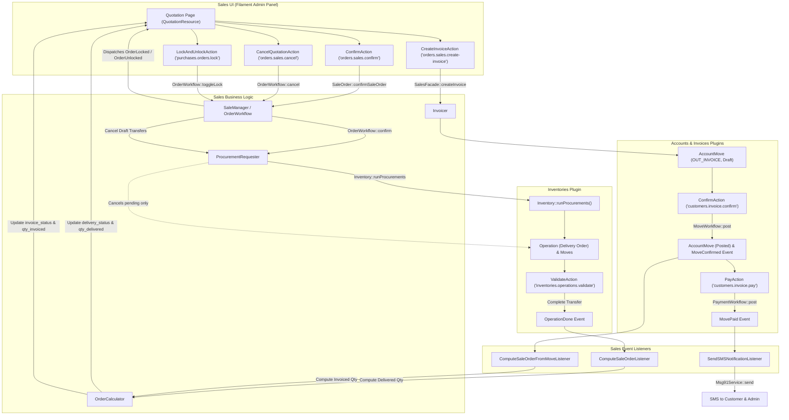

# Sales Order & Commercial Fulfillment Workflow

## 1. Scope

This document details the end-to-end implemented workflow for commercial quotation, sales order confirmation, automated inventory delivery procurement, stock fulfillment synchronization, customer billing, payment reconciliation, SMS notifications, administrative locking, and cancellation behavior within Aureus ERP.

The sales workflow spans four collaborating plugins:
- **`sales`** (`plugins/webkul/sales`): Manages quotations, sales orders, pricing, order line lifecycle, delivery status calculation, and invoice triggering.
- **`inventories`** (`plugins/webkul/inventories`): Manages warehouse operations, procurement requests, stock reservation, picking/packing, and delivery fulfillment (`Operation`, `Move`).
- **`invoices`** (`plugins/webkul/invoices`): Provides the operational UI presentation layer for customer invoices (`MoveType::OUT_INVOICE`) and credit notes (`MoveType::OUT_REFUND`).
- **`accounts`** (`plugins/webkul/accounts`): Implements the foundational double-entry general ledger, invoice posting, payment registration, and multi-currency reconciliation engine.

---

## 2. Entry Points

### Primary UI Entry Point
- **Resource**: `Webkul\Sale\Filament\Clusters\Orders\Resources\QuotationResource` (`plugins/webkul/sales/src/Filament/Clusters/Orders/Resources/QuotationResource.php`)
- **Pages**:
  - `CreateQuotation`: Route `/admin/sales/orders/quotations/create`
  - `EditQuotation`: Route `/admin/sales/orders/quotations/{record}/edit`
  - `ViewQuotation`: Route `/admin/sales/orders/quotations/{record}`
- **Sub-Navigation Resources & Pages**:
  - `OrderResource`: Route `/admin/sales/orders/orders` (scoped to `state = OrderState::SALE`)
  - `ManageDeliveries`: Route `/admin/sales/orders/quotations/{record}/deliveries` (mounts `QuotationDeliveryResource`)
  - `ManageInvoices`: Route `/admin/sales/orders/quotations/{record}/invoices` (mounts `QuotationInvoiceResource`)
  - `OrderToInvoiceResource`: Route `/admin/sales/to-invoice/orders` (scoped to orders needing invoicing)
  - `OrderToUpsellResource`: Route `/admin/sales/to-invoice/upsell-orders` (scoped to orders with upselling potential)

### Alternative Entry Points
1. **REST API v1 Endpoints**:
   - `POST /api/v1/sales/orders`: Creates a quotation/order with nested lines (`OrderController::store`).
   - `POST /api/v1/sales/orders/{id}/confirm`: Confirms a draft/sent quotation (`OrderController::confirm`).
   - `POST /api/v1/sales/orders/{id}/cancel`: Cancels an order with optional partner notification payload (`OrderController::cancel`).
   - `POST /api/v1/sales/orders/{id}/set-as-quotation`: Resets a canceled order back to draft quotation (`OrderController::setAsQuotation`).
   - `POST /api/v1/sales/orders/{id}/toggle-lock`: Toggles administrative lock on confirmed order (`OrderController::toggleLock`).
2. **Quotation Templates**:
   - `QuotationTemplateResource` (Partial / Orphaned Structure): Child page classes exist in `plugins/webkul/sales/src/Filament/Clusters/Configuration/Resources/QuotationTemplateResource/Pages/`, but the parent `QuotationTemplateResource.php` class file is absent (it is an orphaned/partial resource structure rather than a fully registered Filament Resource). Additionally, `QuotationForm` in the admin UI does not currently expose a template selector input, though the model relationship exists on `Order::$sale_order_template_id`.

[VERIFIED]
Evidence: `plugins/webkul/sales/src/Filament/Clusters/Orders/Resources/QuotationResource.php`, `plugins/webkul/sales/src/Http/Controllers/API/V1/OrderController.php`

---

## 3. Preconditions

The following prerequisites must be met in database state before the sales workflow can execute:
1. **Company & Currency**: Active `Company` record loaded in `CompanyContext` with an assigned `Currency`.
2. **Customer Partner**: A `Partner` record (`partners_partners`) marked as active.
3. **Product Catalog**: At least one `Product` (`products_products`) configured with:
   - `type = ProductType::GOODS` (for inventory deliveries) or `ProductType::SERVICE` (for non-inventory items).
   - Valid Unit of Measure (`uom_id`).
   - Defined `invoice_policy` (`'order'` or `'delivery'`) either on the product or via system fallback `InvoiceSettings::$invoice_policy`.
4. **Warehouse Configuration** (when `inventories` is installed): At least one default `Warehouse` (`inventories_warehouses`) assigned to the active company.
5. **Chart of Accounts & Journals** (when `accounts` is installed): A `Journal` of type `SALE` configured with default income accounts and sequence numbering.
6. **Price Lists (Optional)**: If `ProductSettings::$enable_price_lists` is enabled, customer default `price_list_id` is loaded and applied to line prices via `PriceListResolver`.

[VERIFIED]
Evidence: `plugins/webkul/sales/src/Models/Order.php:280-299`, `plugins/webkul/sales/src/Services/ProcurementRequester.php:53-58`

---

## 4. Main Flow

| # | Step Name | UI Trigger | Code Path | State Change | Event Dispatched | Listener / Observer | Downstream Interaction |
| :--- | :--- | :--- | :--- | :--- | :--- | :--- | :--- |
| **1** | **Quotation Creation & Numbering** | User submits "Create Quotation" form on `CreateQuotation` page. | `QuotationResource\Pages\CreateQuotation::handleRecordCreation()` → `Order::handleOrderCreation()` → `Order::updateName()` | `Order::state` = `draft`<br>`Order::invoice_status` = `no`<br>`Order::delivery_status` = `no`<br>`Order::locked` = `false` | None (Eloquent model events only) | None | Generates sequential document identifier `SO/YYYY/#####` via `SequenceService::next('sales.order', $company_id)`. Defaults customer `price_list_id` and evaluates dynamic line pricing via `PriceListResolver`. |
| **2** | **Send by Email (Optional)** | User clicks "Send by Email" on `ViewQuotation` / `EditQuotation` (`SendByEmailAction`). | `SendByEmailAction::action()` → `SaleManager::sendQuotationOrOrderByEmail()` → `OrderWorkflow::sendByEmail()` → `OrderMailer::sendQuotation()` | If `state == draft`: transitions `Order::state` = `sent` | None | None | Generates quotation PDF via `Barryvdh\DomPDF`, sends email via `EmailService`, and attaches email record to chatter timeline. |
| **3** | **Quotation Confirmation** | User clicks "Confirm" on `ViewQuotation` / `EditQuotation` (`ConfirmAction`). | `ConfirmAction::action()` → `SaleOrder::confirmSaleOrder()` → `OrderWorkflow::confirm()` | `Order::state` = `sale`<br>`Order::invoice_status` = `to_invoice`<br>`Order::locked` = `$settings->enable_lock_confirm_sales` | `Webkul\Sale\Events\OrderConfirmed` | None registered across plugins | Calls `ProcurementRequester::requestForLines()`, which creates `ProcurementGroup`, links `sale_order_id`, and calls `Inventory::runProcurements()` to generate warehouse `Operation` (type `delivery_orders`) and `Move` records. |
| **4** | **Warehouse Stock Fulfillment** | Warehouse staff clicks "Validate" on Delivery record (`ValidateAction` in `DeliveryResource` / `QuotationDeliveryResource`). | `ValidateAction::action()` → `InventoryFacade::completeTransfer()` → `TransferWorkflow::complete()` | `Operation::state` = `done`<br>`Move::state` = `done`<br>Stock balances decremented in `ProductQuantity` | `Webkul\Inventory\Events\OperationDone` | `Webkul\Sale\Listeners\ComputeSaleOrderListener::handle()` | Intercepts `OperationDone`, resolves linked `Order` via `operation.sale_order_id`, and executes `SaleOrderFacade::computeSaleOrder()`. |
| **5** | **Reactive Delivery & Status Recalculation** | Triggered automatically by `ComputeSaleOrderListener`. | `ComputeSaleOrderListener::handle()` → `SaleOrderFacade::computeSaleOrder()` → `OrderCalculator::recompute()` | `OrderLine::qty_delivered` updated<br>`Order::delivery_status` = `started` / `partial` / `full`<br>`OrderLine::qty_to_invoice` refreshed | None | None | Computes delivered quantities from completed stock moves (`outgoing - incoming`). Updates `Order::delivery_status` based on operation fulfillment. |
| **6** | **Customer Invoice Generation** | User clicks "Create Invoice" on `ViewOrder` / `EditOrder` (`CreateInvoiceAction`). | `CreateInvoiceAction::action()` → `SalesFacade::createInvoice()` → `Invoicer::invoiceOrder()` → `Invoicer::createInvoice()` | Creates `Move` (`OUT_INVOICE`, `state = draft`)<br>Creates `sales_order_invoices` pivot<br>Creates `sales_order_line_invoices` line links | None | None | Instantiates draft `AccountMove` with lines matching order lines (`quantity` based on `invoice_policy`). Creates `AdvancedPaymentInvoice` tracking record. |
| **7** | **Invoice Validation & Posting** | Accounting/Billing user clicks "Confirm" on `InvoiceResource` (`ConfirmAction`). | `Account\InvoiceResource\Actions\ConfirmAction::action()` → `AccountFacade::confirmMove()` → `MoveWorkflow::post()` | `Move::state` = `posted`<br>`Move::posted_before` = `true`<br>Assigns sequence `INV/YYYY/#####` | `Webkul\Account\Events\MoveConfirmed` | `Webkul\Sale\Listeners\ComputeSaleOrderFromMoveListener::handle()` | Intercepts `MoveConfirmed`, resolves linked `sales_orders` via pivot, and triggers `OrderCalculator::recompute()`. |
| **8** | **Reactive Invoicing Status Update** | Triggered automatically by `ComputeSaleOrderFromMoveListener`. | `ComputeSaleOrderFromMoveListener::handle()` → `OrderCalculator::recompute()` | `OrderLine::qty_invoiced` updated<br>`OrderLine::untaxed_amount_invoiced` updated<br>`Order::invoice_status` = `invoiced` (or `up_selling`) | None | None | Recomputes invoiced quantities across linked non-canceled moves. Evaluates overall order billing state (`no`, `to_invoice`, `invoiced`, `up_selling`). |
| **9** | **Payment Settlement & SMS Notification** | User registers payment via "Pay" modal on `InvoiceResource` (`PayAction`). | `PayAction::action()` → `AccountFacade::createPayments()` → `PaymentWorkflow::post()` | `Payment::state` = `posted`<br>`Move::payment_state` = `paid` (or `partial` / `in_payment`) | `Webkul\Account\Events\MovePaid` | `Webkul\Sale\Listeners\SendSMSNotificationListener::handle()` | Intercepts `MovePaid`, finds linked `Order`, checks customer mobile number, and dispatches automated payment acknowledgment SMS alerts via `Msg91Service`. |

[VERIFIED]
Evidence: `plugins/webkul/sales/src/Services/OrderWorkflow.php:43-59`, `plugins/webkul/sales/src/Services/ProcurementRequester.php:19-51`, `plugins/webkul/sales/src/Services/Invoicer.php:20-87`, `plugins/webkul/sales/src/Services/OrderCalculator.php:22-50`, `plugins/webkul/sales/src/Listeners/ComputeSaleOrderListener.php:11-20`, `plugins/webkul/sales/src/Listeners/ComputeSaleOrderFromMoveListener.php:18-32`, `plugins/webkul/sales/src/Listeners/SendSMSNotificationListener.php:14-58`

---

## 5. State Transitions

### `OrderState` Lifecycle (`sales_orders.state`)

```
   ┌─────────────────────────────────────────────────────────────┐
   │                                                             │
   ▼                                                             │
┌──────────────┐   Send by Email    ┌──────────────┐             │
│    draft     │ ─────────────────► │     sent     │             │
└──────┬───────┘                    └──────┬───────┘             │
       │                                   │                     │
       │ Confirm Action                    │ Confirm Action      │
       └─────────────────┬─────────────────┘                     │
                         ▼                                       │
                  ┌──────────────┐                               │
                  │     sale     │ (Confirmed Sales Order)       │
                  └──────┬───────┘                               │
                         │                                       │
                         │ Cancel Action                         │
                         ▼                                       │
                  ┌──────────────┐    Back to Quotation Action   │
                  │    cancel    │ ──────────────────────────────┘
                  └──────────────┘
```

- **`draft`**: Default state on creation. Full editing allowed. Document title displays as *"Quotation"*.
- **`sent`**: Quotation has been emailed to the customer via `SendByEmailAction`. Remains editable until confirmed.
- **`sale`**: Quotation is confirmed into a binding sales order. System auto-generates delivery transfers in `inventories`, sets `invoice_status = to_invoice`, and locks editing if `enable_lock_confirm_sales` is enabled. Document title displays as *"Sales Order"*.
- **`cancel`**: Order is cancelled via `CancelQuotationAction` or API. Pending/unvalidated transfers are cancelled; validated transfers and posted invoices remain untouched.
- **`draft` (Reactivation)**: Canceled orders can be returned to quotation state via `BackToQuotationAction` (`OrderWorkflow::backToQuotation()`), setting `state = draft` and dispatching `OrderDrafted`.

### `OrderDeliveryStatus` Lifecycle (`sales_orders.delivery_status`)
Calculated dynamically by `OrderCalculator::refreshDeliveryStatus()`:
- **`no`**: No stock operations exist, or all stock operations are `CANCELED`.
- **`pending`**: Stock operations exist in initial stages (`draft`, `confirmed`, `assigned`) with zero items completed.
- **`started`**: At least one operation has reached `DONE`, but line delivered quantities remain zero.
- **`partial`**: At least one operation is `DONE` and `OrderLine::qty_delivered > 0`, but not all operations are settled.
- **`full`**: Every linked inventory operation is settled (each operation is either `DONE` or `CANCELED`).

### `InvoiceStatus` Lifecycle (`sales_orders.invoice_status`)
Calculated dynamically by `OrderCalculator::refreshInvoiceStatus()`:
- **`no`**: Order is not in `sale` state, or no invoiceable amounts exist.
- **`to_invoice`**: At least one line has `qty_to_invoice > 0` (under `ORDER` policy: un-invoiced ordered goods; under `DELIVERY` policy: delivered goods awaiting invoicing).
- **`invoiced`**: All line items have `qty_invoiced >= product_uom_qty`.
- **`up_selling`**: Delivered quantity exceeds ordered quantity (`qty_delivered > product_uom_qty`) on invoiced lines.

[VERIFIED]
Evidence: `plugins/webkul/sales/src/Enums/OrderState.php`, `plugins/webkul/sales/src/Enums/OrderDeliveryStatus.php`, `plugins/webkul/sales/src/Enums/InvoiceStatus.php`, `plugins/webkul/sales/src/Services/OrderCalculator.php:187-231`

---

## 6. Alternative Paths

### A. Advance Payment / Down Payment Invoice Flow

```
Main Sales Order Flow (state = 'sale', invoice_status = 'to_invoice')
     │
     ▼
User opens "Create Invoice" Modal (CreateInvoiceAction)
     │
     ├── Selects "Regular Invoice (Delivered quantities)" [DEFAULT & ONLY UI OPTION]
     │         │
     │         ▼
     │   Invoicer::createInvoice($record)
     │         ├── Creates AccountMove (OUT_INVOICE, draft)
     │         ├── Creates sales_order_invoices & sales_order_line_invoices
     │         └── Creates AdvancedPaymentInvoice record
     │
     └── Selects "Percentage" or "Fixed Amount" (Down Payment) [CODE-DEFINED ONLY]
               │
               ▼
         Invoicer::invoiceOrder($record, $data)
               ├── Creates AdvancedPaymentInvoice record in sales_advance_payment_invoices
               ├── Attaches order in sales_advance_payment_invoice_order_sales
               └── Downpayment Move Generation: [UNKNOWN] (No AccountMove created in source)
```

1. **Enum & Schema Support**: The `AdvancedPayment` enum defines three methods: `DELIVERED`, `PERCENTAGE`, and `FIXED`.
2. **UI Limitation**: `CreateInvoiceAction::setUp()` explicitly restricts the available radio options to `DELIVERED` only via `Arr::only($options, [AdvancedPayment::DELIVERED->value])`. The percentage and fixed input controls exist in the form definition schema but are never activated in standard UI operation.
3. **Execution Behavior**:
   - For `DELIVERED`: `Invoicer::invoiceOrder()` executes `createInvoice($record)`, creating a draft `AccountMove` and generating lines based on `qty_to_invoice`.
   - For `PERCENTAGE` / `FIXED` (if invoked via programmatic service call): `Invoicer` creates the `AdvancedPaymentInvoice` metadata record and pivot link, but does **not** generate an `AccountMove` or invoice lines.
4. **Rejoin Point**: Automated deduction of previous down payments from final regular invoices is [UNKNOWN] in the active codebase (the field `'deduct_down_payments' => true` is persisted on `AdvancedPaymentInvoice`, but `Invoicer::createInvoiceLine` does not subtract down payment lines).

[VERIFIED]
Evidence: `plugins/webkul/sales/src/Filament/Clusters/Orders/Resources/QuotationResource/Actions/CreateInvoiceAction.php:45-53`, `plugins/webkul/sales/src/Services/Invoicer.php:20-38`

### B. Quotation Templates & Optional Products
1. Users configure reusable order templates via `QuotationTemplateResource` (`sales_order_templates`).
2. Order templates (`OrderTemplate`) configure reusable lines (`sales_order_template_products`), payment terms, and validity duration. Note that while the model relation exists (`Order::$sale_order_template_id`), `QuotationForm` in the current admin UI does not expose a template selector, so template application is not operationally exposed during manual quotation creation.
3. Optional upsell items (`sales_order_options`) can be defined alongside standard quotation lines.

---

## 7. Cancellation / Reversal

### Cancellation Trigger
- **UI Trigger**: `CancelQuotationAction` on `ViewQuotation`, `EditQuotation`, `ViewOrder`, or `EditOrder` pages.
- **Visibility**: Visible when `Order::state` is `DRAFT`, `SENT`, or `SALE` (`hidden(fn ($record) => ! in_array($record->state, [OrderState::DRAFT, OrderState::SENT, OrderState::SALE]))`).
- **Modal Options**:
  - *"Cancel"*: Executes cancellation without email dispatch.
  - *"Send and Cancel"*: Sends cancellation notification email to selected partners via `OrderMailer::sendCancellation()` before cancelling.
- **Service Path**: `SaleManager::cancelSaleOrder($record, $data)` → `OrderWorkflow::cancel($record, $data)`:
  1. Sets `Order::state = OrderState::CANCEL`.
  2. Sets `Order::invoice_status = InvoiceStatus::NO`.
  3. Executes `OrderCalculator::recompute($record)` (updates lines to `state = cancel`).
  4. Executes `ProcurementRequester::cancelOperations($record)`.
  5. Dispatches `Webkul\Sale\Events\OrderCanceled`.

### Impact on Downstream Records (By State)

| Downstream Document | Document State at Cancellation | System Behavior | Source Evidence |
| :--- | :--- | :--- | :--- |
| **Delivery Operation** | `draft`, `confirmed`, `assigned` | **Cancelled**. `ProcurementRequester::cancelOperations()` filters non-settled operations and invokes `InventoryFacade::cancelTransfer($operation)`. | `ProcurementRequester.php:223-228` |
| **Delivery Operation** | `done` (Validated Delivery) | **Untouched**. Operation remains `done`; stock quantities already deducted are **not** returned or reversed. Cancellation is **not blocked**. | `ProcurementRequester.php:224-225` |
| **Customer Invoice** | `draft` | **Untouched**. Invoice remains in `draft` state linked to the order in `sales_order_invoices`. | `OrderWorkflow.php:76-93` |
| **Customer Invoice** | `posted` | **Untouched**. Invoice remains `posted` in the general ledger. No credit note or cancellation is triggered. Cancellation is **not blocked**. | `OrderWorkflow.php:76-93` |
| **Payment** | `posted` / `paid` | **Untouched**. Payment ledger entries and reconciliations remain intact. | `OrderWorkflow.php:76-93` |

### Reset to Quotation
- If an order is in `state = CANCEL`, the user can click **"Back to Quotation"** (`BackToQuotationAction`).
- Executes `OrderWorkflow::backToQuotation($record)`:
  - Sets `state = OrderState::DRAFT` and `invoice_status = InvoiceStatus::NO`.
  - Recomputes totals and dispatches `Webkul\Sale\Events\OrderDrafted`.
  - Does **not** automatically restore previously cancelled inventory operations.

[VERIFIED]
Evidence: `plugins/webkul/sales/src/Services/OrderWorkflow.php:61-93`, `plugins/webkul/sales/src/Services/ProcurementRequester.php:218-229`, `plugins/webkul/sales/src/Filament/Clusters/Orders/Resources/QuotationResource/Actions/CancelQuotationAction.php:38-70`

---

## 8. Administrative Locking

### Overview
Aureus ERP provides administrative order locking to protect confirmed sales orders against unauthorized or inadvertent line-item and header modifications.

### Locking Mechanisms & Rules
1. **Automatic Locking on Confirmation**:
   - Configured via setting `enable_lock_confirm_sales` (`QuotationAndOrderSettings`, managed in `ManageQuotationAndOrder` page under `sales/settings`).
   - When enabled, `OrderWorkflow::confirm()` automatically sets `Order::locked = true` upon confirmation.
2. **Manual Lock / Unlock Action**:
   - **UI Action**: `LockAndUnlockAction` (`plugins/webkul/sales/src/Filament/Clusters/Orders/Resources/QuotationResource/Actions/LockAndUnlockAction.php`).
   - **Visibility**: Visible exclusively when `Order::state === OrderState::SALE`.
   - **Execution**: Invokes `SaleOrder::lockAndUnlock($record)` → `OrderWorkflow::toggleLock($record)`:
     - Inverts boolean flag: `$record->update(['locked' => ! $record->locked])`.
     - Recomputes order via `OrderCalculator::recompute($record)`.
     - Dispatches `Webkul\Sale\Events\OrderLocked` (if locked) or `Webkul\Sale\Events\OrderUnlocked` (if unlocked).
3. **Blocked Actions While Locked**:
   - **UI Form Disabling**: In `QuotationForm`, header fields (`partner_id`, `partner_invoice_id`, `partner_shipping_id`, `payment_term_id`, `validity_date`, `commitment_date`, `currency_id`, `warehouse_id`) and line items (`product_id`, `product_uom_qty`, `price_unit`, `discount`, `taxes`) are disabled when `$record->locked == true`.
   - **Procurement Blocking**: `ProcurementRequester::needsProcurement()` checks `! $line->order->locked`. Locked orders will not generate new procurement requests even if lines are modified programmatically.
   - **Deletion**: Delete action is hidden on all confirmed orders (`hidden(fn () => $record->state == OrderState::SALE)`).
4. **Unlocked State**:
   - When unlocked by an authorized user, order header and line items become editable again in `OrderResource\Pages\EditOrder`.

[VERIFIED]
Evidence: `plugins/webkul/sales/src/Services/OrderWorkflow.php:30-41`, `plugins/webkul/sales/src/Filament/Clusters/Orders/Resources/QuotationResource/Actions/LockAndUnlockAction.php:10-30`, `plugins/webkul/sales/src/Filament/Clusters/Orders/Resources/QuotationResource/Schemas/QuotationForm.php:106,567-687`

---

## 9. Edge Cases

1. **Duplicate Confirmation Protection**:
   - In UI: `ConfirmAction` is hidden once `Order::state` is `SALE` or `CANCEL` (`hidden(fn ($record) => in_array($record->state, [OrderState::SALE, OrderState::CANCEL]))`).
   - In API: `OrderController::confirm()` returns HTTP 422 (`"Only draft or sent orders can be confirmed."`) if state is not `DRAFT` or `SENT`.
2. **Zero Invoiceable Quantity Protection**:
   - If a user clicks "Create Invoice" on an order where `qty_to_invoice == 0`, `CreateInvoiceAction` halts execution with a warning notification (`no-invoiceable-lines`) without creating empty invoice records.
3. **Invoicing Policy Enforcement (`ORDER` vs `DELIVERY`)**:
   - **`InvoicePolicy::ORDER`**: Invoiceable quantity equals ordered quantity minus invoiced (`product_uom_qty - qty_invoiced`). Invoice can be generated immediately upon confirmation prior to delivery.
   - **`InvoicePolicy::DELIVERY`**: Invoiceable quantity equals delivered quantity minus invoiced (`qty_delivered - qty_invoiced`). Invoice can only be generated after warehouse stock transfer is validated (`OperationDone`).
4. **Over-Delivery & Upselling**:
   - If delivered quantity exceeds ordered quantity (`qty_delivered > product_uom_qty`), `OrderCalculator::orderPolicyInvoiceStatus()` sets `OrderLine::invoice_status = InvoiceStatus::UP_SELLING`.
   - `OrderToUpsellResource` isolates these records for commercial review.
5. **Invoice Credit Note / Reversal Synchronization**:
   - When a posted invoice linked to a sales order is reversed (`MoveReversed`), `ComputeSaleOrderFromMoveListener` copies line links to the reversal credit note in `sales_order_line_invoices`.
   - `OrderCalculator::refreshQtyInvoiced()` subtracts quantities from `OUT_REFUND` credit notes, reducing `qty_invoiced` and reopening `qty_to_invoice` for re-billing.
6. **Partial Stock Deliveries**:
   - Validating a partial transfer updates `qty_delivered` strictly by the quantity on `DONE` stock moves. `Order::delivery_status` transitions to `PARTIAL`.
7. **Partial Payments**:
   - Registering a partial payment sets `Move::payment_state = PARTIAL`. `MovePaid` event is **not** dispatched (it fires only upon full settlement). SMS notifications are suppressed until full payment is achieved.

[VERIFIED]
Evidence: `plugins/webkul/sales/src/Services/OrderCalculator.php:117-177,255-289`, `plugins/webkul/sales/src/Filament/Clusters/Orders/Resources/QuotationResource/Actions/CreateInvoiceAction.php:71-79`, `plugins/webkul/sales/src/Listeners/ComputeSaleOrderFromMoveListener.php:24-65`

---

## 10. Authorization / Security

1. **Policies & Scoped Permissions**:
   - Model authorization is enforced via `Webkul\Sale\Policies\OrderPolicy` and `QuotationPolicy`, using `HasScopedPermissions`.
   - Permissions checked:
     - `view_any_sale_order`, `view_sale_order`
     - `create_sale_order`
     - `update_sale_order`
     - `delete_sale_order`, `delete_any_sale_order`
     - `restore_sale_order`, `restore_any_sale_order`
     - `force_delete_sale_order`, `force_delete_any_sale_order`
2. **Company Isolation**:
   - `Order` uses `BelongsToCompany` trait and `CompanyScope` global scope to enforce multi-tenant isolation by `company_id`.
   - `ChecksCompanyConsistency` ensures related warehouse, journal, payment terms, and fiscal position belong to the same company.
3. **User Ownership Scoping**:
   - `Order` utilizes `HasOwnershipScope` to allow role-based visibility restrictions (e.g. salespersons viewing only their own quotations vs sales managers viewing all team orders).

[VERIFIED]
Evidence: `plugins/webkul/sales/src/Policies/OrderPolicy.php:1-110`, `plugins/webkul/sales/src/Models/Order.php:41-45`

---

## 11. Models / Data Architecture

### Core Database Tables
- **`sales_orders`**: Primary order header table storing state, amounts, currency, customer references, `price_list_id`, locking status, delivery status, and invoice status.
- **`sales_order_lines`**: Order line items storing products, quantities, delivered/invoiced counters, discounts, tax calculations, and pricing margins.
- **`sales_order_invoices`**: Pivot table (`order_id` ↔ `move_id`) binding sales orders to accounting invoice headers.
- **`sales_order_line_invoices`**: Junction table (`order_line_id` ↔ `invoice_line_id`) linking sales order line items to specific invoice line items.
- **`sales_advance_payment_invoices`**: Metadata table capturing advance payment invoice wizard executions.
- **`sales_advance_payment_invoice_order_sales`**: Pivot table binding advance payment records to sales orders.
- **`sales_order_options`**: Optional upsell products associated with a quotation.
- **`sales_order_templates` & `sales_order_template_products`**: Quotation preset templates.
- **`sales_teams` & `sales_team_members`**: Sales organizational hierarchy and revenue targets.

[VERIFIED]
Evidence: `plugins/webkul/sales/database/migrations/`

---

## 12. Events / Listeners / Observers Catalog

| Event Class | Dispatched By | Trigger Timing | Handled By Listener | Cross-Plugin Effect |
| :--- | :--- | :--- | :--- | :--- |
| `Webkul\Sale\Events\OrderDrafted` | `OrderWorkflow::backToQuotation()` | Synchronous on reset to quotation. | None registered | Internal state tracking. |
| `Webkul\Sale\Events\OrderConfirmed` | `OrderWorkflow::confirm()` | Synchronous on quotation confirmation. | None registered | Signals order confirmation. |
| `Webkul\Sale\Events\OrderLocked` | `OrderWorkflow::toggleLock()` | Synchronous when order is locked. | None registered | Signals document lock. |
| `Webkul\Sale\Events\OrderUnlocked` | `OrderWorkflow::toggleLock()` | Synchronous when order is unlocked. | None registered | Signals document unlock. |
| `Webkul\Sale\Events\OrderCanceled` | `OrderWorkflow::cancel()` | Synchronous on order cancellation. | None registered | Signals order cancellation. |
| `Webkul\Inventory\Events\OperationDone` | `TransferWorkflow::complete()` | Synchronous when warehouse delivery is validated. | `Webkul\Sale\Listeners\ComputeSaleOrderListener` | Recalculates delivered quantities, delivery status, and invoice status on linked sales order. |
| `Webkul\Account\Events\MoveConfirmed` | `MoveWorkflow::post()` | Synchronous when invoice is posted. | `Webkul\Sale\Listeners\ComputeSaleOrderFromMoveListener` | Recalculates invoiced quantities and billing status on linked sales order. |
| `Webkul\Account\Events\MoveCancelled` | `MoveWorkflow::cancel()` | Synchronous when invoice is cancelled. | `Webkul\Sale\Listeners\ComputeSaleOrderFromMoveListener` | Recomputes invoiced quantities, reducing invoiced amounts. |
| `Webkul\Account\Events\MoveDrafted` | `MoveWorkflow::resetToDraft()` | Synchronous when invoice is reset to draft. | `Webkul\Sale\Listeners\ComputeSaleOrderFromMoveListener` | Recomputes invoiced quantities. |
| `Webkul\Account\Events\MoveReversed` | `MoveWorkflow::reverse()` | Synchronous when credit note is issued. | `Webkul\Sale\Listeners\ComputeSaleOrderFromMoveListener` | Replicates invoice line links to reversal move lines and updates order balances. |
| `Webkul\Account\Events\MovePaid` | `PaymentWorkflow::post()` | Synchronous when invoice is fully paid. | `Webkul\Sale\Listeners\SendSMSNotificationListener` | Sends automated payment receipt SMS to customer and administrator. |

[VERIFIED]
Evidence: `plugins/webkul/sales/src/SaleServiceProvider.php:105-112`, `plugins/webkul/sales/src/Events/*.php`

---

## 13. Business Rules Observed

1. **Synchronous Sequence Allocation**: Sales order names (`SO/YYYY/#####`) are allocated via `SequenceService::next('sales.order')` atomically during model creation/saving, preventing sequence collisions across concurrent requests.
2. **Delivery Status Calculation Rule**: Delivery status is `FULL` only when *all* related warehouse operations are settled (`DONE` or `CANCELED`). If at least one operation is `DONE` while others remain pending, status is `PARTIAL`.
3. **Invoicing Policy Precedence**: Invoicing policy is resolved from `Product::$invoice_policy` → Parent Product `invoice_policy` → Global `InvoiceSettings::$invoice_policy`.
4. **Credit Note Reversal Offset**: Issuing a customer refund / credit note (`OUT_REFUND`) automatically decreases `OrderLine::qty_invoiced` and `OrderLine::untaxed_amount_invoiced`, reopening invoiceable capacity (`qty_to_invoice`) on the sales order.
5. **No Commission Calculation Engine**: Although `Team` and `sales_team_members` manage sales rep assignments and `invoiced_target` quotas, no automated commission computation logic is implemented in the codebase.
6. **SMS Notifications on Full Settlement Only**: The `MovePaid` event fires only when an invoice reaches `PaymentState::PAID`. Partial payments (`PaymentState::PARTIAL`) do not trigger SMS dispatch.

[VERIFIED]
Evidence: `plugins/webkul/sales/src/Services/OrderCalculator.php`, `plugins/webkul/sales/src/Services/Invoicer.php`, `plugins/webkul/sales/src/Listeners/SendSMSNotificationListener.php`

---

## 14. Unknowns / Inferences

### [UNKNOWN]
1. **Advance Payment Deduction Engine**: While `AdvancedPaymentInvoice` defines `'deduct_down_payments' => true`, there is no implemented logic in `Invoicer::createInvoiceLine()` to deduct down payment amounts from subsequent regular invoice lines.
2. **Programmatic Downpayment AccountMove Creation**: Passing `PERCENTAGE` or `FIXED` to `Invoicer::invoiceOrder()` persists an `AdvancedPaymentInvoice` record but creates no downpayment `AccountMove` or journal lines.
3. **Unused Sales Domain Events**: Events `OrderConfirmed`, `OrderLocked`, `OrderUnlocked`, `OrderCanceled`, and `OrderDrafted` are dispatched by `OrderWorkflow` but have zero registered listener classes in any installed plugin. Their downstream extension purpose is [UNKNOWN].

### [INFERRED]
1. **UI Restriction on Advance Invoicing**: The restriction of `CreateInvoiceAction` to `AdvancedPayment::DELIVERED` only is inferred to be an intentional interim constraint while multi-step down payment accounting lines are under development.

---

## 15. Evidence References

| Area | File Path | Key Symbols |
| :--- | :--- | :--- |
| **Workflow Service** | `plugins/webkul/sales/src/Services/OrderWorkflow.php` | `OrderWorkflow::confirm()`, `cancel()`, `toggleLock()`, `backToQuotation()` |
| **Invoicing Service** | `plugins/webkul/sales/src/Services/Invoicer.php` | `Invoicer::invoiceOrder()`, `createInvoice()`, `createInvoiceLine()` |
| **Calculator Service** | `plugins/webkul/sales/src/Services/OrderCalculator.php` | `OrderCalculator::recompute()`, `refreshDeliveryStatus()`, `refreshInvoiceStatus()` |
| **Procurement Service** | `plugins/webkul/sales/src/Services/ProcurementRequester.php` | `ProcurementRequester::requestForLines()`, `cancelOperations()` |
| **Filament Confirm Action** | `plugins/webkul/sales/src/Filament/Clusters/Orders/Resources/QuotationResource/Actions/ConfirmAction.php` | `ConfirmAction::setUp()` |
| **Filament Cancel Action** | `plugins/webkul/sales/src/Filament/Clusters/Orders/Resources/QuotationResource/Actions/CancelQuotationAction.php` | `CancelQuotationAction::setUp()` |
| **Filament Invoice Action** | `plugins/webkul/sales/src/Filament/Clusters/Orders/Resources/QuotationResource/Actions/CreateInvoiceAction.php` | `CreateInvoiceAction::setUp()` |
| **Filament Lock Action** | `plugins/webkul/sales/src/Filament/Clusters/Orders/Resources/QuotationResource/Actions/LockAndUnlockAction.php` | `LockAndUnlockAction::setUp()` |
| **Delivery Done Listener** | `plugins/webkul/sales/src/Listeners/ComputeSaleOrderListener.php` | `ComputeSaleOrderListener::handle()` |
| **Invoice Move Listener** | `plugins/webkul/sales/src/Listeners/ComputeSaleOrderFromMoveListener.php` | `ComputeSaleOrderFromMoveListener::handle()` |
| **Payment SMS Listener** | `plugins/webkul/sales/src/Listeners/SendSMSNotificationListener.php` | `SendSMSNotificationListener::handle()` |
| **API Controller** | `plugins/webkul/sales/src/Http/Controllers/API/V1/OrderController.php` | `OrderController::confirm()`, `cancel()`, `toggleLock()` |

---

## 16. Mermaid Flowchart


